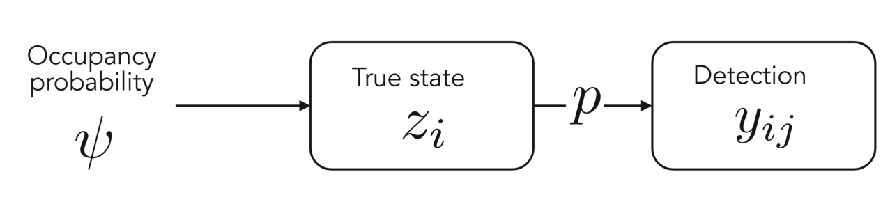
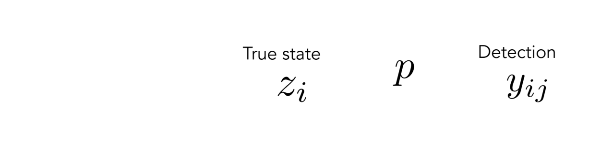
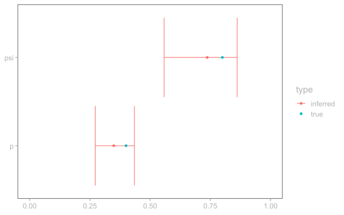
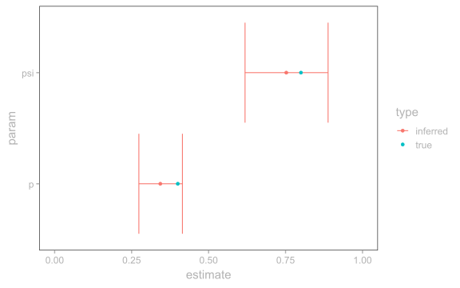

*This post was originally published on CESAB's [tips and tricks blog](https://frbcesab.github.io/tips-and-tricks/posts/2026-01-06-occupancy-models-in-r/)*

> Question. Why do we talk out loud when we know we're alone? Conjecture. Because we know we're not.
>
> -- *The Twelfth Doctor, Doctor Who (Series 8, Episode 4: "Listen")*

## Introduction

It's not because we didn't see something that this thing wasn't present. At least, that's the idea behind occupancy models: our observations aren't a direct representation of reality, but merely of what we can detect.


<figcaption>
Present ($z_i = 1$), but not detected ($y_{ij} = 0$). <it>Photo by Caroline Kirk (<a href = "https://www.independent.co.uk/news/uk/wildlife-photographer-owl-camera-image-b1818585.html"> source</a>)</it>
</figcaption>

Occupancy models were first published by MacKenzie et al. (2002) in the context of species occurrence modelling. Many extensions of occupancy have been proposed since, allowing to explicitly model occupancy dynamics (MacKenzie et al. 2003), take into account multiple species (Rota et al. 2016) or a continuous detection process (MacKenzie et al. 2003). This blog post only goes over the original simple occupancy model.

## Simple occupancy model



<figcaption>
Summary diagram of the structure of an occupancy model.
</figcaption>

To discriminate between the real and the observed states, occupancy models have one parameter for each of these states. The *true* presence or absence of a species in a given site $i$ is noted $z_i$. The *observed* presence or absence at site $i$ for a given visit $j$ is noted $y_{ij}$.

Then, the occupancy model for a given site $i$ is written as:

$$
y_{ij} \sim Bern(z_i~p)
$$

-   if the species is really present in site $i$ ($z_i = 1$), then it is detected ($y_{ij} = 1$) with probability $p$ according to a Bernoulli trial.
-   if the species is absent in site $i$ ($z_i = 0$), then we assume that it cannot be detected ($y_{ij}$ has to be zero) (no false detection).

In the occupancy framework, $z_i$ itself is governed by a Bernoulli trial of probability $\psi$.

$$
z_i \sim Bern(\psi)
$$

$\psi$ is called the *occupancy probability*: most of the times, when dealing with occupancy, that's the quantity we're really interested in.

## Simulate occupancy

Occupancy models are really easy to simulate: here is a sample R code to simulate data under a simple occupancy model.

``` r
set.seed(42)

M <- 100 # Number of sites
p <- 0.4 # Detection probability
psi <- 0.8 # Occupancy

# Simulate a number of visits for each site
nvisit <- rpois(n = M, lambda = 3)
nvisit[nvisit == 0] <- 1 # Don't allow zero visits

# Initialize vectors
z <- vector(mode = "numeric", length = M)
y <- vector(mode = "list", length = M)

for (i in 1:M) { # For each site
  # Simulate true presence/absence at site i
  zi <- rbinom(n = 1, size = 1, prob = psi)
  
  # Simulate observed presence/absence at site i for all visits
  yij <- rbinom(n = nvisit[i], 
                size = 1, prob = p*zi)
  
  z[i] <- zi # True sites states
  y[[i]] <- yij # Detections
}
```

In this simulation, the true proportion of occupied sites is 0.73. It is very close to the occupancy parameter $\psi = 0.8$ (but it is not *exactly* equal because of the stochastic nature of our model).

``` r
# True proportion of occupied sites
sum(z)/M
```

    [1] 0.73

The proportion of sites that we *detect* as occupied (what is called the *naive occupancy*) is 0.51, which wildly under-estimates $\psi$.

``` r
# Proportion of sites with at least one detection
sum(sapply(y, function(yi) any(yi != 0)))/M
```

    [1] 0.51

## Infer occupancy models in R

Now, the true value of occupancy models lies in the analysis of species detections. Inferring parameters from data is possible under three main conditions:

-   You have repeated visits. This is an crucial point which allows parameter identifiability.
-   The site remains in the same state (occupied or unoccupied) during the entire study period (closure assumption)[^1].
-   There are no false detections. The model automatically assumes that a detection event means that the site is really occupied, and false detections might induce a positive bias in occupancy estimates.

There are lots of strategies to infer occupancy models in R: among the most popular occupancy packages are `unmarked` and `spOccupancy`. Many people will also use Bayesian softwares like `JAGS` (e.g. with the R package `jagsUI` or `rjags`), `nimble` or Stan (with the R packages`cmdstanr`or`rstan`).

This blog post focuses on two of them: `unmarked` and Stan (using the R interface package `cmdstanr`).

### `unmarked`

The R package [`unmarked`](https://rbchan.github.io/unmarked/) has functions specifically designed for occupancy inference in R using maximum likelihood estimation (frequentist statistics).

First, we have to format the observed visits to an `unmarkedFrameOccu` object, as exemplified below:

``` r
library(unmarked)

# Format the list of observed detections y
max_visit <- max(sapply(y, length)) # Get maximum number of detections

# Transform y to matrix
y_matrix <- matrix(data = NA,
                   nrow = M,
                   ncol = max_visit)
for (i in 1:M) { # For each site
  nvisit_i <- length(y[[i]]) # Get number of visits
  y_matrix[i, 1:nvisit_i] <- y[[i]] # Fill n-th first rows with detection history
}

# Each row contains the detections at a site, filled with NAs for 
# sites that have less visits than the most visited one
head(y_matrix, 3)
```

         [,1] [,2] [,3] [,4] [,5] [,6] [,7] [,8]
    [1,]    0    0    0    1    1   NA   NA   NA
    [2,]    1    0    0    1    1    1   NA   NA
    [3,]    0    0   NA   NA   NA   NA   NA   NA

``` r
# Cast y_matrix to unmarkedFrameOccu
y_occu <- unmarked::unmarkedFrameOccu(y_matrix)
head(y_occu, 3)
```

    Data frame representation of unmarkedFrame object.
      y.1 y.2 y.3 y.4 y.5 y.6 y.7 y.8
    1   0   0   0   1   1  NA  NA  NA
    2   1   0   0   1   1   1  NA  NA
    3   0   0  NA  NA  NA  NA  NA  NA

In `unmarked`, the main function to infer parameters of a simpler occupancy model is `occu`, which uses a maximum likelihood estimator. In its simplest form, it only needs two arguments:

-   `formula`, which gives the formulas for the logit of $p$ and $\psi$. Here, since occupancy and detection are constant, we will set them to `~1 ~1`.
-   `data`: an `unmarkedFrameOccu` object containing observed detections (here, `y_occu`).

``` r
# Infer occupancy
occ <- unmarked::occu(formula = ~1 ~1, 
                      data = y_occu)

class(occ)
```

    [1] "unmarkedFitOccu"
    attr(,"package")
    [1] "unmarked"

``` r
summary(occ)
```


    Call:
    unmarked::occu(formula = ~1 ~ 1, data = y_occu)

    Occupancy (logit-scale):
     Estimate    SE    z P(>|z|)
         1.03 0.406 2.54  0.0112

    Detection (logit-scale):
     Estimate    SE     z  P(>|z|)
       -0.623 0.184 -3.38 0.000722

    AIC: 360.8983 
    Number of sites: 100

The output of the model is an `unmarkedFitOccu` object. The summary gives us the parameter estimates on the logit scale (i.e. we get $\text{logit}(p)$ and $\text{logit}(\psi)$), but we can get estimates on the natural scale with `backTransform`:

``` r
# Get detection (p) on the natural scale
unmarked::backTransform(occ, type = "det")
```

    Backtransformed linear combination(s) of Detection estimate(s)

     Estimate     SE LinComb (Intercept)
        0.349 0.0419  -0.623           1

    Transformation: logistic 

``` r
# Get occupancy (state parameter, psi) on the natural scale
unmarked::backTransform(occ, type = "state")
```

    Backtransformed linear combination(s) of Occupancy estimate(s)

     Estimate     SE LinComb (Intercept)
        0.737 0.0788    1.03           1

    Transformation: logistic 

And inferred parameters are a good approximation of true values (see figure below).

<details class="code-fold">
<summary>Code</summary>

``` r
p_inf <- unmarked::predict(occ, 
                           type = "det",
                           backTransform = TRUE,
                           newdata = data.frame(1))
psi_inf <- unmarked::predict(occ, 
                             type = "state",
                             backTransform = TRUE,
                             newdata = data.frame(1))

umk_param_df <- data.frame(param = c("p", "p", "psi", "psi"),
                           type = c("inferred", "true", "inferred", "true"),
                           estimate = c(p_inf$Predicted, p,
                                        psi_inf$Predicted, psi),
                           min = c(p_inf$lower, NA,
                                   psi_inf$lower, NA),
                           max = c(p_inf$upper, NA,
                                   psi_inf$upper, NA))

ggplot(umk_param_df) +
  geom_errorbar(data = subset(umk_param_df, type == "inferred"),
                aes(xmin = min, xmax = max, y = param,
                    color = type)) +
  geom_point(aes(x = estimate, y = param,
                 color = type)) +
  xlim(0, 1) +
  theme(axis.title = element_blank())
```

</details>

<figure>

<figcaption aria-hidden="true">True and inferred occupancy parameters with unmarked</figcaption>
</figure>

### Stan

Bayesian frameworks are also quite common to infer occupancy models, notably because they allow for more flexibility in the parameters specifications.
Here, we use [Stan](https://mc-stan.org/) through the R package [`cmdstanr`](https://mc-stan.org/cmdstanr/). Stan is a Bayesian software using optimized algorithms for the MCMC samplers.

In Stan, it is more efficient to use a Binomial model specification: we model the *number of detections* $n_i$ at each site:

$$n_i \sim Binom({n_{\text{visit}}}_i, z_i~p) \quad \text{and} \quad z_i \sim Bern(\psi)$$
where ${n_{\text{visit}}}_i$ the number of visits at site $i$. The equations above are strictly equivalent to the general occupancy model specification described earlier.

The first step is to format our data to be used by Stan. For that, we aggregate our visits to total number of detections, and save data parameters to a list named `dat`.

``` r
# Format data for Stan
n <- sapply(y, sum) # Number of detections
nvisit <- sapply(y, length) # Number of visits

# List of parameters for Stan
dat <- list(M = M,
            n = n,
            nvisit = nvisit)
```

#### Stan code

Then, we write the Stan code to infer our occupancy parameters. Stan is a programming language in its own right, and here we will only go over the Stan syntax quickly.

Stan programs are organized in code blocks, which are indicated by opening and closing brackets as shown below:

``` stan
data {
  // Code block to define data variables
}

parameters {
  // Code block to define parameters
}

model {
  // Code block to infer parameters
}
```

Note that Stan comments are specified with a double backslash `//`.
There are other optional code blocks (in fact, we will use one later), but the mandatory ones are shown above.

Let's start by defining variables in the data block. Stan variables are typed (i.e. we must define their type manually with the statements before variables names). Here, we only need the 3 variables that we specified on our data list above.

``` stan
data {
  int<lower=1> M; // Number of sites
  array[M] int nvisit; // Number of visits per sites-years
  array[M] int<lower=0> n; // Observations vector
}
```

Next, we define the parameters we want to infer in the parameters block. Here, they are defined on the logit scale because inferring unbounded parameters is more efficient in Stan.

``` stan
parameters {
  real psi_logit; // Value of psi on the logit scale
  real p_logit; // Value of p on the logit scale
}
```

The syntax of the model block is slightly more complex. There are 3 steps:

-   Define the parameters priors: here, we use flat normal priors centered on zero with a standard deviation of 3. This amounts to initializing the log-posterior with a log-transformed normal density, which is what `target += normal_lpdf(param | 0, 3)` does.
-   (Optional) Define intermediate variables. Here, we define `nvi` as a shortcut for the number of visits for site $i$.
-   Specify the model. This is where it requires a bit of work, because Stan cannot model discrete variables, so we have to update the posterior probability density manually instead. Fortunately, it is fairly easy to write with respect to $p$ and $\psi$. Here, we won't go into the details of these computations (but see <a href="#nte-posterior" class="quarto-xref">Note 1</a> below).

``` stan
model {
  // 1. Priors
  target += normal_lpdf(psi_logit | 0, 3);
  target += normal_lpdf(p_logit | 0, 3);

  // 2. Variables
  int nvi;

  // 3. Model specification
  for (i in 1:M) { // Iterate over sites
    nvi = nvisit[i]; // Number of visits
    if (n[i] > 0) { // The species was seen
      // Update log-likelihood: species was detected | present
      target += log_inv_logit(psi_logit) + 
        binomial_logit_lpmf(n[i] | nvi, p_logit);
    } else {
      // Update log-likelihood: species was non-detected | present
      // or non-detected | absent
      target += log_sum_exp(log_inv_logit(psi_logit) + binomial_logit_lpmf(0 | nvi, p_logit), 
        log1m_inv_logit(psi_logit));
    }
  }
}
```

> **Note 1: Log-posterior probability density computation**
>
> Below, we give a bit more explanations about the computation of the log-posterior.
>
> We distinguish between two cases to write the log-posterior:
>
> -   The species was detected at least once (case `n[i] > 0`). In that case, we know that it was present (no false detections), so the conditional log-probability that the species was seen $n_i$ times (which is what we update `target` with) is the product of the occupancy probability $\psi$ and the binomial density probability of $N = n$:
>     $$P(N = n_i | \{p, \psi\}) = \psi ~ \underbrace{\binom{{n_{\text{visit}}}_i}{n_i} p^{n_i} p^{{n_{\text{visit}}}_i - n_i}}_{\text{Binomial density probability}}$$
>     In Stan, parameters are on the logit scale: `psi_logit` is first back-transformed with `log_inv_logit` and Stan uses the Binomial density probability on the logit scale with `binomial_logit_lpmf`. Finally, because we compute the log-posterior, by properties of the logarithm the multiplication is changed to an addition.
>
> -   When the species was not seen (`else` block), we have two options. Either the species was present, but undetected; or it was absent. In that case, the conditional log-probability is the sum of these two events:
>     $$P(N = 0 | \{p, \psi\}) = \underbrace{\psi ~ \binom{{n_{\text{visit}}}_i}{0} p^{0} p^{{n_{\text{visit}}}_i - 0}}_{\text{present, undetected}} + \underbrace{(1 - \psi)}_{\text{absent}}$$
>     In Stan, `log_sum_exp` is an efficient way to compute a logarithm of the sum above, and `log1m_inv_logit(psi_logit)` returns $1 - \psi$.
>
> More details on log-likelihood computation can be found in [this blog post](https://htmlpreview.github.io/?https://github.com/bbennie/StanOccupancyModelTutorials/blob/master/OccupancyStanIntroduction.html) or in chapter 2.4.6 of Kéry and Royle (2016).

The final (and optional) code block we use here is a generated quantities block. It allows to compute $p$ and $\psi$ on the natural scale by using `inv_logit` to back-transform parameters.

``` stan
generated quantities {
  real<lower=0,upper=1> p = inv_logit(p_logit);
  real<lower=0, upper=1> psi = inv_logit(psi_logit);
}
```

The final Stan code is summarised below:

``` stan
data {
  int<lower=1> M; // Number of sites
  array[M] int nvisit; // Number of visits per sites-years
  array[M] int<lower=0> n; // Observations vector
}

parameters {
  real psi_logit; // Value of psi on the logit scale
  real p_logit; // Value of p on the logit scale
}

model {
  // 1. Priors
  target += normal_lpdf(psi_logit | 0, 3);
  target += normal_lpdf(p_logit | 0, 3);

  // 2. Variables
  int nvi;

  // 3. Model specification
  for (i in 1:M) { // Iterate over sites
    nvi = nvisit[i]; // Number of visits
    if (n[i] > 0) { // The species was seen
      // Update log-likelihood: species was detected | present
      target += log_inv_logit(psi_logit) + binomial_logit_lpmf(n[i] | nvi, p_logit);
    } else {
      // Update log-likelihood: species was non-detected | present
      // or non-detected | absent
      target += log_sum_exp(log_inv_logit(psi_logit) + binomial_logit_lpmf(0 | nvi, p_logit), log1m_inv_logit(psi_logit));
    }
  }
}

generated quantities {
  real<lower=0,upper=1> p = inv_logit(p_logit);
  real<lower=0, upper=1> psi = inv_logit(psi_logit);
}
```

#### Inference with `cmdstanr`

Now, we can use this code to infer our occupancy parameters from R. The first step is to compile the Stan model using `cmdstan_model`, as shown in the code below. Here, we assume the Stan code above is written in a file, which path is stored in the `stan_file` variable in R.

``` r
library(cmdstanr)

model <- cmdstanr::cmdstan_model(stan_file = stan_file)
```

We can finally perform the inference on our `model` object, with the `$sample` method from the `CmdStanModel` class.
The `$sample` method can be customised with many arguments, but here we only use our data list (`data`), the number of burn-in iterations (`warmup`), the number of post-burn-in iterations (`iter_sampling`) and the number of chains and their parallelisation (`chains` and `parallel_chains`).

``` r
stanfit <- model$sample(data = dat,
                        iter_warmup = 200,
                        iter_sampling = 500,
                        chains = 4,
                        parallel_chains = 4)
```

We can inspect the inferred values with the `$summary` method.

``` r
(stan_inf <- stanfit$summary())
```

    # A tibble: 5 × 10
      variable      mean   median     sd    mad       q5      q95  rhat ess_bulk
      <chr>        <dbl>    <dbl>  <dbl>  <dbl>    <dbl>    <dbl> <dbl>    <dbl>
    1 lp__      -115.    -114.    1.05   0.798  -117.    -114.    1.00      893.
    2 psi_logit    1.17     1.11  0.506  0.446     0.483    2.07  1.000     873.
    3 p_logit     -0.655   -0.654 0.191  0.190    -0.977   -0.343 1.00      689.
    4 p            0.343    0.342 0.0428 0.0426    0.274    0.415 1.00      689.
    5 psi          0.752    0.751 0.0815 0.0841    0.618    0.888 1.000     873.
    # ℹ 1 more variable: ess_tail <dbl>

The summary gives information about the log-posterior (`lp__`) and all inferred parameters (on the logit and the natural scales).
For each parameter, a set of summary statistics which summarize their distribution are given. Three diagnostic parameters to evaluate MCMC sampling are also given (a convergence statistic $\hat{R}$, and effective sample sizes (ESS)).

Finally, a graphical summary shows that inferred parameters are close to the real ones:

<details class="code-fold">
<summary>Code</summary>

``` r
library(ggplot2)

stan_param_df <- data.frame(param = c("p", "p", "psi", "psi"),
                            type = c("inferred", "true", "inferred", "true"),
                            estimate = c(stan_inf$mean[stan_inf$variable == "p"], p,
                                         stan_inf$mean[stan_inf$variable == "psi"], psi),
                            min = c(stan_inf$q5[stan_inf$variable == "p"], NA,
                                    stan_inf$q5[stan_inf$variable == "psi"], NA),
                            max = c(stan_inf$q95[stan_inf$variable == "p"], NA,
                                    stan_inf$q95[stan_inf$variable == "psi"], NA))

ggplot(stan_param_df) +
  geom_errorbar(data = subset(stan_param_df, type == "inferred"),
                aes(xmin = min, xmax = max, y = param,
                    color = type)) +
  geom_point(aes(x = estimate, y = param,
                 color = type)) +
  xlim(0, 1)
```

</details>

<figure>

<figcaption aria-hidden="true">True and inferred occupancy parameters with Stan</figcaption>
</figure>

## Conclusion

In this blog post, we have seen how the simple occupancy model is written and how simulate data under an occupancy model in R. We have then inferred occupancy models with the `unmarked` and `cmdstanr` R packages.

There is much more one can do with occupancy models. In particular, the parameters $p$ and $\psi$ are often not constant, and can be modeled as functions of covariates with a logit link, such as $\text{logit}(\psi_i) = \beta_0 + \beta_1 x_i$ or $\text{logit}(p_{ij}) = \beta_0 + \beta_1 x_{ij}$. But this is a story for another blog post...

## References

Kéry, Marc, and J. Andrew Royle. 2016. *Applied Hierarchical Modeling in Ecology: Analysis of Distribution, Abundance and Species Richness in R and BUGS*. Amsterdam; Boston: Elsevier/AP, Academic Press is an imprint of Elsevier.

MacKenzie, Darryl I., James D. Nichols, James E. Hines, Melinda G. Knutson, and Alan B. Franklin. 2003. "Estimating Site Occupancy, Colonization, and Local Extinction When a Species Is Detected Imperfectly." *Ecology* 84 (8): 2200--2207. <https://doi.org/10.1890/02-3090>.

MacKenzie, Darryl I., James D. Nichols, Gideon B. Lachman, Sam Droege, J. Andrew Royle, and Catherine A. Langtimm. 2002. "Estimating Site Occupancy Rates When Detection Probabilities Are Less Than One." *Ecology* 83 (8): 2248--55. [https://doi.org/10.1890/0012-9658(2002)083\[2248:ESORWD\]2.0.CO;2](https://doi.org/10.1890/0012-9658(2002)083[2248:ESORWD]2.0.CO;2).

Rota, Christopher T., Marco A. R. Ferreira, Roland W. Kays, Tavis D. Forrester, Elizabeth L. Kalies, William J. McShea, Arielle W. Parsons, and Joshua J. Millspaugh. 2016. "A Multispecies Occupancy Model for Two or More Interacting Species." *Methods in Ecology and Evolution* 7 (10): 1164--73. <https://onlinelibrary.wiley.com/doi/abs/10.1111/2041-210X.12587>.

Valente, Jonathon J., Vitek Jirinec, and Matthias Leu. 2024. "Thinking Beyond the Closure Assumption: Designing Surveys for Estimating Biological Truth with Occupancy Models." *Methods in Ecology and Evolution* 15 (12): 2289--2300. <https://doi.org/10.1111/2041-210X.14439>.

## Other resources

-   Richard A. Erickson's [GitHub repository](https://github.com/bbennie/StanOccupancyModelTutorials) with Stan occupancy models tutorials
-   Olivier Gimenez's [workshop](https://oliviergimenez.github.io/occupancy-workshop/) with resources on occupancy modelling with `unmarked`

[^1]: In practice, this assumption is often violated in studies using occupancy models: this has been discussed extensively in the literature (see for example Valente, Jirinec, and Leu (2024)), and authors have proposed to critically evaluate whether the closure assumption is met to interpret the inferred occupancy.
