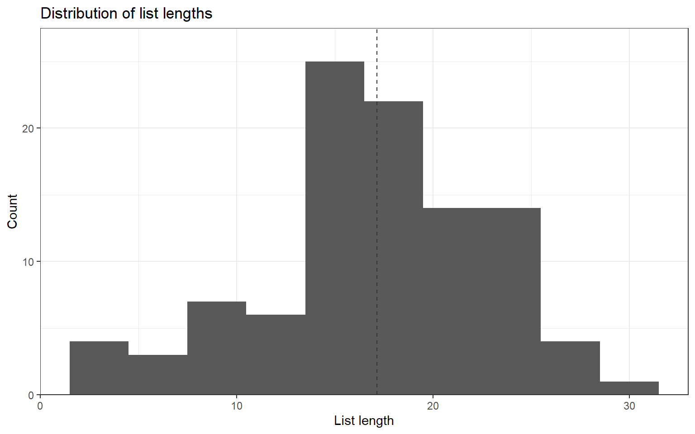
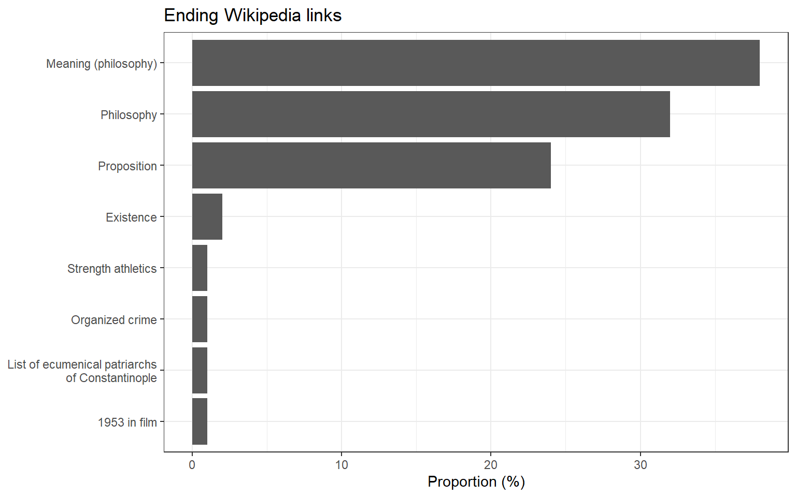

<link href="index_files/libs/htmltools-fill-0.5.8.1/fill.css" rel="stylesheet" />
<script src="index_files/libs/htmlwidgets-1.6.4/htmlwidgets.js"></script>
<script src="index_files/libs/d3-bundle-5.16.0/d3-bundle.min.js"></script>
<script src="index_files/libs/d3-lasso-0.0.5/d3-lasso.min.js"></script>
<script src="index_files/libs/save-svg-as-png-1.4.17/save-svg-as-png.min.js"></script>
<script src="index_files/libs/flatbush-4.4.0/flatbush.min.js"></script>
<link href="index_files/libs/ggiraphjs-0.8.10/ggiraphjs.min.css" rel="stylesheet" />
<script src="index_files/libs/ggiraphjs-0.8.10/ggiraphjs.min.js"></script>
<script src="index_files/libs/girafe-binding-0.9.0/girafe.js"></script>


Rumour has it all articles on Wikipedia eventually lead to Philosophy. This phenomenon even has [its own Wikipedia article](https://en.wikipedia.org/wiki/Wikipedia_philosophy_phenomenon).

So I thought this would be a fun way to combine two of my passions (R and Wikipedia) to put this theory to a test!

## Using Wikimedia's API

To try this out, I used the [Wikimedia API](https://api.wikimedia.org/wiki/Main_Page)[^1]. This allowed me to query several Wikipedia pages and get their chain of links.

To interact wit the API, I use the packages `httr` to query the API, and `jsonlite` to format results.

The code below sets up the basis for querying the API, using the credentials I got from [this page](https://api.wikimedia.org/wiki/Getting_started_with_Wikimedia_APIs). This is not necessary, but gets you more requests ([5000 per hour](https://wikitech.wikimedia.org/wiki/API_Portal/Deprecation#Rate_limits)).

``` r
key <- Sys.getenv("API_KEY")
language <- "en"

url <- paste0("https://", language, ".wikipedia.org/w/api.php")
header <- add_headers("Authorization" = paste("Bearer", key))
```

## Getting a subset of articles

First, I'm going to query a subset of Wikipedia articles. Here, I chose 100 articles to keep it scalable, and I will limit the link search to 50 downstream articles before ending up on a loop.

``` r
n_articles <- 100
chain_max <- 50
```

So let's use the code below to get 100 random Wikipedia pages: for this I perform a [Query Action](https://www.mediawiki.org/wiki/API:Query#API_documentation) using the [Random module](https://www.mediawiki.org/wiki/API:Random).

I use `httr::GET` to construct the query and use my API credentials (but you could construct the query string from scratch as well: here, it would be `https://en.wikipedia.org/w/api.php?action=query&format=json&list=random&rnfilterredir=nonredirects&rnnamespace&rnlimit=100`).
To format results to a data.frame, I use `jsonlite::fromJSON`.

``` r
# Get random Wikipedia articles
par <- list("action" = "query",
            "format" = "json",
            "list" = "random",
            "rnfilterredir" = "nonredirects",
            "rnnamespace" = 0,
            "rnlimit" = n_articles)

# Format results
res <- httr::GET(url, header,
                 query = par)
resj <- jsonlite::fromJSON(content(res, "text"), 
                           flatten = TRUE)
random_pages <- resj$query$random

# Save results (because there is no seed in the query)
saveRDS(random_pages, file = file.path(basepath, "data", "pages.rds"))
```

Here are a few of these random pages:

``` r
head(random_pages)
```

            id ns                               title
    1   564674  0      English football league system
    2 15551349  0                            Stânceni
    3 27639612  0 Guido de Bres Christian High School
    4   164634  0                                Pune
    5 44019719  0                            Invincea
    6 65709492  0                    More (K/DA song)

## Traverse links chains

Okay so now the real work begins.

Below, I write a little function to get the first link from the text of a Wikipedia article. A few subtleties (followed from [here](https://en.wikipedia.org/wiki/Wikipedia:Getting_to_Philosophy)) are:

-   I get links from paragraphs or bullet lists only (`p` or `ul` elements), to avoid infoboxes and other decorations;
-   I exclude links between parentheses, to discard languages links.

(Theoretically, I would also have to discard italicized links, but this case seems to be pretty rare and not likely to bias these results so I didn't.)

``` r
#' Get first link
#' 
#' Get first link from a Wikipedia article
#'
#' @param article_str String representation of the article (from parse query)
#' @param return_title Return the article title instead of the link?
#'
#' @returns If `return_title` is `TRUE`, returns the Wikipedia article title of the first link.
#' Else returns the first link of the text (in HTML format as `<a href="...">...</a>`)
#' @export
get_first_link <- function(article_str, return_title = TRUE) {
  # Parse to HTML
  article_html <- read_html(article_str)

  # Get all links pointing to a wiki
  # (Exclude special pages beginning with xxx: (e.g. Help, Wikipedia:)))
  
  # First try with paragraphs
  links <- article_html |> 
    html_elements("p") |> 
    html_elements("a") |> 
    grep(pattern = "href=\"/wiki/(?![A-z]+:)", 
         perl = TRUE, value = TRUE)
  
  # If no luck, try with ul
  if (length(links) == 0) {
    links <- article_html |> 
      html_elements("ul") |> 
      html_elements("a") |> 
      grep(pattern = "href=\"/wiki/(?![A-z]+:)", 
           perl = TRUE, value = TRUE)
  }
  
  # Get first link
  for (l in links) {
    # Is the link parenthesized?
    # Match opening parenthesis [text], link, [text], closing parenthesis
    # Text is anything but parentheses
    is_parenthesized <- grepl(pattern = paste0("\\([^()]*", l, "[^()]*\\)"), 
                              x = article_html, perl = TRUE)
    if (!is_parenthesized) {
      # It's the first link without parentheses
      res <- l
      break
    }
    # Else, continue
  }
  
  if (return_title) {
    # Get corresponding page title
    res <- gsub(".*href\\=\"/wiki/(\\S+)\".*", "\\1", res)
  }
  
  return(res)
}
```

Now, for the real bit of work below: for each of the starting articles, I follow the first link, and the next, and the next... Until:

-   I end up on a loop (discovered in the current article or in a previous one)
-   Or I reach the upwards limit of links defined above (`chain_max` = 50)

To get the first link, I use the function `get_first_link` defined above on the result of the [Parse Action](https://www.mediawiki.org/wiki/API:Parsing_wikitext) from my initial list of random articles, which gives the full text of the Wikipedia article.

Running the code below takes about 10 minutes in my setup.

``` r
# Initialize links list
all_links <- vector(mode = "list", length = n_articles)
unique_links <- c()

for (i in 1:n_articles) {
  # Get first page
  starting_page <- random_pages$title[i]
  
  message("Traversing links for article ",
          starting_page, " (", i, "/", n_articles, 
          ") ====================")
  
  # Initialize list
  links_vec <- starting_page
  
  # Initialize search page
  page <- starting_page
  
  for (j in 1:chain_max) {
    message("Link #", j, " ---")
    # Get Wikipedia article body
    par <- list("action" = "parse",
                "page" = page,
                "format" = "json",
                "redirects" = "",
                "prop" = "text")
  
    res <- httr::GET(url, header,
                     query = par)
    resj <- jsonlite::fromJSON(content(res, "text"), 
                               flatten = TRUE)
    
    # Extract links from article body
    article_str <- resj$parse$text$`*`
    
    # Get first link
    first_link <- get_first_link(article_str)
    # Replace with spaces
    first_link <- gsub(pattern = "_", replacement = " ", first_link)
    # And decode URL for special characters (e.g. %E2%80%93)
    first_link <- URLdecode(first_link)
    
    if (first_link %in% links_vec) {
      message("Loop detected for '", starting_page, "' with '", 
              first_link, "' : exiting loop")
      # Store results before exiting
      links_vec <- c(links_vec, first_link)
      break
    } else if (first_link %in% unique_links) {
      message("Link ", first_link, " already detected: exiting loop")
      # Store results before exiting
      links_vec <- c(links_vec, first_link)
      break
    } else {
      message("First link: ", first_link)
      # Store results
      links_vec <- c(links_vec, first_link)
      # Update search page
      page <- first_link
    }
  }
  
  # Add the article links chain to articles chains
  all_links[[i]] <- links_vec
  
  # Get new links from last loop
  new_links <- links_vec[1:(length(links_vec)-1)]
  new_links <- new_links[which(!(new_links %in% unique_links))]
  
  # Get unique links
  unique_links <- c(unique_links, new_links)
}

# Save results
saveRDS(all_links, file = file.path(basepath, "data", "links.rds"))
```

Ultimately, this code produces a list of chains of links from article to article. Each chains stops when a loop has been detected.

``` r
head(all_links, 3)
```

    [[1]]
     [1] "English football league system" "League system"                 
     [3] "Hierarchy"                      "Ancient Greek language"        
     [5] "Greek language"                 "Indo-European language"        
     [7] "Bronze Age"                     "Archaeology"                   
     [9] "Analysis"                       "Complexity"                    
    [11] "System"                         "Open system (systems theory)"  
    [13] "Isolated system"                "Outline of physical science"   
    [15] "Natural science"                "Empirical evidence"            
    [17] "Evidence"                       "Proposition"                   
    [19] "Meaning (philosophy)"           "Philosophy of language"        
    [21] "Philosophy"                     "Existence"                     
    [23] "Reality"                        "Everything"                    
    [25] "Antithesis"                     "Proposition"                   

    [[2]]
     [1] "Stânceni"              "Mureș County"          "Romania"              
     [4] "Central Europe"        "Europe"                "Continent"            
     [7] "Convention (norm)"     "Social norm"           "Acceptance"           
    [10] "Psychology"            "Mind"                  "Thought"              
    [13] "Cognition"             "Knowledge"             "Declarative knowledge"
    [16] "Awareness"             "Philosophy"           

    [[3]]
    [1] "Guido de Bres Christian High School" "Hamilton, Ontario"                  
    [3] "Provinces and territories of Canada" "Canada"                             
    [5] "North America"                       "Continent"                          

## Results

And now, let's get to the part we've all been waiting for: do all articles really lead to "Philosophy"?

First, let's format the results to a network object using the `igraph` package.

``` r
# Format output for network
nk_list <- lapply(all_links, function(l) {
  cbind(l[1:(length(l)-1)], l[2:length(l)])})
nk <- do.call("rbind", nk_list)

# Create graph
g <- igraph::graph_from_edgelist(nk, directed = TRUE)
```

Next, reconstruct the chain of links for each starting article (because of the way I coded the query, some articles stop before reaching their actual loop because the loop was explored in another one).

``` r
# Get all starting articles
starting_nodes <- sapply(all_links, function(l) l[1])

# Initialize list
complete_paths <- vector(mode = "list", 
                         length = length(starting_nodes))

for (i in 1:length(starting_nodes)) {
  # Get all simple paths (excluding loops)
  simple_paths <- all_simple_paths(from = starting_nodes[i],
                                   g, mode = "out")
  # Get the longest
  longest_path_ind <- which.max(sapply(simple_paths, length))
  longest_path <- simple_paths[[longest_path_ind]]
  
  # Repeat the last vertex to know where the loop starts
  last_vertex <- longest_path[length(longest_path)]
  loop_vertex <- neighbors(g, last_vertex)
  
  # Create final path
  longest_path <- c(longest_path, loop_vertex)
  longest_path <- longest_path$name
  
  complete_paths[[i]] <- longest_path
}
```

First, let's investigate the length of links chains (i.e., the length of links chain before ending up on a loop).

<details class="code-fold">
<summary>Code</summary>

``` r
# Get mean path length (without loop)
before_loop <- lapply(complete_paths, 
                      function(l) {
                        dup <- which(l == l[duplicated(l)])
                        l[1:min(dup)]
                        })

link_length <- sapply(before_loop, length)
mean_length <- mean(link_length)

ggplot() +
  geom_histogram(aes(x = link_length),
                 binwidth = 3) +
  geom_vline(aes(xintercept = mean_length), 
             linetype = "dashed", color = "grey20") +
  ggtitle("Distribution of list lengths") +
  ylab("Count") +
  xlab("List length") +
  scale_y_continuous(expand = expansion(mult = c(0, .1))) +
  theme_bw()
```

</details>



Here, the mean links chain is 16.8, and doesn't go over 30.

And for the long-awaited result: Where do articles end up?

<details class="code-fold">
<summary>Code</summary>

``` r
# Get the ending links for all articles
list_length <- sapply(complete_paths, length)
end_links <- sapply(seq_along(complete_paths), 
                    function(i) complete_paths[[i]][list_length[i]])

end_links_df <- data.frame(article = names(table(end_links)),
                           prop = as.numeric(table(end_links))/n_articles*100)
end_links_df$article[end_links_df$article == "List of ecumenical patriarchs of Constantinople"] <- "List of ecumenical patriarchs\nof Constantinople"

ggplot(end_links_df, aes(x = prop,
                         y = reorder(article, prop))) +
  geom_col() +
  xlab("Proportion (%)") +
  ggtitle("Ending Wikipedia links") +
  theme_bw() +
  theme(axis.title.y = element_blank())
```

</details>



Here, 68% of articles from my subset end up on philosophy: that is, they reach a loop on the "Philosophy" article (which loops on itself eventually). But a sizeable portion of articles also end up on "Proposition" or "Meaning (philosophy). So, was this Philosophy thing a bit of an oversell?

The graph below shows the full story. Blue dots show starting articles and red dots end articles. You can hover articles to see their name.

<details class="code-fold">
<summary>Code</summary>

``` r
# Prepare data for plot ---
# Set node type (start, end or none)
vertices <- V(g)$name
ind_start <- match(starting_nodes, vertices)
ind_end <- match(end_links, vertices)

type <- rep("none", length(V(g)))
type[ind_start] <- "start"
type[ind_end] <- "end"

V(g)$type <- type

# Set degree attribute
V(g)$degree <- degree(g, mode = "in")

# Get mutual edges (to invert curvature)
mutual <- which_mutual(g)
curvature <- ifelse(mutual, 0.5, 0)

# Plot graph ---
lay <- create_layout(g, "stress",
                     bbox = 10)
gg <- ggraph(lay) +
  geom_edge_arc(strength = curvature) +
  geom_point_interactive(aes(x = x, y = y, size = degree,
                             color = type, tooltip = name), 
                         show.legend = FALSE) +
  scale_size(range = c(1, 3)) +
  scale_color_manual(values = c("start" = "cornflowerblue", 
                                "none" = "black",
                                "end" = "darkred")) +
  theme_void() +
  theme(plot.margin = margin(t = 10, r = 10, b = 10, l = 10))

girafe(gg)
```

</details>
<div class="girafe html-widget html-fill-item" id="htmlwidget-0f3cc9bc7890f6708a2e" style="width:768px;height:480px;"></div>
<script type="application/json" data-for="htmlwidget-0f3cc9bc7890f6708a2e">{"x":{"html":"","js":null,"uid":"svg_84b6ad0b_16f3_40a0_87a1_adbaaacd8865","ratio":1.6,"settings":{"tooltip":{"css":".tooltip_SVGID_ { padding:5px;background:black;color:white;border-radius:2px;text-align:left; ; position:absolute;pointer-events:none;z-index:999;}","placement":"doc","opacity":0.9,"offx":10,"offy":10,"use_cursor_pos":true,"use_fill":false,"use_stroke":false,"delay_over":200,"delay_out":500},"hover":{"css":".hover_data_SVGID_ { fill:orange;stroke:black;cursor:pointer; }\ntext.hover_data_SVGID_ { stroke:none;fill:orange; }\ncircle.hover_data_SVGID_ { fill:orange;stroke:black; }\nline.hover_data_SVGID_, polyline.hover_data_SVGID_ { fill:none;stroke:orange; }\nrect.hover_data_SVGID_, polygon.hover_data_SVGID_, path.hover_data_SVGID_ { fill:orange;stroke:none; }\nimage.hover_data_SVGID_ { stroke:orange; }","reactive":true,"nearest_distance":null},"hover_inv":{"css":""},"hover_key":{"css":".hover_key_SVGID_ { fill:orange;stroke:black;cursor:pointer; }\ntext.hover_key_SVGID_ { stroke:none;fill:orange; }\ncircle.hover_key_SVGID_ { fill:orange;stroke:black; }\nline.hover_key_SVGID_, polyline.hover_key_SVGID_ { fill:none;stroke:orange; }\nrect.hover_key_SVGID_, polygon.hover_key_SVGID_, path.hover_key_SVGID_ { fill:orange;stroke:none; }\nimage.hover_key_SVGID_ { stroke:orange; }","reactive":true},"hover_theme":{"css":".hover_theme_SVGID_ { fill:orange;stroke:black;cursor:pointer; }\ntext.hover_theme_SVGID_ { stroke:none;fill:orange; }\ncircle.hover_theme_SVGID_ { fill:orange;stroke:black; }\nline.hover_theme_SVGID_, polyline.hover_theme_SVGID_ { fill:none;stroke:orange; }\nrect.hover_theme_SVGID_, polygon.hover_theme_SVGID_, path.hover_theme_SVGID_ { fill:orange;stroke:none; }\nimage.hover_theme_SVGID_ { stroke:orange; }","reactive":true},"select":{"css":".select_data_SVGID_ { fill:red;stroke:black;cursor:pointer; }\ntext.select_data_SVGID_ { stroke:none;fill:red; }\ncircle.select_data_SVGID_ { fill:red;stroke:black; }\nline.select_data_SVGID_, polyline.select_data_SVGID_ { fill:none;stroke:red; }\nrect.select_data_SVGID_, polygon.select_data_SVGID_, path.select_data_SVGID_ { fill:red;stroke:none; }\nimage.select_data_SVGID_ { stroke:red; }","type":"multiple","only_shiny":true,"selected":[]},"select_inv":{"css":""},"select_key":{"css":".select_key_SVGID_ { fill:red;stroke:black;cursor:pointer; }\ntext.select_key_SVGID_ { stroke:none;fill:red; }\ncircle.select_key_SVGID_ { fill:red;stroke:black; }\nline.select_key_SVGID_, polyline.select_key_SVGID_ { fill:none;stroke:red; }\nrect.select_key_SVGID_, polygon.select_key_SVGID_, path.select_key_SVGID_ { fill:red;stroke:none; }\nimage.select_key_SVGID_ { stroke:red; }","type":"single","only_shiny":true,"selected":[]},"select_theme":{"css":".select_theme_SVGID_ { fill:red;stroke:black;cursor:pointer; }\ntext.select_theme_SVGID_ { stroke:none;fill:red; }\ncircle.select_theme_SVGID_ { fill:red;stroke:black; }\nline.select_theme_SVGID_, polyline.select_theme_SVGID_ { fill:none;stroke:red; }\nrect.select_theme_SVGID_, polygon.select_theme_SVGID_, path.select_theme_SVGID_ { fill:red;stroke:none; }\nimage.select_theme_SVGID_ { stroke:red; }","type":"single","only_shiny":true,"selected":[]},"zoom":{"min":1,"max":1,"duration":300},"toolbar":{"position":"topright","pngname":"diagram","tooltips":null,"fixed":false,"hidden":[],"delay_over":200,"delay_out":500},"sizing":{"rescale":true,"width":1}}},"evals":[],"jsHooks":[]}</script>

``` r
# Number of articles containing "Philosophy"
n_philo <- sum(sapply(complete_paths, function(p) "Philosophy" %in% p))
```

In fact, a vast majority of the articles end up on a loop which passes through philosophy (94% in my small example, but Wikipedia itself gives 97% in 2016).

## Conclusion

[^1]: The API is undergoing important changes in 2026 so apologies if any links are not working
