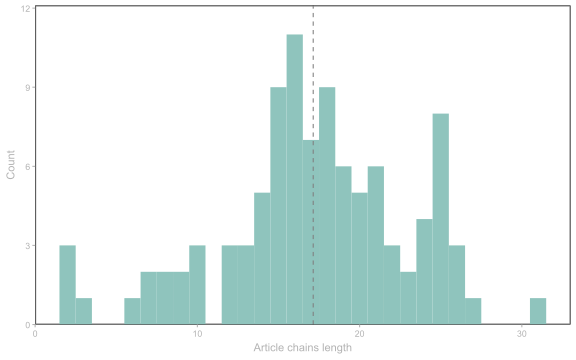
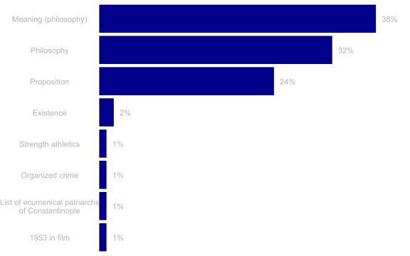

<link href="index_files/libs/htmltools-fill-0.5.8.1/fill.css" rel="stylesheet" />
<script src="index_files/libs/htmlwidgets-1.6.4/htmlwidgets.js"></script>
<script src="index_files/libs/d3-bundle-5.16.0/d3-bundle.min.js"></script>
<script src="index_files/libs/d3-lasso-0.0.5/d3-lasso.min.js"></script>
<script src="index_files/libs/save-svg-as-png-1.4.17/save-svg-as-png.min.js"></script>
<script src="index_files/libs/flatbush-4.4.0/flatbush.min.js"></script>
<link href="index_files/libs/ggiraphjs-0.8.10/ggiraphjs.min.css" rel="stylesheet" />
<script src="index_files/libs/ggiraphjs-0.8.10/ggiraphjs.min.js"></script>
<script src="index_files/libs/girafe-binding-0.9.0/girafe.js"></script>


## Introduction

Rumour has it all articles on Wikipedia eventually lead to Philosophy. This phenomenon even has [its own Wikipedia article](https://en.wikipedia.org/wiki/Wikipedia_philosophy_phenomenon).

I thought it would be fun to put this theory to a test. Read my findings in the post below!

## Getting first links

In this section, I explain how I used the Wikipedia API to get the first links for each page. You can skip directly to the [results](#results) if that's what you're interested in.

### Using Wikimedia's API

To access Wikipedia pages data, I used the [Wikimedia API](https://api.wikimedia.org/wiki/Main_Page)[^1]. The API allowed me to query several Wikipedia pages, and get the first link for each of them.

To interact wit the API, I used the packages `httr` and `jsonlite` (to query the API and format results).

The code below sets up the basis for querying the API, using the credentials I got from [this page](https://api.wikimedia.org/wiki/Getting_started_with_Wikimedia_APIs). This is not necessary, but gets you more requests ([5000 per hour](https://wikitech.wikimedia.org/wiki/API_Portal/Deprecation#Rate_limits)).

``` r
key <- Sys.getenv("API_KEY")
language <- "en"

url <- paste0("https://", language, ".wikipedia.org/w/api.php")
header <- add_headers("Authorization" = paste("Bearer", key))
```

### Getting a subset of articles

First, I'm going to query a subset of 100 starting Wikipedia articles to test the "philosophy hypothesis". I will also limit the link search to 50 downstream articles before ending up on a loop (but as you'll see later, this limit was never reached).

``` r
n_articles <- 100
chain_max <- 50
```

Now, let's get our 100 random Wikipedia pages: for this, I perform a [Query Action](https://www.mediawiki.org/wiki/API:Query#API_documentation) using the [Random module](https://www.mediawiki.org/wiki/API:Random).

``` r
# Get random Wikipedia articles
par <- list("action" = "query",
            "format" = "json",
            "list" = "random",
            "rnfilterredir" = "nonredirects",
            "rnnamespace" = 0,
            "rnlimit" = n_articles)

# Format results
res <- httr::GET(url, header,
                 query = par)
resj <- jsonlite::fromJSON(content(res, "text"), 
                           flatten = TRUE)
random_pages <- resj$query$random

# Save results (because there is no seed in the query)
saveRDS(random_pages, file = file.path(basepath, "data", "pages.rds"))
```

I used `httr::GET` to construct the query string using my API credentials, but you could also construct the query from scratch (here, it would be `https://en.wikipedia.org/w/api.php?action=query&format=json&list=random&rnfilterredir=nonredirects&rnnamespace&rnlimit=100`). Then, I used `jsonlite::fromJSON` to format the results as a data.frame in R.

Here are a few of these random pages:

``` r
head(random_pages, n = 5)
```

            id ns                               title
    1   564674  0      English football league system
    2 15551349  0                            Stânceni
    3 27639612  0 Guido de Bres Christian High School
    4   164634  0                                Pune
    5 44019719  0                            Invincea

### Traversing links chains

This section performs the main part of our analysis: hopping from page to page through the first link.

First, I write a `get_first_link` function to get the first link from the text of a Wikipedia article. A few subtleties (followed from [here](https://en.wikipedia.org/wiki/Wikipedia:Getting_to_Philosophy)) are:

-   I get links from paragraphs or bullet lists only (`p` or `ul` elements, excluding tables), to avoid infoboxes and other decorations;
-   I exclude links between parentheses, to discard languages links.

(Theoretically, I would also have to discard italicized links, but this case seems to be pretty rare and not likely to bias these results so I didn't.)

<details class="code-fold">
<summary>Code</summary>

``` r
#' Get first link
#' 
#' Get first link from a Wikipedia article
#'
#' @param article_str String representation of the article (from parse query)
#' @param return_title Return the article title instead of the link?
#'
#' @returns If `return_title` is `TRUE`, returns the Wikipedia article title of the first link.
#' Else returns the first link of the text (in HTML format as `<a href="...">...</a>`)
#' @export
get_first_link <- function(article_str, return_title = TRUE) {
  # Parse to HTML
  article_html <- read_html(article_str)

  # remove all tables (infobox)
  xml2::xml_remove(rvest::html_nodes(article_html, "table"))

  # Get all links pointing to a wiki
  # (Exclude special pages beginning with xxx: (e.g. Help, Wikipedia:)))
  
  # First try with paragraphs
  links <- article_html |> 
    html_elements("p") |> 
    html_elements("a") |> 
    grep(pattern = "href=\"/wiki/(?![A-z]+:)", 
         perl = TRUE, value = TRUE)
  
  # If no luck, try with ul
  if (length(links) == 0) {
    links <- article_html |> 
      html_elements("ul") |> 
      html_elements("a") |> 
      grep(pattern = "href=\"/wiki/(?![A-z]+:)", 
           perl = TRUE, value = TRUE)
  }
  
  # Get first link
  for (l in links) {
    # Is the link parenthesized?
    # Match opening parenthesis [text], link, [text], closing parenthesis
    # Text is anything but parentheses
    is_parenthesized <- grepl(pattern = paste0("\\([^()]*", l, "[^()]*\\)"), 
                              x = article_html, perl = TRUE)
    if (!is_parenthesized) {
      # It's the first link without parentheses
      res <- l
      break
    }
    # Else, continue
  }
  
  if (return_title) {
    # Get corresponding page title
    res <- gsub(".*href\\=\"/wiki/(\\S+)\".*", "\\1", res)
  }
  
  return(res)
}
```

</details>

Next, I iterate over each of the starting articles, following the first link, and the next, and the next... Until:

-   I end up on a loop (discovered in the current article or in a previous one)
-   Or I reach the upwards limit of links defined above (`chain_max` = 50)

To get articles' first links, I use my custom `get_first_link` function on the articles' text (obtained through [Parse Actions](https://www.mediawiki.org/wiki/API:Parsing_wikitext)). Running the code below takes about 10 minutes in my setup.

``` r
# Initialize links list
all_links <- vector(mode = "list", length = n_articles)
unique_links <- c()

for (i in 1:n_articles) { # iterate over starting articles
  # Get starting article
  starting_page <- random_pages$title[i]
  
  message("Traversing links for article ",
          starting_page, " (", i, "/", n_articles, 
          ") ====================")
  
  # Initialize list
  links_vec <- starting_page
  
  # Initialize search page
  page <- starting_page
  
  for (j in 1:chain_max) {
    message("Link #", j, " ---")
    # Get Wikipedia article body
    par <- list("action" = "parse",
                "page" = page,
                "format" = "json",
                "redirects" = "",
                "prop" = "text")
  
    res <- httr::GET(url, header,
                     query = par)
    resj <- jsonlite::fromJSON(content(res, "text"), 
                               flatten = TRUE)
    
    # Extract links from article body
    article_str <- resj$parse$text$`*`
    
    # Get first link
    first_link <- get_first_link(article_str)
    # Replace with spaces
    first_link <- gsub(pattern = "_", replacement = " ", first_link)
    # And decode URL for special characters (e.g. %E2%80%93)
    first_link <- URLdecode(first_link)
    
    if (first_link %in% links_vec) {
      message("Loop detected for '", starting_page, "' with '", 
              first_link, "' : exiting loop")
      # Store results before exiting
      links_vec <- c(links_vec, first_link)
      break
    } else if (first_link %in% unique_links) {
      message("Link ", first_link, " already detected: exiting loop")
      # Store results before exiting
      links_vec <- c(links_vec, first_link)
      break
    } else {
      message("First link: ", first_link)
      # Store results
      links_vec <- c(links_vec, first_link)
      # Update search page
      page <- first_link
    }
  }
  
  # Add the article links chain to articles chains
  all_links[[i]] <- links_vec
  
  # Get new links from last loop
  new_links <- links_vec[1:(length(links_vec)-1)]
  new_links <- new_links[which(!(new_links %in% unique_links))]
  
  # Get unique links
  unique_links <- c(unique_links, new_links)
}

# Save results
saveRDS(all_links, file = file.path(basepath, "data", "links.rds"))
```

Ultimately, this code produces a list of chains of links from article to article, where each chains stops when a loop has been detected.

``` r
# See the first 3 link chains
head(all_links, 3)
```

    [[1]]
     [1] "English football league system" "League system"                 
     [3] "Hierarchy"                      "Ancient Greek language"        
     [5] "Greek language"                 "Indo-European language"        
     [7] "Language family"                "Language"                      
     [9] "Communication"                  "Information"                   
    [11] "Abstraction"                    "Rule of inference"             
    [13] "Premise"                        "Proposition"                   
    [15] "Meaning (philosophy)"           "Philosophy of language"        
    [17] "Philosophy"                     "Existence"                     
    [19] "Reality"                        "Everything"                    
    [21] "Antithesis"                     "Proposition"                   

    [[2]]
    [1] "Stânceni"         "Mureș County"     "Romania"          "Southeast Europe"
    [5] "Sub-region"       "Region"           "Geography"        "Ancient Greek"   
    [9] "Greek language"  

    [[3]]
     [1] "Guido de Bres Christian High School" "Hamilton, Ontario"                  
     [3] "Provinces and territories of Canada" "Canada"                             
     [5] "North America"                       "Continent"                          
     [7] "Convention (norm)"                   "Social norm"                        
     [9] "Acceptance"                          "Psychology"                         
    [11] "Mind"                                "Thought"                            
    [13] "Cognition"                           "Knowledge"                          
    [15] "Declarative knowledge"               "Awareness"                          
    [17] "Philosophy"                         

## Results

And now, let's get to the part we've all been waiting for: do all articles really lead to "Philosophy"?

First, I format the results to a network object using the `igraph` package.

<details class="code-fold">
<summary>Code</summary>

``` r
# Format output for network
nk_list <- lapply(all_links, function(l) {
  cbind(l[1:(length(l)-1)], l[2:length(l)])})
nk <- do.call("rbind", nk_list)

# Create graph
g <- igraph::graph_from_edgelist(nk, directed = TRUE)
```

</details>

The next step is to reconstruct the chain of links for each starting article. Because of the way I coded the query, some articles stop before reaching their loop (because the loop was explored from another one), so I simply reconstruct the loops in the code below.

<details class="code-fold">
<summary>Code</summary>

``` r
# Get all starting articles
starting_nodes <- sapply(all_links, function(l) l[1])

# Initialize list
complete_paths <- vector(mode = "list", 
                         length = length(starting_nodes))

for (i in 1:length(starting_nodes)) {
  # Get all simple paths (excluding loops)
  simple_paths <- all_simple_paths(from = starting_nodes[i],
                                   g, mode = "out")
  # Get the longest
  longest_path_ind <- which.max(sapply(simple_paths, length))
  longest_path <- simple_paths[[longest_path_ind]]
  
  # Repeat the last vertex to know where the loop starts
  last_vertex <- longest_path[length(longest_path)]
  loop_vertex <- neighbors(g, last_vertex)
  
  # Create final path
  longest_path <- c(longest_path, loop_vertex)
  longest_path <- longest_path$name
  
  complete_paths[[i]] <- longest_path
}
```

</details>

In our first exploration of the results, let's investigate the length of links chains. This gives us how many articles are visited before entering a loop.

<details class="code-fold">
<summary>Code</summary>

``` r
# Get mean path length (without loop)
before_loop <- lapply(complete_paths, 
                      function(l) {
                        dup <- which(l == l[duplicated(l)])
                        l[1:min(dup)]
                        })

link_length <- sapply(before_loop, length)
mean_length <- mean(link_length)

ggplot() +
  geom_histogram(aes(x = link_length),
                 binwidth = 1,
                 fill = "darkblue") +
  geom_vline(aes(xintercept = mean_length), 
             linetype = "dashed", color = "grey50") +
  ylab("Count") +
  xlab("Article chains length") +
  scale_y_continuous(expand = expansion(mult = c(0, .1))) +
  theme_bw() +
  theme(plot.background = element_rect(fill = "transparent", color = NA),
        panel.background = element_rect(fill = "transparent"),
        panel.grid = element_blank(),
        text = element_text(color = "grey70"),
        axis.text = element_text(color = "grey70"),
        axis.ticks = element_line(color = "grey70"))
```

</details>

<figure>

<figcaption aria-hidden="true">Distribution of articles chain lengths for the 100 random articles.</figcaption>
</figure>

Here, the mean links chain is 17.14, and doesn't go over 31.

And for the long-awaited result: Where do articles end up?

<details class="code-fold">
<summary>Code</summary>

``` r
# Get the ending links for all articles
list_length <- sapply(complete_paths, length)
end_links <- sapply(seq_along(complete_paths), 
                    function(i) complete_paths[[i]][list_length[i]])

end_links_df <- data.frame(article = names(table(end_links)),
                           prop = as.numeric(table(end_links))/n_articles*100)
end_links_df$article[end_links_df$article == "List of ecumenical patriarchs of Constantinople"] <- "List of ecumenical patriarchs\nof Constantinople"

end_links_df[end_links_df$article == "Philosophy", ]
```

</details>

         article prop
    6 Philosophy   32

<details class="code-fold">
<summary>Code</summary>

``` r
ggplot(end_links_df, aes(x = prop,
                         y = reorder(article, prop))) +
  geom_col(fill = "darkblue") +
  geom_text(aes(label = paste0(prop, "%")), 
                color = "grey70",
                hjust = 0, nudge_x = 0.8) +
  xlab("Proportion (%)") +
  theme_void() +
  scale_x_continuous(expand = expansion(mult = c(0, .1))) +
  theme(axis.title.y = element_blank()) +
  theme(plot.background = element_rect(fill = "transparent", color = NA),
        text = element_text(color = "grey70"),
        axis.text.y = element_text(color = "grey70"),
        axis.text.x = element_blank(),
        axis.ticks = element_blank())
```

</details>

<figure>

<figcaption aria-hidden="true">Repartition of ending articles. An article is considered as the end if it eventually loops on itself (and is the first of the loop).</figcaption>
</figure>

Per this graph, 32% of articles from my subset end up on philosophy: that is, they reach a loop on the "Philosophy" article (which loops on itself eventually). But most articles end up on "Meaning (philosophy)", and a sizeable portion also end up on "Proposition". So, was this Philosophy thing a bit of an oversell?

The graph below shows the full story: in fact, a vast majority of articles end up on a loop containing "Philosophy". Blue dots show starting articles, and red dots end articles. You can hover articles to see their name.

<details class="code-fold">
<summary>Code</summary>

``` r
# Prepare data for plot ---
# Set node type (start, end or none)
vertices <- V(g)$name
ind_start <- match(starting_nodes, vertices)
ind_end <- match(end_links, vertices)

type <- rep("none", length(V(g)))
type[ind_start] <- "start"
type[ind_end] <- "end"

V(g)$type <- type

# Set degree attribute
V(g)$degree <- degree(g, mode = "in")

# Get mutual edges (to invert curvature)
mutual <- which_mutual(g)
curvature <- ifelse(mutual, 0.5, 0)

# Plot graph ---
lay <- create_layout(g, "stress",
                     bbox = 10)
gg <- ggraph(lay) +
  geom_edge_arc(strength = curvature, color = "grey70") +
  geom_point_interactive(aes(x = x, y = y, size = degree,
                             color = type, tooltip = name), 
                         show.legend = FALSE) +
  scale_size(range = c(1, 3)) +
  scale_color_manual(values = c("start" = "cornflowerblue", 
                                "none" = "grey70",
                                "end" = "darkred")) +
  theme_void() +
  theme(plot.margin = margin(t = 10, r = 10, b = 10, l = 10),
        plot.background = element_rect(fill='transparent', color=NA))

girafe(ggobj = gg, bg = "transparent")
```

</details>
<div class="girafe html-widget html-fill-item" id="htmlwidget-5bb86c2daed1ff41218c" style="width:768px;height:480px;"></div>
<script type="application/json" data-for="htmlwidget-5bb86c2daed1ff41218c">{"x":{"html":"<?xml version=\"1.0\" encoding=\"UTF-8\"?>\n<svg xmlns='http://www.w3.org/2000/svg' xmlns:xlink='http://www.w3.org/1999/xlink' class='ggiraph-svg' role='graphics-document' id='svg_f4354bc6_cb79_4985_9f75_d4592f4d155a' viewBox='0 0 576 360'>\n <defs id='svg_f4354bc6_cb79_4985_9f75_d4592f4d155a_defs'>\n  <clipPath id='svg_f4354bc6_cb79_4985_9f75_d4592f4d155a_c1'>\n   <rect x='0' y='0' width='576' height='360'/>\n  <\/clipPath>\n  <clipPath id='svg_f4354bc6_cb79_4985_9f75_d4592f4d155a_c2'>\n   <rect x='9.96' y='9.96' width='556.07' height='340.07'/>\n  <\/clipPath>\n <\/defs>\n <g id='svg_f4354bc6_cb79_4985_9f75_d4592f4d155a_rootg' class='ggiraph-svg-rootg'>\n  <g clip-path='url(#svg_f4354bc6_cb79_4985_9f75_d4592f4d155a_c1)'>\n   <rect x='0' y='0' width='576' height='360' fill='#FFFFFF' fill-opacity='0' stroke='#FFFFFF' stroke-opacity='0' stroke-width='0.75' stroke-linejoin='round' stroke-linecap='round' class='ggiraph-svg-bg'/>\n   <rect x='0' y='0' width='576' height='360' fill='none' stroke='none'/>\n  <\/g>\n  <g clip-path='url(#svg_f4354bc6_cb79_4985_9f75_d4592f4d155a_c2)'>\n   <polyline points='164.97,112.29 165.12,112.28 165.27,112.26 165.42,112.25 165.56,112.24 165.70,112.22 165.84,112.21 165.98,112.20 166.11,112.18 166.24,112.17 166.37,112.16 166.50,112.15 166.62,112.14 166.74,112.12 166.86,112.11 166.98,112.10 167.09,112.09 167.20,112.08 167.31,112.07 167.42,112.06 167.53,112.05 167.63,112.04 167.74,112.03 167.84,112.02 167.94,112.01 168.03,112.00 168.13,111.99 168.22,111.98 168.32,111.97 168.41,111.97 168.50,111.96 168.59,111.95 168.68,111.94 168.76,111.93 168.85,111.92 168.93,111.91 169.02,111.91 169.10,111.90 169.18,111.89 169.26,111.88 169.34,111.88 169.42,111.87 169.50,111.86 169.58,111.85 169.66,111.85 169.74,111.84 169.82,111.83 169.90,111.82 169.97,111.82 170.05,111.81 170.13,111.80 170.21,111.79 170.28,111.79 170.36,111.78 170.44,111.77 170.52,111.76 170.60,111.76 170.68,111.75 170.76,111.74 170.84,111.73 170.92,111.73 171.00,111.72 171.08,111.71 171.16,111.70 171.25,111.69 171.33,111.69 171.42,111.68 171.51,111.67 171.59,111.66 171.68,111.65 171.77,111.64 171.87,111.64 171.96,111.63 172.05,111.62 172.15,111.61 172.25,111.60 172.34,111.59 172.45,111.58 172.55,111.57 172.65,111.56 172.76,111.55 172.87,111.54 172.98,111.53 173.09,111.52 173.20,111.51 173.32,111.50 173.44,111.48 173.56,111.47 173.68,111.46 173.81,111.45 173.94,111.44 174.07,111.42 174.20,111.41 174.34,111.40 174.48,111.39 174.62,111.37 174.76,111.36 174.91,111.34 175.06,111.33 175.22,111.32' fill='none' stroke='#B3B3B3' stroke-opacity='1' stroke-width='1.07' stroke-linejoin='round' stroke-linecap='butt'/>\n   <polyline points='175.22,111.32 175.36,111.29 175.51,111.26 175.65,111.23 175.78,111.21 175.92,111.18 176.05,111.16 176.18,111.13 176.31,111.11 176.43,111.08 176.56,111.06 176.68,111.04 176.79,111.01 176.91,110.99 177.02,110.97 177.13,110.95 177.24,110.93 177.35,110.91 177.45,110.89 177.56,110.87 177.66,110.85 177.76,110.83 177.86,110.81 177.95,110.79 178.05,110.77 178.14,110.76 178.23,110.74 178.32,110.72 178.41,110.70 178.50,110.69 178.58,110.67 178.67,110.66 178.75,110.64 178.83,110.62 178.92,110.61 179.00,110.59 179.08,110.58 179.16,110.56 179.23,110.55 179.31,110.53 179.39,110.52 179.47,110.50 179.54,110.49 179.62,110.47 179.69,110.46 179.77,110.45 179.84,110.43 179.92,110.42 179.99,110.40 180.06,110.39 180.14,110.37 180.21,110.36 180.29,110.35 180.36,110.33 180.43,110.32 180.51,110.30 180.58,110.29 180.66,110.27 180.74,110.26 180.81,110.25 180.89,110.23 180.97,110.22 181.05,110.20 181.13,110.19 181.20,110.17 181.29,110.16 181.37,110.14 181.45,110.12 181.53,110.11 181.62,110.09 181.71,110.07 181.79,110.06 181.88,110.04 181.97,110.02 182.06,110.01 182.16,109.99 182.25,109.97 182.35,109.95 182.44,109.93 182.54,109.91 182.64,109.90 182.75,109.88 182.85,109.86 182.96,109.84 183.07,109.81 183.18,109.79 183.29,109.77 183.41,109.75 183.53,109.73 183.65,109.70 183.77,109.68 183.89,109.66 184.02,109.63 184.15,109.61 184.28,109.58 184.42,109.56 184.56,109.53 184.70,109.50 184.84,109.48 184.99,109.45' fill='none' stroke='#B3B3B3' stroke-opacity='1' stroke-width='1.07' stroke-linejoin='round' stroke-linecap='butt'/>\n   <polyline points='184.99,109.45 185.12,109.40 185.24,109.35 185.37,109.31 185.49,109.26 185.61,109.22 185.73,109.17 185.84,109.13 185.95,109.09 186.07,109.05 186.17,109.01 186.28,108.97 186.38,108.93 186.49,108.89 186.59,108.85 186.69,108.82 186.78,108.78 186.88,108.74 186.97,108.71 187.06,108.68 187.15,108.64 187.24,108.61 187.32,108.58 187.41,108.55 187.49,108.52 187.58,108.48 187.66,108.45 187.74,108.42 187.81,108.40 187.89,108.37 187.97,108.34 188.04,108.31 188.12,108.28 188.19,108.26 188.26,108.23 188.34,108.20 188.41,108.18 188.48,108.15 188.55,108.12 188.61,108.10 188.68,108.07 188.75,108.05 188.82,108.02 188.88,108.00 188.95,107.97 189.02,107.95 189.08,107.92 189.15,107.90 189.21,107.88 189.28,107.85 189.35,107.83 189.41,107.80 189.48,107.78 189.54,107.75 189.61,107.73 189.68,107.70 189.74,107.68 189.81,107.65 189.88,107.63 189.94,107.60 190.01,107.58 190.08,107.55 190.15,107.53 190.22,107.50 190.29,107.47 190.36,107.45 190.43,107.42 190.51,107.39 190.58,107.37 190.66,107.34 190.73,107.31 190.81,107.28 190.89,107.25 190.97,107.22 191.05,107.19 191.13,107.16 191.22,107.13 191.30,107.10 191.39,107.07 191.48,107.03 191.57,107.00 191.66,106.97 191.75,106.93 191.84,106.90 191.94,106.86 192.04,106.82 192.14,106.79 192.24,106.75 192.35,106.71 192.45,106.67 192.56,106.63 192.67,106.59 192.78,106.55 192.90,106.50 193.02,106.46 193.14,106.42 193.26,106.37 193.38,106.32 193.51,106.28 193.64,106.23' fill='none' stroke='#B3B3B3' stroke-opacity='1' stroke-width='1.07' stroke-linejoin='round' stroke-linecap='butt'/>\n   <polyline points='193.64,106.23 193.73,106.23 193.83,106.23 193.92,106.22 194.01,106.22 194.10,106.22 194.18,106.22 194.27,106.22 194.35,106.21 194.43,106.21 194.51,106.21 194.59,106.21 194.66,106.21 194.74,106.21 194.81,106.20 194.88,106.20 194.95,106.20 195.02,106.20 195.09,106.20 195.16,106.20 195.22,106.19 195.29,106.19 195.35,106.19 195.41,106.19 195.47,106.19 195.53,106.19 195.59,106.19 195.65,106.19 195.71,106.18 195.76,106.18 195.82,106.18 195.87,106.18 195.93,106.18 195.98,106.18 196.03,106.18 196.09,106.18 196.14,106.17 196.19,106.17 196.24,106.17 196.29,106.17 196.34,106.17 196.39,106.17 196.44,106.17 196.49,106.17 196.54,106.17 196.58,106.17 196.63,106.16 196.68,106.16 196.73,106.16 196.78,106.16 196.82,106.16 196.87,106.16 196.92,106.16 196.97,106.16 197.02,106.16 197.07,106.15 197.11,106.15 197.16,106.15 197.21,106.15 197.26,106.15 197.31,106.15 197.36,106.15 197.41,106.15 197.46,106.15 197.52,106.15 197.57,106.14 197.62,106.14 197.67,106.14 197.73,106.14 197.78,106.14 197.84,106.14 197.90,106.14 197.95,106.14 198.01,106.13 198.07,106.13 198.13,106.13 198.19,106.13 198.25,106.13 198.32,106.13 198.38,106.13 198.45,106.12 198.51,106.12 198.58,106.12 198.65,106.12 198.72,106.12 198.79,106.12 198.87,106.12 198.94,106.11 199.02,106.11 199.09,106.11 199.17,106.11 199.25,106.11 199.34,106.11 199.42,106.10 199.51,106.10 199.59,106.10 199.68,106.10 199.77,106.10 199.87,106.09 199.96,106.09' fill='none' stroke='#B3B3B3' stroke-opacity='1' stroke-width='1.07' stroke-linejoin='round' stroke-linecap='butt'/>\n   <polyline points='199.96,106.09 200.08,106.18 200.20,106.26 200.31,106.34 200.43,106.42 200.54,106.49 200.64,106.57 200.75,106.64 200.85,106.72 200.96,106.79 201.06,106.86 201.15,106.93 201.25,106.99 201.34,107.06 201.44,107.12 201.53,107.19 201.61,107.25 201.70,107.31 201.79,107.37 201.87,107.43 201.95,107.49 202.04,107.54 202.11,107.60 202.19,107.65 202.27,107.71 202.35,107.76 202.42,107.81 202.49,107.87 202.57,107.92 202.64,107.97 202.71,108.02 202.78,108.06 202.85,108.11 202.91,108.16 202.98,108.21 203.05,108.25 203.11,108.30 203.18,108.34 203.24,108.39 203.30,108.43 203.37,108.48 203.43,108.52 203.49,108.56 203.55,108.61 203.61,108.65 203.67,108.69 203.73,108.73 203.79,108.78 203.86,108.82 203.92,108.86 203.98,108.90 204.04,108.95 204.10,108.99 204.16,109.03 204.22,109.07 204.28,109.12 204.34,109.16 204.40,109.20 204.46,109.25 204.53,109.29 204.59,109.33 204.65,109.38 204.72,109.42 204.78,109.47 204.85,109.51 204.91,109.56 204.98,109.61 205.05,109.65 205.11,109.70 205.18,109.75 205.25,109.80 205.33,109.85 205.40,109.90 205.47,109.95 205.55,110.00 205.62,110.06 205.70,110.11 205.78,110.16 205.86,110.22 205.94,110.28 206.02,110.33 206.10,110.39 206.19,110.45 206.28,110.51 206.37,110.58 206.46,110.64 206.55,110.70 206.64,110.77 206.74,110.84 206.84,110.91 206.94,110.98 207.04,111.05 207.14,111.12 207.25,111.19 207.36,111.27 207.47,111.35 207.58,111.43 207.69,111.51 207.81,111.59 207.93,111.67' fill='none' stroke='#B3B3B3' stroke-opacity='1' stroke-width='1.07' stroke-linejoin='round' stroke-linecap='butt'/>\n   <polyline points='207.93,111.67 208.08,111.74 208.22,111.80 208.36,111.86 208.50,111.92 208.63,111.97 208.76,112.03 208.89,112.09 209.02,112.14 209.14,112.20 209.27,112.25 209.39,112.30 209.50,112.35 209.62,112.40 209.73,112.45 209.84,112.50 209.95,112.54 210.06,112.59 210.16,112.63 210.27,112.68 210.37,112.72 210.47,112.76 210.56,112.81 210.66,112.85 210.75,112.89 210.85,112.93 210.94,112.97 211.03,113.00 211.11,113.04 211.20,113.08 211.29,113.12 211.37,113.15 211.46,113.19 211.54,113.23 211.62,113.26 211.70,113.30 211.78,113.33 211.86,113.36 211.94,113.40 212.01,113.43 212.09,113.46 212.17,113.50 212.24,113.53 212.32,113.56 212.39,113.59 212.47,113.63 212.54,113.66 212.62,113.69 212.69,113.72 212.76,113.75 212.84,113.78 212.91,113.82 212.99,113.85 213.06,113.88 213.13,113.91 213.21,113.94 213.28,113.98 213.36,114.01 213.43,114.04 213.51,114.07 213.59,114.11 213.66,114.14 213.74,114.17 213.82,114.21 213.90,114.24 213.98,114.28 214.06,114.31 214.15,114.35 214.23,114.38 214.31,114.42 214.40,114.46 214.49,114.49 214.58,114.53 214.67,114.57 214.76,114.61 214.85,114.65 214.94,114.69 215.04,114.73 215.14,114.77 215.24,114.82 215.34,114.86 215.44,114.90 215.54,114.95 215.65,115.00 215.76,115.04 215.87,115.09 215.98,115.14 216.10,115.19 216.22,115.24 216.33,115.29 216.46,115.34 216.58,115.40 216.71,115.45 216.84,115.51 216.97,115.56 217.10,115.62 217.24,115.68 217.38,115.74 217.53,115.80 217.67,115.87' fill='none' stroke='#B3B3B3' stroke-opacity='1' stroke-width='1.07' stroke-linejoin='round' stroke-linecap='butt'/>\n   <polyline points='217.67,115.87 217.82,115.95 217.96,116.04 218.10,116.13 218.23,116.21 218.37,116.29 218.50,116.37 218.63,116.45 218.75,116.53 218.87,116.60 218.99,116.68 219.11,116.75 219.23,116.82 219.34,116.89 219.45,116.96 219.56,117.03 219.67,117.09 219.78,117.16 219.88,117.22 219.98,117.28 220.08,117.35 220.18,117.41 220.28,117.47 220.37,117.52 220.46,117.58 220.56,117.64 220.65,117.69 220.74,117.75 220.82,117.80 220.91,117.85 220.99,117.91 221.08,117.96 221.16,118.01 221.24,118.06 221.32,118.11 221.40,118.16 221.48,118.20 221.56,118.25 221.64,118.30 221.71,118.35 221.79,118.39 221.86,118.44 221.94,118.49 222.01,118.53 222.09,118.58 222.16,118.62 222.24,118.67 222.31,118.71 222.38,118.76 222.45,118.80 222.53,118.85 222.60,118.89 222.67,118.94 222.75,118.98 222.82,119.03 222.89,119.07 222.97,119.12 223.04,119.16 223.12,119.21 223.19,119.26 223.27,119.30 223.35,119.35 223.42,119.40 223.50,119.45 223.58,119.49 223.66,119.54 223.74,119.59 223.82,119.64 223.91,119.69 223.99,119.75 224.07,119.80 224.16,119.85 224.25,119.90 224.34,119.96 224.43,120.01 224.52,120.07 224.61,120.13 224.71,120.19 224.80,120.24 224.90,120.30 225.00,120.37 225.10,120.43 225.21,120.49 225.31,120.56 225.42,120.62 225.53,120.69 225.64,120.76 225.75,120.83 225.87,120.90 225.99,120.97 226.11,121.05 226.23,121.12 226.36,121.20 226.49,121.28 226.62,121.36 226.75,121.44 226.89,121.52 227.02,121.61 227.17,121.70 227.31,121.79' fill='none' stroke='#B3B3B3' stroke-opacity='1' stroke-width='1.07' stroke-linejoin='round' stroke-linecap='butt'/>\n   <polyline points='227.31,121.79 227.39,121.90 227.46,122.01 227.53,122.12 227.61,122.23 227.68,122.33 227.74,122.43 227.81,122.54 227.88,122.63 227.94,122.73 228.00,122.83 228.07,122.92 228.13,123.01 228.19,123.10 228.25,123.19 228.30,123.27 228.36,123.36 228.42,123.44 228.47,123.52 228.52,123.60 228.58,123.68 228.63,123.76 228.68,123.84 228.73,123.91 228.78,123.98 228.82,124.06 228.87,124.13 228.92,124.20 228.96,124.26 229.01,124.33 229.05,124.40 229.10,124.47 229.14,124.53 229.18,124.59 229.23,124.66 229.27,124.72 229.31,124.78 229.35,124.84 229.39,124.91 229.43,124.97 229.47,125.03 229.51,125.08 229.55,125.14 229.59,125.20 229.63,125.26 229.67,125.32 229.70,125.38 229.74,125.43 229.78,125.49 229.82,125.55 229.86,125.61 229.90,125.66 229.93,125.72 229.97,125.78 230.01,125.84 230.05,125.90 230.09,125.95 230.13,126.01 230.17,126.07 230.21,126.13 230.25,126.19 230.29,126.25 230.33,126.31 230.37,126.37 230.41,126.43 230.45,126.50 230.49,126.56 230.54,126.63 230.58,126.69 230.62,126.76 230.67,126.82 230.71,126.89 230.76,126.96 230.81,127.03 230.85,127.10 230.90,127.17 230.95,127.25 231.00,127.32 231.05,127.40 231.10,127.47 231.15,127.55 231.21,127.63 231.26,127.71 231.32,127.80 231.37,127.88 231.43,127.97 231.49,128.06 231.55,128.14 231.61,128.24 231.67,128.33 231.74,128.42 231.80,128.52 231.87,128.62 231.93,128.72 232.00,128.82 232.07,128.93 232.14,129.04 232.22,129.15 232.29,129.26 232.37,129.37' fill='none' stroke='#B3B3B3' stroke-opacity='1' stroke-width='1.07' stroke-linejoin='round' stroke-linecap='butt'/>\n   <polyline points='232.37,129.37 232.46,129.48 232.56,129.59 232.65,129.69 232.74,129.79 232.83,129.90 232.92,129.99 233.00,130.09 233.08,130.19 233.17,130.28 233.25,130.37 233.32,130.46 233.40,130.55 233.48,130.63 233.55,130.72 233.62,130.80 233.70,130.88 233.77,130.96 233.83,131.04 233.90,131.12 233.97,131.19 234.03,131.26 234.10,131.34 234.16,131.41 234.22,131.48 234.28,131.55 234.34,131.62 234.40,131.68 234.46,131.75 234.52,131.82 234.57,131.88 234.63,131.94 234.69,132.01 234.74,132.07 234.79,132.13 234.85,132.19 234.90,132.25 234.95,132.31 235.00,132.36 235.05,132.42 235.10,132.48 235.15,132.54 235.20,132.59 235.25,132.65 235.30,132.71 235.35,132.76 235.40,132.82 235.45,132.87 235.50,132.93 235.55,132.98 235.59,133.04 235.64,133.09 235.69,133.15 235.74,133.20 235.79,133.26 235.84,133.32 235.89,133.37 235.94,133.43 235.99,133.48 236.04,133.54 236.09,133.60 236.14,133.66 236.19,133.71 236.24,133.77 236.29,133.83 236.35,133.89 236.40,133.95 236.46,134.02 236.51,134.08 236.57,134.14 236.62,134.21 236.68,134.27 236.74,134.34 236.80,134.40 236.86,134.47 236.92,134.54 236.98,134.61 237.04,134.68 237.11,134.76 237.17,134.83 237.24,134.91 237.31,134.98 237.37,135.06 237.44,135.14 237.52,135.22 237.59,135.30 237.66,135.39 237.74,135.47 237.82,135.56 237.89,135.65 237.97,135.74 238.06,135.84 238.14,135.93 238.23,136.03 238.31,136.13 238.40,136.23 238.49,136.33 238.58,136.43 238.68,136.54 238.77,136.65' fill='none' stroke='#B3B3B3' stroke-opacity='1' stroke-width='1.07' stroke-linejoin='round' stroke-linecap='butt'/>\n   <polyline points='238.77,136.65 238.89,136.76 239.00,136.87 239.11,136.97 239.21,137.07 239.32,137.17 239.42,137.27 239.52,137.37 239.62,137.46 239.72,137.55 239.81,137.65 239.90,137.73 239.99,137.82 240.08,137.91 240.17,137.99 240.26,138.07 240.34,138.15 240.42,138.23 240.51,138.31 240.59,138.39 240.66,138.46 240.74,138.54 240.82,138.61 240.89,138.68 240.96,138.75 241.04,138.82 241.11,138.89 241.18,138.95 241.24,139.02 241.31,139.08 241.38,139.15 241.44,139.21 241.51,139.27 241.57,139.33 241.64,139.40 241.70,139.46 241.76,139.51 241.82,139.57 241.88,139.63 241.94,139.69 242.00,139.75 242.06,139.80 242.12,139.86 242.18,139.91 242.24,139.97 242.29,140.03 242.35,140.08 242.41,140.14 242.47,140.19 242.52,140.25 242.58,140.30 242.64,140.36 242.70,140.41 242.75,140.47 242.81,140.52 242.87,140.58 242.93,140.63 242.98,140.69 243.04,140.75 243.10,140.80 243.16,140.86 243.22,140.92 243.28,140.97 243.34,141.03 243.41,141.09 243.47,141.15 243.53,141.21 243.60,141.27 243.66,141.34 243.73,141.40 243.79,141.46 243.86,141.53 243.93,141.59 244.00,141.66 244.07,141.73 244.14,141.80 244.21,141.87 244.29,141.94 244.36,142.01 244.44,142.09 244.52,142.16 244.60,142.24 244.68,142.31 244.76,142.39 244.85,142.47 244.93,142.56 245.02,142.64 245.11,142.73 245.20,142.81 245.29,142.90 245.39,142.99 245.48,143.09 245.58,143.18 245.68,143.28 245.79,143.37 245.89,143.48 246.00,143.58 246.11,143.68 246.22,143.79 246.33,143.90' fill='none' stroke='#B3B3B3' stroke-opacity='1' stroke-width='1.07' stroke-linejoin='round' stroke-linecap='butt'/>\n   <polyline points='246.33,143.90 246.36,144.02 246.39,144.13 246.42,144.25 246.45,144.36 246.48,144.47 246.51,144.57 246.54,144.68 246.57,144.78 246.59,144.88 246.62,144.98 246.65,145.08 246.67,145.17 246.70,145.27 246.72,145.36 246.75,145.45 246.77,145.54 246.79,145.62 246.82,145.71 246.84,145.79 246.86,145.87 246.88,145.96 246.90,146.03 246.92,146.11 246.94,146.19 246.96,146.26 246.98,146.34 247.00,146.41 247.02,146.48 247.04,146.55 247.06,146.62 247.08,146.69 247.10,146.76 247.11,146.83 247.13,146.89 247.15,146.96 247.17,147.02 247.18,147.09 247.20,147.15 247.22,147.21 247.24,147.28 247.25,147.34 247.27,147.40 247.28,147.46 247.30,147.52 247.32,147.58 247.33,147.64 247.35,147.70 247.37,147.76 247.38,147.82 247.40,147.88 247.41,147.94 247.43,148.00 247.45,148.06 247.46,148.12 247.48,148.18 247.49,148.24 247.51,148.30 247.53,148.37 247.54,148.43 247.56,148.49 247.58,148.55 247.59,148.62 247.61,148.68 247.63,148.75 247.65,148.81 247.66,148.88 247.68,148.94 247.70,149.01 247.72,149.08 247.74,149.15 247.76,149.22 247.78,149.29 247.80,149.37 247.82,149.44 247.84,149.51 247.86,149.59 247.88,149.67 247.90,149.75 247.92,149.83 247.94,149.91 247.96,149.99 247.99,150.08 248.01,150.17 248.03,150.25 248.06,150.34 248.08,150.43 248.11,150.53 248.13,150.62 248.16,150.72 248.19,150.82 248.21,150.92 248.24,151.02 248.27,151.13 248.30,151.24 248.33,151.35 248.36,151.46 248.39,151.57 248.42,151.69 248.45,151.81' fill='none' stroke='#B3B3B3' stroke-opacity='1' stroke-width='1.07' stroke-linejoin='round' stroke-linecap='butt'/>\n   <polyline points='248.45,151.81 248.50,151.92 248.54,152.04 248.58,152.15 248.63,152.26 248.67,152.37 248.71,152.47 248.75,152.58 248.79,152.68 248.83,152.78 248.87,152.87 248.91,152.97 248.94,153.06 248.98,153.15 249.02,153.24 249.05,153.33 249.09,153.42 249.12,153.50 249.15,153.59 249.18,153.67 249.22,153.75 249.25,153.83 249.28,153.91 249.31,153.98 249.34,154.06 249.37,154.13 249.40,154.20 249.42,154.28 249.45,154.35 249.48,154.42 249.51,154.48 249.53,154.55 249.56,154.62 249.58,154.69 249.61,154.75 249.64,154.81 249.66,154.88 249.69,154.94 249.71,155.00 249.73,155.07 249.76,155.13 249.78,155.19 249.81,155.25 249.83,155.31 249.85,155.37 249.88,155.43 249.90,155.49 249.92,155.55 249.95,155.60 249.97,155.66 249.99,155.72 250.02,155.78 250.04,155.84 250.06,155.90 250.09,155.96 250.11,156.02 250.13,156.08 250.16,156.14 250.18,156.20 250.21,156.26 250.23,156.32 250.25,156.38 250.28,156.44 250.30,156.51 250.33,156.57 250.35,156.64 250.38,156.70 250.40,156.77 250.43,156.83 250.46,156.90 250.48,156.97 250.51,157.04 250.54,157.11 250.57,157.18 250.60,157.25 250.63,157.33 250.66,157.40 250.69,157.48 250.72,157.56 250.75,157.64 250.78,157.72 250.81,157.80 250.84,157.88 250.88,157.97 250.91,158.05 250.95,158.14 250.98,158.23 251.02,158.32 251.06,158.42 251.09,158.51 251.13,158.61 251.17,158.71 251.21,158.81 251.25,158.91 251.29,159.02 251.34,159.13 251.38,159.24 251.42,159.35 251.47,159.46 251.51,159.58' fill='none' stroke='#B3B3B3' stroke-opacity='1' stroke-width='1.07' stroke-linejoin='round' stroke-linecap='butt'/>\n   <polyline points='251.51,159.58 251.57,159.71 251.63,159.84 251.69,159.97 251.74,160.10 251.79,160.22 251.85,160.34 251.90,160.46 251.95,160.57 252.00,160.68 252.05,160.80 252.10,160.90 252.14,161.01 252.19,161.12 252.23,161.22 252.28,161.32 252.32,161.42 252.36,161.52 252.40,161.61 252.45,161.70 252.49,161.80 252.53,161.89 252.56,161.97 252.60,162.06 252.64,162.15 252.68,162.23 252.71,162.32 252.75,162.40 252.78,162.48 252.82,162.56 252.85,162.63 252.89,162.71 252.92,162.79 252.95,162.86 252.99,162.94 253.02,163.01 253.05,163.08 253.08,163.15 253.11,163.23 253.14,163.30 253.17,163.37 253.20,163.44 253.24,163.50 253.27,163.57 253.30,163.64 253.32,163.71 253.35,163.78 253.38,163.84 253.41,163.91 253.44,163.98 253.47,164.05 253.50,164.11 253.53,164.18 253.56,164.25 253.59,164.32 253.62,164.38 253.65,164.45 253.68,164.52 253.71,164.59 253.74,164.66 253.77,164.73 253.80,164.80 253.83,164.87 253.87,164.94 253.90,165.01 253.93,165.09 253.96,165.16 253.99,165.24 254.03,165.31 254.06,165.39 254.10,165.47 254.13,165.55 254.17,165.63 254.20,165.71 254.24,165.79 254.28,165.88 254.31,165.96 254.35,166.05 254.39,166.14 254.43,166.23 254.47,166.32 254.51,166.41 254.55,166.51 254.59,166.61 254.64,166.70 254.68,166.81 254.73,166.91 254.77,167.01 254.82,167.12 254.87,167.23 254.92,167.34 254.97,167.45 255.02,167.57 255.07,167.69 255.12,167.81 255.18,167.93 255.23,168.05 255.29,168.18 255.34,168.31 255.40,168.44' fill='none' stroke='#B3B3B3' stroke-opacity='1' stroke-width='1.07' stroke-linejoin='round' stroke-linecap='butt'/>\n   <polyline points='255.40,168.44 255.46,168.57 255.53,168.69 255.59,168.81 255.65,168.92 255.70,169.04 255.76,169.15 255.82,169.26 255.87,169.37 255.92,169.47 255.98,169.58 256.03,169.68 256.08,169.78 256.13,169.87 256.18,169.97 256.23,170.06 256.27,170.15 256.32,170.24 256.36,170.33 256.41,170.42 256.45,170.51 256.49,170.59 256.54,170.67 256.58,170.75 256.62,170.83 256.66,170.91 256.70,170.99 256.74,171.06 256.77,171.14 256.81,171.21 256.85,171.28 256.88,171.36 256.92,171.43 256.96,171.50 256.99,171.57 257.03,171.63 257.06,171.70 257.09,171.77 257.13,171.83 257.16,171.90 257.19,171.96 257.23,172.03 257.26,172.09 257.29,172.16 257.32,172.22 257.36,172.28 257.39,172.35 257.42,172.41 257.45,172.47 257.48,172.53 257.52,172.60 257.55,172.66 257.58,172.72 257.61,172.78 257.64,172.85 257.68,172.91 257.71,172.97 257.74,173.04 257.77,173.10 257.81,173.16 257.84,173.23 257.87,173.30 257.91,173.36 257.94,173.43 257.97,173.50 258.01,173.56 258.04,173.63 258.08,173.70 258.12,173.77 258.15,173.84 258.19,173.92 258.23,173.99 258.26,174.07 258.30,174.14 258.34,174.22 258.38,174.30 258.42,174.38 258.46,174.46 258.51,174.54 258.55,174.62 258.59,174.71 258.64,174.80 258.68,174.88 258.73,174.98 258.77,175.07 258.82,175.16 258.87,175.26 258.92,175.35 258.97,175.45 259.02,175.55 259.07,175.66 259.13,175.76 259.18,175.87 259.24,175.98 259.30,176.09 259.35,176.20 259.41,176.32 259.47,176.44 259.54,176.56 259.60,176.68' fill='none' stroke='#B3B3B3' stroke-opacity='1' stroke-width='1.07' stroke-linejoin='round' stroke-linecap='butt'/>\n   <polyline points='259.60,176.68 259.45,176.76 259.30,176.84 259.16,176.91 259.02,176.99 258.89,177.06 258.75,177.13 258.62,177.20 258.49,177.27 258.37,177.33 258.24,177.40 258.12,177.46 258.00,177.53 257.89,177.59 257.77,177.65 257.66,177.71 257.55,177.77 257.44,177.82 257.34,177.88 257.23,177.93 257.13,177.99 257.03,178.04 256.93,178.09 256.83,178.14 256.74,178.19 256.64,178.24 256.55,178.29 256.46,178.34 256.37,178.39 256.28,178.43 256.20,178.48 256.11,178.53 256.03,178.57 255.94,178.61 255.86,178.66 255.78,178.70 255.70,178.74 255.62,178.79 255.54,178.83 255.46,178.87 255.38,178.91 255.30,178.95 255.23,178.99 255.15,179.03 255.08,179.07 255.00,179.11 254.92,179.15 254.85,179.19 254.77,179.23 254.70,179.27 254.63,179.31 254.55,179.35 254.48,179.39 254.40,179.43 254.32,179.47 254.25,179.51 254.17,179.55 254.10,179.59 254.02,179.63 253.94,179.67 253.87,179.71 253.79,179.75 253.71,179.79 253.63,179.84 253.55,179.88 253.47,179.92 253.38,179.96 253.30,180.01 253.21,180.05 253.13,180.10 253.04,180.14 252.95,180.19 252.86,180.24 252.77,180.29 252.68,180.34 252.59,180.39 252.49,180.44 252.39,180.49 252.30,180.54 252.20,180.59 252.09,180.65 251.99,180.70 251.88,180.76 251.77,180.81 251.66,180.87 251.55,180.93 251.44,180.99 251.32,181.05 251.20,181.12 251.08,181.18 250.96,181.24 250.83,181.31 250.70,181.38 250.57,181.45 250.44,181.52 250.30,181.59 250.16,181.66 250.02,181.74 249.87,181.82 249.73,181.89' fill='none' stroke='#B3B3B3' stroke-opacity='1' stroke-width='1.07' stroke-linejoin='round' stroke-linecap='butt'/>\n   <polyline points='249.73,181.89 249.54,181.97 249.36,182.05 249.18,182.12 249.01,182.19 248.84,182.26 248.67,182.33 248.50,182.40 248.34,182.47 248.19,182.53 248.03,182.60 247.88,182.66 247.73,182.72 247.58,182.78 247.44,182.84 247.30,182.90 247.16,182.96 247.03,183.02 246.89,183.07 246.76,183.12 246.64,183.18 246.51,183.23 246.39,183.28 246.27,183.33 246.15,183.38 246.03,183.43 245.91,183.48 245.80,183.53 245.69,183.57 245.58,183.62 245.47,183.66 245.36,183.71 245.25,183.75 245.15,183.79 245.05,183.84 244.94,183.88 244.84,183.92 244.74,183.96 244.64,184.00 244.54,184.05 244.45,184.09 244.35,184.13 244.25,184.17 244.16,184.21 244.06,184.25 243.97,184.28 243.88,184.32 243.78,184.36 243.69,184.40 243.59,184.44 243.50,184.48 243.41,184.52 243.31,184.56 243.22,184.60 243.12,184.64 243.03,184.67 242.93,184.71 242.84,184.75 242.74,184.79 242.65,184.83 242.55,184.87 242.45,184.92 242.35,184.96 242.25,185.00 242.15,185.04 242.05,185.08 241.94,185.13 241.84,185.17 241.73,185.21 241.63,185.26 241.52,185.30 241.41,185.35 241.30,185.39 241.18,185.44 241.07,185.49 240.95,185.54 240.83,185.59 240.71,185.64 240.58,185.69 240.46,185.74 240.33,185.80 240.20,185.85 240.07,185.90 239.93,185.96 239.79,186.02 239.65,186.08 239.51,186.14 239.36,186.20 239.22,186.26 239.06,186.32 238.91,186.39 238.75,186.45 238.59,186.52 238.43,186.59 238.26,186.66 238.09,186.73 237.91,186.80 237.73,186.87 237.55,186.95 237.37,187.03' fill='none' stroke='#B3B3B3' stroke-opacity='1' stroke-width='1.07' stroke-linejoin='round' stroke-linecap='butt'/>\n   <polyline points='237.37,187.03 237.31,186.97 237.25,186.91 237.19,186.85 237.13,186.80 237.08,186.74 237.02,186.69 236.97,186.64 236.92,186.59 236.86,186.54 236.81,186.49 236.76,186.44 236.72,186.39 236.67,186.35 236.62,186.30 236.58,186.26 236.53,186.21 236.49,186.17 236.44,186.13 236.40,186.09 236.36,186.05 236.32,186.01 236.28,185.97 236.24,185.93 236.20,185.89 236.16,185.86 236.12,185.82 236.09,185.78 236.05,185.75 236.01,185.71 235.98,185.68 235.94,185.64 235.91,185.61 235.88,185.58 235.84,185.55 235.81,185.51 235.78,185.48 235.74,185.45 235.71,185.42 235.68,185.39 235.65,185.36 235.61,185.33 235.58,185.30 235.55,185.27 235.52,185.24 235.49,185.21 235.46,185.18 235.43,185.15 235.40,185.12 235.37,185.09 235.34,185.06 235.31,185.03 235.28,185.00 235.25,184.97 235.22,184.94 235.18,184.91 235.15,184.88 235.12,184.85 235.09,184.82 235.06,184.79 235.03,184.76 235.00,184.72 234.96,184.69 234.93,184.66 234.90,184.63 234.86,184.60 234.83,184.56 234.80,184.53 234.76,184.50 234.73,184.46 234.69,184.43 234.66,184.39 234.62,184.36 234.58,184.32 234.54,184.29 234.51,184.25 234.47,184.21 234.43,184.17 234.39,184.13 234.35,184.09 234.30,184.05 234.26,184.01 234.22,183.97 234.17,183.93 234.13,183.88 234.08,183.84 234.04,183.80 233.99,183.75 233.94,183.70 233.89,183.65 233.84,183.60 233.79,183.56 233.74,183.50 233.68,183.45 233.63,183.40 233.57,183.35 233.52,183.29 233.46,183.23 233.40,183.18 233.34,183.12' fill='none' stroke='#B3B3B3' stroke-opacity='1' stroke-width='1.07' stroke-linejoin='round' stroke-linecap='butt'/>\n   <polyline points='233.34,183.12 233.35,183.02 233.36,182.92 233.36,182.82 233.37,182.73 233.38,182.64 233.39,182.55 233.40,182.46 233.40,182.37 233.41,182.29 233.42,182.20 233.42,182.12 233.43,182.04 233.44,181.96 233.44,181.89 233.45,181.81 233.46,181.74 233.46,181.66 233.47,181.59 233.48,181.52 233.48,181.45 233.49,181.39 233.49,181.32 233.50,181.25 233.50,181.19 233.51,181.13 233.52,181.06 233.52,181.00 233.53,180.94 233.53,180.88 233.54,180.82 233.54,180.77 233.55,180.71 233.55,180.65 233.56,180.60 233.56,180.54 233.57,180.49 233.57,180.43 233.57,180.38 233.58,180.33 233.58,180.28 233.59,180.22 233.59,180.17 233.60,180.12 233.60,180.07 233.61,180.02 233.61,179.97 233.62,179.92 233.62,179.87 233.62,179.82 233.63,179.77 233.63,179.72 233.64,179.67 233.64,179.61 233.65,179.56 233.65,179.51 233.65,179.46 233.66,179.41 233.66,179.36 233.67,179.31 233.67,179.25 233.68,179.20 233.68,179.15 233.69,179.09 233.69,179.04 233.70,178.98 233.70,178.93 233.71,178.87 233.71,178.82 233.72,178.76 233.72,178.70 233.73,178.64 233.73,178.58 233.74,178.52 233.74,178.46 233.75,178.39 233.75,178.33 233.76,178.26 233.76,178.20 233.77,178.13 233.78,178.06 233.78,177.99 233.79,177.92 233.79,177.85 233.80,177.77 233.81,177.70 233.81,177.62 233.82,177.54 233.83,177.46 233.83,177.38 233.84,177.29 233.85,177.21 233.86,177.12 233.86,177.03 233.87,176.94 233.88,176.85 233.89,176.76 233.90,176.66 233.91,176.56 233.91,176.46' fill='none' stroke='#B3B3B3' stroke-opacity='1' stroke-width='1.07' stroke-linejoin='round' stroke-linecap='butt'/>\n   <polyline points='233.91,176.46 234.03,176.40 234.14,176.33 234.25,176.27 234.36,176.21 234.47,176.15 234.57,176.09 234.67,176.03 234.77,175.97 234.87,175.91 234.97,175.86 235.06,175.80 235.16,175.75 235.25,175.70 235.34,175.64 235.42,175.59 235.51,175.55 235.59,175.50 235.68,175.45 235.76,175.40 235.84,175.36 235.91,175.31 235.99,175.27 236.07,175.22 236.14,175.18 236.21,175.14 236.29,175.10 236.36,175.06 236.43,175.02 236.49,174.98 236.56,174.94 236.63,174.90 236.70,174.86 236.76,174.82 236.82,174.79 236.89,174.75 236.95,174.71 237.01,174.68 237.08,174.64 237.14,174.61 237.20,174.57 237.26,174.54 237.32,174.50 237.38,174.47 237.44,174.43 237.49,174.40 237.55,174.37 237.61,174.33 237.67,174.30 237.73,174.27 237.79,174.23 237.84,174.20 237.90,174.16 237.96,174.13 238.02,174.10 238.08,174.06 238.14,174.03 238.20,173.99 238.26,173.96 238.32,173.93 238.38,173.89 238.44,173.86 238.50,173.82 238.56,173.78 238.63,173.75 238.69,173.71 238.75,173.67 238.82,173.64 238.88,173.60 238.95,173.56 239.02,173.52 239.09,173.48 239.16,173.44 239.23,173.40 239.30,173.36 239.37,173.32 239.45,173.27 239.52,173.23 239.60,173.19 239.68,173.14 239.76,173.09 239.84,173.05 239.92,173.00 240.01,172.95 240.09,172.90 240.18,172.85 240.27,172.80 240.36,172.75 240.45,172.69 240.54,172.64 240.64,172.58 240.74,172.53 240.84,172.47 240.94,172.41 241.05,172.35 241.15,172.29 241.26,172.23 241.37,172.16 241.48,172.10 241.60,172.03' fill='none' stroke='#B3B3B3' stroke-opacity='1' stroke-width='1.07' stroke-linejoin='round' stroke-linecap='butt'/>\n   <polyline points='241.60,172.03 241.72,171.98 241.83,171.92 241.94,171.87 242.05,171.81 242.16,171.76 242.27,171.71 242.37,171.66 242.47,171.61 242.57,171.57 242.67,171.52 242.77,171.47 242.86,171.43 242.95,171.38 243.04,171.34 243.13,171.30 243.22,171.26 243.30,171.22 243.39,171.18 243.47,171.14 243.55,171.10 243.63,171.06 243.71,171.02 243.78,170.98 243.86,170.95 243.93,170.91 244.01,170.88 244.08,170.84 244.15,170.81 244.22,170.78 244.29,170.74 244.36,170.71 244.42,170.68 244.49,170.65 244.55,170.62 244.62,170.59 244.68,170.55 244.75,170.52 244.81,170.49 244.87,170.46 244.93,170.44 244.99,170.41 245.05,170.38 245.11,170.35 245.17,170.32 245.23,170.29 245.29,170.26 245.35,170.23 245.41,170.21 245.47,170.18 245.53,170.15 245.59,170.12 245.65,170.09 245.71,170.06 245.77,170.03 245.83,170.01 245.89,169.98 245.95,169.95 246.01,169.92 246.07,169.89 246.13,169.86 246.19,169.83 246.25,169.80 246.32,169.77 246.38,169.74 246.45,169.71 246.51,169.68 246.58,169.65 246.64,169.61 246.71,169.58 246.78,169.55 246.85,169.52 246.92,169.48 246.99,169.45 247.07,169.41 247.14,169.38 247.22,169.34 247.29,169.30 247.37,169.27 247.45,169.23 247.53,169.19 247.61,169.15 247.70,169.11 247.78,169.07 247.87,169.03 247.96,168.99 248.05,168.94 248.14,168.90 248.23,168.85 248.33,168.81 248.43,168.76 248.53,168.71 248.63,168.66 248.73,168.61 248.84,168.56 248.95,168.51 249.06,168.46 249.17,168.40 249.28,168.35 249.40,168.29' fill='none' stroke='#B3B3B3' stroke-opacity='1' stroke-width='1.07' stroke-linejoin='round' stroke-linecap='butt'/>\n   <polyline points='249.40,168.29 249.49,168.30 249.58,168.30 249.67,168.30 249.75,168.30 249.83,168.30 249.91,168.31 249.99,168.31 250.07,168.31 250.15,168.31 250.22,168.31 250.30,168.32 250.37,168.32 250.44,168.32 250.51,168.32 250.58,168.32 250.65,168.33 250.71,168.33 250.78,168.33 250.84,168.33 250.90,168.33 250.96,168.33 251.02,168.33 251.08,168.34 251.14,168.34 251.20,168.34 251.25,168.34 251.31,168.34 251.36,168.34 251.42,168.34 251.47,168.35 251.52,168.35 251.57,168.35 251.62,168.35 251.67,168.35 251.72,168.35 251.77,168.35 251.82,168.35 251.87,168.36 251.92,168.36 251.96,168.36 252.01,168.36 252.06,168.36 252.10,168.36 252.15,168.36 252.20,168.36 252.24,168.37 252.29,168.37 252.33,168.37 252.38,168.37 252.42,168.37 252.47,168.37 252.51,168.37 252.56,168.37 252.61,168.37 252.65,168.38 252.70,168.38 252.74,168.38 252.79,168.38 252.84,168.38 252.89,168.38 252.93,168.38 252.98,168.38 253.03,168.39 253.08,168.39 253.13,168.39 253.18,168.39 253.23,168.39 253.28,168.39 253.33,168.39 253.39,168.39 253.44,168.40 253.49,168.40 253.55,168.40 253.61,168.40 253.66,168.40 253.72,168.40 253.78,168.40 253.84,168.41 253.90,168.41 253.96,168.41 254.03,168.41 254.09,168.41 254.16,168.41 254.22,168.42 254.29,168.42 254.36,168.42 254.43,168.42 254.50,168.42 254.58,168.42 254.65,168.43 254.73,168.43 254.81,168.43 254.89,168.43 254.97,168.43 255.05,168.44 255.14,168.44 255.22,168.44 255.31,168.44 255.40,168.44' fill='none' stroke='#B3B3B3' stroke-opacity='1' stroke-width='1.07' stroke-linejoin='round' stroke-linecap='butt'/>\n   <polyline points='188.36,50.19 188.35,50.31 188.33,50.42 188.31,50.53 188.30,50.64 188.28,50.74 188.26,50.84 188.25,50.94 188.23,51.04 188.22,51.14 188.20,51.23 188.19,51.33 188.18,51.42 188.16,51.51 188.15,51.60 188.13,51.68 188.12,51.77 188.11,51.85 188.10,51.93 188.08,52.01 188.07,52.09 188.06,52.17 188.05,52.24 188.04,52.32 188.03,52.39 188.01,52.46 188.00,52.53 187.99,52.60 187.98,52.67 187.97,52.74 187.96,52.81 187.95,52.87 187.94,52.94 187.93,53.00 187.92,53.07 187.91,53.13 187.90,53.19 187.89,53.25 187.88,53.31 187.87,53.37 187.86,53.43 187.86,53.49 187.85,53.55 187.84,53.61 187.83,53.67 187.82,53.73 187.81,53.78 187.80,53.84 187.79,53.90 187.78,53.96 187.78,54.01 187.77,54.07 187.76,54.13 187.75,54.19 187.74,54.24 187.73,54.30 187.72,54.36 187.71,54.42 187.70,54.48 187.69,54.54 187.69,54.60 187.68,54.66 187.67,54.72 187.66,54.78 187.65,54.84 187.64,54.90 187.63,54.97 187.62,55.03 187.61,55.10 187.60,55.16 187.59,55.23 187.58,55.30 187.57,55.37 187.56,55.44 187.54,55.51 187.53,55.58 187.52,55.65 187.51,55.73 187.50,55.80 187.49,55.88 187.48,55.96 187.46,56.04 187.45,56.12 187.44,56.20 187.42,56.29 187.41,56.37 187.40,56.46 187.38,56.55 187.37,56.64 187.36,56.74 187.34,56.83 187.33,56.93 187.31,57.03 187.29,57.13 187.28,57.23 187.26,57.34 187.25,57.44 187.23,57.55 187.21,57.66 187.19,57.78' fill='none' stroke='#B3B3B3' stroke-opacity='1' stroke-width='1.07' stroke-linejoin='round' stroke-linecap='butt'/>\n   <polyline points='187.19,57.78 187.16,57.89 187.12,58.00 187.09,58.11 187.06,58.22 187.03,58.32 186.99,58.42 186.96,58.52 186.93,58.62 186.90,58.72 186.87,58.81 186.84,58.91 186.82,59.00 186.79,59.09 186.76,59.17 186.73,59.26 186.71,59.34 186.68,59.43 186.66,59.51 186.63,59.59 186.61,59.67 186.58,59.74 186.56,59.82 186.54,59.89 186.51,59.97 186.49,60.04 186.47,60.11 186.45,60.18 186.43,60.25 186.41,60.32 186.39,60.38 186.37,60.45 186.35,60.51 186.33,60.58 186.31,60.64 186.29,60.70 186.27,60.76 186.25,60.83 186.23,60.89 186.21,60.95 186.19,61.01 186.17,61.06 186.16,61.12 186.14,61.18 186.12,61.24 186.10,61.30 186.08,61.36 186.07,61.41 186.05,61.47 186.03,61.53 186.01,61.58 185.99,61.64 185.98,61.70 185.96,61.76 185.94,61.81 185.92,61.87 185.90,61.93 185.89,61.99 185.87,62.05 185.85,62.11 185.83,62.17 185.81,62.23 185.79,62.29 185.78,62.35 185.76,62.41 185.74,62.47 185.72,62.54 185.70,62.60 185.68,62.66 185.66,62.73 185.64,62.80 185.61,62.86 185.59,62.93 185.57,63.00 185.55,63.07 185.53,63.15 185.50,63.22 185.48,63.29 185.46,63.37 185.43,63.45 185.41,63.52 185.39,63.60 185.36,63.68 185.33,63.77 185.31,63.85 185.28,63.94 185.25,64.03 185.23,64.11 185.20,64.21 185.17,64.30 185.14,64.39 185.11,64.49 185.08,64.59 185.05,64.69 185.02,64.79 184.98,64.90 184.95,65.00 184.92,65.11 184.88,65.22 184.85,65.34' fill='none' stroke='#B3B3B3' stroke-opacity='1' stroke-width='1.07' stroke-linejoin='round' stroke-linecap='butt'/>\n   <polyline points='184.85,65.34 184.77,65.43 184.69,65.52 184.61,65.61 184.53,65.70 184.46,65.78 184.38,65.86 184.31,65.95 184.24,66.03 184.17,66.11 184.10,66.18 184.04,66.26 183.97,66.33 183.91,66.41 183.84,66.48 183.78,66.55 183.72,66.62 183.66,66.69 183.60,66.75 183.55,66.82 183.49,66.88 183.44,66.94 183.38,67.01 183.33,67.07 183.28,67.13 183.22,67.18 183.17,67.24 183.12,67.30 183.07,67.36 183.03,67.41 182.98,67.47 182.93,67.52 182.88,67.57 182.84,67.62 182.79,67.68 182.75,67.73 182.70,67.78 182.66,67.83 182.62,67.88 182.57,67.93 182.53,67.98 182.49,68.02 182.45,68.07 182.40,68.12 182.36,68.17 182.32,68.21 182.28,68.26 182.24,68.31 182.20,68.36 182.16,68.40 182.12,68.45 182.07,68.50 182.03,68.54 181.99,68.59 181.95,68.64 181.91,68.68 181.87,68.73 181.83,68.78 181.78,68.83 181.74,68.88 181.70,68.92 181.65,68.97 181.61,69.02 181.57,69.07 181.52,69.12 181.48,69.17 181.43,69.23 181.39,69.28 181.34,69.33 181.29,69.39 181.25,69.44 181.20,69.50 181.15,69.55 181.10,69.61 181.05,69.67 181.00,69.72 180.94,69.78 180.89,69.85 180.84,69.91 180.78,69.97 180.72,70.03 180.67,70.10 180.61,70.17 180.55,70.23 180.49,70.30 180.43,70.37 180.36,70.44 180.30,70.52 180.23,70.59 180.17,70.67 180.10,70.74 180.03,70.82 179.96,70.90 179.89,70.99 179.81,71.07 179.74,71.16 179.66,71.24 179.58,71.33 179.51,71.42 179.42,71.52' fill='none' stroke='#B3B3B3' stroke-opacity='1' stroke-width='1.07' stroke-linejoin='round' stroke-linecap='butt'/>\n   <polyline points='179.42,71.52 179.42,71.63 179.42,71.74 179.41,71.85 179.41,71.96 179.40,72.06 179.40,72.16 179.40,72.27 179.39,72.36 179.39,72.46 179.39,72.56 179.38,72.65 179.38,72.74 179.38,72.83 179.37,72.92 179.37,73.00 179.37,73.09 179.36,73.17 179.36,73.25 179.36,73.33 179.35,73.41 179.35,73.49 179.35,73.56 179.35,73.64 179.34,73.71 179.34,73.78 179.34,73.85 179.34,73.92 179.33,73.99 179.33,74.06 179.33,74.13 179.33,74.19 179.32,74.26 179.32,74.32 179.32,74.39 179.32,74.45 179.31,74.51 179.31,74.57 179.31,74.63 179.31,74.69 179.30,74.75 179.30,74.81 179.30,74.87 179.30,74.93 179.30,74.99 179.29,75.05 179.29,75.10 179.29,75.16 179.29,75.22 179.29,75.28 179.28,75.33 179.28,75.39 179.28,75.45 179.28,75.51 179.27,75.57 179.27,75.62 179.27,75.68 179.27,75.74 179.27,75.80 179.26,75.86 179.26,75.92 179.26,75.98 179.26,76.04 179.25,76.10 179.25,76.16 179.25,76.23 179.25,76.29 179.25,76.35 179.24,76.42 179.24,76.48 179.24,76.55 179.24,76.62 179.23,76.69 179.23,76.76 179.23,76.83 179.23,76.90 179.22,76.97 179.22,77.05 179.22,77.12 179.21,77.20 179.21,77.28 179.21,77.36 179.21,77.44 179.20,77.52 179.20,77.61 179.20,77.69 179.19,77.78 179.19,77.87 179.19,77.96 179.18,78.06 179.18,78.15 179.18,78.25 179.17,78.35 179.17,78.45 179.16,78.55 179.16,78.66 179.16,78.76 179.15,78.87 179.15,78.98 179.14,79.10' fill='none' stroke='#B3B3B3' stroke-opacity='1' stroke-width='1.07' stroke-linejoin='round' stroke-linecap='butt'/>\n   <polyline points='179.14,79.10 179.15,79.19 179.15,79.29 179.16,79.38 179.16,79.47 179.17,79.56 179.17,79.65 179.17,79.73 179.18,79.82 179.18,79.90 179.19,79.98 179.19,80.06 179.19,80.13 179.20,80.21 179.20,80.28 179.20,80.36 179.21,80.43 179.21,80.50 179.21,80.57 179.22,80.64 179.22,80.70 179.22,80.77 179.22,80.83 179.23,80.89 179.23,80.96 179.23,81.02 179.24,81.08 179.24,81.14 179.24,81.20 179.24,81.25 179.25,81.31 179.25,81.36 179.25,81.42 179.25,81.47 179.26,81.53 179.26,81.58 179.26,81.63 179.26,81.69 179.27,81.74 179.27,81.79 179.27,81.84 179.27,81.89 179.28,81.94 179.28,81.99 179.28,82.04 179.28,82.09 179.28,82.14 179.29,82.18 179.29,82.23 179.29,82.28 179.29,82.33 179.30,82.38 179.30,82.43 179.30,82.48 179.30,82.53 179.30,82.58 179.31,82.62 179.31,82.67 179.31,82.72 179.31,82.77 179.32,82.82 179.32,82.88 179.32,82.93 179.32,82.98 179.33,83.03 179.33,83.09 179.33,83.14 179.33,83.19 179.34,83.25 179.34,83.30 179.34,83.36 179.34,83.42 179.35,83.48 179.35,83.54 179.35,83.60 179.35,83.66 179.36,83.72 179.36,83.78 179.36,83.85 179.37,83.91 179.37,83.98 179.37,84.05 179.38,84.11 179.38,84.18 179.38,84.26 179.39,84.33 179.39,84.40 179.39,84.48 179.40,84.56 179.40,84.64 179.40,84.72 179.41,84.80 179.41,84.88 179.41,84.97 179.42,85.05 179.42,85.14 179.43,85.23 179.43,85.33 179.44,85.42 179.44,85.52' fill='none' stroke='#B3B3B3' stroke-opacity='1' stroke-width='1.07' stroke-linejoin='round' stroke-linecap='butt'/>\n   <polyline points='179.44,85.52 179.49,85.64 179.54,85.75 179.58,85.87 179.63,85.98 179.67,86.09 179.72,86.20 179.76,86.30 179.80,86.41 179.84,86.51 179.88,86.61 179.92,86.70 179.96,86.80 180.00,86.89 180.04,86.98 180.07,87.07 180.11,87.16 180.14,87.25 180.18,87.34 180.21,87.42 180.25,87.50 180.28,87.58 180.31,87.66 180.34,87.74 180.37,87.82 180.40,87.89 180.44,87.97 180.46,88.04 180.49,88.11 180.52,88.18 180.55,88.25 180.58,88.32 180.61,88.39 180.63,88.46 180.66,88.52 180.69,88.59 180.71,88.65 180.74,88.72 180.77,88.78 180.79,88.84 180.82,88.91 180.84,88.97 180.87,89.03 180.89,89.09 180.92,89.15 180.94,89.21 180.97,89.27 180.99,89.34 181.02,89.40 181.04,89.46 181.06,89.52 181.09,89.58 181.11,89.64 181.14,89.70 181.16,89.76 181.19,89.82 181.21,89.88 181.24,89.94 181.26,90.00 181.29,90.06 181.31,90.13 181.34,90.19 181.36,90.25 181.39,90.32 181.42,90.38 181.44,90.45 181.47,90.51 181.50,90.58 181.53,90.65 181.55,90.72 181.58,90.79 181.61,90.86 181.64,90.93 181.67,91.01 181.70,91.08 181.73,91.15 181.76,91.23 181.79,91.31 181.83,91.39 181.86,91.47 181.89,91.55 181.93,91.64 181.96,91.72 182.00,91.81 182.03,91.90 182.07,91.99 182.11,92.08 182.14,92.17 182.18,92.27 182.22,92.37 182.26,92.46 182.30,92.57 182.35,92.67 182.39,92.78 182.43,92.88 182.48,92.99 182.52,93.10 182.57,93.22 182.62,93.34 182.66,93.45' fill='none' stroke='#B3B3B3' stroke-opacity='1' stroke-width='1.07' stroke-linejoin='round' stroke-linecap='butt'/>\n   <polyline points='182.66,93.45 182.79,93.55 182.91,93.64 183.02,93.73 183.14,93.82 183.25,93.90 183.36,93.99 183.47,94.07 183.58,94.15 183.68,94.23 183.78,94.31 183.88,94.39 183.98,94.46 184.08,94.54 184.17,94.61 184.26,94.68 184.35,94.75 184.44,94.82 184.53,94.88 184.62,94.95 184.70,95.01 184.78,95.08 184.87,95.14 184.95,95.20 185.02,95.26 185.10,95.32 185.18,95.38 185.25,95.44 185.33,95.49 185.40,95.55 185.47,95.60 185.54,95.66 185.61,95.71 185.68,95.77 185.75,95.82 185.82,95.87 185.88,95.92 185.95,95.97 186.01,96.02 186.08,96.07 186.14,96.12 186.21,96.17 186.27,96.22 186.33,96.26 186.40,96.31 186.46,96.36 186.52,96.41 186.58,96.46 186.64,96.50 186.71,96.55 186.77,96.60 186.83,96.64 186.89,96.69 186.95,96.74 187.02,96.79 187.08,96.83 187.14,96.88 187.20,96.93 187.27,96.98 187.33,97.03 187.39,97.08 187.46,97.13 187.52,97.18 187.59,97.23 187.66,97.28 187.72,97.33 187.79,97.38 187.86,97.44 187.93,97.49 188.00,97.54 188.07,97.60 188.15,97.65 188.22,97.71 188.30,97.77 188.37,97.83 188.45,97.89 188.53,97.95 188.61,98.01 188.69,98.07 188.77,98.13 188.86,98.20 188.94,98.26 189.03,98.33 189.12,98.40 189.21,98.47 189.30,98.54 189.40,98.61 189.49,98.68 189.59,98.76 189.69,98.84 189.79,98.91 189.90,98.99 190.00,99.08 190.11,99.16 190.22,99.24 190.34,99.33 190.45,99.42 190.57,99.51 190.69,99.60 190.81,99.69' fill='none' stroke='#B3B3B3' stroke-opacity='1' stroke-width='1.07' stroke-linejoin='round' stroke-linecap='butt'/>\n   <polyline points='190.81,99.69 190.95,99.79 191.08,99.88 191.21,99.97 191.34,100.07 191.47,100.15 191.59,100.24 191.72,100.33 191.83,100.41 191.95,100.49 192.07,100.57 192.18,100.65 192.29,100.73 192.40,100.80 192.50,100.88 192.61,100.95 192.71,101.02 192.81,101.09 192.91,101.16 193.00,101.23 193.10,101.29 193.19,101.36 193.28,101.42 193.37,101.48 193.46,101.55 193.55,101.61 193.63,101.67 193.72,101.73 193.80,101.78 193.88,101.84 193.96,101.90 194.04,101.95 194.12,102.01 194.20,102.06 194.28,102.12 194.35,102.17 194.43,102.22 194.50,102.27 194.57,102.32 194.65,102.38 194.72,102.43 194.79,102.48 194.86,102.53 194.93,102.58 195.00,102.62 195.07,102.67 195.14,102.72 195.21,102.77 195.28,102.82 195.35,102.87 195.42,102.92 195.49,102.97 195.56,103.01 195.63,103.06 195.70,103.11 195.77,103.16 195.84,103.21 195.91,103.26 195.98,103.31 196.05,103.36 196.12,103.41 196.20,103.46 196.27,103.51 196.35,103.56 196.42,103.62 196.50,103.67 196.57,103.72 196.65,103.78 196.73,103.83 196.81,103.89 196.89,103.94 196.97,104.00 197.05,104.06 197.14,104.12 197.22,104.18 197.31,104.24 197.40,104.30 197.49,104.36 197.58,104.43 197.67,104.49 197.77,104.56 197.86,104.63 197.96,104.69 198.06,104.76 198.17,104.84 198.27,104.91 198.38,104.98 198.48,105.06 198.59,105.14 198.71,105.21 198.82,105.29 198.94,105.38 199.06,105.46 199.18,105.54 199.30,105.63 199.43,105.72 199.56,105.81 199.69,105.90 199.82,106.00 199.96,106.09' fill='none' stroke='#B3B3B3' stroke-opacity='1' stroke-width='1.07' stroke-linejoin='round' stroke-linecap='butt'/>\n   <polyline points='90.50,250.29 90.68,250.26 90.86,250.23 91.04,250.20 91.21,250.18 91.38,250.15 91.54,250.12 91.71,250.10 91.86,250.07 92.02,250.05 92.17,250.02 92.32,250.00 92.47,249.98 92.61,249.95 92.76,249.93 92.89,249.91 93.03,249.89 93.16,249.87 93.29,249.85 93.42,249.83 93.55,249.81 93.67,249.79 93.80,249.77 93.92,249.75 94.03,249.73 94.15,249.71 94.26,249.69 94.38,249.68 94.49,249.66 94.60,249.64 94.70,249.62 94.81,249.61 94.91,249.59 95.02,249.57 95.12,249.56 95.22,249.54 95.32,249.53 95.42,249.51 95.52,249.50 95.61,249.48 95.71,249.46 95.81,249.45 95.90,249.43 96.00,249.42 96.09,249.40 96.18,249.39 96.28,249.38 96.37,249.36 96.46,249.35 96.55,249.33 96.65,249.32 96.74,249.30 96.83,249.29 96.92,249.27 97.02,249.26 97.11,249.24 97.20,249.23 97.30,249.21 97.39,249.20 97.49,249.18 97.59,249.17 97.68,249.15 97.78,249.14 97.88,249.12 97.98,249.11 98.08,249.09 98.18,249.07 98.29,249.06 98.39,249.04 98.50,249.02 98.60,249.01 98.71,248.99 98.82,248.97 98.94,248.96 99.05,248.94 99.17,248.92 99.28,248.90 99.40,248.88 99.53,248.86 99.65,248.84 99.78,248.82 99.91,248.80 100.04,248.78 100.17,248.76 100.31,248.74 100.45,248.72 100.59,248.69 100.73,248.67 100.88,248.65 101.03,248.63 101.18,248.60 101.34,248.58 101.50,248.55 101.66,248.53 101.82,248.50 101.99,248.47 102.16,248.45 102.34,248.42 102.52,248.39 102.70,248.36' fill='none' stroke='#B3B3B3' stroke-opacity='1' stroke-width='1.07' stroke-linejoin='round' stroke-linecap='butt'/>\n   <polyline points='102.70,248.36 102.90,248.36 103.09,248.36 103.28,248.37 103.47,248.37 103.65,248.37 103.83,248.37 104.00,248.37 104.17,248.37 104.34,248.38 104.50,248.38 104.66,248.38 104.82,248.38 104.98,248.38 105.13,248.38 105.28,248.38 105.43,248.39 105.57,248.39 105.71,248.39 105.85,248.39 105.98,248.39 106.12,248.39 106.25,248.39 106.38,248.39 106.50,248.40 106.63,248.40 106.75,248.40 106.87,248.40 106.99,248.40 107.11,248.40 107.23,248.40 107.34,248.40 107.45,248.40 107.56,248.41 107.67,248.41 107.78,248.41 107.89,248.41 107.99,248.41 108.10,248.41 108.20,248.41 108.31,248.41 108.41,248.41 108.51,248.41 108.61,248.42 108.71,248.42 108.82,248.42 108.92,248.42 109.02,248.42 109.11,248.42 109.21,248.42 109.31,248.42 109.41,248.42 109.51,248.42 109.61,248.42 109.71,248.43 109.81,248.43 109.91,248.43 110.02,248.43 110.12,248.43 110.22,248.43 110.32,248.43 110.43,248.43 110.53,248.43 110.64,248.43 110.75,248.44 110.86,248.44 110.97,248.44 111.08,248.44 111.19,248.44 111.30,248.44 111.42,248.44 111.54,248.44 111.65,248.44 111.78,248.44 111.90,248.45 112.02,248.45 112.15,248.45 112.28,248.45 112.41,248.45 112.54,248.45 112.68,248.45 112.82,248.45 112.96,248.46 113.10,248.46 113.25,248.46 113.40,248.46 113.55,248.46 113.71,248.46 113.86,248.46 114.02,248.47 114.19,248.47 114.36,248.47 114.53,248.47 114.70,248.47 114.88,248.47 115.06,248.48 115.25,248.48 115.44,248.48 115.63,248.48 115.83,248.48' fill='none' stroke='#B3B3B3' stroke-opacity='1' stroke-width='1.07' stroke-linejoin='round' stroke-linecap='butt'/>\n   <polyline points='115.83,248.48 115.99,248.53 116.16,248.58 116.32,248.63 116.48,248.67 116.63,248.72 116.78,248.76 116.93,248.80 117.08,248.85 117.22,248.89 117.36,248.93 117.49,248.97 117.63,249.01 117.76,249.04 117.89,249.08 118.02,249.12 118.14,249.16 118.26,249.19 118.38,249.23 118.50,249.26 118.62,249.29 118.73,249.33 118.84,249.36 118.95,249.39 119.06,249.42 119.17,249.45 119.27,249.48 119.37,249.51 119.48,249.54 119.58,249.57 119.67,249.60 119.77,249.63 119.87,249.66 119.96,249.68 120.05,249.71 120.15,249.74 120.24,249.76 120.33,249.79 120.42,249.82 120.51,249.84 120.59,249.87 120.68,249.89 120.77,249.92 120.86,249.94 120.94,249.97 121.03,249.99 121.11,250.02 121.20,250.04 121.28,250.07 121.37,250.09 121.45,250.12 121.54,250.14 121.62,250.17 121.70,250.19 121.79,250.21 121.88,250.24 121.96,250.26 122.05,250.29 122.13,250.31 122.22,250.34 122.31,250.37 122.40,250.39 122.49,250.42 122.58,250.44 122.67,250.47 122.76,250.50 122.86,250.52 122.95,250.55 123.05,250.58 123.14,250.61 123.24,250.64 123.34,250.67 123.44,250.70 123.55,250.72 123.65,250.76 123.76,250.79 123.86,250.82 123.97,250.85 124.09,250.88 124.20,250.91 124.31,250.95 124.43,250.98 124.55,251.02 124.67,251.05 124.80,251.09 124.93,251.13 125.06,251.16 125.19,251.20 125.32,251.24 125.46,251.28 125.60,251.32 125.74,251.36 125.89,251.41 126.03,251.45 126.19,251.49 126.34,251.54 126.50,251.58 126.66,251.63 126.82,251.68 126.99,251.73' fill='none' stroke='#B3B3B3' stroke-opacity='1' stroke-width='1.07' stroke-linejoin='round' stroke-linecap='butt'/>\n   <polyline points='126.99,251.73 127.08,251.80 127.17,251.87 127.25,251.94 127.34,252.01 127.42,252.07 127.50,252.14 127.58,252.20 127.66,252.27 127.73,252.33 127.81,252.39 127.88,252.45 127.95,252.51 128.02,252.56 128.09,252.62 128.16,252.67 128.22,252.73 128.29,252.78 128.35,252.83 128.41,252.88 128.48,252.93 128.54,252.98 128.60,253.03 128.65,253.08 128.71,253.13 128.77,253.17 128.82,253.22 128.88,253.26 128.93,253.30 128.99,253.35 129.04,253.39 129.09,253.43 129.14,253.47 129.19,253.51 129.24,253.55 129.29,253.59 129.34,253.63 129.39,253.67 129.43,253.71 129.48,253.75 129.53,253.79 129.57,253.83 129.62,253.86 129.67,253.90 129.71,253.94 129.76,253.98 129.80,254.01 129.85,254.05 129.89,254.09 129.94,254.12 129.98,254.16 130.03,254.20 130.07,254.23 130.12,254.27 130.16,254.31 130.21,254.34 130.26,254.38 130.30,254.42 130.35,254.45 130.39,254.49 130.44,254.53 130.49,254.57 130.54,254.61 130.58,254.65 130.63,254.69 130.68,254.73 130.73,254.77 130.78,254.81 130.83,254.85 130.88,254.89 130.94,254.93 130.99,254.98 131.04,255.02 131.10,255.06 131.15,255.11 131.21,255.16 131.27,255.20 131.33,255.25 131.39,255.30 131.45,255.35 131.51,255.40 131.57,255.45 131.63,255.50 131.70,255.55 131.76,255.61 131.83,255.66 131.90,255.72 131.97,255.77 132.04,255.83 132.12,255.89 132.19,255.95 132.27,256.01 132.34,256.08 132.42,256.14 132.50,256.21 132.58,256.27 132.67,256.34 132.75,256.41 132.84,256.48 132.93,256.56' fill='none' stroke='#B3B3B3' stroke-opacity='1' stroke-width='1.07' stroke-linejoin='round' stroke-linecap='butt'/>\n   <polyline points='132.93,256.56 133.10,256.53 133.27,256.50 133.44,256.47 133.60,256.44 133.76,256.41 133.92,256.39 134.07,256.36 134.22,256.34 134.37,256.31 134.51,256.29 134.66,256.26 134.80,256.24 134.93,256.21 135.07,256.19 135.20,256.17 135.33,256.15 135.45,256.13 135.58,256.11 135.70,256.08 135.82,256.06 135.93,256.04 136.05,256.02 136.16,256.01 136.27,255.99 136.38,255.97 136.49,255.95 136.60,255.93 136.70,255.91 136.81,255.90 136.91,255.88 137.01,255.86 137.11,255.84 137.21,255.83 137.30,255.81 137.40,255.80 137.49,255.78 137.59,255.76 137.68,255.75 137.77,255.73 137.86,255.72 137.95,255.70 138.04,255.69 138.13,255.67 138.22,255.66 138.31,255.64 138.40,255.63 138.48,255.61 138.57,255.60 138.66,255.58 138.75,255.57 138.83,255.55 138.92,255.54 139.01,255.52 139.10,255.51 139.18,255.49 139.27,255.48 139.36,255.46 139.45,255.45 139.54,255.43 139.63,255.42 139.73,255.40 139.82,255.38 139.91,255.37 140.01,255.35 140.10,255.34 140.20,255.32 140.30,255.30 140.39,255.29 140.50,255.27 140.60,255.25 140.70,255.23 140.80,255.22 140.91,255.20 141.02,255.18 141.13,255.16 141.24,255.14 141.35,255.12 141.47,255.10 141.59,255.08 141.71,255.06 141.83,255.04 141.95,255.02 142.08,255.00 142.21,254.98 142.34,254.96 142.47,254.93 142.61,254.91 142.75,254.89 142.89,254.86 143.03,254.84 143.18,254.81 143.33,254.79 143.48,254.76 143.64,254.73 143.80,254.71 143.96,254.68 144.13,254.65 144.30,254.62 144.47,254.59' fill='none' stroke='#B3B3B3' stroke-opacity='1' stroke-width='1.07' stroke-linejoin='round' stroke-linecap='butt'/>\n   <polyline points='144.47,254.59 144.58,254.49 144.69,254.39 144.80,254.29 144.90,254.19 145.01,254.09 145.11,254.00 145.21,253.91 145.30,253.82 145.40,253.73 145.49,253.64 145.58,253.56 145.67,253.47 145.76,253.39 145.84,253.31 145.93,253.23 146.01,253.15 146.09,253.08 146.17,253.00 146.25,252.93 146.33,252.86 146.40,252.79 146.48,252.72 146.55,252.65 146.62,252.58 146.69,252.52 146.76,252.45 146.83,252.39 146.90,252.33 146.96,252.26 147.03,252.20 147.09,252.14 147.16,252.08 147.22,252.02 147.28,251.97 147.34,251.91 147.40,251.85 147.46,251.80 147.52,251.74 147.58,251.68 147.64,251.63 147.70,251.58 147.76,251.52 147.81,251.47 147.87,251.42 147.93,251.36 147.98,251.31 148.04,251.26 148.10,251.20 148.15,251.15 148.21,251.10 148.26,251.05 148.32,250.99 148.38,250.94 148.43,250.89 148.49,250.84 148.55,250.78 148.60,250.73 148.66,250.67 148.72,250.62 148.78,250.57 148.84,250.51 148.90,250.45 148.96,250.40 149.02,250.34 149.08,250.28 149.14,250.23 149.20,250.17 149.27,250.11 149.33,250.05 149.40,249.99 149.46,249.92 149.53,249.86 149.60,249.80 149.67,249.73 149.74,249.67 149.81,249.60 149.88,249.53 149.96,249.46 150.03,249.39 150.11,249.32 150.19,249.25 150.27,249.17 150.35,249.10 150.43,249.02 150.52,248.94 150.60,248.86 150.69,248.78 150.78,248.70 150.87,248.61 150.96,248.52 151.06,248.43 151.15,248.34 151.25,248.25 151.35,248.16 151.46,248.06 151.56,247.96 151.67,247.86 151.78,247.76 151.89,247.66' fill='none' stroke='#B3B3B3' stroke-opacity='1' stroke-width='1.07' stroke-linejoin='round' stroke-linecap='butt'/>\n   <polyline points='151.89,247.66 151.96,247.54 152.03,247.43 152.10,247.32 152.17,247.21 152.24,247.10 152.31,246.99 152.37,246.89 152.43,246.79 152.50,246.69 152.56,246.59 152.62,246.50 152.68,246.41 152.73,246.31 152.79,246.22 152.84,246.14 152.90,246.05 152.95,245.97 153.00,245.88 153.06,245.80 153.11,245.72 153.16,245.64 153.20,245.56 153.25,245.49 153.30,245.41 153.35,245.34 153.39,245.27 153.44,245.19 153.48,245.12 153.52,245.05 153.57,244.99 153.61,244.92 153.65,244.85 153.69,244.79 153.73,244.72 153.77,244.66 153.81,244.59 153.85,244.53 153.89,244.47 153.93,244.41 153.97,244.35 154.01,244.29 154.05,244.23 154.08,244.17 154.12,244.11 154.16,244.05 154.19,243.99 154.23,243.93 154.27,243.87 154.31,243.81 154.34,243.75 154.38,243.69 154.42,243.64 154.45,243.58 154.49,243.52 154.53,243.46 154.57,243.40 154.60,243.34 154.64,243.28 154.68,243.22 154.72,243.16 154.76,243.09 154.80,243.03 154.83,242.97 154.87,242.91 154.91,242.84 154.96,242.78 155.00,242.71 155.04,242.64 155.08,242.58 155.12,242.51 155.17,242.44 155.21,242.37 155.26,242.30 155.30,242.23 155.35,242.15 155.40,242.08 155.44,242.00 155.49,241.92 155.54,241.84 155.59,241.76 155.64,241.68 155.70,241.60 155.75,241.51 155.80,241.43 155.86,241.34 155.92,241.25 155.97,241.16 156.03,241.06 156.09,240.97 156.15,240.87 156.21,240.77 156.28,240.67 156.34,240.57 156.41,240.46 156.48,240.36 156.55,240.25 156.62,240.14 156.69,240.02 156.76,239.91' fill='none' stroke='#B3B3B3' stroke-opacity='1' stroke-width='1.07' stroke-linejoin='round' stroke-linecap='butt'/>\n   <polyline points='156.76,239.91 156.82,239.79 156.89,239.68 156.95,239.56 157.01,239.45 157.07,239.35 157.13,239.24 157.19,239.14 157.24,239.04 157.30,238.94 157.35,238.84 157.40,238.75 157.46,238.65 157.51,238.56 157.56,238.47 157.61,238.39 157.65,238.30 157.70,238.21 157.75,238.13 157.79,238.05 157.84,237.97 157.88,237.89 157.93,237.81 157.97,237.74 158.01,237.66 158.05,237.59 158.09,237.52 158.13,237.44 158.17,237.37 158.21,237.30 158.25,237.24 158.28,237.17 158.32,237.10 158.36,237.04 158.39,236.97 158.43,236.91 158.46,236.84 158.50,236.78 158.53,236.72 158.57,236.66 158.60,236.60 158.64,236.54 158.67,236.48 158.70,236.42 158.74,236.36 158.77,236.30 158.80,236.24 158.83,236.18 158.87,236.12 158.90,236.06 158.93,236.00 158.97,235.95 159.00,235.89 159.03,235.83 159.06,235.77 159.10,235.71 159.13,235.65 159.16,235.59 159.20,235.53 159.23,235.47 159.26,235.41 159.30,235.35 159.33,235.28 159.37,235.22 159.40,235.16 159.44,235.09 159.48,235.03 159.51,234.96 159.55,234.90 159.59,234.83 159.62,234.76 159.66,234.69 159.70,234.62 159.74,234.55 159.78,234.48 159.82,234.40 159.86,234.33 159.91,234.25 159.95,234.18 159.99,234.10 160.04,234.02 160.08,233.94 160.13,233.85 160.18,233.77 160.23,233.68 160.27,233.59 160.32,233.50 160.38,233.41 160.43,233.32 160.48,233.22 160.53,233.13 160.59,233.03 160.65,232.93 160.70,232.82 160.76,232.72 160.82,232.61 160.88,232.50 160.94,232.39 161.01,232.28 161.07,232.16' fill='none' stroke='#B3B3B3' stroke-opacity='1' stroke-width='1.07' stroke-linejoin='round' stroke-linecap='butt'/>\n   <polyline points='161.07,232.16 161.14,232.05 161.21,231.93 161.27,231.82 161.33,231.71 161.40,231.61 161.46,231.50 161.52,231.40 161.57,231.30 161.63,231.20 161.69,231.11 161.74,231.01 161.80,230.92 161.85,230.83 161.90,230.74 161.95,230.66 162.00,230.57 162.05,230.49 162.10,230.40 162.15,230.32 162.19,230.24 162.24,230.17 162.29,230.09 162.33,230.01 162.37,229.94 162.42,229.87 162.46,229.80 162.50,229.73 162.54,229.66 162.58,229.59 162.62,229.52 162.66,229.45 162.70,229.39 162.74,229.32 162.77,229.26 162.81,229.20 162.85,229.13 162.88,229.07 162.92,229.01 162.95,228.95 162.99,228.89 163.03,228.83 163.06,228.77 163.09,228.71 163.13,228.65 163.16,228.59 163.20,228.53 163.23,228.47 163.27,228.42 163.30,228.36 163.33,228.30 163.37,228.24 163.40,228.18 163.44,228.13 163.47,228.07 163.50,228.01 163.54,227.95 163.57,227.89 163.61,227.83 163.64,227.77 163.68,227.71 163.72,227.65 163.75,227.59 163.79,227.53 163.82,227.46 163.86,227.40 163.90,227.34 163.94,227.27 163.98,227.21 164.01,227.14 164.05,227.07 164.09,227.00 164.14,226.93 164.18,226.86 164.22,226.79 164.26,226.72 164.30,226.64 164.35,226.57 164.39,226.49 164.44,226.41 164.49,226.33 164.53,226.25 164.58,226.17 164.63,226.09 164.68,226.00 164.73,225.92 164.78,225.83 164.84,225.74 164.89,225.64 164.95,225.55 165.00,225.45 165.06,225.36 165.12,225.26 165.18,225.15 165.24,225.05 165.30,224.94 165.36,224.84 165.43,224.73 165.49,224.61 165.56,224.50' fill='none' stroke='#B3B3B3' stroke-opacity='1' stroke-width='1.07' stroke-linejoin='round' stroke-linecap='butt'/>\n   <polyline points='165.56,224.50 165.71,224.41 165.85,224.33 165.99,224.24 166.13,224.16 166.27,224.08 166.40,224.01 166.53,223.93 166.66,223.85 166.78,223.78 166.91,223.71 167.03,223.64 167.15,223.57 167.26,223.50 167.37,223.43 167.49,223.37 167.60,223.30 167.70,223.24 167.81,223.18 167.91,223.12 168.01,223.06 168.11,223.00 168.21,222.94 168.31,222.89 168.40,222.83 168.49,222.78 168.59,222.72 168.68,222.67 168.77,222.62 168.85,222.57 168.94,222.52 169.03,222.47 169.11,222.42 169.19,222.37 169.27,222.32 169.36,222.27 169.44,222.22 169.51,222.18 169.59,222.13 169.67,222.09 169.75,222.04 169.83,222.00 169.90,221.95 169.98,221.91 170.05,221.86 170.13,221.82 170.20,221.77 170.28,221.73 170.35,221.69 170.43,221.64 170.50,221.60 170.57,221.56 170.65,221.51 170.72,221.47 170.80,221.42 170.87,221.38 170.95,221.34 171.02,221.29 171.10,221.25 171.18,221.20 171.25,221.16 171.33,221.11 171.41,221.07 171.49,221.02 171.57,220.97 171.65,220.92 171.73,220.88 171.82,220.83 171.90,220.78 171.99,220.73 172.07,220.68 172.16,220.63 172.25,220.57 172.34,220.52 172.43,220.47 172.52,220.41 172.62,220.36 172.71,220.30 172.81,220.24 172.91,220.18 173.01,220.12 173.12,220.06 173.22,220.00 173.33,219.94 173.44,219.87 173.55,219.81 173.66,219.74 173.78,219.67 173.90,219.61 174.02,219.53 174.14,219.46 174.27,219.39 174.39,219.31 174.52,219.24 174.66,219.16 174.79,219.08 174.93,219.00 175.07,218.92 175.22,218.83 175.36,218.75' fill='none' stroke='#B3B3B3' stroke-opacity='1' stroke-width='1.07' stroke-linejoin='round' stroke-linecap='butt'/>\n   <polyline points='175.36,218.75 175.52,218.67 175.68,218.59 175.83,218.52 175.98,218.45 176.12,218.37 176.27,218.30 176.41,218.24 176.54,218.17 176.68,218.10 176.81,218.04 176.94,217.97 177.07,217.91 177.19,217.85 177.31,217.79 177.43,217.73 177.55,217.68 177.67,217.62 177.78,217.56 177.89,217.51 178.00,217.46 178.11,217.40 178.21,217.35 178.32,217.30 178.42,217.25 178.52,217.20 178.62,217.16 178.71,217.11 178.81,217.06 178.90,217.01 179.00,216.97 179.09,216.92 179.18,216.88 179.27,216.84 179.36,216.79 179.44,216.75 179.53,216.71 179.62,216.67 179.70,216.63 179.78,216.58 179.87,216.54 179.95,216.50 180.03,216.46 180.11,216.42 180.19,216.38 180.27,216.34 180.35,216.31 180.43,216.27 180.51,216.23 180.59,216.19 180.67,216.15 180.75,216.11 180.83,216.07 180.91,216.03 181.00,215.99 181.08,215.95 181.16,215.91 181.24,215.87 181.32,215.83 181.40,215.79 181.49,215.75 181.57,215.71 181.65,215.67 181.74,215.63 181.83,215.59 181.91,215.54 182.00,215.50 182.09,215.46 182.18,215.41 182.27,215.37 182.37,215.32 182.46,215.28 182.56,215.23 182.65,215.18 182.75,215.13 182.85,215.09 182.95,215.04 183.06,214.98 183.16,214.93 183.27,214.88 183.38,214.83 183.49,214.77 183.60,214.72 183.72,214.66 183.84,214.60 183.96,214.55 184.08,214.49 184.20,214.42 184.33,214.36 184.46,214.30 184.59,214.23 184.73,214.17 184.86,214.10 185.00,214.03 185.15,213.96 185.29,213.89 185.44,213.82 185.59,213.75 185.75,213.67 185.91,213.59' fill='none' stroke='#B3B3B3' stroke-opacity='1' stroke-width='1.07' stroke-linejoin='round' stroke-linecap='butt'/>\n   <polyline points='185.91,213.59 186.05,213.52 186.20,213.45 186.34,213.37 186.47,213.30 186.61,213.24 186.74,213.17 186.87,213.10 187.00,213.04 187.12,212.98 187.24,212.91 187.36,212.85 187.48,212.79 187.60,212.74 187.71,212.68 187.82,212.62 187.93,212.57 188.03,212.51 188.14,212.46 188.24,212.41 188.34,212.36 188.44,212.31 188.54,212.26 188.64,212.21 188.73,212.16 188.82,212.11 188.91,212.07 189.00,212.02 189.09,211.98 189.18,211.93 189.26,211.89 189.35,211.85 189.43,211.80 189.52,211.76 189.60,211.72 189.68,211.68 189.76,211.64 189.84,211.60 189.91,211.56 189.99,211.52 190.07,211.48 190.14,211.44 190.22,211.40 190.30,211.37 190.37,211.33 190.45,211.29 190.52,211.25 190.59,211.21 190.67,211.18 190.74,211.14 190.82,211.10 190.89,211.07 190.96,211.03 191.04,210.99 191.11,210.95 191.19,210.91 191.26,210.88 191.34,210.84 191.41,210.80 191.49,210.76 191.57,210.72 191.64,210.68 191.72,210.64 191.80,210.60 191.88,210.56 191.96,210.52 192.04,210.48 192.12,210.44 192.21,210.40 192.29,210.35 192.38,210.31 192.47,210.27 192.55,210.22 192.64,210.18 192.74,210.13 192.83,210.08 192.92,210.03 193.02,209.99 193.12,209.94 193.21,209.89 193.32,209.83 193.42,209.78 193.52,209.73 193.63,209.68 193.74,209.62 193.85,209.56 193.96,209.51 194.08,209.45 194.19,209.39 194.31,209.33 194.44,209.27 194.56,209.20 194.69,209.14 194.82,209.07 194.95,209.01 195.08,208.94 195.22,208.87 195.36,208.80 195.50,208.72 195.65,208.65' fill='none' stroke='#B3B3B3' stroke-opacity='1' stroke-width='1.07' stroke-linejoin='round' stroke-linecap='butt'/>\n   <polyline points='195.65,208.65 195.81,208.58 195.96,208.51 196.11,208.45 196.25,208.38 196.40,208.32 196.54,208.26 196.68,208.20 196.81,208.14 196.94,208.08 197.07,208.02 197.20,207.97 197.33,207.91 197.45,207.86 197.57,207.80 197.69,207.75 197.80,207.70 197.91,207.65 198.03,207.60 198.14,207.55 198.24,207.51 198.35,207.46 198.45,207.41 198.55,207.37 198.65,207.33 198.75,207.28 198.85,207.24 198.94,207.20 199.04,207.16 199.13,207.12 199.22,207.07 199.31,207.04 199.40,207.00 199.49,206.96 199.58,206.92 199.66,206.88 199.75,206.84 199.83,206.81 199.91,206.77 200.00,206.73 200.08,206.70 200.16,206.66 200.24,206.63 200.32,206.59 200.40,206.56 200.48,206.52 200.56,206.49 200.64,206.45 200.72,206.42 200.79,206.38 200.87,206.35 200.95,206.31 201.03,206.28 201.11,206.24 201.19,206.21 201.27,206.17 201.35,206.14 201.43,206.10 201.51,206.07 201.59,206.03 201.67,206.00 201.75,205.96 201.84,205.92 201.92,205.89 202.00,205.85 202.09,205.81 202.18,205.77 202.26,205.73 202.35,205.69 202.44,205.65 202.54,205.61 202.63,205.57 202.72,205.53 202.82,205.49 202.91,205.45 203.01,205.40 203.11,205.36 203.21,205.31 203.32,205.27 203.42,205.22 203.53,205.17 203.64,205.13 203.75,205.08 203.87,205.03 203.98,204.98 204.10,204.92 204.22,204.87 204.34,204.82 204.47,204.76 204.59,204.71 204.72,204.65 204.86,204.59 204.99,204.53 205.13,204.47 205.27,204.41 205.41,204.35 205.56,204.28 205.71,204.21 205.86,204.15 206.02,204.08' fill='none' stroke='#B3B3B3' stroke-opacity='1' stroke-width='1.07' stroke-linejoin='round' stroke-linecap='butt'/>\n   <polyline points='206.02,204.08 206.16,204.00 206.29,203.91 206.43,203.83 206.56,203.75 206.69,203.68 206.82,203.60 206.94,203.53 207.06,203.46 207.18,203.38 207.30,203.31 207.42,203.25 207.53,203.18 207.64,203.11 207.75,203.05 207.85,202.99 207.96,202.92 208.06,202.86 208.16,202.80 208.26,202.74 208.36,202.69 208.45,202.63 208.55,202.57 208.64,202.52 208.73,202.46 208.82,202.41 208.91,202.36 208.99,202.31 209.08,202.26 209.16,202.21 209.24,202.16 209.32,202.11 209.40,202.06 209.48,202.02 209.56,201.97 209.64,201.92 209.72,201.88 209.79,201.83 209.87,201.79 209.94,201.74 210.02,201.70 210.09,201.66 210.16,201.61 210.23,201.57 210.31,201.53 210.38,201.48 210.45,201.44 210.52,201.40 210.59,201.36 210.66,201.31 210.73,201.27 210.80,201.23 210.88,201.19 210.95,201.15 211.02,201.10 211.09,201.06 211.16,201.02 211.23,200.97 211.31,200.93 211.38,200.89 211.45,200.84 211.53,200.80 211.60,200.75 211.68,200.71 211.76,200.66 211.83,200.62 211.91,200.57 211.99,200.52 212.07,200.48 212.15,200.43 212.24,200.38 212.32,200.33 212.40,200.28 212.49,200.23 212.58,200.17 212.67,200.12 212.76,200.07 212.85,200.01 212.94,199.96 213.04,199.90 213.14,199.84 213.23,199.78 213.33,199.72 213.44,199.66 213.54,199.60 213.65,199.54 213.76,199.47 213.87,199.41 213.98,199.34 214.09,199.27 214.21,199.20 214.33,199.13 214.45,199.06 214.58,198.98 214.71,198.91 214.83,198.83 214.97,198.75 215.10,198.67 215.24,198.59 215.38,198.51' fill='none' stroke='#B3B3B3' stroke-opacity='1' stroke-width='1.07' stroke-linejoin='round' stroke-linecap='butt'/>\n   <polyline points='215.38,198.51 215.52,198.42 215.67,198.34 215.80,198.26 215.94,198.18 216.07,198.10 216.20,198.03 216.33,197.95 216.46,197.88 216.58,197.81 216.70,197.74 216.82,197.67 216.93,197.60 217.05,197.53 217.16,197.47 217.27,197.41 217.37,197.34 217.48,197.28 217.58,197.22 217.68,197.16 217.78,197.10 217.88,197.05 217.98,196.99 218.07,196.93 218.16,196.88 218.26,196.83 218.35,196.77 218.43,196.72 218.52,196.67 218.61,196.62 218.69,196.57 218.78,196.52 218.86,196.48 218.94,196.43 219.02,196.38 219.10,196.33 219.18,196.29 219.26,196.24 219.33,196.20 219.41,196.15 219.49,196.11 219.56,196.06 219.64,196.02 219.71,195.98 219.78,195.93 219.86,195.89 219.93,195.85 220.00,195.81 220.08,195.76 220.15,195.72 220.22,195.68 220.29,195.64 220.37,195.59 220.44,195.55 220.51,195.51 220.59,195.46 220.66,195.42 220.74,195.38 220.81,195.33 220.89,195.29 220.96,195.25 221.04,195.20 221.11,195.16 221.19,195.11 221.27,195.06 221.35,195.02 221.43,194.97 221.51,194.92 221.59,194.88 221.68,194.83 221.76,194.78 221.85,194.73 221.94,194.68 222.02,194.62 222.11,194.57 222.21,194.52 222.30,194.46 222.39,194.41 222.49,194.35 222.59,194.30 222.69,194.24 222.79,194.18 222.89,194.12 223.00,194.06 223.10,193.99 223.21,193.93 223.32,193.86 223.44,193.80 223.55,193.73 223.67,193.66 223.79,193.59 223.91,193.52 224.04,193.45 224.17,193.37 224.30,193.30 224.43,193.22 224.57,193.14 224.71,193.06 224.85,192.98 224.99,192.89' fill='none' stroke='#B3B3B3' stroke-opacity='1' stroke-width='1.07' stroke-linejoin='round' stroke-linecap='butt'/>\n   <polyline points='224.99,192.89 225.18,192.80 225.36,192.72 225.54,192.63 225.71,192.55 225.88,192.47 226.05,192.39 226.21,192.31 226.38,192.23 226.53,192.16 226.69,192.09 226.84,192.01 226.99,191.94 227.14,191.87 227.28,191.81 227.42,191.74 227.56,191.67 227.69,191.61 227.83,191.55 227.96,191.49 228.09,191.42 228.21,191.36 228.34,191.31 228.46,191.25 228.58,191.19 228.69,191.14 228.81,191.08 228.92,191.03 229.04,190.97 229.15,190.92 229.26,190.87 229.36,190.82 229.47,190.77 229.57,190.72 229.68,190.67 229.78,190.62 229.88,190.57 229.98,190.53 230.08,190.48 230.18,190.43 230.28,190.39 230.37,190.34 230.47,190.29 230.57,190.25 230.66,190.20 230.76,190.16 230.85,190.11 230.94,190.07 231.04,190.02 231.13,189.98 231.23,189.94 231.32,189.89 231.41,189.85 231.51,189.80 231.60,189.76 231.70,189.71 231.79,189.67 231.89,189.62 231.98,189.58 232.08,189.53 232.18,189.48 232.28,189.44 232.38,189.39 232.48,189.34 232.58,189.30 232.68,189.25 232.78,189.20 232.89,189.15 232.99,189.10 233.10,189.05 233.21,189.00 233.32,188.94 233.43,188.89 233.55,188.84 233.66,188.78 233.78,188.72 233.90,188.67 234.02,188.61 234.15,188.55 234.27,188.49 234.40,188.43 234.53,188.37 234.66,188.31 234.80,188.24 234.94,188.18 235.08,188.11 235.22,188.04 235.37,187.97 235.52,187.90 235.67,187.83 235.82,187.76 235.98,187.68 236.14,187.61 236.31,187.53 236.48,187.45 236.65,187.37 236.82,187.28 237.00,187.20 237.18,187.11 237.37,187.03' fill='none' stroke='#B3B3B3' stroke-opacity='1' stroke-width='1.07' stroke-linejoin='round' stroke-linecap='butt'/>\n   <polyline points='197.92,40.74 197.92,40.85 197.92,40.96 197.92,41.07 197.92,41.18 197.92,41.29 197.93,41.39 197.93,41.49 197.93,41.59 197.93,41.69 197.93,41.78 197.93,41.87 197.93,41.96 197.93,42.05 197.93,42.14 197.93,42.23 197.93,42.31 197.93,42.40 197.93,42.48 197.93,42.56 197.93,42.64 197.93,42.71 197.93,42.79 197.93,42.86 197.93,42.94 197.94,43.01 197.94,43.08 197.94,43.15 197.94,43.22 197.94,43.29 197.94,43.35 197.94,43.42 197.94,43.49 197.94,43.55 197.94,43.61 197.94,43.68 197.94,43.74 197.94,43.80 197.94,43.86 197.94,43.92 197.94,43.98 197.94,44.04 197.94,44.10 197.94,44.16 197.94,44.22 197.94,44.27 197.94,44.33 197.94,44.39 197.94,44.45 197.94,44.51 197.94,44.56 197.94,44.62 197.95,44.68 197.95,44.74 197.95,44.79 197.95,44.85 197.95,44.91 197.95,44.97 197.95,45.03 197.95,45.09 197.95,45.15 197.95,45.21 197.95,45.27 197.95,45.33 197.95,45.39 197.95,45.45 197.95,45.52 197.95,45.58 197.95,45.65 197.95,45.71 197.95,45.78 197.95,45.85 197.95,45.92 197.95,45.99 197.95,46.06 197.95,46.13 197.95,46.20 197.95,46.28 197.96,46.35 197.96,46.43 197.96,46.51 197.96,46.59 197.96,46.67 197.96,46.76 197.96,46.84 197.96,46.93 197.96,47.01 197.96,47.10 197.96,47.19 197.96,47.29 197.96,47.38 197.96,47.48 197.96,47.58 197.96,47.68 197.96,47.78 197.96,47.89 197.96,48.00 197.97,48.10 197.97,48.22 197.97,48.33' fill='none' stroke='#B3B3B3' stroke-opacity='1' stroke-width='1.07' stroke-linejoin='round' stroke-linecap='butt'/>\n   <polyline points='197.97,48.33 197.95,48.45 197.94,48.57 197.92,48.69 197.91,48.80 197.89,48.91 197.88,49.02 197.86,49.13 197.85,49.24 197.83,49.34 197.82,49.44 197.81,49.54 197.80,49.64 197.78,49.73 197.77,49.83 197.76,49.92 197.75,50.01 197.74,50.10 197.72,50.19 197.71,50.27 197.70,50.35 197.69,50.44 197.68,50.52 197.67,50.60 197.66,50.68 197.65,50.75 197.64,50.83 197.63,50.90 197.62,50.98 197.61,51.05 197.60,51.12 197.59,51.19 197.58,51.26 197.57,51.33 197.57,51.40 197.56,51.46 197.55,51.53 197.54,51.59 197.53,51.66 197.52,51.72 197.51,51.79 197.51,51.85 197.50,51.91 197.49,51.98 197.48,52.04 197.47,52.10 197.46,52.16 197.46,52.22 197.45,52.29 197.44,52.35 197.43,52.41 197.42,52.47 197.42,52.53 197.41,52.59 197.40,52.65 197.39,52.72 197.38,52.78 197.38,52.84 197.37,52.90 197.36,52.97 197.35,53.03 197.34,53.10 197.33,53.16 197.33,53.23 197.32,53.29 197.31,53.36 197.30,53.43 197.29,53.50 197.28,53.57 197.27,53.64 197.26,53.71 197.25,53.78 197.24,53.85 197.23,53.93 197.22,54.00 197.21,54.08 197.20,54.16 197.19,54.24 197.18,54.32 197.17,54.40 197.16,54.48 197.15,54.57 197.14,54.66 197.13,54.75 197.11,54.84 197.10,54.93 197.09,55.02 197.08,55.12 197.06,55.21 197.05,55.31 197.04,55.42 197.03,55.52 197.01,55.62 197.00,55.73 196.98,55.84 196.97,55.95 196.95,56.07 196.94,56.18 196.92,56.30 196.91,56.43' fill='none' stroke='#B3B3B3' stroke-opacity='1' stroke-width='1.07' stroke-linejoin='round' stroke-linecap='butt'/>\n   <polyline points='196.91,56.43 196.87,56.55 196.83,56.67 196.80,56.79 196.76,56.91 196.73,57.02 196.70,57.13 196.66,57.25 196.63,57.35 196.60,57.46 196.57,57.56 196.54,57.66 196.51,57.76 196.48,57.86 196.45,57.96 196.43,58.05 196.40,58.14 196.37,58.24 196.34,58.32 196.32,58.41 196.29,58.50 196.27,58.58 196.24,58.66 196.22,58.75 196.20,58.83 196.17,58.91 196.15,58.98 196.13,59.06 196.11,59.13 196.08,59.21 196.06,59.28 196.04,59.35 196.02,59.42 196.00,59.49 195.98,59.56 195.96,59.63 195.94,59.70 195.92,59.77 195.90,59.83 195.88,59.90 195.86,59.97 195.84,60.03 195.82,60.09 195.80,60.16 195.78,60.22 195.77,60.29 195.75,60.35 195.73,60.41 195.71,60.47 195.69,60.54 195.67,60.60 195.65,60.66 195.63,60.73 195.62,60.79 195.60,60.85 195.58,60.92 195.56,60.98 195.54,61.04 195.52,61.11 195.50,61.17 195.48,61.24 195.46,61.30 195.44,61.37 195.42,61.44 195.40,61.51 195.38,61.57 195.36,61.64 195.34,61.71 195.32,61.78 195.30,61.86 195.28,61.93 195.26,62.00 195.24,62.08 195.21,62.16 195.19,62.23 195.17,62.31 195.14,62.39 195.12,62.47 195.09,62.56 195.07,62.64 195.04,62.73 195.02,62.81 194.99,62.90 194.96,62.99 194.94,63.09 194.91,63.18 194.88,63.28 194.85,63.37 194.82,63.47 194.79,63.58 194.76,63.68 194.73,63.79 194.70,63.89 194.67,64.00 194.63,64.12 194.60,64.23 194.56,64.35 194.53,64.47 194.49,64.59 194.46,64.71' fill='none' stroke='#B3B3B3' stroke-opacity='1' stroke-width='1.07' stroke-linejoin='round' stroke-linecap='butt'/>\n   <polyline points='194.46,64.71 194.40,64.83 194.34,64.95 194.29,65.07 194.23,65.18 194.18,65.30 194.13,65.41 194.08,65.51 194.03,65.62 193.98,65.72 193.93,65.82 193.88,65.92 193.83,66.02 193.79,66.12 193.74,66.21 193.70,66.30 193.66,66.39 193.62,66.48 193.57,66.57 193.53,66.65 193.49,66.74 193.45,66.82 193.42,66.90 193.38,66.98 193.34,67.06 193.30,67.14 193.27,67.21 193.23,67.29 193.20,67.36 193.16,67.43 193.13,67.50 193.10,67.58 193.06,67.64 193.03,67.71 193.00,67.78 192.97,67.85 192.93,67.91 192.90,67.98 192.87,68.04 192.84,68.11 192.81,68.17 192.78,68.24 192.75,68.30 192.72,68.36 192.69,68.42 192.66,68.49 192.63,68.55 192.60,68.61 192.57,68.67 192.54,68.73 192.52,68.79 192.49,68.86 192.46,68.92 192.43,68.98 192.40,69.04 192.37,69.10 192.34,69.16 192.31,69.23 192.28,69.29 192.25,69.35 192.22,69.42 192.19,69.48 192.16,69.55 192.13,69.61 192.09,69.68 192.06,69.75 192.03,69.81 192.00,69.88 191.97,69.95 191.93,70.02 191.90,70.09 191.86,70.17 191.83,70.24 191.79,70.31 191.76,70.39 191.72,70.47 191.68,70.55 191.65,70.62 191.61,70.71 191.57,70.79 191.53,70.87 191.49,70.96 191.45,71.04 191.40,71.13 191.36,71.22 191.32,71.32 191.27,71.41 191.23,71.51 191.18,71.60 191.13,71.70 191.08,71.80 191.04,71.91 190.99,72.01 190.93,72.12 190.88,72.23 190.83,72.34 190.77,72.46 190.72,72.57 190.66,72.69 190.60,72.81' fill='none' stroke='#B3B3B3' stroke-opacity='1' stroke-width='1.07' stroke-linejoin='round' stroke-linecap='butt'/>\n   <polyline points='190.60,72.81 190.54,72.93 190.47,73.03 190.40,73.14 190.34,73.25 190.28,73.35 190.22,73.45 190.16,73.55 190.10,73.65 190.04,73.74 189.98,73.84 189.93,73.93 189.87,74.02 189.82,74.10 189.76,74.19 189.71,74.28 189.66,74.36 189.61,74.44 189.56,74.52 189.52,74.60 189.47,74.68 189.42,74.75 189.38,74.83 189.33,74.90 189.29,74.97 189.25,75.04 189.20,75.11 189.16,75.18 189.12,75.25 189.08,75.31 189.04,75.38 189.00,75.44 188.96,75.51 188.92,75.57 188.89,75.63 188.85,75.69 188.81,75.76 188.77,75.82 188.74,75.88 188.70,75.94 188.67,75.99 188.63,76.05 188.60,76.11 188.56,76.17 188.53,76.22 188.49,76.28 188.46,76.34 188.42,76.39 188.39,76.45 188.35,76.51 188.32,76.56 188.28,76.62 188.25,76.68 188.21,76.73 188.18,76.79 188.15,76.85 188.11,76.90 188.08,76.96 188.04,77.02 188.00,77.08 187.97,77.14 187.93,77.20 187.90,77.26 187.86,77.32 187.82,77.38 187.79,77.44 187.75,77.50 187.71,77.56 187.67,77.63 187.63,77.69 187.59,77.76 187.55,77.82 187.51,77.89 187.47,77.96 187.42,78.03 187.38,78.10 187.34,78.17 187.29,78.25 187.25,78.32 187.20,78.40 187.15,78.47 187.11,78.55 187.06,78.63 187.01,78.71 186.96,78.80 186.91,78.88 186.85,78.97 186.80,79.06 186.75,79.15 186.69,79.24 186.63,79.33 186.57,79.43 186.52,79.52 186.46,79.62 186.39,79.72 186.33,79.83 186.27,79.93 186.20,80.04 186.14,80.15 186.07,80.26' fill='none' stroke='#B3B3B3' stroke-opacity='1' stroke-width='1.07' stroke-linejoin='round' stroke-linecap='butt'/>\n   <polyline points='186.07,80.26 185.97,80.34 185.87,80.41 185.77,80.49 185.68,80.56 185.59,80.64 185.50,80.71 185.41,80.78 185.33,80.85 185.24,80.91 185.16,80.98 185.08,81.04 185.00,81.11 184.92,81.17 184.84,81.23 184.77,81.29 184.69,81.35 184.62,81.41 184.55,81.46 184.48,81.52 184.41,81.57 184.34,81.63 184.28,81.68 184.21,81.73 184.15,81.78 184.08,81.83 184.02,81.88 183.96,81.93 183.90,81.98 183.84,82.02 183.78,82.07 183.73,82.12 183.67,82.16 183.61,82.21 183.56,82.25 183.50,82.29 183.45,82.34 183.39,82.38 183.34,82.42 183.29,82.46 183.24,82.50 183.18,82.55 183.13,82.59 183.08,82.63 183.03,82.67 182.98,82.71 182.93,82.75 182.88,82.79 182.83,82.83 182.78,82.87 182.73,82.91 182.68,82.95 182.63,82.99 182.58,83.03 182.53,83.07 182.48,83.11 182.43,83.15 182.37,83.19 182.32,83.23 182.27,83.27 182.22,83.31 182.17,83.35 182.11,83.40 182.06,83.44 182.00,83.48 181.95,83.53 181.89,83.57 181.84,83.61 181.78,83.66 181.72,83.70 181.67,83.75 181.61,83.80 181.55,83.85 181.49,83.89 181.42,83.94 181.36,83.99 181.30,84.04 181.23,84.10 181.16,84.15 181.10,84.20 181.03,84.26 180.96,84.31 180.89,84.37 180.82,84.43 180.74,84.48 180.67,84.54 180.59,84.60 180.51,84.67 180.43,84.73 180.35,84.79 180.27,84.86 180.18,84.93 180.10,85.00 180.01,85.07 179.92,85.14 179.83,85.21 179.73,85.28 179.64,85.36 179.54,85.44 179.44,85.52' fill='none' stroke='#B3B3B3' stroke-opacity='1' stroke-width='1.07' stroke-linejoin='round' stroke-linecap='butt'/>\n   <polyline points='236.13,261.31 236.09,261.20 236.04,261.08 236.00,260.97 235.95,260.86 235.91,260.76 235.87,260.65 235.83,260.55 235.79,260.45 235.75,260.35 235.71,260.25 235.67,260.16 235.63,260.07 235.60,259.97 235.56,259.88 235.53,259.80 235.49,259.71 235.46,259.63 235.43,259.54 235.39,259.46 235.36,259.38 235.33,259.30 235.30,259.23 235.27,259.15 235.24,259.08 235.21,259.00 235.18,258.93 235.15,258.86 235.12,258.79 235.10,258.72 235.07,258.65 235.04,258.58 235.02,258.52 234.99,258.45 234.96,258.39 234.94,258.32 234.91,258.26 234.89,258.20 234.86,258.14 234.84,258.07 234.82,258.01 234.79,257.95 234.77,257.89 234.74,257.83 234.72,257.77 234.70,257.72 234.67,257.66 234.65,257.60 234.63,257.54 234.60,257.48 234.58,257.42 234.56,257.36 234.53,257.30 234.51,257.25 234.49,257.19 234.46,257.13 234.44,257.07 234.41,257.01 234.39,256.95 234.37,256.89 234.34,256.83 234.32,256.77 234.29,256.70 234.27,256.64 234.24,256.58 234.22,256.51 234.19,256.45 234.17,256.38 234.14,256.32 234.11,256.25 234.08,256.18 234.06,256.11 234.03,256.04 234.00,255.97 233.97,255.90 233.94,255.83 233.91,255.75 233.88,255.68 233.85,255.60 233.82,255.52 233.79,255.44 233.76,255.36 233.72,255.28 233.69,255.19 233.65,255.11 233.62,255.02 233.58,254.93 233.55,254.84 233.51,254.74 233.47,254.65 233.43,254.55 233.39,254.45 233.35,254.35 233.31,254.25 233.27,254.15 233.23,254.04 233.19,253.93 233.14,253.82 233.10,253.71 233.05,253.59' fill='none' stroke='#B3B3B3' stroke-opacity='1' stroke-width='1.07' stroke-linejoin='round' stroke-linecap='butt'/>\n   <polyline points='233.05,253.59 233.00,253.47 232.94,253.35 232.89,253.24 232.84,253.12 232.79,253.01 232.74,252.90 232.69,252.80 232.65,252.69 232.60,252.59 232.55,252.49 232.51,252.39 232.47,252.29 232.42,252.20 232.38,252.10 232.34,252.01 232.30,251.92 232.26,251.84 232.22,251.75 232.19,251.66 232.15,251.58 232.11,251.50 232.08,251.42 232.04,251.34 232.01,251.26 231.97,251.19 231.94,251.11 231.90,251.04 231.87,250.96 231.84,250.89 231.81,250.82 231.78,250.75 231.75,250.68 231.71,250.62 231.68,250.55 231.65,250.48 231.63,250.42 231.60,250.35 231.57,250.29 231.54,250.22 231.51,250.16 231.48,250.10 231.45,250.03 231.43,249.97 231.40,249.91 231.37,249.85 231.34,249.79 231.32,249.73 231.29,249.67 231.26,249.60 231.23,249.54 231.21,249.48 231.18,249.42 231.15,249.36 231.12,249.30 231.10,249.24 231.07,249.18 231.04,249.11 231.01,249.05 230.98,248.99 230.96,248.93 230.93,248.86 230.90,248.80 230.87,248.73 230.84,248.67 230.81,248.60 230.78,248.53 230.75,248.47 230.72,248.40 230.69,248.33 230.66,248.26 230.62,248.18 230.59,248.11 230.56,248.04 230.52,247.96 230.49,247.89 230.45,247.81 230.42,247.73 230.38,247.65 230.35,247.57 230.31,247.48 230.27,247.40 230.23,247.31 230.19,247.23 230.15,247.14 230.11,247.04 230.07,246.95 230.03,246.86 229.98,246.76 229.94,246.66 229.89,246.56 229.85,246.46 229.80,246.35 229.75,246.25 229.71,246.14 229.66,246.03 229.60,245.91 229.55,245.80 229.50,245.68 229.45,245.56' fill='none' stroke='#B3B3B3' stroke-opacity='1' stroke-width='1.07' stroke-linejoin='round' stroke-linecap='butt'/>\n   <polyline points='229.45,245.56 229.39,245.44 229.33,245.32 229.27,245.20 229.21,245.09 229.16,244.97 229.10,244.86 229.05,244.76 229.00,244.65 228.95,244.55 228.90,244.45 228.85,244.35 228.80,244.25 228.76,244.15 228.71,244.06 228.66,243.97 228.62,243.87 228.58,243.79 228.53,243.70 228.49,243.61 228.45,243.53 228.41,243.45 228.37,243.37 228.33,243.29 228.29,243.21 228.25,243.13 228.22,243.05 228.18,242.98 228.14,242.91 228.11,242.83 228.07,242.76 228.04,242.69 228.00,242.62 227.97,242.55 227.94,242.48 227.90,242.42 227.87,242.35 227.84,242.28 227.81,242.22 227.78,242.16 227.75,242.09 227.71,242.03 227.68,241.96 227.65,241.90 227.62,241.84 227.59,241.78 227.56,241.72 227.53,241.65 227.50,241.59 227.47,241.53 227.44,241.47 227.41,241.41 227.38,241.35 227.35,241.28 227.32,241.22 227.29,241.16 227.26,241.10 227.23,241.03 227.20,240.97 227.17,240.91 227.13,240.84 227.10,240.78 227.07,240.71 227.04,240.65 227.01,240.58 226.97,240.52 226.94,240.45 226.91,240.38 226.87,240.31 226.84,240.24 226.80,240.17 226.77,240.09 226.73,240.02 226.69,239.95 226.66,239.87 226.62,239.79 226.58,239.71 226.54,239.63 226.50,239.55 226.46,239.47 226.42,239.39 226.38,239.30 226.33,239.21 226.29,239.12 226.25,239.03 226.20,238.94 226.15,238.85 226.11,238.75 226.06,238.65 226.01,238.55 225.96,238.45 225.91,238.35 225.86,238.24 225.81,238.14 225.75,238.03 225.70,237.91 225.64,237.80 225.58,237.68 225.52,237.56 225.46,237.44' fill='none' stroke='#B3B3B3' stroke-opacity='1' stroke-width='1.07' stroke-linejoin='round' stroke-linecap='butt'/>\n   <polyline points='225.46,237.44 225.40,237.32 225.34,237.20 225.28,237.09 225.22,236.98 225.17,236.87 225.11,236.76 225.05,236.65 225.00,236.55 224.95,236.45 224.89,236.35 224.84,236.25 224.79,236.15 224.74,236.06 224.70,235.97 224.65,235.88 224.60,235.79 224.56,235.70 224.51,235.62 224.47,235.53 224.43,235.45 224.38,235.37 224.34,235.29 224.30,235.21 224.26,235.13 224.22,235.06 224.18,234.98 224.14,234.91 224.11,234.84 224.07,234.77 224.03,234.70 224.00,234.63 223.96,234.56 223.93,234.49 223.89,234.43 223.86,234.36 223.82,234.30 223.79,234.23 223.76,234.17 223.72,234.10 223.69,234.04 223.66,233.98 223.63,233.92 223.59,233.86 223.56,233.79 223.53,233.73 223.50,233.67 223.47,233.61 223.43,233.55 223.40,233.49 223.37,233.43 223.34,233.37 223.31,233.31 223.28,233.25 223.25,233.19 223.21,233.13 223.18,233.07 223.15,233.01 223.12,232.94 223.08,232.88 223.05,232.82 223.02,232.76 222.99,232.69 222.95,232.63 222.92,232.56 222.88,232.50 222.85,232.43 222.81,232.36 222.78,232.29 222.74,232.23 222.71,232.16 222.67,232.08 222.63,232.01 222.59,231.94 222.55,231.86 222.51,231.79 222.47,231.71 222.43,231.63 222.39,231.55 222.35,231.47 222.31,231.39 222.26,231.31 222.22,231.22 222.17,231.13 222.13,231.05 222.08,230.95 222.03,230.86 221.98,230.77 221.93,230.67 221.88,230.57 221.83,230.48 221.77,230.37 221.72,230.27 221.67,230.16 221.61,230.06 221.55,229.95 221.49,229.83 221.43,229.72 221.37,229.60 221.31,229.48' fill='none' stroke='#B3B3B3' stroke-opacity='1' stroke-width='1.07' stroke-linejoin='round' stroke-linecap='butt'/>\n   <polyline points='221.31,229.48 221.25,229.37 221.19,229.26 221.13,229.15 221.07,229.05 221.01,228.94 220.95,228.84 220.90,228.74 220.84,228.64 220.79,228.55 220.74,228.45 220.69,228.36 220.64,228.27 220.59,228.18 220.54,228.09 220.49,228.01 220.45,227.92 220.40,227.84 220.36,227.76 220.31,227.68 220.27,227.60 220.23,227.53 220.18,227.45 220.14,227.38 220.10,227.30 220.06,227.23 220.02,227.16 219.99,227.09 219.95,227.02 219.91,226.96 219.87,226.89 219.84,226.83 219.80,226.76 219.77,226.70 219.73,226.63 219.70,226.57 219.66,226.51 219.63,226.45 219.60,226.39 219.56,226.33 219.53,226.27 219.50,226.21 219.47,226.15 219.43,226.10 219.40,226.04 219.37,225.98 219.34,225.92 219.31,225.87 219.27,225.81 219.24,225.75 219.21,225.69 219.18,225.64 219.15,225.58 219.12,225.52 219.08,225.47 219.05,225.41 219.02,225.35 218.99,225.29 218.96,225.23 218.92,225.18 218.89,225.12 218.86,225.06 218.82,225.00 218.79,224.93 218.76,224.87 218.72,224.81 218.69,224.75 218.65,224.68 218.62,224.62 218.58,224.55 218.54,224.49 218.51,224.42 218.47,224.35 218.43,224.28 218.39,224.21 218.35,224.14 218.31,224.07 218.27,224.00 218.23,223.92 218.19,223.84 218.14,223.77 218.10,223.69 218.05,223.61 218.01,223.52 217.96,223.44 217.92,223.35 217.87,223.27 217.82,223.18 217.77,223.09 217.72,223.00 217.66,222.90 217.61,222.80 217.56,222.71 217.50,222.61 217.45,222.51 217.39,222.40 217.33,222.29 217.27,222.19 217.21,222.08 217.14,221.96' fill='none' stroke='#B3B3B3' stroke-opacity='1' stroke-width='1.07' stroke-linejoin='round' stroke-linecap='butt'/>\n   <polyline points='217.14,221.96 217.09,221.86 217.03,221.76 216.97,221.66 216.91,221.56 216.86,221.47 216.80,221.38 216.75,221.29 216.70,221.20 216.65,221.11 216.60,221.02 216.55,220.94 216.50,220.86 216.45,220.77 216.41,220.70 216.36,220.62 216.32,220.54 216.28,220.47 216.23,220.39 216.19,220.32 216.15,220.25 216.11,220.18 216.07,220.11 216.03,220.04 215.99,219.98 215.95,219.91 215.92,219.85 215.88,219.78 215.84,219.72 215.81,219.66 215.77,219.60 215.74,219.54 215.70,219.48 215.67,219.42 215.64,219.37 215.60,219.31 215.57,219.25 215.54,219.20 215.51,219.14 215.48,219.09 215.44,219.04 215.41,218.98 215.38,218.93 215.35,218.88 215.32,218.82 215.29,218.77 215.26,218.72 215.23,218.67 215.20,218.61 215.17,218.56 215.14,218.51 215.11,218.46 215.08,218.41 215.05,218.35 215.02,218.30 214.99,218.25 214.96,218.20 214.93,218.14 214.89,218.09 214.86,218.04 214.83,217.98 214.80,217.93 214.77,217.87 214.74,217.82 214.70,217.76 214.67,217.70 214.64,217.65 214.60,217.59 214.57,217.53 214.53,217.47 214.50,217.41 214.46,217.35 214.43,217.29 214.39,217.22 214.35,217.16 214.32,217.09 214.28,217.03 214.24,216.96 214.20,216.89 214.16,216.82 214.12,216.75 214.08,216.68 214.03,216.61 213.99,216.53 213.94,216.45 213.90,216.38 213.85,216.30 213.81,216.22 213.76,216.13 213.71,216.05 213.66,215.96 213.61,215.88 213.56,215.79 213.50,215.70 213.45,215.60 213.39,215.51 213.34,215.41 213.28,215.31 213.22,215.21 213.16,215.11' fill='none' stroke='#B3B3B3' stroke-opacity='1' stroke-width='1.07' stroke-linejoin='round' stroke-linecap='butt'/>\n   <polyline points='213.16,215.11 213.11,215.02 213.05,214.93 213.00,214.84 212.95,214.76 212.90,214.67 212.85,214.59 212.80,214.51 212.75,214.43 212.71,214.36 212.66,214.28 212.62,214.21 212.57,214.13 212.53,214.06 212.49,213.99 212.44,213.92 212.40,213.86 212.36,213.79 212.32,213.72 212.29,213.66 212.25,213.60 212.21,213.54 212.17,213.48 212.14,213.42 212.10,213.36 212.07,213.30 212.03,213.24 212.00,213.19 211.97,213.13 211.93,213.08 211.90,213.03 211.87,212.97 211.84,212.92 211.81,212.87 211.78,212.82 211.75,212.77 211.72,212.72 211.69,212.67 211.66,212.62 211.63,212.58 211.60,212.53 211.57,212.48 211.54,212.43 211.52,212.39 211.49,212.34 211.46,212.29 211.43,212.25 211.40,212.20 211.38,212.16 211.35,212.11 211.32,212.06 211.29,212.02 211.27,211.97 211.24,211.93 211.21,211.88 211.18,211.83 211.15,211.79 211.13,211.74 211.10,211.69 211.07,211.65 211.04,211.60 211.01,211.55 210.98,211.50 210.95,211.45 210.92,211.40 210.89,211.35 210.86,211.30 210.83,211.25 210.80,211.20 210.77,211.15 210.73,211.09 210.70,211.04 210.67,210.99 210.63,210.93 210.60,210.87 210.57,210.82 210.53,210.76 210.49,210.70 210.46,210.64 210.42,210.58 210.38,210.51 210.34,210.45 210.30,210.39 210.26,210.32 210.22,210.25 210.18,210.18 210.14,210.11 210.10,210.04 210.05,209.97 210.01,209.89 209.96,209.82 209.92,209.74 209.87,209.66 209.82,209.58 209.77,209.50 209.72,209.42 209.67,209.33 209.62,209.24 209.56,209.16 209.51,209.07' fill='none' stroke='#B3B3B3' stroke-opacity='1' stroke-width='1.07' stroke-linejoin='round' stroke-linecap='butt'/>\n   <polyline points='209.51,209.07 209.45,208.99 209.40,208.92 209.35,208.85 209.30,208.78 209.25,208.71 209.21,208.64 209.16,208.57 209.12,208.51 209.07,208.44 209.03,208.38 208.98,208.32 208.94,208.26 208.90,208.20 208.86,208.14 208.82,208.09 208.78,208.03 208.74,207.98 208.71,207.92 208.67,207.87 208.63,207.82 208.60,207.77 208.56,207.72 208.53,207.67 208.50,207.62 208.46,207.57 208.43,207.53 208.40,207.48 208.37,207.44 208.33,207.39 208.30,207.35 208.27,207.30 208.24,207.26 208.21,207.22 208.18,207.18 208.16,207.14 208.13,207.09 208.10,207.05 208.07,207.01 208.04,206.97 208.02,206.94 207.99,206.90 207.96,206.86 207.93,206.82 207.91,206.78 207.88,206.74 207.85,206.70 207.83,206.67 207.80,206.63 207.77,206.59 207.75,206.55 207.72,206.52 207.69,206.48 207.67,206.44 207.64,206.40 207.62,206.36 207.59,206.33 207.56,206.29 207.53,206.25 207.51,206.21 207.48,206.17 207.45,206.13 207.42,206.09 207.40,206.05 207.37,206.01 207.34,205.97 207.31,205.93 207.28,205.88 207.25,205.84 207.22,205.80 207.19,205.75 207.16,205.71 207.13,205.66 207.09,205.62 207.06,205.57 207.03,205.52 206.99,205.48 206.96,205.43 206.92,205.38 206.89,205.33 206.85,205.27 206.82,205.22 206.78,205.17 206.74,205.11 206.70,205.06 206.66,205.00 206.62,204.94 206.58,204.88 206.54,204.82 206.49,204.76 206.45,204.70 206.41,204.64 206.36,204.57 206.31,204.51 206.27,204.44 206.22,204.37 206.17,204.30 206.12,204.23 206.07,204.15 206.02,204.08' fill='none' stroke='#B3B3B3' stroke-opacity='1' stroke-width='1.07' stroke-linejoin='round' stroke-linecap='butt'/>\n   <polyline points='201.05,251.80 201.00,251.69 200.94,251.58 200.88,251.48 200.83,251.38 200.78,251.28 200.72,251.18 200.67,251.09 200.62,250.99 200.57,250.90 200.52,250.81 200.48,250.72 200.43,250.64 200.39,250.55 200.34,250.47 200.30,250.39 200.25,250.31 200.21,250.23 200.17,250.15 200.13,250.08 200.09,250.00 200.05,249.93 200.01,249.86 199.97,249.79 199.94,249.72 199.90,249.65 199.86,249.58 199.83,249.52 199.79,249.45 199.76,249.39 199.72,249.32 199.69,249.26 199.66,249.20 199.62,249.14 199.59,249.08 199.56,249.02 199.53,248.96 199.50,248.90 199.47,248.84 199.44,248.79 199.40,248.73 199.37,248.67 199.34,248.62 199.31,248.56 199.29,248.51 199.26,248.45 199.23,248.40 199.20,248.34 199.17,248.29 199.14,248.24 199.11,248.18 199.08,248.13 199.05,248.07 199.02,248.02 198.99,247.96 198.96,247.91 198.93,247.85 198.90,247.80 198.87,247.74 198.84,247.68 198.81,247.63 198.78,247.57 198.75,247.51 198.72,247.46 198.69,247.40 198.66,247.34 198.62,247.28 198.59,247.22 198.56,247.15 198.52,247.09 198.49,247.03 198.45,246.96 198.42,246.90 198.38,246.83 198.35,246.77 198.31,246.70 198.27,246.63 198.24,246.56 198.20,246.49 198.16,246.41 198.12,246.34 198.08,246.26 198.04,246.19 197.99,246.11 197.95,246.03 197.91,245.95 197.86,245.86 197.82,245.78 197.77,245.69 197.72,245.60 197.67,245.51 197.62,245.42 197.57,245.33 197.52,245.23 197.47,245.14 197.42,245.04 197.36,244.93 197.31,244.83 197.25,244.73 197.19,244.62' fill='none' stroke='#B3B3B3' stroke-opacity='1' stroke-width='1.07' stroke-linejoin='round' stroke-linecap='butt'/>\n   <polyline points='197.19,244.62 197.13,244.51 197.07,244.41 197.01,244.31 196.96,244.21 196.90,244.11 196.84,244.02 196.79,243.92 196.74,243.83 196.69,243.74 196.64,243.65 196.59,243.57 196.54,243.48 196.49,243.40 196.44,243.32 196.40,243.24 196.35,243.16 196.31,243.08 196.26,243.01 196.22,242.93 196.18,242.86 196.14,242.79 196.10,242.72 196.06,242.65 196.02,242.58 195.98,242.52 195.94,242.45 195.90,242.38 195.87,242.32 195.83,242.26 195.79,242.20 195.76,242.13 195.72,242.07 195.69,242.02 195.66,241.96 195.62,241.90 195.59,241.84 195.56,241.78 195.52,241.73 195.49,241.67 195.46,241.62 195.43,241.56 195.40,241.51 195.36,241.45 195.33,241.40 195.30,241.34 195.27,241.29 195.24,241.24 195.21,241.18 195.18,241.13 195.15,241.08 195.12,241.02 195.09,240.97 195.06,240.92 195.03,240.86 194.99,240.81 194.96,240.76 194.93,240.70 194.90,240.65 194.87,240.59 194.84,240.54 194.80,240.48 194.77,240.42 194.74,240.37 194.71,240.31 194.67,240.25 194.64,240.19 194.60,240.13 194.57,240.07 194.53,240.01 194.50,239.95 194.46,239.89 194.43,239.82 194.39,239.76 194.35,239.69 194.31,239.63 194.27,239.56 194.23,239.49 194.19,239.42 194.15,239.35 194.11,239.28 194.07,239.20 194.02,239.13 193.98,239.05 193.93,238.97 193.89,238.89 193.84,238.81 193.79,238.73 193.74,238.64 193.69,238.56 193.64,238.47 193.59,238.38 193.54,238.29 193.48,238.19 193.43,238.10 193.37,238.00 193.31,237.90 193.26,237.80 193.20,237.70 193.14,237.59' fill='none' stroke='#B3B3B3' stroke-opacity='1' stroke-width='1.07' stroke-linejoin='round' stroke-linecap='butt'/>\n   <polyline points='193.14,237.59 193.07,237.49 193.01,237.40 192.95,237.30 192.89,237.21 192.84,237.12 192.78,237.03 192.73,236.95 192.67,236.86 192.62,236.78 192.57,236.70 192.52,236.62 192.47,236.54 192.42,236.46 192.37,236.39 192.32,236.31 192.28,236.24 192.23,236.17 192.19,236.10 192.14,236.03 192.10,235.96 192.06,235.90 192.02,235.83 191.98,235.77 191.94,235.71 191.90,235.64 191.86,235.58 191.82,235.52 191.78,235.46 191.75,235.41 191.71,235.35 191.67,235.29 191.64,235.24 191.60,235.18 191.57,235.13 191.53,235.07 191.50,235.02 191.47,234.97 191.43,234.92 191.40,234.86 191.37,234.81 191.33,234.76 191.30,234.71 191.27,234.66 191.24,234.61 191.21,234.56 191.18,234.51 191.14,234.46 191.11,234.41 191.08,234.36 191.05,234.31 191.02,234.26 190.99,234.21 190.96,234.17 190.92,234.12 190.89,234.07 190.86,234.02 190.83,233.97 190.80,233.92 190.76,233.86 190.73,233.81 190.70,233.76 190.66,233.71 190.63,233.66 190.60,233.60 190.56,233.55 190.53,233.50 190.49,233.44 190.46,233.38 190.42,233.33 190.39,233.27 190.35,233.21 190.31,233.15 190.27,233.09 190.23,233.03 190.19,232.97 190.15,232.91 190.11,232.84 190.07,232.78 190.03,232.71 189.99,232.65 189.94,232.58 189.90,232.51 189.85,232.44 189.81,232.36 189.76,232.29 189.71,232.21 189.66,232.14 189.61,232.06 189.56,231.98 189.51,231.90 189.46,231.81 189.40,231.73 189.35,231.64 189.29,231.55 189.24,231.46 189.18,231.37 189.12,231.28 189.06,231.18 188.99,231.09' fill='none' stroke='#B3B3B3' stroke-opacity='1' stroke-width='1.07' stroke-linejoin='round' stroke-linecap='butt'/>\n   <polyline points='188.99,231.09 188.93,231.00 188.87,230.92 188.81,230.84 188.75,230.76 188.69,230.68 188.63,230.60 188.57,230.53 188.52,230.45 188.46,230.38 188.41,230.31 188.35,230.24 188.30,230.18 188.25,230.11 188.20,230.04 188.15,229.98 188.11,229.92 188.06,229.85 188.01,229.79 187.97,229.73 187.92,229.68 187.88,229.62 187.84,229.56 187.80,229.51 187.76,229.45 187.71,229.40 187.67,229.35 187.64,229.29 187.60,229.24 187.56,229.19 187.52,229.14 187.48,229.09 187.45,229.05 187.41,229.00 187.37,228.95 187.34,228.90 187.30,228.86 187.27,228.81 187.24,228.77 187.20,228.72 187.17,228.68 187.13,228.63 187.10,228.59 187.07,228.55 187.03,228.50 187.00,228.46 186.97,228.42 186.94,228.37 186.90,228.33 186.87,228.29 186.84,228.25 186.81,228.20 186.77,228.16 186.74,228.12 186.71,228.07 186.68,228.03 186.64,227.99 186.61,227.94 186.58,227.90 186.54,227.86 186.51,227.81 186.48,227.77 186.44,227.72 186.41,227.68 186.37,227.63 186.34,227.58 186.30,227.54 186.27,227.49 186.23,227.44 186.19,227.39 186.15,227.34 186.12,227.29 186.08,227.24 186.04,227.19 186.00,227.14 185.96,227.08 185.92,227.03 185.87,226.97 185.83,226.92 185.79,226.86 185.74,226.80 185.70,226.74 185.65,226.68 185.60,226.62 185.56,226.56 185.51,226.49 185.46,226.43 185.41,226.36 185.36,226.29 185.30,226.22 185.25,226.15 185.20,226.08 185.14,226.01 185.08,225.93 185.03,225.86 184.97,225.78 184.91,225.70 184.84,225.62 184.78,225.53 184.72,225.45' fill='none' stroke='#B3B3B3' stroke-opacity='1' stroke-width='1.07' stroke-linejoin='round' stroke-linecap='butt'/>\n   <polyline points='184.72,225.45 184.65,225.38 184.58,225.32 184.51,225.26 184.45,225.19 184.39,225.13 184.32,225.08 184.26,225.02 184.20,224.96 184.14,224.90 184.08,224.85 184.03,224.80 183.97,224.74 183.92,224.69 183.87,224.64 183.81,224.59 183.76,224.54 183.71,224.49 183.66,224.45 183.61,224.40 183.57,224.36 183.52,224.31 183.47,224.27 183.43,224.23 183.38,224.18 183.34,224.14 183.30,224.10 183.25,224.06 183.21,224.02 183.17,223.98 183.13,223.94 183.09,223.91 183.05,223.87 183.01,223.83 182.97,223.79 182.93,223.76 182.90,223.72 182.86,223.69 182.82,223.65 182.79,223.62 182.75,223.58 182.71,223.55 182.68,223.51 182.64,223.48 182.61,223.45 182.57,223.41 182.54,223.38 182.50,223.35 182.47,223.31 182.43,223.28 182.40,223.25 182.36,223.21 182.33,223.18 182.29,223.15 182.26,223.12 182.22,223.08 182.19,223.05 182.15,223.01 182.11,222.98 182.08,222.95 182.04,222.91 182.00,222.88 181.97,222.84 181.93,222.81 181.89,222.77 181.85,222.73 181.82,222.70 181.78,222.66 181.74,222.62 181.70,222.59 181.66,222.55 181.62,222.51 181.57,222.47 181.53,222.43 181.49,222.39 181.44,222.35 181.40,222.30 181.35,222.26 181.31,222.22 181.26,222.17 181.21,222.13 181.17,222.08 181.12,222.03 181.07,221.99 181.01,221.94 180.96,221.89 180.91,221.84 180.85,221.79 180.80,221.73 180.74,221.68 180.68,221.62 180.62,221.57 180.56,221.51 180.50,221.45 180.44,221.39 180.38,221.33 180.31,221.27 180.25,221.21 180.18,221.15 180.11,221.08' fill='none' stroke='#B3B3B3' stroke-opacity='1' stroke-width='1.07' stroke-linejoin='round' stroke-linecap='butt'/>\n   <polyline points='180.11,221.08 180.04,221.04 179.97,221.01 179.90,220.98 179.83,220.94 179.77,220.91 179.70,220.88 179.64,220.85 179.58,220.82 179.52,220.79 179.46,220.76 179.40,220.73 179.34,220.70 179.29,220.68 179.23,220.65 179.18,220.62 179.12,220.60 179.07,220.57 179.02,220.54 178.97,220.52 178.92,220.50 178.87,220.47 178.83,220.45 178.78,220.43 178.73,220.40 178.69,220.38 178.64,220.36 178.60,220.34 178.56,220.32 178.52,220.30 178.47,220.28 178.43,220.26 178.39,220.23 178.35,220.22 178.31,220.20 178.27,220.18 178.23,220.16 178.20,220.14 178.16,220.12 178.12,220.10 178.08,220.08 178.04,220.06 178.01,220.05 177.97,220.03 177.93,220.01 177.90,219.99 177.86,219.97 177.83,219.96 177.79,219.94 177.75,219.92 177.72,219.90 177.68,219.89 177.65,219.87 177.61,219.85 177.57,219.83 177.54,219.81 177.50,219.80 177.46,219.78 177.43,219.76 177.39,219.74 177.35,219.72 177.32,219.71 177.28,219.69 177.24,219.67 177.20,219.65 177.16,219.63 177.12,219.61 177.08,219.59 177.04,219.57 177.00,219.55 176.96,219.53 176.91,219.51 176.87,219.49 176.83,219.47 176.78,219.44 176.74,219.42 176.69,219.40 176.65,219.38 176.60,219.35 176.55,219.33 176.50,219.30 176.45,219.28 176.40,219.26 176.35,219.23 176.29,219.20 176.24,219.18 176.19,219.15 176.13,219.12 176.07,219.09 176.01,219.07 175.96,219.04 175.89,219.01 175.83,218.98 175.77,218.95 175.71,218.91 175.64,218.88 175.57,218.85 175.50,218.81 175.43,218.78 175.36,218.75' fill='none' stroke='#B3B3B3' stroke-opacity='1' stroke-width='1.07' stroke-linejoin='round' stroke-linecap='butt'/>\n   <polyline points='536.57,204.73 536.45,204.65 536.32,204.58 536.20,204.50 536.09,204.43 535.97,204.36 535.86,204.29 535.75,204.22 535.64,204.15 535.53,204.09 535.43,204.02 535.33,203.96 535.22,203.90 535.13,203.84 535.03,203.78 534.94,203.72 534.84,203.66 534.75,203.61 534.66,203.55 534.57,203.50 534.49,203.44 534.40,203.39 534.32,203.34 534.24,203.29 534.16,203.24 534.08,203.19 534.00,203.14 533.92,203.09 533.85,203.05 533.77,203.00 533.70,202.95 533.63,202.91 533.55,202.87 533.48,202.82 533.41,202.78 533.34,202.74 533.28,202.69 533.21,202.65 533.14,202.61 533.08,202.57 533.01,202.53 532.95,202.49 532.88,202.45 532.82,202.41 532.75,202.37 532.69,202.33 532.62,202.29 532.56,202.25 532.50,202.21 532.43,202.17 532.37,202.13 532.31,202.09 532.24,202.06 532.18,202.02 532.12,201.98 532.05,201.94 531.99,201.90 531.93,201.86 531.86,201.82 531.80,201.78 531.73,201.74 531.66,201.70 531.60,201.65 531.53,201.61 531.46,201.57 531.39,201.53 531.32,201.48 531.25,201.44 531.18,201.40 531.11,201.35 531.03,201.31 530.96,201.26 530.88,201.21 530.81,201.17 530.73,201.12 530.65,201.07 530.57,201.02 530.49,200.97 530.40,200.92 530.32,200.86 530.23,200.81 530.14,200.76 530.05,200.70 529.96,200.64 529.87,200.59 529.78,200.53 529.68,200.47 529.58,200.41 529.48,200.35 529.38,200.28 529.27,200.22 529.17,200.15 529.06,200.08 528.95,200.02 528.83,199.95 528.72,199.87 528.60,199.80 528.48,199.73 528.36,199.65 528.23,199.57' fill='none' stroke='#B3B3B3' stroke-opacity='1' stroke-width='1.07' stroke-linejoin='round' stroke-linecap='butt'/>\n   <polyline points='528.23,199.57 528.07,199.61 527.91,199.65 527.75,199.68 527.59,199.71 527.44,199.75 527.29,199.78 527.15,199.81 527.00,199.84 526.86,199.87 526.73,199.90 526.59,199.93 526.46,199.96 526.33,199.99 526.20,200.02 526.08,200.04 525.95,200.07 525.83,200.10 525.72,200.12 525.60,200.15 525.49,200.17 525.37,200.20 525.26,200.22 525.16,200.25 525.05,200.27 524.95,200.29 524.84,200.31 524.74,200.34 524.64,200.36 524.54,200.38 524.45,200.40 524.35,200.42 524.26,200.44 524.16,200.46 524.07,200.48 523.98,200.50 523.89,200.52 523.80,200.54 523.71,200.56 523.63,200.58 523.54,200.60 523.45,200.62 523.37,200.64 523.28,200.65 523.20,200.67 523.11,200.69 523.03,200.71 522.95,200.73 522.86,200.75 522.78,200.76 522.70,200.78 522.61,200.80 522.53,200.82 522.45,200.84 522.36,200.86 522.28,200.87 522.19,200.89 522.11,200.91 522.02,200.93 521.94,200.95 521.85,200.97 521.76,200.99 521.68,201.01 521.59,201.03 521.50,201.05 521.41,201.06 521.31,201.08 521.22,201.11 521.13,201.13 521.03,201.15 520.93,201.17 520.84,201.19 520.74,201.21 520.64,201.23 520.53,201.26 520.43,201.28 520.32,201.30 520.21,201.33 520.10,201.35 519.99,201.37 519.88,201.40 519.76,201.42 519.64,201.45 519.52,201.48 519.40,201.50 519.28,201.53 519.15,201.56 519.02,201.59 518.89,201.62 518.75,201.64 518.61,201.67 518.47,201.71 518.33,201.74 518.19,201.77 518.04,201.80 517.88,201.83 517.73,201.87 517.57,201.90 517.41,201.94 517.24,201.97' fill='none' stroke='#B3B3B3' stroke-opacity='1' stroke-width='1.07' stroke-linejoin='round' stroke-linecap='butt'/>\n   <polyline points='517.24,201.97 517.08,201.97 516.92,201.97 516.76,201.97 516.60,201.98 516.45,201.98 516.30,201.98 516.15,201.98 516.01,201.98 515.86,201.98 515.73,201.98 515.59,201.98 515.46,201.98 515.33,201.98 515.20,201.98 515.07,201.98 514.95,201.98 514.83,201.98 514.71,201.98 514.59,201.98 514.48,201.98 514.37,201.98 514.25,201.98 514.15,201.98 514.04,201.98 513.93,201.98 513.83,201.98 513.73,201.98 513.63,201.98 513.53,201.98 513.43,201.98 513.34,201.98 513.24,201.98 513.15,201.98 513.05,201.98 512.96,201.98 512.87,201.98 512.78,201.98 512.69,201.98 512.61,201.98 512.52,201.98 512.43,201.98 512.35,201.98 512.26,201.98 512.18,201.98 512.09,201.98 512.01,201.98 511.92,201.98 511.84,201.98 511.76,201.99 511.67,201.99 511.59,201.99 511.50,201.99 511.42,201.99 511.34,201.99 511.25,201.99 511.17,201.99 511.08,201.99 510.99,201.99 510.91,201.99 510.82,201.99 510.73,201.99 510.64,201.99 510.55,201.99 510.46,201.99 510.37,201.99 510.28,201.99 510.19,201.99 510.09,201.99 509.99,201.99 509.90,201.99 509.80,201.99 509.70,201.99 509.60,201.99 509.49,201.99 509.39,201.99 509.28,201.99 509.17,201.99 509.06,201.99 508.95,201.99 508.83,201.99 508.72,201.99 508.60,201.99 508.48,201.99 508.35,201.99 508.23,201.99 508.10,201.99 507.97,201.99 507.84,201.99 507.70,201.99 507.56,201.99 507.42,201.99 507.28,201.99 507.13,201.99 506.98,201.99 506.83,202.00 506.67,202.00 506.51,202.00 506.35,202.00 506.18,202.00' fill='none' stroke='#B3B3B3' stroke-opacity='1' stroke-width='1.07' stroke-linejoin='round' stroke-linecap='butt'/>\n   <polyline points='506.18,202.00 506.01,202.03 505.83,202.07 505.66,202.10 505.50,202.13 505.33,202.17 505.17,202.20 505.01,202.23 504.86,202.26 504.71,202.29 504.56,202.32 504.42,202.35 504.28,202.38 504.14,202.40 504.00,202.43 503.86,202.46 503.73,202.48 503.60,202.51 503.48,202.53 503.35,202.56 503.23,202.58 503.11,202.61 502.99,202.63 502.88,202.65 502.76,202.68 502.65,202.70 502.54,202.72 502.43,202.74 502.32,202.76 502.22,202.78 502.11,202.80 502.01,202.83 501.91,202.85 501.81,202.87 501.71,202.88 501.61,202.90 501.52,202.92 501.42,202.94 501.33,202.96 501.23,202.98 501.14,203.00 501.05,203.02 500.95,203.03 500.86,203.05 500.77,203.07 500.68,203.09 500.59,203.11 500.50,203.12 500.41,203.14 500.32,203.16 500.23,203.18 500.14,203.20 500.05,203.21 499.96,203.23 499.87,203.25 499.78,203.27 499.69,203.29 499.60,203.30 499.51,203.32 499.42,203.34 499.33,203.36 499.23,203.38 499.14,203.40 499.04,203.41 498.94,203.43 498.85,203.45 498.75,203.47 498.65,203.49 498.55,203.51 498.44,203.53 498.34,203.55 498.23,203.58 498.13,203.60 498.02,203.62 497.91,203.64 497.80,203.66 497.68,203.68 497.57,203.71 497.45,203.73 497.33,203.76 497.20,203.78 497.08,203.80 496.95,203.83 496.82,203.86 496.69,203.88 496.56,203.91 496.42,203.94 496.28,203.96 496.14,203.99 495.99,204.02 495.85,204.05 495.70,204.08 495.54,204.11 495.39,204.14 495.23,204.17 495.06,204.21 494.89,204.24 494.72,204.27 494.55,204.31 494.37,204.34' fill='none' stroke='#B3B3B3' stroke-opacity='1' stroke-width='1.07' stroke-linejoin='round' stroke-linecap='butt'/>\n   <polyline points='494.37,204.34 494.20,204.30 494.04,204.27 493.87,204.23 493.71,204.19 493.56,204.16 493.40,204.12 493.25,204.09 493.10,204.05 492.96,204.02 492.82,203.99 492.68,203.96 492.54,203.93 492.40,203.90 492.27,203.87 492.14,203.84 492.02,203.81 491.89,203.78 491.77,203.75 491.65,203.73 491.53,203.70 491.42,203.67 491.30,203.65 491.19,203.62 491.08,203.60 490.97,203.57 490.87,203.55 490.76,203.53 490.66,203.50 490.56,203.48 490.46,203.46 490.36,203.43 490.26,203.41 490.17,203.39 490.07,203.37 489.98,203.35 489.88,203.33 489.79,203.31 489.70,203.28 489.61,203.26 489.52,203.24 489.43,203.22 489.34,203.20 489.26,203.18 489.17,203.16 489.08,203.14 489.00,203.13 488.91,203.11 488.82,203.09 488.74,203.07 488.65,203.05 488.57,203.03 488.48,203.01 488.39,202.99 488.31,202.97 488.22,202.95 488.13,202.93 488.04,202.91 487.96,202.89 487.87,202.87 487.78,202.85 487.69,202.83 487.60,202.81 487.50,202.79 487.41,202.77 487.32,202.75 487.22,202.72 487.13,202.70 487.03,202.68 486.93,202.66 486.83,202.64 486.73,202.61 486.62,202.59 486.52,202.57 486.41,202.54 486.31,202.52 486.20,202.49 486.08,202.47 485.97,202.44 485.85,202.41 485.74,202.39 485.62,202.36 485.50,202.33 485.37,202.31 485.24,202.28 485.12,202.25 484.98,202.22 484.85,202.19 484.71,202.16 484.57,202.12 484.43,202.09 484.29,202.06 484.14,202.03 483.99,201.99 483.83,201.96 483.68,201.92 483.52,201.89 483.35,201.85 483.18,201.81 483.01,201.77' fill='none' stroke='#B3B3B3' stroke-opacity='1' stroke-width='1.07' stroke-linejoin='round' stroke-linecap='butt'/>\n   <polyline points='483.01,201.77 482.84,201.74 482.68,201.71 482.51,201.68 482.35,201.65 482.19,201.62 482.04,201.59 481.89,201.57 481.74,201.54 481.60,201.51 481.45,201.48 481.31,201.46 481.18,201.43 481.04,201.41 480.91,201.38 480.78,201.36 480.65,201.34 480.53,201.31 480.41,201.29 480.29,201.27 480.17,201.25 480.05,201.23 479.94,201.21 479.83,201.19 479.72,201.17 479.61,201.15 479.50,201.13 479.40,201.11 479.30,201.09 479.19,201.07 479.09,201.05 478.99,201.03 478.90,201.01 478.80,201.00 478.71,200.98 478.61,200.96 478.52,200.94 478.43,200.93 478.33,200.91 478.24,200.89 478.15,200.88 478.07,200.86 477.98,200.84 477.89,200.83 477.80,200.81 477.71,200.80 477.63,200.78 477.54,200.76 477.46,200.75 477.37,200.73 477.28,200.72 477.20,200.70 477.11,200.68 477.02,200.67 476.94,200.65 476.85,200.64 476.76,200.62 476.67,200.60 476.59,200.59 476.50,200.57 476.41,200.56 476.32,200.54 476.23,200.52 476.13,200.50 476.04,200.49 475.95,200.47 475.85,200.45 475.75,200.44 475.66,200.42 475.56,200.40 475.46,200.38 475.36,200.36 475.25,200.34 475.15,200.32 475.04,200.30 474.93,200.28 474.82,200.26 474.71,200.24 474.60,200.22 474.48,200.20 474.36,200.18 474.24,200.16 474.12,200.13 474.00,200.11 473.87,200.09 473.74,200.06 473.61,200.04 473.48,200.02 473.34,199.99 473.20,199.96 473.06,199.94 472.91,199.91 472.76,199.88 472.61,199.86 472.46,199.83 472.30,199.80 472.14,199.77 471.98,199.74 471.81,199.71 471.64,199.68' fill='none' stroke='#B3B3B3' stroke-opacity='1' stroke-width='1.07' stroke-linejoin='round' stroke-linecap='butt'/>\n   <polyline points='471.64,199.68 471.46,199.65 471.29,199.63 471.12,199.61 470.96,199.59 470.79,199.57 470.64,199.55 470.48,199.53 470.33,199.51 470.18,199.49 470.03,199.47 469.89,199.45 469.75,199.43 469.61,199.42 469.47,199.40 469.34,199.38 469.21,199.37 469.08,199.35 468.96,199.33 468.83,199.32 468.71,199.30 468.59,199.29 468.47,199.27 468.36,199.26 468.25,199.24 468.13,199.23 468.03,199.21 467.92,199.20 467.81,199.19 467.71,199.17 467.60,199.16 467.50,199.15 467.40,199.13 467.30,199.12 467.20,199.11 467.11,199.10 467.01,199.08 466.92,199.07 466.82,199.06 466.73,199.05 466.64,199.04 466.55,199.02 466.46,199.01 466.36,199.00 466.27,198.99 466.19,198.98 466.10,198.97 466.01,198.96 465.92,198.94 465.83,198.93 465.74,198.92 465.65,198.91 465.56,198.90 465.47,198.89 465.38,198.88 465.30,198.86 465.21,198.85 465.11,198.84 465.02,198.83 464.93,198.82 464.84,198.81 464.75,198.79 464.65,198.78 464.56,198.77 464.46,198.76 464.37,198.75 464.27,198.73 464.17,198.72 464.07,198.71 463.97,198.69 463.86,198.68 463.76,198.67 463.65,198.65 463.54,198.64 463.44,198.63 463.32,198.61 463.21,198.60 463.10,198.58 462.98,198.57 462.86,198.55 462.74,198.54 462.61,198.52 462.49,198.51 462.36,198.49 462.23,198.47 462.10,198.46 461.96,198.44 461.82,198.42 461.68,198.40 461.54,198.38 461.39,198.36 461.24,198.35 461.09,198.33 460.93,198.31 460.78,198.29 460.61,198.27 460.45,198.24 460.28,198.22 460.11,198.20 459.93,198.18' fill='none' stroke='#B3B3B3' stroke-opacity='1' stroke-width='1.07' stroke-linejoin='round' stroke-linecap='butt'/>\n   <polyline points='459.93,198.18 459.75,198.17 459.58,198.15 459.40,198.14 459.23,198.13 459.07,198.12 458.90,198.10 458.75,198.09 458.59,198.08 458.44,198.07 458.28,198.06 458.14,198.05 457.99,198.04 457.85,198.03 457.71,198.02 457.58,198.01 457.44,198.00 457.31,197.99 457.18,197.98 457.05,197.97 456.93,197.96 456.81,197.95 456.69,197.94 456.57,197.94 456.45,197.93 456.34,197.92 456.23,197.91 456.12,197.90 456.01,197.90 455.90,197.89 455.79,197.88 455.69,197.87 455.59,197.87 455.49,197.86 455.39,197.85 455.29,197.84 455.19,197.84 455.09,197.83 454.99,197.82 454.90,197.82 454.80,197.81 454.71,197.80 454.62,197.80 454.52,197.79 454.43,197.78 454.34,197.78 454.25,197.77 454.16,197.76 454.07,197.76 453.97,197.75 453.88,197.74 453.79,197.74 453.70,197.73 453.61,197.72 453.52,197.72 453.43,197.71 453.33,197.70 453.24,197.70 453.15,197.69 453.05,197.68 452.96,197.68 452.86,197.67 452.77,197.66 452.67,197.66 452.57,197.65 452.47,197.64 452.37,197.63 452.27,197.63 452.17,197.62 452.06,197.61 451.96,197.60 451.85,197.60 451.74,197.59 451.63,197.58 451.52,197.57 451.40,197.56 451.29,197.56 451.17,197.55 451.05,197.54 450.93,197.53 450.80,197.52 450.68,197.51 450.55,197.50 450.42,197.49 450.28,197.48 450.15,197.47 450.01,197.46 449.87,197.45 449.72,197.44 449.57,197.43 449.42,197.42 449.27,197.41 449.11,197.40 448.95,197.39 448.79,197.38 448.62,197.36 448.45,197.35 448.28,197.34 448.11,197.33 447.93,197.31' fill='none' stroke='#B3B3B3' stroke-opacity='1' stroke-width='1.07' stroke-linejoin='round' stroke-linecap='butt'/>\n   <polyline points='447.93,197.31 447.74,197.31 447.56,197.31 447.39,197.30 447.22,197.30 447.05,197.30 446.88,197.29 446.72,197.29 446.56,197.29 446.41,197.28 446.26,197.28 446.11,197.28 445.96,197.28 445.82,197.27 445.68,197.27 445.54,197.27 445.40,197.27 445.27,197.26 445.14,197.26 445.01,197.26 444.88,197.26 444.76,197.25 444.64,197.25 444.52,197.25 444.40,197.25 444.28,197.24 444.17,197.24 444.06,197.24 443.95,197.24 443.84,197.23 443.73,197.23 443.63,197.23 443.52,197.23 443.42,197.23 443.32,197.22 443.22,197.22 443.12,197.22 443.02,197.22 442.92,197.22 442.82,197.22 442.73,197.21 442.63,197.21 442.54,197.21 442.44,197.21 442.35,197.21 442.26,197.20 442.17,197.20 442.07,197.20 441.98,197.20 441.89,197.20 441.80,197.20 441.70,197.19 441.61,197.19 441.52,197.19 441.43,197.19 441.33,197.19 441.24,197.18 441.15,197.18 441.05,197.18 440.96,197.18 440.86,197.18 440.76,197.18 440.67,197.17 440.57,197.17 440.47,197.17 440.37,197.17 440.26,197.17 440.16,197.16 440.06,197.16 439.95,197.16 439.84,197.16 439.74,197.16 439.63,197.15 439.51,197.15 439.40,197.15 439.28,197.15 439.17,197.14 439.05,197.14 438.92,197.14 438.80,197.14 438.67,197.14 438.55,197.13 438.42,197.13 438.28,197.13 438.15,197.13 438.01,197.12 437.87,197.12 437.72,197.12 437.58,197.11 437.43,197.11 437.28,197.11 437.12,197.11 436.96,197.10 436.80,197.10 436.64,197.10 436.47,197.09 436.30,197.09 436.12,197.09 435.94,197.08 435.76,197.08' fill='none' stroke='#B3B3B3' stroke-opacity='1' stroke-width='1.07' stroke-linejoin='round' stroke-linecap='butt'/>\n   <polyline points='435.76,197.08 435.58,197.11 435.41,197.13 435.24,197.16 435.07,197.18 434.91,197.21 434.75,197.23 434.59,197.25 434.44,197.28 434.29,197.30 434.14,197.32 433.99,197.34 433.85,197.37 433.71,197.39 433.58,197.41 433.44,197.43 433.31,197.45 433.18,197.47 433.06,197.49 432.93,197.50 432.81,197.52 432.69,197.54 432.57,197.56 432.45,197.58 432.34,197.59 432.23,197.61 432.12,197.63 432.01,197.64 431.90,197.66 431.80,197.67 431.69,197.69 431.59,197.71 431.49,197.72 431.39,197.74 431.29,197.75 431.19,197.77 431.10,197.78 431.00,197.79 430.91,197.81 430.81,197.82 430.72,197.84 430.63,197.85 430.54,197.86 430.44,197.88 430.35,197.89 430.26,197.91 430.17,197.92 430.08,197.93 429.99,197.95 429.90,197.96 429.82,197.97 429.73,197.99 429.64,198.00 429.55,198.01 429.46,198.03 429.37,198.04 429.28,198.05 429.18,198.07 429.09,198.08 429.00,198.09 428.91,198.11 428.81,198.12 428.72,198.14 428.62,198.15 428.53,198.17 428.43,198.18 428.33,198.20 428.23,198.21 428.13,198.23 428.03,198.24 427.92,198.26 427.82,198.27 427.71,198.29 427.60,198.31 427.49,198.32 427.38,198.34 427.27,198.36 427.15,198.37 427.03,198.39 426.91,198.41 426.79,198.43 426.66,198.45 426.54,198.46 426.41,198.48 426.28,198.50 426.14,198.52 426.01,198.54 425.87,198.57 425.73,198.59 425.58,198.61 425.43,198.63 425.28,198.65 425.13,198.68 424.97,198.70 424.81,198.72 424.65,198.75 424.48,198.77 424.31,198.80 424.14,198.83 423.96,198.85' fill='none' stroke='#B3B3B3' stroke-opacity='1' stroke-width='1.07' stroke-linejoin='round' stroke-linecap='butt'/>\n   <polyline points='423.96,198.85 423.79,198.86 423.62,198.86 423.45,198.86 423.29,198.87 423.12,198.87 422.97,198.87 422.81,198.87 422.66,198.88 422.51,198.88 422.37,198.88 422.23,198.89 422.09,198.89 421.95,198.89 421.81,198.89 421.68,198.90 421.55,198.90 421.43,198.90 421.30,198.90 421.18,198.91 421.06,198.91 420.94,198.91 420.82,198.91 420.71,198.92 420.60,198.92 420.49,198.92 420.38,198.92 420.27,198.92 420.17,198.93 420.06,198.93 419.96,198.93 419.86,198.93 419.76,198.93 419.66,198.94 419.56,198.94 419.47,198.94 419.37,198.94 419.28,198.94 419.19,198.95 419.09,198.95 419.00,198.95 418.91,198.95 418.82,198.95 418.73,198.95 418.64,198.96 418.55,198.96 418.46,198.96 418.38,198.96 418.29,198.96 418.20,198.96 418.11,198.97 418.02,198.97 417.94,198.97 417.85,198.97 417.76,198.97 417.67,198.97 417.58,198.98 417.49,198.98 417.40,198.98 417.31,198.98 417.22,198.98 417.13,198.99 417.03,198.99 416.94,198.99 416.84,198.99 416.75,198.99 416.65,198.99 416.55,199.00 416.45,199.00 416.35,199.00 416.25,199.00 416.15,199.00 416.04,199.01 415.93,199.01 415.82,199.01 415.71,199.01 415.60,199.02 415.49,199.02 415.37,199.02 415.25,199.02 415.13,199.02 415.01,199.03 414.89,199.03 414.76,199.03 414.63,199.03 414.50,199.04 414.36,199.04 414.23,199.04 414.09,199.04 413.94,199.05 413.80,199.05 413.65,199.05 413.50,199.06 413.34,199.06 413.19,199.06 413.03,199.07 412.86,199.07 412.69,199.07 412.52,199.08 412.35,199.08' fill='none' stroke='#B3B3B3' stroke-opacity='1' stroke-width='1.07' stroke-linejoin='round' stroke-linecap='butt'/>\n   <polyline points='412.35,199.08 412.22,198.99 412.09,198.91 411.96,198.83 411.83,198.75 411.71,198.67 411.59,198.60 411.47,198.52 411.35,198.45 411.24,198.38 411.13,198.31 411.02,198.24 410.91,198.17 410.80,198.10 410.70,198.04 410.60,197.97 410.50,197.91 410.40,197.85 410.31,197.79 410.21,197.73 410.12,197.67 410.03,197.61 409.94,197.56 409.85,197.50 409.77,197.45 409.68,197.40 409.60,197.34 409.52,197.29 409.44,197.24 409.36,197.19 409.28,197.14 409.20,197.09 409.12,197.04 409.05,197.00 408.97,196.95 408.90,196.90 408.83,196.86 408.76,196.81 408.68,196.77 408.61,196.72 408.54,196.68 408.47,196.63 408.40,196.59 408.33,196.54 408.27,196.50 408.20,196.46 408.13,196.42 408.06,196.37 407.99,196.33 407.93,196.29 407.86,196.25 407.79,196.20 407.72,196.16 407.66,196.12 407.59,196.07 407.52,196.03 407.45,195.99 407.38,195.94 407.31,195.90 407.24,195.86 407.17,195.81 407.10,195.77 407.03,195.72 406.96,195.68 406.89,195.63 406.81,195.58 406.74,195.54 406.66,195.49 406.59,195.44 406.51,195.39 406.43,195.34 406.35,195.29 406.27,195.24 406.19,195.19 406.10,195.14 406.02,195.08 405.93,195.03 405.85,194.97 405.76,194.92 405.67,194.86 405.57,194.80 405.48,194.74 405.38,194.68 405.29,194.62 405.19,194.56 405.09,194.49 404.98,194.43 404.88,194.36 404.77,194.30 404.66,194.23 404.55,194.16 404.43,194.08 404.32,194.01 404.20,193.94 404.08,193.86 403.96,193.78 403.83,193.70 403.70,193.62 403.57,193.54 403.44,193.45' fill='none' stroke='#B3B3B3' stroke-opacity='1' stroke-width='1.07' stroke-linejoin='round' stroke-linecap='butt'/>\n   <polyline points='403.44,193.45 403.32,193.36 403.20,193.27 403.08,193.17 402.97,193.08 402.86,193.00 402.75,192.91 402.65,192.83 402.54,192.74 402.44,192.66 402.34,192.58 402.24,192.50 402.15,192.43 402.05,192.35 401.96,192.28 401.87,192.21 401.78,192.14 401.69,192.07 401.61,192.00 401.52,191.93 401.44,191.87 401.36,191.80 401.28,191.74 401.20,191.67 401.12,191.61 401.05,191.55 400.97,191.49 400.90,191.43 400.83,191.38 400.76,191.32 400.69,191.26 400.62,191.21 400.55,191.15 400.48,191.10 400.41,191.05 400.35,190.99 400.28,190.94 400.22,190.89 400.15,190.84 400.09,190.79 400.03,190.74 399.97,190.69 399.90,190.64 399.84,190.59 399.78,190.54 399.72,190.49 399.66,190.45 399.60,190.40 399.54,190.35 399.48,190.30 399.42,190.25 399.36,190.20 399.30,190.16 399.24,190.11 399.17,190.06 399.11,190.01 399.05,189.96 398.99,189.91 398.93,189.86 398.87,189.81 398.80,189.76 398.74,189.71 398.68,189.66 398.61,189.61 398.55,189.56 398.48,189.51 398.41,189.45 398.35,189.40 398.28,189.34 398.21,189.29 398.14,189.23 398.07,189.18 397.99,189.12 397.92,189.06 397.85,189.00 397.77,188.94 397.69,188.88 397.61,188.82 397.53,188.75 397.45,188.69 397.37,188.62 397.29,188.56 397.20,188.49 397.11,188.42 397.02,188.35 396.93,188.27 396.84,188.20 396.75,188.13 396.65,188.05 396.55,187.97 396.45,187.89 396.35,187.81 396.25,187.73 396.14,187.64 396.03,187.56 395.92,187.47 395.81,187.38 395.70,187.29 395.58,187.19 395.46,187.10' fill='none' stroke='#B3B3B3' stroke-opacity='1' stroke-width='1.07' stroke-linejoin='round' stroke-linecap='butt'/>\n   <polyline points='395.46,187.10 395.27,187.10 395.08,187.10 394.90,187.10 394.72,187.10 394.54,187.10 394.37,187.09 394.20,187.09 394.03,187.09 393.87,187.09 393.71,187.09 393.56,187.09 393.40,187.09 393.25,187.09 393.10,187.09 392.96,187.09 392.82,187.09 392.68,187.09 392.54,187.09 392.41,187.09 392.28,187.08 392.15,187.08 392.02,187.08 391.89,187.08 391.77,187.08 391.65,187.08 391.53,187.08 391.41,187.08 391.30,187.08 391.18,187.08 391.07,187.08 390.96,187.08 390.85,187.08 390.75,187.08 390.64,187.08 390.53,187.08 390.43,187.08 390.33,187.08 390.22,187.07 390.12,187.07 390.02,187.07 389.92,187.07 389.82,187.07 389.73,187.07 389.63,187.07 389.53,187.07 389.43,187.07 389.34,187.07 389.24,187.07 389.14,187.07 389.05,187.07 388.95,187.07 388.85,187.07 388.76,187.07 388.66,187.07 388.56,187.07 388.47,187.07 388.37,187.07 388.27,187.07 388.17,187.07 388.07,187.06 387.97,187.06 387.86,187.06 387.76,187.06 387.66,187.06 387.55,187.06 387.45,187.06 387.34,187.06 387.23,187.06 387.12,187.06 387.01,187.06 386.89,187.06 386.78,187.06 386.66,187.06 386.54,187.06 386.42,187.06 386.30,187.06 386.17,187.06 386.04,187.06 385.91,187.05 385.78,187.05 385.65,187.05 385.51,187.05 385.37,187.05 385.23,187.05 385.09,187.05 384.94,187.05 384.79,187.05 384.64,187.05 384.48,187.05 384.32,187.05 384.16,187.05 383.99,187.05 383.82,187.04 383.65,187.04 383.47,187.04 383.29,187.04 383.11,187.04 382.92,187.04 382.73,187.04' fill='none' stroke='#B3B3B3' stroke-opacity='1' stroke-width='1.07' stroke-linejoin='round' stroke-linecap='butt'/>\n   <polyline points='382.73,187.04 382.55,187.03 382.37,187.02 382.19,187.01 382.02,187.00 381.85,186.99 381.68,186.98 381.52,186.97 381.36,186.96 381.21,186.95 381.05,186.94 380.90,186.93 380.75,186.92 380.61,186.91 380.47,186.90 380.33,186.89 380.19,186.88 380.06,186.88 379.93,186.87 379.80,186.86 379.67,186.85 379.55,186.85 379.42,186.84 379.30,186.83 379.18,186.82 379.07,186.82 378.95,186.81 378.84,186.80 378.73,186.80 378.62,186.79 378.51,186.78 378.40,186.78 378.30,186.77 378.20,186.76 378.09,186.76 377.99,186.75 377.89,186.74 377.79,186.74 377.69,186.73 377.60,186.73 377.50,186.72 377.40,186.72 377.31,186.71 377.21,186.70 377.12,186.70 377.03,186.69 376.93,186.69 376.84,186.68 376.75,186.68 376.65,186.67 376.56,186.66 376.47,186.66 376.38,186.65 376.28,186.65 376.19,186.64 376.10,186.64 376.00,186.63 375.91,186.62 375.81,186.62 375.72,186.61 375.62,186.61 375.52,186.60 375.42,186.59 375.32,186.59 375.22,186.58 375.12,186.58 375.02,186.57 374.92,186.56 374.81,186.56 374.71,186.55 374.60,186.54 374.49,186.54 374.38,186.53 374.26,186.52 374.15,186.52 374.03,186.51 373.91,186.50 373.79,186.49 373.67,186.49 373.55,186.48 373.42,186.47 373.29,186.46 373.16,186.46 373.02,186.45 372.89,186.44 372.75,186.43 372.61,186.42 372.46,186.41 372.32,186.40 372.16,186.40 372.01,186.39 371.85,186.38 371.70,186.37 371.53,186.36 371.37,186.35 371.20,186.34 371.02,186.33 370.85,186.32 370.67,186.30 370.48,186.29' fill='none' stroke='#B3B3B3' stroke-opacity='1' stroke-width='1.07' stroke-linejoin='round' stroke-linecap='butt'/>\n   <polyline points='370.48,186.29 370.31,186.28 370.13,186.26 369.96,186.25 369.79,186.23 369.63,186.22 369.47,186.20 369.31,186.19 369.15,186.18 369.00,186.16 368.85,186.15 368.71,186.14 368.56,186.12 368.42,186.11 368.28,186.10 368.15,186.09 368.02,186.08 367.89,186.06 367.76,186.05 367.63,186.04 367.51,186.03 367.39,186.02 367.27,186.01 367.15,186.00 367.04,185.99 366.93,185.98 366.81,185.97 366.70,185.96 366.60,185.95 366.49,185.94 366.39,185.93 366.28,185.92 366.18,185.91 366.08,185.90 365.98,185.90 365.88,185.89 365.78,185.88 365.69,185.87 365.59,185.86 365.50,185.85 365.40,185.84 365.31,185.84 365.22,185.83 365.13,185.82 365.04,185.81 364.95,185.80 364.85,185.80 364.76,185.79 364.67,185.78 364.58,185.77 364.49,185.76 364.40,185.76 364.31,185.75 364.22,185.74 364.13,185.73 364.04,185.72 363.95,185.72 363.86,185.71 363.77,185.70 363.67,185.69 363.58,185.68 363.48,185.67 363.39,185.67 363.29,185.66 363.20,185.65 363.10,185.64 363.00,185.63 362.90,185.62 362.79,185.61 362.69,185.60 362.59,185.60 362.48,185.59 362.37,185.58 362.26,185.57 362.15,185.56 362.04,185.55 361.92,185.54 361.81,185.53 361.69,185.52 361.57,185.50 361.44,185.49 361.32,185.48 361.19,185.47 361.06,185.46 360.93,185.45 360.79,185.44 360.65,185.42 360.51,185.41 360.37,185.40 360.23,185.39 360.08,185.37 359.92,185.36 359.77,185.35 359.61,185.33 359.45,185.32 359.29,185.30 359.12,185.29 358.95,185.27 358.77,185.26 358.59,185.24' fill='none' stroke='#B3B3B3' stroke-opacity='1' stroke-width='1.07' stroke-linejoin='round' stroke-linecap='butt'/>\n   <polyline points='358.59,185.24 358.42,185.23 358.25,185.21 358.08,185.20 357.91,185.19 357.75,185.18 357.59,185.16 357.44,185.15 357.29,185.14 357.14,185.13 356.99,185.11 356.85,185.10 356.71,185.09 356.57,185.08 356.43,185.07 356.30,185.06 356.17,185.05 356.04,185.04 355.92,185.03 355.79,185.02 355.67,185.01 355.55,185.00 355.44,184.99 355.32,184.98 355.21,184.97 355.10,184.96 354.99,184.96 354.88,184.95 354.77,184.94 354.67,184.93 354.57,184.92 354.47,184.91 354.36,184.91 354.27,184.90 354.17,184.89 354.07,184.88 353.98,184.88 353.88,184.87 353.79,184.86 353.69,184.85 353.60,184.85 353.51,184.84 353.42,184.83 353.33,184.82 353.24,184.82 353.15,184.81 353.06,184.80 352.97,184.80 352.88,184.79 352.80,184.78 352.71,184.78 352.62,184.77 352.53,184.76 352.44,184.75 352.35,184.75 352.26,184.74 352.17,184.73 352.08,184.73 351.99,184.72 351.90,184.71 351.81,184.70 351.71,184.70 351.62,184.69 351.53,184.68 351.43,184.67 351.33,184.67 351.24,184.66 351.14,184.65 351.04,184.64 350.94,184.63 350.83,184.63 350.73,184.62 350.62,184.61 350.51,184.60 350.41,184.59 350.29,184.58 350.18,184.58 350.07,184.57 349.95,184.56 349.83,184.55 349.71,184.54 349.59,184.53 349.46,184.52 349.33,184.51 349.20,184.50 349.07,184.49 348.93,184.48 348.80,184.47 348.66,184.45 348.51,184.44 348.37,184.43 348.22,184.42 348.06,184.41 347.91,184.39 347.75,184.38 347.59,184.37 347.42,184.36 347.26,184.34 347.08,184.33 346.91,184.32' fill='none' stroke='#B3B3B3' stroke-opacity='1' stroke-width='1.07' stroke-linejoin='round' stroke-linecap='butt'/>\n   <polyline points='346.91,184.32 346.73,184.31 346.56,184.31 346.39,184.30 346.23,184.30 346.07,184.30 345.91,184.29 345.75,184.29 345.60,184.29 345.45,184.28 345.30,184.28 345.16,184.28 345.02,184.28 344.88,184.27 344.75,184.27 344.61,184.27 344.48,184.26 344.36,184.26 344.23,184.26 344.11,184.26 343.99,184.25 343.87,184.25 343.75,184.25 343.64,184.25 343.52,184.24 343.41,184.24 343.30,184.24 343.19,184.24 343.09,184.24 342.98,184.23 342.88,184.23 342.78,184.23 342.68,184.23 342.58,184.22 342.48,184.22 342.39,184.22 342.29,184.22 342.20,184.22 342.10,184.21 342.01,184.21 341.92,184.21 341.83,184.21 341.73,184.21 341.64,184.20 341.55,184.20 341.46,184.20 341.38,184.20 341.29,184.20 341.20,184.20 341.11,184.19 341.02,184.19 340.93,184.19 340.84,184.19 340.75,184.19 340.67,184.18 340.58,184.18 340.49,184.18 340.40,184.18 340.31,184.18 340.21,184.17 340.12,184.17 340.03,184.17 339.94,184.17 339.84,184.17 339.74,184.16 339.65,184.16 339.55,184.16 339.45,184.16 339.35,184.16 339.25,184.15 339.15,184.15 339.04,184.15 338.94,184.15 338.83,184.15 338.72,184.14 338.61,184.14 338.49,184.14 338.38,184.14 338.26,184.13 338.14,184.13 338.02,184.13 337.90,184.13 337.77,184.12 337.65,184.12 337.52,184.12 337.38,184.11 337.25,184.11 337.11,184.11 336.97,184.11 336.83,184.10 336.68,184.10 336.53,184.10 336.38,184.09 336.22,184.09 336.06,184.09 335.90,184.08 335.74,184.08 335.57,184.08 335.40,184.07 335.22,184.07' fill='none' stroke='#B3B3B3' stroke-opacity='1' stroke-width='1.07' stroke-linejoin='round' stroke-linecap='butt'/>\n   <polyline points='335.22,184.07 335.03,184.09 334.84,184.11 334.65,184.13 334.47,184.15 334.29,184.17 334.11,184.19 333.94,184.21 333.77,184.23 333.60,184.24 333.44,184.26 333.28,184.28 333.12,184.29 332.97,184.31 332.82,184.33 332.67,184.34 332.53,184.36 332.39,184.37 332.25,184.39 332.11,184.40 331.97,184.42 331.84,184.43 331.71,184.45 331.58,184.46 331.46,184.47 331.34,184.49 331.21,184.50 331.09,184.51 330.98,184.52 330.86,184.54 330.75,184.55 330.63,184.56 330.52,184.57 330.41,184.59 330.30,184.60 330.20,184.61 330.09,184.62 329.98,184.63 329.88,184.64 329.78,184.65 329.67,184.66 329.57,184.68 329.47,184.69 329.37,184.70 329.27,184.71 329.17,184.72 329.07,184.73 328.97,184.74 328.88,184.75 328.78,184.76 328.68,184.77 328.58,184.78 328.48,184.79 328.38,184.80 328.28,184.81 328.19,184.82 328.09,184.84 327.98,184.85 327.88,184.86 327.78,184.87 327.68,184.88 327.58,184.89 327.47,184.90 327.37,184.91 327.26,184.92 327.15,184.94 327.04,184.95 326.93,184.96 326.82,184.97 326.71,184.98 326.60,185.00 326.48,185.01 326.36,185.02 326.24,185.03 326.12,185.05 326.00,185.06 325.87,185.07 325.74,185.09 325.61,185.10 325.48,185.11 325.35,185.13 325.21,185.14 325.07,185.16 324.93,185.17 324.78,185.19 324.64,185.21 324.49,185.22 324.33,185.24 324.18,185.26 324.02,185.27 323.85,185.29 323.69,185.31 323.52,185.33 323.35,185.34 323.17,185.36 322.99,185.38 322.81,185.40 322.62,185.42 322.43,185.44 322.23,185.46' fill='none' stroke='#B3B3B3' stroke-opacity='1' stroke-width='1.07' stroke-linejoin='round' stroke-linecap='butt'/>\n   <polyline points='322.23,185.46 322.02,185.44 321.81,185.42 321.61,185.40 321.41,185.38 321.21,185.36 321.02,185.34 320.83,185.32 320.64,185.31 320.46,185.29 320.28,185.27 320.11,185.25 319.93,185.24 319.77,185.22 319.60,185.20 319.44,185.19 319.28,185.17 319.12,185.16 318.97,185.14 318.82,185.13 318.67,185.11 318.53,185.10 318.39,185.08 318.25,185.07 318.11,185.06 317.97,185.04 317.84,185.03 317.71,185.02 317.58,185.00 317.45,184.99 317.33,184.98 317.20,184.97 317.08,184.95 316.96,184.94 316.84,184.93 316.72,184.92 316.61,184.91 316.49,184.89 316.38,184.88 316.26,184.87 316.15,184.86 316.04,184.85 315.93,184.84 315.82,184.83 315.71,184.82 315.60,184.81 315.49,184.80 315.39,184.79 315.28,184.77 315.17,184.76 315.06,184.75 314.95,184.74 314.85,184.73 314.74,184.72 314.63,184.71 314.52,184.70 314.41,184.69 314.30,184.68 314.19,184.67 314.08,184.66 313.97,184.64 313.85,184.63 313.74,184.62 313.62,184.61 313.51,184.60 313.39,184.59 313.27,184.58 313.15,184.56 313.03,184.55 312.90,184.54 312.78,184.53 312.65,184.51 312.52,184.50 312.39,184.49 312.26,184.48 312.12,184.46 311.98,184.45 311.84,184.43 311.70,184.42 311.56,184.41 311.41,184.39 311.26,184.38 311.11,184.36 310.95,184.35 310.79,184.33 310.63,184.31 310.46,184.30 310.30,184.28 310.12,184.26 309.95,184.25 309.77,184.23 309.59,184.21 309.40,184.19 309.21,184.17 309.02,184.16 308.82,184.14 308.62,184.12 308.42,184.10 308.21,184.07 308.00,184.05' fill='none' stroke='#B3B3B3' stroke-opacity='1' stroke-width='1.07' stroke-linejoin='round' stroke-linecap='butt'/>\n   <polyline points='308.00,184.05 307.81,184.04 307.64,184.04 307.46,184.03 307.29,184.02 307.12,184.01 306.96,184.00 306.80,184.00 306.64,183.99 306.48,183.98 306.33,183.97 306.18,183.97 306.04,183.96 305.90,183.95 305.75,183.95 305.62,183.94 305.48,183.93 305.35,183.93 305.22,183.92 305.09,183.92 304.97,183.91 304.84,183.90 304.72,183.90 304.60,183.89 304.49,183.89 304.37,183.88 304.26,183.88 304.15,183.87 304.04,183.87 303.93,183.86 303.82,183.86 303.71,183.85 303.61,183.85 303.51,183.84 303.41,183.84 303.31,183.83 303.21,183.83 303.11,183.82 303.01,183.82 302.92,183.81 302.82,183.81 302.73,183.80 302.63,183.80 302.54,183.80 302.44,183.79 302.35,183.79 302.26,183.78 302.17,183.78 302.08,183.77 301.98,183.77 301.89,183.77 301.80,183.76 301.71,183.76 301.62,183.75 301.52,183.75 301.43,183.74 301.34,183.74 301.24,183.73 301.15,183.73 301.06,183.73 300.96,183.72 300.86,183.72 300.77,183.71 300.67,183.71 300.57,183.70 300.47,183.70 300.37,183.69 300.26,183.69 300.16,183.68 300.06,183.68 299.95,183.67 299.84,183.67 299.73,183.66 299.62,183.66 299.51,183.65 299.39,183.65 299.27,183.64 299.15,183.64 299.03,183.63 298.91,183.62 298.78,183.62 298.66,183.61 298.53,183.61 298.39,183.60 298.26,183.59 298.12,183.59 297.98,183.58 297.84,183.57 297.69,183.57 297.54,183.56 297.39,183.55 297.24,183.55 297.08,183.54 296.92,183.53 296.75,183.52 296.59,183.51 296.41,183.51 296.24,183.50 296.06,183.49 295.88,183.48' fill='none' stroke='#B3B3B3' stroke-opacity='1' stroke-width='1.07' stroke-linejoin='round' stroke-linecap='butt'/>\n   <polyline points='295.88,183.48 295.70,183.44 295.53,183.41 295.36,183.37 295.20,183.34 295.03,183.30 294.88,183.27 294.72,183.24 294.57,183.21 294.42,183.17 294.27,183.14 294.13,183.11 293.98,183.08 293.85,183.06 293.71,183.03 293.58,183.00 293.45,182.97 293.32,182.94 293.19,182.92 293.07,182.89 292.95,182.87 292.83,182.84 292.71,182.82 292.59,182.79 292.48,182.77 292.37,182.75 292.26,182.72 292.15,182.70 292.04,182.68 291.94,182.66 291.84,182.63 291.73,182.61 291.63,182.59 291.53,182.57 291.44,182.55 291.34,182.53 291.24,182.51 291.15,182.49 291.05,182.47 290.96,182.45 290.87,182.43 290.78,182.41 290.68,182.39 290.59,182.37 290.50,182.36 290.41,182.34 290.32,182.32 290.23,182.30 290.15,182.28 290.06,182.26 289.97,182.24 289.88,182.22 289.79,182.21 289.70,182.19 289.61,182.17 289.52,182.15 289.43,182.13 289.34,182.11 289.25,182.09 289.16,182.07 289.06,182.05 288.97,182.03 288.88,182.01 288.78,181.99 288.69,181.97 288.59,181.95 288.49,181.93 288.39,181.91 288.29,181.89 288.19,181.87 288.08,181.85 287.98,181.83 287.87,181.80 287.77,181.78 287.66,181.76 287.54,181.74 287.43,181.71 287.32,181.69 287.20,181.66 287.08,181.64 286.96,181.61 286.83,181.59 286.71,181.56 286.58,181.53 286.45,181.51 286.31,181.48 286.18,181.45 286.04,181.42 285.90,181.39 285.75,181.36 285.61,181.33 285.46,181.30 285.30,181.27 285.15,181.23 284.99,181.20 284.83,181.17 284.66,181.13 284.49,181.10 284.32,181.06 284.14,181.02' fill='none' stroke='#B3B3B3' stroke-opacity='1' stroke-width='1.07' stroke-linejoin='round' stroke-linecap='butt'/>\n   <polyline points='284.14,181.02 283.96,180.99 283.79,180.96 283.61,180.93 283.44,180.90 283.28,180.88 283.11,180.85 282.95,180.82 282.79,180.79 282.64,180.77 282.49,180.74 282.34,180.72 282.20,180.69 282.05,180.67 281.91,180.64 281.78,180.62 281.64,180.60 281.51,180.58 281.38,180.55 281.26,180.53 281.13,180.51 281.01,180.49 280.89,180.47 280.77,180.45 280.65,180.43 280.54,180.41 280.43,180.39 280.31,180.37 280.20,180.35 280.10,180.33 279.99,180.32 279.89,180.30 279.78,180.28 279.68,180.26 279.58,180.25 279.48,180.23 279.38,180.21 279.28,180.20 279.19,180.18 279.09,180.16 279.00,180.15 278.90,180.13 278.81,180.12 278.72,180.10 278.62,180.08 278.53,180.07 278.44,180.05 278.35,180.04 278.26,180.02 278.16,180.01 278.07,179.99 277.98,179.97 277.89,179.96 277.80,179.94 277.71,179.93 277.61,179.91 277.52,179.90 277.43,179.88 277.34,179.86 277.24,179.85 277.15,179.83 277.05,179.82 276.95,179.80 276.86,179.78 276.76,179.77 276.66,179.75 276.56,179.73 276.45,179.71 276.35,179.70 276.25,179.68 276.14,179.66 276.03,179.64 275.92,179.62 275.81,179.61 275.70,179.59 275.59,179.57 275.47,179.55 275.35,179.53 275.23,179.51 275.11,179.49 274.98,179.46 274.86,179.44 274.73,179.42 274.59,179.40 274.46,179.37 274.32,179.35 274.18,179.33 274.04,179.30 273.90,179.28 273.75,179.25 273.60,179.23 273.44,179.20 273.29,179.18 273.13,179.15 272.96,179.12 272.80,179.09 272.63,179.06 272.45,179.03 272.27,179.00 272.09,178.97' fill='none' stroke='#B3B3B3' stroke-opacity='1' stroke-width='1.07' stroke-linejoin='round' stroke-linecap='butt'/>\n   <polyline points='272.09,178.97 271.91,178.94 271.72,178.90 271.54,178.87 271.37,178.84 271.19,178.81 271.02,178.78 270.86,178.75 270.70,178.72 270.54,178.69 270.38,178.66 270.23,178.63 270.08,178.60 269.93,178.58 269.78,178.55 269.64,178.52 269.50,178.50 269.36,178.47 269.23,178.45 269.10,178.42 268.97,178.40 268.84,178.38 268.72,178.35 268.59,178.33 268.47,178.31 268.35,178.29 268.24,178.27 268.12,178.25 268.01,178.22 267.90,178.20 267.79,178.18 267.68,178.16 267.57,178.14 267.47,178.12 267.36,178.11 267.26,178.09 267.16,178.07 267.05,178.05 266.95,178.03 266.86,178.01 266.76,178.00 266.66,177.98 266.56,177.96 266.46,177.94 266.37,177.92 266.27,177.91 266.18,177.89 266.08,177.87 265.99,177.85 265.89,177.84 265.80,177.82 265.70,177.80 265.61,177.78 265.51,177.77 265.42,177.75 265.32,177.73 265.23,177.72 265.13,177.70 265.03,177.68 264.94,177.66 264.84,177.64 264.74,177.63 264.64,177.61 264.54,177.59 264.43,177.57 264.33,177.55 264.23,177.53 264.12,177.51 264.01,177.49 263.90,177.47 263.79,177.45 263.68,177.43 263.57,177.41 263.45,177.39 263.34,177.37 263.22,177.35 263.10,177.33 262.97,177.30 262.85,177.28 262.72,177.26 262.59,177.23 262.46,177.21 262.33,177.18 262.19,177.16 262.05,177.13 261.91,177.11 261.76,177.08 261.62,177.05 261.47,177.03 261.31,177.00 261.16,176.97 261.00,176.94 260.83,176.91 260.67,176.88 260.50,176.85 260.33,176.82 260.15,176.79 259.97,176.75 259.79,176.72 259.60,176.68' fill='none' stroke='#B3B3B3' stroke-opacity='1' stroke-width='1.07' stroke-linejoin='round' stroke-linecap='butt'/>\n   <polyline points='533.47,211.46 533.33,211.40 533.18,211.33 533.05,211.27 532.91,211.21 532.78,211.15 532.65,211.09 532.52,211.03 532.40,210.98 532.27,210.92 532.15,210.87 532.04,210.82 531.92,210.76 531.81,210.71 531.70,210.66 531.59,210.61 531.48,210.56 531.38,210.52 531.27,210.47 531.17,210.43 531.07,210.38 530.98,210.34 530.88,210.29 530.79,210.25 530.69,210.21 530.60,210.17 530.51,210.13 530.43,210.09 530.34,210.05 530.25,210.01 530.17,209.97 530.09,209.93 530.00,209.90 529.92,209.86 529.84,209.82 529.76,209.79 529.68,209.75 529.61,209.72 529.53,209.68 529.45,209.65 529.38,209.61 529.30,209.58 529.23,209.55 529.16,209.51 529.08,209.48 529.01,209.45 528.94,209.41 528.86,209.38 528.79,209.35 528.72,209.31 528.64,209.28 528.57,209.25 528.50,209.22 528.43,209.18 528.35,209.15 528.28,209.12 528.21,209.08 528.13,209.05 528.06,209.02 527.98,208.98 527.91,208.95 527.83,208.91 527.75,208.88 527.68,208.84 527.60,208.81 527.52,208.77 527.44,208.74 527.36,208.70 527.28,208.66 527.19,208.63 527.11,208.59 527.02,208.55 526.94,208.51 526.85,208.47 526.76,208.43 526.67,208.39 526.57,208.35 526.48,208.30 526.38,208.26 526.29,208.22 526.19,208.17 526.09,208.13 525.98,208.08 525.88,208.03 525.77,207.98 525.66,207.93 525.55,207.88 525.44,207.83 525.32,207.78 525.21,207.73 525.09,207.67 524.96,207.62 524.84,207.56 524.71,207.51 524.58,207.45 524.45,207.39 524.32,207.33 524.18,207.26 524.04,207.20 523.89,207.13' fill='none' stroke='#B3B3B3' stroke-opacity='1' stroke-width='1.07' stroke-linejoin='round' stroke-linecap='butt'/>\n   <polyline points='523.89,207.13 523.79,207.06 523.70,206.98 523.60,206.91 523.51,206.83 523.41,206.76 523.32,206.69 523.24,206.62 523.15,206.56 523.06,206.49 522.98,206.43 522.90,206.36 522.82,206.30 522.74,206.24 522.66,206.18 522.59,206.12 522.51,206.06 522.44,206.01 522.37,205.95 522.30,205.90 522.23,205.84 522.16,205.79 522.10,205.74 522.03,205.69 521.97,205.64 521.90,205.59 521.84,205.54 521.78,205.49 521.72,205.45 521.66,205.40 521.60,205.36 521.54,205.31 521.49,205.27 521.43,205.22 521.37,205.18 521.32,205.14 521.27,205.10 521.21,205.05 521.16,205.01 521.11,204.97 521.05,204.93 521.00,204.89 520.95,204.85 520.90,204.81 520.85,204.77 520.80,204.73 520.75,204.69 520.69,204.65 520.64,204.61 520.59,204.57 520.54,204.53 520.49,204.50 520.44,204.46 520.39,204.42 520.34,204.38 520.29,204.34 520.24,204.30 520.19,204.26 520.14,204.22 520.08,204.18 520.03,204.14 519.98,204.10 519.93,204.06 519.87,204.01 519.82,203.97 519.76,203.93 519.71,203.89 519.65,203.84 519.59,203.80 519.54,203.75 519.48,203.71 519.42,203.66 519.36,203.61 519.30,203.57 519.23,203.52 519.17,203.47 519.11,203.42 519.04,203.37 518.97,203.32 518.91,203.26 518.84,203.21 518.77,203.16 518.70,203.10 518.62,203.04 518.55,202.99 518.47,202.93 518.40,202.87 518.32,202.81 518.24,202.75 518.16,202.68 518.07,202.62 517.99,202.55 517.90,202.48 517.81,202.42 517.72,202.35 517.63,202.27 517.54,202.20 517.44,202.13 517.34,202.05 517.24,201.97' fill='none' stroke='#B3B3B3' stroke-opacity='1' stroke-width='1.07' stroke-linejoin='round' stroke-linecap='butt'/>\n   <polyline points='295.26,264.51 295.23,264.39 295.21,264.27 295.18,264.15 295.16,264.03 295.13,263.92 295.11,263.81 295.09,263.70 295.06,263.59 295.04,263.49 295.02,263.38 295.00,263.28 294.98,263.18 294.96,263.09 294.94,262.99 294.92,262.90 294.90,262.81 294.88,262.72 294.86,262.63 294.84,262.54 294.82,262.46 294.80,262.37 294.79,262.29 294.77,262.21 294.75,262.13 294.74,262.05 294.72,261.98 294.70,261.90 294.69,261.83 294.67,261.75 294.66,261.68 294.64,261.61 294.63,261.54 294.61,261.47 294.60,261.40 294.58,261.33 294.57,261.27 294.55,261.20 294.54,261.13 294.53,261.07 294.51,261.00 294.50,260.94 294.49,260.88 294.47,260.81 294.46,260.75 294.45,260.69 294.43,260.62 294.42,260.56 294.41,260.50 294.39,260.44 294.38,260.38 294.37,260.31 294.35,260.25 294.34,260.19 294.33,260.13 294.31,260.06 294.30,260.00 294.29,259.94 294.27,259.87 294.26,259.81 294.24,259.74 294.23,259.68 294.22,259.61 294.20,259.55 294.19,259.48 294.17,259.41 294.16,259.34 294.14,259.27 294.13,259.20 294.11,259.13 294.10,259.06 294.08,258.99 294.07,258.91 294.05,258.84 294.03,258.76 294.02,258.68 294.00,258.60 293.98,258.52 293.97,258.44 293.95,258.36 293.93,258.27 293.91,258.18 293.89,258.10 293.87,258.01 293.85,257.91 293.83,257.82 293.81,257.73 293.79,257.63 293.77,257.53 293.75,257.43 293.73,257.33 293.71,257.22 293.68,257.12 293.66,257.01 293.64,256.89 293.61,256.78 293.59,256.67 293.56,256.55 293.54,256.43 293.51,256.30' fill='none' stroke='#B3B3B3' stroke-opacity='1' stroke-width='1.07' stroke-linejoin='round' stroke-linecap='butt'/>\n   <polyline points='293.51,256.30 293.50,256.17 293.50,256.05 293.49,255.92 293.48,255.80 293.47,255.68 293.46,255.57 293.46,255.45 293.45,255.34 293.44,255.23 293.44,255.12 293.43,255.02 293.42,254.91 293.42,254.81 293.41,254.71 293.40,254.62 293.40,254.52 293.39,254.43 293.39,254.33 293.38,254.24 293.37,254.15 293.37,254.07 293.36,253.98 293.36,253.90 293.35,253.81 293.35,253.73 293.34,253.65 293.34,253.57 293.33,253.49 293.33,253.42 293.32,253.34 293.32,253.27 293.31,253.19 293.31,253.12 293.30,253.05 293.30,252.98 293.29,252.91 293.29,252.84 293.28,252.77 293.28,252.70 293.28,252.63 293.27,252.56 293.27,252.50 293.26,252.43 293.26,252.36 293.25,252.30 293.25,252.23 293.25,252.17 293.24,252.10 293.24,252.04 293.23,251.97 293.23,251.91 293.23,251.84 293.22,251.78 293.22,251.71 293.21,251.65 293.21,251.58 293.20,251.51 293.20,251.45 293.20,251.38 293.19,251.31 293.19,251.24 293.18,251.17 293.18,251.10 293.17,251.03 293.17,250.96 293.16,250.89 293.16,250.82 293.16,250.74 293.15,250.67 293.15,250.59 293.14,250.52 293.14,250.44 293.13,250.36 293.13,250.28 293.12,250.20 293.11,250.11 293.11,250.03 293.10,249.94 293.10,249.86 293.09,249.77 293.09,249.68 293.08,249.58 293.07,249.49 293.07,249.39 293.06,249.30 293.06,249.20 293.05,249.10 293.04,248.99 293.04,248.89 293.03,248.78 293.02,248.67 293.01,248.56 293.01,248.44 293.00,248.33 292.99,248.21 292.98,248.09 292.98,247.96 292.97,247.84 292.96,247.71' fill='none' stroke='#B3B3B3' stroke-opacity='1' stroke-width='1.07' stroke-linejoin='round' stroke-linecap='butt'/>\n   <polyline points='292.96,247.71 293.01,247.59 293.06,247.48 293.11,247.38 293.16,247.27 293.21,247.17 293.25,247.07 293.30,246.97 293.34,246.87 293.39,246.77 293.43,246.68 293.47,246.59 293.51,246.50 293.55,246.41 293.59,246.32 293.63,246.24 293.67,246.16 293.71,246.07 293.75,245.99 293.78,245.91 293.82,245.84 293.85,245.76 293.89,245.69 293.92,245.61 293.95,245.54 293.99,245.47 294.02,245.40 294.05,245.33 294.08,245.26 294.11,245.20 294.14,245.13 294.17,245.06 294.20,245.00 294.23,244.94 294.26,244.87 294.29,244.81 294.31,244.75 294.34,244.69 294.37,244.63 294.40,244.57 294.42,244.51 294.45,244.45 294.48,244.40 294.50,244.34 294.53,244.28 294.56,244.22 294.58,244.17 294.61,244.11 294.64,244.05 294.66,244.00 294.69,243.94 294.71,243.88 294.74,243.83 294.77,243.77 294.79,243.71 294.82,243.65 294.84,243.60 294.87,243.54 294.90,243.48 294.92,243.42 294.95,243.36 294.98,243.30 295.01,243.24 295.03,243.18 295.06,243.12 295.09,243.06 295.12,243.00 295.15,242.93 295.18,242.87 295.21,242.80 295.24,242.74 295.27,242.67 295.30,242.60 295.33,242.54 295.36,242.47 295.39,242.39 295.43,242.32 295.46,242.25 295.50,242.17 295.53,242.10 295.57,242.02 295.60,241.94 295.64,241.86 295.68,241.78 295.71,241.70 295.75,241.61 295.79,241.52 295.83,241.44 295.88,241.35 295.92,241.25 295.96,241.16 296.00,241.06 296.05,240.97 296.09,240.87 296.14,240.77 296.19,240.66 296.24,240.56 296.29,240.45 296.34,240.34 296.39,240.23' fill='none' stroke='#B3B3B3' stroke-opacity='1' stroke-width='1.07' stroke-linejoin='round' stroke-linecap='butt'/>\n   <polyline points='296.39,240.23 296.37,240.09 296.35,239.96 296.33,239.83 296.31,239.70 296.29,239.57 296.28,239.45 296.26,239.33 296.24,239.21 296.22,239.10 296.21,238.98 296.19,238.87 296.18,238.76 296.16,238.65 296.14,238.55 296.13,238.45 296.12,238.35 296.10,238.25 296.09,238.15 296.07,238.05 296.06,237.96 296.05,237.87 296.03,237.78 296.02,237.69 296.01,237.60 295.99,237.51 295.98,237.43 295.97,237.34 295.96,237.26 295.95,237.18 295.94,237.10 295.92,237.02 295.91,236.94 295.90,236.87 295.89,236.79 295.88,236.72 295.87,236.64 295.86,236.57 295.85,236.50 295.84,236.42 295.83,236.35 295.82,236.28 295.81,236.21 295.80,236.14 295.79,236.07 295.78,236.00 295.77,235.93 295.76,235.86 295.75,235.80 295.74,235.73 295.73,235.66 295.72,235.59 295.71,235.52 295.70,235.45 295.69,235.38 295.68,235.31 295.67,235.24 295.66,235.17 295.65,235.10 295.64,235.03 295.63,234.96 295.61,234.89 295.60,234.81 295.59,234.74 295.58,234.67 295.57,234.59 295.56,234.52 295.55,234.44 295.54,234.36 295.53,234.28 295.52,234.20 295.50,234.12 295.49,234.04 295.48,233.96 295.47,233.87 295.46,233.78 295.44,233.70 295.43,233.61 295.42,233.52 295.40,233.42 295.39,233.33 295.38,233.24 295.36,233.14 295.35,233.04 295.33,232.94 295.32,232.83 295.30,232.73 295.29,232.62 295.27,232.51 295.26,232.40 295.24,232.29 295.22,232.17 295.20,232.05 295.19,231.93 295.17,231.81 295.15,231.68 295.13,231.56 295.11,231.43 295.09,231.29 295.08,231.16' fill='none' stroke='#B3B3B3' stroke-opacity='1' stroke-width='1.07' stroke-linejoin='round' stroke-linecap='butt'/>\n   <polyline points='295.08,231.16 295.06,231.02 295.04,230.88 295.02,230.75 295.01,230.62 294.99,230.49 294.97,230.37 294.96,230.24 294.94,230.12 294.93,230.01 294.91,229.89 294.90,229.78 294.89,229.67 294.87,229.56 294.86,229.45 294.85,229.35 294.83,229.24 294.82,229.14 294.81,229.04 294.79,228.95 294.78,228.85 294.77,228.76 294.76,228.67 294.75,228.57 294.74,228.49 294.72,228.40 294.71,228.31 294.70,228.23 294.69,228.14 294.68,228.06 294.67,227.98 294.66,227.90 294.65,227.82 294.64,227.74 294.63,227.66 294.62,227.59 294.61,227.51 294.60,227.44 294.59,227.36 294.58,227.29 294.57,227.22 294.57,227.15 294.56,227.07 294.55,227.00 294.54,226.93 294.53,226.86 294.52,226.79 294.51,226.72 294.50,226.65 294.49,226.58 294.48,226.51 294.48,226.44 294.47,226.37 294.46,226.30 294.45,226.23 294.44,226.16 294.43,226.09 294.42,226.02 294.41,225.95 294.40,225.87 294.39,225.80 294.39,225.73 294.38,225.65 294.37,225.58 294.36,225.50 294.35,225.43 294.34,225.35 294.33,225.27 294.32,225.19 294.31,225.11 294.30,225.03 294.29,224.95 294.28,224.87 294.27,224.78 294.25,224.70 294.24,224.61 294.23,224.52 294.22,224.43 294.21,224.34 294.20,224.24 294.18,224.15 294.17,224.05 294.16,223.95 294.15,223.85 294.13,223.75 294.12,223.64 294.11,223.54 294.09,223.43 294.08,223.32 294.06,223.20 294.05,223.09 294.03,222.97 294.02,222.85 294.00,222.73 293.99,222.60 293.97,222.47 293.96,222.34 293.94,222.21 293.92,222.07 293.90,221.94' fill='none' stroke='#B3B3B3' stroke-opacity='1' stroke-width='1.07' stroke-linejoin='round' stroke-linecap='butt'/>\n   <polyline points='293.90,221.94 293.89,221.80 293.88,221.67 293.86,221.53 293.85,221.41 293.84,221.28 293.82,221.16 293.81,221.04 293.80,220.92 293.79,220.80 293.77,220.69 293.76,220.57 293.75,220.46 293.74,220.36 293.73,220.25 293.72,220.15 293.71,220.05 293.70,219.95 293.69,219.85 293.68,219.75 293.67,219.66 293.66,219.56 293.65,219.47 293.64,219.38 293.63,219.30 293.62,219.21 293.61,219.12 293.60,219.04 293.59,218.96 293.59,218.88 293.58,218.80 293.57,218.72 293.56,218.64 293.55,218.56 293.54,218.48 293.54,218.41 293.53,218.33 293.52,218.26 293.51,218.19 293.51,218.12 293.50,218.04 293.49,217.97 293.48,217.90 293.48,217.83 293.47,217.76 293.46,217.69 293.46,217.62 293.45,217.55 293.44,217.48 293.43,217.41 293.43,217.35 293.42,217.28 293.41,217.21 293.41,217.14 293.40,217.07 293.39,217.00 293.38,216.93 293.38,216.86 293.37,216.79 293.36,216.72 293.35,216.64 293.35,216.57 293.34,216.50 293.33,216.42 293.32,216.35 293.32,216.27 293.31,216.20 293.30,216.12 293.29,216.04 293.28,215.96 293.27,215.88 293.27,215.80 293.26,215.72 293.25,215.64 293.24,215.55 293.23,215.46 293.22,215.38 293.21,215.29 293.20,215.19 293.19,215.10 293.18,215.01 293.17,214.91 293.16,214.81 293.15,214.71 293.14,214.61 293.13,214.51 293.12,214.40 293.11,214.30 293.10,214.19 293.09,214.07 293.07,213.96 293.06,213.84 293.05,213.72 293.04,213.60 293.03,213.48 293.01,213.35 293.00,213.22 292.98,213.09 292.97,212.96 292.96,212.82' fill='none' stroke='#B3B3B3' stroke-opacity='1' stroke-width='1.07' stroke-linejoin='round' stroke-linecap='butt'/>\n   <polyline points='292.96,212.82 292.95,212.69 292.94,212.56 292.93,212.44 292.93,212.31 292.92,212.19 292.91,212.08 292.91,211.96 292.90,211.85 292.89,211.73 292.89,211.63 292.88,211.52 292.87,211.41 292.87,211.31 292.86,211.21 292.85,211.11 292.85,211.01 292.84,210.92 292.84,210.82 292.83,210.73 292.83,210.64 292.82,210.55 292.82,210.46 292.81,210.38 292.81,210.29 292.80,210.21 292.80,210.13 292.79,210.05 292.79,209.97 292.78,209.89 292.78,209.82 292.77,209.74 292.77,209.66 292.76,209.59 292.76,209.52 292.75,209.45 292.75,209.37 292.75,209.30 292.74,209.23 292.74,209.16 292.73,209.10 292.73,209.03 292.73,208.96 292.72,208.89 292.72,208.82 292.71,208.76 292.71,208.69 292.71,208.62 292.70,208.56 292.70,208.49 292.69,208.43 292.69,208.36 292.69,208.29 292.68,208.23 292.68,208.16 292.67,208.09 292.67,208.03 292.67,207.96 292.66,207.89 292.66,207.82 292.65,207.75 292.65,207.69 292.65,207.62 292.64,207.54 292.64,207.47 292.63,207.40 292.63,207.33 292.62,207.25 292.62,207.18 292.61,207.10 292.61,207.03 292.61,206.95 292.60,206.87 292.60,206.79 292.59,206.71 292.59,206.62 292.58,206.54 292.58,206.45 292.57,206.37 292.57,206.28 292.56,206.19 292.55,206.10 292.55,206.00 292.54,205.91 292.54,205.81 292.53,205.71 292.53,205.61 292.52,205.51 292.51,205.40 292.51,205.29 292.50,205.18 292.49,205.07 292.49,204.96 292.48,204.84 292.47,204.72 292.47,204.60 292.46,204.48 292.45,204.35 292.44,204.23 292.43,204.10' fill='none' stroke='#B3B3B3' stroke-opacity='1' stroke-width='1.07' stroke-linejoin='round' stroke-linecap='butt'/>\n   <polyline points='292.43,204.10 292.44,203.98 292.44,203.86 292.44,203.74 292.44,203.63 292.45,203.52 292.45,203.41 292.45,203.30 292.45,203.20 292.45,203.10 292.45,203.00 292.46,202.90 292.46,202.80 292.46,202.71 292.46,202.61 292.46,202.52 292.46,202.43 292.47,202.35 292.47,202.26 292.47,202.18 292.47,202.09 292.47,202.01 292.47,201.93 292.48,201.85 292.48,201.78 292.48,201.70 292.48,201.63 292.48,201.55 292.48,201.48 292.48,201.41 292.48,201.34 292.49,201.27 292.49,201.20 292.49,201.13 292.49,201.06 292.49,201.00 292.49,200.93 292.49,200.87 292.49,200.80 292.50,200.74 292.50,200.68 292.50,200.61 292.50,200.55 292.50,200.49 292.50,200.43 292.50,200.37 292.50,200.31 292.50,200.24 292.51,200.18 292.51,200.12 292.51,200.06 292.51,200.00 292.51,199.94 292.51,199.88 292.51,199.82 292.51,199.76 292.51,199.70 292.52,199.63 292.52,199.57 292.52,199.51 292.52,199.45 292.52,199.38 292.52,199.32 292.52,199.25 292.52,199.19 292.53,199.12 292.53,199.05 292.53,198.99 292.53,198.92 292.53,198.85 292.53,198.78 292.53,198.71 292.53,198.63 292.54,198.56 292.54,198.49 292.54,198.41 292.54,198.33 292.54,198.25 292.54,198.17 292.54,198.09 292.55,198.01 292.55,197.92 292.55,197.84 292.55,197.75 292.55,197.66 292.55,197.57 292.56,197.48 292.56,197.38 292.56,197.29 292.56,197.19 292.56,197.09 292.56,196.99 292.57,196.88 292.57,196.78 292.57,196.67 292.57,196.56 292.57,196.44 292.58,196.33 292.58,196.21 292.58,196.09' fill='none' stroke='#B3B3B3' stroke-opacity='1' stroke-width='1.07' stroke-linejoin='round' stroke-linecap='butt'/>\n   <polyline points='292.58,196.09 292.60,195.99 292.61,195.88 292.63,195.78 292.65,195.68 292.66,195.59 292.68,195.49 292.69,195.40 292.71,195.31 292.72,195.22 292.74,195.13 292.75,195.05 292.76,194.96 292.78,194.88 292.79,194.80 292.80,194.72 292.82,194.64 292.83,194.57 292.84,194.49 292.85,194.42 292.86,194.35 292.88,194.28 292.89,194.21 292.90,194.14 292.91,194.07 292.92,194.01 292.93,193.94 292.94,193.88 292.95,193.81 292.96,193.75 292.97,193.69 292.98,193.63 292.99,193.57 293.00,193.51 293.01,193.45 293.02,193.39 293.03,193.34 293.04,193.28 293.05,193.23 293.06,193.17 293.06,193.11 293.07,193.06 293.08,193.01 293.09,192.95 293.10,192.90 293.11,192.85 293.12,192.79 293.13,192.74 293.13,192.69 293.14,192.63 293.15,192.58 293.16,192.53 293.17,192.48 293.18,192.42 293.19,192.37 293.19,192.32 293.20,192.26 293.21,192.21 293.22,192.15 293.23,192.10 293.24,192.04 293.25,191.99 293.26,191.93 293.27,191.88 293.28,191.82 293.28,191.76 293.29,191.70 293.30,191.65 293.31,191.59 293.32,191.53 293.33,191.46 293.34,191.40 293.35,191.34 293.36,191.27 293.37,191.21 293.39,191.14 293.40,191.08 293.41,191.01 293.42,190.94 293.43,190.87 293.44,190.79 293.45,190.72 293.47,190.65 293.48,190.57 293.49,190.49 293.50,190.41 293.52,190.33 293.53,190.25 293.54,190.17 293.56,190.08 293.57,189.99 293.59,189.90 293.60,189.81 293.62,189.72 293.63,189.63 293.65,189.53 293.66,189.43 293.68,189.33 293.70,189.23 293.71,189.12' fill='none' stroke='#B3B3B3' stroke-opacity='1' stroke-width='1.07' stroke-linejoin='round' stroke-linecap='butt'/>\n   <polyline points='293.71,189.12 293.75,189.04 293.78,188.96 293.81,188.88 293.84,188.80 293.87,188.72 293.90,188.64 293.93,188.57 293.96,188.49 293.98,188.42 294.01,188.35 294.04,188.28 294.06,188.21 294.09,188.15 294.11,188.08 294.14,188.02 294.16,187.95 294.19,187.89 294.21,187.83 294.23,187.77 294.26,187.71 294.28,187.66 294.30,187.60 294.32,187.54 294.34,187.49 294.36,187.44 294.38,187.38 294.40,187.33 294.42,187.28 294.44,187.23 294.46,187.18 294.48,187.13 294.50,187.08 294.52,187.03 294.53,186.99 294.55,186.94 294.57,186.89 294.59,186.85 294.61,186.80 294.62,186.76 294.64,186.71 294.66,186.67 294.67,186.63 294.69,186.58 294.71,186.54 294.72,186.50 294.74,186.45 294.76,186.41 294.77,186.37 294.79,186.32 294.81,186.28 294.82,186.24 294.84,186.20 294.85,186.15 294.87,186.11 294.89,186.07 294.90,186.02 294.92,185.98 294.94,185.94 294.96,185.89 294.97,185.85 294.99,185.80 295.01,185.76 295.02,185.71 295.04,185.67 295.06,185.62 295.08,185.57 295.10,185.52 295.12,185.48 295.13,185.43 295.15,185.38 295.17,185.33 295.19,185.27 295.21,185.22 295.23,185.17 295.25,185.12 295.27,185.06 295.30,185.01 295.32,184.95 295.34,184.89 295.36,184.83 295.38,184.77 295.41,184.71 295.43,184.65 295.46,184.59 295.48,184.53 295.50,184.46 295.53,184.39 295.56,184.33 295.58,184.26 295.61,184.19 295.64,184.11 295.67,184.04 295.69,183.96 295.72,183.89 295.75,183.81 295.78,183.73 295.82,183.65 295.85,183.57 295.88,183.48' fill='none' stroke='#B3B3B3' stroke-opacity='1' stroke-width='1.07' stroke-linejoin='round' stroke-linecap='butt'/>\n   <polyline points='160.50,290.15 160.51,290.03 160.51,289.91 160.52,289.79 160.52,289.67 160.53,289.56 160.53,289.45 160.54,289.33 160.54,289.23 160.55,289.12 160.55,289.02 160.55,288.92 160.56,288.82 160.56,288.72 160.57,288.62 160.57,288.53 160.57,288.44 160.58,288.35 160.58,288.26 160.59,288.17 160.59,288.08 160.59,288.00 160.60,287.92 160.60,287.84 160.60,287.76 160.61,287.68 160.61,287.60 160.61,287.52 160.62,287.45 160.62,287.37 160.62,287.30 160.62,287.23 160.63,287.16 160.63,287.09 160.63,287.02 160.64,286.95 160.64,286.88 160.64,286.82 160.64,286.75 160.65,286.68 160.65,286.62 160.65,286.55 160.66,286.49 160.66,286.42 160.66,286.36 160.66,286.30 160.67,286.23 160.67,286.17 160.67,286.11 160.67,286.05 160.68,285.98 160.68,285.92 160.68,285.86 160.68,285.79 160.69,285.73 160.69,285.67 160.69,285.60 160.70,285.54 160.70,285.48 160.70,285.41 160.70,285.35 160.71,285.28 160.71,285.21 160.71,285.15 160.71,285.08 160.72,285.01 160.72,284.94 160.72,284.87 160.73,284.80 160.73,284.73 160.73,284.66 160.74,284.58 160.74,284.51 160.74,284.43 160.74,284.35 160.75,284.27 160.75,284.19 160.75,284.11 160.76,284.03 160.76,283.95 160.77,283.86 160.77,283.77 160.77,283.68 160.78,283.59 160.78,283.50 160.78,283.41 160.79,283.31 160.79,283.21 160.80,283.11 160.80,283.01 160.80,282.91 160.81,282.80 160.81,282.69 160.82,282.58 160.82,282.47 160.83,282.36 160.83,282.24 160.84,282.12 160.84,282.00 160.85,281.88' fill='none' stroke='#B3B3B3' stroke-opacity='1' stroke-width='1.07' stroke-linejoin='round' stroke-linecap='butt'/>\n   <polyline points='160.85,281.88 160.83,281.74 160.82,281.62 160.80,281.49 160.79,281.37 160.77,281.24 160.76,281.13 160.74,281.01 160.73,280.90 160.72,280.78 160.70,280.67 160.69,280.57 160.68,280.46 160.66,280.36 160.65,280.26 160.64,280.16 160.63,280.06 160.62,279.96 160.60,279.87 160.59,279.78 160.58,279.69 160.57,279.60 160.56,279.51 160.55,279.43 160.54,279.34 160.53,279.26 160.52,279.18 160.51,279.09 160.50,279.02 160.49,278.94 160.48,278.86 160.47,278.78 160.46,278.71 160.45,278.64 160.44,278.56 160.44,278.49 160.43,278.42 160.42,278.35 160.41,278.28 160.40,278.21 160.39,278.14 160.39,278.07 160.38,278.00 160.37,277.93 160.36,277.87 160.35,277.80 160.34,277.73 160.34,277.67 160.33,277.60 160.32,277.53 160.31,277.47 160.30,277.40 160.30,277.34 160.29,277.27 160.28,277.20 160.27,277.14 160.26,277.07 160.25,277.00 160.25,276.93 160.24,276.86 160.23,276.79 160.22,276.73 160.21,276.66 160.20,276.58 160.20,276.51 160.19,276.44 160.18,276.37 160.17,276.29 160.16,276.22 160.15,276.14 160.14,276.06 160.13,275.99 160.12,275.91 160.11,275.83 160.10,275.75 160.09,275.66 160.08,275.58 160.07,275.49 160.06,275.40 160.05,275.31 160.04,275.22 160.03,275.13 160.02,275.04 160.00,274.94 159.99,274.84 159.98,274.75 159.97,274.64 159.96,274.54 159.94,274.44 159.93,274.33 159.92,274.22 159.90,274.11 159.89,273.99 159.87,273.88 159.86,273.76 159.85,273.64 159.83,273.51 159.82,273.39 159.80,273.26 159.78,273.13' fill='none' stroke='#B3B3B3' stroke-opacity='1' stroke-width='1.07' stroke-linejoin='round' stroke-linecap='butt'/>\n   <polyline points='159.78,273.13 159.70,273.02 159.62,272.91 159.55,272.81 159.47,272.71 159.40,272.61 159.32,272.51 159.25,272.41 159.18,272.32 159.11,272.23 159.05,272.14 158.98,272.05 158.92,271.96 158.85,271.87 158.79,271.79 158.73,271.71 158.67,271.63 158.61,271.55 158.55,271.47 158.50,271.40 158.44,271.32 158.39,271.25 158.33,271.17 158.28,271.10 158.23,271.03 158.18,270.96 158.13,270.90 158.08,270.83 158.03,270.76 157.98,270.70 157.93,270.64 157.89,270.57 157.84,270.51 157.80,270.45 157.75,270.39 157.71,270.33 157.66,270.27 157.62,270.21 157.58,270.15 157.53,270.10 157.49,270.04 157.45,269.98 157.41,269.93 157.37,269.87 157.33,269.82 157.28,269.76 157.24,269.71 157.20,269.65 157.16,269.60 157.12,269.54 157.08,269.49 157.04,269.43 157.00,269.38 156.96,269.32 156.92,269.27 156.88,269.21 156.84,269.16 156.79,269.10 156.75,269.04 156.71,268.99 156.67,268.93 156.63,268.87 156.58,268.81 156.54,268.76 156.50,268.70 156.45,268.64 156.41,268.58 156.36,268.52 156.31,268.45 156.27,268.39 156.22,268.33 156.17,268.26 156.12,268.20 156.08,268.13 156.02,268.06 155.97,267.99 155.92,267.92 155.87,267.85 155.82,267.78 155.76,267.71 155.71,267.63 155.65,267.56 155.59,267.48 155.53,267.40 155.47,267.32 155.41,267.24 155.35,267.15 155.29,267.07 155.22,266.98 155.16,266.89 155.09,266.80 155.02,266.71 154.95,266.61 154.88,266.52 154.81,266.42 154.73,266.32 154.66,266.22 154.58,266.11 154.50,266.01 154.42,265.90' fill='none' stroke='#B3B3B3' stroke-opacity='1' stroke-width='1.07' stroke-linejoin='round' stroke-linecap='butt'/>\n   <polyline points='154.42,265.90 154.36,265.79 154.30,265.68 154.25,265.58 154.19,265.47 154.14,265.37 154.09,265.27 154.04,265.18 153.99,265.08 153.94,264.99 153.89,264.90 153.84,264.81 153.79,264.72 153.75,264.63 153.70,264.55 153.66,264.47 153.61,264.39 153.57,264.31 153.53,264.23 153.49,264.15 153.45,264.07 153.41,264.00 153.37,263.93 153.33,263.86 153.30,263.78 153.26,263.72 153.22,263.65 153.19,263.58 153.15,263.51 153.12,263.45 153.08,263.38 153.05,263.32 153.02,263.26 152.98,263.20 152.95,263.13 152.92,263.07 152.89,263.01 152.85,262.96 152.82,262.90 152.79,262.84 152.76,262.78 152.73,262.72 152.70,262.67 152.67,262.61 152.64,262.55 152.61,262.50 152.58,262.44 152.55,262.39 152.52,262.33 152.49,262.28 152.46,262.22 152.44,262.17 152.41,262.11 152.38,262.06 152.35,262.00 152.32,261.94 152.29,261.89 152.26,261.83 152.23,261.77 152.20,261.72 152.17,261.66 152.14,261.60 152.10,261.54 152.07,261.48 152.04,261.42 152.01,261.36 151.98,261.30 151.94,261.24 151.91,261.18 151.88,261.12 151.84,261.05 151.81,260.99 151.77,260.92 151.74,260.85 151.70,260.78 151.66,260.71 151.63,260.64 151.59,260.57 151.55,260.50 151.51,260.42 151.47,260.35 151.43,260.27 151.39,260.19 151.34,260.11 151.30,260.03 151.26,259.95 151.21,259.86 151.17,259.78 151.12,259.69 151.07,259.60 151.02,259.51 150.97,259.42 150.92,259.32 150.87,259.22 150.82,259.13 150.77,259.02 150.71,258.92 150.65,258.82 150.60,258.71 150.54,258.60' fill='none' stroke='#B3B3B3' stroke-opacity='1' stroke-width='1.07' stroke-linejoin='round' stroke-linecap='butt'/>\n   <polyline points='150.54,258.60 150.45,258.54 150.36,258.48 150.27,258.42 150.19,258.37 150.10,258.31 150.02,258.26 149.94,258.20 149.86,258.15 149.78,258.10 149.71,258.05 149.63,258.00 149.56,257.95 149.49,257.90 149.42,257.86 149.35,257.81 149.28,257.77 149.21,257.72 149.15,257.68 149.09,257.64 149.02,257.60 148.96,257.56 148.90,257.52 148.84,257.48 148.78,257.44 148.72,257.40 148.67,257.36 148.61,257.33 148.56,257.29 148.50,257.25 148.45,257.22 148.40,257.18 148.34,257.15 148.29,257.11 148.24,257.08 148.19,257.05 148.14,257.02 148.09,256.98 148.04,256.95 148.00,256.92 147.95,256.89 147.90,256.86 147.85,256.82 147.81,256.79 147.76,256.76 147.71,256.73 147.67,256.70 147.62,256.67 147.58,256.64 147.53,256.61 147.48,256.58 147.44,256.55 147.39,256.52 147.34,256.49 147.30,256.46 147.25,256.43 147.21,256.40 147.16,256.37 147.11,256.33 147.06,256.30 147.02,256.27 146.97,256.24 146.92,256.21 146.87,256.18 146.82,256.14 146.77,256.11 146.72,256.08 146.67,256.04 146.62,256.01 146.56,255.97 146.51,255.94 146.46,255.90 146.40,255.87 146.34,255.83 146.29,255.79 146.23,255.75 146.17,255.71 146.11,255.67 146.05,255.63 145.99,255.59 145.93,255.55 145.86,255.51 145.80,255.47 145.73,255.42 145.66,255.38 145.59,255.33 145.52,255.29 145.45,255.24 145.38,255.19 145.31,255.14 145.23,255.09 145.15,255.04 145.07,254.99 144.99,254.94 144.91,254.88 144.83,254.83 144.74,254.77 144.65,254.71 144.56,254.65 144.47,254.59' fill='none' stroke='#B3B3B3' stroke-opacity='1' stroke-width='1.07' stroke-linejoin='round' stroke-linecap='butt'/>\n   <polyline points='328.93,241.71 328.90,241.59 328.87,241.48 328.84,241.36 328.82,241.25 328.79,241.15 328.76,241.04 328.74,240.94 328.71,240.84 328.69,240.74 328.66,240.64 328.64,240.54 328.62,240.45 328.59,240.36 328.57,240.27 328.55,240.18 328.53,240.09 328.51,240.01 328.49,239.92 328.46,239.84 328.44,239.76 328.43,239.68 328.41,239.60 328.39,239.53 328.37,239.45 328.35,239.38 328.33,239.31 328.31,239.23 328.30,239.16 328.28,239.09 328.26,239.03 328.24,238.96 328.23,238.89 328.21,238.83 328.20,238.76 328.18,238.70 328.16,238.63 328.15,238.57 328.13,238.51 328.12,238.45 328.10,238.38 328.09,238.32 328.07,238.26 328.06,238.20 328.04,238.14 328.03,238.08 328.01,238.02 328.00,237.96 327.98,237.91 327.97,237.85 327.95,237.79 327.94,237.73 327.92,237.67 327.91,237.61 327.89,237.55 327.88,237.49 327.86,237.43 327.85,237.37 327.83,237.31 327.82,237.25 327.80,237.19 327.79,237.13 327.77,237.06 327.76,237.00 327.74,236.94 327.72,236.87 327.71,236.81 327.69,236.74 327.68,236.68 327.66,236.61 327.64,236.54 327.62,236.47 327.61,236.40 327.59,236.33 327.57,236.26 327.55,236.18 327.53,236.11 327.51,236.03 327.49,235.95 327.48,235.87 327.45,235.79 327.43,235.71 327.41,235.63 327.39,235.54 327.37,235.45 327.35,235.37 327.33,235.28 327.30,235.18 327.28,235.09 327.26,235.00 327.23,234.90 327.21,234.80 327.18,234.70 327.16,234.59 327.13,234.49 327.10,234.38 327.08,234.27 327.05,234.16 327.02,234.04 326.99,233.93' fill='none' stroke='#B3B3B3' stroke-opacity='1' stroke-width='1.07' stroke-linejoin='round' stroke-linecap='butt'/>\n   <polyline points='326.99,233.93 326.97,233.81 326.94,233.69 326.92,233.58 326.90,233.46 326.88,233.35 326.85,233.24 326.83,233.14 326.81,233.03 326.79,232.93 326.77,232.83 326.75,232.73 326.73,232.64 326.72,232.54 326.70,232.45 326.68,232.36 326.66,232.27 326.65,232.19 326.63,232.10 326.61,232.02 326.60,231.93 326.58,231.85 326.56,231.77 326.55,231.69 326.53,231.62 326.52,231.54 326.50,231.47 326.49,231.39 326.47,231.32 326.46,231.25 326.45,231.18 326.43,231.11 326.42,231.04 326.41,230.97 326.39,230.91 326.38,230.84 326.37,230.78 326.35,230.71 326.34,230.65 326.33,230.58 326.32,230.52 326.30,230.46 326.29,230.40 326.28,230.33 326.27,230.27 326.25,230.21 326.24,230.15 326.23,230.09 326.22,230.03 326.21,229.97 326.19,229.91 326.18,229.85 326.17,229.79 326.16,229.73 326.15,229.67 326.13,229.61 326.12,229.54 326.11,229.48 326.10,229.42 326.09,229.36 326.07,229.30 326.06,229.23 326.05,229.17 326.03,229.10 326.02,229.04 326.01,228.97 326.00,228.91 325.98,228.84 325.97,228.77 325.96,228.70 325.94,228.63 325.93,228.56 325.91,228.49 325.90,228.41 325.88,228.34 325.87,228.26 325.85,228.19 325.84,228.11 325.82,228.03 325.81,227.95 325.79,227.86 325.77,227.78 325.76,227.69 325.74,227.61 325.72,227.52 325.70,227.43 325.68,227.33 325.67,227.24 325.65,227.14 325.63,227.05 325.61,226.95 325.59,226.84 325.57,226.74 325.55,226.63 325.52,226.53 325.50,226.42 325.48,226.30 325.46,226.19 325.43,226.07 325.41,225.95' fill='none' stroke='#B3B3B3' stroke-opacity='1' stroke-width='1.07' stroke-linejoin='round' stroke-linecap='butt'/>\n   <polyline points='325.41,225.95 325.40,225.83 325.38,225.71 325.36,225.60 325.35,225.48 325.34,225.37 325.32,225.26 325.31,225.16 325.29,225.05 325.28,224.95 325.27,224.85 325.25,224.75 325.24,224.66 325.23,224.56 325.22,224.47 325.21,224.38 325.19,224.29 325.18,224.20 325.17,224.11 325.16,224.03 325.15,223.95 325.14,223.86 325.13,223.78 325.12,223.70 325.11,223.63 325.10,223.55 325.09,223.48 325.08,223.40 325.07,223.33 325.06,223.26 325.05,223.19 325.04,223.12 325.03,223.05 325.02,222.98 325.02,222.91 325.01,222.85 325.00,222.78 324.99,222.72 324.98,222.65 324.97,222.59 324.97,222.52 324.96,222.46 324.95,222.40 324.94,222.34 324.93,222.28 324.92,222.21 324.92,222.15 324.91,222.09 324.90,222.03 324.89,221.97 324.89,221.91 324.88,221.85 324.87,221.79 324.86,221.73 324.85,221.67 324.85,221.60 324.84,221.54 324.83,221.48 324.82,221.42 324.81,221.36 324.80,221.29 324.80,221.23 324.79,221.16 324.78,221.10 324.77,221.03 324.76,220.97 324.75,220.90 324.75,220.83 324.74,220.76 324.73,220.69 324.72,220.62 324.71,220.55 324.70,220.48 324.69,220.40 324.68,220.33 324.67,220.25 324.66,220.18 324.65,220.10 324.64,220.02 324.63,219.93 324.62,219.85 324.61,219.77 324.60,219.68 324.58,219.59 324.57,219.50 324.56,219.41 324.55,219.32 324.54,219.22 324.52,219.13 324.51,219.03 324.50,218.93 324.48,218.83 324.47,218.72 324.46,218.62 324.44,218.51 324.43,218.40 324.41,218.28 324.40,218.17 324.38,218.05 324.37,217.93' fill='none' stroke='#B3B3B3' stroke-opacity='1' stroke-width='1.07' stroke-linejoin='round' stroke-linecap='butt'/>\n   <polyline points='324.37,217.93 324.35,217.81 324.34,217.69 324.33,217.57 324.31,217.46 324.30,217.35 324.29,217.24 324.28,217.13 324.27,217.03 324.26,216.92 324.24,216.82 324.23,216.73 324.22,216.63 324.21,216.53 324.20,216.44 324.19,216.35 324.18,216.26 324.17,216.17 324.16,216.09 324.15,216.00 324.14,215.92 324.13,215.84 324.12,215.75 324.12,215.68 324.11,215.60 324.10,215.52 324.09,215.45 324.08,215.37 324.07,215.30 324.07,215.23 324.06,215.16 324.05,215.09 324.04,215.02 324.03,214.95 324.03,214.88 324.02,214.82 324.01,214.75 324.00,214.68 324.00,214.62 323.99,214.56 323.98,214.49 323.98,214.43 323.97,214.37 323.96,214.31 323.95,214.24 323.95,214.18 323.94,214.12 323.93,214.06 323.93,214.00 323.92,213.94 323.91,213.88 323.91,213.82 323.90,213.75 323.89,213.69 323.89,213.63 323.88,213.57 323.87,213.51 323.87,213.45 323.86,213.38 323.85,213.32 323.84,213.26 323.84,213.19 323.83,213.13 323.82,213.06 323.82,213.00 323.81,212.93 323.80,212.86 323.79,212.80 323.79,212.73 323.78,212.66 323.77,212.59 323.76,212.51 323.75,212.44 323.74,212.37 323.74,212.29 323.73,212.22 323.72,212.14 323.71,212.06 323.70,211.98 323.69,211.90 323.68,211.81 323.67,211.73 323.66,211.64 323.65,211.55 323.64,211.46 323.63,211.37 323.62,211.28 323.61,211.18 323.60,211.09 323.59,210.99 323.58,210.89 323.57,210.79 323.56,210.68 323.54,210.57 323.53,210.47 323.52,210.35 323.51,210.24 323.49,210.12 323.48,210.01 323.47,209.89' fill='none' stroke='#B3B3B3' stroke-opacity='1' stroke-width='1.07' stroke-linejoin='round' stroke-linecap='butt'/>\n   <polyline points='323.47,209.89 323.45,209.77 323.43,209.66 323.41,209.55 323.39,209.44 323.37,209.33 323.35,209.23 323.33,209.13 323.31,209.03 323.30,208.93 323.28,208.84 323.26,208.74 323.24,208.65 323.23,208.56 323.21,208.47 323.20,208.39 323.18,208.30 323.17,208.22 323.15,208.13 323.14,208.05 323.12,207.97 323.11,207.90 323.09,207.82 323.08,207.75 323.07,207.67 323.05,207.60 323.04,207.53 323.03,207.46 323.02,207.39 323.00,207.32 322.99,207.25 322.98,207.19 322.97,207.12 322.96,207.05 322.95,206.99 322.93,206.93 322.92,206.87 322.91,206.80 322.90,206.74 322.89,206.68 322.88,206.62 322.87,206.56 322.86,206.50 322.85,206.44 322.84,206.38 322.83,206.33 322.82,206.27 322.80,206.21 322.79,206.15 322.78,206.09 322.77,206.03 322.76,205.98 322.75,205.92 322.74,205.86 322.73,205.80 322.72,205.74 322.71,205.69 322.70,205.63 322.69,205.57 322.68,205.51 322.67,205.45 322.66,205.39 322.65,205.32 322.63,205.26 322.62,205.20 322.61,205.14 322.60,205.07 322.59,205.01 322.58,204.94 322.56,204.88 322.55,204.81 322.54,204.74 322.53,204.67 322.51,204.60 322.50,204.53 322.49,204.46 322.48,204.38 322.46,204.31 322.45,204.23 322.43,204.15 322.42,204.07 322.41,203.99 322.39,203.91 322.38,203.83 322.36,203.74 322.34,203.66 322.33,203.57 322.31,203.48 322.30,203.39 322.28,203.29 322.26,203.20 322.24,203.10 322.23,203.00 322.21,202.90 322.19,202.79 322.17,202.69 322.15,202.58 322.13,202.47 322.11,202.36 322.09,202.24' fill='none' stroke='#B3B3B3' stroke-opacity='1' stroke-width='1.07' stroke-linejoin='round' stroke-linecap='butt'/>\n   <polyline points='322.09,202.24 322.06,202.14 322.04,202.03 322.01,201.93 321.99,201.84 321.96,201.74 321.94,201.64 321.92,201.55 321.89,201.46 321.87,201.37 321.85,201.28 321.83,201.20 321.81,201.11 321.78,201.03 321.76,200.95 321.74,200.87 321.72,200.79 321.71,200.71 321.69,200.64 321.67,200.57 321.65,200.49 321.63,200.42 321.61,200.35 321.60,200.28 321.58,200.22 321.56,200.15 321.55,200.08 321.53,200.02 321.51,199.96 321.50,199.89 321.48,199.83 321.47,199.77 321.45,199.71 321.44,199.65 321.42,199.59 321.41,199.54 321.39,199.48 321.38,199.42 321.37,199.37 321.35,199.31 321.34,199.25 321.32,199.20 321.31,199.15 321.30,199.09 321.28,199.04 321.27,198.98 321.26,198.93 321.24,198.88 321.23,198.82 321.22,198.77 321.20,198.72 321.19,198.67 321.18,198.61 321.16,198.56 321.15,198.51 321.14,198.45 321.12,198.40 321.11,198.34 321.10,198.29 321.08,198.24 321.07,198.18 321.05,198.12 321.04,198.07 321.03,198.01 321.01,197.95 321.00,197.90 320.98,197.84 320.97,197.78 320.95,197.72 320.94,197.66 320.92,197.60 320.91,197.53 320.89,197.47 320.87,197.41 320.86,197.34 320.84,197.27 320.82,197.21 320.81,197.14 320.79,197.07 320.77,197.00 320.75,196.92 320.73,196.85 320.72,196.78 320.70,196.70 320.68,196.62 320.66,196.54 320.64,196.46 320.62,196.38 320.59,196.29 320.57,196.21 320.55,196.12 320.53,196.03 320.50,195.94 320.48,195.85 320.46,195.75 320.43,195.65 320.41,195.56 320.38,195.46 320.36,195.35 320.33,195.25' fill='none' stroke='#B3B3B3' stroke-opacity='1' stroke-width='1.07' stroke-linejoin='round' stroke-linecap='butt'/>\n   <polyline points='320.33,195.25 320.31,195.15 320.30,195.06 320.28,194.97 320.26,194.88 320.25,194.79 320.23,194.71 320.22,194.62 320.20,194.54 320.19,194.46 320.17,194.38 320.16,194.30 320.15,194.23 320.13,194.15 320.12,194.08 320.11,194.01 320.09,193.94 320.08,193.87 320.07,193.80 320.06,193.73 320.04,193.67 320.03,193.60 320.02,193.54 320.01,193.48 320.00,193.42 319.99,193.36 319.98,193.30 319.97,193.24 319.96,193.18 319.95,193.13 319.94,193.07 319.93,193.02 319.92,192.96 319.91,192.91 319.90,192.86 319.89,192.80 319.88,192.75 319.87,192.70 319.86,192.65 319.85,192.60 319.84,192.55 319.83,192.50 319.82,192.45 319.81,192.40 319.81,192.36 319.80,192.31 319.79,192.26 319.78,192.21 319.77,192.16 319.76,192.11 319.75,192.07 319.74,192.02 319.74,191.97 319.73,191.92 319.72,191.88 319.71,191.83 319.70,191.78 319.69,191.73 319.68,191.68 319.67,191.63 319.67,191.58 319.66,191.53 319.65,191.48 319.64,191.43 319.63,191.38 319.62,191.33 319.61,191.27 319.60,191.22 319.59,191.16 319.58,191.11 319.57,191.05 319.56,191.00 319.55,190.94 319.54,190.88 319.53,190.82 319.52,190.76 319.51,190.70 319.49,190.64 319.48,190.58 319.47,190.51 319.46,190.45 319.45,190.38 319.43,190.31 319.42,190.24 319.41,190.17 319.40,190.10 319.38,190.03 319.37,189.95 319.36,189.88 319.34,189.80 319.33,189.72 319.31,189.64 319.30,189.56 319.28,189.47 319.27,189.39 319.25,189.30 319.23,189.21 319.22,189.12 319.20,189.03 319.18,188.93' fill='none' stroke='#B3B3B3' stroke-opacity='1' stroke-width='1.07' stroke-linejoin='round' stroke-linecap='butt'/>\n   <polyline points='319.18,188.93 319.23,188.88 319.27,188.83 319.32,188.78 319.36,188.73 319.40,188.68 319.45,188.64 319.49,188.59 319.53,188.55 319.56,188.50 319.60,188.46 319.64,188.42 319.68,188.37 319.71,188.33 319.75,188.29 319.78,188.25 319.82,188.21 319.85,188.18 319.88,188.14 319.92,188.10 319.95,188.07 319.98,188.03 320.01,188.00 320.04,187.96 320.07,187.93 320.10,187.90 320.13,187.86 320.15,187.83 320.18,187.80 320.21,187.77 320.24,187.74 320.26,187.71 320.29,187.68 320.31,187.65 320.34,187.62 320.36,187.59 320.39,187.56 320.41,187.53 320.44,187.51 320.46,187.48 320.49,187.45 320.51,187.42 320.53,187.40 320.56,187.37 320.58,187.34 320.61,187.32 320.63,187.29 320.65,187.26 320.67,187.24 320.70,187.21 320.72,187.19 320.74,187.16 320.77,187.13 320.79,187.11 320.81,187.08 320.84,187.05 320.86,187.03 320.88,187.00 320.91,186.97 320.93,186.95 320.96,186.92 320.98,186.89 321.00,186.86 321.03,186.84 321.05,186.81 321.08,186.78 321.11,186.75 321.13,186.72 321.16,186.69 321.18,186.66 321.21,186.63 321.24,186.60 321.27,186.57 321.29,186.53 321.32,186.50 321.35,186.47 321.38,186.44 321.41,186.40 321.44,186.37 321.47,186.33 321.50,186.30 321.54,186.26 321.57,186.22 321.60,186.18 321.64,186.14 321.67,186.11 321.71,186.07 321.74,186.02 321.78,185.98 321.82,185.94 321.85,185.90 321.89,185.85 321.93,185.81 321.97,185.76 322.02,185.71 322.06,185.67 322.10,185.62 322.14,185.57 322.19,185.52 322.23,185.46' fill='none' stroke='#B3B3B3' stroke-opacity='1' stroke-width='1.07' stroke-linejoin='round' stroke-linecap='butt'/>\n   <polyline points='409.38,238.47 409.35,238.35 409.31,238.24 409.28,238.12 409.25,238.01 409.22,237.90 409.18,237.79 409.15,237.69 409.12,237.59 409.09,237.49 409.06,237.39 409.04,237.29 409.01,237.20 408.98,237.10 408.95,237.01 408.93,236.92 408.90,236.83 408.88,236.75 408.85,236.66 408.83,236.58 408.80,236.50 408.78,236.42 408.76,236.34 408.73,236.26 408.71,236.19 408.69,236.11 408.67,236.04 408.65,235.97 408.63,235.89 408.61,235.82 408.59,235.75 408.56,235.69 408.55,235.62 408.53,235.55 408.51,235.49 408.49,235.42 408.47,235.36 408.45,235.29 408.43,235.23 408.41,235.17 408.39,235.10 408.38,235.04 408.36,234.98 408.34,234.92 408.32,234.86 408.30,234.80 408.29,234.74 408.27,234.68 408.25,234.62 408.23,234.56 408.22,234.50 408.20,234.44 408.18,234.38 408.16,234.32 408.15,234.26 408.13,234.20 408.11,234.14 408.09,234.08 408.08,234.02 408.06,233.96 408.04,233.89 408.02,233.83 408.00,233.77 407.98,233.70 407.96,233.64 407.95,233.57 407.93,233.51 407.91,233.44 407.89,233.37 407.87,233.31 407.85,233.24 407.83,233.17 407.80,233.09 407.78,233.02 407.76,232.95 407.74,232.87 407.72,232.80 407.69,232.72 407.67,232.64 407.65,232.56 407.62,232.48 407.60,232.40 407.57,232.31 407.55,232.22 407.52,232.14 407.50,232.05 407.47,231.96 407.44,231.86 407.41,231.77 407.39,231.67 407.36,231.57 407.33,231.47 407.30,231.37 407.27,231.26 407.24,231.16 407.20,231.05 407.17,230.94 407.14,230.82 407.10,230.71 407.07,230.59' fill='none' stroke='#B3B3B3' stroke-opacity='1' stroke-width='1.07' stroke-linejoin='round' stroke-linecap='butt'/>\n   <polyline points='407.07,230.59 407.04,230.47 407.01,230.36 406.99,230.24 406.96,230.13 406.93,230.02 406.91,229.91 406.88,229.81 406.86,229.70 406.83,229.60 406.81,229.50 406.79,229.41 406.77,229.31 406.74,229.22 406.72,229.13 406.70,229.04 406.68,228.95 406.66,228.86 406.64,228.78 406.62,228.69 406.60,228.61 406.58,228.53 406.56,228.45 406.54,228.37 406.52,228.30 406.51,228.22 406.49,228.15 406.47,228.07 406.45,228.00 406.44,227.93 406.42,227.86 406.41,227.79 406.39,227.73 406.37,227.66 406.36,227.59 406.34,227.53 406.33,227.46 406.31,227.40 406.30,227.33 406.28,227.27 406.27,227.21 406.25,227.15 406.24,227.09 406.22,227.02 406.21,226.96 406.19,226.90 406.18,226.84 406.17,226.78 406.15,226.72 406.14,226.66 406.12,226.60 406.11,226.54 406.09,226.48 406.08,226.42 406.07,226.36 406.05,226.30 406.04,226.24 406.02,226.18 406.01,226.12 405.99,226.06 405.98,225.99 405.96,225.93 405.95,225.87 405.93,225.80 405.92,225.74 405.90,225.67 405.89,225.61 405.87,225.54 405.85,225.47 405.84,225.40 405.82,225.33 405.80,225.26 405.79,225.19 405.77,225.12 405.75,225.04 405.73,224.97 405.72,224.89 405.70,224.81 405.68,224.73 405.66,224.65 405.64,224.57 405.62,224.49 405.60,224.40 405.58,224.32 405.56,224.23 405.54,224.14 405.52,224.05 405.49,223.95 405.47,223.86 405.45,223.76 405.42,223.66 405.40,223.56 405.38,223.46 405.35,223.35 405.33,223.24 405.30,223.13 405.27,223.02 405.25,222.91 405.22,222.79 405.19,222.67' fill='none' stroke='#B3B3B3' stroke-opacity='1' stroke-width='1.07' stroke-linejoin='round' stroke-linecap='butt'/>\n   <polyline points='405.19,222.67 405.18,222.56 405.16,222.45 405.15,222.34 405.13,222.24 405.12,222.13 405.10,222.03 405.09,221.93 405.08,221.84 405.06,221.74 405.05,221.65 405.04,221.55 405.03,221.46 405.01,221.38 405.00,221.29 404.99,221.20 404.98,221.12 404.97,221.04 404.96,220.96 404.95,220.88 404.94,220.80 404.93,220.73 404.92,220.65 404.91,220.58 404.90,220.51 404.89,220.43 404.88,220.36 404.87,220.29 404.86,220.23 404.85,220.16 404.84,220.09 404.83,220.03 404.82,219.96 404.81,219.90 404.81,219.84 404.80,219.78 404.79,219.72 404.78,219.66 404.77,219.59 404.76,219.54 404.76,219.48 404.75,219.42 404.74,219.36 404.73,219.30 404.73,219.24 404.72,219.19 404.71,219.13 404.70,219.07 404.69,219.02 404.69,218.96 404.68,218.90 404.67,218.85 404.66,218.79 404.66,218.73 404.65,218.68 404.64,218.62 404.63,218.56 404.62,218.50 404.62,218.44 404.61,218.39 404.60,218.33 404.59,218.27 404.58,218.21 404.58,218.15 404.57,218.09 404.56,218.02 404.55,217.96 404.54,217.90 404.53,217.83 404.52,217.77 404.52,217.70 404.51,217.64 404.50,217.57 404.49,217.50 404.48,217.43 404.47,217.36 404.46,217.28 404.45,217.21 404.44,217.14 404.43,217.06 404.42,216.98 404.41,216.90 404.40,216.82 404.39,216.74 404.37,216.66 404.36,216.57 404.35,216.49 404.34,216.40 404.33,216.31 404.31,216.22 404.30,216.12 404.29,216.03 404.27,215.93 404.26,215.83 404.25,215.73 404.23,215.62 404.22,215.52 404.20,215.41 404.19,215.30 404.17,215.19' fill='none' stroke='#B3B3B3' stroke-opacity='1' stroke-width='1.07' stroke-linejoin='round' stroke-linecap='butt'/>\n   <polyline points='404.17,215.19 404.20,215.12 404.22,215.05 404.25,214.99 404.27,214.92 404.29,214.86 404.31,214.80 404.33,214.74 404.35,214.68 404.37,214.62 404.39,214.56 404.41,214.51 404.43,214.45 404.45,214.40 404.47,214.34 404.49,214.29 404.51,214.24 404.53,214.19 404.54,214.14 404.56,214.10 404.58,214.05 404.59,214.00 404.61,213.96 404.62,213.91 404.64,213.87 404.65,213.82 404.67,213.78 404.68,213.74 404.70,213.70 404.71,213.66 404.73,213.62 404.74,213.58 404.76,213.54 404.77,213.50 404.78,213.46 404.80,213.42 404.81,213.39 404.82,213.35 404.83,213.31 404.85,213.28 404.86,213.24 404.87,213.20 404.89,213.17 404.90,213.13 404.91,213.10 404.92,213.06 404.93,213.03 404.95,212.99 404.96,212.96 404.97,212.93 404.98,212.89 405.00,212.86 405.01,212.82 405.02,212.79 405.03,212.75 405.04,212.72 405.06,212.68 405.07,212.65 405.08,212.61 405.09,212.58 405.11,212.54 405.12,212.50 405.13,212.47 405.15,212.43 405.16,212.39 405.17,212.35 405.19,212.32 405.20,212.28 405.21,212.24 405.23,212.20 405.24,212.16 405.26,212.12 405.27,212.08 405.28,212.03 405.30,211.99 405.31,211.95 405.33,211.90 405.35,211.86 405.36,211.81 405.38,211.77 405.40,211.72 405.41,211.67 405.43,211.62 405.45,211.57 405.46,211.52 405.48,211.47 405.50,211.42 405.52,211.36 405.54,211.31 405.56,211.25 405.58,211.20 405.60,211.14 405.62,211.08 405.64,211.02 405.66,210.96 405.69,210.89 405.71,210.83 405.73,210.76 405.76,210.70 405.78,210.63' fill='none' stroke='#B3B3B3' stroke-opacity='1' stroke-width='1.07' stroke-linejoin='round' stroke-linecap='butt'/>\n   <polyline points='405.78,210.63 405.80,210.53 405.82,210.43 405.84,210.33 405.86,210.24 405.88,210.15 405.90,210.06 405.91,209.97 405.93,209.88 405.95,209.80 405.97,209.72 405.98,209.63 406.00,209.55 406.01,209.48 406.03,209.40 406.05,209.32 406.06,209.25 406.08,209.18 406.09,209.11 406.10,209.04 406.12,208.97 406.13,208.90 406.15,208.83 406.16,208.77 406.17,208.70 406.19,208.64 406.20,208.58 406.21,208.52 406.22,208.46 406.23,208.40 406.25,208.34 406.26,208.28 406.27,208.22 406.28,208.17 406.29,208.11 406.30,208.06 406.32,208.00 406.33,207.95 406.34,207.90 406.35,207.84 406.36,207.79 406.37,207.74 406.38,207.69 406.39,207.64 406.40,207.59 406.41,207.53 406.42,207.48 406.43,207.43 406.44,207.38 406.45,207.33 406.46,207.28 406.47,207.23 406.48,207.18 406.49,207.13 406.50,207.08 406.51,207.03 406.52,206.98 406.53,206.93 406.55,206.88 406.56,206.82 406.57,206.77 406.58,206.72 406.59,206.67 406.60,206.61 406.61,206.56 406.62,206.50 406.63,206.45 406.64,206.39 406.66,206.33 406.67,206.28 406.68,206.22 406.69,206.16 406.70,206.10 406.72,206.04 406.73,205.98 406.74,205.91 406.76,205.85 406.77,205.78 406.78,205.72 406.80,205.65 406.81,205.58 406.82,205.51 406.84,205.44 406.85,205.37 406.87,205.29 406.88,205.22 406.90,205.14 406.92,205.06 406.93,204.98 406.95,204.90 406.97,204.82 406.98,204.73 407.00,204.65 407.02,204.56 407.04,204.47 407.06,204.38 407.07,204.28 407.09,204.19 407.11,204.09 407.13,203.99' fill='none' stroke='#B3B3B3' stroke-opacity='1' stroke-width='1.07' stroke-linejoin='round' stroke-linecap='butt'/>\n   <polyline points='407.13,203.99 407.21,203.91 407.29,203.84 407.36,203.77 407.44,203.70 407.51,203.63 407.58,203.57 407.65,203.50 407.72,203.44 407.79,203.38 407.85,203.31 407.91,203.25 407.98,203.20 408.04,203.14 408.10,203.08 408.16,203.02 408.22,202.97 408.27,202.92 408.33,202.86 408.38,202.81 408.44,202.76 408.49,202.71 408.54,202.66 408.60,202.61 408.65,202.57 408.70,202.52 408.74,202.47 408.79,202.43 408.84,202.38 408.89,202.34 408.93,202.30 408.98,202.25 409.02,202.21 409.07,202.17 409.11,202.13 409.15,202.09 409.20,202.05 409.24,202.01 409.28,201.97 409.32,201.93 409.36,201.89 409.40,201.85 409.44,201.81 409.48,201.78 409.52,201.74 409.56,201.70 409.60,201.66 409.64,201.63 409.68,201.59 409.72,201.55 409.76,201.51 409.80,201.48 409.84,201.44 409.88,201.40 409.92,201.37 409.96,201.33 410.00,201.29 410.04,201.25 410.08,201.21 410.12,201.18 410.16,201.14 410.20,201.10 410.25,201.06 410.29,201.02 410.33,200.98 410.37,200.94 410.42,200.90 410.46,200.86 410.51,200.81 410.55,200.77 410.60,200.73 410.65,200.68 410.69,200.64 410.74,200.59 410.79,200.55 410.84,200.50 410.89,200.45 410.94,200.41 410.99,200.36 411.05,200.31 411.10,200.26 411.15,200.20 411.21,200.15 411.27,200.10 411.33,200.04 411.39,199.99 411.45,199.93 411.51,199.87 411.57,199.81 411.63,199.75 411.70,199.69 411.77,199.63 411.83,199.56 411.90,199.50 411.97,199.43 412.05,199.36 412.12,199.30 412.20,199.22 412.27,199.15 412.35,199.08' fill='none' stroke='#B3B3B3' stroke-opacity='1' stroke-width='1.07' stroke-linejoin='round' stroke-linecap='butt'/>\n   <polyline points='252.98,134.02 252.86,134.08 252.74,134.13 252.63,134.17 252.51,134.22 252.40,134.27 252.29,134.32 252.18,134.36 252.08,134.40 251.98,134.45 251.88,134.49 251.78,134.53 251.68,134.57 251.58,134.61 251.49,134.65 251.40,134.69 251.31,134.73 251.22,134.77 251.13,134.80 251.05,134.84 250.97,134.87 250.88,134.91 250.80,134.94 250.72,134.98 250.65,135.01 250.57,135.04 250.49,135.07 250.42,135.10 250.35,135.13 250.27,135.17 250.20,135.19 250.13,135.22 250.06,135.25 250.00,135.28 249.93,135.31 249.86,135.34 249.80,135.37 249.73,135.39 249.67,135.42 249.60,135.45 249.54,135.48 249.48,135.50 249.41,135.53 249.35,135.55 249.29,135.58 249.23,135.61 249.17,135.63 249.10,135.66 249.04,135.68 248.98,135.71 248.92,135.74 248.86,135.76 248.80,135.79 248.74,135.81 248.68,135.84 248.61,135.86 248.55,135.89 248.49,135.92 248.43,135.94 248.36,135.97 248.30,136.00 248.24,136.02 248.17,136.05 248.11,136.08 248.04,136.11 247.97,136.13 247.91,136.16 247.84,136.19 247.77,136.22 247.70,136.25 247.63,136.28 247.56,136.31 247.48,136.34 247.41,136.37 247.33,136.40 247.26,136.44 247.18,136.47 247.10,136.50 247.02,136.54 246.94,136.57 246.85,136.61 246.77,136.64 246.68,136.68 246.59,136.72 246.50,136.75 246.41,136.79 246.32,136.83 246.22,136.87 246.13,136.91 246.03,136.95 245.93,137.00 245.82,137.04 245.72,137.08 245.61,137.13 245.50,137.18 245.39,137.22 245.28,137.27 245.16,137.32 245.04,137.37 244.92,137.42' fill='none' stroke='#B3B3B3' stroke-opacity='1' stroke-width='1.07' stroke-linejoin='round' stroke-linecap='butt'/>\n   <polyline points='244.92,137.42 244.79,137.46 244.66,137.49 244.53,137.53 244.41,137.56 244.28,137.59 244.16,137.63 244.04,137.66 243.93,137.69 243.82,137.72 243.71,137.75 243.60,137.78 243.49,137.81 243.39,137.84 243.28,137.86 243.18,137.89 243.08,137.92 242.99,137.94 242.89,137.97 242.80,137.99 242.71,138.02 242.62,138.04 242.53,138.07 242.44,138.09 242.35,138.11 242.27,138.14 242.19,138.16 242.11,138.18 242.03,138.20 241.95,138.22 241.87,138.25 241.79,138.27 241.71,138.29 241.64,138.31 241.57,138.33 241.49,138.35 241.42,138.37 241.35,138.39 241.28,138.41 241.21,138.42 241.14,138.44 241.07,138.46 241.00,138.48 240.93,138.50 240.86,138.52 240.79,138.54 240.73,138.55 240.66,138.57 240.59,138.59 240.53,138.61 240.46,138.63 240.39,138.65 240.32,138.66 240.26,138.68 240.19,138.70 240.12,138.72 240.05,138.74 239.98,138.76 239.92,138.77 239.85,138.79 239.78,138.81 239.71,138.83 239.63,138.85 239.56,138.87 239.49,138.89 239.42,138.91 239.34,138.93 239.27,138.95 239.19,138.97 239.12,138.99 239.04,139.01 238.96,139.03 238.88,139.05 238.80,139.08 238.71,139.10 238.63,139.12 238.54,139.14 238.46,139.17 238.37,139.19 238.28,139.22 238.19,139.24 238.09,139.27 238.00,139.29 237.90,139.32 237.80,139.35 237.70,139.37 237.60,139.40 237.49,139.43 237.39,139.46 237.28,139.49 237.17,139.52 237.05,139.55 236.94,139.58 236.82,139.61 236.70,139.64 236.58,139.68 236.45,139.71 236.33,139.74 236.20,139.78 236.06,139.82' fill='none' stroke='#B3B3B3' stroke-opacity='1' stroke-width='1.07' stroke-linejoin='round' stroke-linecap='butt'/>\n   <polyline points='236.06,139.82 236.10,139.77 236.14,139.72 236.18,139.68 236.22,139.63 236.26,139.59 236.29,139.55 236.33,139.50 236.37,139.46 236.40,139.42 236.43,139.38 236.47,139.34 236.50,139.30 236.53,139.27 236.56,139.23 236.59,139.19 236.62,139.16 236.65,139.12 236.68,139.09 236.71,139.06 236.74,139.02 236.77,138.99 236.80,138.96 236.82,138.93 236.85,138.90 236.87,138.87 236.90,138.84 236.92,138.81 236.95,138.78 236.97,138.75 237.00,138.73 237.02,138.70 237.04,138.67 237.07,138.64 237.09,138.62 237.11,138.59 237.13,138.57 237.16,138.54 237.18,138.51 237.20,138.49 237.22,138.46 237.24,138.44 237.26,138.41 237.28,138.39 237.30,138.37 237.33,138.34 237.35,138.32 237.37,138.29 237.39,138.27 237.41,138.25 237.43,138.22 237.45,138.20 237.47,138.17 237.49,138.15 237.51,138.13 237.53,138.10 237.55,138.08 237.57,138.05 237.59,138.03 237.62,138.00 237.64,137.98 237.66,137.95 237.68,137.93 237.70,137.90 237.72,137.88 237.75,137.85 237.77,137.82 237.79,137.80 237.82,137.77 237.84,137.74 237.86,137.71 237.89,137.69 237.91,137.66 237.94,137.63 237.96,137.60 237.99,137.57 238.01,137.54 238.04,137.51 238.07,137.47 238.10,137.44 238.12,137.41 238.15,137.38 238.18,137.34 238.21,137.31 238.24,137.27 238.27,137.24 238.30,137.20 238.34,137.16 238.37,137.12 238.40,137.08 238.44,137.05 238.47,137.00 238.51,136.96 238.54,136.92 238.58,136.88 238.62,136.83 238.65,136.79 238.69,136.74 238.73,136.70 238.77,136.65' fill='none' stroke='#B3B3B3' stroke-opacity='1' stroke-width='1.07' stroke-linejoin='round' stroke-linecap='butt'/>\n   <polyline points='128.06,247.47 128.15,247.54 128.24,247.61 128.33,247.68 128.41,247.75 128.50,247.81 128.58,247.88 128.66,247.94 128.74,248.00 128.81,248.06 128.89,248.12 128.96,248.18 129.03,248.24 129.10,248.29 129.17,248.35 129.24,248.40 129.31,248.45 129.37,248.50 129.44,248.56 129.50,248.61 129.56,248.65 129.62,248.70 129.68,248.75 129.74,248.80 129.80,248.84 129.86,248.89 129.91,248.93 129.97,248.98 130.02,249.02 130.08,249.06 130.13,249.10 130.18,249.14 130.23,249.18 130.29,249.22 130.34,249.26 130.38,249.30 130.43,249.34 130.48,249.38 130.53,249.42 130.58,249.46 130.63,249.49 130.67,249.53 130.72,249.57 130.77,249.60 130.81,249.64 130.86,249.68 130.90,249.71 130.95,249.75 130.99,249.78 131.04,249.82 131.09,249.86 131.13,249.89 131.18,249.93 131.22,249.96 131.27,250.00 131.31,250.04 131.36,250.07 131.41,250.11 131.45,250.15 131.50,250.18 131.55,250.22 131.59,250.26 131.64,250.30 131.69,250.34 131.74,250.37 131.79,250.41 131.84,250.45 131.89,250.49 131.94,250.53 131.99,250.57 132.05,250.62 132.10,250.66 132.16,250.70 132.21,250.75 132.27,250.79 132.32,250.83 132.38,250.88 132.44,250.93 132.50,250.97 132.56,251.02 132.62,251.07 132.69,251.12 132.75,251.17 132.82,251.22 132.88,251.28 132.95,251.33 133.02,251.39 133.09,251.44 133.16,251.50 133.24,251.56 133.31,251.62 133.39,251.68 133.47,251.74 133.55,251.80 133.63,251.87 133.71,251.93 133.80,252.00 133.88,252.07 133.97,252.14 134.06,252.21' fill='none' stroke='#B3B3B3' stroke-opacity='1' stroke-width='1.07' stroke-linejoin='round' stroke-linecap='butt'/>\n   <polyline points='134.06,252.21 134.04,252.27 134.03,252.34 134.01,252.40 134.00,252.46 133.98,252.52 133.96,252.58 133.95,252.64 133.93,252.69 133.92,252.75 133.91,252.80 133.89,252.86 133.88,252.91 133.87,252.96 133.85,253.01 133.84,253.06 133.83,253.11 133.81,253.16 133.80,253.20 133.79,253.25 133.78,253.29 133.77,253.34 133.76,253.38 133.74,253.43 133.73,253.47 133.72,253.51 133.71,253.55 133.70,253.59 133.69,253.63 133.68,253.67 133.67,253.71 133.66,253.74 133.65,253.78 133.64,253.82 133.63,253.85 133.62,253.89 133.61,253.93 133.61,253.96 133.60,254.00 133.59,254.03 133.58,254.06 133.57,254.10 133.56,254.13 133.55,254.17 133.54,254.20 133.53,254.23 133.53,254.27 133.52,254.30 133.51,254.33 133.50,254.36 133.49,254.40 133.48,254.43 133.47,254.46 133.47,254.50 133.46,254.53 133.45,254.56 133.44,254.60 133.43,254.63 133.42,254.66 133.41,254.70 133.40,254.73 133.40,254.77 133.39,254.80 133.38,254.84 133.37,254.87 133.36,254.91 133.35,254.94 133.34,254.98 133.33,255.02 133.32,255.06 133.31,255.10 133.30,255.13 133.29,255.17 133.28,255.21 133.27,255.25 133.26,255.30 133.25,255.34 133.24,255.38 133.22,255.42 133.21,255.47 133.20,255.51 133.19,255.56 133.18,255.61 133.17,255.65 133.15,255.70 133.14,255.75 133.13,255.80 133.11,255.85 133.10,255.91 133.09,255.96 133.07,256.01 133.06,256.07 133.04,256.13 133.03,256.18 133.01,256.24 133.00,256.30 132.98,256.36 132.96,256.43 132.95,256.49 132.93,256.56' fill='none' stroke='#B3B3B3' stroke-opacity='1' stroke-width='1.07' stroke-linejoin='round' stroke-linecap='butt'/>\n   <polyline points='155.48,103.05 155.62,103.00 155.76,102.95 155.90,102.91 156.04,102.86 156.17,102.82 156.30,102.77 156.43,102.73 156.55,102.69 156.67,102.65 156.79,102.61 156.91,102.57 157.02,102.53 157.14,102.49 157.25,102.45 157.36,102.41 157.46,102.38 157.57,102.34 157.67,102.31 157.77,102.27 157.87,102.24 157.97,102.21 158.06,102.17 158.16,102.14 158.25,102.11 158.34,102.08 158.43,102.05 158.52,102.02 158.61,101.99 158.69,101.96 158.78,101.93 158.86,101.90 158.94,101.88 159.02,101.85 159.10,101.82 159.18,101.80 159.26,101.77 159.34,101.74 159.42,101.72 159.49,101.69 159.57,101.67 159.64,101.64 159.72,101.61 159.79,101.59 159.86,101.56 159.94,101.54 160.01,101.51 160.08,101.49 160.16,101.47 160.23,101.44 160.30,101.42 160.37,101.39 160.45,101.37 160.52,101.34 160.59,101.32 160.66,101.29 160.74,101.27 160.81,101.24 160.89,101.22 160.96,101.19 161.04,101.17 161.11,101.14 161.19,101.12 161.27,101.09 161.35,101.06 161.42,101.04 161.51,101.01 161.59,100.98 161.67,100.95 161.75,100.92 161.84,100.90 161.92,100.87 162.01,100.84 162.10,100.81 162.19,100.78 162.28,100.75 162.37,100.72 162.46,100.68 162.56,100.65 162.66,100.62 162.76,100.58 162.86,100.55 162.96,100.52 163.06,100.48 163.17,100.44 163.28,100.41 163.39,100.37 163.50,100.33 163.62,100.29 163.74,100.25 163.86,100.21 163.98,100.17 164.10,100.13 164.23,100.08 164.36,100.04 164.49,100.00 164.63,99.95 164.77,99.90 164.91,99.86 165.05,99.81' fill='none' stroke='#B3B3B3' stroke-opacity='1' stroke-width='1.07' stroke-linejoin='round' stroke-linecap='butt'/>\n   <polyline points='165.05,99.81 165.17,99.75 165.29,99.70 165.41,99.65 165.52,99.59 165.64,99.54 165.75,99.49 165.85,99.44 165.96,99.40 166.06,99.35 166.16,99.30 166.26,99.26 166.36,99.22 166.46,99.17 166.55,99.13 166.64,99.09 166.73,99.05 166.82,99.01 166.91,98.97 167.00,98.93 167.08,98.89 167.16,98.85 167.24,98.82 167.32,98.78 167.40,98.75 167.48,98.71 167.56,98.68 167.63,98.64 167.70,98.61 167.78,98.58 167.85,98.54 167.92,98.51 167.99,98.48 168.06,98.45 168.13,98.42 168.19,98.39 168.26,98.36 168.32,98.33 168.39,98.30 168.45,98.27 168.52,98.24 168.58,98.21 168.65,98.18 168.71,98.16 168.77,98.13 168.83,98.10 168.89,98.07 168.96,98.04 169.02,98.02 169.08,97.99 169.14,97.96 169.20,97.93 169.26,97.91 169.33,97.88 169.39,97.85 169.45,97.82 169.51,97.79 169.58,97.77 169.64,97.74 169.70,97.71 169.77,97.68 169.83,97.65 169.90,97.62 169.96,97.59 170.03,97.56 170.09,97.53 170.16,97.50 170.23,97.47 170.30,97.44 170.37,97.41 170.44,97.37 170.52,97.34 170.59,97.31 170.66,97.27 170.74,97.24 170.82,97.20 170.90,97.17 170.98,97.13 171.06,97.10 171.14,97.06 171.22,97.02 171.31,96.98 171.40,96.94 171.49,96.90 171.58,96.86 171.67,96.82 171.76,96.78 171.86,96.74 171.96,96.69 172.06,96.65 172.16,96.60 172.26,96.55 172.37,96.51 172.48,96.46 172.59,96.41 172.70,96.36 172.81,96.30 172.93,96.25 173.05,96.20 173.17,96.14' fill='none' stroke='#B3B3B3' stroke-opacity='1' stroke-width='1.07' stroke-linejoin='round' stroke-linecap='butt'/>\n   <polyline points='173.17,96.14 173.31,96.10 173.45,96.06 173.59,96.02 173.72,95.99 173.85,95.95 173.98,95.91 174.11,95.88 174.23,95.84 174.35,95.81 174.47,95.77 174.59,95.74 174.70,95.71 174.82,95.68 174.93,95.65 175.03,95.62 175.14,95.59 175.24,95.56 175.35,95.53 175.45,95.50 175.54,95.47 175.64,95.44 175.74,95.42 175.83,95.39 175.92,95.36 176.01,95.34 176.10,95.31 176.19,95.29 176.27,95.26 176.36,95.24 176.44,95.22 176.52,95.19 176.61,95.17 176.69,95.15 176.77,95.12 176.84,95.10 176.92,95.08 177.00,95.06 177.08,95.04 177.15,95.02 177.23,94.99 177.30,94.97 177.37,94.95 177.45,94.93 177.52,94.91 177.59,94.89 177.67,94.87 177.74,94.85 177.81,94.83 177.88,94.81 177.95,94.79 178.03,94.77 178.10,94.75 178.17,94.73 178.24,94.71 178.31,94.69 178.39,94.67 178.46,94.64 178.53,94.62 178.61,94.60 178.68,94.58 178.76,94.56 178.84,94.54 178.91,94.52 178.99,94.50 179.07,94.47 179.15,94.45 179.23,94.43 179.31,94.40 179.39,94.38 179.48,94.36 179.56,94.33 179.65,94.31 179.73,94.28 179.82,94.26 179.91,94.23 180.01,94.21 180.10,94.18 180.19,94.15 180.29,94.13 180.39,94.10 180.49,94.07 180.59,94.04 180.69,94.01 180.80,93.98 180.91,93.95 181.02,93.92 181.13,93.89 181.24,93.86 181.36,93.82 181.48,93.79 181.60,93.76 181.73,93.72 181.85,93.68 181.98,93.65 182.11,93.61 182.25,93.57 182.38,93.53 182.52,93.50 182.66,93.45' fill='none' stroke='#B3B3B3' stroke-opacity='1' stroke-width='1.07' stroke-linejoin='round' stroke-linecap='butt'/>\n   <polyline points='339.48,268.20 339.46,268.08 339.45,267.96 339.44,267.84 339.43,267.73 339.42,267.62 339.41,267.51 339.40,267.40 339.39,267.29 339.38,267.19 339.37,267.09 339.36,266.99 339.35,266.89 339.34,266.80 339.33,266.70 339.32,266.61 339.31,266.52 339.31,266.43 339.30,266.35 339.29,266.26 339.28,266.18 339.27,266.09 339.27,266.01 339.26,265.93 339.25,265.86 339.24,265.78 339.24,265.70 339.23,265.63 339.22,265.55 339.21,265.48 339.21,265.41 339.20,265.34 339.19,265.27 339.19,265.20 339.18,265.14 339.17,265.07 339.17,265.00 339.16,264.94 339.16,264.87 339.15,264.81 339.14,264.74 339.14,264.68 339.13,264.62 339.12,264.55 339.12,264.49 339.11,264.43 339.11,264.37 339.10,264.31 339.10,264.25 339.09,264.18 339.08,264.12 339.08,264.06 339.07,264.00 339.07,263.94 339.06,263.88 339.05,263.82 339.05,263.75 339.04,263.69 339.04,263.63 339.03,263.56 339.02,263.50 339.02,263.44 339.01,263.37 339.00,263.31 339.00,263.24 338.99,263.17 338.99,263.11 338.98,263.04 338.97,262.97 338.97,262.90 338.96,262.83 338.95,262.75 338.94,262.68 338.94,262.61 338.93,262.53 338.92,262.45 338.92,262.37 338.91,262.30 338.90,262.21 338.89,262.13 338.88,262.05 338.88,261.96 338.87,261.88 338.86,261.79 338.85,261.70 338.84,261.61 338.83,261.51 338.82,261.42 338.81,261.32 338.80,261.22 338.79,261.12 338.78,261.01 338.77,260.91 338.76,260.80 338.75,260.69 338.74,260.58 338.73,260.47 338.72,260.35 338.71,260.23 338.70,260.11' fill='none' stroke='#B3B3B3' stroke-opacity='1' stroke-width='1.07' stroke-linejoin='round' stroke-linecap='butt'/>\n   <polyline points='338.70,260.11 338.67,259.98 338.65,259.85 338.63,259.72 338.61,259.60 338.59,259.48 338.57,259.36 338.55,259.24 338.53,259.13 338.51,259.02 338.49,258.91 338.47,258.80 338.45,258.69 338.43,258.59 338.42,258.49 338.40,258.39 338.38,258.29 338.37,258.19 338.35,258.10 338.33,258.01 338.32,257.92 338.30,257.83 338.29,257.74 338.27,257.65 338.26,257.57 338.24,257.48 338.23,257.40 338.21,257.32 338.20,257.24 338.19,257.16 338.17,257.09 338.16,257.01 338.15,256.93 338.13,256.86 338.12,256.79 338.11,256.71 338.10,256.64 338.08,256.57 338.07,256.50 338.06,256.43 338.05,256.36 338.04,256.29 338.02,256.23 338.01,256.16 338.00,256.09 337.99,256.02 337.98,255.96 337.97,255.89 337.95,255.82 337.94,255.76 337.93,255.69 337.92,255.62 337.91,255.56 337.90,255.49 337.88,255.42 337.87,255.36 337.86,255.29 337.85,255.22 337.84,255.15 337.83,255.08 337.81,255.01 337.80,254.95 337.79,254.87 337.78,254.80 337.77,254.73 337.75,254.66 337.74,254.59 337.73,254.51 337.71,254.44 337.70,254.36 337.69,254.28 337.67,254.20 337.66,254.12 337.65,254.04 337.63,253.96 337.62,253.88 337.60,253.79 337.59,253.71 337.57,253.62 337.56,253.53 337.54,253.44 337.53,253.35 337.51,253.25 337.49,253.16 337.48,253.06 337.46,252.96 337.44,252.86 337.42,252.75 337.40,252.65 337.39,252.54 337.37,252.43 337.35,252.32 337.33,252.20 337.31,252.09 337.29,251.97 337.27,251.85 337.24,251.72 337.22,251.60 337.20,251.47 337.18,251.34' fill='none' stroke='#B3B3B3' stroke-opacity='1' stroke-width='1.07' stroke-linejoin='round' stroke-linecap='butt'/>\n   <polyline points='337.18,251.34 337.10,251.22 337.02,251.11 336.95,250.99 336.87,250.88 336.80,250.78 336.73,250.67 336.66,250.57 336.59,250.47 336.53,250.37 336.46,250.27 336.40,250.17 336.33,250.08 336.27,249.99 336.21,249.90 336.15,249.81 336.09,249.72 336.04,249.64 335.98,249.55 335.92,249.47 335.87,249.39 335.82,249.31 335.77,249.24 335.71,249.16 335.66,249.08 335.61,249.01 335.56,248.94 335.52,248.87 335.47,248.79 335.42,248.73 335.38,248.66 335.33,248.59 335.29,248.52 335.24,248.46 335.20,248.39 335.16,248.33 335.11,248.26 335.07,248.20 335.03,248.14 334.99,248.08 334.95,248.01 334.90,247.95 334.86,247.89 334.82,247.83 334.78,247.77 334.74,247.71 334.70,247.65 334.66,247.60 334.62,247.54 334.58,247.48 334.55,247.42 334.51,247.36 334.47,247.30 334.43,247.24 334.39,247.18 334.35,247.12 334.31,247.06 334.27,247.00 334.23,246.94 334.18,246.88 334.14,246.82 334.10,246.76 334.06,246.70 334.02,246.63 333.97,246.57 333.93,246.51 333.89,246.44 333.84,246.37 333.80,246.31 333.75,246.24 333.71,246.17 333.66,246.10 333.61,246.03 333.57,245.96 333.52,245.89 333.47,245.81 333.42,245.74 333.36,245.66 333.31,245.58 333.26,245.50 333.21,245.42 333.15,245.34 333.09,245.26 333.04,245.17 332.98,245.09 332.92,245.00 332.86,244.91 332.80,244.82 332.73,244.72 332.67,244.63 332.60,244.53 332.54,244.43 332.47,244.33 332.40,244.23 332.33,244.12 332.26,244.01 332.18,243.90 332.11,243.79 332.03,243.68 331.95,243.56' fill='none' stroke='#B3B3B3' stroke-opacity='1' stroke-width='1.07' stroke-linejoin='round' stroke-linecap='butt'/>\n   <polyline points='331.95,243.56 331.93,243.42 331.90,243.29 331.88,243.15 331.86,243.02 331.84,242.90 331.81,242.77 331.79,242.65 331.77,242.53 331.75,242.41 331.73,242.30 331.71,242.18 331.69,242.07 331.67,241.96 331.65,241.86 331.63,241.75 331.61,241.65 331.60,241.55 331.58,241.45 331.56,241.35 331.54,241.26 331.53,241.16 331.51,241.07 331.49,240.98 331.48,240.89 331.46,240.81 331.45,240.72 331.43,240.63 331.42,240.55 331.40,240.47 331.39,240.39 331.38,240.31 331.36,240.23 331.35,240.15 331.33,240.07 331.32,240.00 331.31,239.92 331.29,239.85 331.28,239.77 331.27,239.70 331.25,239.63 331.24,239.56 331.23,239.49 331.22,239.41 331.20,239.34 331.19,239.27 331.18,239.20 331.17,239.13 331.15,239.06 331.14,238.99 331.13,238.92 331.12,238.85 331.10,238.78 331.09,238.71 331.08,238.64 331.07,238.57 331.05,238.50 331.04,238.43 331.03,238.36 331.02,238.29 331.00,238.22 330.99,238.14 330.98,238.07 330.96,237.99 330.95,237.92 330.94,237.84 330.92,237.77 330.91,237.69 330.90,237.61 330.88,237.53 330.87,237.45 330.85,237.37 330.84,237.28 330.82,237.20 330.81,237.11 330.79,237.02 330.78,236.93 330.76,236.84 330.74,236.75 330.73,236.66 330.71,236.56 330.69,236.47 330.67,236.37 330.66,236.27 330.64,236.16 330.62,236.06 330.60,235.95 330.58,235.84 330.56,235.73 330.54,235.62 330.52,235.50 330.50,235.39 330.48,235.27 330.46,235.15 330.43,235.02 330.41,234.89 330.39,234.76 330.37,234.63 330.34,234.50 330.32,234.36' fill='none' stroke='#B3B3B3' stroke-opacity='1' stroke-width='1.07' stroke-linejoin='round' stroke-linecap='butt'/>\n   <polyline points='330.32,234.36 330.30,234.22 330.27,234.08 330.25,233.95 330.23,233.81 330.21,233.69 330.19,233.56 330.17,233.44 330.15,233.31 330.14,233.20 330.12,233.08 330.10,232.96 330.08,232.85 330.07,232.74 330.05,232.63 330.03,232.53 330.02,232.42 330.00,232.32 329.98,232.22 329.97,232.12 329.95,232.03 329.94,231.93 329.92,231.84 329.91,231.75 329.90,231.66 329.88,231.57 329.87,231.48 329.86,231.40 329.84,231.31 329.83,231.23 329.82,231.15 329.80,231.07 329.79,230.99 329.78,230.91 329.77,230.83 329.75,230.75 329.74,230.68 329.73,230.60 329.72,230.53 329.71,230.45 329.70,230.38 329.68,230.31 329.67,230.23 329.66,230.16 329.65,230.09 329.64,230.02 329.63,229.95 329.62,229.88 329.61,229.81 329.60,229.74 329.59,229.67 329.57,229.59 329.56,229.52 329.55,229.45 329.54,229.38 329.53,229.31 329.52,229.24 329.51,229.17 329.50,229.10 329.48,229.02 329.47,228.95 329.46,228.87 329.45,228.80 329.44,228.72 329.43,228.65 329.41,228.57 329.40,228.49 329.39,228.41 329.38,228.33 329.36,228.25 329.35,228.17 329.34,228.09 329.33,228.00 329.31,227.92 329.30,227.83 329.29,227.74 329.27,227.65 329.26,227.56 329.24,227.47 329.23,227.37 329.21,227.28 329.20,227.18 329.18,227.08 329.17,226.98 329.15,226.87 329.13,226.77 329.12,226.66 329.10,226.55 329.08,226.44 329.06,226.32 329.05,226.21 329.03,226.09 329.01,225.97 328.99,225.84 328.97,225.72 328.95,225.59 328.93,225.45 328.91,225.32 328.89,225.18 328.86,225.04' fill='none' stroke='#B3B3B3' stroke-opacity='1' stroke-width='1.07' stroke-linejoin='round' stroke-linecap='butt'/>\n   <polyline points='328.86,225.04 328.85,224.91 328.83,224.77 328.81,224.64 328.80,224.51 328.78,224.38 328.77,224.26 328.75,224.14 328.74,224.02 328.72,223.90 328.71,223.78 328.70,223.67 328.68,223.56 328.67,223.45 328.66,223.35 328.65,223.24 328.63,223.14 328.62,223.04 328.61,222.94 328.60,222.84 328.59,222.75 328.57,222.66 328.56,222.56 328.55,222.47 328.54,222.38 328.53,222.30 328.52,222.21 328.51,222.13 328.50,222.04 328.49,221.96 328.48,221.88 328.47,221.80 328.46,221.72 328.45,221.64 328.44,221.57 328.43,221.49 328.42,221.42 328.41,221.34 328.41,221.27 328.40,221.20 328.39,221.12 328.38,221.05 328.37,220.98 328.36,220.91 328.35,220.84 328.34,220.77 328.34,220.70 328.33,220.63 328.32,220.56 328.31,220.49 328.30,220.42 328.29,220.35 328.29,220.28 328.28,220.21 328.27,220.14 328.26,220.07 328.25,220.00 328.24,219.93 328.23,219.86 328.23,219.78 328.22,219.71 328.21,219.64 328.20,219.57 328.19,219.49 328.18,219.42 328.17,219.34 328.16,219.26 328.15,219.19 328.14,219.11 328.13,219.03 328.12,218.95 328.11,218.86 328.10,218.78 328.09,218.70 328.08,218.61 328.07,218.52 328.06,218.43 328.05,218.34 328.04,218.25 328.03,218.16 328.02,218.06 328.00,217.97 327.99,217.87 327.98,217.77 327.97,217.67 327.95,217.56 327.94,217.46 327.93,217.35 327.92,217.24 327.90,217.12 327.89,217.01 327.87,216.89 327.86,216.77 327.84,216.65 327.83,216.53 327.81,216.40 327.80,216.27 327.78,216.14 327.77,216.00 327.75,215.86' fill='none' stroke='#B3B3B3' stroke-opacity='1' stroke-width='1.07' stroke-linejoin='round' stroke-linecap='butt'/>\n   <polyline points='327.75,215.86 327.73,215.73 327.72,215.60 327.70,215.47 327.69,215.34 327.67,215.22 327.66,215.10 327.64,214.98 327.63,214.87 327.61,214.75 327.60,214.64 327.59,214.53 327.57,214.42 327.56,214.32 327.55,214.22 327.53,214.11 327.52,214.02 327.51,213.92 327.50,213.82 327.49,213.73 327.48,213.64 327.47,213.55 327.45,213.46 327.44,213.37 327.43,213.28 327.42,213.20 327.41,213.11 327.40,213.03 327.39,212.95 327.38,212.87 327.37,212.79 327.36,212.72 327.35,212.64 327.35,212.56 327.34,212.49 327.33,212.42 327.32,212.34 327.31,212.27 327.30,212.20 327.29,212.13 327.28,212.06 327.28,211.99 327.27,211.92 327.26,211.85 327.25,211.78 327.24,211.71 327.23,211.65 327.23,211.58 327.22,211.51 327.21,211.44 327.20,211.38 327.19,211.31 327.18,211.24 327.18,211.17 327.17,211.11 327.16,211.04 327.15,210.97 327.14,210.90 327.13,210.83 327.13,210.76 327.12,210.69 327.11,210.62 327.10,210.55 327.09,210.48 327.08,210.40 327.07,210.33 327.06,210.25 327.05,210.18 327.05,210.10 327.04,210.03 327.03,209.95 327.02,209.87 327.01,209.79 327.00,209.70 326.99,209.62 326.98,209.54 326.97,209.45 326.95,209.36 326.94,209.27 326.93,209.18 326.92,209.09 326.91,209.00 326.90,208.90 326.89,208.80 326.87,208.70 326.86,208.60 326.85,208.50 326.84,208.39 326.82,208.29 326.81,208.18 326.80,208.07 326.78,207.95 326.77,207.84 326.75,207.72 326.74,207.60 326.72,207.47 326.71,207.35 326.69,207.22 326.68,207.09 326.66,206.96' fill='none' stroke='#B3B3B3' stroke-opacity='1' stroke-width='1.07' stroke-linejoin='round' stroke-linecap='butt'/>\n   <polyline points='326.66,206.96 326.64,206.83 326.62,206.71 326.60,206.59 326.58,206.48 326.57,206.36 326.55,206.25 326.53,206.14 326.51,206.03 326.50,205.93 326.48,205.82 326.46,205.72 326.45,205.62 326.43,205.53 326.42,205.43 326.40,205.34 326.39,205.25 326.37,205.16 326.36,205.07 326.34,204.98 326.33,204.89 326.32,204.81 326.30,204.73 326.29,204.65 326.28,204.57 326.27,204.49 326.25,204.41 326.24,204.34 326.23,204.26 326.22,204.19 326.21,204.11 326.19,204.04 326.18,203.97 326.17,203.90 326.16,203.83 326.15,203.77 326.14,203.70 326.13,203.63 326.12,203.56 326.11,203.50 326.10,203.43 326.09,203.37 326.08,203.31 326.07,203.24 326.06,203.18 326.05,203.12 326.04,203.05 326.03,202.99 326.02,202.93 326.01,202.87 326.00,202.80 325.99,202.74 325.98,202.68 325.97,202.61 325.96,202.55 325.95,202.49 325.93,202.43 325.92,202.36 325.91,202.30 325.90,202.23 325.89,202.17 325.88,202.10 325.87,202.04 325.86,201.97 325.85,201.90 325.84,201.83 325.83,201.77 325.82,201.70 325.81,201.62 325.80,201.55 325.78,201.48 325.77,201.41 325.76,201.33 325.75,201.26 325.74,201.18 325.72,201.10 325.71,201.02 325.70,200.94 325.68,200.86 325.67,200.77 325.66,200.69 325.64,200.60 325.63,200.51 325.61,200.42 325.60,200.33 325.58,200.24 325.57,200.14 325.55,200.04 325.54,199.94 325.52,199.84 325.50,199.74 325.49,199.63 325.47,199.53 325.45,199.42 325.44,199.31 325.42,199.19 325.40,199.08 325.38,198.96 325.36,198.84 325.34,198.71' fill='none' stroke='#B3B3B3' stroke-opacity='1' stroke-width='1.07' stroke-linejoin='round' stroke-linecap='butt'/>\n   <polyline points='325.34,198.71 325.31,198.60 325.29,198.50 325.27,198.39 325.24,198.29 325.22,198.19 325.20,198.09 325.18,197.99 325.15,197.90 325.13,197.80 325.11,197.71 325.09,197.62 325.07,197.53 325.05,197.45 325.03,197.36 325.01,197.28 324.99,197.20 324.98,197.12 324.96,197.04 324.94,196.96 324.92,196.89 324.91,196.81 324.89,196.74 324.87,196.67 324.86,196.60 324.84,196.53 324.83,196.46 324.81,196.39 324.80,196.33 324.78,196.26 324.77,196.20 324.75,196.14 324.74,196.07 324.72,196.01 324.71,195.95 324.70,195.89 324.68,195.83 324.67,195.77 324.65,195.71 324.64,195.65 324.63,195.60 324.62,195.54 324.60,195.48 324.59,195.43 324.58,195.37 324.56,195.32 324.55,195.26 324.54,195.20 324.53,195.15 324.51,195.09 324.50,195.04 324.49,194.98 324.48,194.93 324.46,194.87 324.45,194.82 324.44,194.76 324.42,194.71 324.41,194.65 324.40,194.59 324.39,194.53 324.37,194.48 324.36,194.42 324.35,194.36 324.33,194.30 324.32,194.24 324.31,194.18 324.29,194.12 324.28,194.06 324.26,194.00 324.25,193.93 324.23,193.87 324.22,193.80 324.20,193.74 324.19,193.67 324.17,193.60 324.16,193.53 324.14,193.46 324.12,193.39 324.11,193.32 324.09,193.24 324.07,193.17 324.06,193.09 324.04,193.01 324.02,192.93 324.00,192.85 323.98,192.77 323.96,192.68 323.94,192.60 323.92,192.51 323.90,192.42 323.88,192.33 323.86,192.24 323.84,192.14 323.82,192.04 323.79,191.95 323.77,191.84 323.75,191.74 323.72,191.64 323.70,191.53 323.67,191.42' fill='none' stroke='#B3B3B3' stroke-opacity='1' stroke-width='1.07' stroke-linejoin='round' stroke-linecap='butt'/>\n   <polyline points='323.67,191.42 323.65,191.33 323.63,191.24 323.61,191.16 323.59,191.07 323.57,190.99 323.55,190.91 323.53,190.83 323.51,190.75 323.49,190.68 323.48,190.60 323.46,190.53 323.44,190.46 323.42,190.39 323.41,190.32 323.39,190.25 323.38,190.18 323.36,190.12 323.34,190.06 323.33,189.99 323.31,189.93 323.30,189.87 323.29,189.81 323.27,189.75 323.26,189.69 323.24,189.64 323.23,189.58 323.22,189.53 323.20,189.47 323.19,189.42 323.18,189.37 323.17,189.32 323.15,189.26 323.14,189.21 323.13,189.16 323.12,189.12 323.11,189.07 323.09,189.02 323.08,188.97 323.07,188.92 323.06,188.88 323.05,188.83 323.04,188.78 323.03,188.74 323.01,188.69 323.00,188.65 322.99,188.60 322.98,188.55 322.97,188.51 322.96,188.46 322.95,188.42 322.94,188.37 322.93,188.33 322.92,188.28 322.91,188.24 322.89,188.19 322.88,188.15 322.87,188.10 322.86,188.05 322.85,188.01 322.84,187.96 322.83,187.91 322.82,187.87 322.80,187.82 322.79,187.77 322.78,187.72 322.77,187.67 322.76,187.62 322.74,187.57 322.73,187.52 322.72,187.46 322.71,187.41 322.69,187.36 322.68,187.30 322.67,187.25 322.65,187.19 322.64,187.13 322.62,187.07 322.61,187.01 322.59,186.95 322.58,186.89 322.56,186.83 322.55,186.76 322.53,186.70 322.52,186.63 322.50,186.57 322.48,186.50 322.47,186.43 322.45,186.35 322.43,186.28 322.41,186.21 322.40,186.13 322.38,186.05 322.36,185.97 322.34,185.89 322.32,185.81 322.30,185.73 322.28,185.64 322.26,185.55 322.23,185.46' fill='none' stroke='#B3B3B3' stroke-opacity='1' stroke-width='1.07' stroke-linejoin='round' stroke-linecap='butt'/>\n   <polyline points='187.30,178.12 187.44,178.13 187.57,178.13 187.69,178.14 187.82,178.15 187.94,178.15 188.06,178.16 188.18,178.16 188.29,178.17 188.40,178.17 188.51,178.18 188.62,178.18 188.73,178.18 188.83,178.19 188.93,178.19 189.03,178.20 189.13,178.20 189.23,178.21 189.32,178.21 189.42,178.21 189.51,178.22 189.60,178.22 189.69,178.22 189.77,178.23 189.86,178.23 189.94,178.24 190.02,178.24 190.11,178.24 190.19,178.25 190.26,178.25 190.34,178.25 190.42,178.26 190.49,178.26 190.57,178.26 190.64,178.27 190.72,178.27 190.79,178.27 190.86,178.27 190.93,178.28 191.00,178.28 191.07,178.28 191.14,178.29 191.21,178.29 191.27,178.29 191.34,178.30 191.41,178.30 191.48,178.30 191.54,178.30 191.61,178.31 191.68,178.31 191.74,178.31 191.81,178.32 191.88,178.32 191.95,178.32 192.01,178.32 192.08,178.33 192.15,178.33 192.22,178.33 192.28,178.34 192.35,178.34 192.42,178.34 192.49,178.34 192.56,178.35 192.64,178.35 192.71,178.35 192.78,178.36 192.85,178.36 192.93,178.36 193.00,178.37 193.08,178.37 193.16,178.37 193.24,178.38 193.32,178.38 193.40,178.38 193.48,178.39 193.56,178.39 193.65,178.39 193.74,178.40 193.82,178.40 193.91,178.40 194.01,178.41 194.10,178.41 194.19,178.42 194.29,178.42 194.39,178.42 194.49,178.43 194.59,178.43 194.69,178.44 194.80,178.44 194.91,178.45 195.02,178.45 195.13,178.46 195.25,178.46 195.36,178.47 195.48,178.47 195.61,178.48 195.73,178.48 195.86,178.49 195.99,178.49 196.12,178.50' fill='none' stroke='#B3B3B3' stroke-opacity='1' stroke-width='1.07' stroke-linejoin='round' stroke-linecap='butt'/>\n   <polyline points='196.12,178.50 196.24,178.47 196.36,178.45 196.47,178.43 196.59,178.41 196.70,178.38 196.81,178.36 196.91,178.34 197.02,178.32 197.12,178.30 197.22,178.28 197.32,178.26 197.42,178.24 197.51,178.22 197.61,178.21 197.70,178.19 197.79,178.17 197.88,178.15 197.96,178.14 198.05,178.12 198.13,178.10 198.21,178.09 198.29,178.07 198.37,178.06 198.45,178.04 198.53,178.03 198.60,178.01 198.68,178.00 198.75,177.98 198.82,177.97 198.89,177.95 198.96,177.94 199.03,177.93 199.10,177.91 199.17,177.90 199.23,177.89 199.30,177.87 199.36,177.86 199.43,177.85 199.49,177.84 199.56,177.82 199.62,177.81 199.68,177.80 199.74,177.79 199.81,177.77 199.87,177.76 199.93,177.75 199.99,177.74 200.05,177.73 200.11,177.71 200.17,177.70 200.23,177.69 200.30,177.68 200.36,177.67 200.42,177.65 200.48,177.64 200.54,177.63 200.60,177.62 200.67,177.61 200.73,177.59 200.79,177.58 200.86,177.57 200.92,177.56 200.99,177.54 201.05,177.53 201.12,177.52 201.19,177.50 201.25,177.49 201.32,177.48 201.39,177.46 201.46,177.45 201.54,177.43 201.61,177.42 201.68,177.41 201.76,177.39 201.84,177.38 201.91,177.36 201.99,177.34 202.07,177.33 202.16,177.31 202.24,177.30 202.32,177.28 202.41,177.26 202.50,177.25 202.59,177.23 202.68,177.21 202.77,177.19 202.87,177.17 202.96,177.15 203.06,177.13 203.16,177.11 203.27,177.09 203.37,177.07 203.48,177.05 203.59,177.03 203.70,177.01 203.81,176.99 203.93,176.96 204.05,176.94 204.17,176.92' fill='none' stroke='#B3B3B3' stroke-opacity='1' stroke-width='1.07' stroke-linejoin='round' stroke-linecap='butt'/>\n   <polyline points='204.17,176.92 204.29,176.93 204.41,176.94 204.53,176.95 204.64,176.96 204.75,176.97 204.87,176.98 204.97,176.99 205.08,177.00 205.18,177.01 205.29,177.02 205.39,177.03 205.48,177.04 205.58,177.05 205.67,177.06 205.77,177.07 205.86,177.07 205.95,177.08 206.03,177.09 206.12,177.10 206.20,177.11 206.29,177.11 206.37,177.12 206.45,177.13 206.53,177.14 206.61,177.14 206.68,177.15 206.76,177.16 206.83,177.16 206.90,177.17 206.98,177.18 207.05,177.18 207.12,177.19 207.18,177.20 207.25,177.20 207.32,177.21 207.39,177.21 207.45,177.22 207.52,177.23 207.58,177.23 207.65,177.24 207.71,177.24 207.77,177.25 207.84,177.26 207.90,177.26 207.96,177.27 208.02,177.27 208.09,177.28 208.15,177.28 208.21,177.29 208.27,177.30 208.33,177.30 208.40,177.31 208.46,177.31 208.52,177.32 208.58,177.32 208.64,177.33 208.71,177.34 208.77,177.34 208.83,177.35 208.90,177.35 208.96,177.36 209.03,177.37 209.09,177.37 209.16,177.38 209.23,177.38 209.30,177.39 209.37,177.40 209.44,177.40 209.51,177.41 209.58,177.42 209.65,177.42 209.72,177.43 209.80,177.44 209.88,177.44 209.95,177.45 210.03,177.46 210.11,177.47 210.19,177.47 210.28,177.48 210.36,177.49 210.45,177.50 210.53,177.50 210.62,177.51 210.71,177.52 210.81,177.53 210.90,177.54 211.00,177.55 211.10,177.56 211.20,177.57 211.30,177.58 211.40,177.58 211.51,177.59 211.62,177.60 211.73,177.61 211.84,177.63 211.95,177.64 212.07,177.65 212.19,177.66 212.31,177.67' fill='none' stroke='#B3B3B3' stroke-opacity='1' stroke-width='1.07' stroke-linejoin='round' stroke-linecap='butt'/>\n   <polyline points='212.31,177.67 212.42,177.70 212.53,177.73 212.63,177.77 212.73,177.80 212.83,177.83 212.93,177.86 213.03,177.89 213.12,177.92 213.21,177.95 213.30,177.97 213.39,178.00 213.48,178.03 213.56,178.05 213.65,178.08 213.73,178.10 213.81,178.13 213.89,178.15 213.96,178.18 214.04,178.20 214.11,178.22 214.19,178.25 214.26,178.27 214.33,178.29 214.40,178.31 214.47,178.33 214.54,178.35 214.60,178.37 214.67,178.39 214.73,178.41 214.80,178.43 214.86,178.45 214.92,178.47 214.98,178.49 215.04,178.51 215.10,178.53 215.16,178.55 215.22,178.56 215.28,178.58 215.33,178.60 215.39,178.62 215.45,178.63 215.50,178.65 215.56,178.67 215.61,178.68 215.67,178.70 215.72,178.72 215.78,178.74 215.83,178.75 215.89,178.77 215.94,178.79 216.00,178.80 216.05,178.82 216.11,178.84 216.16,178.85 216.22,178.87 216.27,178.89 216.33,178.90 216.38,178.92 216.44,178.94 216.50,178.96 216.55,178.97 216.61,178.99 216.67,179.01 216.73,179.03 216.79,179.05 216.85,179.07 216.91,179.08 216.97,179.10 217.03,179.12 217.10,179.14 217.16,179.16 217.23,179.18 217.29,179.20 217.36,179.22 217.43,179.24 217.50,179.27 217.57,179.29 217.64,179.31 217.72,179.33 217.79,179.36 217.87,179.38 217.94,179.40 218.02,179.43 218.10,179.45 218.18,179.48 218.27,179.50 218.35,179.53 218.44,179.56 218.53,179.58 218.62,179.61 218.71,179.64 218.80,179.67 218.90,179.70 219.00,179.73 219.10,179.76 219.20,179.79 219.30,179.82 219.41,179.85 219.52,179.89' fill='none' stroke='#B3B3B3' stroke-opacity='1' stroke-width='1.07' stroke-linejoin='round' stroke-linecap='butt'/>\n   <polyline points='219.52,179.89 219.61,179.93 219.71,179.97 219.80,180.01 219.89,180.05 219.98,180.09 220.07,180.13 220.16,180.16 220.24,180.20 220.32,180.23 220.40,180.27 220.48,180.30 220.56,180.34 220.64,180.37 220.71,180.40 220.78,180.43 220.86,180.46 220.93,180.50 221.00,180.53 221.06,180.55 221.13,180.58 221.20,180.61 221.26,180.64 221.33,180.67 221.39,180.69 221.45,180.72 221.51,180.75 221.57,180.77 221.63,180.80 221.69,180.82 221.74,180.85 221.80,180.87 221.85,180.90 221.91,180.92 221.96,180.94 222.02,180.97 222.07,180.99 222.12,181.01 222.17,181.03 222.22,181.05 222.27,181.08 222.33,181.10 222.38,181.12 222.43,181.14 222.48,181.16 222.52,181.18 222.57,181.21 222.62,181.23 222.67,181.25 222.72,181.27 222.77,181.29 222.82,181.31 222.87,181.33 222.92,181.35 222.97,181.38 223.02,181.40 223.06,181.42 223.11,181.44 223.16,181.46 223.22,181.48 223.27,181.50 223.32,181.53 223.37,181.55 223.42,181.57 223.47,181.59 223.53,181.62 223.58,181.64 223.64,181.66 223.69,181.69 223.75,181.71 223.81,181.74 223.86,181.76 223.92,181.79 223.98,181.81 224.04,181.84 224.10,181.87 224.17,181.89 224.23,181.92 224.29,181.95 224.36,181.98 224.43,182.01 224.49,182.03 224.56,182.06 224.63,182.10 224.71,182.13 224.78,182.16 224.85,182.19 224.93,182.22 225.01,182.26 225.09,182.29 225.17,182.33 225.25,182.36 225.33,182.40 225.42,182.43 225.51,182.47 225.60,182.51 225.69,182.55 225.78,182.59 225.88,182.63 225.97,182.67' fill='none' stroke='#B3B3B3' stroke-opacity='1' stroke-width='1.07' stroke-linejoin='round' stroke-linecap='butt'/>\n   <polyline points='225.97,182.67 226.08,182.68 226.19,182.69 226.30,182.69 226.40,182.70 226.50,182.71 226.60,182.71 226.70,182.72 226.80,182.72 226.89,182.73 226.98,182.73 227.07,182.74 227.16,182.74 227.25,182.75 227.34,182.76 227.42,182.76 227.50,182.77 227.58,182.77 227.66,182.77 227.74,182.78 227.81,182.78 227.89,182.79 227.96,182.79 228.04,182.80 228.11,182.80 228.18,182.81 228.25,182.81 228.31,182.81 228.38,182.82 228.45,182.82 228.51,182.83 228.58,182.83 228.64,182.83 228.70,182.84 228.76,182.84 228.82,182.85 228.88,182.85 228.94,182.85 229.00,182.86 229.06,182.86 229.12,182.86 229.18,182.87 229.23,182.87 229.29,182.87 229.35,182.88 229.40,182.88 229.46,182.88 229.52,182.89 229.57,182.89 229.63,182.89 229.68,182.90 229.74,182.90 229.80,182.90 229.85,182.91 229.91,182.91 229.96,182.91 230.02,182.92 230.08,182.92 230.13,182.92 230.19,182.93 230.25,182.93 230.31,182.93 230.37,182.94 230.43,182.94 230.49,182.95 230.55,182.95 230.61,182.95 230.67,182.96 230.74,182.96 230.80,182.96 230.86,182.97 230.93,182.97 231.00,182.98 231.07,182.98 231.13,182.98 231.20,182.99 231.28,182.99 231.35,183.00 231.42,183.00 231.50,183.01 231.57,183.01 231.65,183.02 231.73,183.02 231.81,183.03 231.89,183.03 231.98,183.04 232.06,183.04 232.15,183.05 232.24,183.05 232.33,183.06 232.42,183.06 232.51,183.07 232.61,183.07 232.71,183.08 232.81,183.09 232.91,183.09 233.01,183.10 233.12,183.10 233.23,183.11 233.34,183.12' fill='none' stroke='#B3B3B3' stroke-opacity='1' stroke-width='1.07' stroke-linejoin='round' stroke-linecap='butt'/>\n   <polyline points='258.46,86.67 258.38,86.77 258.30,86.87 258.23,86.97 258.16,87.07 258.08,87.16 258.01,87.25 257.94,87.34 257.87,87.43 257.81,87.52 257.74,87.60 257.68,87.69 257.62,87.77 257.55,87.85 257.49,87.93 257.43,88.01 257.37,88.08 257.32,88.16 257.26,88.23 257.21,88.30 257.15,88.37 257.10,88.44 257.05,88.51 257.00,88.58 256.94,88.65 256.89,88.71 256.85,88.77 256.80,88.84 256.75,88.90 256.70,88.96 256.66,89.02 256.61,89.08 256.57,89.14 256.52,89.20 256.48,89.25 256.44,89.31 256.39,89.36 256.35,89.42 256.31,89.47 256.27,89.53 256.23,89.58 256.18,89.64 256.14,89.69 256.10,89.74 256.06,89.79 256.02,89.85 255.98,89.90 255.94,89.95 255.90,90.00 255.86,90.05 255.82,90.11 255.79,90.16 255.75,90.21 255.71,90.26 255.67,90.31 255.63,90.37 255.59,90.42 255.55,90.47 255.50,90.52 255.46,90.58 255.42,90.63 255.38,90.69 255.34,90.74 255.30,90.80 255.25,90.85 255.21,90.91 255.17,90.96 255.12,91.02 255.08,91.08 255.03,91.14 254.99,91.20 254.94,91.26 254.89,91.32 254.84,91.39 254.79,91.45 254.74,91.51 254.69,91.58 254.64,91.65 254.59,91.72 254.54,91.79 254.48,91.86 254.43,91.93 254.37,92.00 254.31,92.08 254.26,92.15 254.20,92.23 254.14,92.31 254.07,92.39 254.01,92.47 253.95,92.56 253.88,92.64 253.81,92.73 253.75,92.82 253.68,92.91 253.61,93.00 253.53,93.09 253.46,93.19 253.38,93.29 253.31,93.39 253.23,93.49' fill='none' stroke='#B3B3B3' stroke-opacity='1' stroke-width='1.07' stroke-linejoin='round' stroke-linecap='butt'/>\n   <polyline points='253.23,93.49 253.14,93.59 253.06,93.70 252.98,93.79 252.90,93.89 252.82,93.99 252.74,94.08 252.66,94.17 252.59,94.26 252.51,94.35 252.44,94.43 252.37,94.52 252.30,94.60 252.23,94.68 252.17,94.76 252.10,94.84 252.04,94.91 251.98,94.99 251.91,95.06 251.85,95.14 251.80,95.21 251.74,95.28 251.68,95.35 251.62,95.41 251.57,95.48 251.51,95.54 251.46,95.61 251.41,95.67 251.35,95.73 251.30,95.79 251.25,95.86 251.20,95.91 251.15,95.97 251.11,96.03 251.06,96.09 251.01,96.15 250.96,96.20 250.92,96.26 250.87,96.31 250.82,96.37 250.78,96.42 250.73,96.47 250.69,96.53 250.65,96.58 250.60,96.63 250.56,96.69 250.51,96.74 250.47,96.79 250.43,96.84 250.38,96.89 250.34,96.95 250.30,97.00 250.25,97.05 250.21,97.10 250.17,97.16 250.12,97.21 250.08,97.26 250.03,97.31 249.99,97.37 249.94,97.42 249.90,97.47 249.85,97.53 249.81,97.58 249.76,97.64 249.71,97.70 249.67,97.75 249.62,97.81 249.57,97.87 249.52,97.93 249.47,97.99 249.42,98.05 249.37,98.11 249.32,98.17 249.26,98.23 249.21,98.30 249.16,98.36 249.10,98.43 249.04,98.50 248.99,98.56 248.93,98.63 248.87,98.71 248.81,98.78 248.75,98.85 248.68,98.93 248.62,99.00 248.56,99.08 248.49,99.16 248.42,99.24 248.35,99.32 248.28,99.41 248.21,99.49 248.14,99.58 248.06,99.67 247.99,99.76 247.91,99.86 247.83,99.95 247.75,100.05 247.66,100.15 247.58,100.25 247.49,100.35' fill='none' stroke='#B3B3B3' stroke-opacity='1' stroke-width='1.07' stroke-linejoin='round' stroke-linecap='butt'/>\n   <polyline points='247.49,100.35 247.40,100.45 247.31,100.54 247.22,100.64 247.13,100.73 247.04,100.82 246.95,100.91 246.87,101.00 246.79,101.09 246.71,101.17 246.63,101.25 246.55,101.33 246.48,101.41 246.40,101.49 246.33,101.57 246.26,101.64 246.19,101.71 246.12,101.79 246.05,101.86 245.98,101.93 245.92,102.00 245.85,102.06 245.79,102.13 245.73,102.19 245.67,102.26 245.61,102.32 245.55,102.38 245.49,102.44 245.43,102.50 245.38,102.56 245.32,102.62 245.27,102.67 245.21,102.73 245.16,102.79 245.10,102.84 245.05,102.90 245.00,102.95 244.95,103.00 244.90,103.06 244.85,103.11 244.80,103.16 244.75,103.21 244.70,103.26 244.65,103.31 244.60,103.36 244.56,103.42 244.51,103.47 244.46,103.52 244.41,103.57 244.36,103.62 244.32,103.67 244.27,103.72 244.22,103.77 244.17,103.82 244.12,103.87 244.08,103.92 244.03,103.97 243.98,104.02 243.93,104.07 243.88,104.12 243.83,104.17 243.78,104.22 243.73,104.28 243.68,104.33 243.63,104.38 243.57,104.44 243.52,104.49 243.47,104.55 243.41,104.61 243.36,104.66 243.30,104.72 243.25,104.78 243.19,104.84 243.13,104.90 243.07,104.96 243.01,105.02 242.95,105.09 242.89,105.15 242.83,105.22 242.76,105.29 242.70,105.35 242.63,105.42 242.56,105.49 242.49,105.57 242.42,105.64 242.35,105.71 242.28,105.79 242.20,105.87 242.13,105.95 242.05,106.03 241.97,106.11 241.89,106.19 241.81,106.28 241.72,106.37 241.64,106.46 241.55,106.55 241.46,106.64 241.37,106.74 241.28,106.83 241.18,106.93' fill='none' stroke='#B3B3B3' stroke-opacity='1' stroke-width='1.07' stroke-linejoin='round' stroke-linecap='butt'/>\n   <polyline points='241.18,106.93 241.08,107.02 240.98,107.11 240.87,107.20 240.77,107.28 240.68,107.36 240.58,107.45 240.49,107.52 240.40,107.60 240.31,107.68 240.22,107.75 240.13,107.83 240.05,107.90 239.96,107.97 239.88,108.04 239.80,108.11 239.72,108.18 239.65,108.24 239.57,108.31 239.50,108.37 239.42,108.43 239.35,108.49 239.28,108.55 239.21,108.61 239.14,108.67 239.08,108.73 239.01,108.78 238.95,108.84 238.88,108.89 238.82,108.95 238.76,109.00 238.70,109.05 238.64,109.10 238.58,109.15 238.52,109.20 238.46,109.25 238.40,109.30 238.34,109.35 238.29,109.40 238.23,109.45 238.18,109.49 238.12,109.54 238.07,109.59 238.01,109.63 237.96,109.68 237.90,109.73 237.85,109.77 237.80,109.82 237.74,109.86 237.69,109.91 237.64,109.95 237.58,110.00 237.53,110.05 237.48,110.09 237.42,110.14 237.37,110.18 237.31,110.23 237.26,110.28 237.20,110.32 237.15,110.37 237.09,110.42 237.04,110.46 236.98,110.51 236.92,110.56 236.87,110.61 236.81,110.66 236.75,110.71 236.69,110.76 236.63,110.81 236.57,110.86 236.51,110.92 236.44,110.97 236.38,111.03 236.31,111.08 236.25,111.14 236.18,111.19 236.11,111.25 236.04,111.31 235.97,111.37 235.90,111.43 235.83,111.49 235.76,111.56 235.68,111.62 235.60,111.69 235.52,111.75 235.44,111.82 235.36,111.89 235.28,111.96 235.19,112.03 235.11,112.11 235.02,112.18 234.93,112.26 234.84,112.34 234.74,112.42 234.65,112.50 234.55,112.58 234.45,112.67 234.35,112.75 234.25,112.84 234.14,112.93' fill='none' stroke='#B3B3B3' stroke-opacity='1' stroke-width='1.07' stroke-linejoin='round' stroke-linecap='butt'/>\n   <polyline points='234.14,112.93 234.04,113.01 233.93,113.09 233.83,113.17 233.73,113.25 233.63,113.32 233.54,113.40 233.44,113.47 233.35,113.54 233.26,113.61 233.17,113.68 233.09,113.74 233.00,113.81 232.92,113.87 232.84,113.93 232.76,113.99 232.68,114.06 232.60,114.11 232.52,114.17 232.45,114.23 232.38,114.29 232.30,114.34 232.23,114.40 232.16,114.45 232.10,114.50 232.03,114.55 231.96,114.60 231.90,114.65 231.83,114.70 231.77,114.75 231.71,114.80 231.65,114.84 231.59,114.89 231.53,114.94 231.47,114.98 231.41,115.03 231.35,115.07 231.30,115.12 231.24,115.16 231.18,115.20 231.13,115.24 231.07,115.29 231.02,115.33 230.96,115.37 230.91,115.41 230.85,115.45 230.80,115.50 230.75,115.54 230.69,115.58 230.64,115.62 230.59,115.66 230.53,115.70 230.48,115.74 230.43,115.78 230.37,115.82 230.32,115.87 230.26,115.91 230.21,115.95 230.15,115.99 230.10,116.03 230.04,116.08 229.99,116.12 229.93,116.16 229.87,116.21 229.82,116.25 229.76,116.30 229.70,116.34 229.64,116.39 229.58,116.43 229.52,116.48 229.45,116.53 229.39,116.58 229.33,116.63 229.26,116.68 229.20,116.73 229.13,116.78 229.06,116.83 228.99,116.88 228.92,116.94 228.85,116.99 228.78,117.05 228.70,117.11 228.63,117.16 228.55,117.22 228.47,117.28 228.39,117.34 228.31,117.41 228.22,117.47 228.14,117.54 228.05,117.60 227.96,117.67 227.87,117.74 227.78,117.81 227.69,117.88 227.59,117.96 227.50,118.03 227.40,118.11 227.29,118.19 227.19,118.26 227.08,118.35' fill='none' stroke='#B3B3B3' stroke-opacity='1' stroke-width='1.07' stroke-linejoin='round' stroke-linecap='butt'/>\n   <polyline points='227.08,118.35 227.09,118.40 227.09,118.45 227.09,118.50 227.10,118.55 227.10,118.59 227.10,118.64 227.11,118.69 227.11,118.73 227.11,118.77 227.12,118.82 227.12,118.86 227.12,118.90 227.12,118.94 227.13,118.98 227.13,119.02 227.13,119.06 227.13,119.10 227.14,119.13 227.14,119.17 227.14,119.21 227.14,119.24 227.15,119.28 227.15,119.31 227.15,119.34 227.15,119.38 227.15,119.41 227.16,119.44 227.16,119.47 227.16,119.50 227.16,119.53 227.16,119.56 227.17,119.59 227.17,119.62 227.17,119.65 227.17,119.68 227.17,119.71 227.18,119.73 227.18,119.76 227.18,119.79 227.18,119.82 227.18,119.84 227.18,119.87 227.19,119.90 227.19,119.92 227.19,119.95 227.19,119.97 227.19,120.00 227.20,120.03 227.20,120.05 227.20,120.08 227.20,120.10 227.20,120.13 227.20,120.16 227.21,120.18 227.21,120.21 227.21,120.24 227.21,120.26 227.21,120.29 227.21,120.32 227.22,120.34 227.22,120.37 227.22,120.40 227.22,120.43 227.22,120.45 227.23,120.48 227.23,120.51 227.23,120.54 227.23,120.57 227.23,120.60 227.23,120.63 227.24,120.66 227.24,120.69 227.24,120.72 227.24,120.76 227.25,120.79 227.25,120.82 227.25,120.86 227.25,120.89 227.25,120.93 227.26,120.96 227.26,121.00 227.26,121.03 227.26,121.07 227.27,121.11 227.27,121.15 227.27,121.19 227.27,121.23 227.28,121.27 227.28,121.31 227.28,121.36 227.29,121.40 227.29,121.45 227.29,121.49 227.29,121.54 227.30,121.59 227.30,121.63 227.30,121.68 227.31,121.73 227.31,121.79' fill='none' stroke='#B3B3B3' stroke-opacity='1' stroke-width='1.07' stroke-linejoin='round' stroke-linecap='butt'/>\n   <polyline points='540.76,85.62 540.65,85.69 540.55,85.75 540.44,85.81 540.34,85.87 540.24,85.93 540.15,85.99 540.05,86.04 539.96,86.10 539.87,86.15 539.78,86.21 539.69,86.26 539.60,86.31 539.52,86.36 539.43,86.41 539.35,86.46 539.27,86.50 539.19,86.55 539.12,86.59 539.04,86.64 538.97,86.68 538.89,86.73 538.82,86.77 538.75,86.81 538.68,86.85 538.61,86.89 538.54,86.93 538.48,86.97 538.41,87.01 538.35,87.05 538.29,87.08 538.22,87.12 538.16,87.16 538.10,87.19 538.04,87.23 537.98,87.26 537.92,87.30 537.86,87.33 537.81,87.36 537.75,87.40 537.69,87.43 537.64,87.46 537.58,87.50 537.53,87.53 537.47,87.56 537.42,87.59 537.36,87.63 537.31,87.66 537.25,87.69 537.20,87.72 537.14,87.76 537.09,87.79 537.03,87.82 536.98,87.85 536.92,87.88 536.87,87.92 536.81,87.95 536.76,87.98 536.70,88.01 536.65,88.05 536.59,88.08 536.53,88.11 536.47,88.15 536.42,88.18 536.36,88.22 536.30,88.25 536.24,88.29 536.18,88.32 536.12,88.36 536.05,88.40 535.99,88.43 535.93,88.47 535.86,88.51 535.79,88.55 535.73,88.59 535.66,88.63 535.59,88.67 535.52,88.71 535.45,88.75 535.37,88.80 535.30,88.84 535.22,88.88 535.15,88.93 535.07,88.98 534.99,89.02 534.91,89.07 534.82,89.12 534.74,89.17 534.65,89.22 534.56,89.27 534.47,89.33 534.38,89.38 534.29,89.44 534.19,89.49 534.10,89.55 534.00,89.61 533.89,89.67 533.79,89.73 533.69,89.79 533.58,89.85' fill='none' stroke='#B3B3B3' stroke-opacity='1' stroke-width='1.07' stroke-linejoin='round' stroke-linecap='butt'/>\n   <polyline points='533.58,89.85 533.46,89.91 533.35,89.97 533.24,90.03 533.14,90.09 533.03,90.15 532.93,90.20 532.83,90.26 532.73,90.31 532.64,90.36 532.54,90.41 532.45,90.46 532.36,90.51 532.27,90.56 532.18,90.60 532.09,90.65 532.01,90.70 531.93,90.74 531.85,90.78 531.77,90.83 531.69,90.87 531.61,90.91 531.54,90.95 531.46,90.99 531.39,91.03 531.32,91.07 531.25,91.11 531.18,91.14 531.11,91.18 531.04,91.22 530.97,91.25 530.91,91.29 530.84,91.32 530.78,91.36 530.72,91.39 530.65,91.42 530.59,91.46 530.53,91.49 530.47,91.52 530.41,91.55 530.35,91.59 530.29,91.62 530.23,91.65 530.17,91.68 530.12,91.71 530.06,91.74 530.00,91.77 529.94,91.80 529.89,91.84 529.83,91.87 529.77,91.90 529.71,91.93 529.66,91.96 529.60,91.99 529.54,92.02 529.48,92.05 529.42,92.08 529.37,92.11 529.31,92.15 529.25,92.18 529.19,92.21 529.13,92.24 529.07,92.27 529.01,92.31 528.95,92.34 528.88,92.37 528.82,92.41 528.76,92.44 528.69,92.48 528.62,92.51 528.56,92.55 528.49,92.58 528.42,92.62 528.35,92.66 528.28,92.70 528.21,92.73 528.14,92.77 528.06,92.81 527.99,92.85 527.91,92.89 527.83,92.94 527.75,92.98 527.67,93.02 527.59,93.07 527.50,93.11 527.42,93.16 527.33,93.21 527.24,93.25 527.15,93.30 527.06,93.35 526.96,93.40 526.87,93.46 526.77,93.51 526.67,93.56 526.56,93.62 526.46,93.67 526.35,93.73 526.24,93.79 526.13,93.85 526.02,93.91' fill='none' stroke='#B3B3B3' stroke-opacity='1' stroke-width='1.07' stroke-linejoin='round' stroke-linecap='butt'/>\n   <polyline points='526.02,93.91 525.91,93.97 525.80,94.03 525.69,94.09 525.58,94.15 525.47,94.21 525.37,94.27 525.27,94.32 525.17,94.38 525.08,94.43 524.98,94.48 524.89,94.53 524.80,94.58 524.71,94.63 524.62,94.68 524.53,94.73 524.45,94.77 524.37,94.82 524.28,94.86 524.20,94.91 524.13,94.95 524.05,94.99 523.97,95.04 523.90,95.08 523.83,95.12 523.75,95.16 523.68,95.20 523.61,95.23 523.54,95.27 523.48,95.31 523.41,95.35 523.34,95.38 523.28,95.42 523.21,95.45 523.15,95.49 523.09,95.52 523.03,95.56 522.97,95.59 522.90,95.62 522.84,95.66 522.78,95.69 522.73,95.72 522.67,95.75 522.61,95.79 522.55,95.82 522.49,95.85 522.43,95.88 522.38,95.91 522.32,95.95 522.26,95.98 522.20,96.01 522.15,96.04 522.09,96.07 522.03,96.10 521.97,96.14 521.92,96.17 521.86,96.20 521.80,96.23 521.74,96.26 521.68,96.30 521.62,96.33 521.56,96.36 521.50,96.40 521.44,96.43 521.38,96.46 521.31,96.50 521.25,96.53 521.19,96.57 521.12,96.60 521.06,96.64 520.99,96.68 520.92,96.71 520.85,96.75 520.78,96.79 520.71,96.83 520.64,96.87 520.57,96.91 520.49,96.95 520.42,96.99 520.34,97.03 520.26,97.08 520.18,97.12 520.10,97.17 520.02,97.21 519.93,97.26 519.85,97.31 519.76,97.35 519.67,97.40 519.58,97.45 519.49,97.50 519.39,97.56 519.29,97.61 519.19,97.66 519.09,97.72 518.99,97.78 518.89,97.83 518.78,97.89 518.67,97.95 518.56,98.01 518.45,98.08' fill='none' stroke='#B3B3B3' stroke-opacity='1' stroke-width='1.07' stroke-linejoin='round' stroke-linecap='butt'/>\n   <polyline points='518.45,98.08 518.33,98.14 518.22,98.21 518.12,98.27 518.01,98.33 517.91,98.39 517.81,98.45 517.71,98.51 517.61,98.57 517.52,98.63 517.42,98.68 517.33,98.74 517.24,98.79 517.15,98.84 517.07,98.89 516.98,98.94 516.90,98.99 516.82,99.04 516.74,99.09 516.66,99.13 516.58,99.18 516.51,99.22 516.43,99.27 516.36,99.31 516.29,99.35 516.22,99.39 516.15,99.44 516.08,99.48 516.01,99.52 515.94,99.56 515.88,99.59 515.81,99.63 515.75,99.67 515.69,99.71 515.62,99.74 515.56,99.78 515.50,99.82 515.44,99.85 515.38,99.89 515.32,99.92 515.26,99.96 515.20,99.99 515.15,100.03 515.09,100.06 515.03,100.09 514.98,100.13 514.92,100.16 514.86,100.19 514.81,100.23 514.75,100.26 514.69,100.30 514.64,100.33 514.58,100.36 514.52,100.40 514.47,100.43 514.41,100.46 514.35,100.50 514.29,100.53 514.24,100.56 514.18,100.60 514.12,100.63 514.06,100.67 514.00,100.70 513.94,100.74 513.88,100.78 513.82,100.81 513.75,100.85 513.69,100.89 513.63,100.92 513.56,100.96 513.50,101.00 513.43,101.04 513.36,101.08 513.29,101.12 513.22,101.16 513.15,101.20 513.08,101.25 513.01,101.29 512.93,101.33 512.86,101.38 512.78,101.42 512.70,101.47 512.62,101.52 512.54,101.57 512.46,101.62 512.37,101.67 512.29,101.72 512.20,101.77 512.11,101.82 512.02,101.88 511.92,101.93 511.83,101.99 511.73,102.04 511.63,102.10 511.53,102.16 511.43,102.22 511.32,102.29 511.22,102.35 511.11,102.41 511.00,102.48' fill='none' stroke='#B3B3B3' stroke-opacity='1' stroke-width='1.07' stroke-linejoin='round' stroke-linecap='butt'/>\n   <polyline points='511.00,102.48 510.89,102.55 510.78,102.62 510.68,102.69 510.57,102.75 510.47,102.82 510.37,102.88 510.28,102.94 510.18,103.01 510.09,103.07 510.00,103.13 509.91,103.18 509.82,103.24 509.74,103.29 509.65,103.35 509.57,103.40 509.49,103.46 509.41,103.51 509.33,103.56 509.25,103.61 509.18,103.66 509.11,103.70 509.03,103.75 508.96,103.80 508.89,103.84 508.82,103.89 508.75,103.93 508.69,103.97 508.62,104.02 508.56,104.06 508.49,104.10 508.43,104.14 508.37,104.18 508.31,104.22 508.25,104.26 508.19,104.30 508.13,104.34 508.07,104.38 508.01,104.41 507.95,104.45 507.89,104.49 507.84,104.52 507.78,104.56 507.72,104.60 507.67,104.63 507.61,104.67 507.56,104.71 507.50,104.74 507.45,104.78 507.39,104.81 507.34,104.85 507.28,104.88 507.23,104.92 507.17,104.96 507.12,104.99 507.06,105.03 507.01,105.06 506.95,105.10 506.89,105.14 506.84,105.17 506.78,105.21 506.72,105.25 506.66,105.28 506.60,105.32 506.54,105.36 506.48,105.40 506.42,105.44 506.36,105.48 506.30,105.52 506.24,105.56 506.17,105.60 506.11,105.64 506.04,105.69 505.98,105.73 505.91,105.77 505.84,105.82 505.77,105.86 505.70,105.91 505.62,105.96 505.55,106.01 505.48,106.05 505.40,106.10 505.32,106.15 505.24,106.21 505.16,106.26 505.08,106.31 504.99,106.37 504.91,106.42 504.82,106.48 504.73,106.54 504.64,106.59 504.55,106.65 504.45,106.72 504.36,106.78 504.26,106.84 504.16,106.91 504.05,106.97 503.95,107.04 503.84,107.11 503.73,107.18' fill='none' stroke='#B3B3B3' stroke-opacity='1' stroke-width='1.07' stroke-linejoin='round' stroke-linecap='butt'/>\n   <polyline points='503.73,107.18 503.63,107.26 503.52,107.33 503.42,107.40 503.32,107.47 503.23,107.54 503.13,107.61 503.04,107.68 502.94,107.74 502.85,107.81 502.77,107.87 502.68,107.93 502.59,107.99 502.51,108.05 502.43,108.11 502.35,108.17 502.27,108.22 502.19,108.28 502.12,108.33 502.04,108.39 501.97,108.44 501.90,108.49 501.83,108.54 501.76,108.59 501.69,108.64 501.62,108.69 501.55,108.73 501.49,108.78 501.43,108.82 501.36,108.87 501.30,108.91 501.24,108.96 501.18,109.00 501.12,109.04 501.06,109.09 501.00,109.13 500.94,109.17 500.89,109.21 500.83,109.25 500.77,109.29 500.72,109.33 500.66,109.37 500.61,109.41 500.55,109.45 500.50,109.48 500.44,109.52 500.39,109.56 500.34,109.60 500.28,109.64 500.23,109.68 500.18,109.71 500.12,109.75 500.07,109.79 500.01,109.83 499.96,109.87 499.91,109.91 499.85,109.94 499.80,109.98 499.74,110.02 499.69,110.06 499.63,110.10 499.58,110.14 499.52,110.18 499.46,110.22 499.40,110.26 499.35,110.30 499.29,110.35 499.23,110.39 499.17,110.43 499.10,110.48 499.04,110.52 498.98,110.57 498.91,110.61 498.85,110.66 498.78,110.70 498.72,110.75 498.65,110.80 498.58,110.85 498.51,110.90 498.44,110.95 498.36,111.00 498.29,111.06 498.21,111.11 498.13,111.17 498.06,111.22 497.98,111.28 497.89,111.34 497.81,111.40 497.73,111.46 497.64,111.52 497.55,111.58 497.46,111.65 497.37,111.71 497.27,111.78 497.18,111.85 497.08,111.92 496.98,111.99 496.88,112.06 496.78,112.13 496.67,112.21' fill='none' stroke='#B3B3B3' stroke-opacity='1' stroke-width='1.07' stroke-linejoin='round' stroke-linecap='butt'/>\n   <polyline points='496.67,112.21 496.56,112.29 496.46,112.37 496.36,112.45 496.26,112.52 496.17,112.60 496.07,112.67 495.98,112.74 495.89,112.81 495.80,112.88 495.72,112.95 495.63,113.01 495.55,113.08 495.47,113.14 495.39,113.20 495.31,113.26 495.23,113.32 495.15,113.38 495.08,113.44 495.01,113.49 494.93,113.55 494.86,113.60 494.79,113.66 494.72,113.71 494.66,113.76 494.59,113.81 494.53,113.86 494.46,113.91 494.40,113.96 494.34,114.01 494.28,114.06 494.22,114.10 494.16,114.15 494.10,114.20 494.04,114.24 493.98,114.28 493.93,114.33 493.87,114.37 493.81,114.42 493.76,114.46 493.70,114.50 493.65,114.54 493.60,114.58 493.54,114.63 493.49,114.67 493.44,114.71 493.38,114.75 493.33,114.79 493.28,114.83 493.22,114.87 493.17,114.91 493.12,114.95 493.07,114.99 493.01,115.03 492.96,115.07 492.91,115.12 492.85,115.16 492.80,115.20 492.75,115.24 492.69,115.28 492.64,115.32 492.58,115.37 492.53,115.41 492.47,115.45 492.41,115.50 492.36,115.54 492.30,115.59 492.24,115.63 492.18,115.68 492.12,115.72 492.06,115.77 492.00,115.82 491.93,115.87 491.87,115.92 491.80,115.97 491.74,116.02 491.67,116.07 491.60,116.12 491.53,116.18 491.46,116.23 491.39,116.29 491.32,116.34 491.24,116.40 491.17,116.46 491.09,116.52 491.01,116.58 490.93,116.64 490.85,116.71 490.77,116.77 490.68,116.84 490.59,116.90 490.50,116.97 490.41,117.04 490.32,117.11 490.23,117.19 490.13,117.26 490.03,117.34 489.93,117.41 489.83,117.49 489.73,117.57' fill='none' stroke='#B3B3B3' stroke-opacity='1' stroke-width='1.07' stroke-linejoin='round' stroke-linecap='butt'/>\n   <polyline points='489.73,117.57 489.62,117.66 489.52,117.74 489.42,117.82 489.32,117.90 489.22,117.98 489.13,118.06 489.03,118.13 488.94,118.21 488.85,118.28 488.77,118.35 488.68,118.42 488.60,118.49 488.51,118.56 488.43,118.62 488.35,118.69 488.27,118.75 488.20,118.81 488.12,118.87 488.05,118.93 487.98,118.99 487.91,119.05 487.84,119.11 487.77,119.16 487.70,119.22 487.63,119.27 487.57,119.32 487.50,119.38 487.44,119.43 487.38,119.48 487.31,119.53 487.25,119.58 487.19,119.63 487.13,119.67 487.08,119.72 487.02,119.77 486.96,119.81 486.90,119.86 486.85,119.91 486.79,119.95 486.74,120.00 486.68,120.04 486.63,120.08 486.57,120.13 486.52,120.17 486.47,120.22 486.41,120.26 486.36,120.30 486.31,120.34 486.25,120.39 486.20,120.43 486.15,120.47 486.09,120.52 486.04,120.56 485.99,120.60 485.93,120.65 485.88,120.69 485.83,120.73 485.77,120.78 485.72,120.82 485.66,120.87 485.61,120.91 485.55,120.96 485.49,121.00 485.44,121.05 485.38,121.10 485.32,121.14 485.26,121.19 485.20,121.24 485.14,121.29 485.08,121.34 485.01,121.39 484.95,121.44 484.89,121.49 484.82,121.55 484.75,121.60 484.69,121.66 484.62,121.71 484.55,121.77 484.48,121.83 484.40,121.89 484.33,121.95 484.26,122.01 484.18,122.07 484.10,122.13 484.02,122.20 483.94,122.26 483.86,122.33 483.77,122.40 483.69,122.47 483.60,122.54 483.51,122.61 483.42,122.68 483.33,122.76 483.23,122.84 483.13,122.92 483.04,123.00 482.93,123.08 482.83,123.16 482.73,123.25' fill='none' stroke='#B3B3B3' stroke-opacity='1' stroke-width='1.07' stroke-linejoin='round' stroke-linecap='butt'/>\n   <polyline points='482.73,123.25 482.62,123.33 482.51,123.42 482.40,123.51 482.30,123.59 482.20,123.67 482.10,123.75 482.00,123.83 481.91,123.90 481.81,123.98 481.72,124.05 481.63,124.13 481.54,124.20 481.46,124.27 481.37,124.33 481.29,124.40 481.21,124.47 481.12,124.53 481.05,124.60 480.97,124.66 480.89,124.72 480.82,124.78 480.74,124.84 480.67,124.90 480.60,124.95 480.53,125.01 480.46,125.06 480.40,125.12 480.33,125.17 480.26,125.22 480.20,125.28 480.14,125.33 480.07,125.38 480.01,125.43 479.95,125.48 479.89,125.53 479.83,125.57 479.77,125.62 479.71,125.67 479.65,125.72 479.59,125.76 479.54,125.81 479.48,125.85 479.42,125.90 479.37,125.94 479.31,125.99 479.25,126.03 479.20,126.08 479.14,126.12 479.09,126.17 479.03,126.21 478.98,126.26 478.92,126.30 478.86,126.35 478.81,126.39 478.75,126.44 478.70,126.48 478.64,126.53 478.58,126.57 478.53,126.62 478.47,126.67 478.41,126.71 478.35,126.76 478.29,126.81 478.23,126.86 478.17,126.90 478.11,126.95 478.05,127.00 477.98,127.05 477.92,127.11 477.86,127.16 477.79,127.21 477.72,127.26 477.66,127.32 477.59,127.37 477.52,127.43 477.45,127.49 477.37,127.54 477.30,127.60 477.23,127.66 477.15,127.72 477.07,127.79 476.99,127.85 476.91,127.91 476.83,127.98 476.75,128.05 476.66,128.11 476.58,128.18 476.49,128.26 476.40,128.33 476.31,128.40 476.21,128.48 476.12,128.55 476.02,128.63 475.92,128.71 475.82,128.79 475.72,128.88 475.61,128.96 475.50,129.05 475.39,129.14' fill='none' stroke='#B3B3B3' stroke-opacity='1' stroke-width='1.07' stroke-linejoin='round' stroke-linecap='butt'/>\n   <polyline points='475.39,129.14 475.27,129.22 475.16,129.31 475.04,129.40 474.93,129.48 474.82,129.56 474.72,129.64 474.61,129.72 474.51,129.80 474.41,129.88 474.31,129.95 474.21,130.02 474.12,130.10 474.03,130.17 473.93,130.23 473.84,130.30 473.76,130.37 473.67,130.43 473.59,130.50 473.50,130.56 473.42,130.62 473.34,130.68 473.26,130.74 473.18,130.80 473.11,130.86 473.03,130.91 472.96,130.97 472.89,131.02 472.82,131.08 472.75,131.13 472.68,131.18 472.61,131.23 472.54,131.29 472.47,131.34 472.41,131.39 472.34,131.43 472.28,131.48 472.21,131.53 472.15,131.58 472.09,131.63 472.03,131.67 471.96,131.72 471.90,131.77 471.84,131.81 471.78,131.86 471.72,131.90 471.66,131.95 471.60,131.99 471.54,132.04 471.48,132.08 471.42,132.13 471.36,132.17 471.30,132.22 471.24,132.26 471.18,132.31 471.12,132.35 471.06,132.40 471.00,132.45 470.94,132.49 470.88,132.54 470.81,132.58 470.75,132.63 470.69,132.68 470.62,132.73 470.56,132.78 470.49,132.83 470.43,132.88 470.36,132.93 470.29,132.98 470.23,133.03 470.16,133.08 470.09,133.13 470.01,133.19 469.94,133.24 469.87,133.30 469.79,133.35 469.72,133.41 469.64,133.47 469.56,133.53 469.48,133.59 469.40,133.65 469.32,133.71 469.23,133.78 469.14,133.84 469.06,133.91 468.97,133.98 468.88,134.05 468.78,134.12 468.69,134.19 468.59,134.26 468.49,134.33 468.39,134.41 468.29,134.49 468.18,134.57 468.08,134.65 467.97,134.73 467.86,134.81 467.74,134.90 467.63,134.99 467.51,135.07' fill='none' stroke='#B3B3B3' stroke-opacity='1' stroke-width='1.07' stroke-linejoin='round' stroke-linecap='butt'/>\n   <polyline points='467.51,135.07 467.38,135.16 467.26,135.24 467.13,135.33 467.01,135.41 466.90,135.49 466.78,135.56 466.67,135.64 466.56,135.71 466.45,135.79 466.34,135.86 466.24,135.93 466.14,136.00 466.04,136.07 465.94,136.13 465.84,136.20 465.75,136.26 465.65,136.32 465.56,136.38 465.47,136.45 465.38,136.50 465.30,136.56 465.21,136.62 465.13,136.68 465.05,136.73 464.97,136.79 464.89,136.84 464.81,136.89 464.73,136.94 464.65,136.99 464.58,137.05 464.51,137.09 464.43,137.14 464.36,137.19 464.29,137.24 464.22,137.29 464.15,137.33 464.08,137.38 464.01,137.43 463.94,137.47 463.88,137.52 463.81,137.56 463.75,137.61 463.68,137.65 463.61,137.69 463.55,137.74 463.48,137.78 463.42,137.83 463.35,137.87 463.29,137.91 463.23,137.96 463.16,138.00 463.10,138.04 463.03,138.09 462.97,138.13 462.90,138.17 462.84,138.22 462.77,138.26 462.71,138.31 462.64,138.35 462.57,138.40 462.50,138.44 462.44,138.49 462.37,138.53 462.30,138.58 462.23,138.63 462.16,138.67 462.08,138.72 462.01,138.77 461.94,138.82 461.86,138.87 461.79,138.92 461.71,138.98 461.63,139.03 461.55,139.08 461.47,139.14 461.39,139.19 461.30,139.25 461.22,139.30 461.13,139.36 461.05,139.42 460.96,139.48 460.86,139.54 460.77,139.61 460.68,139.67 460.58,139.73 460.48,139.80 460.38,139.87 460.28,139.94 460.17,140.01 460.07,140.08 459.96,140.15 459.85,140.23 459.74,140.30 459.62,140.38 459.50,140.46 459.38,140.54 459.26,140.62 459.13,140.71 459.01,140.79' fill='none' stroke='#B3B3B3' stroke-opacity='1' stroke-width='1.07' stroke-linejoin='round' stroke-linecap='butt'/>\n   <polyline points='459.01,140.79 458.87,140.87 458.74,140.95 458.61,141.02 458.48,141.10 458.36,141.17 458.24,141.24 458.12,141.31 458.00,141.38 457.88,141.44 457.77,141.51 457.66,141.57 457.55,141.64 457.45,141.70 457.34,141.76 457.24,141.82 457.14,141.88 457.04,141.93 456.94,141.99 456.85,142.05 456.76,142.10 456.66,142.15 456.57,142.20 456.49,142.26 456.40,142.31 456.31,142.36 456.23,142.41 456.15,142.45 456.06,142.50 455.98,142.55 455.90,142.59 455.83,142.64 455.75,142.68 455.67,142.73 455.60,142.77 455.52,142.82 455.45,142.86 455.38,142.90 455.30,142.94 455.23,142.98 455.16,143.03 455.09,143.07 455.02,143.11 454.95,143.15 454.88,143.19 454.81,143.23 454.75,143.27 454.68,143.31 454.61,143.35 454.54,143.39 454.47,143.43 454.40,143.47 454.34,143.50 454.27,143.54 454.20,143.58 454.13,143.62 454.06,143.66 453.99,143.71 453.92,143.75 453.85,143.79 453.78,143.83 453.71,143.87 453.64,143.91 453.56,143.95 453.49,144.00 453.41,144.04 453.34,144.08 453.26,144.13 453.19,144.17 453.11,144.22 453.03,144.26 452.95,144.31 452.87,144.36 452.78,144.41 452.70,144.46 452.61,144.50 452.53,144.56 452.44,144.61 452.35,144.66 452.26,144.71 452.16,144.77 452.07,144.82 451.97,144.88 451.87,144.93 451.77,144.99 451.67,145.05 451.57,145.11 451.46,145.17 451.35,145.24 451.24,145.30 451.13,145.37 451.01,145.43 450.89,145.50 450.78,145.57 450.65,145.64 450.53,145.71 450.40,145.79 450.27,145.86 450.14,145.94 450.00,146.02' fill='none' stroke='#B3B3B3' stroke-opacity='1' stroke-width='1.07' stroke-linejoin='round' stroke-linecap='butt'/>\n   <polyline points='450.00,146.02 449.86,146.08 449.72,146.15 449.58,146.21 449.44,146.27 449.31,146.33 449.18,146.38 449.05,146.44 448.92,146.50 448.80,146.55 448.68,146.60 448.56,146.66 448.44,146.71 448.33,146.76 448.22,146.81 448.11,146.86 448.00,146.90 447.90,146.95 447.79,147.00 447.69,147.04 447.59,147.08 447.49,147.13 447.40,147.17 447.30,147.21 447.21,147.25 447.12,147.29 447.02,147.33 446.94,147.37 446.85,147.41 446.76,147.45 446.68,147.49 446.59,147.52 446.51,147.56 446.43,147.60 446.35,147.63 446.27,147.67 446.19,147.70 446.11,147.74 446.03,147.77 445.96,147.80 445.88,147.84 445.80,147.87 445.73,147.90 445.66,147.94 445.58,147.97 445.51,148.00 445.43,148.04 445.36,148.07 445.29,148.10 445.21,148.13 445.14,148.16 445.07,148.20 444.99,148.23 444.92,148.26 444.85,148.29 444.77,148.33 444.70,148.36 444.62,148.39 444.55,148.43 444.47,148.46 444.40,148.49 444.32,148.53 444.24,148.56 444.17,148.59 444.09,148.63 444.01,148.66 443.93,148.70 443.84,148.74 443.76,148.77 443.68,148.81 443.59,148.85 443.51,148.89 443.42,148.92 443.33,148.96 443.24,149.00 443.15,149.04 443.05,149.09 442.96,149.13 442.86,149.17 442.76,149.21 442.66,149.26 442.56,149.30 442.46,149.35 442.35,149.39 442.25,149.44 442.14,149.49 442.02,149.54 441.91,149.59 441.79,149.64 441.67,149.69 441.55,149.75 441.43,149.80 441.30,149.86 441.18,149.91 441.05,149.97 440.91,150.03 440.78,150.09 440.64,150.15 440.49,150.21 440.35,150.28' fill='none' stroke='#B3B3B3' stroke-opacity='1' stroke-width='1.07' stroke-linejoin='round' stroke-linecap='butt'/>\n   <polyline points='440.35,150.28 440.21,150.30 440.07,150.33 439.93,150.35 439.79,150.37 439.66,150.40 439.53,150.42 439.41,150.44 439.28,150.46 439.16,150.49 439.04,150.51 438.92,150.53 438.81,150.55 438.69,150.57 438.58,150.59 438.48,150.60 438.37,150.62 438.26,150.64 438.16,150.66 438.06,150.68 437.96,150.69 437.87,150.71 437.77,150.73 437.68,150.74 437.58,150.76 437.49,150.78 437.40,150.79 437.32,150.81 437.23,150.82 437.14,150.84 437.06,150.85 436.98,150.87 436.89,150.88 436.81,150.89 436.73,150.91 436.65,150.92 436.58,150.93 436.50,150.95 436.42,150.96 436.35,150.97 436.27,150.99 436.20,151.00 436.12,151.01 436.05,151.03 435.98,151.04 435.90,151.05 435.83,151.06 435.76,151.08 435.68,151.09 435.61,151.10 435.54,151.12 435.47,151.13 435.40,151.14 435.32,151.15 435.25,151.17 435.18,151.18 435.10,151.19 435.03,151.20 434.96,151.22 434.88,151.23 434.81,151.24 434.73,151.26 434.65,151.27 434.58,151.28 434.50,151.30 434.42,151.31 434.34,151.32 434.26,151.34 434.18,151.35 434.09,151.37 434.01,151.38 433.92,151.40 433.84,151.41 433.75,151.43 433.66,151.44 433.57,151.46 433.48,151.47 433.38,151.49 433.29,151.51 433.19,151.52 433.09,151.54 432.99,151.56 432.89,151.58 432.78,151.60 432.68,151.61 432.57,151.63 432.46,151.65 432.35,151.67 432.23,151.69 432.11,151.71 431.99,151.73 431.87,151.75 431.75,151.78 431.62,151.80 431.49,151.82 431.36,151.84 431.22,151.87 431.09,151.89 430.95,151.92 430.80,151.94' fill='none' stroke='#B3B3B3' stroke-opacity='1' stroke-width='1.07' stroke-linejoin='round' stroke-linecap='butt'/>\n   <polyline points='430.80,151.94 430.70,152.04 430.60,152.14 430.51,152.24 430.41,152.34 430.32,152.43 430.22,152.52 430.14,152.62 430.05,152.70 429.96,152.79 429.88,152.88 429.79,152.96 429.71,153.04 429.63,153.12 429.55,153.20 429.48,153.28 429.40,153.36 429.33,153.43 429.26,153.50 429.18,153.58 429.11,153.65 429.05,153.72 428.98,153.79 428.91,153.85 428.85,153.92 428.78,153.98 428.72,154.05 428.66,154.11 428.60,154.17 428.54,154.23 428.48,154.29 428.42,154.35 428.36,154.41 428.30,154.47 428.25,154.53 428.19,154.58 428.14,154.64 428.08,154.69 428.03,154.75 427.97,154.80 427.92,154.86 427.87,154.91 427.81,154.96 427.76,155.02 427.71,155.07 427.66,155.12 427.61,155.17 427.56,155.22 427.50,155.28 427.45,155.33 427.40,155.38 427.35,155.43 427.30,155.48 427.25,155.54 427.20,155.59 427.15,155.64 427.09,155.69 427.04,155.74 426.99,155.80 426.94,155.85 426.88,155.91 426.83,155.96 426.77,156.01 426.72,156.07 426.66,156.13 426.61,156.18 426.55,156.24 426.50,156.30 426.44,156.36 426.38,156.41 426.32,156.47 426.26,156.54 426.20,156.60 426.14,156.66 426.07,156.72 426.01,156.79 425.94,156.86 425.88,156.92 425.81,156.99 425.74,157.06 425.67,157.13 425.60,157.20 425.53,157.28 425.45,157.35 425.38,157.43 425.30,157.50 425.22,157.58 425.14,157.66 425.06,157.75 424.98,157.83 424.89,157.92 424.81,158.00 424.72,158.09 424.63,158.18 424.54,158.28 424.45,158.37 424.35,158.47 424.25,158.56 424.15,158.67 424.05,158.77' fill='none' stroke='#B3B3B3' stroke-opacity='1' stroke-width='1.07' stroke-linejoin='round' stroke-linecap='butt'/>\n   <polyline points='424.05,158.77 423.95,158.87 423.84,158.98 423.74,159.08 423.64,159.18 423.55,159.27 423.45,159.37 423.36,159.46 423.27,159.56 423.18,159.65 423.09,159.73 423.00,159.82 422.92,159.90 422.84,159.99 422.76,160.07 422.68,160.15 422.60,160.23 422.52,160.30 422.45,160.38 422.37,160.45 422.30,160.53 422.23,160.60 422.16,160.67 422.09,160.74 422.02,160.81 421.95,160.87 421.89,160.94 421.82,161.00 421.76,161.07 421.70,161.13 421.64,161.19 421.57,161.25 421.51,161.31 421.45,161.37 421.40,161.43 421.34,161.49 421.28,161.55 421.22,161.61 421.17,161.66 421.11,161.72 421.06,161.77 421.00,161.83 420.95,161.88 420.89,161.94 420.84,161.99 420.79,162.05 420.73,162.10 420.68,162.15 420.63,162.21 420.57,162.26 420.52,162.31 420.47,162.37 420.41,162.42 420.36,162.47 420.31,162.53 420.25,162.58 420.20,162.64 420.14,162.69 420.09,162.74 420.03,162.80 419.98,162.86 419.92,162.91 419.87,162.97 419.81,163.02 419.75,163.08 419.69,163.14 419.64,163.20 419.58,163.26 419.52,163.32 419.46,163.38 419.39,163.44 419.33,163.51 419.27,163.57 419.20,163.63 419.14,163.70 419.07,163.77 419.00,163.83 418.93,163.90 418.86,163.97 418.79,164.05 418.72,164.12 418.65,164.19 418.57,164.27 418.49,164.35 418.42,164.42 418.34,164.50 418.25,164.59 418.17,164.67 418.09,164.75 418.00,164.84 417.91,164.93 417.82,165.02 417.73,165.11 417.64,165.20 417.54,165.30 417.45,165.40 417.35,165.50 417.25,165.60 417.14,165.70 417.04,165.81' fill='none' stroke='#B3B3B3' stroke-opacity='1' stroke-width='1.07' stroke-linejoin='round' stroke-linecap='butt'/>\n   <polyline points='417.04,165.81 416.89,165.91 416.75,166.01 416.61,166.12 416.47,166.22 416.34,166.31 416.21,166.41 416.08,166.50 415.95,166.59 415.83,166.68 415.71,166.77 415.59,166.86 415.47,166.94 415.36,167.02 415.25,167.11 415.14,167.19 415.03,167.26 414.92,167.34 414.82,167.42 414.72,167.49 414.62,167.56 414.52,167.64 414.42,167.71 414.32,167.77 414.23,167.84 414.14,167.91 414.05,167.98 413.96,168.04 413.87,168.10 413.78,168.17 413.70,168.23 413.62,168.29 413.53,168.35 413.45,168.41 413.37,168.47 413.29,168.53 413.21,168.58 413.13,168.64 413.05,168.70 412.98,168.75 412.90,168.81 412.82,168.86 412.75,168.92 412.67,168.97 412.60,169.03 412.53,169.08 412.45,169.13 412.38,169.19 412.30,169.24 412.23,169.29 412.16,169.35 412.08,169.40 412.01,169.45 411.94,169.51 411.86,169.56 411.79,169.61 411.71,169.67 411.64,169.72 411.56,169.78 411.49,169.83 411.41,169.89 411.34,169.94 411.26,170.00 411.18,170.06 411.10,170.11 411.02,170.17 410.94,170.23 410.86,170.29 410.77,170.35 410.69,170.41 410.60,170.47 410.52,170.54 410.43,170.60 410.34,170.67 410.25,170.73 410.16,170.80 410.06,170.87 409.97,170.94 409.87,171.01 409.77,171.08 409.67,171.15 409.57,171.22 409.47,171.30 409.36,171.38 409.25,171.45 409.14,171.53 409.03,171.62 408.92,171.70 408.80,171.78 408.68,171.87 408.56,171.96 408.44,172.05 408.31,172.14 408.18,172.23 408.05,172.33 407.91,172.43 407.78,172.52 407.64,172.63 407.50,172.73 407.35,172.83' fill='none' stroke='#B3B3B3' stroke-opacity='1' stroke-width='1.07' stroke-linejoin='round' stroke-linecap='butt'/>\n   <polyline points='407.35,172.83 407.25,172.94 407.15,173.05 407.06,173.16 406.97,173.26 406.87,173.36 406.78,173.46 406.70,173.56 406.61,173.66 406.52,173.75 406.44,173.84 406.36,173.93 406.28,174.02 406.20,174.11 406.13,174.20 406.05,174.28 405.98,174.36 405.90,174.44 405.83,174.52 405.76,174.60 405.70,174.67 405.63,174.75 405.56,174.82 405.50,174.90 405.43,174.97 405.37,175.04 405.31,175.11 405.25,175.17 405.19,175.24 405.13,175.31 405.07,175.37 405.01,175.43 404.95,175.50 404.90,175.56 404.84,175.62 404.79,175.68 404.73,175.74 404.68,175.80 404.63,175.86 404.57,175.92 404.52,175.98 404.47,176.04 404.42,176.09 404.37,176.15 404.32,176.21 404.27,176.26 404.22,176.32 404.17,176.37 404.12,176.43 404.07,176.49 404.02,176.54 403.96,176.60 403.91,176.65 403.86,176.71 403.81,176.77 403.76,176.82 403.71,176.88 403.66,176.94 403.61,176.99 403.56,177.05 403.51,177.11 403.45,177.17 403.40,177.23 403.35,177.29 403.29,177.35 403.24,177.41 403.18,177.47 403.13,177.53 403.07,177.59 403.01,177.66 402.95,177.72 402.89,177.79 402.83,177.86 402.77,177.92 402.71,177.99 402.65,178.06 402.58,178.13 402.52,178.21 402.45,178.28 402.39,178.35 402.32,178.43 402.25,178.51 402.18,178.59 402.10,178.67 402.03,178.75 401.95,178.83 401.88,178.92 401.80,179.00 401.72,179.09 401.64,179.18 401.56,179.28 401.47,179.37 401.38,179.47 401.30,179.56 401.21,179.66 401.12,179.77 401.02,179.87 400.93,179.98 400.83,180.08 400.73,180.19' fill='none' stroke='#B3B3B3' stroke-opacity='1' stroke-width='1.07' stroke-linejoin='round' stroke-linecap='butt'/>\n   <polyline points='400.73,180.19 400.65,180.30 400.57,180.40 400.50,180.50 400.42,180.60 400.35,180.69 400.28,180.79 400.21,180.88 400.14,180.97 400.07,181.06 400.01,181.14 399.94,181.23 399.88,181.31 399.82,181.39 399.75,181.47 399.69,181.55 399.64,181.63 399.58,181.70 399.52,181.78 399.47,181.85 399.41,181.92 399.36,181.99 399.31,182.06 399.25,182.13 399.20,182.19 399.15,182.26 399.10,182.32 399.05,182.39 399.01,182.45 398.96,182.51 398.91,182.57 398.87,182.63 398.82,182.69 398.78,182.75 398.73,182.81 398.69,182.87 398.65,182.92 398.60,182.98 398.56,183.03 398.52,183.09 398.48,183.14 398.44,183.20 398.40,183.25 398.36,183.30 398.31,183.36 398.27,183.41 398.23,183.46 398.19,183.52 398.15,183.57 398.11,183.62 398.07,183.67 398.03,183.73 397.99,183.78 397.95,183.83 397.91,183.88 397.87,183.94 397.83,183.99 397.79,184.04 397.75,184.10 397.71,184.15 397.67,184.20 397.63,184.26 397.58,184.31 397.54,184.37 397.50,184.43 397.45,184.48 397.41,184.54 397.37,184.60 397.32,184.66 397.27,184.72 397.23,184.78 397.18,184.84 397.13,184.90 397.08,184.97 397.04,185.03 396.99,185.10 396.93,185.17 396.88,185.23 396.83,185.30 396.78,185.37 396.72,185.44 396.67,185.52 396.61,185.59 396.55,185.67 396.49,185.74 396.43,185.82 396.37,185.90 396.31,185.98 396.25,186.07 396.18,186.15 396.12,186.24 396.05,186.33 395.98,186.42 395.91,186.51 395.84,186.60 395.77,186.70 395.69,186.79 395.61,186.89 395.54,187.00 395.46,187.10' fill='none' stroke='#B3B3B3' stroke-opacity='1' stroke-width='1.07' stroke-linejoin='round' stroke-linecap='butt'/>\n   <polyline points='402.36,130.50 402.32,130.61 402.29,130.72 402.25,130.83 402.21,130.93 402.18,131.03 402.14,131.13 402.11,131.23 402.08,131.33 402.04,131.42 402.01,131.52 401.98,131.61 401.95,131.70 401.92,131.78 401.89,131.87 401.86,131.96 401.83,132.04 401.80,132.12 401.78,132.20 401.75,132.28 401.72,132.35 401.70,132.43 401.67,132.50 401.64,132.58 401.62,132.65 401.60,132.72 401.57,132.79 401.55,132.86 401.52,132.92 401.50,132.99 401.48,133.06 401.46,133.12 401.43,133.18 401.41,133.25 401.39,133.31 401.37,133.37 401.35,133.43 401.33,133.49 401.31,133.55 401.29,133.61 401.27,133.67 401.25,133.73 401.23,133.78 401.21,133.84 401.19,133.90 401.17,133.96 401.15,134.01 401.13,134.07 401.11,134.12 401.09,134.18 401.07,134.24 401.05,134.29 401.03,134.35 401.01,134.41 400.99,134.46 400.97,134.52 400.95,134.58 400.93,134.63 400.91,134.69 400.89,134.75 400.87,134.81 400.85,134.87 400.83,134.93 400.81,134.99 400.79,135.05 400.77,135.11 400.75,135.17 400.73,135.23 400.70,135.30 400.68,135.36 400.66,135.43 400.64,135.49 400.61,135.56 400.59,135.63 400.56,135.70 400.54,135.77 400.52,135.84 400.49,135.91 400.46,135.99 400.44,136.06 400.41,136.14 400.38,136.22 400.36,136.30 400.33,136.38 400.30,136.46 400.27,136.55 400.24,136.63 400.21,136.72 400.18,136.81 400.15,136.90 400.12,136.99 400.08,137.09 400.05,137.19 400.02,137.28 399.98,137.39 399.95,137.49 399.91,137.59 399.87,137.70 399.84,137.81 399.80,137.92' fill='none' stroke='#B3B3B3' stroke-opacity='1' stroke-width='1.07' stroke-linejoin='round' stroke-linecap='butt'/>\n   <polyline points='399.80,137.92 399.78,138.04 399.77,138.15 399.75,138.27 399.74,138.38 399.72,138.48 399.71,138.59 399.69,138.69 399.68,138.80 399.67,138.89 399.65,138.99 399.64,139.09 399.63,139.18 399.62,139.27 399.61,139.37 399.59,139.45 399.58,139.54 399.57,139.63 399.56,139.71 399.55,139.79 399.54,139.87 399.53,139.95 399.52,140.03 399.51,140.11 399.50,140.18 399.49,140.26 399.48,140.33 399.47,140.40 399.46,140.47 399.45,140.54 399.44,140.61 399.43,140.68 399.42,140.75 399.41,140.81 399.41,140.88 399.40,140.94 399.39,141.01 399.38,141.07 399.37,141.13 399.36,141.20 399.36,141.26 399.35,141.32 399.34,141.38 399.33,141.44 399.32,141.50 399.32,141.56 399.31,141.62 399.30,141.68 399.29,141.74 399.28,141.80 399.28,141.86 399.27,141.92 399.26,141.98 399.25,142.03 399.24,142.09 399.24,142.15 399.23,142.21 399.22,142.27 399.21,142.33 399.20,142.40 399.20,142.46 399.19,142.52 399.18,142.58 399.17,142.65 399.16,142.71 399.15,142.77 399.15,142.84 399.14,142.91 399.13,142.97 399.12,143.04 399.11,143.11 399.10,143.18 399.09,143.25 399.08,143.32 399.07,143.40 399.06,143.47 399.05,143.55 399.04,143.62 399.03,143.70 399.02,143.78 399.01,143.86 399.00,143.94 398.99,144.03 398.98,144.11 398.97,144.20 398.95,144.29 398.94,144.38 398.93,144.47 398.92,144.57 398.90,144.66 398.89,144.76 398.88,144.86 398.87,144.96 398.85,145.06 398.84,145.17 398.82,145.28 398.81,145.39 398.79,145.50 398.78,145.62 398.76,145.73' fill='none' stroke='#B3B3B3' stroke-opacity='1' stroke-width='1.07' stroke-linejoin='round' stroke-linecap='butt'/>\n   <polyline points='398.76,145.73 398.78,145.85 398.79,145.97 398.81,146.08 398.82,146.20 398.84,146.31 398.85,146.41 398.87,146.52 398.88,146.62 398.89,146.73 398.90,146.83 398.92,146.92 398.93,147.02 398.94,147.11 398.95,147.20 398.97,147.29 398.98,147.38 398.99,147.47 399.00,147.56 399.01,147.64 399.02,147.72 399.03,147.80 399.04,147.88 399.05,147.96 399.06,148.04 399.07,148.11 399.08,148.19 399.09,148.26 399.10,148.33 399.11,148.40 399.12,148.47 399.13,148.54 399.14,148.61 399.14,148.68 399.15,148.75 399.16,148.81 399.17,148.88 399.18,148.94 399.19,149.01 399.20,149.07 399.20,149.13 399.21,149.19 399.22,149.26 399.23,149.32 399.24,149.38 399.24,149.44 399.25,149.50 399.26,149.56 399.27,149.62 399.27,149.68 399.28,149.74 399.29,149.80 399.30,149.86 399.31,149.92 399.31,149.98 399.32,150.04 399.33,150.10 399.34,150.17 399.35,150.23 399.35,150.29 399.36,150.35 399.37,150.42 399.38,150.48 399.39,150.54 399.39,150.61 399.40,150.67 399.41,150.74 399.42,150.81 399.43,150.88 399.44,150.95 399.45,151.02 399.46,151.09 399.47,151.16 399.48,151.23 399.49,151.31 399.50,151.38 399.51,151.46 399.52,151.54 399.53,151.62 399.54,151.70 399.55,151.78 399.56,151.86 399.57,151.95 399.58,152.04 399.59,152.13 399.60,152.22 399.62,152.31 399.63,152.40 399.64,152.50 399.65,152.60 399.67,152.70 399.68,152.80 399.69,152.90 399.71,153.01 399.72,153.11 399.73,153.22 399.75,153.34 399.76,153.45 399.78,153.57 399.79,153.69' fill='none' stroke='#B3B3B3' stroke-opacity='1' stroke-width='1.07' stroke-linejoin='round' stroke-linecap='butt'/>\n   <polyline points='399.79,153.69 399.82,153.80 399.84,153.91 399.87,154.02 399.89,154.13 399.92,154.23 399.94,154.34 399.96,154.44 399.98,154.54 400.00,154.63 400.02,154.73 400.05,154.82 400.07,154.91 400.09,155.00 400.10,155.09 400.12,155.18 400.14,155.26 400.16,155.34 400.18,155.42 400.20,155.50 400.21,155.58 400.23,155.66 400.25,155.74 400.26,155.81 400.28,155.88 400.30,155.96 400.31,156.03 400.33,156.10 400.34,156.17 400.36,156.23 400.37,156.30 400.39,156.37 400.40,156.43 400.42,156.50 400.43,156.56 400.44,156.62 400.46,156.68 400.47,156.75 400.49,156.81 400.50,156.87 400.51,156.93 400.53,156.99 400.54,157.04 400.55,157.10 400.56,157.16 400.58,157.22 400.59,157.28 400.60,157.33 400.62,157.39 400.63,157.45 400.64,157.51 400.65,157.56 400.67,157.62 400.68,157.68 400.69,157.74 400.71,157.80 400.72,157.85 400.73,157.91 400.74,157.97 400.76,158.03 400.77,158.09 400.78,158.15 400.80,158.21 400.81,158.27 400.82,158.34 400.84,158.40 400.85,158.46 400.87,158.53 400.88,158.59 400.90,158.66 400.91,158.72 400.93,158.79 400.94,158.86 400.96,158.93 400.97,159.00 400.99,159.07 401.00,159.15 401.02,159.22 401.04,159.30 401.06,159.37 401.07,159.45 401.09,159.53 401.11,159.61 401.13,159.70 401.15,159.78 401.16,159.87 401.18,159.96 401.20,160.04 401.22,160.14 401.25,160.23 401.27,160.32 401.29,160.42 401.31,160.52 401.33,160.62 401.35,160.72 401.38,160.83 401.40,160.94 401.43,161.04 401.45,161.16 401.48,161.27' fill='none' stroke='#B3B3B3' stroke-opacity='1' stroke-width='1.07' stroke-linejoin='round' stroke-linecap='butt'/>\n   <polyline points='401.48,161.27 401.52,161.37 401.56,161.46 401.61,161.56 401.65,161.65 401.69,161.74 401.73,161.83 401.77,161.92 401.81,162.00 401.85,162.09 401.88,162.17 401.92,162.25 401.96,162.33 401.99,162.41 402.03,162.48 402.06,162.56 402.09,162.63 402.13,162.70 402.16,162.77 402.19,162.84 402.22,162.91 402.25,162.98 402.28,163.04 402.31,163.11 402.34,163.17 402.37,163.23 402.40,163.29 402.42,163.35 402.45,163.41 402.48,163.47 402.50,163.53 402.53,163.59 402.55,163.64 402.58,163.70 402.60,163.75 402.63,163.81 402.65,163.86 402.68,163.91 402.70,163.97 402.73,164.02 402.75,164.07 402.77,164.12 402.80,164.17 402.82,164.22 402.84,164.27 402.86,164.33 402.89,164.38 402.91,164.43 402.93,164.47 402.95,164.52 402.98,164.57 403.00,164.62 403.02,164.67 403.04,164.72 403.07,164.77 403.09,164.82 403.11,164.87 403.14,164.92 403.16,164.98 403.18,165.03 403.21,165.08 403.23,165.13 403.25,165.18 403.28,165.24 403.30,165.29 403.33,165.34 403.35,165.40 403.38,165.46 403.40,165.51 403.43,165.57 403.46,165.63 403.48,165.68 403.51,165.74 403.54,165.80 403.56,165.87 403.59,165.93 403.62,165.99 403.65,166.06 403.68,166.12 403.71,166.19 403.74,166.26 403.77,166.33 403.80,166.40 403.84,166.47 403.87,166.54 403.90,166.62 403.94,166.69 403.97,166.77 404.01,166.85 404.05,166.93 404.08,167.01 404.12,167.09 404.16,167.18 404.20,167.27 404.24,167.36 404.28,167.45 404.32,167.54 404.37,167.63 404.41,167.73 404.46,167.83' fill='none' stroke='#B3B3B3' stroke-opacity='1' stroke-width='1.07' stroke-linejoin='round' stroke-linecap='butt'/>\n   <polyline points='404.46,167.83 404.50,167.90 404.54,167.98 404.58,168.05 404.62,168.12 404.66,168.19 404.70,168.26 404.74,168.32 404.78,168.39 404.82,168.45 404.85,168.52 404.89,168.58 404.92,168.64 404.96,168.70 404.99,168.75 405.02,168.81 405.06,168.87 405.09,168.92 405.12,168.98 405.15,169.03 405.18,169.08 405.21,169.13 405.24,169.18 405.27,169.23 405.29,169.28 405.32,169.33 405.35,169.37 405.38,169.42 405.40,169.47 405.43,169.51 405.45,169.55 405.48,169.60 405.50,169.64 405.53,169.68 405.55,169.72 405.58,169.77 405.60,169.81 405.62,169.85 405.65,169.89 405.67,169.93 405.69,169.97 405.71,170.01 405.74,170.05 405.76,170.08 405.78,170.12 405.80,170.16 405.83,170.20 405.85,170.24 405.87,170.27 405.89,170.31 405.91,170.35 405.94,170.39 405.96,170.43 405.98,170.46 406.00,170.50 406.02,170.54 406.05,170.58 406.07,170.62 406.09,170.66 406.11,170.70 406.14,170.74 406.16,170.78 406.18,170.82 406.21,170.86 406.23,170.90 406.25,170.94 406.28,170.98 406.30,171.02 406.33,171.07 406.35,171.11 406.38,171.15 406.40,171.20 406.43,171.24 406.46,171.29 406.48,171.34 406.51,171.38 406.54,171.43 406.57,171.48 406.60,171.53 406.63,171.58 406.66,171.63 406.69,171.69 406.72,171.74 406.75,171.80 406.78,171.85 406.82,171.91 406.85,171.97 406.88,172.03 406.92,172.09 406.95,172.15 406.99,172.21 407.03,172.27 407.06,172.34 407.10,172.41 407.14,172.47 407.18,172.54 407.22,172.61 407.26,172.69 407.31,172.76 407.35,172.83' fill='none' stroke='#B3B3B3' stroke-opacity='1' stroke-width='1.07' stroke-linejoin='round' stroke-linecap='butt'/>\n   <polyline points='35.24,216.24 35.39,216.24 35.54,216.25 35.68,216.25 35.82,216.25 35.96,216.25 36.10,216.25 36.23,216.25 36.36,216.25 36.49,216.25 36.62,216.26 36.74,216.26 36.86,216.26 36.98,216.26 37.10,216.26 37.21,216.26 37.32,216.26 37.43,216.26 37.54,216.26 37.65,216.27 37.75,216.27 37.85,216.27 37.95,216.27 38.05,216.27 38.15,216.27 38.25,216.27 38.34,216.27 38.43,216.27 38.52,216.27 38.61,216.27 38.70,216.28 38.79,216.28 38.87,216.28 38.96,216.28 39.04,216.28 39.13,216.28 39.21,216.28 39.29,216.28 39.37,216.28 39.45,216.28 39.53,216.28 39.61,216.28 39.69,216.29 39.76,216.29 39.84,216.29 39.92,216.29 40.00,216.29 40.07,216.29 40.15,216.29 40.22,216.29 40.30,216.29 40.38,216.29 40.45,216.29 40.53,216.29 40.61,216.29 40.68,216.29 40.76,216.30 40.84,216.30 40.92,216.30 40.99,216.30 41.07,216.30 41.15,216.30 41.23,216.30 41.32,216.30 41.40,216.30 41.48,216.30 41.56,216.30 41.65,216.30 41.74,216.30 41.82,216.31 41.91,216.31 42.00,216.31 42.09,216.31 42.19,216.31 42.28,216.31 42.38,216.31 42.47,216.31 42.57,216.31 42.67,216.31 42.77,216.31 42.88,216.32 42.98,216.32 43.09,216.32 43.20,216.32 43.31,216.32 43.43,216.32 43.54,216.32 43.66,216.32 43.78,216.32 43.91,216.33 44.03,216.33 44.16,216.33 44.29,216.33 44.43,216.33 44.56,216.33 44.70,216.33 44.84,216.33 44.99,216.34 45.14,216.34 45.29,216.34' fill='none' stroke='#B3B3B3' stroke-opacity='1' stroke-width='1.07' stroke-linejoin='round' stroke-linecap='butt'/>\n   <polyline points='45.29,216.34 45.44,216.34 45.60,216.35 45.75,216.35 45.90,216.35 46.04,216.35 46.18,216.36 46.32,216.36 46.46,216.36 46.59,216.37 46.73,216.37 46.85,216.37 46.98,216.37 47.10,216.38 47.23,216.38 47.34,216.38 47.46,216.38 47.58,216.39 47.69,216.39 47.80,216.39 47.91,216.39 48.01,216.40 48.12,216.40 48.22,216.40 48.32,216.40 48.42,216.40 48.52,216.41 48.62,216.41 48.71,216.41 48.81,216.41 48.90,216.41 48.99,216.42 49.08,216.42 49.17,216.42 49.26,216.42 49.34,216.42 49.43,216.43 49.52,216.43 49.60,216.43 49.68,216.43 49.77,216.43 49.85,216.43 49.93,216.44 50.01,216.44 50.09,216.44 50.17,216.44 50.25,216.44 50.33,216.44 50.41,216.45 50.49,216.45 50.57,216.45 50.65,216.45 50.73,216.45 50.81,216.45 50.89,216.46 50.97,216.46 51.05,216.46 51.13,216.46 51.21,216.46 51.29,216.47 51.38,216.47 51.46,216.47 51.54,216.47 51.63,216.47 51.71,216.47 51.80,216.48 51.89,216.48 51.98,216.48 52.07,216.48 52.16,216.48 52.25,216.49 52.34,216.49 52.44,216.49 52.54,216.49 52.63,216.49 52.73,216.50 52.84,216.50 52.94,216.50 53.04,216.50 53.15,216.50 53.26,216.51 53.37,216.51 53.48,216.51 53.60,216.51 53.71,216.52 53.83,216.52 53.95,216.52 54.08,216.52 54.20,216.53 54.33,216.53 54.46,216.53 54.60,216.53 54.74,216.54 54.87,216.54 55.02,216.54 55.16,216.55 55.31,216.55 55.46,216.55 55.62,216.56 55.77,216.56' fill='none' stroke='#B3B3B3' stroke-opacity='1' stroke-width='1.07' stroke-linejoin='round' stroke-linecap='butt'/>\n   <polyline points='55.77,216.56 55.94,216.57 56.10,216.57 56.26,216.58 56.42,216.58 56.57,216.59 56.72,216.59 56.87,216.60 57.01,216.60 57.15,216.60 57.29,216.61 57.43,216.61 57.56,216.62 57.69,216.62 57.82,216.63 57.94,216.63 58.07,216.63 58.19,216.64 58.31,216.64 58.42,216.65 58.54,216.65 58.65,216.65 58.76,216.66 58.87,216.66 58.98,216.66 59.08,216.67 59.18,216.67 59.29,216.67 59.39,216.68 59.49,216.68 59.58,216.68 59.68,216.69 59.77,216.69 59.87,216.69 59.96,216.70 60.05,216.70 60.14,216.70 60.23,216.71 60.32,216.71 60.41,216.71 60.49,216.71 60.58,216.72 60.67,216.72 60.75,216.72 60.84,216.73 60.92,216.73 61.01,216.73 61.09,216.73 61.17,216.74 61.26,216.74 61.34,216.74 61.43,216.75 61.51,216.75 61.59,216.75 61.68,216.75 61.76,216.76 61.85,216.76 61.93,216.76 62.02,216.76 62.11,216.77 62.19,216.77 62.28,216.77 62.37,216.78 62.46,216.78 62.55,216.78 62.64,216.79 62.73,216.79 62.83,216.79 62.92,216.79 63.02,216.80 63.12,216.80 63.21,216.80 63.31,216.81 63.42,216.81 63.52,216.81 63.62,216.82 63.73,216.82 63.84,216.82 63.95,216.83 64.06,216.83 64.18,216.84 64.29,216.84 64.41,216.84 64.53,216.85 64.66,216.85 64.78,216.86 64.91,216.86 65.04,216.86 65.17,216.87 65.31,216.87 65.45,216.88 65.59,216.88 65.73,216.89 65.88,216.89 66.03,216.90 66.18,216.90 66.34,216.91 66.50,216.91 66.66,216.92 66.83,216.92' fill='none' stroke='#B3B3B3' stroke-opacity='1' stroke-width='1.07' stroke-linejoin='round' stroke-linecap='butt'/>\n   <polyline points='66.83,216.92 67.00,216.93 67.18,216.93 67.35,216.94 67.51,216.94 67.68,216.95 67.84,216.95 67.99,216.95 68.15,216.96 68.30,216.96 68.45,216.97 68.59,216.97 68.73,216.98 68.87,216.98 69.01,216.98 69.14,216.99 69.28,216.99 69.40,216.99 69.53,217.00 69.66,217.00 69.78,217.00 69.90,217.01 70.02,217.01 70.13,217.01 70.25,217.02 70.36,217.02 70.47,217.02 70.58,217.03 70.68,217.03 70.79,217.03 70.89,217.04 71.00,217.04 71.10,217.04 71.20,217.04 71.30,217.05 71.39,217.05 71.49,217.05 71.59,217.06 71.68,217.06 71.77,217.06 71.87,217.06 71.96,217.07 72.05,217.07 72.14,217.07 72.23,217.07 72.32,217.08 72.41,217.08 72.50,217.08 72.59,217.08 72.68,217.09 72.77,217.09 72.86,217.09 72.95,217.09 73.04,217.10 73.13,217.10 73.22,217.10 73.31,217.10 73.40,217.11 73.49,217.11 73.59,217.11 73.68,217.11 73.77,217.12 73.87,217.12 73.96,217.12 74.06,217.12 74.16,217.13 74.26,217.13 74.36,217.13 74.46,217.14 74.56,217.14 74.66,217.14 74.77,217.14 74.88,217.15 74.99,217.15 75.10,217.15 75.21,217.16 75.32,217.16 75.44,217.16 75.56,217.17 75.68,217.17 75.80,217.17 75.92,217.18 76.05,217.18 76.18,217.18 76.31,217.19 76.44,217.19 76.58,217.19 76.72,217.20 76.86,217.20 77.01,217.21 77.16,217.21 77.31,217.21 77.46,217.22 77.62,217.22 77.78,217.23 77.94,217.23 78.11,217.24 78.28,217.24 78.45,217.25 78.63,217.25' fill='none' stroke='#B3B3B3' stroke-opacity='1' stroke-width='1.07' stroke-linejoin='round' stroke-linecap='butt'/>\n   <polyline points='78.63,217.25 78.81,217.25 79.00,217.26 79.18,217.26 79.35,217.26 79.53,217.27 79.70,217.27 79.86,217.27 80.02,217.27 80.18,217.28 80.34,217.28 80.49,217.28 80.64,217.28 80.79,217.29 80.93,217.29 81.08,217.29 81.22,217.29 81.35,217.30 81.49,217.30 81.62,217.30 81.75,217.30 81.87,217.30 82.00,217.31 82.12,217.31 82.24,217.31 82.36,217.31 82.48,217.31 82.59,217.32 82.70,217.32 82.82,217.32 82.93,217.32 83.03,217.32 83.14,217.32 83.25,217.33 83.35,217.33 83.45,217.33 83.56,217.33 83.66,217.33 83.76,217.33 83.86,217.34 83.96,217.34 84.05,217.34 84.15,217.34 84.25,217.34 84.34,217.34 84.44,217.35 84.53,217.35 84.63,217.35 84.72,217.35 84.82,217.35 84.91,217.35 85.01,217.36 85.10,217.36 85.20,217.36 85.29,217.36 85.39,217.36 85.48,217.36 85.58,217.36 85.68,217.37 85.77,217.37 85.87,217.37 85.97,217.37 86.07,217.37 86.17,217.37 86.27,217.38 86.38,217.38 86.48,217.38 86.59,217.38 86.69,217.38 86.80,217.38 86.91,217.39 87.02,217.39 87.14,217.39 87.25,217.39 87.37,217.39 87.49,217.40 87.61,217.40 87.73,217.40 87.86,217.40 87.98,217.40 88.11,217.41 88.24,217.41 88.38,217.41 88.51,217.41 88.65,217.41 88.79,217.42 88.94,217.42 89.09,217.42 89.24,217.42 89.39,217.43 89.55,217.43 89.71,217.43 89.87,217.43 90.03,217.44 90.20,217.44 90.38,217.44 90.55,217.45 90.73,217.45 90.91,217.45 91.10,217.45' fill='none' stroke='#B3B3B3' stroke-opacity='1' stroke-width='1.07' stroke-linejoin='round' stroke-linecap='butt'/>\n   <polyline points='91.10,217.45 91.29,217.45 91.48,217.45 91.66,217.45 91.84,217.44 92.02,217.44 92.19,217.44 92.36,217.43 92.53,217.43 92.69,217.43 92.85,217.43 93.01,217.42 93.16,217.42 93.31,217.42 93.46,217.42 93.61,217.41 93.75,217.41 93.89,217.41 94.02,217.41 94.16,217.41 94.29,217.40 94.42,217.40 94.55,217.40 94.67,217.40 94.80,217.40 94.92,217.39 95.04,217.39 95.15,217.39 95.27,217.39 95.38,217.39 95.50,217.38 95.61,217.38 95.72,217.38 95.82,217.38 95.93,217.38 96.04,217.38 96.14,217.37 96.24,217.37 96.35,217.37 96.45,217.37 96.55,217.37 96.65,217.37 96.75,217.36 96.85,217.36 96.94,217.36 97.04,217.36 97.14,217.36 97.24,217.36 97.33,217.36 97.43,217.35 97.53,217.35 97.62,217.35 97.72,217.35 97.82,217.35 97.91,217.35 98.01,217.34 98.11,217.34 98.21,217.34 98.31,217.34 98.41,217.34 98.51,217.34 98.61,217.34 98.71,217.33 98.81,217.33 98.92,217.33 99.02,217.33 99.13,217.33 99.24,217.33 99.35,217.32 99.46,217.32 99.57,217.32 99.69,217.32 99.80,217.32 99.92,217.31 100.04,217.31 100.16,217.31 100.28,217.31 100.41,217.31 100.54,217.30 100.66,217.30 100.80,217.30 100.93,217.30 101.07,217.30 101.21,217.29 101.35,217.29 101.50,217.29 101.64,217.29 101.79,217.28 101.95,217.28 102.10,217.28 102.26,217.28 102.43,217.27 102.59,217.27 102.76,217.27 102.93,217.27 103.11,217.26 103.29,217.26 103.47,217.26 103.66,217.25 103.85,217.25' fill='none' stroke='#B3B3B3' stroke-opacity='1' stroke-width='1.07' stroke-linejoin='round' stroke-linecap='butt'/>\n   <polyline points='103.85,217.25 104.04,217.23 104.21,217.21 104.39,217.19 104.56,217.17 104.73,217.15 104.89,217.13 105.05,217.11 105.21,217.10 105.36,217.08 105.51,217.06 105.66,217.04 105.81,217.03 105.95,217.01 106.09,217.00 106.23,216.98 106.36,216.96 106.50,216.95 106.63,216.93 106.75,216.92 106.88,216.91 107.00,216.89 107.12,216.88 107.24,216.86 107.36,216.85 107.47,216.84 107.59,216.82 107.70,216.81 107.81,216.80 107.92,216.79 108.02,216.77 108.13,216.76 108.23,216.75 108.33,216.74 108.44,216.73 108.54,216.72 108.63,216.70 108.73,216.69 108.83,216.68 108.93,216.67 109.02,216.66 109.12,216.65 109.21,216.64 109.30,216.63 109.40,216.62 109.49,216.61 109.58,216.60 109.67,216.59 109.76,216.58 109.86,216.56 109.95,216.55 110.04,216.54 110.13,216.53 110.22,216.52 110.32,216.51 110.41,216.50 110.50,216.49 110.59,216.48 110.69,216.47 110.78,216.46 110.88,216.45 110.98,216.44 111.07,216.43 111.17,216.41 111.27,216.40 111.37,216.39 111.47,216.38 111.57,216.37 111.68,216.36 111.78,216.34 111.89,216.33 112.00,216.32 112.11,216.31 112.22,216.29 112.33,216.28 112.45,216.27 112.56,216.26 112.68,216.24 112.80,216.23 112.93,216.21 113.05,216.20 113.18,216.18 113.31,216.17 113.44,216.15 113.58,216.14 113.71,216.12 113.85,216.11 114.00,216.09 114.14,216.07 114.29,216.06 114.44,216.04 114.60,216.02 114.75,216.00 114.92,215.99 115.08,215.97 115.25,215.95 115.42,215.93 115.59,215.91 115.77,215.89 115.95,215.87' fill='none' stroke='#B3B3B3' stroke-opacity='1' stroke-width='1.07' stroke-linejoin='round' stroke-linecap='butt'/>\n   <polyline points='115.95,215.87 116.06,215.80 116.18,215.73 116.29,215.67 116.39,215.60 116.50,215.54 116.60,215.48 116.70,215.42 116.80,215.36 116.90,215.30 116.99,215.24 117.09,215.19 117.18,215.13 117.27,215.08 117.35,215.03 117.44,214.97 117.53,214.92 117.61,214.87 117.69,214.82 117.77,214.78 117.85,214.73 117.93,214.68 118.00,214.64 118.08,214.59 118.15,214.55 118.22,214.51 118.29,214.46 118.36,214.42 118.43,214.38 118.50,214.34 118.57,214.30 118.63,214.26 118.70,214.22 118.76,214.18 118.82,214.14 118.89,214.11 118.95,214.07 119.01,214.03 119.07,214.00 119.13,213.96 119.19,213.92 119.25,213.89 119.31,213.85 119.37,213.82 119.43,213.78 119.49,213.75 119.54,213.71 119.60,213.68 119.66,213.64 119.72,213.61 119.77,213.57 119.83,213.54 119.89,213.51 119.95,213.47 120.00,213.44 120.06,213.40 120.12,213.37 120.18,213.33 120.24,213.30 120.30,213.26 120.36,213.22 120.42,213.19 120.48,213.15 120.54,213.11 120.60,213.08 120.66,213.04 120.73,213.00 120.79,212.96 120.86,212.92 120.92,212.88 120.99,212.84 121.06,212.80 121.13,212.76 121.20,212.72 121.27,212.68 121.34,212.63 121.41,212.59 121.49,212.55 121.56,212.50 121.64,212.45 121.72,212.41 121.80,212.36 121.88,212.31 121.96,212.26 122.05,212.21 122.13,212.16 122.22,212.10 122.31,212.05 122.40,212.00 122.50,211.94 122.59,211.88 122.69,211.82 122.79,211.77 122.89,211.71 122.99,211.64 123.10,211.58 123.20,211.52 123.31,211.45 123.42,211.38 123.54,211.32' fill='none' stroke='#B3B3B3' stroke-opacity='1' stroke-width='1.07' stroke-linejoin='round' stroke-linecap='butt'/>\n   <polyline points='123.54,211.32 123.72,211.34 123.90,211.36 124.08,211.39 124.25,211.41 124.42,211.43 124.59,211.46 124.75,211.48 124.91,211.50 125.06,211.52 125.22,211.54 125.37,211.56 125.52,211.58 125.66,211.60 125.80,211.62 125.94,211.64 126.08,211.65 126.21,211.67 126.34,211.69 126.47,211.71 126.60,211.72 126.72,211.74 126.85,211.76 126.97,211.77 127.08,211.79 127.20,211.80 127.31,211.82 127.43,211.83 127.54,211.85 127.65,211.86 127.76,211.88 127.86,211.89 127.97,211.91 128.07,211.92 128.17,211.93 128.27,211.95 128.37,211.96 128.47,211.97 128.57,211.99 128.67,212.00 128.77,212.01 128.86,212.03 128.96,212.04 129.05,212.05 129.14,212.06 129.24,212.08 129.33,212.09 129.42,212.10 129.52,212.11 129.61,212.13 129.70,212.14 129.80,212.15 129.89,212.16 129.98,212.17 130.07,212.19 130.17,212.20 130.26,212.21 130.36,212.23 130.45,212.24 130.55,212.25 130.64,212.26 130.74,212.28 130.84,212.29 130.94,212.30 131.04,212.32 131.14,212.33 131.24,212.34 131.35,212.36 131.45,212.37 131.56,212.39 131.67,212.40 131.78,212.41 131.89,212.43 132.00,212.44 132.11,212.46 132.23,212.47 132.35,212.49 132.47,212.51 132.59,212.52 132.72,212.54 132.84,212.56 132.97,212.57 133.10,212.59 133.24,212.61 133.37,212.63 133.51,212.65 133.65,212.66 133.80,212.68 133.95,212.70 134.10,212.72 134.25,212.74 134.41,212.77 134.56,212.79 134.73,212.81 134.89,212.83 135.06,212.85 135.24,212.88 135.41,212.90 135.59,212.92 135.78,212.95' fill='none' stroke='#B3B3B3' stroke-opacity='1' stroke-width='1.07' stroke-linejoin='round' stroke-linecap='butt'/>\n   <polyline points='135.78,212.95 135.94,213.00 136.10,213.05 136.26,213.09 136.42,213.14 136.57,213.19 136.72,213.23 136.87,213.28 137.01,213.32 137.15,213.36 137.29,213.40 137.43,213.45 137.56,213.49 137.69,213.53 137.82,213.56 137.94,213.60 138.07,213.64 138.19,213.68 138.31,213.71 138.42,213.75 138.54,213.78 138.65,213.81 138.76,213.85 138.87,213.88 138.98,213.91 139.08,213.94 139.19,213.98 139.29,214.01 139.39,214.04 139.49,214.07 139.58,214.10 139.68,214.12 139.78,214.15 139.87,214.18 139.96,214.21 140.05,214.24 140.14,214.26 140.23,214.29 140.32,214.32 140.41,214.34 140.50,214.37 140.58,214.40 140.67,214.42 140.75,214.45 140.84,214.47 140.92,214.50 141.01,214.52 141.09,214.55 141.18,214.58 141.26,214.60 141.34,214.63 141.43,214.65 141.51,214.68 141.59,214.70 141.68,214.73 141.76,214.75 141.85,214.78 141.93,214.80 142.02,214.83 142.11,214.86 142.19,214.88 142.28,214.91 142.37,214.93 142.46,214.96 142.55,214.99 142.64,215.02 142.73,215.04 142.83,215.07 142.92,215.10 143.02,215.13 143.12,215.16 143.21,215.19 143.32,215.22 143.42,215.25 143.52,215.28 143.63,215.31 143.73,215.35 143.84,215.38 143.95,215.41 144.06,215.45 144.18,215.48 144.29,215.51 144.41,215.55 144.53,215.59 144.66,215.62 144.78,215.66 144.91,215.70 145.04,215.74 145.17,215.78 145.31,215.82 145.45,215.86 145.59,215.91 145.73,215.95 145.88,215.99 146.03,216.04 146.18,216.08 146.34,216.13 146.50,216.18 146.66,216.23 146.83,216.28' fill='none' stroke='#B3B3B3' stroke-opacity='1' stroke-width='1.07' stroke-linejoin='round' stroke-linecap='butt'/>\n   <polyline points='146.83,216.28 146.97,216.34 147.12,216.39 147.26,216.45 147.40,216.50 147.53,216.55 147.67,216.60 147.80,216.65 147.92,216.70 148.05,216.75 148.17,216.80 148.29,216.85 148.41,216.89 148.52,216.94 148.64,216.98 148.75,217.03 148.86,217.07 148.96,217.11 149.07,217.15 149.17,217.19 149.27,217.23 149.37,217.27 149.47,217.31 149.57,217.34 149.66,217.38 149.75,217.42 149.85,217.45 149.94,217.49 150.03,217.52 150.11,217.56 150.20,217.59 150.28,217.62 150.37,217.66 150.45,217.69 150.53,217.72 150.61,217.75 150.69,217.78 150.77,217.81 150.85,217.84 150.93,217.87 151.01,217.90 151.08,217.93 151.16,217.96 151.23,217.99 151.31,218.02 151.38,218.05 151.46,218.08 151.53,218.11 151.61,218.14 151.68,218.17 151.76,218.20 151.83,218.22 151.90,218.25 151.98,218.28 152.05,218.31 152.13,218.34 152.20,218.37 152.28,218.40 152.35,218.43 152.43,218.46 152.51,218.49 152.59,218.52 152.66,218.55 152.74,218.58 152.82,218.61 152.90,218.64 152.99,218.67 153.07,218.71 153.15,218.74 153.24,218.77 153.32,218.81 153.41,218.84 153.50,218.87 153.59,218.91 153.68,218.95 153.78,218.98 153.87,219.02 153.97,219.06 154.06,219.09 154.16,219.13 154.27,219.17 154.37,219.21 154.47,219.25 154.58,219.29 154.69,219.34 154.80,219.38 154.91,219.42 155.03,219.47 155.15,219.51 155.27,219.56 155.39,219.61 155.51,219.66 155.64,219.71 155.77,219.76 155.90,219.81 156.04,219.86 156.18,219.92 156.32,219.97 156.46,220.03 156.61,220.08' fill='none' stroke='#B3B3B3' stroke-opacity='1' stroke-width='1.07' stroke-linejoin='round' stroke-linecap='butt'/>\n   <polyline points='156.61,220.08 156.74,220.15 156.88,220.22 157.00,220.28 157.13,220.34 157.25,220.40 157.38,220.46 157.50,220.52 157.61,220.58 157.73,220.63 157.84,220.69 157.95,220.74 158.06,220.80 158.16,220.85 158.27,220.90 158.37,220.95 158.47,221.00 158.57,221.05 158.66,221.10 158.76,221.14 158.85,221.19 158.94,221.23 159.03,221.28 159.12,221.32 159.20,221.36 159.29,221.40 159.37,221.45 159.45,221.49 159.54,221.53 159.62,221.57 159.70,221.61 159.77,221.64 159.85,221.68 159.93,221.72 160.00,221.76 160.07,221.79 160.15,221.83 160.22,221.86 160.29,221.90 160.36,221.93 160.43,221.97 160.50,222.00 160.57,222.04 160.64,222.07 160.71,222.11 160.78,222.14 160.85,222.17 160.92,222.21 160.98,222.24 161.05,222.27 161.12,222.31 161.19,222.34 161.26,222.37 161.32,222.41 161.39,222.44 161.46,222.48 161.53,222.51 161.60,222.54 161.67,222.58 161.74,222.61 161.81,222.65 161.88,222.68 161.95,222.72 162.02,222.75 162.10,222.79 162.17,222.83 162.25,222.86 162.32,222.90 162.40,222.94 162.48,222.98 162.56,223.02 162.64,223.06 162.72,223.10 162.80,223.14 162.88,223.18 162.97,223.22 163.05,223.26 163.14,223.31 163.23,223.35 163.32,223.39 163.42,223.44 163.51,223.49 163.61,223.53 163.70,223.58 163.80,223.63 163.91,223.68 164.01,223.73 164.12,223.78 164.22,223.84 164.33,223.89 164.45,223.95 164.56,224.00 164.68,224.06 164.80,224.12 164.92,224.18 165.04,224.24 165.17,224.30 165.30,224.37 165.43,224.43 165.56,224.50' fill='none' stroke='#B3B3B3' stroke-opacity='1' stroke-width='1.07' stroke-linejoin='round' stroke-linecap='butt'/>\n   <polyline points='155.45,98.23 155.60,98.26 155.74,98.28 155.87,98.30 156.01,98.32 156.14,98.35 156.27,98.37 156.40,98.39 156.53,98.41 156.65,98.43 156.77,98.45 156.89,98.47 157.00,98.49 157.12,98.51 157.23,98.52 157.34,98.54 157.44,98.56 157.55,98.58 157.65,98.59 157.75,98.61 157.85,98.63 157.95,98.64 158.05,98.66 158.14,98.67 158.23,98.69 158.32,98.70 158.41,98.72 158.50,98.73 158.59,98.75 158.68,98.76 158.76,98.78 158.84,98.79 158.93,98.80 159.01,98.82 159.09,98.83 159.17,98.84 159.24,98.86 159.32,98.87 159.40,98.88 159.48,98.89 159.55,98.91 159.63,98.92 159.70,98.93 159.78,98.94 159.85,98.95 159.92,98.97 160.00,98.98 160.07,98.99 160.14,99.00 160.21,99.01 160.29,99.03 160.36,99.04 160.43,99.05 160.51,99.06 160.58,99.07 160.65,99.09 160.73,99.10 160.80,99.11 160.88,99.12 160.95,99.13 161.03,99.15 161.10,99.16 161.18,99.17 161.26,99.19 161.34,99.20 161.41,99.21 161.50,99.22 161.58,99.24 161.66,99.25 161.74,99.26 161.83,99.28 161.91,99.29 162.00,99.31 162.09,99.32 162.18,99.34 162.27,99.35 162.36,99.37 162.46,99.38 162.55,99.40 162.65,99.41 162.75,99.43 162.85,99.45 162.95,99.46 163.06,99.48 163.17,99.50 163.27,99.52 163.39,99.53 163.50,99.55 163.62,99.57 163.73,99.59 163.85,99.61 163.98,99.63 164.10,99.65 164.23,99.67 164.36,99.69 164.49,99.72 164.63,99.74 164.77,99.76 164.91,99.78 165.05,99.81' fill='none' stroke='#B3B3B3' stroke-opacity='1' stroke-width='1.07' stroke-linejoin='round' stroke-linecap='butt'/>\n   <polyline points='110.86,181.70 111.02,181.78 111.18,181.85 111.34,181.91 111.49,181.98 111.64,182.05 111.78,182.11 111.92,182.17 112.06,182.24 112.20,182.30 112.33,182.36 112.47,182.41 112.60,182.47 112.72,182.53 112.85,182.58 112.97,182.64 113.09,182.69 113.21,182.74 113.32,182.79 113.43,182.84 113.55,182.89 113.65,182.94 113.76,182.99 113.87,183.04 113.97,183.08 114.07,183.13 114.17,183.17 114.27,183.21 114.37,183.26 114.47,183.30 114.56,183.34 114.65,183.38 114.75,183.42 114.84,183.46 114.93,183.50 115.01,183.54 115.10,183.58 115.19,183.62 115.28,183.66 115.36,183.70 115.45,183.73 115.53,183.77 115.61,183.81 115.70,183.85 115.78,183.88 115.86,183.92 115.94,183.95 116.02,183.99 116.11,184.03 116.19,184.06 116.27,184.10 116.35,184.13 116.43,184.17 116.51,184.21 116.59,184.24 116.68,184.28 116.76,184.32 116.84,184.35 116.92,184.39 117.01,184.43 117.09,184.46 117.18,184.50 117.26,184.54 117.35,184.58 117.44,184.62 117.53,184.66 117.62,184.70 117.71,184.74 117.80,184.78 117.89,184.82 117.99,184.86 118.08,184.90 118.18,184.95 118.28,184.99 118.38,185.04 118.48,185.08 118.59,185.13 118.69,185.17 118.80,185.22 118.91,185.27 119.02,185.32 119.13,185.37 119.25,185.42 119.37,185.47 119.49,185.52 119.61,185.58 119.73,185.63 119.86,185.69 119.99,185.75 120.12,185.81 120.25,185.86 120.39,185.93 120.53,185.99 120.67,186.05 120.82,186.11 120.97,186.18 121.12,186.25 121.27,186.32 121.43,186.39 121.59,186.46' fill='none' stroke='#B3B3B3' stroke-opacity='1' stroke-width='1.07' stroke-linejoin='round' stroke-linecap='butt'/>\n   <polyline points='121.59,186.46 121.74,186.55 121.88,186.64 122.02,186.73 122.16,186.82 122.29,186.90 122.43,186.99 122.55,187.07 122.68,187.15 122.81,187.23 122.93,187.31 123.05,187.38 123.16,187.46 123.28,187.53 123.39,187.60 123.50,187.67 123.61,187.74 123.72,187.81 123.82,187.87 123.93,187.94 124.03,188.00 124.12,188.07 124.22,188.13 124.32,188.19 124.41,188.25 124.50,188.31 124.60,188.37 124.69,188.42 124.77,188.48 124.86,188.53 124.95,188.59 125.03,188.64 125.11,188.69 125.20,188.75 125.28,188.80 125.36,188.85 125.44,188.90 125.52,188.95 125.60,189.00 125.67,189.05 125.75,189.10 125.83,189.15 125.90,189.19 125.98,189.24 126.05,189.29 126.13,189.34 126.20,189.38 126.27,189.43 126.35,189.48 126.42,189.52 126.50,189.57 126.57,189.62 126.64,189.67 126.72,189.71 126.79,189.76 126.87,189.81 126.94,189.85 127.02,189.90 127.09,189.95 127.17,190.00 127.24,190.05 127.32,190.10 127.40,190.15 127.48,190.20 127.56,190.25 127.64,190.30 127.72,190.35 127.80,190.40 127.89,190.45 127.97,190.51 128.06,190.56 128.14,190.62 128.23,190.67 128.32,190.73 128.41,190.79 128.50,190.85 128.60,190.91 128.69,190.97 128.79,191.03 128.89,191.09 128.99,191.16 129.09,191.22 129.20,191.29 129.31,191.36 129.41,191.43 129.52,191.50 129.64,191.57 129.75,191.64 129.87,191.71 129.99,191.79 130.11,191.87 130.24,191.95 130.36,192.03 130.49,192.11 130.62,192.19 130.76,192.28 130.90,192.37 131.04,192.46 131.18,192.55 131.32,192.64' fill='none' stroke='#B3B3B3' stroke-opacity='1' stroke-width='1.07' stroke-linejoin='round' stroke-linecap='butt'/>\n   <polyline points='131.32,192.64 131.43,192.75 131.54,192.86 131.64,192.96 131.74,193.07 131.84,193.17 131.93,193.27 132.03,193.37 132.12,193.46 132.21,193.56 132.30,193.65 132.39,193.74 132.47,193.83 132.55,193.92 132.64,194.00 132.72,194.09 132.80,194.17 132.87,194.25 132.95,194.33 133.03,194.41 133.10,194.48 133.17,194.56 133.24,194.63 133.31,194.70 133.38,194.78 133.45,194.85 133.51,194.91 133.58,194.98 133.64,195.05 133.71,195.12 133.77,195.18 133.83,195.24 133.89,195.31 133.95,195.37 134.01,195.43 134.07,195.49 134.13,195.55 134.19,195.61 134.24,195.67 134.30,195.73 134.36,195.79 134.41,195.85 134.47,195.90 134.52,195.96 134.58,196.02 134.63,196.07 134.68,196.13 134.74,196.19 134.79,196.24 134.85,196.30 134.90,196.35 134.95,196.41 135.01,196.47 135.06,196.52 135.12,196.58 135.17,196.63 135.22,196.69 135.28,196.75 135.33,196.81 135.39,196.86 135.45,196.92 135.50,196.98 135.56,197.04 135.62,197.10 135.67,197.16 135.73,197.22 135.79,197.28 135.85,197.34 135.91,197.41 135.98,197.47 136.04,197.54 136.10,197.60 136.17,197.67 136.23,197.74 136.30,197.81 136.36,197.88 136.43,197.95 136.50,198.02 136.57,198.09 136.65,198.17 136.72,198.25 136.79,198.32 136.87,198.40 136.95,198.48 137.03,198.57 137.11,198.65 137.19,198.73 137.27,198.82 137.36,198.91 137.45,199.00 137.54,199.09 137.63,199.19 137.72,199.28 137.81,199.38 137.91,199.48 138.01,199.58 138.11,199.69 138.21,199.79 138.31,199.90 138.42,200.01' fill='none' stroke='#B3B3B3' stroke-opacity='1' stroke-width='1.07' stroke-linejoin='round' stroke-linecap='butt'/>\n   <polyline points='138.42,200.01 138.45,200.13 138.48,200.24 138.51,200.35 138.54,200.46 138.57,200.57 138.60,200.67 138.63,200.77 138.66,200.87 138.68,200.97 138.71,201.07 138.74,201.16 138.76,201.25 138.79,201.34 138.81,201.43 138.83,201.52 138.86,201.61 138.88,201.69 138.90,201.77 138.93,201.85 138.95,201.93 138.97,202.01 138.99,202.09 139.01,202.16 139.03,202.24 139.05,202.31 139.07,202.38 139.09,202.45 139.11,202.52 139.13,202.59 139.15,202.66 139.16,202.73 139.18,202.79 139.20,202.86 139.22,202.92 139.24,202.99 139.25,203.05 139.27,203.11 139.29,203.17 139.30,203.23 139.32,203.29 139.34,203.35 139.35,203.41 139.37,203.47 139.39,203.53 139.40,203.59 139.42,203.65 139.43,203.71 139.45,203.77 139.47,203.82 139.48,203.88 139.50,203.94 139.51,204.00 139.53,204.06 139.55,204.12 139.56,204.17 139.58,204.23 139.59,204.29 139.61,204.35 139.63,204.41 139.64,204.47 139.66,204.53 139.68,204.60 139.69,204.66 139.71,204.72 139.73,204.78 139.75,204.85 139.76,204.91 139.78,204.98 139.80,205.05 139.82,205.11 139.84,205.18 139.86,205.25 139.88,205.32 139.90,205.40 139.92,205.47 139.94,205.54 139.96,205.62 139.98,205.69 140.00,205.77 140.02,205.85 140.04,205.93 140.07,206.02 140.09,206.10 140.11,206.19 140.14,206.27 140.16,206.36 140.19,206.45 140.21,206.55 140.24,206.64 140.26,206.74 140.29,206.83 140.32,206.93 140.35,207.04 140.37,207.14 140.40,207.25 140.43,207.35 140.46,207.47 140.50,207.58 140.53,207.69' fill='none' stroke='#B3B3B3' stroke-opacity='1' stroke-width='1.07' stroke-linejoin='round' stroke-linecap='butt'/>\n   <polyline points='140.53,207.69 140.46,207.77 140.39,207.85 140.32,207.93 140.25,208.00 140.18,208.07 140.12,208.14 140.06,208.21 139.99,208.28 139.93,208.35 139.87,208.41 139.82,208.48 139.76,208.54 139.70,208.60 139.65,208.67 139.59,208.72 139.54,208.78 139.49,208.84 139.44,208.90 139.39,208.95 139.34,209.01 139.29,209.06 139.24,209.11 139.20,209.16 139.15,209.22 139.10,209.27 139.06,209.31 139.02,209.36 138.97,209.41 138.93,209.46 138.89,209.50 138.85,209.55 138.81,209.59 138.77,209.64 138.73,209.68 138.69,209.73 138.65,209.77 138.61,209.81 138.57,209.85 138.53,209.90 138.50,209.94 138.46,209.98 138.42,210.02 138.39,210.06 138.35,210.10 138.31,210.14 138.28,210.18 138.24,210.22 138.20,210.26 138.17,210.30 138.13,210.34 138.10,210.38 138.06,210.42 138.02,210.46 137.99,210.50 137.95,210.54 137.92,210.58 137.88,210.62 137.84,210.66 137.80,210.70 137.77,210.74 137.73,210.79 137.69,210.83 137.65,210.87 137.61,210.91 137.57,210.96 137.53,211.00 137.49,211.05 137.45,211.09 137.41,211.14 137.37,211.18 137.33,211.23 137.29,211.28 137.24,211.33 137.20,211.38 137.15,211.43 137.11,211.48 137.06,211.53 137.01,211.58 136.96,211.63 136.91,211.69 136.86,211.74 136.81,211.80 136.76,211.86 136.71,211.92 136.65,211.98 136.60,212.04 136.54,212.10 136.49,212.16 136.43,212.23 136.37,212.29 136.31,212.36 136.25,212.43 136.18,212.50 136.12,212.57 136.05,212.64 135.98,212.72 135.92,212.79 135.85,212.87 135.78,212.95' fill='none' stroke='#B3B3B3' stroke-opacity='1' stroke-width='1.07' stroke-linejoin='round' stroke-linecap='butt'/>\n   <polyline points='140.66,37.62 140.70,37.72 140.73,37.82 140.77,37.92 140.80,38.02 140.84,38.12 140.87,38.21 140.90,38.30 140.93,38.39 140.97,38.48 141.00,38.57 141.03,38.66 141.06,38.74 141.09,38.82 141.11,38.90 141.14,38.98 141.17,39.06 141.20,39.14 141.22,39.21 141.25,39.28 141.27,39.36 141.30,39.43 141.32,39.50 141.35,39.56 141.37,39.63 141.40,39.70 141.42,39.76 141.44,39.83 141.46,39.89 141.49,39.95 141.51,40.01 141.53,40.07 141.55,40.13 141.57,40.19 141.59,40.25 141.61,40.31 141.63,40.37 141.65,40.42 141.67,40.48 141.69,40.53 141.71,40.59 141.73,40.64 141.75,40.70 141.77,40.75 141.79,40.80 141.81,40.86 141.82,40.91 141.84,40.96 141.86,41.02 141.88,41.07 141.90,41.12 141.92,41.17 141.94,41.23 141.96,41.28 141.97,41.33 141.99,41.39 142.01,41.44 142.03,41.49 142.05,41.55 142.07,41.60 142.09,41.66 142.11,41.71 142.13,41.77 142.15,41.82 142.17,41.88 142.19,41.94 142.21,42.00 142.23,42.05 142.25,42.11 142.27,42.18 142.29,42.24 142.32,42.30 142.34,42.36 142.36,42.43 142.38,42.49 142.41,42.56 142.43,42.62 142.46,42.69 142.48,42.76 142.51,42.83 142.53,42.91 142.56,42.98 142.58,43.05 142.61,43.13 142.64,43.21 142.67,43.29 142.69,43.37 142.72,43.45 142.75,43.53 142.78,43.62 142.81,43.70 142.85,43.79 142.88,43.88 142.91,43.98 142.94,44.07 142.98,44.17 143.01,44.27 143.05,44.37 143.08,44.47 143.12,44.57' fill='none' stroke='#B3B3B3' stroke-opacity='1' stroke-width='1.07' stroke-linejoin='round' stroke-linecap='butt'/>\n   <polyline points='143.12,44.57 143.16,44.68 143.19,44.79 143.23,44.90 143.26,45.00 143.29,45.10 143.32,45.20 143.36,45.30 143.39,45.39 143.42,45.49 143.45,45.58 143.48,45.67 143.50,45.76 143.53,45.85 143.56,45.93 143.59,46.01 143.61,46.10 143.64,46.18 143.67,46.25 143.69,46.33 143.72,46.41 143.74,46.48 143.76,46.56 143.79,46.63 143.81,46.70 143.83,46.77 143.85,46.84 143.88,46.91 143.90,46.97 143.92,47.04 143.94,47.10 143.96,47.17 143.98,47.23 144.00,47.29 144.02,47.35 144.04,47.41 144.06,47.47 144.08,47.53 144.10,47.59 144.12,47.65 144.14,47.71 144.15,47.77 144.17,47.82 144.19,47.88 144.21,47.94 144.23,47.99 144.25,48.05 144.26,48.10 144.28,48.16 144.30,48.22 144.32,48.27 144.34,48.33 144.35,48.38 144.37,48.44 144.39,48.49 144.41,48.55 144.43,48.61 144.45,48.66 144.46,48.72 144.48,48.78 144.50,48.84 144.52,48.89 144.54,48.95 144.56,49.01 144.58,49.07 144.60,49.13 144.62,49.20 144.64,49.26 144.66,49.32 144.68,49.38 144.70,49.45 144.72,49.51 144.74,49.58 144.76,49.65 144.79,49.72 144.81,49.79 144.83,49.86 144.86,49.93 144.88,50.00 144.90,50.08 144.93,50.15 144.95,50.23 144.98,50.31 145.01,50.39 145.03,50.47 145.06,50.56 145.09,50.64 145.11,50.73 145.14,50.82 145.17,50.91 145.20,51.00 145.23,51.09 145.26,51.19 145.29,51.29 145.33,51.39 145.36,51.49 145.39,51.59 145.43,51.70 145.46,51.80 145.50,51.91' fill='none' stroke='#B3B3B3' stroke-opacity='1' stroke-width='1.07' stroke-linejoin='round' stroke-linecap='butt'/>\n   <polyline points='145.50,51.91 145.53,52.03 145.56,52.14 145.59,52.25 145.62,52.36 145.65,52.47 145.68,52.57 145.70,52.67 145.73,52.77 145.76,52.87 145.78,52.96 145.81,53.06 145.83,53.15 145.86,53.24 145.88,53.33 145.91,53.42 145.93,53.50 145.95,53.58 145.98,53.67 146.00,53.75 146.02,53.83 146.04,53.90 146.06,53.98 146.08,54.06 146.10,54.13 146.12,54.20 146.14,54.27 146.16,54.34 146.18,54.41 146.20,54.48 146.22,54.55 146.23,54.62 146.25,54.68 146.27,54.75 146.29,54.81 146.30,54.87 146.32,54.94 146.34,55.00 146.36,55.06 146.37,55.12 146.39,55.18 146.40,55.24 146.42,55.30 146.44,55.36 146.45,55.42 146.47,55.47 146.48,55.53 146.50,55.59 146.52,55.65 146.53,55.71 146.55,55.77 146.56,55.82 146.58,55.88 146.60,55.94 146.61,56.00 146.63,56.06 146.64,56.11 146.66,56.17 146.68,56.23 146.69,56.29 146.71,56.35 146.72,56.41 146.74,56.48 146.76,56.54 146.78,56.60 146.79,56.66 146.81,56.73 146.83,56.79 146.85,56.86 146.86,56.92 146.88,56.99 146.90,57.06 146.92,57.13 146.94,57.20 146.96,57.27 146.98,57.34 147.00,57.42 147.02,57.49 147.04,57.57 147.06,57.65 147.08,57.73 147.10,57.81 147.13,57.89 147.15,57.97 147.17,58.06 147.20,58.14 147.22,58.23 147.24,58.32 147.27,58.41 147.30,58.51 147.32,58.60 147.35,58.70 147.38,58.80 147.40,58.90 147.43,59.01 147.46,59.11 147.49,59.22 147.52,59.33 147.55,59.44 147.58,59.56' fill='none' stroke='#B3B3B3' stroke-opacity='1' stroke-width='1.07' stroke-linejoin='round' stroke-linecap='butt'/>\n   <polyline points='147.58,59.56 147.60,59.67 147.63,59.79 147.65,59.90 147.67,60.01 147.69,60.11 147.71,60.22 147.73,60.32 147.75,60.42 147.77,60.52 147.79,60.62 147.80,60.71 147.82,60.81 147.84,60.90 147.86,60.99 147.87,61.07 147.89,61.16 147.91,61.24 147.92,61.33 147.94,61.41 147.95,61.49 147.97,61.57 147.98,61.64 148.00,61.72 148.01,61.80 148.03,61.87 148.04,61.94 148.05,62.01 148.07,62.08 148.08,62.15 148.09,62.22 148.11,62.29 148.12,62.35 148.13,62.42 148.14,62.48 148.16,62.55 148.17,62.61 148.18,62.67 148.19,62.73 148.20,62.80 148.22,62.86 148.23,62.92 148.24,62.98 148.25,63.04 148.26,63.10 148.27,63.16 148.29,63.21 148.30,63.27 148.31,63.33 148.32,63.39 148.33,63.45 148.34,63.51 148.35,63.57 148.36,63.62 148.38,63.68 148.39,63.74 148.40,63.80 148.41,63.86 148.42,63.92 148.43,63.98 148.45,64.04 148.46,64.10 148.47,64.17 148.48,64.23 148.49,64.29 148.51,64.36 148.52,64.42 148.53,64.49 148.54,64.55 148.56,64.62 148.57,64.69 148.58,64.76 148.60,64.83 148.61,64.90 148.62,64.97 148.64,65.04 148.65,65.12 148.67,65.19 148.68,65.27 148.70,65.35 148.71,65.43 148.73,65.51 148.74,65.59 148.76,65.68 148.78,65.76 148.79,65.85 148.81,65.94 148.83,66.03 148.85,66.13 148.86,66.22 148.88,66.32 148.90,66.42 148.92,66.52 148.94,66.62 148.96,66.72 148.98,66.83 149.00,66.94 149.02,67.05 149.05,67.16 149.07,67.28' fill='none' stroke='#B3B3B3' stroke-opacity='1' stroke-width='1.07' stroke-linejoin='round' stroke-linecap='butt'/>\n   <polyline points='149.07,67.28 149.06,67.39 149.06,67.50 149.06,67.61 149.05,67.71 149.05,67.82 149.05,67.92 149.04,68.02 149.04,68.11 149.03,68.21 149.03,68.30 149.03,68.39 149.02,68.48 149.02,68.57 149.02,68.66 149.02,68.74 149.01,68.82 149.01,68.91 149.01,68.99 149.00,69.06 149.00,69.14 149.00,69.22 148.99,69.29 148.99,69.36 148.99,69.44 148.99,69.51 148.98,69.58 148.98,69.65 148.98,69.71 148.98,69.78 148.97,69.85 148.97,69.91 148.97,69.97 148.97,70.04 148.97,70.10 148.96,70.16 148.96,70.22 148.96,70.28 148.96,70.34 148.95,70.40 148.95,70.46 148.95,70.52 148.95,70.58 148.95,70.63 148.94,70.69 148.94,70.75 148.94,70.80 148.94,70.86 148.94,70.92 148.93,70.97 148.93,71.03 148.93,71.09 148.93,71.14 148.92,71.20 148.92,71.26 148.92,71.31 148.92,71.37 148.92,71.43 148.91,71.49 148.91,71.54 148.91,71.60 148.91,71.66 148.91,71.72 148.90,71.78 148.90,71.84 148.90,71.90 148.90,71.97 148.89,72.03 148.89,72.09 148.89,72.16 148.89,72.22 148.88,72.29 148.88,72.36 148.88,72.43 148.88,72.50 148.87,72.57 148.87,72.64 148.87,72.71 148.87,72.79 148.86,72.86 148.86,72.94 148.86,73.02 148.85,73.10 148.85,73.18 148.85,73.26 148.85,73.35 148.84,73.43 148.84,73.52 148.84,73.61 148.83,73.70 148.83,73.79 148.83,73.89 148.82,73.99 148.82,74.09 148.81,74.19 148.81,74.29 148.81,74.39 148.80,74.50 148.80,74.61 148.80,74.72' fill='none' stroke='#B3B3B3' stroke-opacity='1' stroke-width='1.07' stroke-linejoin='round' stroke-linecap='butt'/>\n   <polyline points='148.80,74.72 148.93,74.79 149.07,74.86 149.21,74.93 149.34,74.99 149.47,75.06 149.59,75.12 149.72,75.18 149.84,75.24 149.96,75.30 150.07,75.36 150.19,75.42 150.30,75.47 150.41,75.53 150.52,75.58 150.62,75.64 150.73,75.69 150.83,75.74 150.93,75.79 151.03,75.84 151.12,75.89 151.22,75.93 151.31,75.98 151.40,76.03 151.49,76.07 151.58,76.12 151.67,76.16 151.75,76.20 151.84,76.24 151.92,76.29 152.00,76.33 152.08,76.37 152.16,76.41 152.24,76.45 152.32,76.49 152.40,76.52 152.47,76.56 152.55,76.60 152.62,76.64 152.70,76.67 152.77,76.71 152.84,76.75 152.91,76.78 152.99,76.82 153.06,76.85 153.13,76.89 153.20,76.93 153.27,76.96 153.34,77.00 153.41,77.03 153.48,77.07 153.55,77.10 153.62,77.14 153.69,77.17 153.77,77.21 153.84,77.24 153.91,77.28 153.98,77.32 154.05,77.35 154.13,77.39 154.20,77.43 154.27,77.46 154.35,77.50 154.42,77.54 154.50,77.58 154.58,77.61 154.65,77.65 154.73,77.69 154.81,77.73 154.89,77.77 154.97,77.81 155.06,77.85 155.14,77.90 155.23,77.94 155.32,77.98 155.40,78.03 155.49,78.07 155.59,78.12 155.68,78.17 155.77,78.21 155.87,78.26 155.97,78.31 156.07,78.36 156.17,78.41 156.27,78.46 156.38,78.52 156.49,78.57 156.60,78.62 156.71,78.68 156.82,78.74 156.94,78.80 157.06,78.86 157.18,78.92 157.30,78.98 157.43,79.04 157.56,79.11 157.69,79.17 157.82,79.24 157.96,79.31 158.10,79.38' fill='none' stroke='#B3B3B3' stroke-opacity='1' stroke-width='1.07' stroke-linejoin='round' stroke-linecap='butt'/>\n   <polyline points='158.10,79.38 158.25,79.43 158.41,79.49 158.55,79.54 158.70,79.59 158.84,79.64 158.98,79.69 159.12,79.74 159.25,79.79 159.39,79.84 159.52,79.88 159.64,79.93 159.77,79.97 159.89,80.02 160.01,80.06 160.13,80.10 160.24,80.14 160.35,80.18 160.46,80.22 160.57,80.26 160.68,80.30 160.78,80.34 160.89,80.38 160.99,80.41 161.09,80.45 161.19,80.48 161.28,80.52 161.38,80.55 161.47,80.59 161.56,80.62 161.66,80.65 161.75,80.68 161.83,80.71 161.92,80.75 162.01,80.78 162.09,80.81 162.18,80.84 162.26,80.87 162.34,80.90 162.43,80.93 162.51,80.96 162.59,80.99 162.67,81.01 162.75,81.04 162.83,81.07 162.91,81.10 162.98,81.13 163.06,81.16 163.14,81.18 163.22,81.21 163.30,81.24 163.38,81.27 163.45,81.30 163.53,81.32 163.61,81.35 163.69,81.38 163.77,81.41 163.85,81.44 163.93,81.47 164.01,81.50 164.09,81.52 164.17,81.55 164.26,81.58 164.34,81.61 164.42,81.64 164.51,81.67 164.60,81.71 164.68,81.74 164.77,81.77 164.86,81.80 164.95,81.83 165.04,81.87 165.14,81.90 165.23,81.93 165.33,81.97 165.43,82.00 165.53,82.04 165.63,82.08 165.73,82.11 165.84,82.15 165.94,82.19 166.05,82.23 166.16,82.27 166.28,82.31 166.39,82.35 166.51,82.39 166.63,82.43 166.75,82.48 166.87,82.52 167.00,82.57 167.13,82.61 167.26,82.66 167.40,82.71 167.53,82.76 167.67,82.81 167.82,82.86 167.96,82.91 168.11,82.97 168.26,83.02 168.42,83.08' fill='none' stroke='#B3B3B3' stroke-opacity='1' stroke-width='1.07' stroke-linejoin='round' stroke-linecap='butt'/>\n   <polyline points='168.42,83.08 168.58,83.11 168.75,83.15 168.90,83.18 169.06,83.22 169.21,83.25 169.36,83.28 169.51,83.32 169.65,83.35 169.79,83.38 169.93,83.41 170.07,83.44 170.20,83.47 170.33,83.50 170.46,83.53 170.58,83.56 170.70,83.58 170.83,83.61 170.94,83.64 171.06,83.66 171.17,83.69 171.29,83.71 171.40,83.74 171.50,83.76 171.61,83.78 171.72,83.81 171.82,83.83 171.92,83.85 172.02,83.87 172.12,83.90 172.22,83.92 172.31,83.94 172.41,83.96 172.50,83.98 172.59,84.00 172.68,84.02 172.77,84.04 172.86,84.06 172.95,84.08 173.04,84.10 173.13,84.12 173.21,84.14 173.30,84.16 173.38,84.18 173.47,84.19 173.55,84.21 173.64,84.23 173.72,84.25 173.80,84.27 173.89,84.29 173.97,84.31 174.05,84.32 174.14,84.34 174.22,84.36 174.31,84.38 174.39,84.40 174.47,84.42 174.56,84.44 174.65,84.45 174.73,84.47 174.82,84.49 174.91,84.51 175.00,84.53 175.08,84.55 175.17,84.57 175.27,84.59 175.36,84.61 175.45,84.63 175.55,84.65 175.64,84.68 175.74,84.70 175.84,84.72 175.94,84.74 176.04,84.76 176.14,84.79 176.25,84.81 176.35,84.83 176.46,84.86 176.57,84.88 176.68,84.91 176.80,84.93 176.91,84.96 177.03,84.98 177.15,85.01 177.28,85.04 177.40,85.07 177.53,85.09 177.66,85.12 177.79,85.15 177.93,85.18 178.07,85.21 178.21,85.24 178.35,85.28 178.50,85.31 178.65,85.34 178.80,85.37 178.95,85.41 179.11,85.44 179.27,85.48 179.44,85.52' fill='none' stroke='#B3B3B3' stroke-opacity='1' stroke-width='1.07' stroke-linejoin='round' stroke-linecap='butt'/>\n   <polyline points='147.03,280.12 147.09,280.00 147.14,279.88 147.19,279.77 147.24,279.66 147.29,279.55 147.33,279.44 147.38,279.34 147.43,279.24 147.47,279.14 147.52,279.04 147.56,278.94 147.60,278.85 147.64,278.75 147.68,278.66 147.72,278.57 147.76,278.49 147.80,278.40 147.84,278.31 147.88,278.23 147.91,278.15 147.95,278.07 147.98,277.99 148.02,277.91 148.05,277.84 148.08,277.76 148.12,277.69 148.15,277.62 148.18,277.55 148.21,277.48 148.24,277.41 148.27,277.34 148.30,277.27 148.33,277.20 148.36,277.14 148.39,277.07 148.42,277.01 148.45,276.94 148.48,276.88 148.51,276.82 148.53,276.76 148.56,276.70 148.59,276.63 148.62,276.57 148.64,276.51 148.67,276.45 148.70,276.39 148.72,276.33 148.75,276.27 148.78,276.21 148.80,276.15 148.83,276.09 148.86,276.03 148.88,275.97 148.91,275.91 148.94,275.85 148.96,275.79 148.99,275.73 149.02,275.67 149.05,275.61 149.07,275.55 149.10,275.49 149.13,275.42 149.16,275.36 149.19,275.29 149.22,275.23 149.24,275.16 149.27,275.10 149.30,275.03 149.34,274.96 149.37,274.89 149.40,274.82 149.43,274.75 149.46,274.68 149.49,274.60 149.53,274.53 149.56,274.45 149.60,274.38 149.63,274.30 149.67,274.22 149.70,274.14 149.74,274.05 149.78,273.97 149.82,273.88 149.86,273.79 149.90,273.70 149.94,273.61 149.98,273.52 150.02,273.43 150.06,273.33 150.11,273.23 150.15,273.13 150.20,273.03 150.24,272.92 150.29,272.82 150.34,272.71 150.39,272.60 150.44,272.48 150.49,272.37 150.55,272.25' fill='none' stroke='#B3B3B3' stroke-opacity='1' stroke-width='1.07' stroke-linejoin='round' stroke-linecap='butt'/>\n   <polyline points='150.55,272.25 150.60,272.15 150.66,272.06 150.72,271.97 150.77,271.88 150.82,271.79 150.88,271.71 150.93,271.62 150.98,271.54 151.03,271.46 151.08,271.38 151.12,271.30 151.17,271.22 151.22,271.15 151.26,271.08 151.31,271.00 151.35,270.93 151.39,270.86 151.43,270.79 151.47,270.73 151.51,270.66 151.55,270.60 151.59,270.53 151.63,270.47 151.67,270.41 151.70,270.35 151.74,270.29 151.78,270.23 151.81,270.17 151.85,270.12 151.88,270.06 151.91,270.01 151.95,269.95 151.98,269.90 152.01,269.84 152.04,269.79 152.08,269.74 152.11,269.69 152.14,269.64 152.17,269.59 152.20,269.54 152.23,269.49 152.26,269.44 152.29,269.39 152.32,269.34 152.35,269.29 152.38,269.24 152.41,269.20 152.44,269.15 152.47,269.10 152.50,269.05 152.53,269.00 152.56,268.95 152.59,268.91 152.62,268.86 152.64,268.81 152.67,268.76 152.70,268.71 152.73,268.66 152.76,268.61 152.80,268.56 152.83,268.51 152.86,268.46 152.89,268.41 152.92,268.36 152.95,268.30 152.98,268.25 153.02,268.20 153.05,268.14 153.08,268.09 153.12,268.03 153.15,267.98 153.19,267.92 153.22,267.86 153.26,267.80 153.30,267.74 153.33,267.68 153.37,267.62 153.41,267.55 153.45,267.49 153.49,267.42 153.53,267.36 153.57,267.29 153.62,267.22 153.66,267.15 153.70,267.07 153.75,267.00 153.79,266.93 153.84,266.85 153.89,266.77 153.94,266.69 153.99,266.61 154.04,266.53 154.09,266.44 154.14,266.36 154.19,266.27 154.25,266.18 154.30,266.09 154.36,266.00 154.42,265.90' fill='none' stroke='#B3B3B3' stroke-opacity='1' stroke-width='1.07' stroke-linejoin='round' stroke-linecap='butt'/>\n   <polyline points='82.67,44.95 82.74,45.04 82.82,45.12 82.89,45.21 82.95,45.29 83.02,45.37 83.09,45.45 83.15,45.53 83.21,45.61 83.27,45.68 83.33,45.76 83.39,45.83 83.45,45.90 83.51,45.97 83.56,46.04 83.62,46.10 83.67,46.17 83.73,46.23 83.78,46.30 83.83,46.36 83.88,46.42 83.93,46.48 83.98,46.54 84.02,46.60 84.07,46.65 84.12,46.71 84.16,46.76 84.20,46.82 84.25,46.87 84.29,46.92 84.33,46.98 84.38,47.03 84.42,47.08 84.46,47.13 84.50,47.18 84.54,47.23 84.58,47.27 84.62,47.32 84.66,47.37 84.69,47.42 84.73,47.46 84.77,47.51 84.81,47.55 84.84,47.60 84.88,47.64 84.92,47.69 84.95,47.73 84.99,47.78 85.03,47.82 85.06,47.87 85.10,47.91 85.14,47.96 85.17,48.00 85.21,48.05 85.25,48.09 85.28,48.14 85.32,48.18 85.36,48.23 85.40,48.27 85.43,48.32 85.47,48.36 85.51,48.41 85.55,48.46 85.59,48.51 85.63,48.55 85.67,48.60 85.71,48.65 85.75,48.70 85.79,48.75 85.83,48.80 85.87,48.86 85.92,48.91 85.96,48.96 86.01,49.02 86.05,49.07 86.10,49.13 86.14,49.18 86.19,49.24 86.24,49.30 86.29,49.36 86.34,49.42 86.39,49.48 86.44,49.55 86.49,49.61 86.55,49.68 86.60,49.74 86.66,49.81 86.71,49.88 86.77,49.95 86.83,50.02 86.89,50.10 86.95,50.17 87.02,50.25 87.08,50.33 87.15,50.41 87.21,50.49 87.28,50.57 87.35,50.65 87.42,50.74 87.49,50.83' fill='none' stroke='#B3B3B3' stroke-opacity='1' stroke-width='1.07' stroke-linejoin='round' stroke-linecap='butt'/>\n   <polyline points='87.49,50.83 87.57,50.92 87.65,51.00 87.73,51.09 87.81,51.17 87.89,51.25 87.96,51.33 88.03,51.41 88.10,51.48 88.17,51.56 88.24,51.63 88.31,51.70 88.37,51.77 88.44,51.84 88.50,51.91 88.56,51.97 88.62,52.04 88.68,52.10 88.74,52.16 88.80,52.23 88.85,52.29 88.91,52.35 88.96,52.40 89.02,52.46 89.07,52.52 89.12,52.57 89.17,52.63 89.22,52.68 89.27,52.73 89.32,52.79 89.37,52.84 89.41,52.89 89.46,52.94 89.51,52.99 89.55,53.04 89.60,53.08 89.64,53.13 89.69,53.18 89.73,53.23 89.77,53.27 89.82,53.32 89.86,53.36 89.90,53.41 89.94,53.45 89.98,53.50 90.03,53.54 90.07,53.59 90.11,53.63 90.15,53.68 90.19,53.72 90.23,53.76 90.27,53.81 90.31,53.85 90.36,53.90 90.40,53.94 90.44,53.99 90.48,54.03 90.52,54.08 90.57,54.12 90.61,54.17 90.65,54.21 90.69,54.26 90.74,54.30 90.78,54.35 90.83,54.40 90.87,54.45 90.92,54.50 90.96,54.55 91.01,54.60 91.06,54.65 91.10,54.70 91.15,54.75 91.20,54.80 91.25,54.86 91.30,54.91 91.35,54.97 91.41,55.02 91.46,55.08 91.52,55.14 91.57,55.20 91.63,55.26 91.68,55.32 91.74,55.38 91.80,55.45 91.86,55.51 91.92,55.58 91.99,55.64 92.05,55.71 92.12,55.78 92.18,55.85 92.25,55.93 92.32,56.00 92.39,56.08 92.46,56.16 92.54,56.23 92.61,56.31 92.69,56.40 92.77,56.48 92.85,56.57 92.93,56.65' fill='none' stroke='#B3B3B3' stroke-opacity='1' stroke-width='1.07' stroke-linejoin='round' stroke-linecap='butt'/>\n   <polyline points='92.93,56.65 93.03,56.74 93.12,56.82 93.21,56.90 93.30,56.98 93.39,57.05 93.48,57.13 93.56,57.20 93.65,57.27 93.73,57.34 93.81,57.41 93.89,57.48 93.96,57.55 94.04,57.61 94.11,57.68 94.18,57.74 94.26,57.80 94.33,57.86 94.39,57.92 94.46,57.98 94.53,58.03 94.59,58.09 94.66,58.15 94.72,58.20 94.78,58.25 94.84,58.31 94.90,58.36 94.96,58.41 95.02,58.46 95.08,58.51 95.13,58.56 95.19,58.61 95.24,58.65 95.30,58.70 95.35,58.75 95.40,58.79 95.45,58.84 95.51,58.88 95.56,58.93 95.61,58.97 95.66,59.01 95.71,59.06 95.76,59.10 95.81,59.14 95.86,59.18 95.91,59.23 95.95,59.27 96.00,59.31 96.05,59.35 96.10,59.39 96.15,59.44 96.20,59.48 96.25,59.52 96.29,59.56 96.34,59.60 96.39,59.65 96.44,59.69 96.49,59.73 96.54,59.77 96.59,59.82 96.64,59.86 96.69,59.90 96.74,59.95 96.79,59.99 96.85,60.04 96.90,60.08 96.95,60.13 97.01,60.18 97.06,60.23 97.12,60.27 97.17,60.32 97.23,60.37 97.29,60.42 97.35,60.47 97.41,60.52 97.47,60.58 97.53,60.63 97.59,60.68 97.66,60.74 97.72,60.80 97.79,60.85 97.85,60.91 97.92,60.97 97.99,61.03 98.06,61.09 98.14,61.15 98.21,61.22 98.29,61.28 98.36,61.35 98.44,61.42 98.52,61.49 98.60,61.56 98.69,61.63 98.77,61.70 98.86,61.78 98.95,61.85 99.04,61.93 99.13,62.01 99.22,62.09 99.32,62.18' fill='none' stroke='#B3B3B3' stroke-opacity='1' stroke-width='1.07' stroke-linejoin='round' stroke-linecap='butt'/>\n   <polyline points='99.32,62.18 99.43,62.25 99.55,62.32 99.66,62.38 99.77,62.45 99.88,62.52 99.98,62.58 100.09,62.64 100.19,62.71 100.29,62.77 100.39,62.82 100.48,62.88 100.58,62.94 100.67,63.00 100.76,63.05 100.85,63.10 100.93,63.16 101.02,63.21 101.10,63.26 101.18,63.31 101.26,63.36 101.34,63.41 101.42,63.45 101.50,63.50 101.57,63.55 101.65,63.59 101.72,63.63 101.79,63.68 101.86,63.72 101.93,63.76 102.00,63.80 102.07,63.85 102.14,63.89 102.20,63.93 102.27,63.97 102.33,64.00 102.39,64.04 102.46,64.08 102.52,64.12 102.58,64.16 102.64,64.19 102.70,64.23 102.76,64.27 102.82,64.30 102.88,64.34 102.94,64.38 103.00,64.41 103.06,64.45 103.12,64.49 103.18,64.52 103.24,64.56 103.30,64.59 103.36,64.63 103.42,64.66 103.48,64.70 103.54,64.74 103.60,64.77 103.66,64.81 103.72,64.85 103.78,64.88 103.84,64.92 103.90,64.96 103.96,65.00 104.03,65.03 104.09,65.07 104.15,65.11 104.22,65.15 104.29,65.19 104.35,65.23 104.42,65.27 104.49,65.31 104.56,65.36 104.63,65.40 104.70,65.44 104.77,65.49 104.85,65.53 104.92,65.58 105.00,65.62 105.08,65.67 105.16,65.72 105.24,65.77 105.32,65.82 105.40,65.87 105.49,65.92 105.57,65.97 105.66,66.03 105.75,66.08 105.85,66.14 105.94,66.19 106.03,66.25 106.13,66.31 106.23,66.37 106.33,66.43 106.44,66.50 106.54,66.56 106.65,66.63 106.76,66.69 106.87,66.76 106.99,66.83 107.10,66.90' fill='none' stroke='#B3B3B3' stroke-opacity='1' stroke-width='1.07' stroke-linejoin='round' stroke-linecap='butt'/>\n   <polyline points='107.10,66.90 107.25,66.94 107.39,66.99 107.53,67.03 107.67,67.07 107.80,67.11 107.93,67.15 108.06,67.18 108.19,67.22 108.31,67.26 108.43,67.29 108.55,67.33 108.67,67.36 108.78,67.40 108.89,67.43 109.00,67.46 109.11,67.50 109.22,67.53 109.32,67.56 109.42,67.59 109.52,67.62 109.62,67.65 109.72,67.67 109.81,67.70 109.91,67.73 110.00,67.76 110.09,67.78 110.18,67.81 110.27,67.84 110.35,67.86 110.44,67.89 110.52,67.91 110.61,67.94 110.69,67.96 110.77,67.99 110.85,68.01 110.93,68.03 111.01,68.06 111.09,68.08 111.16,68.10 111.24,68.12 111.31,68.15 111.39,68.17 111.46,68.19 111.54,68.21 111.61,68.23 111.69,68.26 111.76,68.28 111.83,68.30 111.91,68.32 111.98,68.34 112.05,68.36 112.13,68.39 112.20,68.41 112.28,68.43 112.35,68.45 112.42,68.47 112.50,68.50 112.57,68.52 112.65,68.54 112.73,68.56 112.80,68.59 112.88,68.61 112.96,68.63 113.04,68.66 113.12,68.68 113.20,68.70 113.28,68.73 113.36,68.75 113.45,68.78 113.53,68.80 113.62,68.83 113.71,68.85 113.80,68.88 113.89,68.91 113.98,68.93 114.07,68.96 114.17,68.99 114.27,69.02 114.36,69.05 114.46,69.08 114.57,69.11 114.67,69.14 114.78,69.17 114.89,69.20 115.00,69.23 115.11,69.27 115.22,69.30 115.34,69.34 115.46,69.37 115.58,69.41 115.70,69.44 115.83,69.48 115.96,69.52 116.09,69.56 116.22,69.60 116.36,69.64 116.50,69.68 116.64,69.72 116.79,69.76' fill='none' stroke='#B3B3B3' stroke-opacity='1' stroke-width='1.07' stroke-linejoin='round' stroke-linecap='butt'/>\n   <polyline points='116.79,69.76 116.95,69.78 117.10,69.80 117.25,69.82 117.40,69.84 117.55,69.86 117.70,69.88 117.84,69.90 117.98,69.91 118.11,69.93 118.24,69.95 118.37,69.96 118.50,69.98 118.63,70.00 118.75,70.01 118.87,70.03 118.99,70.04 119.11,70.06 119.22,70.07 119.33,70.09 119.44,70.10 119.55,70.11 119.66,70.13 119.76,70.14 119.86,70.15 119.97,70.17 120.06,70.18 120.16,70.19 120.26,70.20 120.35,70.22 120.45,70.23 120.54,70.24 120.63,70.25 120.72,70.26 120.81,70.27 120.90,70.29 120.98,70.30 121.07,70.31 121.16,70.32 121.24,70.33 121.32,70.34 121.41,70.35 121.49,70.36 121.57,70.37 121.65,70.38 121.73,70.39 121.82,70.40 121.90,70.41 121.98,70.42 122.06,70.43 122.14,70.44 122.22,70.45 122.30,70.46 122.38,70.47 122.46,70.48 122.54,70.49 122.62,70.50 122.71,70.51 122.79,70.53 122.87,70.54 122.96,70.55 123.04,70.56 123.13,70.57 123.21,70.58 123.30,70.59 123.39,70.60 123.48,70.61 123.57,70.62 123.66,70.64 123.75,70.65 123.84,70.66 123.94,70.67 124.03,70.68 124.13,70.70 124.23,70.71 124.33,70.72 124.43,70.73 124.54,70.75 124.65,70.76 124.75,70.77 124.86,70.79 124.98,70.80 125.09,70.82 125.21,70.83 125.32,70.85 125.45,70.86 125.57,70.88 125.69,70.89 125.82,70.91 125.95,70.93 126.08,70.94 126.22,70.96 126.36,70.98 126.50,71.00 126.64,71.01 126.79,71.03 126.94,71.05 127.09,71.07 127.25,71.09 127.41,71.11' fill='none' stroke='#B3B3B3' stroke-opacity='1' stroke-width='1.07' stroke-linejoin='round' stroke-linecap='butt'/>\n   <polyline points='127.41,71.11 127.56,71.16 127.71,71.20 127.86,71.25 128.01,71.29 128.15,71.33 128.29,71.37 128.42,71.41 128.56,71.45 128.69,71.49 128.82,71.53 128.94,71.57 129.07,71.60 129.19,71.64 129.31,71.68 129.42,71.71 129.54,71.74 129.65,71.78 129.76,71.81 129.87,71.84 129.97,71.87 130.08,71.90 130.18,71.94 130.28,71.97 130.38,71.99 130.48,72.02 130.57,72.05 130.67,72.08 130.76,72.11 130.85,72.13 130.94,72.16 131.03,72.19 131.12,72.21 131.21,72.24 131.29,72.27 131.38,72.29 131.46,72.32 131.54,72.34 131.62,72.36 131.71,72.39 131.79,72.41 131.87,72.44 131.95,72.46 132.03,72.48 132.11,72.51 132.18,72.53 132.26,72.55 132.34,72.58 132.42,72.60 132.49,72.62 132.57,72.65 132.65,72.67 132.73,72.69 132.81,72.72 132.88,72.74 132.96,72.76 133.04,72.79 133.12,72.81 133.20,72.83 133.28,72.86 133.36,72.88 133.44,72.91 133.52,72.93 133.61,72.95 133.69,72.98 133.78,73.00 133.86,73.03 133.95,73.06 134.04,73.08 134.13,73.11 134.22,73.14 134.31,73.16 134.40,73.19 134.50,73.22 134.59,73.25 134.69,73.28 134.79,73.30 134.89,73.33 134.99,73.37 135.10,73.40 135.20,73.43 135.31,73.46 135.42,73.49 135.53,73.53 135.65,73.56 135.76,73.59 135.88,73.63 136.00,73.67 136.13,73.70 136.25,73.74 136.38,73.78 136.51,73.82 136.64,73.86 136.78,73.90 136.92,73.94 137.06,73.98 137.21,74.02 137.35,74.07 137.50,74.11 137.66,74.16' fill='none' stroke='#B3B3B3' stroke-opacity='1' stroke-width='1.07' stroke-linejoin='round' stroke-linecap='butt'/>\n   <polyline points='137.66,74.16 137.82,74.17 137.99,74.17 138.15,74.18 138.31,74.19 138.46,74.20 138.61,74.21 138.76,74.21 138.90,74.22 139.05,74.23 139.19,74.24 139.32,74.24 139.46,74.25 139.59,74.26 139.72,74.26 139.84,74.27 139.97,74.28 140.09,74.28 140.21,74.29 140.33,74.29 140.44,74.30 140.56,74.30 140.67,74.31 140.78,74.32 140.88,74.32 140.99,74.33 141.09,74.33 141.20,74.34 141.30,74.34 141.40,74.35 141.50,74.35 141.59,74.36 141.69,74.36 141.78,74.37 141.88,74.37 141.97,74.38 142.06,74.38 142.15,74.39 142.24,74.39 142.33,74.39 142.41,74.40 142.50,74.40 142.59,74.41 142.67,74.41 142.76,74.42 142.85,74.42 142.93,74.43 143.02,74.43 143.10,74.43 143.18,74.44 143.27,74.44 143.35,74.45 143.44,74.45 143.52,74.46 143.61,74.46 143.69,74.46 143.78,74.47 143.86,74.47 143.95,74.48 144.04,74.48 144.13,74.49 144.21,74.49 144.30,74.49 144.39,74.50 144.48,74.50 144.58,74.51 144.67,74.51 144.76,74.52 144.86,74.52 144.96,74.53 145.05,74.53 145.15,74.54 145.26,74.54 145.36,74.55 145.46,74.55 145.57,74.56 145.68,74.56 145.79,74.57 145.90,74.58 146.01,74.58 146.13,74.59 146.24,74.59 146.36,74.60 146.48,74.61 146.61,74.61 146.74,74.62 146.86,74.62 147.00,74.63 147.13,74.64 147.27,74.65 147.41,74.65 147.55,74.66 147.69,74.67 147.84,74.67 147.99,74.68 148.15,74.69 148.30,74.70 148.46,74.71 148.63,74.71 148.80,74.72' fill='none' stroke='#B3B3B3' stroke-opacity='1' stroke-width='1.07' stroke-linejoin='round' stroke-linecap='butt'/>\n   <polyline points='408.50,250.38 408.45,250.26 408.40,250.14 408.35,250.03 408.30,249.92 408.25,249.81 408.21,249.70 408.16,249.60 408.12,249.50 408.08,249.40 408.03,249.30 407.99,249.20 407.95,249.11 407.91,249.02 407.87,248.92 407.83,248.84 407.80,248.75 407.76,248.66 407.72,248.58 407.69,248.49 407.65,248.41 407.62,248.33 407.59,248.25 407.55,248.18 407.52,248.10 407.49,248.03 407.46,247.95 407.43,247.88 407.39,247.81 407.36,247.74 407.33,247.67 407.31,247.60 407.28,247.53 407.25,247.47 407.22,247.40 407.19,247.34 407.16,247.27 407.14,247.21 407.11,247.15 407.08,247.08 407.06,247.02 407.03,246.96 407.00,246.90 406.98,246.84 406.95,246.78 406.93,246.72 406.90,246.66 406.87,246.60 406.85,246.54 406.82,246.48 406.80,246.42 406.77,246.36 406.75,246.30 406.72,246.24 406.70,246.18 406.67,246.12 406.64,246.06 406.62,246.00 406.59,245.94 406.57,245.88 406.54,245.81 406.51,245.75 406.49,245.69 406.46,245.63 406.43,245.56 406.40,245.50 406.37,245.43 406.35,245.36 406.32,245.30 406.29,245.23 406.26,245.16 406.23,245.09 406.20,245.02 406.17,244.94 406.13,244.87 406.10,244.80 406.07,244.72 406.04,244.64 406.00,244.56 405.97,244.48 405.93,244.40 405.90,244.32 405.86,244.24 405.82,244.15 405.79,244.06 405.75,243.97 405.71,243.88 405.67,243.79 405.63,243.69 405.59,243.60 405.55,243.50 405.50,243.40 405.46,243.30 405.41,243.19 405.37,243.09 405.32,242.98 405.27,242.87 405.23,242.75 405.18,242.64 405.13,242.52' fill='none' stroke='#B3B3B3' stroke-opacity='1' stroke-width='1.07' stroke-linejoin='round' stroke-linecap='butt'/>\n   <polyline points='405.13,242.52 405.08,242.39 405.04,242.27 405.00,242.14 404.95,242.02 404.91,241.90 404.87,241.79 404.83,241.67 404.79,241.56 404.76,241.45 404.72,241.34 404.68,241.24 404.65,241.14 404.61,241.04 404.58,240.94 404.55,240.84 404.51,240.74 404.48,240.65 404.45,240.56 404.42,240.47 404.39,240.38 404.36,240.29 404.33,240.21 404.30,240.12 404.27,240.04 404.24,239.96 404.21,239.88 404.19,239.80 404.16,239.72 404.13,239.64 404.11,239.57 404.08,239.49 404.06,239.42 404.03,239.35 404.01,239.28 403.98,239.21 403.96,239.14 403.93,239.07 403.91,239.00 403.89,238.93 403.86,238.86 403.84,238.79 403.82,238.73 403.79,238.66 403.77,238.60 403.75,238.53 403.73,238.47 403.70,238.40 403.68,238.34 403.66,238.27 403.64,238.21 403.61,238.14 403.59,238.08 403.57,238.01 403.55,237.95 403.52,237.88 403.50,237.81 403.48,237.75 403.46,237.68 403.43,237.61 403.41,237.55 403.39,237.48 403.36,237.41 403.34,237.34 403.31,237.27 403.29,237.20 403.26,237.13 403.24,237.06 403.21,236.98 403.19,236.91 403.16,236.83 403.14,236.76 403.11,236.68 403.08,236.60 403.05,236.52 403.03,236.44 403.00,236.35 402.97,236.27 402.94,236.18 402.91,236.10 402.88,236.01 402.85,235.92 402.82,235.83 402.78,235.73 402.75,235.64 402.72,235.54 402.68,235.44 402.65,235.34 402.61,235.24 402.58,235.13 402.54,235.02 402.50,234.91 402.46,234.80 402.42,234.69 402.38,234.57 402.34,234.45 402.30,234.33 402.26,234.21 402.21,234.08 402.17,233.96' fill='none' stroke='#B3B3B3' stroke-opacity='1' stroke-width='1.07' stroke-linejoin='round' stroke-linecap='butt'/>\n   <polyline points='402.17,233.96 402.14,233.82 402.11,233.70 402.08,233.57 402.06,233.45 402.03,233.33 402.00,233.21 401.98,233.09 401.95,232.98 401.93,232.87 401.90,232.76 401.88,232.65 401.85,232.54 401.83,232.44 401.81,232.34 401.79,232.24 401.77,232.14 401.74,232.05 401.72,231.95 401.70,231.86 401.68,231.77 401.66,231.68 401.64,231.59 401.62,231.51 401.61,231.42 401.59,231.34 401.57,231.26 401.55,231.18 401.53,231.10 401.52,231.02 401.50,230.94 401.48,230.87 401.46,230.79 401.45,230.72 401.43,230.64 401.42,230.57 401.40,230.50 401.38,230.43 401.37,230.36 401.35,230.29 401.34,230.22 401.32,230.15 401.31,230.09 401.29,230.02 401.28,229.95 401.26,229.88 401.25,229.82 401.23,229.75 401.22,229.68 401.20,229.62 401.19,229.55 401.17,229.49 401.16,229.42 401.14,229.35 401.13,229.29 401.11,229.22 401.10,229.15 401.08,229.08 401.07,229.02 401.05,228.95 401.04,228.88 401.02,228.81 401.01,228.74 400.99,228.67 400.98,228.60 400.96,228.52 400.94,228.45 400.93,228.38 400.91,228.30 400.89,228.23 400.88,228.15 400.86,228.07 400.84,227.99 400.82,227.91 400.81,227.83 400.79,227.75 400.77,227.66 400.75,227.58 400.73,227.49 400.71,227.40 400.69,227.31 400.67,227.22 400.65,227.12 400.63,227.03 400.60,226.93 400.58,226.83 400.56,226.73 400.54,226.63 400.51,226.52 400.49,226.41 400.47,226.30 400.44,226.19 400.42,226.08 400.39,225.96 400.36,225.84 400.34,225.72 400.31,225.60 400.28,225.47 400.25,225.34 400.22,225.21' fill='none' stroke='#B3B3B3' stroke-opacity='1' stroke-width='1.07' stroke-linejoin='round' stroke-linecap='butt'/>\n   <polyline points='400.22,225.21 400.22,225.09 400.22,224.96 400.21,224.84 400.21,224.72 400.21,224.61 400.20,224.49 400.20,224.38 400.20,224.27 400.19,224.16 400.19,224.06 400.19,223.95 400.18,223.85 400.18,223.75 400.18,223.65 400.18,223.56 400.17,223.46 400.17,223.37 400.17,223.28 400.17,223.19 400.16,223.10 400.16,223.02 400.16,222.93 400.16,222.85 400.15,222.77 400.15,222.69 400.15,222.61 400.15,222.53 400.15,222.46 400.14,222.38 400.14,222.31 400.14,222.23 400.14,222.16 400.14,222.09 400.13,222.02 400.13,221.95 400.13,221.88 400.13,221.81 400.13,221.74 400.12,221.68 400.12,221.61 400.12,221.54 400.12,221.48 400.12,221.41 400.11,221.35 400.11,221.28 400.11,221.22 400.11,221.16 400.11,221.09 400.11,221.03 400.10,220.96 400.10,220.90 400.10,220.84 400.10,220.77 400.10,220.71 400.09,220.64 400.09,220.58 400.09,220.51 400.09,220.45 400.09,220.38 400.09,220.32 400.08,220.25 400.08,220.18 400.08,220.11 400.08,220.04 400.08,219.97 400.07,219.90 400.07,219.83 400.07,219.76 400.07,219.69 400.07,219.61 400.06,219.54 400.06,219.46 400.06,219.38 400.06,219.30 400.05,219.22 400.05,219.14 400.05,219.06 400.05,218.97 400.05,218.89 400.04,218.80 400.04,218.71 400.04,218.62 400.04,218.53 400.03,218.44 400.03,218.34 400.03,218.24 400.02,218.14 400.02,218.04 400.02,217.94 400.02,217.83 400.01,217.72 400.01,217.61 400.01,217.50 400.00,217.39 400.00,217.27 400.00,217.15 399.99,217.03 399.99,216.91 399.99,216.78' fill='none' stroke='#B3B3B3' stroke-opacity='1' stroke-width='1.07' stroke-linejoin='round' stroke-linecap='butt'/>\n   <polyline points='399.99,216.78 400.07,216.69 400.16,216.60 400.24,216.51 400.32,216.42 400.40,216.34 400.48,216.25 400.56,216.17 400.63,216.09 400.71,216.01 400.78,215.94 400.85,215.86 400.92,215.79 400.99,215.71 401.06,215.64 401.12,215.57 401.19,215.50 401.25,215.44 401.31,215.37 401.38,215.30 401.44,215.24 401.49,215.18 401.55,215.12 401.61,215.06 401.66,215.00 401.72,214.94 401.77,214.88 401.83,214.82 401.88,214.77 401.93,214.71 401.98,214.66 402.03,214.61 402.08,214.55 402.13,214.50 402.18,214.45 402.23,214.40 402.28,214.35 402.32,214.30 402.37,214.25 402.42,214.20 402.46,214.15 402.51,214.10 402.55,214.06 402.60,214.01 402.64,213.96 402.69,213.91 402.73,213.87 402.77,213.82 402.82,213.77 402.86,213.73 402.91,213.68 402.95,213.63 402.99,213.59 403.04,213.54 403.08,213.49 403.13,213.45 403.17,213.40 403.21,213.35 403.26,213.30 403.31,213.26 403.35,213.21 403.40,213.16 403.44,213.11 403.49,213.06 403.54,213.01 403.59,212.96 403.63,212.91 403.68,212.85 403.73,212.80 403.78,212.75 403.83,212.69 403.89,212.64 403.94,212.58 403.99,212.53 404.05,212.47 404.10,212.41 404.16,212.35 404.21,212.29 404.27,212.23 404.33,212.17 404.39,212.10 404.45,212.04 404.51,211.97 404.58,211.90 404.64,211.84 404.71,211.77 404.78,211.69 404.84,211.62 404.91,211.55 404.98,211.47 405.06,211.39 405.13,211.32 405.21,211.24 405.28,211.15 405.36,211.07 405.44,210.99 405.52,210.90 405.61,210.81 405.69,210.72 405.78,210.63' fill='none' stroke='#B3B3B3' stroke-opacity='1' stroke-width='1.07' stroke-linejoin='round' stroke-linecap='butt'/>\n   <polyline points='253.11,208.19 253.09,208.09 253.07,207.99 253.05,207.89 253.03,207.79 253.01,207.70 253.00,207.61 252.98,207.52 252.96,207.43 252.94,207.35 252.93,207.26 252.91,207.18 252.90,207.10 252.88,207.02 252.87,206.94 252.85,206.86 252.84,206.79 252.82,206.71 252.81,206.64 252.80,206.57 252.78,206.50 252.77,206.43 252.76,206.36 252.74,206.30 252.73,206.23 252.72,206.17 252.71,206.10 252.69,206.04 252.68,205.98 252.67,205.92 252.66,205.86 252.65,205.80 252.64,205.74 252.63,205.69 252.61,205.63 252.60,205.57 252.59,205.52 252.58,205.46 252.57,205.41 252.56,205.36 252.55,205.30 252.54,205.25 252.53,205.20 252.52,205.15 252.51,205.09 252.50,205.04 252.49,204.99 252.48,204.94 252.47,204.89 252.46,204.84 252.45,204.79 252.44,204.73 252.43,204.68 252.42,204.63 252.41,204.58 252.40,204.53 252.39,204.48 252.38,204.42 252.37,204.37 252.36,204.32 252.35,204.27 252.34,204.21 252.33,204.16 252.32,204.10 252.31,204.05 252.30,203.99 252.29,203.94 252.28,203.88 252.27,203.82 252.26,203.76 252.24,203.70 252.23,203.64 252.22,203.58 252.21,203.52 252.20,203.46 252.18,203.39 252.17,203.33 252.16,203.26 252.15,203.19 252.13,203.12 252.12,203.05 252.11,202.98 252.09,202.91 252.08,202.84 252.06,202.76 252.05,202.68 252.03,202.61 252.02,202.53 252.00,202.44 251.99,202.36 251.97,202.28 251.95,202.19 251.94,202.10 251.92,202.01 251.90,201.92 251.88,201.83 251.87,201.73 251.85,201.64 251.83,201.54 251.81,201.43' fill='none' stroke='#B3B3B3' stroke-opacity='1' stroke-width='1.07' stroke-linejoin='round' stroke-linecap='butt'/>\n   <polyline points='251.81,201.43 251.78,201.34 251.75,201.24 251.72,201.15 251.69,201.06 251.66,200.97 251.64,200.88 251.61,200.79 251.58,200.71 251.56,200.63 251.53,200.55 251.51,200.47 251.49,200.39 251.46,200.31 251.44,200.24 251.42,200.16 251.39,200.09 251.37,200.02 251.35,199.95 251.33,199.88 251.31,199.81 251.29,199.75 251.27,199.68 251.25,199.62 251.23,199.56 251.21,199.50 251.19,199.44 251.17,199.38 251.16,199.32 251.14,199.26 251.12,199.20 251.10,199.15 251.09,199.09 251.07,199.04 251.05,198.98 251.03,198.93 251.02,198.87 251.00,198.82 250.99,198.77 250.97,198.72 250.95,198.67 250.94,198.62 250.92,198.57 250.91,198.52 250.89,198.47 250.88,198.42 250.86,198.37 250.85,198.32 250.83,198.27 250.82,198.22 250.80,198.17 250.79,198.12 250.77,198.07 250.76,198.02 250.74,197.97 250.73,197.92 250.71,197.87 250.69,197.82 250.68,197.77 250.66,197.72 250.65,197.67 250.63,197.62 250.62,197.57 250.60,197.52 250.58,197.46 250.57,197.41 250.55,197.36 250.53,197.30 250.52,197.25 250.50,197.19 250.48,197.13 250.46,197.07 250.44,197.02 250.43,196.96 250.41,196.90 250.39,196.83 250.37,196.77 250.35,196.71 250.33,196.64 250.31,196.58 250.29,196.51 250.27,196.44 250.25,196.37 250.22,196.30 250.20,196.23 250.18,196.15 250.16,196.08 250.13,196.00 250.11,195.93 250.08,195.85 250.06,195.76 250.03,195.68 250.01,195.60 249.98,195.51 249.95,195.42 249.93,195.33 249.90,195.24 249.87,195.15 249.84,195.05 249.81,194.96' fill='none' stroke='#B3B3B3' stroke-opacity='1' stroke-width='1.07' stroke-linejoin='round' stroke-linecap='butt'/>\n   <polyline points='249.81,194.96 249.75,194.87 249.69,194.78 249.64,194.70 249.58,194.62 249.53,194.54 249.47,194.46 249.42,194.38 249.37,194.30 249.32,194.23 249.27,194.16 249.22,194.08 249.18,194.01 249.13,193.94 249.09,193.88 249.04,193.81 249.00,193.74 248.95,193.68 248.91,193.62 248.87,193.56 248.83,193.50 248.79,193.44 248.75,193.38 248.71,193.32 248.68,193.26 248.64,193.21 248.60,193.15 248.57,193.10 248.53,193.05 248.49,193.00 248.46,192.94 248.43,192.89 248.39,192.84 248.36,192.79 248.33,192.74 248.29,192.70 248.26,192.65 248.23,192.60 248.20,192.55 248.17,192.51 248.14,192.46 248.11,192.42 248.08,192.37 248.05,192.33 248.02,192.28 247.99,192.24 247.96,192.19 247.93,192.15 247.90,192.10 247.87,192.06 247.84,192.01 247.81,191.97 247.78,191.93 247.75,191.88 247.72,191.84 247.69,191.79 247.66,191.75 247.63,191.70 247.60,191.66 247.57,191.61 247.54,191.56 247.50,191.52 247.47,191.47 247.44,191.42 247.41,191.38 247.38,191.33 247.34,191.28 247.31,191.23 247.28,191.18 247.24,191.13 247.21,191.08 247.17,191.03 247.14,190.97 247.10,190.92 247.07,190.86 247.03,190.81 246.99,190.75 246.95,190.69 246.91,190.64 246.87,190.58 246.83,190.52 246.79,190.45 246.75,190.39 246.71,190.33 246.66,190.26 246.62,190.20 246.57,190.13 246.53,190.06 246.48,189.99 246.43,189.92 246.38,189.84 246.33,189.77 246.28,189.69 246.23,189.62 246.18,189.54 246.12,189.46 246.07,189.37 246.01,189.29 245.95,189.20 245.89,189.12' fill='none' stroke='#B3B3B3' stroke-opacity='1' stroke-width='1.07' stroke-linejoin='round' stroke-linecap='butt'/>\n   <polyline points='245.89,189.12 245.80,189.04 245.71,188.97 245.62,188.90 245.54,188.84 245.45,188.77 245.37,188.70 245.28,188.64 245.20,188.58 245.13,188.52 245.05,188.46 244.97,188.40 244.90,188.34 244.83,188.28 244.75,188.23 244.68,188.17 244.62,188.12 244.55,188.06 244.48,188.01 244.42,187.96 244.35,187.91 244.29,187.86 244.23,187.82 244.17,187.77 244.11,187.72 244.05,187.68 243.99,187.63 243.94,187.59 243.88,187.54 243.82,187.50 243.77,187.46 243.72,187.42 243.66,187.37 243.61,187.33 243.56,187.29 243.51,187.25 243.46,187.21 243.41,187.17 243.36,187.14 243.31,187.10 243.26,187.06 243.21,187.02 243.17,186.98 243.12,186.95 243.07,186.91 243.02,186.87 242.98,186.84 242.93,186.80 242.88,186.76 242.84,186.73 242.79,186.69 242.74,186.65 242.70,186.62 242.65,186.58 242.60,186.54 242.55,186.51 242.51,186.47 242.46,186.43 242.41,186.40 242.36,186.36 242.32,186.32 242.27,186.28 242.22,186.24 242.17,186.20 242.12,186.17 242.07,186.13 242.01,186.09 241.96,186.04 241.91,186.00 241.86,185.96 241.80,185.92 241.75,185.88 241.69,185.83 241.63,185.79 241.58,185.74 241.52,185.70 241.46,185.65 241.40,185.60 241.34,185.56 241.27,185.51 241.21,185.46 241.14,185.41 241.08,185.35 241.01,185.30 240.94,185.25 240.87,185.19 240.80,185.14 240.73,185.08 240.65,185.02 240.58,184.96 240.50,184.90 240.42,184.84 240.34,184.78 240.26,184.71 240.18,184.65 240.09,184.58 240.00,184.51 239.91,184.45 239.82,184.37 239.73,184.30' fill='none' stroke='#B3B3B3' stroke-opacity='1' stroke-width='1.07' stroke-linejoin='round' stroke-linecap='butt'/>\n   <polyline points='239.73,184.30 239.64,184.28 239.54,184.27 239.45,184.25 239.36,184.23 239.27,184.22 239.18,184.20 239.10,184.19 239.02,184.17 238.93,184.15 238.85,184.14 238.78,184.13 238.70,184.11 238.62,184.10 238.55,184.08 238.48,184.07 238.40,184.06 238.33,184.04 238.27,184.03 238.20,184.02 238.13,184.01 238.07,183.99 238.00,183.98 237.94,183.97 237.88,183.96 237.82,183.95 237.76,183.94 237.70,183.93 237.64,183.92 237.58,183.90 237.53,183.89 237.47,183.88 237.42,183.87 237.36,183.86 237.31,183.85 237.26,183.84 237.20,183.83 237.15,183.82 237.10,183.82 237.05,183.81 237.00,183.80 236.95,183.79 236.90,183.78 236.85,183.77 236.80,183.76 236.75,183.75 236.70,183.74 236.66,183.73 236.61,183.72 236.56,183.71 236.51,183.71 236.46,183.70 236.41,183.69 236.36,183.68 236.32,183.67 236.27,183.66 236.22,183.65 236.17,183.64 236.12,183.63 236.07,183.62 236.02,183.61 235.97,183.60 235.92,183.60 235.86,183.59 235.81,183.58 235.76,183.57 235.71,183.56 235.65,183.55 235.60,183.54 235.54,183.53 235.49,183.52 235.43,183.50 235.37,183.49 235.31,183.48 235.25,183.47 235.19,183.46 235.13,183.45 235.07,183.44 235.00,183.43 234.94,183.41 234.87,183.40 234.80,183.39 234.73,183.38 234.66,183.36 234.59,183.35 234.52,183.34 234.45,183.32 234.37,183.31 234.29,183.29 234.22,183.28 234.14,183.27 234.05,183.25 233.97,183.23 233.89,183.22 233.80,183.20 233.71,183.19 233.62,183.17 233.53,183.15 233.43,183.14 233.34,183.12' fill='none' stroke='#B3B3B3' stroke-opacity='1' stroke-width='1.07' stroke-linejoin='round' stroke-linecap='butt'/>\n   <polyline points='89.65,190.58 89.76,190.67 89.87,190.75 89.98,190.83 90.09,190.91 90.19,190.98 90.30,191.06 90.40,191.13 90.49,191.20 90.59,191.28 90.68,191.34 90.78,191.41 90.87,191.48 90.96,191.54 91.04,191.61 91.13,191.67 91.21,191.73 91.30,191.79 91.38,191.85 91.46,191.91 91.54,191.97 91.61,192.03 91.69,192.08 91.76,192.14 91.84,192.19 91.91,192.24 91.98,192.29 92.05,192.34 92.12,192.40 92.18,192.44 92.25,192.49 92.31,192.54 92.38,192.59 92.44,192.64 92.51,192.68 92.57,192.73 92.63,192.77 92.69,192.82 92.75,192.86 92.81,192.91 92.87,192.95 92.93,192.99 92.99,193.04 93.05,193.08 93.11,193.12 93.16,193.16 93.22,193.21 93.28,193.25 93.34,193.29 93.39,193.33 93.45,193.37 93.51,193.42 93.56,193.46 93.62,193.50 93.68,193.54 93.74,193.59 93.80,193.63 93.85,193.67 93.91,193.71 93.97,193.76 94.03,193.80 94.09,193.84 94.15,193.89 94.21,193.93 94.27,193.98 94.34,194.03 94.40,194.07 94.46,194.12 94.53,194.17 94.59,194.21 94.66,194.26 94.73,194.31 94.80,194.36 94.87,194.41 94.94,194.47 95.01,194.52 95.08,194.57 95.15,194.63 95.23,194.68 95.31,194.74 95.39,194.80 95.46,194.85 95.55,194.91 95.63,194.97 95.71,195.04 95.80,195.10 95.89,195.16 95.97,195.23 96.07,195.29 96.16,195.36 96.25,195.43 96.35,195.50 96.45,195.57 96.55,195.65 96.65,195.72 96.75,195.80 96.86,195.88 96.97,195.96 97.08,196.04 97.19,196.12' fill='none' stroke='#B3B3B3' stroke-opacity='1' stroke-width='1.07' stroke-linejoin='round' stroke-linecap='butt'/>\n   <polyline points='97.19,196.12 97.27,196.22 97.35,196.32 97.43,196.41 97.51,196.51 97.58,196.60 97.66,196.69 97.73,196.77 97.80,196.86 97.87,196.95 97.94,197.03 98.00,197.11 98.07,197.19 98.13,197.27 98.19,197.34 98.26,197.42 98.32,197.49 98.38,197.56 98.43,197.63 98.49,197.70 98.55,197.77 98.60,197.84 98.66,197.90 98.71,197.97 98.76,198.03 98.81,198.10 98.86,198.16 98.91,198.22 98.96,198.28 99.01,198.34 99.06,198.40 99.11,198.45 99.15,198.51 99.20,198.57 99.24,198.62 99.29,198.68 99.33,198.73 99.38,198.78 99.42,198.84 99.46,198.89 99.51,198.94 99.55,198.99 99.59,199.04 99.63,199.09 99.67,199.14 99.72,199.20 99.76,199.25 99.80,199.30 99.84,199.35 99.88,199.40 99.92,199.45 99.96,199.50 100.00,199.55 100.04,199.60 100.09,199.65 100.13,199.70 100.17,199.75 100.21,199.80 100.25,199.85 100.29,199.90 100.34,199.95 100.38,200.01 100.42,200.06 100.47,200.11 100.51,200.17 100.56,200.22 100.60,200.28 100.65,200.33 100.69,200.39 100.74,200.45 100.79,200.50 100.84,200.56 100.89,200.62 100.94,200.68 100.99,200.74 101.04,200.81 101.09,200.87 101.14,200.94 101.20,201.00 101.25,201.07 101.31,201.14 101.37,201.21 101.42,201.28 101.48,201.35 101.54,201.42 101.61,201.50 101.67,201.57 101.73,201.65 101.80,201.73 101.86,201.81 101.93,201.90 102.00,201.98 102.07,202.07 102.14,202.15 102.22,202.24 102.29,202.33 102.37,202.43 102.45,202.52 102.53,202.62 102.61,202.72' fill='none' stroke='#B3B3B3' stroke-opacity='1' stroke-width='1.07' stroke-linejoin='round' stroke-linecap='butt'/>\n   <polyline points='102.61,202.72 102.78,202.77 102.94,202.82 103.11,202.88 103.27,202.93 103.42,202.98 103.58,203.02 103.73,203.07 103.87,203.12 104.02,203.16 104.16,203.21 104.30,203.25 104.44,203.29 104.57,203.34 104.70,203.38 104.83,203.42 104.96,203.46 105.08,203.50 105.20,203.54 105.32,203.57 105.44,203.61 105.55,203.65 105.67,203.68 105.78,203.72 105.89,203.75 105.99,203.78 106.10,203.82 106.20,203.85 106.31,203.88 106.41,203.92 106.51,203.95 106.61,203.98 106.70,204.01 106.80,204.04 106.89,204.07 106.99,204.10 107.08,204.13 107.17,204.16 107.26,204.18 107.35,204.21 107.44,204.24 107.53,204.27 107.62,204.30 107.71,204.32 107.79,204.35 107.88,204.38 107.97,204.41 108.05,204.43 108.14,204.46 108.22,204.49 108.31,204.51 108.39,204.54 108.48,204.57 108.57,204.59 108.65,204.62 108.74,204.65 108.83,204.68 108.91,204.70 109.00,204.73 109.09,204.76 109.18,204.79 109.27,204.82 109.36,204.84 109.45,204.87 109.54,204.90 109.64,204.93 109.73,204.96 109.83,204.99 109.93,205.02 110.02,205.05 110.12,205.09 110.23,205.12 110.33,205.15 110.43,205.18 110.54,205.22 110.65,205.25 110.75,205.28 110.87,205.32 110.98,205.35 111.09,205.39 111.21,205.43 111.33,205.47 111.45,205.50 111.58,205.54 111.70,205.58 111.83,205.62 111.96,205.66 112.10,205.71 112.23,205.75 112.37,205.79 112.51,205.84 112.66,205.88 112.81,205.93 112.96,205.98 113.11,206.03 113.27,206.07 113.43,206.12 113.59,206.18 113.75,206.23 113.92,206.28' fill='none' stroke='#B3B3B3' stroke-opacity='1' stroke-width='1.07' stroke-linejoin='round' stroke-linecap='butt'/>\n   <polyline points='113.92,206.28 114.07,206.36 114.21,206.43 114.35,206.50 114.48,206.58 114.62,206.64 114.75,206.71 114.88,206.78 115.00,206.85 115.12,206.91 115.24,206.97 115.36,207.03 115.48,207.10 115.59,207.15 115.70,207.21 115.81,207.27 115.92,207.33 116.02,207.38 116.13,207.44 116.23,207.49 116.33,207.54 116.43,207.59 116.52,207.64 116.62,207.69 116.71,207.74 116.80,207.79 116.89,207.84 116.98,207.88 117.07,207.93 117.15,207.97 117.24,208.02 117.32,208.06 117.40,208.10 117.49,208.15 117.57,208.19 117.65,208.23 117.72,208.27 117.80,208.31 117.88,208.35 117.96,208.39 118.03,208.43 118.11,208.47 118.18,208.51 118.26,208.55 118.33,208.59 118.40,208.63 118.48,208.67 118.55,208.70 118.62,208.74 118.69,208.78 118.77,208.82 118.84,208.86 118.91,208.89 118.99,208.93 119.06,208.97 119.13,209.01 119.21,209.05 119.28,209.09 119.36,209.13 119.43,209.17 119.51,209.21 119.58,209.25 119.66,209.29 119.74,209.33 119.82,209.37 119.90,209.41 119.98,209.45 120.06,209.49 120.14,209.54 120.23,209.58 120.31,209.63 120.40,209.67 120.48,209.72 120.57,209.76 120.66,209.81 120.75,209.86 120.85,209.91 120.94,209.96 121.04,210.01 121.13,210.06 121.23,210.11 121.34,210.16 121.44,210.22 121.54,210.27 121.65,210.33 121.76,210.38 121.87,210.44 121.99,210.50 122.10,210.56 122.22,210.62 122.34,210.69 122.46,210.75 122.59,210.82 122.72,210.88 122.85,210.95 122.98,211.02 123.11,211.09 123.25,211.17 123.39,211.24 123.54,211.32' fill='none' stroke='#B3B3B3' stroke-opacity='1' stroke-width='1.07' stroke-linejoin='round' stroke-linecap='butt'/>\n   <polyline points='500.48,139.38 500.34,139.44 500.21,139.49 500.08,139.54 499.95,139.59 499.83,139.64 499.71,139.69 499.59,139.74 499.47,139.79 499.35,139.83 499.24,139.88 499.13,139.92 499.02,139.97 498.92,140.01 498.81,140.05 498.71,140.09 498.61,140.13 498.51,140.17 498.41,140.21 498.32,140.25 498.23,140.29 498.13,140.32 498.04,140.36 497.96,140.39 497.87,140.43 497.78,140.46 497.70,140.50 497.62,140.53 497.53,140.56 497.45,140.60 497.37,140.63 497.30,140.66 497.22,140.69 497.14,140.72 497.07,140.75 496.99,140.78 496.92,140.81 496.85,140.84 496.77,140.87 496.70,140.90 496.63,140.92 496.56,140.95 496.49,140.98 496.42,141.01 496.35,141.04 496.28,141.06 496.22,141.09 496.15,141.12 496.08,141.15 496.01,141.17 495.94,141.20 495.87,141.23 495.81,141.26 495.74,141.28 495.67,141.31 495.60,141.34 495.53,141.37 495.46,141.39 495.39,141.42 495.32,141.45 495.25,141.48 495.18,141.51 495.11,141.54 495.03,141.57 494.96,141.60 494.89,141.63 494.81,141.66 494.73,141.69 494.66,141.72 494.58,141.75 494.50,141.78 494.42,141.81 494.34,141.85 494.25,141.88 494.17,141.91 494.08,141.95 494.00,141.98 493.91,142.02 493.82,142.05 493.73,142.09 493.63,142.13 493.54,142.17 493.44,142.20 493.34,142.24 493.24,142.28 493.14,142.33 493.04,142.37 492.93,142.41 492.82,142.45 492.71,142.50 492.60,142.54 492.48,142.59 492.37,142.64 492.25,142.68 492.13,142.73 492.00,142.78 491.87,142.83 491.74,142.89 491.61,142.94 491.48,142.99' fill='none' stroke='#B3B3B3' stroke-opacity='1' stroke-width='1.07' stroke-linejoin='round' stroke-linecap='butt'/>\n   <polyline points='491.48,142.99 491.34,143.05 491.20,143.10 491.06,143.15 490.93,143.20 490.80,143.25 490.67,143.30 490.55,143.35 490.43,143.40 490.31,143.44 490.19,143.49 490.07,143.53 489.96,143.58 489.85,143.62 489.74,143.66 489.63,143.70 489.53,143.74 489.43,143.78 489.32,143.82 489.23,143.86 489.13,143.90 489.03,143.93 488.94,143.97 488.85,144.01 488.76,144.04 488.67,144.08 488.58,144.11 488.49,144.14 488.41,144.18 488.32,144.21 488.24,144.24 488.16,144.27 488.08,144.30 488.00,144.33 487.92,144.36 487.84,144.39 487.77,144.42 487.69,144.45 487.61,144.48 487.54,144.51 487.47,144.54 487.39,144.57 487.32,144.59 487.25,144.62 487.17,144.65 487.10,144.68 487.03,144.71 486.96,144.73 486.89,144.76 486.82,144.79 486.75,144.82 486.67,144.84 486.60,144.87 486.53,144.90 486.46,144.93 486.39,144.95 486.32,144.98 486.24,145.01 486.17,145.04 486.10,145.07 486.02,145.09 485.95,145.12 485.87,145.15 485.80,145.18 485.72,145.21 485.64,145.24 485.56,145.27 485.48,145.30 485.40,145.33 485.32,145.36 485.24,145.40 485.16,145.43 485.07,145.46 484.98,145.49 484.90,145.53 484.81,145.56 484.72,145.60 484.62,145.63 484.53,145.67 484.43,145.71 484.34,145.74 484.24,145.78 484.14,145.82 484.03,145.86 483.93,145.90 483.82,145.94 483.71,145.98 483.60,146.03 483.49,146.07 483.38,146.11 483.26,146.16 483.14,146.21 483.02,146.25 482.89,146.30 482.76,146.35 482.63,146.40 482.50,146.45 482.37,146.50 482.23,146.56 482.09,146.61' fill='none' stroke='#B3B3B3' stroke-opacity='1' stroke-width='1.07' stroke-linejoin='round' stroke-linecap='butt'/>\n   <polyline points='482.09,146.61 481.94,146.66 481.80,146.71 481.65,146.76 481.51,146.81 481.38,146.85 481.25,146.90 481.12,146.94 480.99,146.99 480.86,147.03 480.74,147.07 480.62,147.11 480.50,147.15 480.38,147.19 480.27,147.23 480.16,147.27 480.05,147.31 479.94,147.35 479.84,147.38 479.73,147.42 479.63,147.45 479.53,147.49 479.43,147.52 479.34,147.55 479.24,147.59 479.15,147.62 479.06,147.65 478.97,147.68 478.88,147.71 478.79,147.74 478.70,147.77 478.62,147.80 478.53,147.83 478.45,147.86 478.37,147.89 478.29,147.91 478.21,147.94 478.13,147.97 478.05,147.99 477.97,148.02 477.89,148.05 477.82,148.07 477.74,148.10 477.66,148.13 477.59,148.15 477.51,148.18 477.44,148.20 477.36,148.23 477.29,148.26 477.21,148.28 477.14,148.31 477.07,148.33 476.99,148.36 476.92,148.38 476.84,148.41 476.77,148.43 476.69,148.46 476.62,148.49 476.54,148.51 476.46,148.54 476.38,148.56 476.31,148.59 476.23,148.62 476.15,148.65 476.07,148.67 475.99,148.70 475.90,148.73 475.82,148.76 475.74,148.79 475.65,148.82 475.57,148.85 475.48,148.88 475.39,148.91 475.30,148.94 475.21,148.97 475.11,149.00 475.02,149.03 474.92,149.07 474.82,149.10 474.72,149.13 474.62,149.17 474.52,149.20 474.41,149.24 474.31,149.28 474.20,149.31 474.08,149.35 473.97,149.39 473.85,149.43 473.74,149.47 473.62,149.51 473.49,149.56 473.37,149.60 473.24,149.64 473.11,149.69 472.98,149.73 472.84,149.78 472.70,149.83 472.56,149.88 472.42,149.92 472.27,149.98' fill='none' stroke='#B3B3B3' stroke-opacity='1' stroke-width='1.07' stroke-linejoin='round' stroke-linecap='butt'/>\n   <polyline points='472.27,149.98 472.11,150.02 471.96,150.06 471.81,150.10 471.67,150.14 471.53,150.18 471.39,150.21 471.25,150.25 471.12,150.29 470.99,150.32 470.86,150.36 470.73,150.39 470.61,150.43 470.49,150.46 470.37,150.49 470.25,150.52 470.14,150.55 470.02,150.58 469.91,150.61 469.80,150.64 469.70,150.67 469.59,150.70 469.49,150.73 469.39,150.76 469.29,150.78 469.19,150.81 469.10,150.84 469.00,150.86 468.91,150.89 468.82,150.91 468.73,150.94 468.64,150.96 468.55,150.98 468.46,151.01 468.37,151.03 468.29,151.05 468.21,151.08 468.12,151.10 468.04,151.12 467.96,151.14 467.88,151.17 467.80,151.19 467.72,151.21 467.64,151.23 467.56,151.25 467.48,151.27 467.40,151.30 467.32,151.32 467.25,151.34 467.17,151.36 467.09,151.38 467.01,151.40 466.93,151.42 466.86,151.44 466.78,151.46 466.70,151.49 466.62,151.51 466.54,151.53 466.46,151.55 466.38,151.57 466.30,151.59 466.22,151.62 466.13,151.64 466.05,151.66 465.97,151.68 465.88,151.71 465.80,151.73 465.71,151.75 465.62,151.78 465.53,151.80 465.44,151.83 465.35,151.85 465.26,151.88 465.16,151.90 465.06,151.93 464.97,151.96 464.87,151.98 464.77,152.01 464.66,152.04 464.56,152.07 464.45,152.10 464.34,152.12 464.23,152.15 464.12,152.19 464.01,152.22 463.89,152.25 463.77,152.28 463.65,152.31 463.53,152.35 463.40,152.38 463.27,152.42 463.14,152.45 463.01,152.49 462.87,152.53 462.73,152.56 462.59,152.60 462.44,152.64 462.29,152.68 462.14,152.72 461.99,152.76' fill='none' stroke='#B3B3B3' stroke-opacity='1' stroke-width='1.07' stroke-linejoin='round' stroke-linecap='butt'/>\n   <polyline points='461.99,152.76 461.83,152.79 461.67,152.82 461.52,152.84 461.36,152.87 461.22,152.89 461.07,152.92 460.93,152.94 460.79,152.96 460.65,152.99 460.52,153.01 460.38,153.03 460.25,153.05 460.13,153.07 460.00,153.10 459.88,153.12 459.76,153.14 459.64,153.16 459.53,153.17 459.42,153.19 459.30,153.21 459.20,153.23 459.09,153.25 458.98,153.27 458.88,153.28 458.78,153.30 458.68,153.32 458.58,153.33 458.48,153.35 458.38,153.37 458.29,153.38 458.20,153.40 458.10,153.41 458.01,153.43 457.92,153.44 457.84,153.46 457.75,153.47 457.66,153.49 457.57,153.50 457.49,153.52 457.40,153.53 457.32,153.54 457.24,153.56 457.15,153.57 457.07,153.58 456.99,153.60 456.91,153.61 456.83,153.63 456.74,153.64 456.66,153.65 456.58,153.67 456.50,153.68 456.42,153.69 456.34,153.71 456.26,153.72 456.17,153.73 456.09,153.75 456.01,153.76 455.92,153.78 455.84,153.79 455.76,153.80 455.67,153.82 455.58,153.83 455.50,153.85 455.41,153.86 455.32,153.88 455.23,153.89 455.14,153.91 455.05,153.92 454.96,153.94 454.86,153.95 454.76,153.97 454.67,153.99 454.57,154.00 454.47,154.02 454.37,154.04 454.26,154.05 454.16,154.07 454.05,154.09 453.94,154.11 453.83,154.13 453.72,154.15 453.60,154.16 453.48,154.18 453.36,154.20 453.24,154.22 453.12,154.25 452.99,154.27 452.86,154.29 452.73,154.31 452.59,154.33 452.46,154.36 452.32,154.38 452.18,154.40 452.03,154.43 451.88,154.45 451.73,154.48 451.58,154.50 451.42,154.53 451.26,154.56' fill='none' stroke='#B3B3B3' stroke-opacity='1' stroke-width='1.07' stroke-linejoin='round' stroke-linecap='butt'/>\n   <polyline points='451.26,154.56 451.09,154.56 450.93,154.56 450.77,154.57 450.61,154.57 450.46,154.57 450.31,154.58 450.16,154.58 450.02,154.58 449.88,154.59 449.74,154.59 449.60,154.59 449.47,154.59 449.34,154.60 449.21,154.60 449.08,154.60 448.96,154.61 448.84,154.61 448.72,154.61 448.60,154.61 448.49,154.62 448.38,154.62 448.27,154.62 448.16,154.62 448.05,154.63 447.94,154.63 447.84,154.63 447.74,154.63 447.64,154.63 447.54,154.64 447.44,154.64 447.35,154.64 447.25,154.64 447.16,154.64 447.06,154.65 446.97,154.65 446.88,154.65 446.79,154.65 446.70,154.65 446.62,154.66 446.53,154.66 446.44,154.66 446.36,154.66 446.27,154.66 446.19,154.67 446.10,154.67 446.02,154.67 445.93,154.67 445.85,154.67 445.76,154.67 445.68,154.68 445.60,154.68 445.51,154.68 445.43,154.68 445.34,154.68 445.26,154.69 445.17,154.69 445.09,154.69 445.00,154.69 444.92,154.69 444.83,154.69 444.74,154.70 444.65,154.70 444.56,154.70 444.47,154.70 444.38,154.70 444.29,154.71 444.19,154.71 444.10,154.71 444.00,154.71 443.91,154.71 443.81,154.72 443.71,154.72 443.60,154.72 443.50,154.72 443.40,154.73 443.29,154.73 443.18,154.73 443.07,154.73 442.96,154.74 442.84,154.74 442.72,154.74 442.61,154.74 442.48,154.75 442.36,154.75 442.24,154.75 442.11,154.75 441.98,154.76 441.84,154.76 441.71,154.76 441.57,154.77 441.43,154.77 441.28,154.77 441.14,154.77 440.99,154.78 440.83,154.78 440.68,154.78 440.52,154.79 440.35,154.79 440.19,154.80' fill='none' stroke='#B3B3B3' stroke-opacity='1' stroke-width='1.07' stroke-linejoin='round' stroke-linecap='butt'/>\n   <polyline points='440.19,154.80 440.05,154.75 439.91,154.71 439.77,154.67 439.64,154.63 439.51,154.59 439.39,154.55 439.26,154.51 439.14,154.48 439.02,154.44 438.90,154.40 438.79,154.37 438.67,154.33 438.56,154.30 438.45,154.27 438.35,154.23 438.24,154.20 438.14,154.17 438.04,154.14 437.94,154.11 437.84,154.08 437.75,154.05 437.65,154.02 437.56,154.00 437.47,153.97 437.38,153.94 437.29,153.91 437.21,153.89 437.12,153.86 437.04,153.84 436.95,153.81 436.87,153.79 436.79,153.76 436.71,153.74 436.63,153.71 436.56,153.69 436.48,153.67 436.40,153.64 436.33,153.62 436.25,153.60 436.18,153.58 436.11,153.55 436.03,153.53 435.96,153.51 435.89,153.49 435.82,153.47 435.75,153.44 435.67,153.42 435.60,153.40 435.53,153.38 435.46,153.36 435.39,153.34 435.32,153.31 435.25,153.29 435.17,153.27 435.10,153.25 435.03,153.23 434.96,153.20 434.89,153.18 434.81,153.16 434.74,153.14 434.66,153.11 434.59,153.09 434.51,153.07 434.44,153.05 434.36,153.02 434.28,153.00 434.20,152.97 434.12,152.95 434.04,152.92 433.95,152.90 433.87,152.87 433.79,152.85 433.70,152.82 433.61,152.79 433.52,152.77 433.43,152.74 433.34,152.71 433.25,152.68 433.15,152.65 433.05,152.62 432.95,152.59 432.85,152.56 432.75,152.53 432.65,152.50 432.54,152.47 432.43,152.44 432.32,152.40 432.21,152.37 432.09,152.33 431.97,152.30 431.85,152.26 431.73,152.22 431.61,152.18 431.48,152.15 431.35,152.11 431.22,152.07 431.08,152.03 430.94,151.98 430.80,151.94' fill='none' stroke='#B3B3B3' stroke-opacity='1' stroke-width='1.07' stroke-linejoin='round' stroke-linecap='butt'/>\n   <polyline points='62.52,326.33 62.39,326.32 62.25,326.31 62.12,326.30 62.00,326.30 61.87,326.29 61.75,326.28 61.63,326.27 61.51,326.27 61.39,326.26 61.28,326.25 61.17,326.25 61.06,326.24 60.95,326.23 60.85,326.23 60.74,326.22 60.64,326.22 60.54,326.21 60.44,326.20 60.35,326.20 60.25,326.19 60.16,326.19 60.07,326.18 59.98,326.18 59.89,326.17 59.81,326.17 59.72,326.16 59.64,326.16 59.56,326.15 59.48,326.15 59.40,326.14 59.32,326.14 59.24,326.13 59.16,326.13 59.09,326.13 59.01,326.12 58.94,326.12 58.86,326.11 58.79,326.11 58.72,326.10 58.65,326.10 58.58,326.10 58.51,326.09 58.44,326.09 58.37,326.08 58.30,326.08 58.23,326.07 58.16,326.07 58.09,326.07 58.02,326.06 57.95,326.06 57.88,326.05 57.81,326.05 57.74,326.05 57.68,326.04 57.61,326.04 57.54,326.03 57.47,326.03 57.40,326.03 57.32,326.02 57.25,326.02 57.18,326.01 57.11,326.01 57.03,326.01 56.96,326.00 56.89,326.00 56.81,325.99 56.73,325.99 56.65,325.98 56.58,325.98 56.50,325.97 56.41,325.97 56.33,325.96 56.25,325.96 56.16,325.95 56.08,325.95 55.99,325.94 55.90,325.94 55.81,325.93 55.72,325.93 55.62,325.92 55.53,325.92 55.43,325.91 55.33,325.91 55.23,325.90 55.13,325.89 55.02,325.89 54.91,325.88 54.80,325.87 54.69,325.87 54.58,325.86 54.46,325.85 54.35,325.85 54.22,325.84 54.10,325.83 53.98,325.83 53.85,325.82 53.72,325.81 53.58,325.80 53.45,325.79' fill='none' stroke='#B3B3B3' stroke-opacity='1' stroke-width='1.07' stroke-linejoin='round' stroke-linecap='butt'/>\n   <polyline points='53.45,325.79 53.31,325.79 53.18,325.79 53.05,325.79 52.92,325.79 52.79,325.79 52.67,325.79 52.55,325.79 52.43,325.79 52.31,325.79 52.20,325.79 52.08,325.79 51.98,325.79 51.87,325.79 51.76,325.79 51.66,325.79 51.56,325.79 51.46,325.79 51.36,325.78 51.26,325.78 51.17,325.78 51.08,325.78 50.99,325.78 50.90,325.78 50.81,325.78 50.72,325.78 50.64,325.78 50.55,325.78 50.47,325.78 50.39,325.78 50.31,325.78 50.23,325.78 50.15,325.78 50.07,325.78 50.00,325.78 49.92,325.78 49.85,325.78 49.77,325.78 49.70,325.78 49.63,325.78 49.56,325.78 49.48,325.78 49.41,325.78 49.34,325.77 49.27,325.77 49.20,325.77 49.13,325.77 49.06,325.77 49.00,325.77 48.93,325.77 48.86,325.77 48.79,325.77 48.72,325.77 48.65,325.77 48.58,325.77 48.51,325.77 48.44,325.77 48.37,325.77 48.30,325.77 48.23,325.77 48.16,325.77 48.08,325.77 48.01,325.77 47.94,325.77 47.86,325.77 47.79,325.77 47.71,325.77 47.63,325.77 47.56,325.77 47.48,325.77 47.40,325.77 47.31,325.77 47.23,325.76 47.15,325.76 47.06,325.76 46.98,325.76 46.89,325.76 46.80,325.76 46.71,325.76 46.61,325.76 46.52,325.76 46.42,325.76 46.33,325.76 46.23,325.76 46.13,325.76 46.02,325.76 45.92,325.76 45.81,325.76 45.70,325.76 45.59,325.76 45.47,325.76 45.36,325.76 45.24,325.75 45.12,325.75 44.99,325.75 44.87,325.75 44.74,325.75 44.61,325.75 44.47,325.75 44.34,325.75' fill='none' stroke='#B3B3B3' stroke-opacity='1' stroke-width='1.07' stroke-linejoin='round' stroke-linecap='butt'/>\n   <polyline points='44.34,325.75 44.24,325.82 44.15,325.89 44.06,325.95 43.97,326.02 43.88,326.08 43.79,326.14 43.69,326.21 43.60,326.27 43.51,326.32 43.42,326.38 43.33,326.44 43.24,326.49 43.15,326.54 43.06,326.59 42.97,326.65 42.88,326.69 42.79,326.74 42.70,326.79 42.61,326.83 42.52,326.88 42.43,326.92 42.35,326.96 42.26,327.00 42.17,327.04 42.08,327.07 41.99,327.11 41.90,327.14 41.81,327.17 41.72,327.21 41.64,327.24 41.55,327.26 41.46,327.29 41.37,327.32 41.28,327.34 41.19,327.37 41.11,327.39 41.02,327.41 40.93,327.43 40.84,327.44 40.75,327.46 40.66,327.48 40.58,327.49 40.49,327.50 40.40,327.51 40.31,327.52 40.22,327.53 40.13,327.54 40.04,327.54 39.95,327.55 39.86,327.55 39.78,327.55 39.69,327.55 39.60,327.55 39.51,327.55 39.42,327.55 39.33,327.54 39.24,327.54 39.15,327.53 39.06,327.52 38.97,327.51 38.88,327.50 38.79,327.48 38.69,327.47 38.60,327.45 38.51,327.44 38.42,327.42 38.33,327.40 38.24,327.38 38.14,327.36 38.05,327.33 37.96,327.31 37.87,327.28 37.77,327.25 37.68,327.22 37.59,327.19 37.49,327.16 37.40,327.13 37.30,327.09 37.21,327.06 37.11,327.02 37.02,326.98 36.92,326.94 36.83,326.90 36.73,326.86 36.63,326.82 36.54,326.77 36.44,326.72 36.34,326.68 36.24,326.63 36.14,326.58 36.04,326.52 35.95,326.47 35.85,326.42 35.75,326.36 35.64,326.30 35.54,326.25 35.44,326.19 35.34,326.13 35.24,326.06' fill='none' stroke='#B3B3B3' stroke-opacity='1' stroke-width='1.07' stroke-linejoin='round' stroke-linecap='butt'/>\n   <polyline points='35.24,326.06 35.33,325.99 35.42,325.93 35.52,325.86 35.61,325.79 35.70,325.73 35.79,325.67 35.88,325.61 35.97,325.55 36.06,325.49 36.15,325.43 36.24,325.38 36.33,325.32 36.42,325.27 36.51,325.22 36.60,325.17 36.69,325.12 36.78,325.07 36.87,325.03 36.96,324.98 37.05,324.94 37.14,324.90 37.23,324.85 37.32,324.82 37.41,324.78 37.50,324.74 37.58,324.71 37.67,324.67 37.76,324.64 37.85,324.61 37.94,324.58 38.03,324.55 38.12,324.52 38.20,324.50 38.29,324.47 38.38,324.45 38.47,324.43 38.56,324.41 38.65,324.39 38.73,324.37 38.82,324.35 38.91,324.34 39.00,324.32 39.09,324.31 39.18,324.30 39.27,324.29 39.35,324.28 39.44,324.27 39.53,324.27 39.62,324.26 39.71,324.26 39.80,324.26 39.89,324.26 39.98,324.26 40.07,324.26 40.16,324.27 40.25,324.27 40.34,324.28 40.43,324.28 40.52,324.29 40.61,324.30 40.70,324.32 40.79,324.33 40.88,324.34 40.97,324.36 41.06,324.38 41.16,324.39 41.25,324.41 41.34,324.44 41.43,324.46 41.52,324.48 41.62,324.51 41.71,324.53 41.80,324.56 41.90,324.59 41.99,324.62 42.08,324.65 42.18,324.68 42.27,324.72 42.37,324.76 42.46,324.79 42.56,324.83 42.65,324.87 42.75,324.91 42.85,324.95 42.94,325.00 43.04,325.04 43.14,325.09 43.24,325.14 43.33,325.19 43.43,325.24 43.53,325.29 43.63,325.34 43.73,325.40 43.83,325.45 43.93,325.51 44.03,325.57 44.13,325.63 44.23,325.69 44.34,325.75' fill='none' stroke='#B3B3B3' stroke-opacity='1' stroke-width='1.07' stroke-linejoin='round' stroke-linecap='butt'/>\n   <polyline points='482.65,241.67 482.57,241.56 482.48,241.46 482.40,241.36 482.31,241.26 482.23,241.17 482.15,241.07 482.07,240.98 482.00,240.89 481.92,240.80 481.85,240.71 481.78,240.63 481.71,240.54 481.64,240.46 481.57,240.38 481.50,240.30 481.44,240.22 481.38,240.15 481.31,240.07 481.25,240.00 481.19,239.93 481.13,239.85 481.07,239.79 481.01,239.72 480.96,239.65 480.90,239.58 480.85,239.52 480.79,239.45 480.74,239.39 480.69,239.33 480.64,239.27 480.59,239.21 480.54,239.15 480.49,239.09 480.44,239.03 480.39,238.97 480.34,238.91 480.29,238.86 480.25,238.80 480.20,238.75 480.15,238.69 480.11,238.64 480.06,238.58 480.02,238.53 479.97,238.48 479.93,238.42 479.88,238.37 479.84,238.32 479.79,238.26 479.75,238.21 479.71,238.16 479.66,238.11 479.62,238.05 479.57,238.00 479.53,237.95 479.48,237.89 479.44,237.84 479.39,237.79 479.35,237.73 479.30,237.68 479.26,237.62 479.21,237.57 479.16,237.51 479.11,237.46 479.07,237.40 479.02,237.34 478.97,237.28 478.92,237.22 478.87,237.16 478.82,237.10 478.77,237.04 478.72,236.98 478.66,236.92 478.61,236.85 478.55,236.79 478.50,236.72 478.44,236.65 478.38,236.58 478.33,236.52 478.27,236.44 478.21,236.37 478.14,236.30 478.08,236.22 478.02,236.15 477.95,236.07 477.89,235.99 477.82,235.91 477.75,235.83 477.68,235.74 477.61,235.66 477.53,235.57 477.46,235.48 477.38,235.39 477.30,235.30 477.22,235.20 477.14,235.11 477.06,235.01 476.98,234.91 476.89,234.81 476.80,234.70' fill='none' stroke='#B3B3B3' stroke-opacity='1' stroke-width='1.07' stroke-linejoin='round' stroke-linecap='butt'/>\n   <polyline points='476.80,234.70 476.71,234.59 476.61,234.49 476.52,234.38 476.43,234.28 476.34,234.18 476.25,234.08 476.17,233.98 476.08,233.89 476.00,233.79 475.92,233.70 475.84,233.61 475.76,233.53 475.69,233.44 475.61,233.35 475.54,233.27 475.47,233.19 475.40,233.11 475.33,233.03 475.26,232.96 475.19,232.88 475.13,232.81 475.06,232.73 475.00,232.66 474.94,232.59 474.87,232.52 474.81,232.45 474.75,232.39 474.70,232.32 474.64,232.25 474.58,232.19 474.53,232.13 474.47,232.06 474.42,232.00 474.36,231.94 474.31,231.88 474.26,231.82 474.20,231.76 474.15,231.70 474.10,231.65 474.05,231.59 474.00,231.53 473.95,231.48 473.90,231.42 473.85,231.36 473.80,231.31 473.75,231.25 473.70,231.20 473.65,231.14 473.61,231.09 473.56,231.03 473.51,230.97 473.46,230.92 473.41,230.86 473.36,230.81 473.31,230.75 473.26,230.70 473.21,230.64 473.16,230.58 473.11,230.53 473.06,230.47 473.01,230.41 472.96,230.35 472.91,230.29 472.85,230.23 472.80,230.17 472.75,230.11 472.69,230.05 472.64,229.99 472.58,229.92 472.52,229.86 472.47,229.80 472.41,229.73 472.35,229.66 472.29,229.59 472.23,229.52 472.16,229.45 472.10,229.38 472.04,229.31 471.97,229.24 471.90,229.16 471.84,229.08 471.77,229.00 471.70,228.92 471.62,228.84 471.55,228.76 471.48,228.68 471.40,228.59 471.32,228.50 471.24,228.41 471.16,228.32 471.08,228.23 471.00,228.13 470.91,228.04 470.82,227.94 470.73,227.84 470.64,227.73 470.55,227.63 470.46,227.52 470.36,227.41' fill='none' stroke='#B3B3B3' stroke-opacity='1' stroke-width='1.07' stroke-linejoin='round' stroke-linecap='butt'/>\n   <polyline points='470.36,227.41 470.25,227.31 470.15,227.20 470.05,227.10 469.95,227.00 469.86,226.90 469.76,226.80 469.67,226.71 469.58,226.61 469.49,226.52 469.40,226.43 469.31,226.35 469.23,226.26 469.15,226.18 469.07,226.09 468.99,226.01 468.91,225.93 468.83,225.86 468.76,225.78 468.68,225.70 468.61,225.63 468.54,225.56 468.47,225.49 468.40,225.42 468.33,225.35 468.27,225.28 468.20,225.21 468.14,225.15 468.07,225.08 468.01,225.02 467.95,224.96 467.89,224.89 467.83,224.83 467.77,224.77 467.71,224.71 467.65,224.65 467.60,224.60 467.54,224.54 467.48,224.48 467.43,224.42 467.37,224.37 467.32,224.31 467.26,224.26 467.21,224.20 467.16,224.15 467.10,224.09 467.05,224.04 467.00,223.98 466.94,223.93 466.89,223.88 466.84,223.82 466.79,223.77 466.73,223.71 466.68,223.66 466.63,223.61 466.57,223.55 466.52,223.50 466.46,223.44 466.41,223.39 466.36,223.33 466.30,223.27 466.24,223.22 466.19,223.16 466.13,223.10 466.08,223.04 466.02,222.98 465.96,222.92 465.90,222.86 465.84,222.80 465.78,222.74 465.72,222.68 465.65,222.61 465.59,222.55 465.53,222.48 465.46,222.42 465.40,222.35 465.33,222.28 465.26,222.21 465.19,222.14 465.12,222.07 465.05,221.99 464.97,221.92 464.90,221.84 464.82,221.76 464.74,221.68 464.66,221.60 464.58,221.52 464.50,221.44 464.42,221.35 464.33,221.26 464.24,221.17 464.15,221.08 464.06,220.99 463.97,220.90 463.87,220.80 463.78,220.70 463.68,220.60 463.58,220.50 463.48,220.39 463.37,220.29' fill='none' stroke='#B3B3B3' stroke-opacity='1' stroke-width='1.07' stroke-linejoin='round' stroke-linecap='butt'/>\n   <polyline points='463.37,220.29 463.25,220.19 463.14,220.10 463.02,220.01 462.91,219.93 462.80,219.84 462.70,219.76 462.59,219.68 462.49,219.60 462.39,219.52 462.29,219.44 462.20,219.37 462.10,219.29 462.01,219.22 461.92,219.15 461.83,219.08 461.74,219.01 461.65,218.94 461.57,218.88 461.49,218.81 461.41,218.75 461.33,218.68 461.25,218.62 461.17,218.56 461.09,218.50 461.02,218.45 460.95,218.39 460.87,218.33 460.80,218.28 460.73,218.22 460.66,218.17 460.59,218.11 460.53,218.06 460.46,218.01 460.39,217.96 460.33,217.91 460.27,217.85 460.20,217.81 460.14,217.76 460.08,217.71 460.01,217.66 459.95,217.61 459.89,217.56 459.83,217.51 459.77,217.47 459.71,217.42 459.65,217.37 459.59,217.33 459.53,217.28 459.47,217.23 459.41,217.19 459.35,217.14 459.29,217.09 459.23,217.05 459.17,217.00 459.11,216.95 459.05,216.91 458.99,216.86 458.93,216.81 458.87,216.76 458.81,216.71 458.74,216.66 458.68,216.62 458.62,216.57 458.55,216.52 458.49,216.46 458.42,216.41 458.36,216.36 458.29,216.31 458.22,216.25 458.15,216.20 458.08,216.15 458.01,216.09 457.94,216.03 457.86,215.98 457.79,215.92 457.71,215.86 457.64,215.80 457.56,215.74 457.48,215.67 457.40,215.61 457.31,215.54 457.23,215.48 457.14,215.41 457.06,215.34 456.97,215.27 456.87,215.20 456.78,215.13 456.69,215.05 456.59,214.98 456.49,214.90 456.39,214.82 456.29,214.74 456.19,214.66 456.08,214.58 455.97,214.49 455.86,214.41 455.75,214.32 455.63,214.23 455.51,214.14' fill='none' stroke='#B3B3B3' stroke-opacity='1' stroke-width='1.07' stroke-linejoin='round' stroke-linecap='butt'/>\n   <polyline points='455.51,214.14 455.37,214.10 455.22,214.07 455.08,214.04 454.95,214.01 454.81,213.98 454.68,213.95 454.55,213.92 454.42,213.89 454.30,213.87 454.18,213.84 454.06,213.81 453.94,213.79 453.82,213.76 453.71,213.74 453.60,213.71 453.49,213.69 453.38,213.67 453.28,213.64 453.18,213.62 453.08,213.60 452.98,213.58 452.88,213.55 452.78,213.53 452.69,213.51 452.60,213.49 452.51,213.47 452.42,213.45 452.33,213.43 452.24,213.41 452.15,213.39 452.07,213.38 451.99,213.36 451.90,213.34 451.82,213.32 451.74,213.30 451.66,213.29 451.58,213.27 451.51,213.25 451.43,213.23 451.35,213.22 451.27,213.20 451.20,213.18 451.12,213.17 451.05,213.15 450.97,213.13 450.90,213.12 450.83,213.10 450.75,213.09 450.68,213.07 450.60,213.05 450.53,213.04 450.46,213.02 450.38,213.00 450.31,212.99 450.23,212.97 450.16,212.95 450.08,212.94 450.01,212.92 449.93,212.90 449.85,212.89 449.78,212.87 449.70,212.85 449.62,212.84 449.54,212.82 449.46,212.80 449.38,212.78 449.30,212.76 449.21,212.75 449.13,212.73 449.04,212.71 448.95,212.69 448.87,212.67 448.78,212.65 448.69,212.63 448.59,212.61 448.50,212.59 448.40,212.57 448.31,212.55 448.21,212.52 448.11,212.50 448.00,212.48 447.90,212.46 447.79,212.43 447.68,212.41 447.57,212.38 447.46,212.36 447.34,212.33 447.23,212.31 447.11,212.28 446.98,212.25 446.86,212.23 446.73,212.20 446.60,212.17 446.47,212.14 446.34,212.11 446.20,212.08 446.06,212.05 445.92,212.02 445.77,211.99' fill='none' stroke='#B3B3B3' stroke-opacity='1' stroke-width='1.07' stroke-linejoin='round' stroke-linecap='butt'/>\n   <polyline points='445.77,211.99 445.66,211.90 445.56,211.82 445.45,211.73 445.35,211.65 445.25,211.57 445.16,211.50 445.06,211.42 444.97,211.34 444.88,211.27 444.79,211.20 444.70,211.13 444.61,211.06 444.53,210.99 444.44,210.93 444.36,210.86 444.28,210.80 444.20,210.73 444.13,210.67 444.05,210.61 443.98,210.55 443.90,210.49 443.83,210.44 443.76,210.38 443.69,210.32 443.62,210.27 443.56,210.22 443.49,210.16 443.43,210.11 443.36,210.06 443.30,210.01 443.24,209.96 443.18,209.91 443.11,209.86 443.05,209.81 443.00,209.77 442.94,209.72 442.88,209.67 442.82,209.63 442.76,209.58 442.71,209.54 442.65,209.49 442.60,209.45 442.54,209.40 442.49,209.36 442.43,209.31 442.38,209.27 442.32,209.23 442.27,209.18 442.21,209.14 442.16,209.10 442.10,209.05 442.05,209.01 441.99,208.97 441.94,208.92 441.89,208.88 441.83,208.83 441.77,208.79 441.72,208.75 441.66,208.70 441.61,208.66 441.55,208.61 441.49,208.56 441.43,208.52 441.38,208.47 441.32,208.42 441.26,208.37 441.20,208.33 441.13,208.28 441.07,208.23 441.01,208.18 440.94,208.13 440.88,208.07 440.81,208.02 440.75,207.97 440.68,207.91 440.61,207.86 440.54,207.80 440.47,207.74 440.39,207.68 440.32,207.63 440.24,207.56 440.17,207.50 440.09,207.44 440.01,207.38 439.93,207.31 439.84,207.24 439.76,207.18 439.67,207.11 439.58,207.04 439.49,206.97 439.40,206.89 439.31,206.82 439.21,206.74 439.12,206.66 439.02,206.58 438.92,206.50 438.81,206.42 438.71,206.34 438.60,206.25' fill='none' stroke='#B3B3B3' stroke-opacity='1' stroke-width='1.07' stroke-linejoin='round' stroke-linecap='butt'/>\n   <polyline points='438.60,206.25 438.49,206.18 438.37,206.11 438.26,206.04 438.15,205.98 438.05,205.91 437.94,205.85 437.84,205.79 437.74,205.73 437.64,205.67 437.55,205.61 437.45,205.55 437.36,205.49 437.27,205.44 437.18,205.38 437.09,205.33 437.01,205.28 436.93,205.23 436.84,205.18 436.76,205.13 436.68,205.08 436.60,205.03 436.53,204.99 436.45,204.94 436.38,204.89 436.31,204.85 436.23,204.81 436.16,204.76 436.09,204.72 436.02,204.68 435.96,204.64 435.89,204.60 435.82,204.56 435.76,204.52 435.70,204.48 435.63,204.44 435.57,204.40 435.51,204.36 435.45,204.33 435.38,204.29 435.32,204.25 435.26,204.21 435.20,204.18 435.15,204.14 435.09,204.11 435.03,204.07 434.97,204.03 434.91,204.00 434.85,203.96 434.79,203.93 434.74,203.89 434.68,203.86 434.62,203.82 434.56,203.79 434.50,203.75 434.44,203.71 434.39,203.68 434.33,203.64 434.27,203.61 434.21,203.57 434.15,203.53 434.08,203.50 434.02,203.46 433.96,203.42 433.90,203.38 433.84,203.34 433.77,203.30 433.71,203.26 433.64,203.22 433.57,203.18 433.51,203.14 433.44,203.10 433.37,203.06 433.30,203.02 433.23,202.97 433.15,202.93 433.08,202.88 433.00,202.84 432.93,202.79 432.85,202.74 432.77,202.69 432.69,202.64 432.61,202.59 432.52,202.54 432.44,202.49 432.35,202.44 432.26,202.38 432.17,202.33 432.08,202.27 431.98,202.21 431.89,202.15 431.79,202.09 431.69,202.03 431.59,201.97 431.48,201.91 431.38,201.84 431.27,201.78 431.16,201.71 431.04,201.64 430.93,201.57' fill='none' stroke='#B3B3B3' stroke-opacity='1' stroke-width='1.07' stroke-linejoin='round' stroke-linecap='butt'/>\n   <polyline points='430.93,201.57 430.83,201.53 430.72,201.49 430.62,201.45 430.52,201.41 430.43,201.38 430.33,201.34 430.24,201.30 430.15,201.27 430.06,201.23 429.97,201.20 429.89,201.16 429.80,201.13 429.72,201.10 429.64,201.07 429.56,201.04 429.48,201.01 429.41,200.98 429.33,200.95 429.26,200.92 429.19,200.89 429.12,200.86 429.05,200.84 428.98,200.81 428.91,200.78 428.84,200.76 428.78,200.73 428.72,200.71 428.65,200.68 428.59,200.66 428.53,200.63 428.47,200.61 428.41,200.59 428.35,200.56 428.29,200.54 428.23,200.52 428.18,200.50 428.12,200.47 428.06,200.45 428.01,200.43 427.95,200.41 427.90,200.39 427.84,200.37 427.79,200.35 427.74,200.33 427.68,200.30 427.63,200.28 427.58,200.26 427.52,200.24 427.47,200.22 427.42,200.20 427.37,200.18 427.31,200.16 427.26,200.14 427.21,200.12 427.15,200.10 427.10,200.08 427.05,200.06 426.99,200.03 426.94,200.01 426.88,199.99 426.83,199.97 426.77,199.95 426.72,199.93 426.66,199.90 426.60,199.88 426.54,199.86 426.48,199.84 426.42,199.81 426.36,199.79 426.30,199.77 426.24,199.74 426.18,199.72 426.11,199.69 426.05,199.67 425.98,199.64 425.91,199.61 425.84,199.59 425.77,199.56 425.70,199.53 425.63,199.50 425.56,199.48 425.48,199.45 425.41,199.42 425.33,199.39 425.25,199.36 425.17,199.32 425.09,199.29 425.00,199.26 424.92,199.23 424.83,199.19 424.74,199.16 424.65,199.12 424.56,199.08 424.46,199.05 424.37,199.01 424.27,198.97 424.17,198.93 424.07,198.89 423.96,198.85' fill='none' stroke='#B3B3B3' stroke-opacity='1' stroke-width='1.07' stroke-linejoin='round' stroke-linecap='butt'/>\n   <polyline points='274.21,25.42 274.20,25.53 274.19,25.63 274.18,25.73 274.17,25.83 274.16,25.92 274.15,26.02 274.14,26.11 274.13,26.20 274.12,26.29 274.11,26.38 274.10,26.46 274.09,26.55 274.09,26.63 274.08,26.71 274.07,26.79 274.06,26.87 274.05,26.94 274.05,27.02 274.04,27.09 274.03,27.16 274.03,27.23 274.02,27.30 274.01,27.37 274.01,27.44 274.00,27.51 273.99,27.57 273.99,27.63 273.98,27.70 273.97,27.76 273.97,27.82 273.96,27.88 273.96,27.94 273.95,28.00 273.94,28.06 273.94,28.12 273.93,28.17 273.93,28.23 273.92,28.29 273.92,28.34 273.91,28.40 273.90,28.45 273.90,28.50 273.89,28.56 273.89,28.61 273.88,28.67 273.88,28.72 273.87,28.77 273.87,28.82 273.86,28.88 273.86,28.93 273.85,28.98 273.85,29.04 273.84,29.09 273.84,29.14 273.83,29.20 273.83,29.25 273.82,29.30 273.81,29.36 273.81,29.41 273.80,29.47 273.80,29.52 273.79,29.58 273.79,29.63 273.78,29.69 273.78,29.75 273.77,29.81 273.76,29.87 273.76,29.93 273.75,29.99 273.75,30.05 273.74,30.11 273.73,30.17 273.73,30.24 273.72,30.30 273.71,30.37 273.71,30.44 273.70,30.50 273.69,30.57 273.69,30.64 273.68,30.72 273.67,30.79 273.66,30.87 273.66,30.94 273.65,31.02 273.64,31.10 273.63,31.18 273.62,31.26 273.62,31.35 273.61,31.43 273.60,31.52 273.59,31.61 273.58,31.70 273.57,31.79 273.56,31.88 273.55,31.98 273.54,32.08 273.53,32.18 273.52,32.28 273.51,32.39' fill='none' stroke='#B3B3B3' stroke-opacity='1' stroke-width='1.07' stroke-linejoin='round' stroke-linecap='butt'/>\n   <polyline points='273.51,32.39 273.50,32.49 273.48,32.60 273.47,32.70 273.46,32.81 273.44,32.91 273.43,33.00 273.42,33.10 273.41,33.19 273.39,33.29 273.38,33.38 273.37,33.47 273.36,33.55 273.35,33.64 273.34,33.72 273.33,33.80 273.32,33.88 273.30,33.96 273.29,34.04 273.28,34.12 273.27,34.19 273.26,34.26 273.26,34.34 273.25,34.41 273.24,34.48 273.23,34.55 273.22,34.61 273.21,34.68 273.20,34.74 273.19,34.81 273.18,34.87 273.18,34.94 273.17,35.00 273.16,35.06 273.15,35.12 273.14,35.18 273.14,35.24 273.13,35.30 273.12,35.35 273.11,35.41 273.11,35.47 273.10,35.52 273.09,35.58 273.08,35.64 273.08,35.69 273.07,35.75 273.06,35.80 273.05,35.86 273.05,35.91 273.04,35.97 273.03,36.02 273.03,36.08 273.02,36.13 273.01,36.19 273.00,36.24 273.00,36.30 272.99,36.35 272.98,36.41 272.97,36.46 272.97,36.52 272.96,36.58 272.95,36.63 272.94,36.69 272.94,36.75 272.93,36.81 272.92,36.87 272.91,36.93 272.90,36.99 272.90,37.05 272.89,37.11 272.88,37.18 272.87,37.24 272.86,37.31 272.85,37.37 272.85,37.44 272.84,37.51 272.83,37.58 272.82,37.65 272.81,37.72 272.80,37.80 272.79,37.87 272.78,37.95 272.77,38.03 272.76,38.10 272.75,38.18 272.74,38.27 272.73,38.35 272.71,38.44 272.70,38.52 272.69,38.61 272.68,38.70 272.67,38.79 272.65,38.89 272.64,38.98 272.63,39.08 272.62,39.18 272.60,39.28 272.59,39.39 272.57,39.49 272.56,39.60' fill='none' stroke='#B3B3B3' stroke-opacity='1' stroke-width='1.07' stroke-linejoin='round' stroke-linecap='butt'/>\n   <polyline points='272.56,39.60 272.54,39.71 272.52,39.82 272.50,39.93 272.48,40.03 272.46,40.14 272.44,40.24 272.42,40.33 272.40,40.43 272.38,40.53 272.37,40.62 272.35,40.71 272.33,40.80 272.31,40.89 272.30,40.97 272.28,41.06 272.27,41.14 272.25,41.22 272.23,41.30 272.22,41.38 272.21,41.46 272.19,41.53 272.18,41.61 272.16,41.68 272.15,41.75 272.14,41.82 272.12,41.89 272.11,41.96 272.10,42.03 272.08,42.09 272.07,42.16 272.06,42.22 272.05,42.29 272.03,42.35 272.02,42.41 272.01,42.47 272.00,42.53 271.99,42.59 271.98,42.65 271.97,42.71 271.95,42.77 271.94,42.83 271.93,42.89 271.92,42.94 271.91,43.00 271.90,43.06 271.89,43.11 271.88,43.17 271.87,43.23 271.86,43.28 271.85,43.34 271.83,43.40 271.82,43.45 271.81,43.51 271.80,43.56 271.79,43.62 271.78,43.68 271.77,43.74 271.76,43.79 271.75,43.85 271.74,43.91 271.72,43.97 271.71,44.03 271.70,44.09 271.69,44.15 271.68,44.21 271.67,44.27 271.65,44.34 271.64,44.40 271.63,44.46 271.62,44.53 271.61,44.60 271.59,44.66 271.58,44.73 271.57,44.80 271.55,44.87 271.54,44.94 271.52,45.02 271.51,45.09 271.50,45.17 271.48,45.24 271.47,45.32 271.45,45.40 271.44,45.48 271.42,45.56 271.40,45.65 271.39,45.73 271.37,45.82 271.35,45.91 271.34,46.00 271.32,46.10 271.30,46.19 271.28,46.29 271.26,46.39 271.24,46.49 271.22,46.59 271.20,46.69 271.18,46.80 271.16,46.91 271.14,47.02' fill='none' stroke='#B3B3B3' stroke-opacity='1' stroke-width='1.07' stroke-linejoin='round' stroke-linecap='butt'/>\n   <polyline points='271.14,47.02 271.11,47.13 271.08,47.25 271.05,47.36 271.03,47.46 271.00,47.57 270.97,47.67 270.94,47.77 270.92,47.87 270.89,47.97 270.87,48.06 270.84,48.15 270.82,48.25 270.79,48.34 270.77,48.42 270.75,48.51 270.73,48.59 270.70,48.68 270.68,48.76 270.66,48.84 270.64,48.92 270.62,48.99 270.60,49.07 270.58,49.14 270.56,49.22 270.54,49.29 270.52,49.36 270.51,49.43 270.49,49.50 270.47,49.57 270.45,49.63 270.44,49.70 270.42,49.77 270.40,49.83 270.38,49.89 270.37,49.96 270.35,50.02 270.34,50.08 270.32,50.14 270.30,50.20 270.29,50.26 270.27,50.32 270.26,50.38 270.24,50.44 270.23,50.50 270.21,50.55 270.20,50.61 270.18,50.67 270.16,50.73 270.15,50.78 270.13,50.84 270.12,50.90 270.10,50.96 270.09,51.01 270.07,51.07 270.06,51.13 270.04,51.19 270.03,51.25 270.01,51.31 270.00,51.37 269.98,51.43 269.96,51.49 269.95,51.55 269.93,51.61 269.92,51.67 269.90,51.73 269.88,51.80 269.87,51.86 269.85,51.93 269.83,51.99 269.81,52.06 269.80,52.13 269.78,52.20 269.76,52.26 269.74,52.34 269.72,52.41 269.70,52.48 269.68,52.56 269.66,52.63 269.64,52.71 269.62,52.79 269.60,52.87 269.58,52.95 269.56,53.03 269.53,53.12 269.51,53.20 269.49,53.29 269.47,53.38 269.44,53.47 269.42,53.56 269.39,53.66 269.37,53.76 269.34,53.86 269.31,53.96 269.29,54.06 269.26,54.16 269.23,54.27 269.20,54.38 269.17,54.49 269.14,54.61' fill='none' stroke='#B3B3B3' stroke-opacity='1' stroke-width='1.07' stroke-linejoin='round' stroke-linecap='butt'/>\n   <polyline points='269.14,54.61 269.10,54.72 269.06,54.83 269.03,54.95 268.99,55.05 268.95,55.16 268.92,55.27 268.88,55.37 268.85,55.47 268.81,55.57 268.78,55.66 268.75,55.76 268.72,55.85 268.69,55.94 268.66,56.03 268.63,56.12 268.60,56.20 268.57,56.29 268.54,56.37 268.51,56.45 268.49,56.53 268.46,56.61 268.43,56.69 268.41,56.76 268.38,56.84 268.36,56.91 268.33,56.98 268.31,57.05 268.28,57.12 268.26,57.19 268.24,57.26 268.21,57.33 268.19,57.39 268.17,57.46 268.15,57.52 268.13,57.59 268.10,57.65 268.08,57.71 268.06,57.77 268.04,57.84 268.02,57.90 268.00,57.96 267.98,58.02 267.96,58.08 267.94,58.14 267.92,58.19 267.90,58.25 267.88,58.31 267.86,58.37 267.84,58.43 267.82,58.49 267.80,58.55 267.78,58.60 267.76,58.66 267.74,58.72 267.72,58.78 267.70,58.84 267.68,58.90 267.66,58.96 267.64,59.02 267.62,59.08 267.59,59.14 267.57,59.20 267.55,59.27 267.53,59.33 267.51,59.39 267.49,59.46 267.47,59.52 267.44,59.59 267.42,59.65 267.40,59.72 267.37,59.79 267.35,59.86 267.32,59.93 267.30,60.00 267.28,60.08 267.25,60.15 267.22,60.23 267.20,60.31 267.17,60.38 267.14,60.46 267.12,60.54 267.09,60.63 267.06,60.71 267.03,60.80 267.00,60.89 266.97,60.97 266.94,61.07 266.91,61.16 266.87,61.25 266.84,61.35 266.81,61.45 266.77,61.55 266.74,61.65 266.70,61.76 266.67,61.86 266.63,61.97 266.59,62.08 266.55,62.19 266.51,62.31' fill='none' stroke='#B3B3B3' stroke-opacity='1' stroke-width='1.07' stroke-linejoin='round' stroke-linecap='butt'/>\n   <polyline points='266.51,62.31 266.46,62.43 266.41,62.54 266.37,62.65 266.32,62.76 266.27,62.87 266.23,62.98 266.18,63.08 266.14,63.18 266.10,63.28 266.06,63.38 266.02,63.47 265.98,63.57 265.94,63.66 265.90,63.75 265.86,63.84 265.82,63.92 265.79,64.01 265.75,64.09 265.72,64.17 265.68,64.25 265.65,64.33 265.62,64.41 265.58,64.49 265.55,64.56 265.52,64.64 265.49,64.71 265.46,64.78 265.43,64.85 265.40,64.92 265.37,64.99 265.34,65.06 265.31,65.12 265.28,65.19 265.25,65.25 265.23,65.32 265.20,65.38 265.17,65.44 265.15,65.51 265.12,65.57 265.09,65.63 265.07,65.69 265.04,65.75 265.02,65.81 264.99,65.87 264.97,65.93 264.94,65.99 264.91,66.05 264.89,66.11 264.86,66.17 264.84,66.22 264.81,66.28 264.79,66.34 264.76,66.40 264.74,66.46 264.71,66.52 264.69,66.58 264.66,66.64 264.64,66.70 264.61,66.76 264.58,66.82 264.56,66.88 264.53,66.95 264.50,67.01 264.48,67.07 264.45,67.14 264.42,67.20 264.39,67.27 264.36,67.33 264.34,67.40 264.31,67.47 264.28,67.54 264.25,67.61 264.22,67.68 264.18,67.75 264.15,67.83 264.12,67.90 264.09,67.98 264.05,68.06 264.02,68.14 263.99,68.22 263.95,68.30 263.92,68.38 263.88,68.47 263.84,68.55 263.80,68.64 263.77,68.73 263.73,68.82 263.69,68.92 263.65,69.01 263.60,69.11 263.56,69.21 263.52,69.31 263.47,69.41 263.43,69.52 263.38,69.63 263.34,69.74 263.29,69.85 263.24,69.96 263.19,70.08' fill='none' stroke='#B3B3B3' stroke-opacity='1' stroke-width='1.07' stroke-linejoin='round' stroke-linecap='butt'/>\n   <polyline points='263.19,70.08 263.13,70.20 263.06,70.31 263.00,70.42 262.95,70.53 262.89,70.64 262.83,70.75 262.77,70.85 262.72,70.95 262.67,71.05 262.61,71.15 262.56,71.24 262.51,71.34 262.46,71.43 262.41,71.52 262.36,71.61 262.32,71.69 262.27,71.78 262.23,71.86 262.18,71.94 262.14,72.02 262.10,72.10 262.05,72.18 262.01,72.26 261.97,72.33 261.93,72.41 261.89,72.48 261.85,72.55 261.82,72.62 261.78,72.69 261.74,72.76 261.70,72.83 261.67,72.89 261.63,72.96 261.60,73.02 261.56,73.09 261.53,73.15 261.49,73.21 261.46,73.28 261.43,73.34 261.39,73.40 261.36,73.46 261.33,73.52 261.30,73.58 261.26,73.64 261.23,73.70 261.20,73.76 261.17,73.82 261.14,73.88 261.10,73.94 261.07,74.00 261.04,74.05 261.01,74.11 260.98,74.17 260.94,74.23 260.91,74.29 260.88,74.35 260.85,74.41 260.82,74.47 260.78,74.53 260.75,74.59 260.72,74.66 260.68,74.72 260.65,74.78 260.61,74.84 260.58,74.91 260.54,74.97 260.51,75.04 260.47,75.11 260.44,75.17 260.40,75.24 260.36,75.31 260.32,75.38 260.28,75.45 260.24,75.53 260.20,75.60 260.16,75.68 260.12,75.75 260.08,75.83 260.04,75.91 259.99,75.99 259.95,76.07 259.90,76.15 259.86,76.24 259.81,76.33 259.76,76.41 259.72,76.50 259.67,76.60 259.62,76.69 259.56,76.79 259.51,76.88 259.46,76.98 259.40,77.08 259.35,77.19 259.29,77.29 259.23,77.40 259.17,77.51 259.11,77.62 259.05,77.74 258.99,77.85' fill='none' stroke='#B3B3B3' stroke-opacity='1' stroke-width='1.07' stroke-linejoin='round' stroke-linecap='butt'/>\n   <polyline points='258.99,77.85 258.91,77.97 258.83,78.08 258.75,78.20 258.67,78.31 258.60,78.42 258.53,78.52 258.46,78.63 258.39,78.73 258.32,78.83 258.25,78.92 258.19,79.02 258.12,79.11 258.06,79.21 258.00,79.30 257.93,79.39 257.88,79.47 257.82,79.56 257.76,79.64 257.70,79.73 257.65,79.81 257.59,79.89 257.54,79.96 257.49,80.04 257.43,80.12 257.38,80.19 257.33,80.26 257.28,80.34 257.24,80.41 257.19,80.48 257.14,80.55 257.09,80.61 257.05,80.68 257.00,80.75 256.96,80.81 256.91,80.88 256.87,80.94 256.83,81.00 256.78,81.07 256.74,81.13 256.70,81.19 256.66,81.25 256.61,81.31 256.57,81.37 256.53,81.43 256.49,81.49 256.45,81.55 256.41,81.61 256.37,81.67 256.33,81.73 256.29,81.79 256.25,81.85 256.21,81.91 256.17,81.97 256.12,82.03 256.08,82.09 256.04,82.15 256.00,82.21 255.96,82.27 255.92,82.33 255.87,82.39 255.83,82.45 255.79,82.52 255.75,82.58 255.70,82.64 255.66,82.71 255.61,82.77 255.57,82.84 255.52,82.91 255.47,82.97 255.43,83.04 255.38,83.11 255.33,83.18 255.28,83.25 255.23,83.33 255.18,83.40 255.13,83.48 255.08,83.55 255.02,83.63 254.97,83.71 254.91,83.79 254.86,83.88 254.80,83.96 254.74,84.05 254.68,84.13 254.62,84.22 254.56,84.31 254.49,84.40 254.43,84.50 254.36,84.59 254.30,84.69 254.23,84.79 254.16,84.89 254.09,85.00 254.01,85.10 253.94,85.21 253.86,85.32 253.79,85.43 253.71,85.55 253.63,85.67' fill='none' stroke='#B3B3B3' stroke-opacity='1' stroke-width='1.07' stroke-linejoin='round' stroke-linecap='butt'/>\n   <polyline points='253.63,85.67 253.54,85.79 253.46,85.91 253.38,86.02 253.31,86.14 253.23,86.25 253.15,86.36 253.08,86.47 253.01,86.57 252.94,86.67 252.87,86.77 252.80,86.87 252.73,86.97 252.67,87.07 252.60,87.16 252.54,87.25 252.48,87.34 252.42,87.43 252.36,87.52 252.30,87.60 252.24,87.69 252.19,87.77 252.13,87.85 252.08,87.93 252.02,88.01 251.97,88.08 251.92,88.16 251.87,88.23 251.82,88.31 251.77,88.38 251.72,88.45 251.67,88.52 251.62,88.59 251.58,88.66 251.53,88.73 251.48,88.79 251.44,88.86 251.39,88.92 251.35,88.99 251.31,89.05 251.26,89.12 251.22,89.18 251.18,89.24 251.13,89.30 251.09,89.37 251.05,89.43 251.01,89.49 250.96,89.55 250.92,89.61 250.88,89.67 250.84,89.74 250.80,89.80 250.75,89.86 250.71,89.92 250.67,89.98 250.63,90.04 250.59,90.10 250.54,90.17 250.50,90.23 250.46,90.29 250.41,90.36 250.37,90.42 250.32,90.49 250.28,90.55 250.23,90.62 250.19,90.68 250.14,90.75 250.09,90.82 250.05,90.89 250.00,90.96 249.95,91.03 249.90,91.10 249.85,91.18 249.80,91.25 249.75,91.33 249.70,91.40 249.64,91.48 249.59,91.56 249.53,91.64 249.48,91.72 249.42,91.81 249.36,91.89 249.30,91.98 249.24,92.07 249.18,92.16 249.12,92.25 249.05,92.34 248.99,92.44 248.92,92.54 248.85,92.63 248.78,92.74 248.71,92.84 248.64,92.94 248.57,93.05 248.49,93.16 248.41,93.27 248.34,93.39 248.26,93.50 248.17,93.62 248.09,93.74' fill='none' stroke='#B3B3B3' stroke-opacity='1' stroke-width='1.07' stroke-linejoin='round' stroke-linecap='butt'/>\n   <polyline points='248.09,93.74 248.01,93.86 247.93,93.98 247.85,94.10 247.77,94.21 247.69,94.32 247.62,94.43 247.54,94.53 247.47,94.64 247.40,94.74 247.33,94.84 247.26,94.94 247.20,95.04 247.13,95.13 247.07,95.22 247.01,95.31 246.94,95.40 246.88,95.49 246.82,95.58 246.77,95.66 246.71,95.74 246.65,95.83 246.60,95.91 246.54,95.98 246.49,96.06 246.44,96.14 246.39,96.21 246.33,96.29 246.28,96.36 246.24,96.43 246.19,96.50 246.14,96.57 246.09,96.64 246.04,96.71 246.00,96.77 245.95,96.84 245.91,96.91 245.86,96.97 245.82,97.03 245.77,97.10 245.73,97.16 245.69,97.22 245.64,97.29 245.60,97.35 245.56,97.41 245.52,97.47 245.47,97.53 245.43,97.59 245.39,97.65 245.35,97.71 245.31,97.77 245.26,97.84 245.22,97.90 245.18,97.96 245.14,98.02 245.10,98.08 245.05,98.14 245.01,98.20 244.97,98.26 244.93,98.33 244.88,98.39 244.84,98.45 244.79,98.52 244.75,98.58 244.70,98.65 244.66,98.71 244.61,98.78 244.56,98.85 244.52,98.92 244.47,98.99 244.42,99.06 244.37,99.13 244.32,99.20 244.27,99.28 244.22,99.35 244.17,99.43 244.11,99.50 244.06,99.58 244.00,99.66 243.95,99.74 243.89,99.83 243.83,99.91 243.77,100.00 243.71,100.08 243.65,100.17 243.59,100.27 243.52,100.36 243.46,100.45 243.39,100.55 243.32,100.65 243.25,100.75 243.18,100.85 243.11,100.95 243.04,101.06 242.96,101.17 242.89,101.28 242.81,101.39 242.73,101.51 242.65,101.62 242.56,101.74' fill='none' stroke='#B3B3B3' stroke-opacity='1' stroke-width='1.07' stroke-linejoin='round' stroke-linecap='butt'/>\n   <polyline points='242.56,101.74 242.48,101.86 242.40,101.97 242.33,102.08 242.25,102.19 242.18,102.30 242.10,102.40 242.03,102.50 241.96,102.60 241.89,102.70 241.82,102.79 241.76,102.89 241.69,102.98 241.63,103.07 241.57,103.16 241.50,103.25 241.44,103.33 241.38,103.41 241.33,103.50 241.27,103.58 241.21,103.66 241.16,103.73 241.10,103.81 241.05,103.89 241.00,103.96 240.95,104.03 240.90,104.10 240.85,104.17 240.80,104.24 240.75,104.31 240.70,104.38 240.66,104.45 240.61,104.51 240.56,104.58 240.52,104.64 240.47,104.70 240.43,104.77 240.39,104.83 240.34,104.89 240.30,104.95 240.26,105.01 240.21,105.07 240.17,105.13 240.13,105.19 240.09,105.25 240.05,105.31 240.01,105.36 239.97,105.42 239.92,105.48 239.88,105.54 239.84,105.60 239.80,105.65 239.76,105.71 239.72,105.77 239.68,105.83 239.64,105.89 239.60,105.95 239.55,106.00 239.51,106.06 239.47,106.12 239.43,106.18 239.38,106.24 239.34,106.31 239.30,106.37 239.25,106.43 239.21,106.49 239.16,106.56 239.12,106.62 239.07,106.69 239.02,106.75 238.98,106.82 238.93,106.89 238.88,106.96 238.83,107.03 238.78,107.10 238.73,107.17 238.67,107.25 238.62,107.32 238.57,107.40 238.51,107.48 238.46,107.56 238.40,107.64 238.34,107.72 238.28,107.80 238.22,107.89 238.16,107.97 238.10,108.06 238.03,108.15 237.97,108.25 237.90,108.34 237.84,108.44 237.77,108.53 237.70,108.63 237.62,108.73 237.55,108.84 237.48,108.94 237.40,109.05 237.32,109.16 237.24,109.27 237.16,109.39' fill='none' stroke='#B3B3B3' stroke-opacity='1' stroke-width='1.07' stroke-linejoin='round' stroke-linecap='butt'/>\n   <polyline points='237.16,109.39 237.08,109.49 237.00,109.60 236.93,109.70 236.85,109.79 236.78,109.89 236.70,109.98 236.63,110.08 236.56,110.17 236.49,110.26 236.43,110.34 236.36,110.43 236.30,110.51 236.23,110.60 236.17,110.68 236.11,110.76 236.05,110.83 235.99,110.91 235.93,110.98 235.88,111.06 235.82,111.13 235.77,111.20 235.71,111.27 235.66,111.34 235.61,111.41 235.56,111.47 235.51,111.54 235.46,111.60 235.41,111.66 235.36,111.73 235.32,111.79 235.27,111.85 235.22,111.91 235.18,111.97 235.13,112.02 235.09,112.08 235.04,112.14 235.00,112.20 234.96,112.25 234.92,112.31 234.87,112.36 234.83,112.42 234.79,112.47 234.75,112.52 234.71,112.58 234.67,112.63 234.63,112.68 234.58,112.74 234.54,112.79 234.50,112.84 234.46,112.90 234.42,112.95 234.38,113.00 234.34,113.05 234.30,113.11 234.26,113.16 234.22,113.21 234.18,113.27 234.13,113.32 234.09,113.38 234.05,113.43 234.01,113.49 233.97,113.54 233.92,113.60 233.88,113.66 233.83,113.71 233.79,113.77 233.74,113.83 233.70,113.89 233.65,113.95 233.60,114.01 233.56,114.07 233.51,114.14 233.46,114.20 233.41,114.27 233.36,114.33 233.31,114.40 233.25,114.47 233.20,114.54 233.14,114.61 233.09,114.68 233.03,114.75 232.97,114.83 232.92,114.91 232.86,114.98 232.80,115.06 232.73,115.14 232.67,115.22 232.61,115.31 232.54,115.39 232.47,115.48 232.40,115.57 232.33,115.66 232.26,115.75 232.19,115.85 232.12,115.94 232.04,116.04 231.96,116.14 231.89,116.25 231.80,116.35' fill='none' stroke='#B3B3B3' stroke-opacity='1' stroke-width='1.07' stroke-linejoin='round' stroke-linecap='butt'/>\n   <polyline points='231.80,116.35 231.74,116.43 231.67,116.51 231.61,116.59 231.54,116.67 231.48,116.74 231.42,116.81 231.36,116.89 231.30,116.96 231.24,117.03 231.19,117.10 231.13,117.16 231.08,117.23 231.03,117.29 230.97,117.35 230.92,117.42 230.87,117.48 230.82,117.54 230.78,117.60 230.73,117.65 230.68,117.71 230.64,117.76 230.59,117.82 230.55,117.87 230.50,117.92 230.46,117.98 230.42,118.03 230.38,118.08 230.34,118.13 230.30,118.17 230.26,118.22 230.22,118.27 230.18,118.32 230.14,118.36 230.10,118.41 230.07,118.45 230.03,118.50 229.99,118.54 229.96,118.59 229.92,118.63 229.89,118.67 229.85,118.71 229.82,118.76 229.78,118.80 229.75,118.84 229.71,118.88 229.68,118.92 229.64,118.96 229.61,119.01 229.58,119.05 229.54,119.09 229.51,119.13 229.47,119.17 229.44,119.21 229.40,119.25 229.37,119.29 229.34,119.34 229.30,119.38 229.27,119.42 229.23,119.46 229.20,119.51 229.16,119.55 229.12,119.59 229.09,119.64 229.05,119.68 229.01,119.73 228.98,119.77 228.94,119.82 228.90,119.86 228.86,119.91 228.82,119.96 228.78,120.01 228.74,120.06 228.70,120.11 228.66,120.16 228.61,120.21 228.57,120.26 228.53,120.32 228.48,120.37 228.43,120.43 228.39,120.48 228.34,120.54 228.29,120.60 228.24,120.66 228.19,120.72 228.14,120.78 228.09,120.84 228.04,120.91 227.98,120.97 227.93,121.04 227.87,121.11 227.81,121.18 227.76,121.25 227.70,121.32 227.63,121.39 227.57,121.47 227.51,121.55 227.44,121.62 227.38,121.70 227.31,121.79' fill='none' stroke='#B3B3B3' stroke-opacity='1' stroke-width='1.07' stroke-linejoin='round' stroke-linecap='butt'/>\n   <polyline points='463.93,115.54 463.86,115.64 463.79,115.74 463.72,115.84 463.66,115.93 463.59,116.02 463.53,116.11 463.47,116.20 463.41,116.28 463.35,116.37 463.29,116.45 463.24,116.53 463.18,116.61 463.12,116.69 463.07,116.77 463.02,116.84 462.97,116.91 462.92,116.99 462.87,117.06 462.82,117.13 462.77,117.19 462.72,117.26 462.68,117.33 462.63,117.39 462.58,117.46 462.54,117.52 462.50,117.58 462.45,117.64 462.41,117.70 462.37,117.76 462.33,117.82 462.29,117.88 462.25,117.93 462.21,117.99 462.17,118.04 462.13,118.10 462.10,118.15 462.06,118.21 462.02,118.26 461.98,118.31 461.95,118.36 461.91,118.42 461.87,118.47 461.84,118.52 461.80,118.57 461.77,118.62 461.73,118.67 461.70,118.72 461.66,118.77 461.63,118.82 461.59,118.87 461.56,118.92 461.52,118.97 461.49,119.02 461.45,119.07 461.41,119.12 461.38,119.17 461.34,119.22 461.31,119.27 461.27,119.33 461.23,119.38 461.20,119.43 461.16,119.48 461.12,119.54 461.08,119.59 461.05,119.64 461.01,119.70 460.97,119.76 460.93,119.81 460.89,119.87 460.85,119.93 460.81,119.99 460.76,120.05 460.72,120.11 460.68,120.17 460.63,120.23 460.59,120.30 460.54,120.36 460.50,120.43 460.45,120.49 460.40,120.56 460.35,120.63 460.30,120.70 460.25,120.78 460.20,120.85 460.15,120.92 460.09,121.00 460.04,121.08 459.98,121.16 459.93,121.24 459.87,121.32 459.81,121.41 459.75,121.49 459.69,121.58 459.62,121.67 459.56,121.76 459.49,121.85 459.43,121.95 459.36,122.05 459.29,122.14' fill='none' stroke='#B3B3B3' stroke-opacity='1' stroke-width='1.07' stroke-linejoin='round' stroke-linecap='butt'/>\n   <polyline points='459.29,122.14 459.20,122.24 459.11,122.34 459.03,122.43 458.94,122.52 458.86,122.61 458.78,122.70 458.70,122.78 458.62,122.87 458.55,122.95 458.47,123.03 458.40,123.11 458.33,123.19 458.26,123.26 458.19,123.34 458.12,123.41 458.06,123.48 457.99,123.55 457.93,123.62 457.87,123.69 457.80,123.76 457.74,123.82 457.68,123.89 457.63,123.95 457.57,124.01 457.51,124.07 457.46,124.13 457.40,124.19 457.35,124.25 457.29,124.31 457.24,124.37 457.19,124.42 457.14,124.48 457.09,124.53 457.04,124.59 456.99,124.64 456.94,124.69 456.89,124.74 456.85,124.80 456.80,124.85 456.75,124.90 456.71,124.95 456.66,125.00 456.61,125.05 456.57,125.10 456.52,125.15 456.48,125.20 456.43,125.25 456.39,125.29 456.34,125.34 456.30,125.39 456.25,125.44 456.21,125.49 456.16,125.54 456.12,125.59 456.07,125.64 456.03,125.69 455.98,125.74 455.93,125.79 455.89,125.84 455.84,125.89 455.79,125.94 455.75,125.99 455.70,126.04 455.65,126.10 455.60,126.15 455.55,126.20 455.50,126.26 455.45,126.31 455.40,126.37 455.34,126.43 455.29,126.48 455.24,126.54 455.18,126.60 455.13,126.66 455.07,126.72 455.01,126.79 454.96,126.85 454.90,126.91 454.84,126.98 454.77,127.05 454.71,127.11 454.65,127.18 454.58,127.25 454.52,127.33 454.45,127.40 454.38,127.47 454.31,127.55 454.24,127.63 454.17,127.71 454.09,127.79 454.02,127.87 453.94,127.95 453.86,128.04 453.78,128.13 453.70,128.22 453.61,128.31 453.53,128.40 453.44,128.49 453.35,128.59' fill='none' stroke='#B3B3B3' stroke-opacity='1' stroke-width='1.07' stroke-linejoin='round' stroke-linecap='butt'/>\n   <polyline points='453.35,128.59 453.22,128.65 453.08,128.71 452.95,128.77 452.83,128.83 452.70,128.89 452.58,128.94 452.46,129.00 452.34,129.05 452.23,129.10 452.11,129.15 452.00,129.20 451.89,129.25 451.79,129.30 451.68,129.35 451.58,129.39 451.48,129.44 451.38,129.48 451.28,129.53 451.19,129.57 451.10,129.61 451.00,129.65 450.91,129.70 450.82,129.74 450.74,129.78 450.65,129.81 450.57,129.85 450.48,129.89 450.40,129.93 450.32,129.96 450.24,130.00 450.16,130.04 450.09,130.07 450.01,130.11 449.93,130.14 449.86,130.17 449.79,130.21 449.71,130.24 449.64,130.27 449.57,130.31 449.50,130.34 449.43,130.37 449.36,130.40 449.29,130.43 449.22,130.46 449.15,130.50 449.08,130.53 449.01,130.56 448.94,130.59 448.87,130.62 448.81,130.65 448.74,130.68 448.67,130.71 448.60,130.74 448.53,130.77 448.46,130.81 448.39,130.84 448.32,130.87 448.25,130.90 448.18,130.93 448.11,130.97 448.04,131.00 447.97,131.03 447.90,131.06 447.82,131.10 447.75,131.13 447.67,131.17 447.60,131.20 447.52,131.23 447.44,131.27 447.36,131.31 447.28,131.34 447.20,131.38 447.11,131.42 447.03,131.46 446.94,131.49 446.86,131.53 446.77,131.57 446.68,131.62 446.59,131.66 446.49,131.70 446.40,131.74 446.30,131.79 446.20,131.83 446.10,131.88 446.00,131.92 445.89,131.97 445.79,132.02 445.68,132.07 445.57,132.12 445.46,132.17 445.34,132.22 445.22,132.27 445.10,132.33 444.98,132.38 444.86,132.44 444.73,132.50 444.60,132.56 444.47,132.62 444.33,132.68' fill='none' stroke='#B3B3B3' stroke-opacity='1' stroke-width='1.07' stroke-linejoin='round' stroke-linecap='butt'/>\n   <polyline points='444.33,132.68 444.26,132.79 444.20,132.89 444.13,133.00 444.07,133.10 444.00,133.20 443.94,133.29 443.88,133.39 443.82,133.48 443.77,133.57 443.71,133.66 443.65,133.75 443.60,133.84 443.55,133.92 443.49,134.00 443.44,134.09 443.39,134.17 443.34,134.24 443.29,134.32 443.25,134.40 443.20,134.47 443.15,134.54 443.11,134.61 443.06,134.69 443.02,134.75 442.98,134.82 442.93,134.89 442.89,134.96 442.85,135.02 442.81,135.08 442.77,135.15 442.73,135.21 442.69,135.27 442.66,135.33 442.62,135.39 442.58,135.45 442.54,135.51 442.51,135.57 442.47,135.63 442.43,135.68 442.40,135.74 442.36,135.79 442.33,135.85 442.29,135.91 442.26,135.96 442.22,136.02 442.19,136.07 442.15,136.12 442.12,136.18 442.09,136.23 442.05,136.29 442.02,136.34 441.98,136.40 441.95,136.45 441.91,136.51 441.88,136.56 441.85,136.62 441.81,136.67 441.77,136.73 441.74,136.78 441.70,136.84 441.67,136.90 441.63,136.95 441.59,137.01 441.56,137.07 441.52,137.13 441.48,137.19 441.44,137.25 441.41,137.31 441.37,137.37 441.33,137.44 441.29,137.50 441.24,137.57 441.20,137.63 441.16,137.70 441.12,137.77 441.07,137.84 441.03,137.91 440.98,137.98 440.94,138.05 440.89,138.13 440.84,138.20 440.80,138.28 440.75,138.36 440.70,138.44 440.64,138.52 440.59,138.60 440.54,138.68 440.48,138.77 440.43,138.86 440.37,138.95 440.31,139.04 440.25,139.13 440.19,139.23 440.13,139.33 440.07,139.42 440.01,139.53 439.94,139.63 439.88,139.73 439.81,139.84' fill='none' stroke='#B3B3B3' stroke-opacity='1' stroke-width='1.07' stroke-linejoin='round' stroke-linecap='butt'/>\n   <polyline points='439.81,139.84 439.74,139.95 439.67,140.05 439.60,140.15 439.53,140.25 439.47,140.34 439.41,140.44 439.34,140.53 439.28,140.62 439.22,140.71 439.16,140.79 439.11,140.88 439.05,140.96 438.99,141.05 438.94,141.13 438.89,141.20 438.83,141.28 438.78,141.36 438.73,141.43 438.68,141.51 438.63,141.58 438.59,141.65 438.54,141.72 438.49,141.79 438.45,141.85 438.40,141.92 438.36,141.98 438.32,142.05 438.27,142.11 438.23,142.17 438.19,142.23 438.15,142.29 438.11,142.35 438.07,142.41 438.03,142.47 437.99,142.53 437.95,142.59 437.92,142.64 437.88,142.70 437.84,142.75 437.80,142.81 437.77,142.86 437.73,142.92 437.69,142.97 437.66,143.02 437.62,143.08 437.59,143.13 437.55,143.18 437.52,143.23 437.48,143.29 437.44,143.34 437.41,143.39 437.37,143.44 437.34,143.50 437.30,143.55 437.27,143.60 437.23,143.66 437.19,143.71 437.16,143.76 437.12,143.82 437.08,143.87 437.05,143.93 437.01,143.98 436.97,144.04 436.93,144.10 436.89,144.15 436.85,144.21 436.81,144.27 436.77,144.33 436.73,144.39 436.69,144.45 436.65,144.51 436.61,144.58 436.56,144.64 436.52,144.71 436.48,144.77 436.43,144.84 436.38,144.91 436.34,144.98 436.29,145.05 436.24,145.12 436.19,145.19 436.14,145.27 436.09,145.34 436.04,145.42 435.98,145.50 435.93,145.58 435.87,145.66 435.82,145.75 435.76,145.83 435.70,145.92 435.64,146.01 435.58,146.10 435.52,146.19 435.45,146.28 435.39,146.38 435.32,146.48 435.26,146.58 435.19,146.68 435.12,146.78' fill='none' stroke='#B3B3B3' stroke-opacity='1' stroke-width='1.07' stroke-linejoin='round' stroke-linecap='butt'/>\n   <polyline points='435.12,146.78 435.05,146.86 434.99,146.94 434.93,147.01 434.87,147.08 434.81,147.16 434.75,147.23 434.69,147.29 434.63,147.36 434.58,147.43 434.52,147.49 434.47,147.55 434.42,147.62 434.37,147.68 434.32,147.74 434.27,147.80 434.22,147.85 434.17,147.91 434.13,147.97 434.08,148.02 434.04,148.07 433.99,148.13 433.95,148.18 433.91,148.23 433.87,148.28 433.83,148.33 433.79,148.37 433.75,148.42 433.71,148.47 433.67,148.52 433.63,148.56 433.59,148.61 433.56,148.65 433.52,148.69 433.48,148.74 433.45,148.78 433.41,148.82 433.38,148.86 433.34,148.90 433.31,148.95 433.27,148.99 433.24,149.03 433.21,149.07 433.17,149.11 433.14,149.15 433.11,149.19 433.07,149.23 433.04,149.26 433.01,149.30 432.98,149.34 432.94,149.38 432.91,149.42 432.88,149.46 432.85,149.50 432.81,149.54 432.78,149.58 432.75,149.62 432.71,149.66 432.68,149.70 432.65,149.74 432.61,149.78 432.58,149.82 432.54,149.86 432.51,149.90 432.47,149.94 432.44,149.99 432.40,150.03 432.36,150.07 432.33,150.12 432.29,150.16 432.25,150.21 432.21,150.25 432.17,150.30 432.13,150.35 432.09,150.40 432.05,150.45 432.01,150.50 431.97,150.55 431.93,150.60 431.88,150.65 431.84,150.70 431.79,150.76 431.74,150.81 431.70,150.87 431.65,150.93 431.60,150.99 431.55,151.05 431.50,151.11 431.45,151.17 431.39,151.23 431.34,151.30 431.29,151.36 431.23,151.43 431.17,151.50 431.11,151.57 431.05,151.64 430.99,151.71 430.93,151.79 430.87,151.86 430.80,151.94' fill='none' stroke='#B3B3B3' stroke-opacity='1' stroke-width='1.07' stroke-linejoin='round' stroke-linecap='butt'/>\n   <polyline points='92.34,281.39 92.46,281.32 92.57,281.25 92.68,281.17 92.79,281.10 92.90,281.03 93.00,280.97 93.11,280.90 93.21,280.84 93.30,280.77 93.40,280.71 93.50,280.65 93.59,280.59 93.68,280.53 93.77,280.47 93.86,280.41 93.94,280.36 94.03,280.30 94.11,280.25 94.19,280.20 94.27,280.15 94.35,280.10 94.43,280.05 94.50,280.00 94.58,279.95 94.65,279.90 94.72,279.85 94.79,279.81 94.86,279.76 94.93,279.72 95.00,279.67 95.07,279.63 95.13,279.59 95.20,279.55 95.26,279.50 95.33,279.46 95.39,279.42 95.45,279.38 95.51,279.34 95.58,279.30 95.64,279.26 95.70,279.22 95.76,279.18 95.82,279.15 95.87,279.11 95.93,279.07 95.99,279.03 96.05,278.99 96.11,278.96 96.17,278.92 96.23,278.88 96.29,278.84 96.34,278.80 96.40,278.77 96.46,278.73 96.52,278.69 96.58,278.65 96.64,278.61 96.70,278.57 96.76,278.54 96.82,278.50 96.88,278.46 96.94,278.42 97.01,278.38 97.07,278.34 97.13,278.29 97.20,278.25 97.26,278.21 97.33,278.17 97.40,278.12 97.46,278.08 97.53,278.04 97.60,277.99 97.67,277.94 97.75,277.90 97.82,277.85 97.89,277.80 97.97,277.75 98.05,277.70 98.12,277.65 98.20,277.60 98.29,277.55 98.37,277.49 98.45,277.44 98.54,277.38 98.63,277.33 98.72,277.27 98.81,277.21 98.90,277.15 98.99,277.09 99.09,277.03 99.19,276.96 99.29,276.90 99.39,276.83 99.50,276.76 99.60,276.69 99.71,276.62 99.82,276.55 99.94,276.48 100.05,276.40' fill='none' stroke='#B3B3B3' stroke-opacity='1' stroke-width='1.07' stroke-linejoin='round' stroke-linecap='butt'/>\n   <polyline points='100.05,276.40 100.16,276.32 100.26,276.23 100.36,276.15 100.45,276.06 100.55,275.98 100.64,275.90 100.73,275.82 100.82,275.75 100.91,275.67 101.00,275.60 101.08,275.53 101.17,275.46 101.25,275.39 101.33,275.32 101.41,275.25 101.48,275.19 101.56,275.12 101.63,275.06 101.71,275.00 101.78,274.94 101.85,274.88 101.92,274.82 101.98,274.76 102.05,274.70 102.12,274.65 102.18,274.59 102.24,274.54 102.31,274.49 102.37,274.43 102.43,274.38 102.49,274.33 102.55,274.28 102.61,274.23 102.67,274.18 102.72,274.13 102.78,274.09 102.83,274.04 102.89,273.99 102.95,273.95 103.00,273.90 103.05,273.85 103.11,273.81 103.16,273.76 103.21,273.72 103.27,273.67 103.32,273.63 103.37,273.58 103.42,273.54 103.48,273.49 103.53,273.45 103.58,273.41 103.63,273.36 103.69,273.32 103.74,273.27 103.79,273.23 103.84,273.18 103.90,273.14 103.95,273.09 104.00,273.04 104.06,273.00 104.11,272.95 104.17,272.90 104.23,272.86 104.28,272.81 104.34,272.76 104.40,272.71 104.46,272.66 104.51,272.61 104.57,272.56 104.64,272.51 104.70,272.46 104.76,272.40 104.82,272.35 104.89,272.29 104.95,272.24 105.02,272.18 105.09,272.12 105.16,272.07 105.23,272.01 105.30,271.95 105.37,271.88 105.45,271.82 105.52,271.76 105.60,271.69 105.68,271.62 105.76,271.56 105.84,271.49 105.92,271.42 106.01,271.34 106.09,271.27 106.18,271.20 106.27,271.12 106.36,271.04 106.46,270.96 106.55,270.88 106.65,270.80 106.75,270.71 106.85,270.63 106.95,270.54' fill='none' stroke='#B3B3B3' stroke-opacity='1' stroke-width='1.07' stroke-linejoin='round' stroke-linecap='butt'/>\n   <polyline points='106.95,270.54 107.02,270.44 107.08,270.34 107.14,270.25 107.20,270.15 107.26,270.06 107.32,269.97 107.38,269.88 107.43,269.80 107.49,269.71 107.54,269.63 107.59,269.55 107.64,269.47 107.69,269.39 107.74,269.31 107.79,269.24 107.84,269.16 107.89,269.09 107.93,269.02 107.98,268.95 108.02,268.88 108.06,268.81 108.11,268.75 108.15,268.68 108.19,268.62 108.23,268.55 108.27,268.49 108.31,268.43 108.35,268.37 108.39,268.31 108.42,268.25 108.46,268.20 108.50,268.14 108.53,268.08 108.57,268.03 108.61,267.97 108.64,267.92 108.68,267.86 108.71,267.81 108.74,267.76 108.78,267.71 108.81,267.65 108.84,267.60 108.88,267.55 108.91,267.50 108.94,267.45 108.97,267.40 109.01,267.35 109.04,267.30 109.07,267.25 109.10,267.20 109.14,267.15 109.17,267.10 109.20,267.05 109.23,267.00 109.27,266.95 109.30,266.90 109.33,266.84 109.37,266.79 109.40,266.74 109.43,266.69 109.47,266.64 109.50,266.58 109.54,266.53 109.57,266.47 109.61,266.42 109.64,266.36 109.68,266.31 109.71,266.25 109.75,266.19 109.79,266.13 109.83,266.08 109.87,266.02 109.91,265.95 109.95,265.89 109.99,265.83 110.03,265.76 110.07,265.70 110.11,265.63 110.16,265.57 110.20,265.50 110.25,265.43 110.29,265.36 110.34,265.28 110.39,265.21 110.43,265.13 110.48,265.06 110.53,264.98 110.59,264.90 110.64,264.82 110.69,264.73 110.75,264.65 110.80,264.56 110.86,264.48 110.92,264.39 110.98,264.29 111.04,264.20 111.10,264.10 111.16,264.01 111.22,263.91' fill='none' stroke='#B3B3B3' stroke-opacity='1' stroke-width='1.07' stroke-linejoin='round' stroke-linecap='butt'/>\n   <polyline points='111.22,263.91 111.38,263.84 111.54,263.77 111.69,263.71 111.84,263.65 111.98,263.58 112.13,263.52 112.27,263.46 112.40,263.41 112.54,263.35 112.67,263.29 112.80,263.24 112.92,263.18 113.05,263.13 113.17,263.08 113.29,263.03 113.41,262.98 113.52,262.93 113.64,262.88 113.75,262.83 113.86,262.79 113.96,262.74 114.07,262.70 114.17,262.65 114.27,262.61 114.37,262.57 114.47,262.52 114.57,262.48 114.66,262.44 114.76,262.40 114.85,262.36 114.94,262.32 115.03,262.28 115.12,262.25 115.21,262.21 115.30,262.17 115.38,262.13 115.47,262.10 115.55,262.06 115.64,262.03 115.72,261.99 115.80,261.96 115.88,261.92 115.96,261.89 116.05,261.85 116.13,261.82 116.21,261.78 116.29,261.75 116.37,261.72 116.45,261.68 116.53,261.65 116.61,261.61 116.69,261.58 116.77,261.55 116.85,261.51 116.93,261.48 117.01,261.44 117.09,261.41 117.17,261.37 117.25,261.34 117.34,261.30 117.42,261.27 117.50,261.23 117.59,261.19 117.67,261.16 117.76,261.12 117.85,261.08 117.94,261.05 118.03,261.01 118.12,260.97 118.21,260.93 118.31,260.89 118.40,260.85 118.50,260.81 118.60,260.76 118.70,260.72 118.80,260.68 118.90,260.63 119.01,260.59 119.12,260.54 119.22,260.50 119.34,260.45 119.45,260.40 119.56,260.35 119.68,260.30 119.80,260.25 119.92,260.20 120.05,260.15 120.17,260.09 120.30,260.04 120.43,259.98 120.57,259.92 120.71,259.87 120.85,259.81 120.99,259.75 121.13,259.68 121.28,259.62 121.43,259.56 121.59,259.49 121.75,259.42' fill='none' stroke='#B3B3B3' stroke-opacity='1' stroke-width='1.07' stroke-linejoin='round' stroke-linecap='butt'/>\n   <polyline points='121.75,259.42 121.91,259.38 122.08,259.34 122.24,259.30 122.40,259.26 122.55,259.22 122.70,259.18 122.85,259.14 123.00,259.10 123.14,259.06 123.28,259.03 123.42,258.99 123.55,258.96 123.69,258.92 123.82,258.89 123.94,258.86 124.07,258.83 124.19,258.80 124.31,258.77 124.43,258.73 124.54,258.71 124.66,258.68 124.77,258.65 124.88,258.62 124.99,258.59 125.09,258.56 125.20,258.54 125.30,258.51 125.40,258.48 125.50,258.46 125.60,258.43 125.70,258.41 125.79,258.38 125.89,258.36 125.98,258.34 126.08,258.31 126.17,258.29 126.26,258.27 126.35,258.24 126.44,258.22 126.52,258.20 126.61,258.17 126.70,258.15 126.79,258.13 126.87,258.11 126.96,258.09 127.04,258.06 127.13,258.04 127.21,258.02 127.30,258.00 127.38,257.98 127.47,257.96 127.55,257.93 127.64,257.91 127.72,257.89 127.81,257.87 127.89,257.85 127.98,257.82 128.07,257.80 128.15,257.78 128.24,257.76 128.33,257.73 128.42,257.71 128.51,257.69 128.60,257.66 128.70,257.64 128.79,257.62 128.88,257.59 128.98,257.57 129.08,257.54 129.18,257.52 129.28,257.49 129.38,257.47 129.48,257.44 129.58,257.41 129.69,257.39 129.80,257.36 129.91,257.33 130.02,257.30 130.13,257.27 130.25,257.24 130.37,257.21 130.49,257.18 130.61,257.15 130.74,257.12 130.86,257.09 130.99,257.05 131.12,257.02 131.26,256.98 131.40,256.95 131.54,256.91 131.68,256.88 131.82,256.84 131.97,256.80 132.12,256.76 132.28,256.72 132.44,256.68 132.60,256.64 132.76,256.60 132.93,256.56' fill='none' stroke='#B3B3B3' stroke-opacity='1' stroke-width='1.07' stroke-linejoin='round' stroke-linecap='butt'/>\n   <polyline points='449.19,171.61 449.05,171.64 448.90,171.66 448.76,171.68 448.62,171.70 448.49,171.73 448.36,171.75 448.23,171.77 448.10,171.79 447.98,171.81 447.86,171.83 447.74,171.85 447.62,171.87 447.51,171.88 447.39,171.90 447.28,171.92 447.17,171.94 447.07,171.95 446.96,171.97 446.86,171.99 446.76,172.00 446.66,172.02 446.56,172.03 446.47,172.05 446.37,172.06 446.28,172.08 446.19,172.09 446.10,172.11 446.01,172.12 445.93,172.14 445.84,172.15 445.75,172.16 445.67,172.18 445.59,172.19 445.51,172.20 445.43,172.22 445.35,172.23 445.27,172.24 445.19,172.25 445.11,172.27 445.04,172.28 444.96,172.29 444.89,172.30 444.81,172.31 444.74,172.33 444.66,172.34 444.59,172.35 444.51,172.36 444.44,172.37 444.37,172.38 444.29,172.40 444.22,172.41 444.14,172.42 444.07,172.43 444.00,172.44 443.92,172.46 443.85,172.47 443.77,172.48 443.70,172.49 443.62,172.50 443.54,172.52 443.47,172.53 443.39,172.54 443.31,172.55 443.23,172.57 443.15,172.58 443.07,172.59 442.99,172.60 442.90,172.62 442.82,172.63 442.73,172.65 442.64,172.66 442.56,172.67 442.47,172.69 442.38,172.70 442.28,172.72 442.19,172.73 442.09,172.75 442.00,172.76 441.90,172.78 441.80,172.79 441.69,172.81 441.59,172.83 441.48,172.84 441.38,172.86 441.26,172.88 441.15,172.90 441.04,172.92 440.92,172.93 440.80,172.95 440.68,172.97 440.55,172.99 440.43,173.01 440.30,173.03 440.17,173.05 440.03,173.08 439.89,173.10 439.75,173.12 439.61,173.14 439.47,173.17' fill='none' stroke='#B3B3B3' stroke-opacity='1' stroke-width='1.07' stroke-linejoin='round' stroke-linecap='butt'/>\n   <polyline points='439.47,173.17 439.32,173.19 439.19,173.21 439.05,173.23 438.92,173.25 438.79,173.27 438.66,173.28 438.53,173.30 438.41,173.32 438.29,173.34 438.17,173.36 438.06,173.37 437.94,173.39 437.83,173.40 437.72,173.42 437.62,173.44 437.51,173.45 437.41,173.47 437.31,173.48 437.21,173.50 437.11,173.51 437.02,173.52 436.92,173.54 436.83,173.55 436.74,173.56 436.65,173.58 436.56,173.59 436.47,173.60 436.39,173.62 436.30,173.63 436.22,173.64 436.14,173.65 436.06,173.66 435.98,173.68 435.90,173.69 435.82,173.70 435.74,173.71 435.67,173.72 435.59,173.73 435.52,173.74 435.44,173.75 435.37,173.76 435.30,173.78 435.22,173.79 435.15,173.80 435.08,173.81 435.01,173.82 434.94,173.83 434.86,173.84 434.79,173.85 434.72,173.86 434.65,173.87 434.58,173.88 434.51,173.89 434.44,173.90 434.36,173.91 434.29,173.92 434.22,173.93 434.15,173.94 434.07,173.95 434.00,173.97 433.92,173.98 433.85,173.99 433.77,174.00 433.69,174.01 433.62,174.02 433.54,174.03 433.46,174.04 433.38,174.06 433.29,174.07 433.21,174.08 433.13,174.09 433.04,174.10 432.96,174.12 432.87,174.13 432.78,174.14 432.69,174.16 432.59,174.17 432.50,174.18 432.40,174.20 432.31,174.21 432.21,174.23 432.11,174.24 432.00,174.26 431.90,174.27 431.79,174.29 431.68,174.30 431.57,174.32 431.46,174.34 431.34,174.35 431.22,174.37 431.10,174.39 430.98,174.41 430.86,174.42 430.73,174.44 430.60,174.46 430.46,174.48 430.33,174.50 430.19,174.52 430.05,174.54' fill='none' stroke='#B3B3B3' stroke-opacity='1' stroke-width='1.07' stroke-linejoin='round' stroke-linecap='butt'/>\n   <polyline points='430.05,174.54 429.92,174.56 429.79,174.57 429.66,174.59 429.53,174.61 429.41,174.62 429.29,174.64 429.17,174.65 429.06,174.67 428.94,174.68 428.83,174.69 428.72,174.71 428.62,174.72 428.51,174.73 428.41,174.75 428.31,174.76 428.21,174.77 428.11,174.78 428.02,174.80 427.93,174.81 427.83,174.82 427.74,174.83 427.65,174.84 427.57,174.85 427.48,174.86 427.40,174.87 427.31,174.88 427.23,174.89 427.15,174.90 427.07,174.91 427.00,174.92 426.92,174.93 426.84,174.94 426.77,174.95 426.69,174.96 426.62,174.97 426.55,174.98 426.48,174.99 426.40,175.00 426.33,175.01 426.26,175.01 426.19,175.02 426.13,175.03 426.06,175.04 425.99,175.05 425.92,175.06 425.85,175.07 425.79,175.07 425.72,175.08 425.65,175.09 425.58,175.10 425.52,175.11 425.45,175.12 425.38,175.12 425.32,175.13 425.25,175.14 425.18,175.15 425.11,175.16 425.04,175.17 424.97,175.18 424.90,175.18 424.83,175.19 424.76,175.20 424.69,175.21 424.62,175.22 424.54,175.23 424.47,175.24 424.39,175.25 424.32,175.26 424.24,175.27 424.16,175.28 424.08,175.29 424.00,175.30 423.92,175.31 423.84,175.32 423.75,175.33 423.67,175.34 423.58,175.35 423.49,175.36 423.40,175.37 423.31,175.38 423.22,175.39 423.12,175.41 423.03,175.42 422.93,175.43 422.83,175.44 422.72,175.46 422.62,175.47 422.51,175.48 422.40,175.50 422.29,175.51 422.18,175.52 422.06,175.54 421.95,175.55 421.83,175.57 421.70,175.58 421.58,175.60 421.45,175.61 421.32,175.63 421.19,175.65' fill='none' stroke='#B3B3B3' stroke-opacity='1' stroke-width='1.07' stroke-linejoin='round' stroke-linecap='butt'/>\n   <polyline points='421.19,175.65 421.06,175.65 420.94,175.65 420.83,175.65 420.71,175.65 420.60,175.64 420.49,175.64 420.38,175.64 420.27,175.64 420.17,175.64 420.07,175.64 419.97,175.64 419.87,175.64 419.77,175.64 419.68,175.64 419.58,175.64 419.49,175.64 419.40,175.64 419.32,175.64 419.23,175.64 419.14,175.64 419.06,175.64 418.98,175.64 418.90,175.64 418.82,175.63 418.74,175.63 418.67,175.63 418.59,175.63 418.52,175.63 418.44,175.63 418.37,175.63 418.30,175.63 418.23,175.63 418.16,175.63 418.09,175.63 418.03,175.63 417.96,175.63 417.89,175.63 417.83,175.63 417.76,175.63 417.70,175.63 417.63,175.63 417.57,175.63 417.51,175.63 417.44,175.63 417.38,175.63 417.32,175.63 417.26,175.63 417.20,175.63 417.13,175.63 417.07,175.62 417.01,175.62 416.95,175.62 416.89,175.62 416.82,175.62 416.76,175.62 416.70,175.62 416.63,175.62 416.57,175.62 416.51,175.62 416.44,175.62 416.38,175.62 416.31,175.62 416.25,175.62 416.18,175.62 416.11,175.62 416.04,175.62 415.97,175.62 415.90,175.62 415.83,175.62 415.76,175.62 415.69,175.62 415.61,175.62 415.54,175.62 415.46,175.62 415.38,175.62 415.31,175.62 415.23,175.61 415.14,175.61 415.06,175.61 414.98,175.61 414.89,175.61 414.80,175.61 414.71,175.61 414.62,175.61 414.53,175.61 414.43,175.61 414.34,175.61 414.24,175.61 414.14,175.61 414.04,175.61 413.93,175.61 413.83,175.61 413.72,175.61 413.61,175.61 413.49,175.61 413.38,175.60 413.26,175.60 413.14,175.60 413.02,175.60' fill='none' stroke='#B3B3B3' stroke-opacity='1' stroke-width='1.07' stroke-linejoin='round' stroke-linecap='butt'/>\n   <polyline points='413.02,175.60 412.93,175.56 412.85,175.52 412.77,175.48 412.69,175.44 412.61,175.40 412.53,175.37 412.46,175.33 412.38,175.29 412.31,175.26 412.24,175.22 412.17,175.19 412.10,175.16 412.04,175.12 411.97,175.09 411.91,175.06 411.84,175.03 411.78,175.00 411.72,174.97 411.66,174.94 411.60,174.91 411.54,174.88 411.49,174.85 411.43,174.83 411.38,174.80 411.32,174.77 411.27,174.75 411.22,174.72 411.17,174.70 411.11,174.67 411.06,174.65 411.02,174.62 410.97,174.60 410.92,174.58 410.87,174.55 410.82,174.53 410.78,174.51 410.73,174.49 410.69,174.46 410.64,174.44 410.60,174.42 410.55,174.40 410.51,174.38 410.46,174.36 410.42,174.33 410.38,174.31 410.33,174.29 410.29,174.27 410.25,174.25 410.21,174.23 410.16,174.21 410.12,174.19 410.08,174.17 410.03,174.14 409.99,174.12 409.95,174.10 409.90,174.08 409.86,174.06 409.82,174.04 409.77,174.02 409.73,174.00 409.68,173.97 409.64,173.95 409.59,173.93 409.54,173.91 409.50,173.88 409.45,173.86 409.40,173.84 409.35,173.81 409.30,173.79 409.25,173.76 409.20,173.74 409.15,173.71 409.10,173.69 409.05,173.66 408.99,173.64 408.94,173.61 408.88,173.58 408.83,173.55 408.77,173.53 408.71,173.50 408.65,173.47 408.59,173.44 408.53,173.41 408.46,173.38 408.40,173.35 408.33,173.31 408.27,173.28 408.20,173.25 408.13,173.21 408.06,173.18 407.99,173.14 407.91,173.11 407.84,173.07 407.76,173.03 407.68,173.00 407.60,172.96 407.52,172.92 407.44,172.88 407.35,172.83' fill='none' stroke='#B3B3B3' stroke-opacity='1' stroke-width='1.07' stroke-linejoin='round' stroke-linecap='butt'/>\n   <polyline points='196.86,129.42 197.02,129.41 197.17,129.41 197.32,129.41 197.47,129.41 197.62,129.40 197.76,129.40 197.90,129.40 198.04,129.40 198.17,129.40 198.31,129.39 198.44,129.39 198.56,129.39 198.69,129.39 198.81,129.38 198.93,129.38 199.05,129.38 199.16,129.38 199.28,129.38 199.39,129.38 199.50,129.37 199.61,129.37 199.71,129.37 199.81,129.37 199.92,129.37 200.02,129.36 200.12,129.36 200.21,129.36 200.31,129.36 200.40,129.36 200.50,129.36 200.59,129.36 200.68,129.35 200.77,129.35 200.86,129.35 200.94,129.35 201.03,129.35 201.12,129.35 201.20,129.34 201.28,129.34 201.37,129.34 201.45,129.34 201.53,129.34 201.61,129.34 201.70,129.34 201.78,129.34 201.86,129.33 201.94,129.33 202.02,129.33 202.10,129.33 202.18,129.33 202.26,129.33 202.34,129.33 202.42,129.32 202.50,129.32 202.58,129.32 202.66,129.32 202.74,129.32 202.82,129.32 202.91,129.32 202.99,129.31 203.07,129.31 203.16,129.31 203.24,129.31 203.33,129.31 203.42,129.31 203.51,129.31 203.60,129.30 203.69,129.30 203.78,129.30 203.87,129.30 203.97,129.30 204.06,129.30 204.16,129.30 204.26,129.29 204.36,129.29 204.46,129.29 204.56,129.29 204.67,129.29 204.78,129.29 204.89,129.28 205.00,129.28 205.11,129.28 205.23,129.28 205.34,129.28 205.46,129.27 205.59,129.27 205.71,129.27 205.84,129.27 205.97,129.27 206.10,129.26 206.24,129.26 206.37,129.26 206.51,129.26 206.66,129.25 206.80,129.25 206.95,129.25 207.10,129.25 207.26,129.24 207.42,129.24' fill='none' stroke='#B3B3B3' stroke-opacity='1' stroke-width='1.07' stroke-linejoin='round' stroke-linecap='butt'/>\n   <polyline points='207.42,129.24 207.55,129.27 207.68,129.30 207.81,129.33 207.93,129.36 208.05,129.38 208.17,129.41 208.29,129.44 208.41,129.46 208.52,129.49 208.63,129.51 208.74,129.54 208.84,129.56 208.95,129.59 209.05,129.61 209.15,129.63 209.25,129.65 209.34,129.68 209.44,129.70 209.53,129.72 209.62,129.74 209.71,129.76 209.80,129.78 209.89,129.80 209.97,129.82 210.06,129.84 210.14,129.86 210.22,129.87 210.30,129.89 210.38,129.91 210.46,129.93 210.53,129.94 210.61,129.96 210.69,129.98 210.76,129.99 210.83,130.01 210.90,130.03 210.98,130.04 211.05,130.06 211.12,130.08 211.19,130.09 211.26,130.11 211.32,130.12 211.39,130.14 211.46,130.15 211.53,130.17 211.59,130.18 211.66,130.20 211.73,130.21 211.80,130.23 211.86,130.24 211.93,130.26 212.00,130.27 212.06,130.29 212.13,130.30 212.20,130.32 212.27,130.33 212.33,130.35 212.40,130.37 212.47,130.38 212.54,130.40 212.61,130.41 212.68,130.43 212.75,130.44 212.83,130.46 212.90,130.48 212.97,130.49 213.05,130.51 213.12,130.53 213.20,130.55 213.28,130.56 213.36,130.58 213.44,130.60 213.52,130.62 213.60,130.64 213.68,130.65 213.77,130.67 213.86,130.69 213.94,130.71 214.03,130.73 214.13,130.75 214.22,130.78 214.31,130.80 214.41,130.82 214.51,130.84 214.61,130.86 214.71,130.89 214.82,130.91 214.92,130.93 215.03,130.96 215.14,130.98 215.25,131.01 215.37,131.03 215.49,131.06 215.61,131.09 215.73,131.12 215.85,131.14 215.98,131.17 216.11,131.20 216.24,131.23' fill='none' stroke='#B3B3B3' stroke-opacity='1' stroke-width='1.07' stroke-linejoin='round' stroke-linecap='butt'/>\n   <polyline points='216.24,131.23 216.37,131.24 216.50,131.24 216.63,131.25 216.76,131.25 216.88,131.26 217.00,131.26 217.11,131.27 217.23,131.27 217.34,131.27 217.45,131.28 217.56,131.28 217.67,131.29 217.77,131.29 217.87,131.30 217.98,131.30 218.07,131.30 218.17,131.31 218.27,131.31 218.36,131.31 218.45,131.32 218.54,131.32 218.63,131.32 218.72,131.33 218.80,131.33 218.88,131.33 218.97,131.34 219.05,131.34 219.13,131.34 219.21,131.35 219.29,131.35 219.36,131.35 219.44,131.36 219.51,131.36 219.59,131.36 219.66,131.37 219.73,131.37 219.80,131.37 219.87,131.37 219.94,131.38 220.01,131.38 220.08,131.38 220.15,131.38 220.22,131.39 220.29,131.39 220.36,131.39 220.42,131.40 220.49,131.40 220.56,131.40 220.62,131.40 220.69,131.41 220.76,131.41 220.83,131.41 220.89,131.41 220.96,131.42 221.03,131.42 221.10,131.42 221.16,131.42 221.23,131.43 221.30,131.43 221.37,131.43 221.44,131.44 221.51,131.44 221.58,131.44 221.66,131.44 221.73,131.45 221.80,131.45 221.88,131.45 221.95,131.46 222.03,131.46 222.11,131.46 222.19,131.46 222.27,131.47 222.35,131.47 222.43,131.47 222.52,131.48 222.60,131.48 222.69,131.48 222.78,131.49 222.87,131.49 222.96,131.49 223.05,131.50 223.15,131.50 223.24,131.51 223.34,131.51 223.44,131.51 223.54,131.52 223.65,131.52 223.75,131.53 223.86,131.53 223.97,131.53 224.09,131.54 224.20,131.54 224.32,131.55 224.44,131.55 224.56,131.56 224.69,131.56 224.81,131.57 224.94,131.57 225.08,131.58' fill='none' stroke='#B3B3B3' stroke-opacity='1' stroke-width='1.07' stroke-linejoin='round' stroke-linecap='butt'/>\n   <polyline points='225.08,131.58 225.18,131.54 225.29,131.51 225.40,131.48 225.50,131.45 225.60,131.42 225.70,131.39 225.80,131.36 225.89,131.33 225.98,131.30 226.08,131.27 226.17,131.25 226.25,131.22 226.34,131.19 226.42,131.17 226.51,131.14 226.59,131.12 226.67,131.10 226.75,131.07 226.82,131.05 226.90,131.03 226.97,131.00 227.05,130.98 227.12,130.96 227.19,130.94 227.26,130.92 227.33,130.90 227.39,130.88 227.46,130.86 227.52,130.84 227.59,130.82 227.65,130.80 227.71,130.78 227.78,130.76 227.84,130.74 227.90,130.72 227.96,130.71 228.02,130.69 228.07,130.67 228.13,130.65 228.19,130.63 228.25,130.62 228.30,130.60 228.36,130.58 228.42,130.57 228.47,130.55 228.53,130.53 228.58,130.52 228.64,130.50 228.69,130.48 228.75,130.47 228.80,130.45 228.86,130.43 228.91,130.42 228.97,130.40 229.03,130.38 229.08,130.36 229.14,130.35 229.19,130.33 229.25,130.31 229.31,130.30 229.37,130.28 229.43,130.26 229.49,130.24 229.54,130.22 229.60,130.21 229.67,130.19 229.73,130.17 229.79,130.15 229.85,130.13 229.92,130.11 229.98,130.09 230.05,130.07 230.12,130.05 230.18,130.03 230.25,130.01 230.32,129.99 230.40,129.97 230.47,129.94 230.54,129.92 230.62,129.90 230.70,129.88 230.77,129.85 230.85,129.83 230.94,129.80 231.02,129.78 231.10,129.75 231.19,129.73 231.28,129.70 231.37,129.67 231.46,129.65 231.55,129.62 231.65,129.59 231.74,129.56 231.84,129.53 231.94,129.50 232.04,129.47 232.15,129.44 232.26,129.40 232.37,129.37' fill='none' stroke='#B3B3B3' stroke-opacity='1' stroke-width='1.07' stroke-linejoin='round' stroke-linecap='butt'/>\n   <polyline points='249.77,236.71 249.73,236.59 249.70,236.48 249.67,236.37 249.63,236.27 249.60,236.16 249.57,236.06 249.54,235.96 249.51,235.86 249.48,235.76 249.45,235.67 249.43,235.58 249.40,235.48 249.37,235.39 249.34,235.31 249.32,235.22 249.29,235.14 249.27,235.05 249.24,234.97 249.22,234.89 249.20,234.81 249.17,234.74 249.15,234.66 249.13,234.59 249.11,234.51 249.09,234.44 249.06,234.37 249.04,234.30 249.02,234.23 249.00,234.17 248.98,234.10 248.96,234.03 248.94,233.97 248.92,233.90 248.90,233.84 248.89,233.78 248.87,233.72 248.85,233.66 248.83,233.59 248.81,233.53 248.79,233.47 248.78,233.42 248.76,233.36 248.74,233.30 248.72,233.24 248.71,233.18 248.69,233.12 248.67,233.07 248.65,233.01 248.64,232.95 248.62,232.89 248.60,232.84 248.59,232.78 248.57,232.72 248.55,232.66 248.53,232.61 248.52,232.55 248.50,232.49 248.48,232.43 248.46,232.37 248.45,232.31 248.43,232.25 248.41,232.19 248.39,232.13 248.37,232.07 248.35,232.01 248.33,231.94 248.31,231.88 248.30,231.81 248.28,231.75 248.26,231.68 248.23,231.61 248.21,231.54 248.19,231.48 248.17,231.40 248.15,231.33 248.13,231.26 248.11,231.18 248.08,231.11 248.06,231.03 248.04,230.95 248.01,230.87 247.99,230.79 247.96,230.71 247.94,230.63 247.91,230.54 247.89,230.45 247.86,230.36 247.83,230.27 247.80,230.18 247.78,230.08 247.75,229.99 247.72,229.89 247.69,229.79 247.66,229.69 247.62,229.58 247.59,229.47 247.56,229.36 247.53,229.25 247.49,229.14' fill='none' stroke='#B3B3B3' stroke-opacity='1' stroke-width='1.07' stroke-linejoin='round' stroke-linecap='butt'/>\n   <polyline points='247.49,229.14 247.45,229.03 247.42,228.92 247.38,228.81 247.35,228.70 247.31,228.60 247.28,228.49 247.24,228.39 247.21,228.29 247.18,228.20 247.15,228.10 247.12,228.01 247.09,227.92 247.06,227.83 247.03,227.74 247.00,227.66 246.97,227.57 246.95,227.49 246.92,227.41 246.89,227.33 246.87,227.25 246.84,227.17 246.82,227.10 246.79,227.02 246.77,226.95 246.74,226.88 246.72,226.81 246.70,226.74 246.67,226.67 246.65,226.60 246.63,226.53 246.61,226.47 246.59,226.40 246.57,226.34 246.54,226.28 246.52,226.21 246.50,226.15 246.48,226.09 246.46,226.03 246.44,225.97 246.42,225.91 246.40,225.85 246.38,225.79 246.37,225.73 246.35,225.68 246.33,225.62 246.31,225.56 246.29,225.50 246.27,225.45 246.25,225.39 246.23,225.33 246.21,225.27 246.19,225.22 246.18,225.16 246.16,225.10 246.14,225.04 246.12,224.99 246.10,224.93 246.08,224.87 246.06,224.81 246.04,224.75 246.02,224.69 246.00,224.63 245.98,224.57 245.96,224.51 245.94,224.44 245.92,224.38 245.90,224.32 245.88,224.25 245.85,224.19 245.83,224.12 245.81,224.05 245.79,223.98 245.76,223.91 245.74,223.84 245.72,223.77 245.69,223.70 245.67,223.62 245.64,223.55 245.62,223.47 245.59,223.39 245.56,223.31 245.54,223.23 245.51,223.15 245.48,223.06 245.45,222.98 245.43,222.89 245.40,222.80 245.37,222.71 245.33,222.62 245.30,222.52 245.27,222.43 245.24,222.33 245.21,222.23 245.17,222.12 245.14,222.02 245.10,221.91 245.07,221.80 245.03,221.69 244.99,221.58' fill='none' stroke='#B3B3B3' stroke-opacity='1' stroke-width='1.07' stroke-linejoin='round' stroke-linecap='butt'/>\n   <polyline points='244.99,221.58 244.95,221.47 244.91,221.36 244.87,221.26 244.83,221.16 244.79,221.05 244.75,220.96 244.72,220.86 244.68,220.76 244.64,220.67 244.61,220.58 244.57,220.49 244.54,220.40 244.51,220.32 244.48,220.23 244.44,220.15 244.41,220.07 244.38,219.99 244.35,219.91 244.32,219.83 244.29,219.76 244.27,219.68 244.24,219.61 244.21,219.54 244.18,219.47 244.16,219.40 244.13,219.33 244.11,219.26 244.08,219.20 244.06,219.13 244.03,219.07 244.01,219.00 243.98,218.94 243.96,218.88 243.94,218.82 243.91,218.76 243.89,218.70 243.87,218.64 243.84,218.58 243.82,218.52 243.80,218.47 243.78,218.41 243.76,218.35 243.74,218.30 243.71,218.24 243.69,218.18 243.67,218.13 243.65,218.07 243.63,218.02 243.61,217.96 243.59,217.91 243.57,217.85 243.54,217.80 243.52,217.74 243.50,217.69 243.48,217.63 243.46,217.57 243.44,217.52 243.42,217.46 243.39,217.40 243.37,217.35 243.35,217.29 243.33,217.23 243.31,217.17 243.28,217.11 243.26,217.05 243.24,216.99 243.21,216.93 243.19,216.87 243.16,216.80 243.14,216.74 243.11,216.67 243.09,216.61 243.06,216.54 243.04,216.47 243.01,216.40 242.98,216.33 242.96,216.26 242.93,216.19 242.90,216.11 242.87,216.04 242.84,215.96 242.81,215.88 242.78,215.80 242.75,215.72 242.72,215.64 242.69,215.55 242.65,215.47 242.62,215.38 242.59,215.29 242.55,215.20 242.52,215.11 242.48,215.01 242.44,214.91 242.40,214.82 242.37,214.71 242.33,214.61 242.29,214.51 242.25,214.40 242.20,214.29' fill='none' stroke='#B3B3B3' stroke-opacity='1' stroke-width='1.07' stroke-linejoin='round' stroke-linecap='butt'/>\n   <polyline points='242.20,214.29 242.16,214.19 242.12,214.08 242.08,213.99 242.04,213.89 242.00,213.79 241.96,213.70 241.92,213.61 241.88,213.52 241.84,213.43 241.81,213.34 241.77,213.26 241.74,213.17 241.70,213.09 241.67,213.01 241.64,212.93 241.61,212.86 241.58,212.78 241.54,212.71 241.51,212.63 241.48,212.56 241.45,212.49 241.43,212.42 241.40,212.36 241.37,212.29 241.34,212.22 241.32,212.16 241.29,212.10 241.26,212.03 241.24,211.97 241.21,211.91 241.19,211.85 241.16,211.79 241.14,211.73 241.11,211.67 241.09,211.62 241.07,211.56 241.04,211.51 241.02,211.45 241.00,211.39 240.98,211.34 240.95,211.29 240.93,211.23 240.91,211.18 240.89,211.13 240.86,211.07 240.84,211.02 240.82,210.97 240.80,210.92 240.78,210.86 240.75,210.81 240.73,210.76 240.71,210.71 240.69,210.65 240.67,210.60 240.65,210.55 240.62,210.50 240.60,210.44 240.58,210.39 240.56,210.33 240.53,210.28 240.51,210.22 240.49,210.17 240.46,210.11 240.44,210.06 240.42,210.00 240.39,209.94 240.37,209.88 240.34,209.82 240.32,209.76 240.29,209.70 240.27,209.64 240.24,209.58 240.22,209.52 240.19,209.45 240.16,209.39 240.13,209.32 240.10,209.25 240.08,209.18 240.05,209.11 240.02,209.04 239.99,208.97 239.96,208.89 239.92,208.82 239.89,208.74 239.86,208.66 239.83,208.58 239.79,208.50 239.76,208.42 239.72,208.33 239.69,208.25 239.65,208.16 239.61,208.07 239.57,207.98 239.54,207.88 239.50,207.79 239.45,207.69 239.41,207.59 239.37,207.49 239.33,207.38' fill='none' stroke='#B3B3B3' stroke-opacity='1' stroke-width='1.07' stroke-linejoin='round' stroke-linecap='butt'/>\n   <polyline points='239.33,207.38 239.29,207.29 239.26,207.20 239.22,207.10 239.19,207.01 239.15,206.92 239.12,206.84 239.09,206.75 239.06,206.67 239.03,206.59 238.99,206.51 238.97,206.43 238.94,206.35 238.91,206.28 238.88,206.20 238.85,206.13 238.82,206.06 238.80,205.99 238.77,205.92 238.75,205.85 238.72,205.79 238.70,205.72 238.67,205.66 238.65,205.60 238.63,205.53 238.60,205.47 238.58,205.41 238.56,205.35 238.53,205.30 238.51,205.24 238.49,205.18 238.47,205.13 238.45,205.07 238.43,205.02 238.41,204.97 238.39,204.91 238.37,204.86 238.35,204.81 238.33,204.76 238.31,204.71 238.29,204.66 238.27,204.61 238.25,204.56 238.24,204.51 238.22,204.46 238.20,204.41 238.18,204.36 238.16,204.31 238.14,204.26 238.12,204.21 238.11,204.17 238.09,204.12 238.07,204.07 238.05,204.02 238.03,203.97 238.01,203.92 237.99,203.87 237.98,203.83 237.96,203.78 237.94,203.73 237.92,203.68 237.90,203.62 237.88,203.57 237.86,203.52 237.84,203.47 237.82,203.42 237.80,203.36 237.78,203.31 237.76,203.25 237.74,203.20 237.72,203.14 237.70,203.08 237.67,203.03 237.65,202.97 237.63,202.91 237.60,202.85 237.58,202.79 237.56,202.72 237.53,202.66 237.51,202.59 237.48,202.53 237.46,202.46 237.43,202.39 237.41,202.32 237.38,202.25 237.35,202.18 237.32,202.10 237.29,202.03 237.26,201.95 237.24,201.87 237.20,201.79 237.17,201.71 237.14,201.63 237.11,201.54 237.08,201.46 237.04,201.37 237.01,201.28 236.97,201.19 236.94,201.09 236.90,201.00' fill='none' stroke='#B3B3B3' stroke-opacity='1' stroke-width='1.07' stroke-linejoin='round' stroke-linecap='butt'/>\n   <polyline points='236.90,201.00 236.88,200.91 236.85,200.82 236.83,200.74 236.81,200.66 236.79,200.58 236.76,200.50 236.74,200.42 236.72,200.35 236.70,200.27 236.68,200.20 236.66,200.13 236.64,200.06 236.62,199.99 236.61,199.92 236.59,199.86 236.57,199.79 236.55,199.73 236.53,199.67 236.52,199.60 236.50,199.54 236.48,199.49 236.47,199.43 236.45,199.37 236.44,199.31 236.42,199.26 236.41,199.20 236.39,199.15 236.38,199.10 236.36,199.05 236.35,199.00 236.34,198.94 236.32,198.89 236.31,198.85 236.29,198.80 236.28,198.75 236.27,198.70 236.25,198.65 236.24,198.61 236.23,198.56 236.22,198.52 236.20,198.47 236.19,198.43 236.18,198.38 236.17,198.34 236.15,198.29 236.14,198.25 236.13,198.20 236.12,198.16 236.11,198.11 236.09,198.07 236.08,198.03 236.07,197.98 236.06,197.94 236.04,197.89 236.03,197.85 236.02,197.81 236.01,197.76 236.00,197.72 235.98,197.67 235.97,197.62 235.96,197.58 235.94,197.53 235.93,197.48 235.92,197.44 235.91,197.39 235.89,197.34 235.88,197.29 235.86,197.24 235.85,197.19 235.84,197.14 235.82,197.09 235.81,197.03 235.79,196.98 235.78,196.93 235.76,196.87 235.75,196.82 235.73,196.76 235.72,196.70 235.70,196.64 235.68,196.58 235.67,196.52 235.65,196.46 235.63,196.39 235.61,196.33 235.59,196.26 235.58,196.20 235.56,196.13 235.54,196.06 235.52,195.99 235.50,195.91 235.48,195.84 235.46,195.76 235.43,195.69 235.41,195.61 235.39,195.53 235.37,195.45 235.35,195.36 235.32,195.28 235.30,195.19' fill='none' stroke='#B3B3B3' stroke-opacity='1' stroke-width='1.07' stroke-linejoin='round' stroke-linecap='butt'/>\n   <polyline points='235.30,195.19 235.27,195.11 235.25,195.03 235.23,194.96 235.21,194.88 235.19,194.81 235.17,194.74 235.15,194.67 235.13,194.60 235.11,194.54 235.09,194.47 235.07,194.41 235.05,194.34 235.04,194.28 235.02,194.22 235.00,194.16 234.99,194.10 234.97,194.04 234.95,193.99 234.94,193.93 234.92,193.88 234.91,193.83 234.89,193.77 234.88,193.72 234.86,193.67 234.85,193.62 234.83,193.57 234.82,193.52 234.81,193.48 234.79,193.43 234.78,193.38 234.77,193.34 234.75,193.29 234.74,193.25 234.73,193.20 234.72,193.16 234.70,193.12 234.69,193.08 234.68,193.03 234.67,192.99 234.66,192.95 234.64,192.91 234.63,192.87 234.62,192.83 234.61,192.79 234.60,192.75 234.59,192.71 234.58,192.67 234.56,192.63 234.55,192.59 234.54,192.55 234.53,192.51 234.52,192.47 234.51,192.43 234.50,192.39 234.48,192.35 234.47,192.31 234.46,192.27 234.45,192.23 234.44,192.19 234.43,192.15 234.41,192.10 234.40,192.06 234.39,192.02 234.38,191.98 234.36,191.93 234.35,191.89 234.34,191.85 234.33,191.80 234.31,191.75 234.30,191.71 234.29,191.66 234.27,191.61 234.26,191.57 234.25,191.52 234.23,191.47 234.22,191.42 234.20,191.36 234.19,191.31 234.17,191.26 234.16,191.20 234.14,191.15 234.12,191.09 234.11,191.04 234.09,190.98 234.07,190.92 234.06,190.86 234.04,190.80 234.02,190.73 234.00,190.67 233.98,190.60 233.96,190.54 233.94,190.47 233.92,190.40 233.90,190.33 233.88,190.25 233.86,190.18 233.84,190.10 233.82,190.03 233.80,189.95' fill='none' stroke='#B3B3B3' stroke-opacity='1' stroke-width='1.07' stroke-linejoin='round' stroke-linecap='butt'/>\n   <polyline points='233.80,189.95 233.85,189.90 233.90,189.86 233.95,189.82 234.00,189.78 234.05,189.74 234.10,189.70 234.15,189.66 234.20,189.62 234.24,189.58 234.29,189.55 234.33,189.51 234.37,189.48 234.41,189.44 234.46,189.41 234.50,189.37 234.54,189.34 234.58,189.31 234.61,189.28 234.65,189.25 234.69,189.22 234.73,189.19 234.76,189.16 234.80,189.13 234.83,189.10 234.86,189.07 234.90,189.05 234.93,189.02 234.96,188.99 235.00,188.97 235.03,188.94 235.06,188.92 235.09,188.89 235.12,188.87 235.15,188.84 235.18,188.82 235.21,188.79 235.24,188.77 235.26,188.75 235.29,188.72 235.32,188.70 235.35,188.68 235.38,188.65 235.40,188.63 235.43,188.61 235.46,188.59 235.49,188.56 235.51,188.54 235.54,188.52 235.57,188.50 235.60,188.48 235.62,188.45 235.65,188.43 235.68,188.41 235.70,188.39 235.73,188.36 235.76,188.34 235.79,188.32 235.81,188.30 235.84,188.27 235.87,188.25 235.90,188.23 235.93,188.20 235.96,188.18 235.99,188.16 236.01,188.13 236.04,188.11 236.07,188.08 236.11,188.06 236.14,188.03 236.17,188.01 236.20,187.98 236.23,187.95 236.27,187.93 236.30,187.90 236.33,187.87 236.37,187.84 236.40,187.82 236.44,187.79 236.47,187.76 236.51,187.73 236.55,187.70 236.59,187.66 236.63,187.63 236.67,187.60 236.71,187.57 236.75,187.53 236.79,187.50 236.83,187.46 236.88,187.43 236.92,187.39 236.97,187.35 237.01,187.31 237.06,187.28 237.11,187.24 237.16,187.20 237.21,187.15 237.26,187.11 237.31,187.07 237.37,187.03' fill='none' stroke='#B3B3B3' stroke-opacity='1' stroke-width='1.07' stroke-linejoin='round' stroke-linecap='butt'/>\n   <polyline points='104.39,252.21 104.55,252.24 104.70,252.27 104.86,252.29 105.00,252.32 105.15,252.35 105.29,252.38 105.43,252.40 105.57,252.43 105.70,252.45 105.83,252.48 105.96,252.50 106.09,252.53 106.21,252.55 106.33,252.57 106.45,252.59 106.57,252.62 106.69,252.64 106.80,252.66 106.91,252.68 107.02,252.70 107.12,252.72 107.23,252.74 107.33,252.76 107.43,252.78 107.53,252.80 107.63,252.82 107.73,252.83 107.82,252.85 107.92,252.87 108.01,252.89 108.10,252.90 108.19,252.92 108.28,252.94 108.37,252.95 108.46,252.97 108.54,252.99 108.63,253.00 108.71,253.02 108.79,253.03 108.88,253.05 108.96,253.07 109.04,253.08 109.12,253.10 109.20,253.11 109.28,253.13 109.36,253.14 109.44,253.16 109.52,253.17 109.60,253.19 109.68,253.20 109.76,253.22 109.84,253.23 109.92,253.25 110.00,253.26 110.08,253.28 110.16,253.29 110.24,253.31 110.32,253.32 110.41,253.34 110.49,253.35 110.57,253.37 110.66,253.39 110.74,253.40 110.83,253.42 110.91,253.43 111.00,253.45 111.09,253.47 111.18,253.48 111.27,253.50 111.37,253.52 111.46,253.54 111.55,253.55 111.65,253.57 111.75,253.59 111.85,253.61 111.95,253.63 112.05,253.65 112.16,253.67 112.27,253.69 112.37,253.71 112.48,253.73 112.60,253.75 112.71,253.77 112.83,253.79 112.95,253.82 113.07,253.84 113.19,253.86 113.32,253.89 113.45,253.91 113.58,253.94 113.72,253.96 113.85,253.99 113.99,254.01 114.13,254.04 114.28,254.07 114.43,254.09 114.58,254.12 114.73,254.15 114.89,254.18' fill='none' stroke='#B3B3B3' stroke-opacity='1' stroke-width='1.07' stroke-linejoin='round' stroke-linecap='butt'/>\n   <polyline points='114.89,254.18 114.99,254.26 115.09,254.34 115.19,254.41 115.29,254.49 115.38,254.56 115.48,254.63 115.57,254.70 115.66,254.77 115.75,254.84 115.83,254.90 115.92,254.97 116.00,255.03 116.08,255.09 116.16,255.15 116.24,255.21 116.31,255.27 116.39,255.33 116.46,255.38 116.53,255.44 116.60,255.49 116.67,255.55 116.74,255.60 116.81,255.65 116.88,255.70 116.94,255.75 117.01,255.80 117.07,255.85 117.13,255.89 117.19,255.94 117.25,255.99 117.31,256.03 117.37,256.08 117.43,256.12 117.49,256.17 117.54,256.21 117.60,256.25 117.66,256.30 117.71,256.34 117.77,256.38 117.82,256.42 117.87,256.46 117.93,256.50 117.98,256.54 118.03,256.58 118.08,256.62 118.14,256.66 118.19,256.70 118.24,256.74 118.29,256.78 118.34,256.82 118.40,256.86 118.45,256.90 118.50,256.94 118.55,256.98 118.61,257.02 118.66,257.06 118.71,257.10 118.76,257.14 118.82,257.18 118.87,257.22 118.93,257.27 118.98,257.31 119.04,257.35 119.09,257.39 119.15,257.44 119.21,257.48 119.27,257.53 119.32,257.57 119.38,257.62 119.44,257.66 119.51,257.71 119.57,257.76 119.63,257.80 119.70,257.85 119.76,257.90 119.83,257.95 119.89,258.01 119.96,258.06 120.03,258.11 120.10,258.17 120.18,258.22 120.25,258.28 120.32,258.33 120.40,258.39 120.48,258.45 120.56,258.51 120.64,258.58 120.72,258.64 120.81,258.70 120.89,258.77 120.98,258.84 121.07,258.90 121.16,258.97 121.25,259.04 121.35,259.12 121.44,259.19 121.54,259.27 121.64,259.34 121.75,259.42' fill='none' stroke='#B3B3B3' stroke-opacity='1' stroke-width='1.07' stroke-linejoin='round' stroke-linecap='butt'/>\n   <polyline points='199.21,136.96 199.38,136.97 199.53,136.97 199.69,136.97 199.84,136.98 199.99,136.98 200.14,136.98 200.28,136.98 200.42,136.99 200.56,136.99 200.69,136.99 200.83,137.00 200.96,137.00 201.08,137.00 201.21,137.00 201.33,137.01 201.45,137.01 201.57,137.01 201.68,137.01 201.80,137.02 201.91,137.02 202.02,137.02 202.13,137.02 202.23,137.03 202.34,137.03 202.44,137.03 202.54,137.03 202.64,137.03 202.74,137.04 202.84,137.04 202.93,137.04 203.02,137.04 203.12,137.04 203.21,137.05 203.30,137.05 203.39,137.05 203.48,137.05 203.56,137.05 203.65,137.06 203.74,137.06 203.82,137.06 203.90,137.06 203.99,137.06 204.07,137.06 204.15,137.07 204.24,137.07 204.32,137.07 204.40,137.07 204.48,137.07 204.57,137.07 204.65,137.08 204.73,137.08 204.81,137.08 204.89,137.08 204.97,137.08 205.06,137.09 205.14,137.09 205.22,137.09 205.31,137.09 205.39,137.09 205.48,137.09 205.56,137.10 205.65,137.10 205.74,137.10 205.82,137.10 205.91,137.10 206.00,137.10 206.10,137.11 206.19,137.11 206.28,137.11 206.38,137.11 206.47,137.11 206.57,137.12 206.67,137.12 206.77,137.12 206.87,137.12 206.98,137.13 207.08,137.13 207.19,137.13 207.30,137.13 207.41,137.13 207.53,137.14 207.64,137.14 207.76,137.14 207.88,137.14 208.00,137.15 208.13,137.15 208.26,137.15 208.39,137.15 208.52,137.16 208.65,137.16 208.79,137.16 208.93,137.17 209.08,137.17 209.22,137.17 209.37,137.18 209.52,137.18 209.68,137.18 209.84,137.19 210.00,137.19' fill='none' stroke='#B3B3B3' stroke-opacity='1' stroke-width='1.07' stroke-linejoin='round' stroke-linecap='butt'/>\n   <polyline points='210.00,137.19 210.14,137.16 210.29,137.14 210.43,137.11 210.56,137.09 210.70,137.07 210.83,137.04 210.95,137.02 211.08,137.00 211.20,136.98 211.33,136.95 211.44,136.93 211.56,136.91 211.67,136.89 211.79,136.87 211.90,136.85 212.00,136.83 212.11,136.81 212.21,136.80 212.32,136.78 212.42,136.76 212.51,136.74 212.61,136.73 212.71,136.71 212.80,136.69 212.89,136.68 212.98,136.66 213.07,136.64 213.16,136.63 213.24,136.61 213.33,136.60 213.41,136.58 213.50,136.57 213.58,136.55 213.66,136.54 213.74,136.53 213.82,136.51 213.90,136.50 213.97,136.48 214.05,136.47 214.13,136.46 214.20,136.44 214.28,136.43 214.35,136.42 214.43,136.40 214.50,136.39 214.57,136.38 214.65,136.37 214.72,136.35 214.79,136.34 214.87,136.33 214.94,136.31 215.01,136.30 215.09,136.29 215.16,136.27 215.24,136.26 215.31,136.25 215.38,136.23 215.46,136.22 215.53,136.21 215.61,136.19 215.69,136.18 215.77,136.17 215.84,136.15 215.92,136.14 216.00,136.13 216.08,136.11 216.17,136.10 216.25,136.08 216.33,136.07 216.42,136.05 216.50,136.04 216.59,136.02 216.68,136.01 216.77,135.99 216.86,135.97 216.96,135.96 217.05,135.94 217.15,135.92 217.25,135.91 217.35,135.89 217.45,135.87 217.55,135.85 217.66,135.83 217.77,135.81 217.88,135.79 217.99,135.77 218.10,135.75 218.22,135.73 218.34,135.71 218.46,135.69 218.58,135.67 218.71,135.65 218.84,135.62 218.97,135.60 219.10,135.58 219.24,135.55 219.38,135.53 219.52,135.50 219.66,135.48' fill='none' stroke='#B3B3B3' stroke-opacity='1' stroke-width='1.07' stroke-linejoin='round' stroke-linecap='butt'/>\n   <polyline points='219.66,135.48 219.74,135.42 219.82,135.36 219.90,135.31 219.98,135.25 220.05,135.20 220.13,135.14 220.20,135.09 220.27,135.04 220.34,134.99 220.41,134.94 220.47,134.89 220.54,134.85 220.60,134.80 220.66,134.76 220.73,134.71 220.79,134.67 220.84,134.63 220.90,134.58 220.96,134.54 221.02,134.50 221.07,134.46 221.13,134.42 221.18,134.39 221.23,134.35 221.28,134.31 221.33,134.27 221.38,134.24 221.43,134.20 221.48,134.17 221.53,134.13 221.57,134.10 221.62,134.07 221.67,134.03 221.71,134.00 221.76,133.97 221.80,133.94 221.85,133.90 221.89,133.87 221.93,133.84 221.97,133.81 222.02,133.78 222.06,133.75 222.10,133.72 222.14,133.69 222.18,133.66 222.23,133.63 222.27,133.60 222.31,133.57 222.35,133.54 222.39,133.51 222.43,133.48 222.47,133.45 222.51,133.42 222.55,133.39 222.60,133.36 222.64,133.33 222.68,133.30 222.72,133.27 222.76,133.24 222.81,133.21 222.85,133.18 222.89,133.15 222.94,133.12 222.98,133.09 223.03,133.05 223.07,133.02 223.12,132.99 223.16,132.96 223.21,132.92 223.26,132.89 223.31,132.85 223.35,132.82 223.40,132.78 223.46,132.74 223.51,132.71 223.56,132.67 223.61,132.63 223.67,132.59 223.72,132.55 223.78,132.51 223.83,132.47 223.89,132.43 223.95,132.39 224.01,132.34 224.07,132.30 224.14,132.25 224.20,132.21 224.27,132.16 224.33,132.11 224.40,132.06 224.47,132.01 224.54,131.96 224.61,131.91 224.69,131.86 224.76,131.80 224.84,131.75 224.91,131.69 224.99,131.64 225.08,131.58' fill='none' stroke='#B3B3B3' stroke-opacity='1' stroke-width='1.07' stroke-linejoin='round' stroke-linecap='butt'/>\n   <polyline points='50.24,191.92 50.39,191.94 50.54,191.95 50.69,191.96 50.83,191.97 50.97,191.99 51.11,192.00 51.24,192.01 51.37,192.02 51.50,192.03 51.63,192.04 51.75,192.05 51.87,192.06 51.99,192.07 52.11,192.08 52.22,192.09 52.33,192.10 52.44,192.11 52.55,192.12 52.66,192.13 52.76,192.14 52.87,192.15 52.97,192.16 53.07,192.17 53.16,192.18 53.26,192.18 53.35,192.19 53.45,192.20 53.54,192.21 53.63,192.22 53.72,192.22 53.80,192.23 53.89,192.24 53.98,192.25 54.06,192.25 54.14,192.26 54.23,192.27 54.31,192.27 54.39,192.28 54.47,192.29 54.55,192.30 54.63,192.30 54.71,192.31 54.78,192.32 54.86,192.32 54.94,192.33 55.02,192.34 55.09,192.34 55.17,192.35 55.24,192.36 55.32,192.36 55.40,192.37 55.47,192.38 55.55,192.38 55.63,192.39 55.70,192.40 55.78,192.40 55.86,192.41 55.94,192.42 56.02,192.42 56.10,192.43 56.18,192.44 56.26,192.44 56.34,192.45 56.42,192.46 56.51,192.46 56.59,192.47 56.68,192.48 56.76,192.49 56.85,192.49 56.94,192.50 57.03,192.51 57.12,192.52 57.21,192.53 57.31,192.53 57.40,192.54 57.50,192.55 57.60,192.56 57.70,192.57 57.80,192.58 57.91,192.59 58.01,192.60 58.12,192.60 58.23,192.61 58.34,192.62 58.46,192.63 58.58,192.64 58.69,192.65 58.82,192.66 58.94,192.68 59.07,192.69 59.19,192.70 59.33,192.71 59.46,192.72 59.60,192.73 59.74,192.74 59.88,192.76 60.02,192.77 60.17,192.78 60.32,192.80' fill='none' stroke='#B3B3B3' stroke-opacity='1' stroke-width='1.07' stroke-linejoin='round' stroke-linecap='butt'/>\n   <polyline points='60.32,192.80 60.48,192.82 60.63,192.85 60.77,192.87 60.92,192.89 61.06,192.92 61.20,192.94 61.33,192.96 61.46,192.99 61.60,193.01 61.72,193.03 61.85,193.05 61.97,193.07 62.09,193.09 62.21,193.11 62.33,193.13 62.44,193.15 62.55,193.17 62.66,193.19 62.77,193.20 62.87,193.22 62.98,193.24 63.08,193.26 63.18,193.27 63.28,193.29 63.38,193.30 63.47,193.32 63.57,193.34 63.66,193.35 63.75,193.37 63.84,193.38 63.93,193.40 64.02,193.41 64.10,193.43 64.19,193.44 64.27,193.45 64.35,193.47 64.44,193.48 64.52,193.50 64.60,193.51 64.68,193.52 64.76,193.54 64.84,193.55 64.92,193.56 65.00,193.57 65.08,193.59 65.15,193.60 65.23,193.61 65.31,193.63 65.39,193.64 65.46,193.65 65.54,193.67 65.62,193.68 65.70,193.69 65.77,193.70 65.85,193.72 65.93,193.73 66.01,193.74 66.09,193.76 66.17,193.77 66.25,193.78 66.33,193.80 66.41,193.81 66.49,193.82 66.58,193.84 66.66,193.85 66.75,193.87 66.83,193.88 66.92,193.90 67.01,193.91 67.10,193.93 67.19,193.94 67.28,193.96 67.38,193.97 67.47,193.99 67.57,194.00 67.67,194.02 67.77,194.04 67.87,194.05 67.97,194.07 68.08,194.09 68.19,194.11 68.30,194.13 68.41,194.14 68.52,194.16 68.64,194.18 68.76,194.20 68.88,194.22 69.00,194.24 69.13,194.26 69.25,194.28 69.38,194.31 69.52,194.33 69.65,194.35 69.79,194.37 69.93,194.40 70.08,194.42 70.22,194.45 70.37,194.47 70.53,194.50' fill='none' stroke='#B3B3B3' stroke-opacity='1' stroke-width='1.07' stroke-linejoin='round' stroke-linecap='butt'/>\n   <polyline points='70.53,194.50 70.68,194.54 70.83,194.58 70.97,194.63 71.12,194.67 71.26,194.71 71.40,194.75 71.53,194.78 71.66,194.82 71.79,194.86 71.92,194.90 72.04,194.93 72.17,194.97 72.29,195.00 72.40,195.03 72.52,195.07 72.63,195.10 72.74,195.13 72.85,195.16 72.96,195.19 73.07,195.22 73.17,195.25 73.27,195.28 73.37,195.31 73.47,195.34 73.57,195.37 73.66,195.39 73.75,195.42 73.85,195.45 73.94,195.47 74.03,195.50 74.12,195.52 74.20,195.55 74.29,195.57 74.37,195.60 74.46,195.62 74.54,195.65 74.62,195.67 74.70,195.69 74.79,195.72 74.87,195.74 74.95,195.76 75.02,195.78 75.10,195.81 75.18,195.83 75.26,195.85 75.34,195.87 75.41,195.90 75.49,195.92 75.57,195.94 75.64,195.96 75.72,195.98 75.80,196.01 75.88,196.03 75.95,196.05 76.03,196.07 76.11,196.10 76.19,196.12 76.27,196.14 76.35,196.16 76.43,196.19 76.51,196.21 76.59,196.23 76.67,196.26 76.75,196.28 76.84,196.30 76.92,196.33 77.01,196.35 77.10,196.38 77.18,196.40 77.27,196.43 77.36,196.45 77.46,196.48 77.55,196.51 77.65,196.54 77.74,196.56 77.84,196.59 77.94,196.62 78.04,196.65 78.15,196.68 78.25,196.71 78.36,196.74 78.47,196.77 78.58,196.80 78.69,196.83 78.81,196.87 78.92,196.90 79.04,196.94 79.17,196.97 79.29,197.01 79.42,197.04 79.55,197.08 79.68,197.12 79.82,197.16 79.95,197.20 80.09,197.24 80.24,197.28 80.38,197.32 80.53,197.36 80.69,197.41' fill='none' stroke='#B3B3B3' stroke-opacity='1' stroke-width='1.07' stroke-linejoin='round' stroke-linecap='butt'/>\n   <polyline points='80.69,197.41 80.84,197.46 81.00,197.51 81.15,197.57 81.30,197.62 81.45,197.67 81.59,197.72 81.73,197.77 81.87,197.81 82.00,197.86 82.14,197.91 82.27,197.95 82.39,197.99 82.52,198.04 82.64,198.08 82.76,198.12 82.88,198.16 82.99,198.20 83.11,198.24 83.22,198.28 83.33,198.32 83.44,198.35 83.54,198.39 83.65,198.43 83.75,198.46 83.85,198.50 83.95,198.53 84.05,198.56 84.14,198.60 84.24,198.63 84.33,198.66 84.42,198.69 84.51,198.73 84.60,198.76 84.69,198.79 84.78,198.82 84.86,198.85 84.95,198.88 85.03,198.91 85.12,198.93 85.20,198.96 85.28,198.99 85.37,199.02 85.45,199.05 85.53,199.08 85.61,199.10 85.69,199.13 85.77,199.16 85.85,199.19 85.93,199.22 86.01,199.24 86.09,199.27 86.17,199.30 86.25,199.33 86.33,199.35 86.41,199.38 86.49,199.41 86.58,199.44 86.66,199.47 86.74,199.49 86.82,199.52 86.91,199.55 86.99,199.58 87.08,199.61 87.17,199.64 87.25,199.67 87.34,199.70 87.43,199.73 87.52,199.76 87.61,199.80 87.71,199.83 87.80,199.86 87.90,199.89 87.99,199.93 88.09,199.96 88.19,200.00 88.30,200.03 88.40,200.07 88.51,200.10 88.61,200.14 88.72,200.18 88.83,200.22 88.95,200.26 89.06,200.30 89.18,200.34 89.30,200.38 89.42,200.42 89.55,200.46 89.68,200.51 89.81,200.55 89.94,200.60 90.07,200.64 90.21,200.69 90.35,200.74 90.49,200.79 90.64,200.84 90.79,200.89 90.94,200.94 91.10,201.00 91.26,201.05' fill='none' stroke='#B3B3B3' stroke-opacity='1' stroke-width='1.07' stroke-linejoin='round' stroke-linecap='butt'/>\n   <polyline points='91.26,201.05 91.43,201.08 91.59,201.10 91.76,201.13 91.92,201.15 92.07,201.17 92.23,201.19 92.38,201.22 92.53,201.24 92.67,201.26 92.81,201.28 92.95,201.30 93.09,201.32 93.22,201.34 93.36,201.36 93.48,201.38 93.61,201.40 93.74,201.42 93.86,201.43 93.98,201.45 94.09,201.47 94.21,201.49 94.32,201.50 94.43,201.52 94.54,201.53 94.65,201.55 94.76,201.57 94.86,201.58 94.97,201.60 95.07,201.61 95.17,201.63 95.27,201.64 95.36,201.66 95.46,201.67 95.55,201.68 95.65,201.70 95.74,201.71 95.83,201.72 95.92,201.74 96.01,201.75 96.10,201.76 96.19,201.78 96.28,201.79 96.37,201.80 96.46,201.82 96.54,201.83 96.63,201.84 96.72,201.85 96.80,201.87 96.89,201.88 96.97,201.89 97.06,201.90 97.15,201.92 97.23,201.93 97.32,201.94 97.41,201.96 97.49,201.97 97.58,201.98 97.67,201.99 97.76,202.01 97.85,202.02 97.94,202.03 98.03,202.05 98.12,202.06 98.21,202.07 98.31,202.09 98.40,202.10 98.50,202.12 98.60,202.13 98.70,202.14 98.80,202.16 98.90,202.17 99.00,202.19 99.10,202.20 99.21,202.22 99.32,202.24 99.43,202.25 99.54,202.27 99.65,202.28 99.77,202.30 99.89,202.32 100.01,202.34 100.13,202.35 100.25,202.37 100.38,202.39 100.51,202.41 100.64,202.43 100.77,202.45 100.91,202.47 101.05,202.49 101.19,202.51 101.34,202.53 101.48,202.55 101.64,202.58 101.79,202.60 101.95,202.62 102.11,202.65 102.27,202.67 102.44,202.69 102.61,202.72' fill='none' stroke='#B3B3B3' stroke-opacity='1' stroke-width='1.07' stroke-linejoin='round' stroke-linecap='butt'/>\n   <polyline points='538.81,222.75 538.68,222.69 538.54,222.63 538.41,222.57 538.28,222.51 538.16,222.46 538.03,222.40 537.91,222.35 537.80,222.29 537.68,222.24 537.57,222.19 537.45,222.14 537.34,222.09 537.24,222.04 537.13,221.99 537.03,221.95 536.93,221.90 536.83,221.86 536.73,221.81 536.63,221.77 536.54,221.73 536.45,221.69 536.36,221.64 536.27,221.60 536.18,221.56 536.09,221.53 536.01,221.49 535.92,221.45 535.84,221.41 535.76,221.38 535.68,221.34 535.60,221.30 535.52,221.27 535.45,221.23 535.37,221.20 535.29,221.17 535.22,221.13 535.15,221.10 535.07,221.07 535.00,221.03 534.93,221.00 534.86,220.97 534.79,220.94 534.72,220.91 534.65,220.87 534.58,220.84 534.51,220.81 534.44,220.78 534.37,220.75 534.30,220.72 534.23,220.69 534.16,220.66 534.09,220.63 534.03,220.59 533.96,220.56 533.89,220.53 533.82,220.50 533.75,220.47 533.68,220.44 533.60,220.40 533.53,220.37 533.46,220.34 533.39,220.31 533.31,220.27 533.24,220.24 533.16,220.21 533.09,220.17 533.01,220.14 532.93,220.10 532.85,220.07 532.77,220.03 532.69,219.99 532.61,219.96 532.53,219.92 532.44,219.88 532.35,219.84 532.27,219.80 532.18,219.76 532.09,219.72 531.99,219.68 531.90,219.64 531.80,219.59 531.71,219.55 531.61,219.51 531.51,219.46 531.40,219.41 531.30,219.37 531.19,219.32 531.08,219.27 530.97,219.22 530.85,219.17 530.74,219.11 530.62,219.06 530.50,219.01 530.38,218.95 530.25,218.89 530.12,218.84 529.99,218.78 529.86,218.72 529.72,218.66' fill='none' stroke='#B3B3B3' stroke-opacity='1' stroke-width='1.07' stroke-linejoin='round' stroke-linecap='butt'/>\n   <polyline points='529.72,218.66 529.58,218.58 529.44,218.50 529.30,218.43 529.16,218.36 529.03,218.29 528.90,218.22 528.77,218.15 528.65,218.08 528.53,218.01 528.41,217.95 528.29,217.89 528.17,217.83 528.06,217.76 527.95,217.71 527.84,217.65 527.74,217.59 527.63,217.53 527.53,217.48 527.43,217.42 527.33,217.37 527.23,217.32 527.13,217.27 527.04,217.22 526.95,217.17 526.86,217.12 526.77,217.07 526.68,217.02 526.59,216.98 526.51,216.93 526.42,216.89 526.34,216.84 526.26,216.80 526.18,216.75 526.10,216.71 526.02,216.67 525.94,216.63 525.86,216.58 525.79,216.54 525.71,216.50 525.63,216.46 525.56,216.42 525.48,216.38 525.41,216.34 525.34,216.30 525.26,216.26 525.19,216.22 525.12,216.18 525.05,216.15 524.97,216.11 524.90,216.07 524.83,216.03 524.76,215.99 524.68,215.95 524.61,215.91 524.54,215.87 524.46,215.83 524.39,215.79 524.31,215.75 524.24,215.71 524.16,215.67 524.09,215.63 524.01,215.59 523.93,215.55 523.86,215.51 523.78,215.46 523.70,215.42 523.62,215.38 523.53,215.33 523.45,215.29 523.37,215.24 523.28,215.20 523.19,215.15 523.11,215.10 523.02,215.06 522.93,215.01 522.83,214.96 522.74,214.91 522.64,214.86 522.55,214.80 522.45,214.75 522.35,214.70 522.24,214.64 522.14,214.58 522.03,214.53 521.92,214.47 521.81,214.41 521.70,214.35 521.58,214.29 521.47,214.22 521.35,214.16 521.22,214.09 521.10,214.03 520.97,213.96 520.84,213.89 520.71,213.82 520.58,213.75 520.44,213.67 520.30,213.60 520.15,213.52' fill='none' stroke='#B3B3B3' stroke-opacity='1' stroke-width='1.07' stroke-linejoin='round' stroke-linecap='butt'/>\n   <polyline points='520.15,213.52 520.03,213.43 519.90,213.34 519.78,213.25 519.66,213.16 519.54,213.08 519.43,212.99 519.31,212.91 519.20,212.83 519.09,212.75 518.99,212.68 518.88,212.60 518.78,212.53 518.68,212.45 518.58,212.38 518.49,212.31 518.39,212.25 518.30,212.18 518.21,212.11 518.12,212.05 518.03,211.98 517.94,211.92 517.86,211.86 517.77,211.80 517.69,211.74 517.61,211.68 517.53,211.62 517.45,211.57 517.38,211.51 517.30,211.46 517.23,211.40 517.15,211.35 517.08,211.30 517.01,211.24 516.94,211.19 516.87,211.14 516.80,211.09 516.73,211.04 516.66,210.99 516.59,210.94 516.53,210.90 516.46,210.85 516.39,210.80 516.33,210.75 516.26,210.71 516.20,210.66 516.13,210.61 516.07,210.57 516.00,210.52 515.94,210.47 515.87,210.43 515.81,210.38 515.75,210.33 515.68,210.29 515.62,210.24 515.55,210.19 515.49,210.14 515.42,210.10 515.35,210.05 515.29,210.00 515.22,209.95 515.15,209.90 515.08,209.86 515.02,209.81 514.95,209.76 514.88,209.70 514.81,209.65 514.73,209.60 514.66,209.55 514.59,209.49 514.51,209.44 514.44,209.39 514.36,209.33 514.28,209.27 514.20,209.22 514.12,209.16 514.04,209.10 513.95,209.04 513.87,208.98 513.78,208.91 513.69,208.85 513.61,208.79 513.51,208.72 513.42,208.65 513.33,208.58 513.23,208.51 513.13,208.44 513.03,208.37 512.93,208.30 512.82,208.22 512.72,208.14 512.61,208.07 512.50,207.99 512.39,207.90 512.27,207.82 512.15,207.74 512.03,207.65 511.91,207.56 511.79,207.47 511.66,207.38' fill='none' stroke='#B3B3B3' stroke-opacity='1' stroke-width='1.07' stroke-linejoin='round' stroke-linecap='butt'/>\n   <polyline points='511.66,207.38 511.58,207.30 511.50,207.22 511.42,207.14 511.34,207.07 511.26,206.99 511.19,206.92 511.12,206.85 511.05,206.78 510.98,206.71 510.91,206.64 510.84,206.57 510.77,206.51 510.71,206.45 510.65,206.38 510.58,206.32 510.52,206.26 510.46,206.20 510.40,206.15 510.35,206.09 510.29,206.03 510.23,205.98 510.18,205.92 510.13,205.87 510.07,205.82 510.02,205.77 509.97,205.72 509.92,205.67 509.87,205.62 509.82,205.57 509.77,205.52 509.72,205.48 509.68,205.43 509.63,205.39 509.58,205.34 509.54,205.30 509.49,205.25 509.45,205.21 509.41,205.16 509.36,205.12 509.32,205.08 509.28,205.04 509.23,205.00 509.19,204.95 509.15,204.91 509.11,204.87 509.07,204.83 509.02,204.79 508.98,204.75 508.94,204.71 508.90,204.67 508.86,204.63 508.82,204.59 508.78,204.54 508.73,204.50 508.69,204.46 508.65,204.42 508.61,204.38 508.56,204.34 508.52,204.30 508.48,204.25 508.44,204.21 508.39,204.17 508.35,204.12 508.30,204.08 508.26,204.03 508.21,203.99 508.16,203.94 508.12,203.90 508.07,203.85 508.02,203.80 507.97,203.76 507.92,203.71 507.87,203.66 507.82,203.61 507.77,203.56 507.72,203.50 507.66,203.45 507.61,203.40 507.55,203.34 507.50,203.29 507.44,203.23 507.38,203.17 507.32,203.11 507.26,203.05 507.20,202.99 507.13,202.93 507.07,202.87 507.00,202.80 506.93,202.74 506.87,202.67 506.80,202.60 506.72,202.53 506.65,202.46 506.58,202.38 506.50,202.31 506.42,202.23 506.35,202.16 506.26,202.08 506.18,202.00' fill='none' stroke='#B3B3B3' stroke-opacity='1' stroke-width='1.07' stroke-linejoin='round' stroke-linecap='butt'/>\n   <polyline points='119.87,75.36 119.99,75.30 120.10,75.24 120.21,75.18 120.31,75.12 120.42,75.06 120.52,75.00 120.62,74.94 120.72,74.89 120.81,74.83 120.91,74.78 121.00,74.73 121.09,74.68 121.18,74.63 121.27,74.58 121.35,74.53 121.44,74.48 121.52,74.43 121.60,74.39 121.68,74.34 121.76,74.30 121.84,74.26 121.91,74.21 121.98,74.17 122.06,74.13 122.13,74.09 122.20,74.05 122.27,74.01 122.34,73.97 122.41,73.94 122.47,73.90 122.54,73.86 122.60,73.82 122.67,73.79 122.73,73.75 122.79,73.72 122.85,73.68 122.91,73.65 122.97,73.61 123.03,73.58 123.09,73.55 123.15,73.51 123.21,73.48 123.27,73.45 123.33,73.42 123.38,73.38 123.44,73.35 123.50,73.32 123.56,73.29 123.61,73.25 123.67,73.22 123.73,73.19 123.79,73.16 123.84,73.12 123.90,73.09 123.96,73.06 124.02,73.03 124.07,72.99 124.13,72.96 124.19,72.93 124.25,72.89 124.31,72.86 124.37,72.83 124.43,72.79 124.49,72.76 124.56,72.72 124.62,72.69 124.68,72.65 124.75,72.61 124.81,72.58 124.88,72.54 124.95,72.50 125.02,72.46 125.08,72.42 125.16,72.38 125.23,72.34 125.30,72.30 125.37,72.26 125.45,72.22 125.53,72.18 125.60,72.13 125.68,72.09 125.76,72.04 125.85,71.99 125.93,71.95 126.02,71.90 126.10,71.85 126.19,71.80 126.28,71.75 126.38,71.70 126.47,71.64 126.57,71.59 126.66,71.53 126.76,71.48 126.87,71.42 126.97,71.36 127.08,71.30 127.19,71.24 127.30,71.18 127.41,71.11' fill='none' stroke='#B3B3B3' stroke-opacity='1' stroke-width='1.07' stroke-linejoin='round' stroke-linecap='butt'/>\n   <polyline points='177.07,290.57 177.06,290.45 177.05,290.32 177.04,290.20 177.03,290.08 177.02,289.97 177.01,289.85 177.00,289.74 176.99,289.63 176.98,289.52 176.97,289.42 176.96,289.32 176.95,289.21 176.94,289.12 176.94,289.02 176.93,288.92 176.92,288.83 176.91,288.74 176.91,288.65 176.90,288.56 176.89,288.47 176.88,288.38 176.88,288.30 176.87,288.22 176.86,288.14 176.86,288.06 176.85,287.98 176.84,287.90 176.84,287.82 176.83,287.75 176.82,287.67 176.82,287.60 176.81,287.53 176.81,287.46 176.80,287.39 176.79,287.32 176.79,287.25 176.78,287.18 176.78,287.11 176.77,287.05 176.77,286.98 176.76,286.91 176.76,286.85 176.75,286.78 176.75,286.72 176.74,286.66 176.73,286.59 176.73,286.53 176.72,286.46 176.72,286.40 176.71,286.34 176.71,286.27 176.70,286.21 176.70,286.14 176.69,286.08 176.69,286.02 176.68,285.95 176.68,285.89 176.67,285.82 176.66,285.75 176.66,285.69 176.65,285.62 176.65,285.55 176.64,285.49 176.64,285.42 176.63,285.35 176.62,285.28 176.62,285.21 176.61,285.13 176.61,285.06 176.60,284.99 176.59,284.91 176.59,284.84 176.58,284.76 176.57,284.68 176.57,284.60 176.56,284.52 176.55,284.43 176.55,284.35 176.54,284.27 176.53,284.18 176.53,284.09 176.52,284.00 176.51,283.91 176.50,283.81 176.49,283.72 176.49,283.62 176.48,283.52 176.47,283.42 176.46,283.32 176.45,283.21 176.44,283.10 176.43,282.99 176.43,282.88 176.42,282.77 176.41,282.65 176.40,282.53 176.39,282.41 176.38,282.29 176.36,282.16' fill='none' stroke='#B3B3B3' stroke-opacity='1' stroke-width='1.07' stroke-linejoin='round' stroke-linecap='butt'/>\n   <polyline points='176.36,282.16 176.34,282.03 176.31,281.90 176.28,281.77 176.26,281.65 176.23,281.52 176.21,281.40 176.18,281.29 176.16,281.17 176.13,281.06 176.11,280.95 176.09,280.84 176.07,280.73 176.04,280.63 176.02,280.52 176.00,280.42 175.98,280.33 175.96,280.23 175.94,280.13 175.92,280.04 175.90,279.95 175.88,279.86 175.87,279.77 175.85,279.68 175.83,279.60 175.81,279.51 175.80,279.43 175.78,279.35 175.76,279.27 175.74,279.19 175.73,279.11 175.71,279.03 175.70,278.96 175.68,278.88 175.67,278.81 175.65,278.74 175.64,278.66 175.62,278.59 175.61,278.52 175.59,278.45 175.58,278.38 175.56,278.31 175.55,278.24 175.53,278.18 175.52,278.11 175.50,278.04 175.49,277.97 175.48,277.90 175.46,277.84 175.45,277.77 175.43,277.70 175.42,277.64 175.41,277.57 175.39,277.50 175.38,277.43 175.36,277.37 175.35,277.30 175.34,277.23 175.32,277.16 175.31,277.09 175.29,277.02 175.28,276.95 175.26,276.88 175.25,276.81 175.23,276.74 175.22,276.66 175.20,276.59 175.19,276.51 175.17,276.44 175.15,276.36 175.14,276.28 175.12,276.20 175.10,276.12 175.09,276.04 175.07,275.96 175.05,275.88 175.04,275.79 175.02,275.70 175.00,275.62 174.98,275.53 174.96,275.43 174.94,275.34 174.92,275.25 174.90,275.15 174.88,275.05 174.86,274.95 174.84,274.85 174.82,274.74 174.79,274.64 174.77,274.53 174.75,274.42 174.72,274.30 174.70,274.19 174.68,274.07 174.65,273.95 174.63,273.83 174.60,273.70 174.57,273.58 174.55,273.44 174.52,273.31' fill='none' stroke='#B3B3B3' stroke-opacity='1' stroke-width='1.07' stroke-linejoin='round' stroke-linecap='butt'/>\n   <polyline points='174.52,273.31 174.47,273.18 174.42,273.05 174.37,272.93 174.32,272.81 174.28,272.69 174.23,272.57 174.18,272.45 174.14,272.34 174.10,272.23 174.06,272.12 174.01,272.01 173.97,271.91 173.93,271.81 173.90,271.71 173.86,271.61 173.82,271.51 173.78,271.42 173.75,271.32 173.71,271.23 173.68,271.14 173.64,271.05 173.61,270.97 173.57,270.88 173.54,270.80 173.51,270.71 173.48,270.63 173.45,270.55 173.42,270.47 173.39,270.40 173.36,270.32 173.33,270.25 173.30,270.17 173.27,270.10 173.24,270.02 173.21,269.95 173.19,269.88 173.16,269.81 173.13,269.74 173.11,269.67 173.08,269.60 173.05,269.54 173.03,269.47 173.00,269.40 172.98,269.34 172.95,269.27 172.92,269.20 172.90,269.14 172.87,269.07 172.85,269.00 172.82,268.94 172.80,268.87 172.77,268.81 172.74,268.74 172.72,268.68 172.69,268.61 172.67,268.54 172.64,268.48 172.62,268.41 172.59,268.34 172.56,268.27 172.54,268.20 172.51,268.13 172.48,268.06 172.45,267.99 172.43,267.92 172.40,267.85 172.37,267.77 172.34,267.70 172.31,267.62 172.28,267.55 172.25,267.47 172.22,267.39 172.19,267.31 172.16,267.23 172.13,267.15 172.09,267.06 172.06,266.98 172.03,266.89 171.99,266.80 171.96,266.71 171.92,266.62 171.89,266.53 171.85,266.43 171.81,266.34 171.77,266.24 171.73,266.14 171.69,266.03 171.65,265.93 171.61,265.82 171.57,265.71 171.53,265.60 171.48,265.49 171.44,265.38 171.39,265.26 171.35,265.14 171.30,265.01 171.25,264.89 171.20,264.76 171.15,264.63' fill='none' stroke='#B3B3B3' stroke-opacity='1' stroke-width='1.07' stroke-linejoin='round' stroke-linecap='butt'/>\n   <polyline points='171.15,264.63 171.08,264.52 171.00,264.40 170.93,264.29 170.86,264.18 170.79,264.07 170.72,263.97 170.66,263.86 170.59,263.76 170.53,263.66 170.46,263.57 170.40,263.47 170.34,263.38 170.28,263.29 170.23,263.20 170.17,263.11 170.11,263.02 170.06,262.94 170.00,262.85 169.95,262.77 169.90,262.69 169.85,262.61 169.80,262.54 169.75,262.46 169.70,262.38 169.65,262.31 169.61,262.24 169.56,262.17 169.52,262.10 169.47,262.03 169.43,261.96 169.38,261.89 169.34,261.82 169.30,261.76 169.26,261.69 169.22,261.63 169.17,261.57 169.13,261.50 169.09,261.44 169.05,261.38 169.01,261.32 168.98,261.26 168.94,261.20 168.90,261.14 168.86,261.08 168.82,261.02 168.78,260.96 168.74,260.90 168.71,260.84 168.67,260.78 168.63,260.72 168.59,260.67 168.56,260.61 168.52,260.55 168.48,260.49 168.44,260.43 168.40,260.37 168.36,260.31 168.32,260.25 168.29,260.19 168.25,260.13 168.21,260.07 168.17,260.00 168.13,259.94 168.09,259.88 168.04,259.81 168.00,259.75 167.96,259.68 167.92,259.62 167.87,259.55 167.83,259.48 167.78,259.41 167.74,259.34 167.69,259.27 167.65,259.20 167.60,259.12 167.55,259.05 167.50,258.97 167.45,258.89 167.40,258.82 167.35,258.74 167.30,258.65 167.24,258.57 167.19,258.49 167.13,258.40 167.07,258.31 167.02,258.22 166.96,258.13 166.90,258.04 166.84,257.94 166.77,257.84 166.71,257.74 166.64,257.64 166.58,257.54 166.51,257.43 166.44,257.33 166.37,257.22 166.30,257.11 166.22,256.99 166.15,256.88' fill='none' stroke='#B3B3B3' stroke-opacity='1' stroke-width='1.07' stroke-linejoin='round' stroke-linecap='butt'/>\n   <polyline points='166.15,256.88 166.05,256.79 165.95,256.70 165.86,256.61 165.76,256.53 165.67,256.44 165.58,256.36 165.49,256.28 165.41,256.20 165.32,256.13 165.24,256.05 165.16,255.98 165.08,255.91 165.00,255.84 164.92,255.77 164.85,255.70 164.77,255.63 164.70,255.56 164.63,255.50 164.56,255.44 164.49,255.37 164.43,255.31 164.36,255.25 164.29,255.19 164.23,255.14 164.17,255.08 164.10,255.02 164.04,254.97 163.98,254.91 163.92,254.86 163.87,254.81 163.81,254.75 163.75,254.70 163.70,254.65 163.64,254.60 163.58,254.55 163.53,254.50 163.48,254.45 163.42,254.41 163.37,254.36 163.32,254.31 163.27,254.26 163.22,254.22 163.16,254.17 163.11,254.13 163.06,254.08 163.01,254.03 162.96,253.99 162.91,253.94 162.86,253.90 162.81,253.85 162.76,253.81 162.71,253.76 162.66,253.71 162.61,253.67 162.56,253.62 162.51,253.58 162.46,253.53 162.40,253.48 162.35,253.44 162.30,253.39 162.25,253.34 162.19,253.29 162.14,253.24 162.09,253.20 162.03,253.15 161.98,253.10 161.92,253.04 161.86,252.99 161.81,252.94 161.75,252.89 161.69,252.83 161.63,252.78 161.57,252.72 161.51,252.67 161.44,252.61 161.38,252.55 161.31,252.49 161.25,252.43 161.18,252.37 161.11,252.31 161.04,252.25 160.97,252.18 160.90,252.12 160.82,252.05 160.75,251.98 160.67,251.91 160.59,251.84 160.51,251.77 160.43,251.70 160.35,251.62 160.26,251.54 160.18,251.47 160.09,251.39 160.00,251.30 159.91,251.22 159.81,251.14 159.72,251.05 159.62,250.96 159.52,250.87' fill='none' stroke='#B3B3B3' stroke-opacity='1' stroke-width='1.07' stroke-linejoin='round' stroke-linecap='butt'/>\n   <polyline points='159.52,250.87 159.41,250.82 159.30,250.78 159.19,250.73 159.08,250.68 158.97,250.64 158.87,250.60 158.77,250.55 158.67,250.51 158.57,250.47 158.47,250.43 158.38,250.39 158.29,250.35 158.20,250.31 158.11,250.28 158.02,250.24 157.94,250.21 157.85,250.17 157.77,250.14 157.69,250.10 157.61,250.07 157.54,250.04 157.46,250.00 157.38,249.97 157.31,249.94 157.24,249.91 157.17,249.88 157.10,249.85 157.03,249.82 156.96,249.79 156.89,249.76 156.82,249.74 156.76,249.71 156.69,249.68 156.63,249.65 156.57,249.63 156.51,249.60 156.44,249.58 156.38,249.55 156.32,249.52 156.26,249.50 156.20,249.47 156.14,249.45 156.08,249.42 156.02,249.40 155.97,249.37 155.91,249.35 155.85,249.33 155.79,249.30 155.73,249.28 155.68,249.25 155.62,249.23 155.56,249.20 155.50,249.18 155.44,249.16 155.39,249.13 155.33,249.11 155.27,249.08 155.21,249.06 155.15,249.03 155.09,249.01 155.03,248.98 154.97,248.95 154.90,248.93 154.84,248.90 154.78,248.88 154.72,248.85 154.65,248.82 154.59,248.79 154.52,248.77 154.45,248.74 154.38,248.71 154.31,248.68 154.24,248.65 154.17,248.62 154.10,248.59 154.03,248.56 153.95,248.53 153.87,248.49 153.80,248.46 153.72,248.43 153.64,248.39 153.56,248.36 153.47,248.32 153.39,248.29 153.30,248.25 153.21,248.22 153.12,248.18 153.03,248.14 152.94,248.10 152.84,248.06 152.74,248.02 152.64,247.98 152.54,247.93 152.44,247.89 152.33,247.85 152.22,247.80 152.11,247.75 152.00,247.71 151.89,247.66' fill='none' stroke='#B3B3B3' stroke-opacity='1' stroke-width='1.07' stroke-linejoin='round' stroke-linecap='butt'/>\n   <polyline points='245.84,40.61 245.82,40.72 245.81,40.82 245.79,40.93 245.78,41.03 245.77,41.13 245.75,41.23 245.74,41.32 245.72,41.42 245.71,41.51 245.70,41.60 245.68,41.69 245.67,41.78 245.66,41.86 245.65,41.95 245.64,42.03 245.62,42.11 245.61,42.19 245.60,42.27 245.59,42.35 245.58,42.42 245.57,42.50 245.56,42.57 245.55,42.64 245.54,42.71 245.53,42.78 245.52,42.85 245.51,42.91 245.50,42.98 245.49,43.04 245.48,43.11 245.47,43.17 245.46,43.23 245.46,43.29 245.45,43.36 245.44,43.42 245.43,43.47 245.42,43.53 245.41,43.59 245.41,43.65 245.40,43.71 245.39,43.76 245.38,43.82 245.37,43.88 245.37,43.93 245.36,43.99 245.35,44.04 245.34,44.10 245.33,44.15 245.33,44.21 245.32,44.26 245.31,44.32 245.30,44.37 245.29,44.43 245.29,44.48 245.28,44.54 245.27,44.59 245.26,44.65 245.25,44.71 245.25,44.76 245.24,44.82 245.23,44.88 245.22,44.94 245.21,45.00 245.20,45.06 245.20,45.12 245.19,45.18 245.18,45.24 245.17,45.30 245.16,45.36 245.15,45.43 245.14,45.49 245.13,45.56 245.12,45.62 245.11,45.69 245.10,45.76 245.09,45.83 245.08,45.90 245.07,45.98 245.06,46.05 245.05,46.12 245.04,46.20 245.03,46.28 245.02,46.36 245.01,46.44 245.00,46.52 244.98,46.61 244.97,46.69 244.96,46.78 244.95,46.87 244.93,46.96 244.92,47.05 244.91,47.15 244.89,47.24 244.88,47.34 244.86,47.44 244.85,47.54 244.83,47.65 244.82,47.76 244.80,47.86' fill='none' stroke='#B3B3B3' stroke-opacity='1' stroke-width='1.07' stroke-linejoin='round' stroke-linecap='butt'/>\n   <polyline points='244.80,47.86 244.78,47.98 244.76,48.09 244.74,48.20 244.72,48.30 244.70,48.41 244.68,48.51 244.66,48.61 244.64,48.71 244.62,48.80 244.60,48.90 244.58,48.99 244.57,49.08 244.55,49.17 244.53,49.26 244.52,49.34 244.50,49.43 244.48,49.51 244.47,49.59 244.45,49.67 244.44,49.75 244.42,49.82 244.41,49.90 244.39,49.97 244.38,50.05 244.37,50.12 244.35,50.19 244.34,50.26 244.33,50.33 244.31,50.39 244.30,50.46 244.29,50.53 244.27,50.59 244.26,50.65 244.25,50.72 244.24,50.78 244.23,50.84 244.21,50.90 244.20,50.96 244.19,51.02 244.18,51.08 244.17,51.14 244.16,51.20 244.14,51.26 244.13,51.32 244.12,51.37 244.11,51.43 244.10,51.49 244.09,51.55 244.08,51.60 244.07,51.66 244.06,51.72 244.04,51.77 244.03,51.83 244.02,51.89 244.01,51.95 244.00,52.00 243.99,52.06 243.98,52.12 243.97,52.18 243.95,52.24 243.94,52.30 243.93,52.36 243.92,52.42 243.91,52.48 243.89,52.54 243.88,52.61 243.87,52.67 243.86,52.74 243.84,52.80 243.83,52.87 243.82,52.93 243.80,53.00 243.79,53.07 243.78,53.14 243.76,53.21 243.75,53.29 243.74,53.36 243.72,53.44 243.71,53.51 243.69,53.59 243.68,53.67 243.66,53.75 243.64,53.83 243.63,53.92 243.61,54.00 243.59,54.09 243.58,54.18 243.56,54.27 243.54,54.36 243.52,54.46 243.50,54.55 243.48,54.65 243.46,54.75 243.45,54.85 243.42,54.96 243.40,55.06 243.38,55.17 243.36,55.28 243.34,55.40' fill='none' stroke='#B3B3B3' stroke-opacity='1' stroke-width='1.07' stroke-linejoin='round' stroke-linecap='butt'/>\n   <polyline points='243.34,55.40 243.31,55.51 243.28,55.63 243.25,55.74 243.22,55.85 243.19,55.95 243.16,56.06 243.14,56.16 243.11,56.26 243.09,56.36 243.06,56.46 243.03,56.55 243.01,56.64 242.99,56.74 242.96,56.83 242.94,56.91 242.92,57.00 242.89,57.08 242.87,57.17 242.85,57.25 242.83,57.33 242.81,57.41 242.79,57.48 242.77,57.56 242.75,57.63 242.73,57.71 242.71,57.78 242.69,57.85 242.67,57.92 242.65,57.99 242.64,58.06 242.62,58.13 242.60,58.19 242.58,58.26 242.57,58.32 242.55,58.39 242.53,58.45 242.52,58.51 242.50,58.57 242.48,58.64 242.47,58.70 242.45,58.76 242.44,58.82 242.42,58.88 242.40,58.94 242.39,58.99 242.37,59.05 242.36,59.11 242.34,59.17 242.33,59.23 242.31,59.29 242.30,59.35 242.28,59.41 242.27,59.46 242.25,59.52 242.23,59.58 242.22,59.64 242.20,59.70 242.19,59.76 242.17,59.82 242.15,59.88 242.14,59.94 242.12,60.01 242.11,60.07 242.09,60.13 242.07,60.20 242.05,60.26 242.04,60.33 242.02,60.39 242.00,60.46 241.98,60.53 241.97,60.60 241.95,60.67 241.93,60.74 241.91,60.81 241.89,60.88 241.87,60.96 241.85,61.03 241.83,61.11 241.81,61.19 241.79,61.27 241.77,61.35 241.74,61.43 241.72,61.52 241.70,61.60 241.68,61.69 241.65,61.78 241.63,61.87 241.60,61.97 241.58,62.06 241.55,62.16 241.53,62.26 241.50,62.36 241.47,62.46 241.45,62.56 241.42,62.67 241.39,62.78 241.36,62.89 241.33,63.00 241.30,63.12' fill='none' stroke='#B3B3B3' stroke-opacity='1' stroke-width='1.07' stroke-linejoin='round' stroke-linecap='butt'/>\n   <polyline points='241.30,63.12 241.26,63.24 241.22,63.35 241.18,63.47 241.14,63.58 241.10,63.69 241.07,63.79 241.03,63.90 241.00,64.00 240.96,64.10 240.93,64.20 240.89,64.30 240.86,64.39 240.83,64.48 240.80,64.57 240.77,64.66 240.74,64.75 240.71,64.84 240.68,64.92 240.65,65.01 240.62,65.09 240.59,65.17 240.57,65.25 240.54,65.32 240.51,65.40 240.49,65.47 240.46,65.55 240.44,65.62 240.41,65.69 240.39,65.76 240.37,65.83 240.34,65.90 240.32,65.97 240.30,66.03 240.27,66.10 240.25,66.16 240.23,66.23 240.21,66.29 240.19,66.35 240.16,66.42 240.14,66.48 240.12,66.54 240.10,66.60 240.08,66.66 240.06,66.72 240.04,66.78 240.02,66.84 240.00,66.90 239.98,66.96 239.96,67.02 239.94,67.08 239.91,67.14 239.89,67.20 239.87,67.26 239.85,67.32 239.83,67.38 239.81,67.44 239.79,67.50 239.77,67.56 239.75,67.62 239.73,67.69 239.71,67.75 239.68,67.81 239.66,67.88 239.64,67.94 239.62,68.01 239.59,68.07 239.57,68.14 239.55,68.21 239.52,68.27 239.50,68.34 239.48,68.41 239.45,68.48 239.43,68.56 239.40,68.63 239.38,68.71 239.35,68.78 239.32,68.86 239.30,68.94 239.27,69.02 239.24,69.10 239.21,69.18 239.18,69.27 239.15,69.35 239.12,69.44 239.09,69.53 239.06,69.62 239.03,69.71 239.00,69.81 238.96,69.90 238.93,70.00 238.89,70.10 238.86,70.21 238.82,70.31 238.79,70.42 238.75,70.53 238.71,70.64 238.67,70.75 238.63,70.87 238.59,70.98' fill='none' stroke='#B3B3B3' stroke-opacity='1' stroke-width='1.07' stroke-linejoin='round' stroke-linecap='butt'/>\n   <polyline points='238.59,70.98 238.54,71.10 238.49,71.22 238.44,71.33 238.40,71.45 238.35,71.56 238.30,71.67 238.26,71.77 238.21,71.88 238.17,71.98 238.13,72.08 238.09,72.18 238.05,72.27 238.01,72.37 237.97,72.46 237.93,72.55 237.89,72.64 237.85,72.72 237.82,72.81 237.78,72.89 237.75,72.98 237.71,73.06 237.68,73.14 237.65,73.22 237.61,73.29 237.58,73.37 237.55,73.44 237.52,73.52 237.49,73.59 237.46,73.66 237.43,73.73 237.40,73.80 237.37,73.87 237.34,73.94 237.31,74.00 237.28,74.07 237.26,74.13 237.23,74.20 237.20,74.26 237.18,74.33 237.15,74.39 237.12,74.45 237.10,74.51 237.07,74.57 237.04,74.64 237.02,74.70 236.99,74.76 236.97,74.82 236.94,74.88 236.92,74.94 236.89,75.00 236.87,75.06 236.84,75.12 236.81,75.18 236.79,75.24 236.76,75.30 236.74,75.36 236.71,75.43 236.68,75.49 236.66,75.55 236.63,75.61 236.60,75.68 236.58,75.74 236.55,75.81 236.52,75.87 236.49,75.94 236.47,76.00 236.44,76.07 236.41,76.14 236.38,76.21 236.35,76.28 236.32,76.35 236.29,76.42 236.26,76.50 236.23,76.57 236.19,76.65 236.16,76.72 236.13,76.80 236.09,76.88 236.06,76.96 236.02,77.04 235.99,77.13 235.95,77.21 235.92,77.30 235.88,77.39 235.84,77.48 235.80,77.57 235.76,77.67 235.72,77.76 235.68,77.86 235.64,77.96 235.59,78.06 235.55,78.17 235.50,78.27 235.46,78.38 235.41,78.49 235.36,78.60 235.32,78.72 235.27,78.84 235.22,78.96' fill='none' stroke='#B3B3B3' stroke-opacity='1' stroke-width='1.07' stroke-linejoin='round' stroke-linecap='butt'/>\n   <polyline points='235.22,78.96 235.16,79.08 235.10,79.19 235.04,79.31 234.99,79.42 234.93,79.54 234.88,79.64 234.83,79.75 234.78,79.86 234.73,79.96 234.68,80.06 234.63,80.16 234.59,80.26 234.54,80.35 234.50,80.44 234.45,80.54 234.41,80.62 234.37,80.71 234.32,80.80 234.28,80.88 234.24,80.97 234.20,81.05 234.16,81.13 234.13,81.21 234.09,81.29 234.05,81.36 234.02,81.44 233.98,81.51 233.94,81.59 233.91,81.66 233.88,81.73 233.84,81.80 233.81,81.87 233.77,81.94 233.74,82.00 233.71,82.07 233.68,82.14 233.65,82.20 233.62,82.26 233.58,82.33 233.55,82.39 233.52,82.46 233.49,82.52 233.46,82.58 233.43,82.64 233.40,82.70 233.37,82.76 233.34,82.83 233.32,82.89 233.29,82.95 233.26,83.01 233.23,83.07 233.20,83.13 233.17,83.19 233.14,83.25 233.11,83.31 233.08,83.38 233.05,83.44 233.02,83.50 232.99,83.56 232.96,83.63 232.93,83.69 232.89,83.76 232.86,83.82 232.83,83.89 232.80,83.95 232.77,84.02 232.73,84.09 232.70,84.16 232.67,84.23 232.63,84.30 232.60,84.37 232.56,84.44 232.53,84.52 232.49,84.59 232.45,84.67 232.42,84.75 232.38,84.83 232.34,84.91 232.30,84.99 232.26,85.07 232.22,85.16 232.18,85.24 232.13,85.33 232.09,85.42 232.05,85.51 232.00,85.61 231.95,85.70 231.91,85.80 231.86,85.90 231.81,86.00 231.76,86.10 231.71,86.20 231.66,86.31 231.61,86.42 231.55,86.53 231.50,86.65 231.44,86.76 231.38,86.88 231.33,87.00' fill='none' stroke='#B3B3B3' stroke-opacity='1' stroke-width='1.07' stroke-linejoin='round' stroke-linecap='butt'/>\n   <polyline points='231.33,87.00 231.26,87.12 231.20,87.24 231.14,87.35 231.09,87.47 231.03,87.58 230.97,87.68 230.92,87.79 230.86,87.89 230.81,88.00 230.76,88.10 230.71,88.19 230.66,88.29 230.61,88.38 230.56,88.48 230.51,88.57 230.47,88.66 230.42,88.74 230.38,88.83 230.34,88.91 230.29,89.00 230.25,89.08 230.21,89.16 230.17,89.24 230.13,89.31 230.09,89.39 230.05,89.46 230.01,89.54 229.97,89.61 229.94,89.68 229.90,89.75 229.87,89.82 229.83,89.89 229.80,89.96 229.76,90.02 229.73,90.09 229.69,90.15 229.66,90.22 229.63,90.28 229.59,90.35 229.56,90.41 229.53,90.47 229.50,90.53 229.46,90.59 229.43,90.66 229.40,90.72 229.37,90.78 229.34,90.84 229.31,90.90 229.27,90.96 229.24,91.02 229.21,91.08 229.18,91.14 229.15,91.20 229.12,91.26 229.09,91.32 229.05,91.39 229.02,91.45 228.99,91.51 228.96,91.57 228.93,91.63 228.89,91.70 228.86,91.76 228.83,91.83 228.79,91.89 228.76,91.96 228.72,92.02 228.69,92.09 228.65,92.16 228.62,92.23 228.58,92.30 228.54,92.37 228.51,92.44 228.47,92.52 228.43,92.59 228.39,92.67 228.35,92.75 228.31,92.82 228.27,92.90 228.23,92.98 228.18,93.07 228.14,93.15 228.09,93.24 228.05,93.32 228.00,93.41 227.96,93.50 227.91,93.60 227.86,93.69 227.81,93.79 227.76,93.88 227.71,93.98 227.65,94.09 227.60,94.19 227.55,94.30 227.49,94.40 227.43,94.52 227.37,94.63 227.31,94.74 227.25,94.86 227.19,94.98' fill='none' stroke='#B3B3B3' stroke-opacity='1' stroke-width='1.07' stroke-linejoin='round' stroke-linecap='butt'/>\n   <polyline points='227.19,94.98 227.13,95.10 227.07,95.21 227.01,95.32 226.96,95.43 226.90,95.53 226.85,95.64 226.79,95.74 226.74,95.84 226.69,95.94 226.64,96.04 226.59,96.13 226.54,96.22 226.49,96.31 226.45,96.40 226.40,96.49 226.36,96.58 226.31,96.66 226.27,96.74 226.23,96.82 226.18,96.90 226.14,96.98 226.10,97.06 226.06,97.13 226.02,97.21 225.99,97.28 225.95,97.35 225.91,97.42 225.87,97.49 225.84,97.56 225.80,97.63 225.77,97.70 225.73,97.76 225.70,97.83 225.67,97.89 225.63,97.96 225.60,98.02 225.57,98.08 225.53,98.14 225.50,98.20 225.47,98.27 225.44,98.33 225.41,98.39 225.38,98.44 225.35,98.50 225.31,98.56 225.28,98.62 225.25,98.68 225.22,98.74 225.19,98.80 225.16,98.86 225.13,98.91 225.10,98.97 225.07,99.03 225.04,99.09 225.01,99.15 224.98,99.21 224.95,99.27 224.92,99.33 224.88,99.39 224.85,99.45 224.82,99.51 224.79,99.57 224.75,99.63 224.72,99.70 224.69,99.76 224.65,99.82 224.62,99.89 224.59,99.95 224.55,100.02 224.52,100.09 224.48,100.16 224.44,100.23 224.41,100.30 224.37,100.37 224.33,100.44 224.29,100.52 224.25,100.59 224.21,100.67 224.17,100.75 224.13,100.83 224.09,100.91 224.04,100.99 224.00,101.08 223.95,101.16 223.91,101.25 223.86,101.34 223.81,101.43 223.76,101.52 223.72,101.62 223.66,101.71 223.61,101.81 223.56,101.91 223.51,102.01 223.45,102.12 223.40,102.22 223.34,102.33 223.28,102.44 223.22,102.56 223.16,102.67' fill='none' stroke='#B3B3B3' stroke-opacity='1' stroke-width='1.07' stroke-linejoin='round' stroke-linecap='butt'/>\n   <polyline points='223.16,102.67 223.11,102.78 223.06,102.88 223.01,102.99 222.97,103.09 222.92,103.19 222.87,103.28 222.83,103.38 222.78,103.47 222.74,103.56 222.70,103.65 222.66,103.74 222.62,103.83 222.58,103.91 222.54,104.00 222.50,104.08 222.46,104.16 222.43,104.24 222.39,104.31 222.35,104.39 222.32,104.46 222.28,104.53 222.25,104.61 222.22,104.68 222.18,104.75 222.15,104.81 222.12,104.88 222.09,104.95 222.06,105.01 222.03,105.08 222.00,105.14 221.97,105.20 221.94,105.26 221.91,105.32 221.88,105.38 221.86,105.44 221.83,105.50 221.80,105.56 221.77,105.62 221.75,105.67 221.72,105.73 221.69,105.79 221.67,105.84 221.64,105.90 221.62,105.95 221.59,106.01 221.56,106.06 221.54,106.11 221.51,106.17 221.49,106.22 221.46,106.28 221.44,106.33 221.41,106.39 221.39,106.44 221.36,106.50 221.33,106.55 221.31,106.61 221.28,106.66 221.26,106.72 221.23,106.77 221.20,106.83 221.18,106.89 221.15,106.94 221.12,107.00 221.09,107.06 221.07,107.12 221.04,107.18 221.01,107.24 220.98,107.30 220.95,107.36 220.92,107.43 220.89,107.49 220.86,107.55 220.83,107.62 220.80,107.69 220.77,107.76 220.73,107.82 220.70,107.90 220.67,107.97 220.63,108.04 220.60,108.11 220.56,108.19 220.53,108.27 220.49,108.34 220.45,108.42 220.41,108.51 220.37,108.59 220.33,108.67 220.29,108.76 220.25,108.85 220.21,108.94 220.17,109.03 220.12,109.12 220.08,109.22 220.03,109.31 219.98,109.41 219.94,109.51 219.89,109.62 219.84,109.72 219.79,109.83' fill='none' stroke='#B3B3B3' stroke-opacity='1' stroke-width='1.07' stroke-linejoin='round' stroke-linecap='butt'/>\n   <polyline points='219.79,109.83 219.76,109.92 219.73,110.01 219.69,110.10 219.66,110.18 219.64,110.26 219.61,110.35 219.58,110.43 219.55,110.50 219.52,110.58 219.50,110.66 219.47,110.73 219.45,110.80 219.42,110.88 219.40,110.95 219.37,111.01 219.35,111.08 219.33,111.15 219.30,111.21 219.28,111.28 219.26,111.34 219.24,111.40 219.22,111.46 219.20,111.52 219.17,111.58 219.15,111.64 219.14,111.69 219.12,111.75 219.10,111.80 219.08,111.86 219.06,111.91 219.04,111.96 219.02,112.01 219.00,112.06 218.99,112.12 218.97,112.17 218.95,112.21 218.93,112.26 218.92,112.31 218.90,112.36 218.88,112.41 218.87,112.45 218.85,112.50 218.83,112.55 218.82,112.59 218.80,112.64 218.79,112.69 218.77,112.73 218.75,112.78 218.74,112.82 218.72,112.87 218.71,112.92 218.69,112.96 218.67,113.01 218.66,113.05 218.64,113.10 218.63,113.15 218.61,113.19 218.59,113.24 218.58,113.29 218.56,113.33 218.54,113.38 218.53,113.43 218.51,113.48 218.49,113.53 218.47,113.58 218.46,113.63 218.44,113.68 218.42,113.73 218.40,113.79 218.38,113.84 218.36,113.89 218.34,113.95 218.32,114.00 218.31,114.06 218.28,114.12 218.26,114.17 218.24,114.23 218.22,114.29 218.20,114.36 218.18,114.42 218.16,114.48 218.13,114.55 218.11,114.61 218.09,114.68 218.06,114.75 218.04,114.82 218.01,114.89 217.99,114.96 217.96,115.04 217.94,115.11 217.91,115.19 217.88,115.27 217.85,115.35 217.82,115.43 217.80,115.51 217.77,115.60 217.73,115.69 217.70,115.77 217.67,115.87' fill='none' stroke='#B3B3B3' stroke-opacity='1' stroke-width='1.07' stroke-linejoin='round' stroke-linecap='butt'/>\n   <polyline points='422.07,123.78 422.06,123.89 422.05,124.00 422.04,124.11 422.03,124.22 422.02,124.33 422.01,124.43 422.00,124.53 421.99,124.63 421.98,124.73 421.97,124.82 421.96,124.92 421.96,125.01 421.95,125.10 421.94,125.19 421.93,125.27 421.92,125.36 421.91,125.44 421.91,125.52 421.90,125.61 421.89,125.68 421.88,125.76 421.88,125.84 421.87,125.91 421.86,125.99 421.86,126.06 421.85,126.13 421.84,126.20 421.84,126.27 421.83,126.34 421.82,126.41 421.82,126.47 421.81,126.54 421.80,126.60 421.80,126.67 421.79,126.73 421.79,126.79 421.78,126.85 421.77,126.91 421.77,126.97 421.76,127.03 421.76,127.09 421.75,127.15 421.74,127.21 421.74,127.27 421.73,127.33 421.73,127.39 421.72,127.45 421.72,127.50 421.71,127.56 421.71,127.62 421.70,127.68 421.69,127.73 421.69,127.79 421.68,127.85 421.68,127.91 421.67,127.97 421.67,128.03 421.66,128.09 421.66,128.15 421.65,128.21 421.64,128.27 421.64,128.33 421.63,128.39 421.63,128.45 421.62,128.52 421.61,128.58 421.61,128.64 421.60,128.71 421.59,128.78 421.59,128.84 421.58,128.91 421.58,128.98 421.57,129.05 421.56,129.12 421.55,129.19 421.55,129.27 421.54,129.34 421.53,129.42 421.53,129.50 421.52,129.58 421.51,129.66 421.50,129.74 421.49,129.82 421.49,129.91 421.48,129.99 421.47,130.08 421.46,130.17 421.45,130.26 421.44,130.36 421.43,130.45 421.42,130.55 421.42,130.65 421.41,130.75 421.40,130.85 421.39,130.96 421.38,131.07 421.36,131.18 421.35,131.29 421.34,131.40' fill='none' stroke='#B3B3B3' stroke-opacity='1' stroke-width='1.07' stroke-linejoin='round' stroke-linecap='butt'/>\n   <polyline points='421.34,131.40 421.35,131.52 421.37,131.64 421.38,131.75 421.39,131.86 421.40,131.97 421.41,132.08 421.42,132.18 421.43,132.28 421.44,132.39 421.45,132.48 421.46,132.58 421.47,132.68 421.48,132.77 421.49,132.86 421.50,132.95 421.51,133.04 421.51,133.12 421.52,133.21 421.53,133.29 421.54,133.37 421.55,133.45 421.55,133.53 421.56,133.61 421.57,133.68 421.58,133.76 421.59,133.83 421.59,133.90 421.60,133.98 421.61,134.05 421.61,134.12 421.62,134.18 421.63,134.25 421.63,134.32 421.64,134.38 421.65,134.45 421.65,134.51 421.66,134.58 421.67,134.64 421.67,134.70 421.68,134.76 421.68,134.83 421.69,134.89 421.70,134.95 421.70,135.01 421.71,135.07 421.71,135.13 421.72,135.19 421.73,135.25 421.73,135.31 421.74,135.37 421.74,135.43 421.75,135.49 421.76,135.55 421.76,135.61 421.77,135.67 421.77,135.73 421.78,135.79 421.79,135.85 421.79,135.91 421.80,135.97 421.80,136.04 421.81,136.10 421.82,136.16 421.82,136.23 421.83,136.29 421.84,136.36 421.84,136.42 421.85,136.49 421.86,136.56 421.86,136.63 421.87,136.70 421.88,136.77 421.89,136.84 421.89,136.92 421.90,136.99 421.91,137.07 421.92,137.15 421.92,137.22 421.93,137.30 421.94,137.39 421.95,137.47 421.96,137.55 421.96,137.64 421.97,137.73 421.98,137.82 421.99,137.91 422.00,138.00 422.01,138.10 422.02,138.19 422.03,138.29 422.04,138.39 422.05,138.49 422.06,138.60 422.07,138.71 422.08,138.81 422.09,138.93 422.10,139.04 422.12,139.15 422.13,139.27' fill='none' stroke='#B3B3B3' stroke-opacity='1' stroke-width='1.07' stroke-linejoin='round' stroke-linecap='butt'/>\n   <polyline points='422.13,139.27 422.17,139.39 422.20,139.50 422.24,139.61 422.28,139.72 422.31,139.83 422.35,139.94 422.38,140.04 422.42,140.14 422.45,140.24 422.48,140.34 422.51,140.43 422.54,140.53 422.57,140.62 422.60,140.71 422.63,140.80 422.66,140.88 422.69,140.97 422.72,141.05 422.75,141.13 422.77,141.21 422.80,141.29 422.82,141.37 422.85,141.45 422.87,141.52 422.90,141.59 422.92,141.67 422.95,141.74 422.97,141.81 422.99,141.88 423.02,141.95 423.04,142.01 423.06,142.08 423.08,142.15 423.10,142.21 423.12,142.28 423.15,142.34 423.17,142.40 423.19,142.46 423.21,142.53 423.23,142.59 423.25,142.65 423.27,142.71 423.29,142.77 423.31,142.83 423.33,142.89 423.35,142.95 423.37,143.00 423.39,143.06 423.41,143.12 423.43,143.18 423.45,143.24 423.46,143.30 423.48,143.36 423.50,143.42 423.52,143.48 423.54,143.54 423.56,143.60 423.58,143.66 423.60,143.72 423.62,143.78 423.64,143.84 423.67,143.90 423.69,143.97 423.71,144.03 423.73,144.09 423.75,144.16 423.77,144.22 423.79,144.29 423.82,144.36 423.84,144.43 423.86,144.50 423.89,144.57 423.91,144.64 423.93,144.71 423.96,144.78 423.98,144.86 424.01,144.93 424.03,145.01 424.06,145.09 424.09,145.17 424.11,145.25 424.14,145.34 424.17,145.42 424.20,145.51 424.23,145.60 424.26,145.69 424.29,145.78 424.32,145.87 424.35,145.97 424.38,146.06 424.42,146.16 424.45,146.26 424.48,146.37 424.52,146.47 424.55,146.58 424.59,146.69 424.63,146.80 424.67,146.92 424.70,147.03' fill='none' stroke='#B3B3B3' stroke-opacity='1' stroke-width='1.07' stroke-linejoin='round' stroke-linecap='butt'/>\n   <polyline points='424.70,147.03 424.80,147.11 424.89,147.18 424.97,147.25 425.06,147.32 425.14,147.39 425.23,147.45 425.31,147.52 425.39,147.58 425.47,147.64 425.54,147.71 425.62,147.77 425.69,147.82 425.76,147.88 425.83,147.94 425.90,148.00 425.97,148.05 426.04,148.10 426.10,148.16 426.17,148.21 426.23,148.26 426.29,148.31 426.35,148.36 426.41,148.41 426.47,148.45 426.53,148.50 426.59,148.55 426.64,148.59 426.70,148.64 426.75,148.68 426.81,148.72 426.86,148.77 426.91,148.81 426.96,148.85 427.01,148.89 427.06,148.93 427.11,148.97 427.16,149.01 427.21,149.05 427.26,149.09 427.31,149.13 427.36,149.17 427.40,149.20 427.45,149.24 427.50,149.28 427.55,149.32 427.59,149.36 427.64,149.39 427.68,149.43 427.73,149.47 427.78,149.50 427.82,149.54 427.87,149.58 427.92,149.62 427.96,149.65 428.01,149.69 428.06,149.73 428.10,149.77 428.15,149.81 428.20,149.84 428.25,149.88 428.29,149.92 428.34,149.96 428.39,150.00 428.44,150.04 428.49,150.08 428.54,150.12 428.60,150.16 428.65,150.21 428.70,150.25 428.75,150.29 428.81,150.34 428.86,150.38 428.92,150.43 428.98,150.47 429.04,150.52 429.09,150.57 429.15,150.61 429.22,150.66 429.28,150.71 429.34,150.76 429.41,150.82 429.47,150.87 429.54,150.92 429.61,150.98 429.67,151.03 429.75,151.09 429.82,151.15 429.89,151.21 429.97,151.27 430.04,151.33 430.12,151.39 430.20,151.45 430.28,151.52 430.36,151.59 430.45,151.65 430.53,151.72 430.62,151.79 430.71,151.87 430.80,151.94' fill='none' stroke='#B3B3B3' stroke-opacity='1' stroke-width='1.07' stroke-linejoin='round' stroke-linecap='butt'/>\n   <polyline points='53.42,333.10 53.28,333.10 53.15,333.09 53.02,333.08 52.89,333.07 52.77,333.06 52.64,333.05 52.52,333.05 52.40,333.04 52.29,333.03 52.17,333.03 52.06,333.02 51.95,333.01 51.85,333.00 51.74,333.00 51.64,332.99 51.54,332.99 51.44,332.98 51.34,332.97 51.25,332.97 51.15,332.96 51.06,332.96 50.97,332.95 50.88,332.94 50.79,332.94 50.71,332.93 50.62,332.93 50.54,332.92 50.45,332.92 50.37,332.91 50.29,332.91 50.21,332.90 50.14,332.90 50.06,332.89 49.98,332.89 49.91,332.88 49.83,332.88 49.76,332.87 49.69,332.87 49.62,332.86 49.55,332.86 49.47,332.86 49.40,332.85 49.33,332.85 49.26,332.84 49.19,332.84 49.13,332.83 49.06,332.83 48.99,332.83 48.92,332.82 48.85,332.82 48.78,332.81 48.71,332.81 48.64,332.80 48.57,332.80 48.50,332.79 48.43,332.79 48.36,332.79 48.29,332.78 48.22,332.78 48.15,332.77 48.08,332.77 48.01,332.76 47.93,332.76 47.86,332.75 47.78,332.75 47.71,332.74 47.63,332.74 47.55,332.74 47.47,332.73 47.39,332.73 47.31,332.72 47.23,332.71 47.15,332.71 47.06,332.70 46.98,332.70 46.89,332.69 46.80,332.69 46.71,332.68 46.62,332.68 46.52,332.67 46.43,332.66 46.33,332.66 46.23,332.65 46.13,332.65 46.03,332.64 45.92,332.63 45.81,332.63 45.70,332.62 45.59,332.61 45.48,332.60 45.36,332.60 45.25,332.59 45.13,332.58 45.00,332.57 44.88,332.57 44.75,332.56 44.62,332.55 44.48,332.54 44.35,332.53' fill='none' stroke='#B3B3B3' stroke-opacity='1' stroke-width='1.07' stroke-linejoin='round' stroke-linecap='butt'/>\n   <polyline points='44.35,332.53 44.25,332.60 44.16,332.67 44.06,332.73 43.96,332.79 43.87,332.85 43.77,332.91 43.68,332.97 43.58,333.03 43.49,333.08 43.39,333.14 43.30,333.19 43.21,333.24 43.11,333.29 43.02,333.34 42.93,333.39 42.83,333.43 42.74,333.48 42.65,333.52 42.56,333.56 42.47,333.60 42.37,333.64 42.28,333.68 42.19,333.72 42.10,333.75 42.01,333.79 41.92,333.82 41.83,333.85 41.74,333.88 41.65,333.91 41.56,333.94 41.47,333.96 41.38,333.99 41.29,334.01 41.20,334.03 41.11,334.05 41.02,334.07 40.93,334.09 40.84,334.11 40.75,334.12 40.66,334.14 40.57,334.15 40.48,334.16 40.39,334.17 40.30,334.18 40.21,334.19 40.12,334.19 40.03,334.20 39.94,334.20 39.86,334.20 39.77,334.20 39.68,334.20 39.59,334.20 39.50,334.20 39.41,334.19 39.32,334.18 39.23,334.18 39.14,334.17 39.05,334.16 38.96,334.15 38.87,334.13 38.78,334.12 38.69,334.10 38.60,334.09 38.51,334.07 38.42,334.05 38.33,334.03 38.24,334.00 38.15,333.98 38.06,333.96 37.97,333.93 37.88,333.90 37.79,333.87 37.70,333.84 37.60,333.81 37.51,333.78 37.42,333.74 37.33,333.71 37.24,333.67 37.14,333.63 37.05,333.59 36.96,333.55 36.86,333.51 36.77,333.46 36.68,333.42 36.58,333.37 36.49,333.32 36.39,333.27 36.30,333.22 36.21,333.17 36.11,333.12 36.01,333.06 35.92,333.01 35.82,332.95 35.73,332.89 35.63,332.83 35.53,332.77 35.43,332.71 35.34,332.64 35.24,332.58' fill='none' stroke='#B3B3B3' stroke-opacity='1' stroke-width='1.07' stroke-linejoin='round' stroke-linecap='butt'/>\n   <polyline points='35.24,332.58 35.34,332.51 35.43,332.45 35.53,332.38 35.62,332.32 35.72,332.26 35.81,332.20 35.91,332.14 36.00,332.09 36.10,332.03 36.19,331.98 36.29,331.92 36.38,331.87 36.47,331.82 36.57,331.77 36.66,331.72 36.75,331.68 36.84,331.63 36.94,331.59 37.03,331.55 37.12,331.51 37.21,331.47 37.30,331.43 37.40,331.39 37.49,331.36 37.58,331.32 37.67,331.29 37.76,331.26 37.85,331.23 37.94,331.20 38.03,331.17 38.12,331.15 38.21,331.12 38.30,331.10 38.39,331.08 38.48,331.06 38.57,331.04 38.66,331.02 38.75,331.00 38.84,330.99 38.93,330.97 39.02,330.96 39.11,330.95 39.20,330.94 39.29,330.93 39.37,330.93 39.46,330.92 39.55,330.91 39.64,330.91 39.73,330.91 39.82,330.91 39.91,330.91 40.00,330.91 40.09,330.92 40.18,330.92 40.27,330.93 40.36,330.94 40.45,330.94 40.54,330.95 40.63,330.97 40.72,330.98 40.80,330.99 40.89,331.01 40.98,331.03 41.07,331.04 41.17,331.06 41.26,331.09 41.35,331.11 41.44,331.13 41.53,331.16 41.62,331.18 41.71,331.21 41.80,331.24 41.89,331.27 41.98,331.30 42.07,331.34 42.17,331.37 42.26,331.41 42.35,331.44 42.44,331.48 42.54,331.52 42.63,331.56 42.72,331.60 42.82,331.65 42.91,331.69 43.00,331.74 43.10,331.79 43.19,331.84 43.29,331.89 43.38,331.94 43.48,331.99 43.57,332.05 43.67,332.10 43.76,332.16 43.86,332.22 43.96,332.28 44.06,332.34 44.15,332.40 44.25,332.47 44.35,332.53' fill='none' stroke='#B3B3B3' stroke-opacity='1' stroke-width='1.07' stroke-linejoin='round' stroke-linecap='butt'/>\n   <polyline points='70.68,207.38 70.84,207.40 71.00,207.43 71.16,207.45 71.31,207.48 71.46,207.50 71.61,207.52 71.76,207.55 71.90,207.57 72.04,207.59 72.18,207.61 72.31,207.63 72.44,207.65 72.57,207.67 72.70,207.69 72.82,207.71 72.94,207.73 73.06,207.75 73.18,207.77 73.29,207.78 73.41,207.80 73.52,207.82 73.63,207.84 73.74,207.85 73.84,207.87 73.95,207.89 74.05,207.90 74.15,207.92 74.25,207.93 74.34,207.95 74.44,207.96 74.54,207.98 74.63,207.99 74.72,208.01 74.81,208.02 74.90,208.03 74.99,208.05 75.08,208.06 75.17,208.08 75.26,208.09 75.34,208.10 75.43,208.12 75.51,208.13 75.60,208.14 75.68,208.16 75.76,208.17 75.85,208.18 75.93,208.19 76.01,208.21 76.10,208.22 76.18,208.23 76.26,208.25 76.35,208.26 76.43,208.27 76.51,208.29 76.60,208.30 76.68,208.31 76.76,208.32 76.85,208.34 76.93,208.35 77.02,208.36 77.11,208.38 77.19,208.39 77.28,208.41 77.37,208.42 77.46,208.43 77.55,208.45 77.65,208.46 77.74,208.48 77.84,208.49 77.93,208.51 78.03,208.52 78.13,208.54 78.23,208.55 78.33,208.57 78.44,208.58 78.54,208.60 78.65,208.62 78.76,208.63 78.87,208.65 78.98,208.67 79.10,208.69 79.21,208.71 79.33,208.72 79.46,208.74 79.58,208.76 79.71,208.78 79.84,208.80 79.97,208.82 80.10,208.84 80.24,208.87 80.38,208.89 80.52,208.91 80.66,208.93 80.81,208.95 80.96,208.98 81.12,209.00 81.28,209.03 81.44,209.05 81.60,209.08' fill='none' stroke='#B3B3B3' stroke-opacity='1' stroke-width='1.07' stroke-linejoin='round' stroke-linecap='butt'/>\n   <polyline points='81.60,209.08 81.77,209.10 81.94,209.13 82.11,209.16 82.27,209.18 82.43,209.21 82.59,209.23 82.74,209.26 82.89,209.28 83.04,209.30 83.18,209.33 83.33,209.35 83.46,209.37 83.60,209.39 83.73,209.41 83.86,209.43 83.99,209.46 84.12,209.48 84.24,209.49 84.37,209.51 84.48,209.53 84.60,209.55 84.72,209.57 84.83,209.59 84.94,209.61 85.05,209.62 85.16,209.64 85.27,209.66 85.37,209.67 85.47,209.69 85.58,209.71 85.68,209.72 85.77,209.74 85.87,209.75 85.97,209.77 86.06,209.78 86.16,209.80 86.25,209.81 86.34,209.83 86.44,209.84 86.53,209.86 86.62,209.87 86.71,209.88 86.80,209.90 86.89,209.91 86.97,209.93 87.06,209.94 87.15,209.95 87.24,209.97 87.32,209.98 87.41,209.99 87.50,210.01 87.59,210.02 87.67,210.04 87.76,210.05 87.85,210.06 87.94,210.08 88.03,210.09 88.12,210.11 88.21,210.12 88.30,210.14 88.39,210.15 88.48,210.16 88.58,210.18 88.67,210.19 88.77,210.21 88.86,210.22 88.96,210.24 89.06,210.26 89.16,210.27 89.26,210.29 89.37,210.30 89.47,210.32 89.58,210.34 89.68,210.35 89.79,210.37 89.91,210.39 90.02,210.41 90.13,210.42 90.25,210.44 90.37,210.46 90.49,210.48 90.62,210.50 90.74,210.52 90.87,210.54 91.00,210.56 91.14,210.58 91.27,210.60 91.41,210.63 91.55,210.65 91.70,210.67 91.84,210.69 91.99,210.72 92.15,210.74 92.30,210.77 92.46,210.79 92.63,210.82 92.79,210.84 92.96,210.87 93.14,210.90' fill='none' stroke='#B3B3B3' stroke-opacity='1' stroke-width='1.07' stroke-linejoin='round' stroke-linecap='butt'/>\n   <polyline points='93.14,210.90 93.31,210.92 93.49,210.94 93.66,210.96 93.82,210.98 93.98,211.00 94.14,211.02 94.30,211.04 94.45,211.06 94.61,211.08 94.75,211.09 94.90,211.11 95.04,211.13 95.18,211.15 95.31,211.16 95.45,211.18 95.58,211.19 95.71,211.21 95.84,211.22 95.96,211.24 96.08,211.25 96.20,211.27 96.32,211.28 96.44,211.30 96.55,211.31 96.66,211.32 96.77,211.34 96.88,211.35 96.99,211.36 97.09,211.38 97.20,211.39 97.30,211.40 97.40,211.41 97.50,211.42 97.60,211.44 97.70,211.45 97.79,211.46 97.89,211.47 97.98,211.48 98.08,211.49 98.17,211.51 98.26,211.52 98.35,211.53 98.44,211.54 98.53,211.55 98.62,211.56 98.71,211.57 98.80,211.58 98.89,211.59 98.98,211.60 99.07,211.61 99.16,211.63 99.25,211.64 99.34,211.65 99.43,211.66 99.52,211.67 99.61,211.68 99.70,211.69 99.79,211.70 99.89,211.71 99.98,211.72 100.07,211.74 100.17,211.75 100.26,211.76 100.36,211.77 100.46,211.78 100.55,211.79 100.65,211.81 100.76,211.82 100.86,211.83 100.96,211.84 101.07,211.86 101.17,211.87 101.28,211.88 101.39,211.89 101.50,211.91 101.62,211.92 101.73,211.94 101.85,211.95 101.97,211.96 102.09,211.98 102.22,211.99 102.34,212.01 102.47,212.02 102.60,212.04 102.74,212.06 102.88,212.07 103.01,212.09 103.16,212.11 103.30,212.12 103.45,212.14 103.60,212.16 103.75,212.18 103.91,212.20 104.07,212.22 104.23,212.24 104.40,212.26 104.57,212.28 104.74,212.30 104.92,212.32' fill='none' stroke='#B3B3B3' stroke-opacity='1' stroke-width='1.07' stroke-linejoin='round' stroke-linecap='butt'/>\n   <polyline points='104.92,212.32 105.09,212.32 105.25,212.33 105.42,212.33 105.57,212.34 105.73,212.34 105.88,212.35 106.03,212.35 106.18,212.36 106.32,212.36 106.47,212.36 106.60,212.37 106.74,212.37 106.87,212.38 107.00,212.38 107.13,212.38 107.26,212.39 107.38,212.39 107.50,212.39 107.62,212.40 107.74,212.40 107.85,212.40 107.97,212.41 108.08,212.41 108.18,212.41 108.29,212.42 108.40,212.42 108.50,212.42 108.60,212.43 108.70,212.43 108.80,212.43 108.90,212.43 109.00,212.44 109.09,212.44 109.19,212.44 109.28,212.44 109.37,212.45 109.47,212.45 109.56,212.45 109.65,212.46 109.73,212.46 109.82,212.46 109.91,212.46 110.00,212.47 110.08,212.47 110.17,212.47 110.26,212.47 110.34,212.48 110.43,212.48 110.51,212.48 110.60,212.48 110.68,212.48 110.77,212.49 110.86,212.49 110.94,212.49 111.03,212.49 111.11,212.50 111.20,212.50 111.29,212.50 111.38,212.50 111.47,212.51 111.56,212.51 111.65,212.51 111.74,212.52 111.83,212.52 111.92,212.52 112.02,212.52 112.11,212.53 112.21,212.53 112.31,212.53 112.41,212.53 112.51,212.54 112.61,212.54 112.71,212.54 112.82,212.55 112.93,212.55 113.04,212.55 113.15,212.56 113.26,212.56 113.37,212.56 113.49,212.57 113.61,212.57 113.73,212.57 113.85,212.58 113.98,212.58 114.11,212.58 114.24,212.59 114.37,212.59 114.51,212.59 114.65,212.60 114.79,212.60 114.93,212.61 115.08,212.61 115.23,212.62 115.38,212.62 115.54,212.62 115.70,212.63 115.86,212.63 116.02,212.64 116.19,212.64' fill='none' stroke='#B3B3B3' stroke-opacity='1' stroke-width='1.07' stroke-linejoin='round' stroke-linecap='butt'/>\n   <polyline points='116.19,212.64 116.30,212.62 116.41,212.60 116.52,212.58 116.62,212.57 116.72,212.55 116.82,212.53 116.92,212.51 117.02,212.49 117.11,212.48 117.20,212.46 117.29,212.44 117.38,212.43 117.47,212.41 117.55,212.40 117.64,212.38 117.72,212.37 117.80,212.35 117.88,212.34 117.95,212.32 118.03,212.31 118.11,212.30 118.18,212.28 118.25,212.27 118.32,212.26 118.39,212.25 118.46,212.23 118.53,212.22 118.59,212.21 118.66,212.20 118.72,212.19 118.79,212.17 118.85,212.16 118.91,212.15 118.98,212.14 119.04,212.13 119.10,212.12 119.16,212.11 119.21,212.10 119.27,212.09 119.33,212.08 119.39,212.07 119.45,212.06 119.50,212.05 119.56,212.03 119.61,212.02 119.67,212.01 119.73,212.00 119.78,211.99 119.84,211.98 119.89,211.97 119.95,211.96 120.01,211.95 120.06,211.94 120.12,211.93 120.17,211.92 120.23,211.91 120.29,211.90 120.34,211.89 120.40,211.88 120.46,211.87 120.52,211.86 120.58,211.85 120.64,211.84 120.70,211.83 120.76,211.82 120.82,211.81 120.88,211.80 120.94,211.78 121.01,211.77 121.07,211.76 121.14,211.75 121.20,211.74 121.27,211.73 121.34,211.71 121.41,211.70 121.48,211.69 121.55,211.67 121.63,211.66 121.70,211.65 121.78,211.63 121.86,211.62 121.93,211.61 122.01,211.59 122.10,211.58 122.18,211.56 122.26,211.55 122.35,211.53 122.44,211.51 122.53,211.50 122.62,211.48 122.72,211.46 122.81,211.45 122.91,211.43 123.01,211.41 123.11,211.39 123.21,211.37 123.32,211.35 123.43,211.34 123.54,211.32' fill='none' stroke='#B3B3B3' stroke-opacity='1' stroke-width='1.07' stroke-linejoin='round' stroke-linecap='butt'/>\n   <polyline points='206.74,77.13 206.70,77.24 206.66,77.35 206.62,77.46 206.58,77.57 206.54,77.67 206.51,77.77 206.47,77.87 206.44,77.97 206.40,78.06 206.37,78.16 206.33,78.25 206.30,78.34 206.27,78.43 206.24,78.51 206.21,78.60 206.18,78.68 206.15,78.76 206.12,78.84 206.09,78.92 206.06,79.00 206.03,79.08 206.01,79.15 205.98,79.22 205.95,79.30 205.93,79.37 205.90,79.44 205.88,79.51 205.85,79.57 205.83,79.64 205.80,79.71 205.78,79.77 205.76,79.84 205.73,79.90 205.71,79.96 205.69,80.02 205.66,80.09 205.64,80.15 205.62,80.21 205.60,80.27 205.58,80.32 205.56,80.38 205.54,80.44 205.51,80.50 205.49,80.56 205.47,80.61 205.45,80.67 205.43,80.73 205.41,80.78 205.39,80.84 205.37,80.90 205.35,80.95 205.33,81.01 205.31,81.07 205.29,81.12 205.27,81.18 205.24,81.24 205.22,81.30 205.20,81.35 205.18,81.41 205.16,81.47 205.14,81.53 205.12,81.59 205.09,81.65 205.07,81.71 205.05,81.78 205.03,81.84 205.00,81.90 204.98,81.97 204.96,82.03 204.93,82.10 204.91,82.16 204.88,82.23 204.86,82.30 204.83,82.37 204.81,82.44 204.78,82.51 204.75,82.59 204.73,82.66 204.70,82.74 204.67,82.81 204.64,82.89 204.61,82.97 204.58,83.06 204.55,83.14 204.52,83.22 204.49,83.31 204.46,83.40 204.43,83.49 204.39,83.58 204.36,83.67 204.32,83.77 204.29,83.87 204.25,83.97 204.21,84.07 204.18,84.17 204.14,84.28 204.10,84.38 204.06,84.49 204.02,84.61' fill='none' stroke='#B3B3B3' stroke-opacity='1' stroke-width='1.07' stroke-linejoin='round' stroke-linecap='butt'/>\n   <polyline points='204.02,84.61 203.98,84.72 203.93,84.83 203.89,84.93 203.85,85.04 203.81,85.14 203.77,85.24 203.73,85.34 203.70,85.44 203.66,85.53 203.62,85.62 203.59,85.71 203.55,85.80 203.52,85.89 203.49,85.98 203.45,86.06 203.42,86.14 203.39,86.23 203.36,86.31 203.33,86.38 203.30,86.46 203.27,86.54 203.24,86.61 203.21,86.68 203.19,86.75 203.16,86.83 203.13,86.89 203.10,86.96 203.08,87.03 203.05,87.10 203.03,87.16 203.00,87.23 202.98,87.29 202.95,87.35 202.93,87.41 202.91,87.48 202.88,87.54 202.86,87.60 202.84,87.66 202.81,87.72 202.79,87.77 202.77,87.83 202.75,87.89 202.72,87.95 202.70,88.00 202.68,88.06 202.66,88.12 202.64,88.17 202.61,88.23 202.59,88.29 202.57,88.34 202.55,88.40 202.53,88.45 202.50,88.51 202.48,88.57 202.46,88.62 202.44,88.68 202.42,88.74 202.39,88.80 202.37,88.85 202.35,88.91 202.33,88.97 202.30,89.03 202.28,89.09 202.26,89.15 202.23,89.21 202.21,89.28 202.18,89.34 202.16,89.40 202.13,89.47 202.11,89.53 202.08,89.60 202.06,89.67 202.03,89.73 202.00,89.80 201.98,89.87 201.95,89.95 201.92,90.02 201.89,90.09 201.86,90.17 201.83,90.24 201.80,90.32 201.77,90.40 201.74,90.48 201.71,90.57 201.68,90.65 201.64,90.74 201.61,90.82 201.57,90.91 201.54,91.00 201.50,91.10 201.47,91.19 201.43,91.29 201.39,91.39 201.35,91.49 201.31,91.59 201.27,91.70 201.23,91.80 201.19,91.91 201.14,92.02' fill='none' stroke='#B3B3B3' stroke-opacity='1' stroke-width='1.07' stroke-linejoin='round' stroke-linecap='butt'/>\n   <polyline points='201.14,92.02 201.10,92.13 201.06,92.24 201.01,92.34 200.97,92.44 200.93,92.54 200.89,92.64 200.85,92.73 200.81,92.83 200.78,92.92 200.74,93.01 200.70,93.10 200.67,93.18 200.63,93.27 200.60,93.35 200.57,93.43 200.53,93.51 200.50,93.59 200.47,93.67 200.44,93.74 200.41,93.82 200.38,93.89 200.35,93.96 200.32,94.03 200.29,94.10 200.26,94.17 200.24,94.24 200.21,94.31 200.18,94.37 200.16,94.44 200.13,94.50 200.10,94.56 200.08,94.62 200.05,94.68 200.03,94.74 200.00,94.80 199.98,94.86 199.96,94.92 199.93,94.98 199.91,95.04 199.89,95.09 199.86,95.15 199.84,95.20 199.82,95.26 199.80,95.31 199.77,95.37 199.75,95.42 199.73,95.48 199.71,95.53 199.68,95.59 199.66,95.64 199.64,95.70 199.62,95.75 199.59,95.81 199.57,95.86 199.55,95.92 199.53,95.97 199.50,96.03 199.48,96.08 199.46,96.14 199.43,96.20 199.41,96.25 199.39,96.31 199.36,96.37 199.34,96.43 199.31,96.49 199.29,96.55 199.27,96.61 199.24,96.67 199.21,96.73 199.19,96.80 199.16,96.86 199.14,96.92 199.11,96.99 199.08,97.06 199.05,97.13 199.02,97.20 199.00,97.27 198.97,97.34 198.94,97.41 198.91,97.49 198.87,97.56 198.84,97.64 198.81,97.72 198.78,97.80 198.74,97.88 198.71,97.96 198.68,98.05 198.64,98.13 198.60,98.22 198.57,98.31 198.53,98.40 198.49,98.50 198.45,98.59 198.41,98.69 198.37,98.79 198.33,98.89 198.29,98.99 198.24,99.10 198.20,99.21' fill='none' stroke='#B3B3B3' stroke-opacity='1' stroke-width='1.07' stroke-linejoin='round' stroke-linecap='butt'/>\n   <polyline points='198.20,99.21 198.13,99.31 198.06,99.42 198.00,99.52 197.93,99.62 197.87,99.71 197.81,99.81 197.75,99.90 197.69,99.99 197.63,100.08 197.57,100.17 197.52,100.26 197.46,100.34 197.41,100.43 197.36,100.51 197.30,100.59 197.25,100.66 197.20,100.74 197.15,100.82 197.11,100.89 197.06,100.96 197.01,101.04 196.97,101.11 196.92,101.17 196.88,101.24 196.84,101.31 196.79,101.37 196.75,101.44 196.71,101.50 196.67,101.57 196.63,101.63 196.59,101.69 196.55,101.75 196.51,101.81 196.47,101.87 196.44,101.93 196.40,101.98 196.36,102.04 196.32,102.10 196.29,102.15 196.25,102.21 196.22,102.26 196.18,102.32 196.15,102.37 196.11,102.42 196.08,102.48 196.04,102.53 196.01,102.59 195.97,102.64 195.94,102.69 195.90,102.75 195.87,102.80 195.83,102.85 195.80,102.91 195.76,102.96 195.73,103.01 195.69,103.07 195.66,103.12 195.62,103.18 195.59,103.23 195.55,103.29 195.52,103.34 195.48,103.40 195.44,103.45 195.40,103.51 195.37,103.57 195.33,103.63 195.29,103.69 195.25,103.75 195.21,103.81 195.17,103.87 195.13,103.93 195.09,104.00 195.05,104.06 195.00,104.13 194.96,104.19 194.92,104.26 194.87,104.33 194.83,104.40 194.78,104.47 194.73,104.55 194.68,104.62 194.64,104.70 194.59,104.77 194.54,104.85 194.48,104.93 194.43,105.01 194.38,105.09 194.32,105.18 194.27,105.27 194.21,105.35 194.15,105.44 194.09,105.53 194.03,105.63 193.97,105.72 193.91,105.82 193.84,105.92 193.78,106.02 193.71,106.12 193.64,106.23' fill='none' stroke='#B3B3B3' stroke-opacity='1' stroke-width='1.07' stroke-linejoin='round' stroke-linecap='butt'/>\n   <polyline points='118.03,271.61 118.09,271.52 118.15,271.42 118.21,271.32 118.26,271.23 118.32,271.14 118.37,271.05 118.43,270.96 118.48,270.87 118.53,270.79 118.58,270.71 118.63,270.63 118.68,270.55 118.73,270.47 118.77,270.39 118.82,270.32 118.86,270.24 118.91,270.17 118.95,270.10 118.99,270.03 119.03,269.96 119.07,269.89 119.11,269.83 119.15,269.76 119.19,269.70 119.23,269.64 119.27,269.57 119.31,269.51 119.34,269.45 119.38,269.39 119.41,269.34 119.45,269.28 119.48,269.22 119.52,269.17 119.55,269.11 119.58,269.06 119.62,269.00 119.65,268.95 119.68,268.89 119.71,268.84 119.74,268.79 119.78,268.74 119.81,268.69 119.84,268.64 119.87,268.58 119.90,268.53 119.93,268.48 119.96,268.43 119.99,268.38 120.02,268.33 120.05,268.28 120.08,268.23 120.11,268.18 120.14,268.13 120.17,268.08 120.20,268.03 120.24,267.98 120.27,267.93 120.30,267.88 120.33,267.83 120.36,267.77 120.39,267.72 120.42,267.67 120.46,267.61 120.49,267.56 120.52,267.51 120.56,267.45 120.59,267.39 120.62,267.34 120.66,267.28 120.70,267.22 120.73,267.16 120.77,267.10 120.80,267.04 120.84,266.98 120.88,266.92 120.92,266.85 120.96,266.79 121.00,266.72 121.04,266.66 121.08,266.59 121.12,266.52 121.17,266.45 121.21,266.37 121.25,266.30 121.30,266.22 121.35,266.15 121.39,266.07 121.44,265.99 121.49,265.91 121.54,265.83 121.59,265.74 121.65,265.66 121.70,265.57 121.75,265.48 121.81,265.39 121.87,265.29 121.92,265.20 121.98,265.10 122.04,265.00' fill='none' stroke='#B3B3B3' stroke-opacity='1' stroke-width='1.07' stroke-linejoin='round' stroke-linecap='butt'/>\n   <polyline points='122.04,265.00 122.04,264.92 122.03,264.84 122.03,264.76 122.03,264.68 122.02,264.60 122.02,264.52 122.01,264.45 122.01,264.38 122.01,264.31 122.00,264.24 122.00,264.17 121.99,264.10 121.99,264.03 121.99,263.97 121.98,263.91 121.98,263.84 121.98,263.78 121.97,263.72 121.97,263.66 121.97,263.61 121.97,263.55 121.96,263.49 121.96,263.44 121.96,263.39 121.95,263.33 121.95,263.28 121.95,263.23 121.95,263.18 121.94,263.13 121.94,263.08 121.94,263.03 121.94,262.98 121.93,262.94 121.93,262.89 121.93,262.84 121.93,262.80 121.92,262.75 121.92,262.71 121.92,262.66 121.92,262.62 121.91,262.57 121.91,262.53 121.91,262.49 121.91,262.45 121.90,262.40 121.90,262.36 121.90,262.32 121.90,262.28 121.90,262.23 121.89,262.19 121.89,262.15 121.89,262.11 121.89,262.06 121.88,262.02 121.88,261.98 121.88,261.94 121.88,261.89 121.88,261.85 121.87,261.81 121.87,261.76 121.87,261.72 121.87,261.67 121.86,261.63 121.86,261.58 121.86,261.54 121.86,261.49 121.85,261.44 121.85,261.39 121.85,261.34 121.85,261.30 121.84,261.25 121.84,261.20 121.84,261.14 121.84,261.09 121.83,261.04 121.83,260.98 121.83,260.93 121.82,260.87 121.82,260.82 121.82,260.76 121.81,260.70 121.81,260.64 121.81,260.58 121.81,260.52 121.80,260.45 121.80,260.39 121.79,260.32 121.79,260.26 121.79,260.19 121.78,260.12 121.78,260.05 121.78,259.97 121.77,259.90 121.77,259.82 121.76,259.75 121.76,259.67 121.76,259.59 121.75,259.51 121.75,259.42' fill='none' stroke='#B3B3B3' stroke-opacity='1' stroke-width='1.07' stroke-linejoin='round' stroke-linecap='butt'/>\n   <polyline points='407.64,142.06 407.64,142.18 407.65,142.29 407.66,142.40 407.67,142.51 407.68,142.61 407.68,142.71 407.69,142.81 407.70,142.91 407.71,143.01 407.71,143.11 407.72,143.20 407.73,143.29 407.73,143.38 407.74,143.47 407.75,143.55 407.75,143.64 407.76,143.72 407.76,143.80 407.77,143.88 407.78,143.96 407.78,144.04 407.79,144.11 407.79,144.19 407.80,144.26 407.80,144.33 407.81,144.40 407.81,144.47 407.82,144.54 407.82,144.61 407.83,144.68 407.83,144.74 407.84,144.81 407.84,144.87 407.85,144.94 407.85,145.00 407.86,145.06 407.86,145.12 407.86,145.18 407.87,145.24 407.87,145.30 407.88,145.36 407.88,145.42 407.89,145.48 407.89,145.54 407.90,145.60 407.90,145.65 407.90,145.71 407.91,145.77 407.91,145.83 407.92,145.88 407.92,145.94 407.92,146.00 407.93,146.06 407.93,146.11 407.94,146.17 407.94,146.23 407.95,146.29 407.95,146.35 407.95,146.41 407.96,146.47 407.96,146.53 407.97,146.59 407.97,146.65 407.98,146.71 407.98,146.77 407.99,146.84 407.99,146.90 408.00,146.97 408.00,147.03 408.01,147.10 408.01,147.17 408.02,147.24 408.02,147.31 408.03,147.38 408.03,147.45 408.04,147.52 408.04,147.60 408.05,147.67 408.05,147.75 408.06,147.83 408.06,147.91 408.07,147.99 408.08,148.07 408.08,148.16 408.09,148.24 408.10,148.33 408.10,148.42 408.11,148.51 408.12,148.60 408.12,148.70 408.13,148.80 408.14,148.90 408.14,149.00 408.15,149.10 408.16,149.20 408.17,149.31 408.18,149.42 408.18,149.53 408.19,149.65' fill='none' stroke='#B3B3B3' stroke-opacity='1' stroke-width='1.07' stroke-linejoin='round' stroke-linecap='butt'/>\n   <polyline points='408.19,149.65 408.21,149.76 408.23,149.87 408.25,149.97 408.26,150.08 408.28,150.18 408.30,150.28 408.32,150.38 408.33,150.48 408.35,150.58 408.36,150.67 408.38,150.76 408.40,150.85 408.41,150.94 408.42,151.03 408.44,151.11 408.45,151.20 408.47,151.28 408.48,151.36 408.49,151.44 408.51,151.51 408.52,151.59 408.53,151.66 408.54,151.74 408.56,151.81 408.57,151.88 408.58,151.95 408.59,152.02 408.60,152.09 408.61,152.15 408.63,152.22 408.64,152.29 408.65,152.35 408.66,152.41 408.67,152.47 408.68,152.54 408.69,152.60 408.70,152.66 408.71,152.72 408.72,152.78 408.73,152.84 408.74,152.90 408.75,152.95 408.76,153.01 408.77,153.07 408.78,153.13 408.79,153.18 408.80,153.24 408.81,153.30 408.82,153.35 408.83,153.41 408.84,153.47 408.85,153.52 408.85,153.58 408.86,153.64 408.87,153.69 408.88,153.75 408.89,153.81 408.90,153.87 408.91,153.93 408.92,153.98 408.93,154.04 408.94,154.10 408.95,154.16 408.96,154.23 408.97,154.29 408.98,154.35 409.00,154.41 409.01,154.48 409.02,154.54 409.03,154.61 409.04,154.67 409.05,154.74 409.06,154.81 409.07,154.88 409.09,154.95 409.10,155.02 409.11,155.10 409.12,155.17 409.14,155.25 409.15,155.33 409.16,155.40 409.18,155.48 409.19,155.57 409.20,155.65 409.22,155.73 409.23,155.82 409.25,155.91 409.26,156.00 409.28,156.09 409.29,156.18 409.31,156.28 409.33,156.38 409.34,156.48 409.36,156.58 409.38,156.68 409.40,156.79 409.41,156.89 409.43,157.00 409.45,157.12' fill='none' stroke='#B3B3B3' stroke-opacity='1' stroke-width='1.07' stroke-linejoin='round' stroke-linecap='butt'/>\n   <polyline points='409.45,157.12 409.46,157.22 409.48,157.32 409.49,157.42 409.50,157.52 409.52,157.62 409.53,157.71 409.54,157.81 409.55,157.90 409.57,157.99 409.58,158.08 409.59,158.16 409.60,158.24 409.61,158.33 409.62,158.41 409.63,158.49 409.64,158.57 409.65,158.64 409.66,158.72 409.67,158.79 409.68,158.86 409.69,158.93 409.70,159.00 409.71,159.07 409.72,159.14 409.73,159.21 409.73,159.27 409.74,159.34 409.75,159.40 409.76,159.46 409.77,159.52 409.78,159.58 409.78,159.64 409.79,159.70 409.80,159.76 409.81,159.82 409.81,159.88 409.82,159.93 409.83,159.99 409.84,160.04 409.84,160.10 409.85,160.15 409.86,160.21 409.87,160.26 409.87,160.32 409.88,160.37 409.89,160.42 409.89,160.48 409.90,160.53 409.91,160.58 409.91,160.63 409.92,160.69 409.93,160.74 409.94,160.79 409.94,160.85 409.95,160.90 409.96,160.95 409.96,161.01 409.97,161.06 409.98,161.12 409.98,161.17 409.99,161.23 410.00,161.28 410.01,161.34 410.01,161.40 410.02,161.46 410.03,161.51 410.04,161.57 410.05,161.63 410.05,161.69 410.06,161.75 410.07,161.82 410.08,161.88 410.09,161.94 410.10,162.01 410.10,162.08 410.11,162.14 410.12,162.21 410.13,162.28 410.14,162.35 410.15,162.43 410.16,162.50 410.17,162.57 410.18,162.65 410.19,162.73 410.20,162.81 410.21,162.89 410.22,162.97 410.23,163.06 410.24,163.14 410.26,163.23 410.27,163.32 410.28,163.41 410.29,163.50 410.30,163.60 410.32,163.69 410.33,163.79 410.34,163.89 410.36,164.00 410.37,164.10' fill='none' stroke='#B3B3B3' stroke-opacity='1' stroke-width='1.07' stroke-linejoin='round' stroke-linecap='butt'/>\n   <polyline points='410.37,164.10 410.39,164.19 410.40,164.29 410.42,164.38 410.44,164.47 410.45,164.56 410.47,164.64 410.48,164.73 410.50,164.81 410.51,164.89 410.53,164.97 410.54,165.05 410.55,165.12 410.57,165.20 410.58,165.27 410.59,165.34 410.61,165.41 410.62,165.48 410.63,165.55 410.64,165.62 410.65,165.68 410.67,165.75 410.68,165.81 410.69,165.87 410.70,165.93 410.71,165.99 410.72,166.05 410.73,166.11 410.74,166.17 410.75,166.22 410.76,166.28 410.77,166.34 410.78,166.39 410.79,166.44 410.80,166.50 410.81,166.55 410.82,166.60 410.83,166.65 410.84,166.70 410.85,166.75 410.86,166.80 410.87,166.85 410.87,166.90 410.88,166.95 410.89,167.00 410.90,167.05 410.91,167.10 410.92,167.14 410.93,167.19 410.94,167.24 410.94,167.29 410.95,167.34 410.96,167.38 410.97,167.43 410.98,167.48 410.99,167.53 411.00,167.58 411.00,167.63 411.01,167.68 411.02,167.72 411.03,167.77 411.04,167.83 411.05,167.88 411.06,167.93 411.07,167.98 411.08,168.03 411.09,168.08 411.10,168.14 411.11,168.19 411.12,168.25 411.13,168.30 411.14,168.36 411.15,168.42 411.16,168.48 411.17,168.53 411.18,168.59 411.19,168.66 411.20,168.72 411.21,168.78 411.22,168.85 411.24,168.91 411.25,168.98 411.26,169.05 411.27,169.12 411.29,169.19 411.30,169.26 411.31,169.33 411.32,169.41 411.34,169.48 411.35,169.56 411.37,169.64 411.38,169.72 411.40,169.80 411.41,169.89 411.43,169.97 411.44,170.06 411.46,170.15 411.47,170.24 411.49,170.33 411.51,170.43' fill='none' stroke='#B3B3B3' stroke-opacity='1' stroke-width='1.07' stroke-linejoin='round' stroke-linecap='butt'/>\n   <polyline points='411.51,170.43 411.45,170.46 411.38,170.50 411.33,170.53 411.27,170.57 411.21,170.60 411.15,170.63 411.10,170.67 411.04,170.70 410.99,170.73 410.94,170.76 410.89,170.79 410.84,170.82 410.79,170.85 410.74,170.87 410.69,170.90 410.65,170.93 410.60,170.95 410.56,170.98 410.51,171.00 410.47,171.03 410.43,171.05 410.38,171.08 410.34,171.10 410.30,171.13 410.26,171.15 410.23,171.17 410.19,171.19 410.15,171.21 410.11,171.24 410.08,171.26 410.04,171.28 410.00,171.30 409.97,171.32 409.93,171.34 409.90,171.36 409.87,171.38 409.83,171.40 409.80,171.42 409.77,171.44 409.73,171.46 409.70,171.47 409.67,171.49 409.64,171.51 409.60,171.53 409.57,171.55 409.54,171.57 409.51,171.59 409.48,171.60 409.45,171.62 409.41,171.64 409.38,171.66 409.35,171.68 409.32,171.70 409.29,171.71 409.26,171.73 409.22,171.75 409.19,171.77 409.16,171.79 409.13,171.81 409.09,171.83 409.06,171.84 409.03,171.86 408.99,171.88 408.96,171.90 408.93,171.92 408.89,171.94 408.86,171.96 408.82,171.98 408.78,172.01 408.75,172.03 408.71,172.05 408.67,172.07 408.63,172.09 408.59,172.11 408.56,172.14 408.52,172.16 408.47,172.18 408.43,172.21 408.39,172.23 408.35,172.26 408.30,172.28 408.26,172.31 408.21,172.34 408.17,172.36 408.12,172.39 408.07,172.42 408.02,172.45 407.97,172.47 407.92,172.50 407.87,172.53 407.82,172.57 407.76,172.60 407.71,172.63 407.65,172.66 407.59,172.69 407.53,172.73 407.47,172.76 407.41,172.80 407.35,172.83' fill='none' stroke='#B3B3B3' stroke-opacity='1' stroke-width='1.07' stroke-linejoin='round' stroke-linecap='butt'/>\n   <polyline points='151.82,309.86 151.84,309.75 151.85,309.64 151.87,309.54 151.88,309.44 151.90,309.34 151.91,309.24 151.93,309.14 151.94,309.05 151.96,308.96 151.97,308.87 151.98,308.78 152.00,308.69 152.01,308.61 152.02,308.53 152.03,308.44 152.05,308.36 152.06,308.29 152.07,308.21 152.08,308.13 152.09,308.06 152.10,307.98 152.11,307.91 152.12,307.84 152.14,307.77 152.15,307.70 152.16,307.64 152.17,307.57 152.18,307.51 152.19,307.44 152.20,307.38 152.20,307.32 152.21,307.25 152.22,307.19 152.23,307.13 152.24,307.07 152.25,307.01 152.26,306.96 152.27,306.90 152.28,306.84 152.28,306.78 152.29,306.73 152.30,306.67 152.31,306.62 152.32,306.56 152.33,306.51 152.34,306.45 152.34,306.40 152.35,306.34 152.36,306.29 152.37,306.23 152.38,306.18 152.38,306.12 152.39,306.07 152.40,306.01 152.41,305.96 152.42,305.90 152.43,305.85 152.43,305.79 152.44,305.74 152.45,305.68 152.46,305.62 152.47,305.56 152.48,305.51 152.49,305.45 152.50,305.39 152.51,305.33 152.51,305.27 152.52,305.21 152.53,305.14 152.54,305.08 152.55,305.01 152.56,304.95 152.57,304.88 152.58,304.82 152.59,304.75 152.60,304.68 152.61,304.61 152.63,304.54 152.64,304.46 152.65,304.39 152.66,304.31 152.67,304.23 152.68,304.16 152.69,304.08 152.71,303.99 152.72,303.91 152.73,303.83 152.75,303.74 152.76,303.65 152.77,303.56 152.79,303.47 152.80,303.38 152.82,303.28 152.83,303.18 152.85,303.08 152.86,302.98 152.88,302.88 152.89,302.77 152.91,302.66' fill='none' stroke='#B3B3B3' stroke-opacity='1' stroke-width='1.07' stroke-linejoin='round' stroke-linecap='butt'/>\n   <polyline points='152.91,302.66 152.91,302.55 152.92,302.44 152.92,302.33 152.93,302.22 152.93,302.11 152.94,302.01 152.94,301.91 152.94,301.81 152.95,301.71 152.95,301.61 152.96,301.52 152.96,301.43 152.96,301.34 152.97,301.25 152.97,301.16 152.97,301.08 152.98,300.99 152.98,300.91 152.98,300.83 152.99,300.75 152.99,300.67 152.99,300.60 153.00,300.52 153.00,300.45 153.00,300.38 153.01,300.30 153.01,300.23 153.01,300.16 153.02,300.10 153.02,300.03 153.02,299.96 153.02,299.90 153.03,299.83 153.03,299.77 153.03,299.70 153.03,299.64 153.04,299.58 153.04,299.52 153.04,299.46 153.04,299.40 153.05,299.34 153.05,299.28 153.05,299.22 153.05,299.16 153.06,299.10 153.06,299.04 153.06,298.99 153.06,298.93 153.07,298.87 153.07,298.81 153.07,298.75 153.07,298.70 153.08,298.64 153.08,298.58 153.08,298.52 153.08,298.46 153.09,298.40 153.09,298.34 153.09,298.28 153.09,298.22 153.10,298.16 153.10,298.10 153.10,298.04 153.10,297.98 153.11,297.91 153.11,297.85 153.11,297.78 153.11,297.72 153.12,297.65 153.12,297.59 153.12,297.52 153.13,297.45 153.13,297.38 153.13,297.31 153.13,297.23 153.14,297.16 153.14,297.08 153.14,297.01 153.15,296.93 153.15,296.85 153.15,296.77 153.16,296.69 153.16,296.60 153.16,296.52 153.17,296.43 153.17,296.34 153.18,296.25 153.18,296.16 153.18,296.07 153.19,295.97 153.19,295.87 153.20,295.77 153.20,295.67 153.20,295.57 153.21,295.46 153.21,295.36 153.22,295.24 153.22,295.13 153.23,295.02' fill='none' stroke='#B3B3B3' stroke-opacity='1' stroke-width='1.07' stroke-linejoin='round' stroke-linecap='butt'/>\n   <polyline points='153.23,295.02 153.22,294.89 153.22,294.77 153.22,294.66 153.21,294.54 153.21,294.43 153.20,294.32 153.20,294.21 153.20,294.10 153.19,294.00 153.19,293.89 153.19,293.79 153.18,293.69 153.18,293.60 153.18,293.50 153.17,293.41 153.17,293.32 153.17,293.23 153.17,293.14 153.16,293.05 153.16,292.97 153.16,292.89 153.16,292.80 153.15,292.72 153.15,292.64 153.15,292.57 153.15,292.49 153.14,292.41 153.14,292.34 153.14,292.27 153.14,292.19 153.13,292.12 153.13,292.05 153.13,291.98 153.13,291.91 153.12,291.85 153.12,291.78 153.12,291.71 153.12,291.65 153.12,291.58 153.11,291.52 153.11,291.45 153.11,291.39 153.11,291.33 153.11,291.26 153.10,291.20 153.10,291.14 153.10,291.08 153.10,291.01 153.10,290.95 153.09,290.89 153.09,290.83 153.09,290.77 153.09,290.70 153.09,290.64 153.08,290.58 153.08,290.51 153.08,290.45 153.08,290.39 153.08,290.32 153.07,290.26 153.07,290.19 153.07,290.13 153.07,290.06 153.06,289.99 153.06,289.93 153.06,289.86 153.06,289.79 153.06,289.72 153.05,289.65 153.05,289.58 153.05,289.50 153.05,289.43 153.04,289.35 153.04,289.28 153.04,289.20 153.04,289.12 153.03,289.04 153.03,288.96 153.03,288.87 153.03,288.79 153.02,288.70 153.02,288.61 153.02,288.52 153.01,288.43 153.01,288.34 153.01,288.24 153.00,288.15 153.00,288.05 153.00,287.95 152.99,287.85 152.99,287.74 152.99,287.63 152.98,287.52 152.98,287.41 152.98,287.30 152.97,287.18 152.97,287.07 152.97,286.95 152.96,286.82' fill='none' stroke='#B3B3B3' stroke-opacity='1' stroke-width='1.07' stroke-linejoin='round' stroke-linecap='butt'/>\n   <polyline points='152.96,286.82 152.95,286.69 152.93,286.57 152.91,286.44 152.90,286.32 152.88,286.20 152.87,286.09 152.85,285.97 152.84,285.86 152.83,285.75 152.81,285.64 152.80,285.54 152.79,285.44 152.77,285.33 152.76,285.24 152.75,285.14 152.74,285.04 152.72,284.95 152.71,284.86 152.70,284.77 152.69,284.68 152.68,284.59 152.67,284.50 152.66,284.42 152.65,284.34 152.63,284.25 152.62,284.17 152.61,284.09 152.60,284.02 152.59,283.94 152.58,283.86 152.58,283.79 152.57,283.72 152.56,283.64 152.55,283.57 152.54,283.50 152.53,283.43 152.52,283.36 152.51,283.29 152.50,283.22 152.49,283.16 152.49,283.09 152.48,283.02 152.47,282.96 152.46,282.89 152.45,282.82 152.44,282.76 152.44,282.69 152.43,282.63 152.42,282.56 152.41,282.50 152.40,282.43 152.39,282.37 152.39,282.30 152.38,282.24 152.37,282.17 152.36,282.10 152.35,282.04 152.34,281.97 152.34,281.90 152.33,281.84 152.32,281.77 152.31,281.70 152.30,281.63 152.29,281.56 152.28,281.49 152.27,281.42 152.26,281.34 152.25,281.27 152.25,281.20 152.24,281.12 152.23,281.04 152.22,280.97 152.21,280.89 152.20,280.81 152.19,280.72 152.17,280.64 152.16,280.56 152.15,280.47 152.14,280.38 152.13,280.29 152.12,280.20 152.11,280.11 152.10,280.02 152.08,279.92 152.07,279.82 152.06,279.73 152.04,279.62 152.03,279.52 152.02,279.42 152.00,279.31 151.99,279.20 151.98,279.09 151.96,278.97 151.95,278.86 151.93,278.74 151.92,278.62 151.90,278.49 151.88,278.37 151.87,278.24' fill='none' stroke='#B3B3B3' stroke-opacity='1' stroke-width='1.07' stroke-linejoin='round' stroke-linecap='butt'/>\n   <polyline points='151.87,278.24 151.78,278.13 151.70,278.02 151.62,277.91 151.54,277.81 151.47,277.71 151.39,277.61 151.32,277.51 151.24,277.42 151.17,277.32 151.10,277.23 151.03,277.14 150.97,277.05 150.90,276.96 150.84,276.88 150.77,276.80 150.71,276.71 150.65,276.63 150.59,276.55 150.53,276.48 150.47,276.40 150.42,276.33 150.36,276.25 150.31,276.18 150.25,276.11 150.20,276.04 150.15,275.97 150.10,275.90 150.05,275.84 150.00,275.77 149.95,275.71 149.90,275.64 149.85,275.58 149.80,275.52 149.76,275.46 149.71,275.40 149.67,275.34 149.62,275.28 149.58,275.22 149.53,275.16 149.49,275.10 149.44,275.04 149.40,274.99 149.36,274.93 149.31,274.87 149.27,274.82 149.23,274.76 149.19,274.71 149.14,274.65 149.10,274.60 149.06,274.54 149.02,274.48 148.98,274.43 148.93,274.37 148.89,274.32 148.85,274.26 148.81,274.20 148.76,274.15 148.72,274.09 148.67,274.03 148.63,273.97 148.59,273.92 148.54,273.86 148.50,273.80 148.45,273.74 148.41,273.68 148.36,273.62 148.31,273.55 148.26,273.49 148.22,273.43 148.17,273.36 148.12,273.30 148.07,273.23 148.01,273.16 147.96,273.09 147.91,273.02 147.86,272.95 147.80,272.88 147.74,272.81 147.69,272.73 147.63,272.66 147.57,272.58 147.51,272.50 147.45,272.42 147.39,272.34 147.32,272.26 147.26,272.17 147.19,272.08 147.13,272.00 147.06,271.91 146.99,271.81 146.92,271.72 146.85,271.62 146.77,271.53 146.70,271.43 146.62,271.33 146.54,271.22 146.46,271.12 146.38,271.01 146.29,270.90' fill='none' stroke='#B3B3B3' stroke-opacity='1' stroke-width='1.07' stroke-linejoin='round' stroke-linecap='butt'/>\n   <polyline points='146.29,270.90 146.30,270.76 146.30,270.63 146.30,270.51 146.30,270.38 146.30,270.26 146.30,270.14 146.30,270.02 146.31,269.90 146.31,269.79 146.31,269.68 146.31,269.57 146.31,269.46 146.31,269.35 146.31,269.25 146.32,269.15 146.32,269.05 146.32,268.95 146.32,268.86 146.32,268.76 146.32,268.67 146.32,268.58 146.32,268.49 146.32,268.40 146.33,268.32 146.33,268.23 146.33,268.15 146.33,268.07 146.33,267.99 146.33,267.91 146.33,267.83 146.33,267.75 146.33,267.67 146.33,267.60 146.34,267.52 146.34,267.45 146.34,267.38 146.34,267.31 146.34,267.23 146.34,267.16 146.34,267.09 146.34,267.02 146.34,266.95 146.34,266.89 146.34,266.82 146.35,266.75 146.35,266.68 146.35,266.61 146.35,266.55 146.35,266.48 146.35,266.41 146.35,266.34 146.35,266.28 146.35,266.21 146.35,266.14 146.35,266.07 146.35,266.00 146.36,265.93 146.36,265.86 146.36,265.80 146.36,265.72 146.36,265.65 146.36,265.58 146.36,265.51 146.36,265.44 146.36,265.36 146.36,265.29 146.36,265.21 146.37,265.14 146.37,265.06 146.37,264.98 146.37,264.90 146.37,264.82 146.37,264.74 146.37,264.66 146.37,264.57 146.37,264.48 146.37,264.40 146.38,264.31 146.38,264.22 146.38,264.13 146.38,264.03 146.38,263.94 146.38,263.84 146.38,263.74 146.38,263.64 146.39,263.53 146.39,263.43 146.39,263.32 146.39,263.21 146.39,263.10 146.39,262.99 146.39,262.87 146.39,262.75 146.40,262.63 146.40,262.51 146.40,262.38 146.40,262.25 146.40,262.12 146.40,261.99' fill='none' stroke='#B3B3B3' stroke-opacity='1' stroke-width='1.07' stroke-linejoin='round' stroke-linecap='butt'/>\n   <polyline points='146.40,261.99 146.38,261.88 146.35,261.77 146.32,261.66 146.29,261.56 146.27,261.46 146.24,261.36 146.21,261.26 146.19,261.16 146.16,261.07 146.14,260.97 146.12,260.88 146.09,260.79 146.07,260.71 146.05,260.62 146.03,260.54 146.00,260.46 145.98,260.37 145.96,260.29 145.94,260.22 145.92,260.14 145.90,260.06 145.88,259.99 145.86,259.92 145.84,259.85 145.83,259.78 145.81,259.71 145.79,259.64 145.77,259.57 145.76,259.51 145.74,259.44 145.72,259.38 145.71,259.31 145.69,259.25 145.67,259.19 145.66,259.13 145.64,259.07 145.63,259.01 145.61,258.95 145.59,258.89 145.58,258.83 145.56,258.77 145.55,258.71 145.53,258.66 145.52,258.60 145.50,258.54 145.49,258.49 145.48,258.43 145.46,258.38 145.45,258.32 145.43,258.26 145.42,258.21 145.40,258.15 145.39,258.09 145.37,258.04 145.36,257.98 145.34,257.92 145.33,257.87 145.31,257.81 145.30,257.75 145.28,257.69 145.27,257.63 145.25,257.58 145.24,257.52 145.22,257.46 145.20,257.39 145.19,257.33 145.17,257.27 145.16,257.21 145.14,257.14 145.12,257.08 145.10,257.01 145.09,256.94 145.07,256.87 145.05,256.81 145.03,256.74 145.01,256.66 144.99,256.59 144.98,256.52 144.96,256.44 144.94,256.37 144.92,256.29 144.89,256.21 144.87,256.13 144.85,256.04 144.83,255.96 144.81,255.87 144.78,255.79 144.76,255.70 144.74,255.61 144.71,255.51 144.69,255.42 144.66,255.32 144.64,255.23 144.61,255.13 144.59,255.02 144.56,254.92 144.53,254.81 144.50,254.70 144.47,254.59' fill='none' stroke='#B3B3B3' stroke-opacity='1' stroke-width='1.07' stroke-linejoin='round' stroke-linecap='butt'/>\n   <polyline points='206.32,292.46 206.29,292.34 206.27,292.22 206.25,292.10 206.23,291.99 206.21,291.88 206.19,291.77 206.17,291.66 206.15,291.55 206.13,291.45 206.11,291.35 206.09,291.25 206.08,291.15 206.06,291.06 206.04,290.96 206.03,290.87 206.01,290.78 205.99,290.69 205.98,290.61 205.96,290.52 205.95,290.44 205.93,290.36 205.92,290.28 205.90,290.20 205.89,290.12 205.87,290.04 205.86,289.97 205.85,289.89 205.83,289.82 205.82,289.75 205.81,289.67 205.79,289.60 205.78,289.54 205.77,289.47 205.76,289.40 205.74,289.33 205.73,289.27 205.72,289.20 205.71,289.14 205.70,289.07 205.69,289.01 205.67,288.94 205.66,288.88 205.65,288.82 205.64,288.76 205.63,288.70 205.62,288.63 205.61,288.57 205.60,288.51 205.58,288.45 205.57,288.39 205.56,288.33 205.55,288.27 205.54,288.20 205.53,288.14 205.52,288.08 205.51,288.02 205.49,287.96 205.48,287.89 205.47,287.83 205.46,287.77 205.45,287.70 205.44,287.64 205.42,287.57 205.41,287.51 205.40,287.44 205.39,287.37 205.38,287.30 205.36,287.23 205.35,287.16 205.34,287.09 205.32,287.02 205.31,286.95 205.30,286.87 205.28,286.80 205.27,286.72 205.25,286.64 205.24,286.56 205.23,286.48 205.21,286.40 205.19,286.32 205.18,286.23 205.16,286.14 205.15,286.06 205.13,285.97 205.11,285.87 205.10,285.78 205.08,285.68 205.06,285.59 205.04,285.49 205.03,285.39 205.01,285.28 204.99,285.18 204.97,285.07 204.95,284.96 204.93,284.85 204.91,284.74 204.89,284.62 204.86,284.50 204.84,284.38' fill='none' stroke='#B3B3B3' stroke-opacity='1' stroke-width='1.07' stroke-linejoin='round' stroke-linecap='butt'/>\n   <polyline points='204.84,284.38 204.80,284.25 204.77,284.13 204.73,284.01 204.69,283.89 204.66,283.77 204.62,283.66 204.59,283.55 204.55,283.44 204.52,283.33 204.49,283.23 204.46,283.12 204.43,283.02 204.40,282.92 204.37,282.83 204.34,282.73 204.31,282.64 204.28,282.54 204.25,282.45 204.23,282.37 204.20,282.28 204.17,282.19 204.15,282.11 204.12,282.03 204.10,281.95 204.07,281.87 204.05,281.79 204.02,281.71 204.00,281.63 203.98,281.56 203.96,281.48 203.93,281.41 203.91,281.34 203.89,281.27 203.87,281.20 203.85,281.13 203.83,281.06 203.80,280.99 203.78,280.92 203.76,280.86 203.74,280.79 203.72,280.73 203.70,280.66 203.68,280.60 203.66,280.53 203.64,280.47 203.62,280.40 203.60,280.34 203.58,280.27 203.57,280.21 203.55,280.15 203.53,280.08 203.51,280.02 203.49,279.96 203.47,279.89 203.45,279.83 203.43,279.76 203.41,279.70 203.39,279.63 203.37,279.57 203.35,279.50 203.33,279.43 203.31,279.37 203.29,279.30 203.27,279.23 203.24,279.16 203.22,279.09 203.20,279.02 203.18,278.95 203.16,278.87 203.13,278.80 203.11,278.73 203.09,278.65 203.06,278.57 203.04,278.49 203.01,278.41 202.99,278.33 202.96,278.25 202.94,278.17 202.91,278.08 202.89,277.99 202.86,277.90 202.83,277.81 202.80,277.72 202.77,277.63 202.75,277.53 202.72,277.44 202.69,277.34 202.65,277.24 202.62,277.13 202.59,277.03 202.56,276.92 202.52,276.81 202.49,276.70 202.45,276.59 202.42,276.47 202.38,276.35 202.35,276.23 202.31,276.11 202.27,275.98' fill='none' stroke='#B3B3B3' stroke-opacity='1' stroke-width='1.07' stroke-linejoin='round' stroke-linecap='butt'/>\n   <polyline points='202.27,275.98 202.21,275.86 202.15,275.74 202.09,275.62 202.03,275.50 201.97,275.39 201.92,275.28 201.86,275.17 201.81,275.06 201.75,274.96 201.70,274.85 201.65,274.75 201.60,274.65 201.55,274.56 201.51,274.46 201.46,274.37 201.41,274.28 201.37,274.19 201.32,274.10 201.28,274.01 201.24,273.93 201.19,273.84 201.15,273.76 201.11,273.68 201.07,273.60 201.03,273.52 200.99,273.45 200.96,273.37 200.92,273.30 200.88,273.22 200.85,273.15 200.81,273.08 200.77,273.01 200.74,272.94 200.70,272.87 200.67,272.80 200.64,272.73 200.60,272.67 200.57,272.60 200.54,272.54 200.50,272.47 200.47,272.41 200.44,272.34 200.41,272.28 200.38,272.22 200.34,272.15 200.31,272.09 200.28,272.03 200.25,271.97 200.22,271.91 200.19,271.84 200.16,271.78 200.13,271.72 200.09,271.66 200.06,271.59 200.03,271.53 200.00,271.47 199.97,271.40 199.94,271.34 199.90,271.28 199.87,271.21 199.84,271.15 199.80,271.08 199.77,271.01 199.74,270.95 199.70,270.88 199.67,270.81 199.63,270.74 199.60,270.67 199.56,270.60 199.53,270.53 199.49,270.45 199.45,270.38 199.41,270.30 199.37,270.23 199.33,270.15 199.29,270.07 199.25,269.99 199.21,269.91 199.17,269.82 199.13,269.74 199.08,269.65 199.04,269.56 198.99,269.47 198.95,269.38 198.90,269.29 198.85,269.19 198.81,269.09 198.76,269.00 198.70,268.90 198.65,268.79 198.60,268.69 198.55,268.58 198.49,268.47 198.44,268.36 198.38,268.25 198.32,268.13 198.26,268.01 198.20,267.89 198.14,267.77' fill='none' stroke='#B3B3B3' stroke-opacity='1' stroke-width='1.07' stroke-linejoin='round' stroke-linecap='butt'/>\n   <polyline points='198.14,267.77 198.03,267.68 197.92,267.59 197.81,267.51 197.71,267.42 197.61,267.34 197.51,267.26 197.41,267.18 197.32,267.10 197.22,267.03 197.13,266.95 197.04,266.88 196.96,266.81 196.87,266.74 196.78,266.67 196.70,266.60 196.62,266.53 196.54,266.47 196.46,266.40 196.38,266.34 196.31,266.28 196.23,266.22 196.16,266.16 196.09,266.10 196.02,266.04 195.95,265.99 195.88,265.93 195.81,265.88 195.75,265.82 195.68,265.77 195.62,265.72 195.55,265.66 195.49,265.61 195.43,265.56 195.37,265.51 195.31,265.46 195.25,265.41 195.19,265.37 195.13,265.32 195.07,265.27 195.01,265.22 194.95,265.18 194.90,265.13 194.84,265.08 194.78,265.04 194.73,264.99 194.67,264.95 194.62,264.90 194.56,264.86 194.51,264.81 194.45,264.77 194.40,264.72 194.34,264.68 194.28,264.63 194.23,264.59 194.17,264.54 194.12,264.49 194.06,264.45 194.00,264.40 193.95,264.36 193.89,264.31 193.83,264.26 193.77,264.21 193.71,264.17 193.65,264.12 193.59,264.07 193.53,264.02 193.47,263.97 193.40,263.92 193.34,263.86 193.28,263.81 193.21,263.76 193.14,263.70 193.08,263.65 193.01,263.59 192.94,263.54 192.87,263.48 192.80,263.42 192.72,263.36 192.65,263.30 192.57,263.24 192.50,263.18 192.42,263.11 192.34,263.05 192.26,262.98 192.17,262.91 192.09,262.84 192.00,262.77 191.91,262.70 191.82,262.63 191.73,262.55 191.64,262.48 191.54,262.40 191.45,262.32 191.35,262.24 191.24,262.16 191.14,262.07 191.04,261.99 190.93,261.90 190.82,261.81' fill='none' stroke='#B3B3B3' stroke-opacity='1' stroke-width='1.07' stroke-linejoin='round' stroke-linecap='butt'/>\n   <polyline points='190.82,261.81 190.75,261.68 190.68,261.54 190.62,261.41 190.56,261.29 190.49,261.16 190.43,261.04 190.37,260.92 190.31,260.80 190.26,260.69 190.20,260.57 190.15,260.46 190.09,260.35 190.04,260.25 189.99,260.14 189.93,260.04 189.88,259.94 189.83,259.84 189.79,259.74 189.74,259.65 189.69,259.56 189.65,259.46 189.60,259.37 189.56,259.29 189.51,259.20 189.47,259.11 189.43,259.03 189.39,258.95 189.35,258.86 189.31,258.78 189.27,258.70 189.23,258.62 189.19,258.55 189.15,258.47 189.11,258.40 189.08,258.32 189.04,258.25 189.00,258.17 188.97,258.10 188.93,258.03 188.89,257.96 188.86,257.89 188.82,257.82 188.79,257.75 188.75,257.68 188.72,257.61 188.69,257.54 188.65,257.47 188.62,257.40 188.58,257.34 188.55,257.27 188.52,257.20 188.48,257.13 188.45,257.06 188.41,256.99 188.38,256.92 188.34,256.86 188.31,256.79 188.27,256.72 188.24,256.64 188.20,256.57 188.17,256.50 188.13,256.43 188.09,256.36 188.06,256.28 188.02,256.21 187.98,256.13 187.94,256.06 187.91,255.98 187.87,255.90 187.83,255.82 187.79,255.74 187.75,255.66 187.70,255.58 187.66,255.49 187.62,255.41 187.58,255.32 187.53,255.23 187.49,255.14 187.44,255.05 187.39,254.95 187.35,254.86 187.30,254.76 187.25,254.66 187.20,254.56 187.15,254.46 187.10,254.36 187.04,254.25 186.99,254.14 186.93,254.03 186.88,253.92 186.82,253.80 186.76,253.68 186.70,253.56 186.64,253.44 186.58,253.32 186.51,253.19 186.45,253.06 186.38,252.93 186.31,252.79' fill='none' stroke='#B3B3B3' stroke-opacity='1' stroke-width='1.07' stroke-linejoin='round' stroke-linecap='butt'/>\n   <polyline points='186.31,252.79 186.24,252.66 186.16,252.53 186.08,252.41 186.01,252.28 185.94,252.16 185.86,252.04 185.79,251.93 185.73,251.81 185.66,251.70 185.59,251.59 185.53,251.48 185.46,251.38 185.40,251.27 185.34,251.17 185.28,251.07 185.22,250.98 185.17,250.88 185.11,250.79 185.05,250.69 185.00,250.60 184.95,250.51 184.89,250.43 184.84,250.34 184.79,250.26 184.74,250.17 184.69,250.09 184.64,250.01 184.59,249.93 184.55,249.85 184.50,249.78 184.46,249.70 184.41,249.62 184.37,249.55 184.32,249.48 184.28,249.40 184.24,249.33 184.19,249.26 184.15,249.19 184.11,249.12 184.07,249.05 184.03,248.98 183.99,248.92 183.94,248.85 183.90,248.78 183.86,248.71 183.82,248.65 183.78,248.58 183.74,248.51 183.70,248.45 183.66,248.38 183.62,248.32 183.58,248.25 183.54,248.18 183.50,248.12 183.46,248.05 183.42,247.98 183.38,247.91 183.34,247.85 183.30,247.78 183.26,247.71 183.22,247.64 183.18,247.57 183.13,247.50 183.09,247.43 183.05,247.35 183.00,247.28 182.96,247.21 182.91,247.13 182.87,247.06 182.82,246.98 182.77,246.90 182.73,246.82 182.68,246.74 182.63,246.66 182.58,246.57 182.53,246.49 182.48,246.40 182.42,246.32 182.37,246.23 182.31,246.14 182.26,246.04 182.20,245.95 182.15,245.85 182.09,245.76 182.03,245.66 181.97,245.56 181.90,245.45 181.84,245.35 181.78,245.24 181.71,245.13 181.64,245.02 181.57,244.90 181.50,244.79 181.43,244.67 181.36,244.55 181.29,244.42 181.21,244.30 181.13,244.17 181.05,244.04' fill='none' stroke='#B3B3B3' stroke-opacity='1' stroke-width='1.07' stroke-linejoin='round' stroke-linecap='butt'/>\n   <polyline points='181.05,244.04 180.97,243.92 180.89,243.80 180.81,243.69 180.74,243.58 180.66,243.47 180.59,243.36 180.52,243.25 180.45,243.15 180.38,243.05 180.31,242.95 180.24,242.85 180.18,242.76 180.11,242.66 180.05,242.57 179.99,242.48 179.93,242.39 179.87,242.31 179.81,242.22 179.75,242.14 179.70,242.06 179.64,241.98 179.59,241.90 179.53,241.82 179.48,241.74 179.43,241.67 179.38,241.59 179.33,241.52 179.28,241.45 179.23,241.38 179.18,241.31 179.14,241.24 179.09,241.17 179.04,241.10 179.00,241.04 178.95,240.97 178.91,240.91 178.87,240.84 178.82,240.78 178.78,240.72 178.74,240.66 178.69,240.59 178.65,240.53 178.61,240.47 178.57,240.41 178.53,240.35 178.48,240.29 178.44,240.23 178.40,240.17 178.36,240.11 178.32,240.05 178.28,239.99 178.24,239.93 178.20,239.87 178.16,239.81 178.11,239.75 178.07,239.69 178.03,239.62 177.99,239.56 177.95,239.50 177.90,239.44 177.86,239.38 177.82,239.31 177.77,239.25 177.73,239.18 177.68,239.12 177.64,239.05 177.59,238.98 177.54,238.92 177.50,238.85 177.45,238.78 177.40,238.71 177.35,238.64 177.30,238.56 177.25,238.49 177.20,238.41 177.15,238.34 177.09,238.26 177.04,238.18 176.98,238.10 176.93,238.02 176.87,237.93 176.81,237.85 176.75,237.76 176.69,237.67 176.63,237.58 176.57,237.49 176.50,237.40 176.44,237.30 176.37,237.21 176.30,237.11 176.23,237.01 176.16,236.90 176.09,236.80 176.02,236.69 175.94,236.58 175.87,236.47 175.79,236.35 175.71,236.24 175.63,236.12' fill='none' stroke='#B3B3B3' stroke-opacity='1' stroke-width='1.07' stroke-linejoin='round' stroke-linecap='butt'/>\n   <polyline points='175.63,236.12 175.55,236.02 175.47,235.92 175.40,235.82 175.32,235.72 175.25,235.63 175.18,235.54 175.11,235.45 175.04,235.36 174.97,235.27 174.91,235.19 174.84,235.11 174.78,235.02 174.72,234.94 174.66,234.87 174.60,234.79 174.54,234.71 174.48,234.64 174.43,234.57 174.37,234.50 174.32,234.43 174.26,234.36 174.21,234.29 174.16,234.22 174.11,234.16 174.06,234.09 174.01,234.03 173.96,233.97 173.91,233.91 173.87,233.84 173.82,233.79 173.78,233.73 173.73,233.67 173.69,233.61 173.64,233.55 173.60,233.50 173.56,233.44 173.51,233.39 173.47,233.33 173.43,233.28 173.39,233.23 173.35,233.17 173.31,233.12 173.27,233.07 173.23,233.02 173.19,232.96 173.15,232.91 173.11,232.86 173.07,232.81 173.03,232.76 172.99,232.71 172.95,232.66 172.91,232.60 172.87,232.55 172.83,232.50 172.79,232.45 172.75,232.40 172.71,232.35 172.67,232.29 172.63,232.24 172.58,232.19 172.54,232.13 172.50,232.08 172.46,232.02 172.41,231.97 172.37,231.91 172.33,231.86 172.28,231.80 172.24,231.74 172.19,231.68 172.15,231.62 172.10,231.56 172.05,231.50 172.00,231.44 171.95,231.37 171.90,231.31 171.85,231.24 171.80,231.18 171.75,231.11 171.70,231.04 171.64,230.97 171.59,230.90 171.53,230.83 171.47,230.75 171.42,230.68 171.36,230.60 171.30,230.52 171.23,230.44 171.17,230.36 171.11,230.28 171.04,230.19 170.97,230.10 170.90,230.02 170.84,229.93 170.76,229.83 170.69,229.74 170.62,229.65 170.54,229.55 170.47,229.45 170.39,229.35' fill='none' stroke='#B3B3B3' stroke-opacity='1' stroke-width='1.07' stroke-linejoin='round' stroke-linecap='butt'/>\n   <polyline points='170.39,229.35 170.31,229.27 170.24,229.20 170.17,229.13 170.11,229.06 170.04,229.00 169.97,228.93 169.91,228.87 169.85,228.80 169.78,228.74 169.72,228.68 169.67,228.62 169.61,228.56 169.55,228.51 169.49,228.45 169.44,228.39 169.39,228.34 169.33,228.29 169.28,228.24 169.23,228.18 169.18,228.13 169.13,228.08 169.08,228.04 169.04,227.99 168.99,227.94 168.94,227.90 168.90,227.85 168.85,227.81 168.81,227.76 168.77,227.72 168.72,227.68 168.68,227.63 168.64,227.59 168.60,227.55 168.56,227.51 168.52,227.47 168.48,227.43 168.44,227.39 168.40,227.35 168.36,227.31 168.33,227.28 168.29,227.24 168.25,227.20 168.21,227.16 168.18,227.13 168.14,227.09 168.10,227.05 168.07,227.01 168.03,226.98 167.99,226.94 167.96,226.90 167.92,226.87 167.88,226.83 167.85,226.79 167.81,226.76 167.77,226.72 167.74,226.68 167.70,226.64 167.66,226.61 167.62,226.57 167.58,226.53 167.55,226.49 167.51,226.45 167.47,226.41 167.43,226.37 167.39,226.33 167.35,226.29 167.31,226.25 167.27,226.21 167.22,226.17 167.18,226.13 167.14,226.08 167.10,226.04 167.05,225.99 167.01,225.95 166.96,225.90 166.91,225.86 166.87,225.81 166.82,225.76 166.77,225.71 166.72,225.66 166.67,225.61 166.62,225.56 166.56,225.50 166.51,225.45 166.45,225.39 166.40,225.34 166.34,225.28 166.28,225.22 166.22,225.16 166.16,225.10 166.10,225.04 166.04,224.98 165.98,224.91 165.91,224.85 165.84,224.78 165.77,224.71 165.71,224.64 165.63,224.57 165.56,224.50' fill='none' stroke='#B3B3B3' stroke-opacity='1' stroke-width='1.07' stroke-linejoin='round' stroke-linecap='butt'/>\n   <polyline points='533.51,193.24 533.43,193.33 533.35,193.42 533.27,193.52 533.20,193.61 533.13,193.69 533.05,193.78 532.98,193.86 532.92,193.95 532.85,194.03 532.78,194.11 532.72,194.18 532.65,194.26 532.59,194.34 532.53,194.41 532.47,194.48 532.41,194.55 532.35,194.62 532.30,194.69 532.24,194.76 532.19,194.82 532.13,194.89 532.08,194.95 532.03,195.01 531.98,195.07 531.93,195.13 531.88,195.19 531.83,195.25 531.78,195.31 531.74,195.36 531.69,195.42 531.64,195.48 531.60,195.53 531.55,195.58 531.51,195.64 531.47,195.69 531.42,195.74 531.38,195.79 531.34,195.84 531.30,195.89 531.25,195.94 531.21,195.99 531.17,196.04 531.13,196.09 531.09,196.14 531.05,196.19 531.01,196.24 530.97,196.28 530.93,196.33 530.89,196.38 530.85,196.43 530.81,196.48 530.77,196.53 530.73,196.57 530.69,196.62 530.65,196.67 530.61,196.72 530.57,196.77 530.53,196.82 530.49,196.87 530.44,196.92 530.40,196.97 530.36,197.02 530.32,197.07 530.27,197.12 530.23,197.17 530.19,197.23 530.14,197.28 530.10,197.33 530.05,197.39 530.00,197.45 529.96,197.50 529.91,197.56 529.86,197.62 529.81,197.68 529.76,197.74 529.71,197.80 529.66,197.86 529.61,197.92 529.55,197.99 529.50,198.05 529.44,198.12 529.39,198.19 529.33,198.26 529.27,198.33 529.21,198.40 529.15,198.48 529.09,198.55 529.02,198.63 528.96,198.70 528.89,198.78 528.82,198.86 528.76,198.95 528.68,199.03 528.61,199.12 528.54,199.20 528.47,199.29 528.39,199.39 528.31,199.48 528.23,199.57' fill='none' stroke='#B3B3B3' stroke-opacity='1' stroke-width='1.07' stroke-linejoin='round' stroke-linecap='butt'/>\n   <polyline points='255.97,237.34 255.94,237.22 255.92,237.11 255.90,237.00 255.88,236.89 255.85,236.79 255.83,236.68 255.81,236.58 255.79,236.48 255.77,236.38 255.75,236.29 255.73,236.20 255.71,236.10 255.70,236.01 255.68,235.92 255.66,235.84 255.64,235.75 255.62,235.67 255.61,235.59 255.59,235.51 255.57,235.43 255.56,235.35 255.54,235.27 255.53,235.20 255.51,235.12 255.50,235.05 255.48,234.98 255.47,234.91 255.45,234.84 255.44,234.77 255.43,234.70 255.41,234.64 255.40,234.57 255.39,234.51 255.37,234.44 255.36,234.38 255.35,234.32 255.33,234.25 255.32,234.19 255.31,234.13 255.30,234.07 255.28,234.01 255.27,233.95 255.26,233.89 255.25,233.83 255.24,233.77 255.22,233.72 255.21,233.66 255.20,233.60 255.19,233.54 255.18,233.48 255.16,233.43 255.15,233.37 255.14,233.31 255.13,233.25 255.12,233.19 255.10,233.13 255.09,233.07 255.08,233.02 255.07,232.96 255.05,232.90 255.04,232.83 255.03,232.77 255.02,232.71 255.00,232.65 254.99,232.59 254.98,232.52 254.96,232.46 254.95,232.39 254.94,232.32 254.92,232.26 254.91,232.19 254.90,232.12 254.88,232.05 254.87,231.98 254.85,231.90 254.84,231.83 254.82,231.75 254.80,231.68 254.79,231.60 254.77,231.52 254.76,231.44 254.74,231.36 254.72,231.27 254.70,231.19 254.69,231.10 254.67,231.01 254.65,230.92 254.63,230.83 254.61,230.74 254.59,230.64 254.57,230.54 254.55,230.44 254.53,230.34 254.51,230.24 254.49,230.13 254.46,230.02 254.44,229.91 254.42,229.80 254.40,229.69' fill='none' stroke='#B3B3B3' stroke-opacity='1' stroke-width='1.07' stroke-linejoin='round' stroke-linecap='butt'/>\n   <polyline points='254.40,229.69 254.37,229.57 254.34,229.46 254.31,229.35 254.29,229.24 254.26,229.14 254.24,229.03 254.21,228.93 254.19,228.83 254.16,228.73 254.14,228.64 254.12,228.54 254.09,228.45 254.07,228.36 254.05,228.27 254.03,228.19 254.01,228.10 253.99,228.02 253.97,227.94 253.95,227.85 253.93,227.78 253.91,227.70 253.89,227.62 253.87,227.55 253.86,227.47 253.84,227.40 253.82,227.33 253.80,227.26 253.79,227.19 253.77,227.12 253.75,227.05 253.74,226.99 253.72,226.92 253.71,226.86 253.69,226.79 253.68,226.73 253.66,226.67 253.65,226.60 253.63,226.54 253.62,226.48 253.60,226.42 253.59,226.36 253.57,226.30 253.56,226.24 253.54,226.19 253.53,226.13 253.51,226.07 253.50,226.01 253.49,225.95 253.47,225.89 253.46,225.84 253.44,225.78 253.43,225.72 253.42,225.66 253.40,225.60 253.39,225.55 253.37,225.49 253.36,225.43 253.34,225.37 253.33,225.31 253.32,225.25 253.30,225.19 253.29,225.13 253.27,225.06 253.26,225.00 253.24,224.94 253.22,224.88 253.21,224.81 253.19,224.74 253.18,224.68 253.16,224.61 253.14,224.54 253.13,224.47 253.11,224.40 253.09,224.33 253.07,224.26 253.06,224.18 253.04,224.11 253.02,224.03 253.00,223.96 252.98,223.88 252.96,223.80 252.94,223.71 252.92,223.63 252.90,223.54 252.88,223.46 252.86,223.37 252.84,223.28 252.81,223.19 252.79,223.09 252.77,223.00 252.74,222.90 252.72,222.80 252.69,222.70 252.67,222.60 252.64,222.49 252.62,222.38 252.59,222.27 252.56,222.16 252.54,222.04' fill='none' stroke='#B3B3B3' stroke-opacity='1' stroke-width='1.07' stroke-linejoin='round' stroke-linecap='butt'/>\n   <polyline points='252.54,222.04 252.50,221.93 252.47,221.83 252.44,221.72 252.41,221.62 252.38,221.51 252.35,221.42 252.32,221.32 252.30,221.22 252.27,221.13 252.24,221.04 252.22,220.95 252.19,220.86 252.17,220.77 252.14,220.68 252.12,220.60 252.09,220.52 252.07,220.44 252.05,220.36 252.03,220.28 252.00,220.21 251.98,220.13 251.96,220.06 251.94,219.98 251.92,219.91 251.90,219.84 251.88,219.78 251.86,219.71 251.84,219.64 251.82,219.57 251.80,219.51 251.78,219.45 251.77,219.38 251.75,219.32 251.73,219.26 251.71,219.20 251.69,219.14 251.68,219.08 251.66,219.02 251.64,218.96 251.63,218.90 251.61,218.85 251.59,218.79 251.58,218.73 251.56,218.68 251.54,218.62 251.53,218.56 251.51,218.51 251.50,218.45 251.48,218.40 251.46,218.34 251.45,218.28 251.43,218.23 251.42,218.17 251.40,218.12 251.38,218.06 251.37,218.00 251.35,217.95 251.33,217.89 251.32,217.83 251.30,217.77 251.28,217.71 251.27,217.66 251.25,217.60 251.23,217.54 251.21,217.48 251.20,217.41 251.18,217.35 251.16,217.29 251.14,217.22 251.12,217.16 251.10,217.09 251.08,217.03 251.06,216.96 251.04,216.89 251.02,216.82 251.00,216.75 250.98,216.68 250.96,216.60 250.94,216.53 250.92,216.45 250.90,216.38 250.87,216.30 250.85,216.22 250.83,216.13 250.80,216.05 250.78,215.96 250.75,215.88 250.73,215.79 250.70,215.70 250.67,215.61 250.65,215.51 250.62,215.42 250.59,215.32 250.56,215.22 250.53,215.12 250.50,215.01 250.47,214.91 250.44,214.80 250.41,214.69' fill='none' stroke='#B3B3B3' stroke-opacity='1' stroke-width='1.07' stroke-linejoin='round' stroke-linecap='butt'/>\n   <polyline points='250.41,214.69 250.37,214.59 250.33,214.48 250.29,214.38 250.26,214.28 250.22,214.19 250.19,214.09 250.15,214.00 250.12,213.91 250.08,213.82 250.05,213.73 250.02,213.65 249.99,213.56 249.96,213.48 249.93,213.40 249.90,213.32 249.87,213.24 249.84,213.16 249.81,213.09 249.79,213.02 249.76,212.94 249.73,212.87 249.71,212.80 249.68,212.73 249.66,212.67 249.63,212.60 249.61,212.54 249.58,212.47 249.56,212.41 249.54,212.34 249.51,212.28 249.49,212.22 249.47,212.16 249.45,212.10 249.43,212.05 249.40,211.99 249.38,211.93 249.36,211.87 249.34,211.82 249.32,211.76 249.30,211.71 249.28,211.65 249.26,211.60 249.24,211.54 249.22,211.49 249.20,211.44 249.18,211.38 249.16,211.33 249.14,211.28 249.12,211.22 249.10,211.17 249.08,211.12 249.06,211.07 249.04,211.01 249.02,210.96 249.00,210.91 248.98,210.85 248.96,210.80 248.94,210.74 248.92,210.69 248.90,210.63 248.88,210.58 248.86,210.52 248.84,210.47 248.82,210.41 248.80,210.35 248.78,210.29 248.75,210.23 248.73,210.17 248.71,210.11 248.69,210.05 248.66,209.99 248.64,209.93 248.62,209.86 248.59,209.80 248.57,209.73 248.54,209.66 248.52,209.59 248.49,209.52 248.46,209.45 248.44,209.38 248.41,209.31 248.38,209.23 248.35,209.16 248.32,209.08 248.29,209.00 248.26,208.92 248.23,208.84 248.20,208.75 248.17,208.67 248.14,208.58 248.11,208.49 248.07,208.40 248.04,208.31 248.00,208.21 247.97,208.11 247.93,208.02 247.89,207.91 247.85,207.81 247.82,207.71' fill='none' stroke='#B3B3B3' stroke-opacity='1' stroke-width='1.07' stroke-linejoin='round' stroke-linecap='butt'/>\n   <polyline points='247.82,207.71 247.78,207.61 247.75,207.51 247.73,207.42 247.70,207.33 247.67,207.24 247.64,207.15 247.61,207.06 247.59,206.98 247.56,206.89 247.53,206.81 247.51,206.73 247.48,206.65 247.46,206.58 247.44,206.50 247.41,206.43 247.39,206.36 247.37,206.28 247.35,206.21 247.32,206.15 247.30,206.08 247.28,206.01 247.26,205.95 247.24,205.88 247.22,205.82 247.20,205.76 247.18,205.70 247.16,205.64 247.15,205.58 247.13,205.52 247.11,205.46 247.09,205.40 247.07,205.35 247.06,205.29 247.04,205.24 247.02,205.19 247.01,205.13 246.99,205.08 246.97,205.03 246.96,204.97 246.94,204.92 246.92,204.87 246.91,204.82 246.89,204.77 246.88,204.72 246.86,204.67 246.85,204.62 246.83,204.57 246.82,204.52 246.80,204.47 246.78,204.42 246.77,204.37 246.75,204.33 246.74,204.28 246.72,204.23 246.71,204.18 246.69,204.13 246.67,204.08 246.66,204.02 246.64,203.97 246.63,203.92 246.61,203.87 246.59,203.82 246.58,203.77 246.56,203.71 246.54,203.66 246.53,203.60 246.51,203.55 246.49,203.49 246.47,203.44 246.46,203.38 246.44,203.32 246.42,203.26 246.40,203.20 246.38,203.14 246.36,203.08 246.34,203.02 246.32,202.95 246.30,202.89 246.28,202.82 246.26,202.75 246.24,202.68 246.22,202.61 246.19,202.54 246.17,202.47 246.15,202.40 246.12,202.32 246.10,202.24 246.07,202.16 246.05,202.08 246.02,202.00 246.00,201.92 245.97,201.83 245.94,201.75 245.92,201.66 245.89,201.57 245.86,201.48 245.83,201.38 245.80,201.29 245.77,201.19' fill='none' stroke='#B3B3B3' stroke-opacity='1' stroke-width='1.07' stroke-linejoin='round' stroke-linecap='butt'/>\n   <polyline points='245.77,201.19 245.74,201.10 245.72,201.02 245.69,200.93 245.67,200.85 245.64,200.77 245.62,200.69 245.59,200.61 245.57,200.54 245.55,200.46 245.53,200.39 245.50,200.32 245.48,200.25 245.46,200.18 245.44,200.11 245.42,200.04 245.40,199.98 245.38,199.91 245.36,199.85 245.34,199.79 245.33,199.73 245.31,199.67 245.29,199.61 245.27,199.55 245.26,199.50 245.24,199.44 245.22,199.39 245.21,199.33 245.19,199.28 245.18,199.23 245.16,199.18 245.14,199.13 245.13,199.08 245.11,199.03 245.10,198.98 245.08,198.93 245.07,198.88 245.06,198.83 245.04,198.79 245.03,198.74 245.01,198.69 245.00,198.65 244.99,198.60 244.97,198.56 244.96,198.51 244.95,198.47 244.93,198.42 244.92,198.38 244.91,198.34 244.89,198.29 244.88,198.25 244.87,198.20 244.85,198.16 244.84,198.11 244.82,198.07 244.81,198.02 244.80,197.98 244.78,197.93 244.77,197.89 244.76,197.84 244.74,197.80 244.73,197.75 244.71,197.70 244.70,197.66 244.69,197.61 244.67,197.56 244.66,197.51 244.64,197.46 244.63,197.41 244.61,197.36 244.60,197.31 244.58,197.26 244.56,197.20 244.55,197.15 244.53,197.10 244.51,197.04 244.50,196.98 244.48,196.93 244.46,196.87 244.44,196.81 244.43,196.75 244.41,196.69 244.39,196.62 244.37,196.56 244.35,196.49 244.33,196.43 244.31,196.36 244.29,196.29 244.27,196.22 244.24,196.15 244.22,196.08 244.20,196.00 244.18,195.93 244.15,195.85 244.13,195.77 244.11,195.69 244.08,195.61 244.06,195.52 244.03,195.44 244.00,195.35' fill='none' stroke='#B3B3B3' stroke-opacity='1' stroke-width='1.07' stroke-linejoin='round' stroke-linecap='butt'/>\n   <polyline points='244.00,195.35 243.96,195.27 243.93,195.20 243.89,195.13 243.85,195.06 243.82,194.99 243.78,194.92 243.75,194.86 243.71,194.79 243.68,194.73 243.65,194.67 243.61,194.61 243.58,194.55 243.55,194.49 243.52,194.43 243.49,194.38 243.46,194.32 243.43,194.27 243.41,194.22 243.38,194.16 243.35,194.11 243.33,194.06 243.30,194.01 243.27,193.96 243.25,193.92 243.22,193.87 243.20,193.82 243.18,193.78 243.15,193.73 243.13,193.69 243.11,193.64 243.08,193.60 243.06,193.56 243.04,193.52 243.02,193.48 243.00,193.43 242.98,193.39 242.95,193.35 242.93,193.31 242.91,193.28 242.89,193.24 242.87,193.20 242.85,193.16 242.83,193.12 242.81,193.08 242.79,193.05 242.77,193.01 242.75,192.97 242.73,192.93 242.71,192.89 242.69,192.86 242.67,192.82 242.65,192.78 242.63,192.74 242.61,192.71 242.59,192.67 242.57,192.63 242.55,192.59 242.53,192.55 242.51,192.52 242.49,192.48 242.47,192.44 242.45,192.40 242.43,192.36 242.41,192.32 242.39,192.28 242.37,192.24 242.34,192.19 242.32,192.15 242.30,192.11 242.28,192.06 242.25,192.02 242.23,191.98 242.21,191.93 242.18,191.88 242.16,191.84 242.13,191.79 242.11,191.74 242.08,191.69 242.05,191.64 242.03,191.59 242.00,191.54 241.97,191.48 241.94,191.43 241.91,191.37 241.88,191.32 241.85,191.26 241.82,191.20 241.79,191.14 241.76,191.08 241.73,191.02 241.69,190.96 241.66,190.89 241.63,190.83 241.59,190.76 241.55,190.69 241.52,190.62 241.48,190.55 241.44,190.48 241.40,190.40' fill='none' stroke='#B3B3B3' stroke-opacity='1' stroke-width='1.07' stroke-linejoin='round' stroke-linecap='butt'/>\n   <polyline points='241.40,190.40 241.34,190.35 241.28,190.30 241.23,190.26 241.17,190.21 241.11,190.16 241.06,190.11 241.00,190.07 240.95,190.03 240.90,189.98 240.85,189.94 240.80,189.90 240.75,189.86 240.70,189.82 240.66,189.78 240.61,189.74 240.57,189.70 240.52,189.67 240.48,189.63 240.44,189.59 240.39,189.56 240.35,189.52 240.31,189.49 240.27,189.46 240.23,189.43 240.20,189.39 240.16,189.36 240.12,189.33 240.08,189.30 240.05,189.27 240.01,189.24 239.98,189.21 239.94,189.18 239.91,189.15 239.87,189.12 239.84,189.10 239.81,189.07 239.78,189.04 239.74,189.01 239.71,188.99 239.68,188.96 239.65,188.93 239.62,188.91 239.59,188.88 239.55,188.86 239.52,188.83 239.49,188.80 239.46,188.78 239.43,188.75 239.40,188.73 239.37,188.70 239.34,188.68 239.31,188.65 239.28,188.63 239.25,188.60 239.22,188.57 239.19,188.55 239.15,188.52 239.12,188.50 239.09,188.47 239.06,188.44 239.03,188.42 239.00,188.39 238.96,188.36 238.93,188.33 238.90,188.31 238.86,188.28 238.83,188.25 238.79,188.22 238.76,188.19 238.72,188.16 238.69,188.13 238.65,188.10 238.61,188.07 238.58,188.04 238.54,188.00 238.50,187.97 238.46,187.94 238.42,187.90 238.38,187.87 238.33,187.84 238.29,187.80 238.25,187.76 238.20,187.73 238.16,187.69 238.11,187.65 238.07,187.61 238.02,187.57 237.97,187.53 237.92,187.49 237.87,187.45 237.82,187.40 237.77,187.36 237.71,187.31 237.66,187.27 237.60,187.22 237.55,187.17 237.49,187.13 237.43,187.08 237.37,187.03' fill='none' stroke='#B3B3B3' stroke-opacity='1' stroke-width='1.07' stroke-linejoin='round' stroke-linecap='butt'/>\n   <polyline points='327.60,258.42 327.60,258.30 327.60,258.18 327.61,258.06 327.61,257.95 327.61,257.84 327.61,257.73 327.61,257.62 327.61,257.52 327.61,257.41 327.62,257.31 327.62,257.21 327.62,257.12 327.62,257.02 327.62,256.93 327.62,256.84 327.62,256.75 327.62,256.66 327.62,256.57 327.63,256.49 327.63,256.40 327.63,256.32 327.63,256.24 327.63,256.16 327.63,256.08 327.63,256.01 327.63,255.93 327.63,255.86 327.63,255.79 327.64,255.71 327.64,255.64 327.64,255.57 327.64,255.50 327.64,255.44 327.64,255.37 327.64,255.30 327.64,255.24 327.64,255.17 327.64,255.11 327.64,255.04 327.64,254.98 327.65,254.92 327.65,254.85 327.65,254.79 327.65,254.73 327.65,254.67 327.65,254.61 327.65,254.54 327.65,254.48 327.65,254.42 327.65,254.36 327.65,254.30 327.65,254.24 327.65,254.18 327.65,254.12 327.66,254.05 327.66,253.99 327.66,253.93 327.66,253.87 327.66,253.81 327.66,253.74 327.66,253.68 327.66,253.61 327.66,253.55 327.66,253.48 327.66,253.42 327.66,253.35 327.67,253.28 327.67,253.21 327.67,253.14 327.67,253.07 327.67,253.00 327.67,252.93 327.67,252.85 327.67,252.78 327.67,252.70 327.67,252.62 327.67,252.54 327.68,252.46 327.68,252.38 327.68,252.30 327.68,252.21 327.68,252.13 327.68,252.04 327.68,251.95 327.68,251.86 327.68,251.76 327.69,251.67 327.69,251.57 327.69,251.47 327.69,251.37 327.69,251.27 327.69,251.16 327.69,251.06 327.69,250.95 327.70,250.84 327.70,250.72 327.70,250.61 327.70,250.49 327.70,250.37' fill='none' stroke='#B3B3B3' stroke-opacity='1' stroke-width='1.07' stroke-linejoin='round' stroke-linecap='butt'/>\n   <polyline points='327.70,250.37 327.76,250.27 327.83,250.17 327.89,250.07 327.95,249.97 328.01,249.88 328.07,249.78 328.12,249.69 328.18,249.61 328.23,249.52 328.28,249.43 328.34,249.35 328.39,249.27 328.44,249.19 328.49,249.11 328.54,249.03 328.58,248.95 328.63,248.88 328.68,248.81 328.72,248.74 328.76,248.66 328.81,248.60 328.85,248.53 328.89,248.46 328.93,248.39 328.97,248.33 329.01,248.27 329.05,248.20 329.09,248.14 329.13,248.08 329.17,248.02 329.20,247.96 329.24,247.90 329.28,247.85 329.31,247.79 329.35,247.73 329.38,247.68 329.42,247.62 329.45,247.57 329.48,247.51 329.52,247.46 329.55,247.41 329.58,247.35 329.62,247.30 329.65,247.25 329.68,247.20 329.71,247.14 329.75,247.09 329.78,247.04 329.81,246.99 329.84,246.94 329.88,246.89 329.91,246.83 329.94,246.78 329.97,246.73 330.01,246.68 330.04,246.63 330.07,246.57 330.10,246.52 330.14,246.47 330.17,246.41 330.20,246.36 330.24,246.31 330.27,246.25 330.31,246.19 330.34,246.14 330.38,246.08 330.41,246.02 330.45,245.96 330.49,245.91 330.53,245.85 330.56,245.78 330.60,245.72 330.64,245.66 330.68,245.60 330.72,245.53 330.76,245.47 330.80,245.40 330.85,245.33 330.89,245.26 330.93,245.19 330.98,245.12 331.02,245.05 331.07,244.97 331.12,244.90 331.17,244.82 331.22,244.74 331.27,244.66 331.32,244.58 331.37,244.49 331.42,244.41 331.48,244.32 331.53,244.23 331.59,244.14 331.65,244.05 331.71,243.96 331.77,243.86 331.83,243.76 331.89,243.66 331.95,243.56' fill='none' stroke='#B3B3B3' stroke-opacity='1' stroke-width='1.07' stroke-linejoin='round' stroke-linecap='butt'/>\n   <polyline points='507.00,189.89 506.94,190.00 506.88,190.11 506.83,190.21 506.77,190.32 506.71,190.42 506.66,190.52 506.61,190.61 506.55,190.71 506.50,190.80 506.45,190.89 506.40,190.98 506.36,191.07 506.31,191.16 506.26,191.24 506.22,191.33 506.17,191.41 506.13,191.49 506.08,191.57 506.04,191.64 506.00,191.72 505.96,191.79 505.92,191.87 505.88,191.94 505.84,192.01 505.80,192.08 505.76,192.15 505.73,192.21 505.69,192.28 505.66,192.35 505.62,192.41 505.58,192.47 505.55,192.54 505.52,192.60 505.48,192.66 505.45,192.72 505.42,192.78 505.38,192.84 505.35,192.90 505.32,192.96 505.29,193.01 505.26,193.07 505.23,193.13 505.19,193.18 505.16,193.24 505.13,193.30 505.10,193.35 505.07,193.41 505.04,193.46 505.01,193.52 504.98,193.57 504.95,193.63 504.92,193.68 504.89,193.74 504.86,193.80 504.83,193.85 504.80,193.91 504.77,193.96 504.73,194.02 504.70,194.08 504.67,194.14 504.64,194.19 504.61,194.25 504.57,194.31 504.54,194.37 504.51,194.43 504.47,194.49 504.44,194.56 504.41,194.62 504.37,194.68 504.34,194.75 504.30,194.81 504.26,194.88 504.23,194.95 504.19,195.01 504.15,195.08 504.11,195.15 504.07,195.23 504.03,195.30 503.99,195.37 503.95,195.45 503.91,195.53 503.86,195.60 503.82,195.68 503.78,195.77 503.73,195.85 503.68,195.93 503.64,196.02 503.59,196.11 503.54,196.20 503.49,196.29 503.44,196.38 503.38,196.48 503.33,196.58 503.28,196.67 503.22,196.78 503.16,196.88 503.11,196.98 503.05,197.09 502.99,197.20' fill='none' stroke='#B3B3B3' stroke-opacity='1' stroke-width='1.07' stroke-linejoin='round' stroke-linecap='butt'/>\n   <polyline points='502.99,197.20 503.03,197.27 503.08,197.34 503.13,197.41 503.17,197.48 503.22,197.55 503.26,197.61 503.30,197.68 503.34,197.74 503.39,197.80 503.43,197.86 503.46,197.92 503.50,197.98 503.54,198.03 503.58,198.09 503.61,198.14 503.65,198.20 503.68,198.25 503.72,198.30 503.75,198.35 503.79,198.40 503.82,198.45 503.85,198.50 503.88,198.54 503.91,198.59 503.94,198.64 503.97,198.68 504.00,198.73 504.03,198.77 504.06,198.81 504.09,198.85 504.12,198.90 504.14,198.94 504.17,198.98 504.20,199.02 504.22,199.06 504.25,199.10 504.28,199.14 504.30,199.17 504.33,199.21 504.35,199.25 504.38,199.29 504.40,199.32 504.43,199.36 504.45,199.40 504.48,199.43 504.50,199.47 504.52,199.51 504.55,199.54 504.57,199.58 504.60,199.62 504.62,199.65 504.65,199.69 504.67,199.73 504.69,199.76 504.72,199.80 504.74,199.84 504.77,199.87 504.79,199.91 504.82,199.95 504.84,199.99 504.87,200.02 504.89,200.06 504.92,200.10 504.95,200.14 504.97,200.18 505.00,200.22 505.03,200.26 505.05,200.30 505.08,200.34 505.11,200.39 505.14,200.43 505.17,200.47 505.20,200.52 505.23,200.56 505.26,200.61 505.29,200.65 505.32,200.70 505.35,200.75 505.38,200.80 505.42,200.85 505.45,200.90 505.48,200.95 505.52,201.00 505.56,201.06 505.59,201.11 505.63,201.17 505.67,201.22 505.70,201.28 505.74,201.34 505.78,201.40 505.83,201.46 505.87,201.52 505.91,201.59 505.95,201.65 506.00,201.72 506.04,201.78 506.09,201.85 506.13,201.92 506.18,202.00' fill='none' stroke='#B3B3B3' stroke-opacity='1' stroke-width='1.07' stroke-linejoin='round' stroke-linecap='butt'/>\n   <polyline points='306.19,264.05 306.16,263.92 306.14,263.80 306.11,263.68 306.09,263.56 306.06,263.45 306.04,263.34 306.02,263.23 305.99,263.12 305.97,263.01 305.95,262.91 305.93,262.81 305.91,262.71 305.89,262.61 305.87,262.52 305.85,262.42 305.83,262.33 305.81,262.24 305.79,262.15 305.77,262.06 305.76,261.98 305.74,261.89 305.72,261.81 305.70,261.73 305.69,261.65 305.67,261.57 305.65,261.49 305.64,261.42 305.62,261.34 305.61,261.27 305.59,261.20 305.58,261.12 305.56,261.05 305.55,260.98 305.53,260.91 305.52,260.84 305.50,260.78 305.49,260.71 305.48,260.64 305.46,260.58 305.45,260.51 305.44,260.45 305.42,260.38 305.41,260.32 305.39,260.26 305.38,260.19 305.37,260.13 305.36,260.07 305.34,260.00 305.33,259.94 305.32,259.88 305.30,259.82 305.29,259.75 305.28,259.69 305.26,259.63 305.25,259.56 305.24,259.50 305.22,259.44 305.21,259.37 305.20,259.31 305.18,259.24 305.17,259.18 305.16,259.11 305.14,259.04 305.13,258.98 305.11,258.91 305.10,258.84 305.08,258.77 305.07,258.70 305.05,258.63 305.04,258.55 305.02,258.48 305.01,258.40 304.99,258.33 304.98,258.25 304.96,258.17 304.94,258.09 304.92,258.01 304.91,257.93 304.89,257.84 304.87,257.76 304.85,257.67 304.84,257.58 304.82,257.49 304.80,257.40 304.78,257.30 304.76,257.21 304.74,257.11 304.72,257.01 304.69,256.91 304.67,256.81 304.65,256.70 304.63,256.59 304.61,256.48 304.58,256.37 304.56,256.26 304.53,256.14 304.51,256.02 304.48,255.90 304.46,255.77' fill='none' stroke='#B3B3B3' stroke-opacity='1' stroke-width='1.07' stroke-linejoin='round' stroke-linecap='butt'/>\n   <polyline points='304.46,255.77 304.42,255.65 304.38,255.52 304.35,255.40 304.31,255.28 304.27,255.16 304.24,255.04 304.21,254.93 304.17,254.82 304.14,254.71 304.11,254.60 304.08,254.50 304.05,254.40 304.02,254.29 303.99,254.20 303.96,254.10 303.93,254.00 303.90,253.91 303.88,253.82 303.85,253.73 303.82,253.64 303.80,253.55 303.77,253.47 303.75,253.38 303.72,253.30 303.70,253.22 303.68,253.14 303.65,253.06 303.63,252.98 303.61,252.91 303.59,252.83 303.56,252.76 303.54,252.69 303.52,252.61 303.50,252.54 303.48,252.47 303.46,252.40 303.44,252.33 303.42,252.26 303.40,252.20 303.38,252.13 303.36,252.06 303.34,252.00 303.32,251.93 303.30,251.86 303.28,251.80 303.26,251.73 303.24,251.67 303.22,251.60 303.20,251.54 303.18,251.47 303.16,251.41 303.14,251.34 303.13,251.28 303.11,251.21 303.09,251.15 303.07,251.08 303.05,251.02 303.03,250.95 303.01,250.88 302.99,250.82 302.97,250.75 302.95,250.68 302.93,250.61 302.91,250.54 302.89,250.47 302.86,250.40 302.84,250.33 302.82,250.25 302.80,250.18 302.78,250.11 302.75,250.03 302.73,249.95 302.71,249.87 302.68,249.79 302.66,249.71 302.64,249.63 302.61,249.55 302.59,249.46 302.56,249.37 302.53,249.28 302.51,249.19 302.48,249.10 302.45,249.01 302.42,248.91 302.40,248.82 302.37,248.72 302.34,248.62 302.31,248.51 302.28,248.41 302.24,248.30 302.21,248.19 302.18,248.08 302.14,247.97 302.11,247.85 302.08,247.74 302.04,247.61 302.00,247.49 301.97,247.37 301.93,247.24' fill='none' stroke='#B3B3B3' stroke-opacity='1' stroke-width='1.07' stroke-linejoin='round' stroke-linecap='butt'/>\n   <polyline points='301.93,247.24 301.84,247.13 301.76,247.03 301.68,246.93 301.61,246.83 301.53,246.73 301.45,246.64 301.38,246.54 301.31,246.45 301.24,246.36 301.17,246.28 301.10,246.19 301.03,246.11 300.97,246.02 300.90,245.94 300.84,245.86 300.78,245.78 300.72,245.71 300.66,245.63 300.60,245.56 300.54,245.49 300.49,245.41 300.43,245.34 300.38,245.27 300.32,245.21 300.27,245.14 300.22,245.07 300.17,245.01 300.12,244.95 300.07,244.88 300.02,244.82 299.97,244.76 299.92,244.70 299.88,244.64 299.83,244.58 299.78,244.53 299.74,244.47 299.69,244.41 299.65,244.35 299.61,244.30 299.56,244.24 299.52,244.19 299.48,244.13 299.43,244.08 299.39,244.03 299.35,243.97 299.30,243.92 299.26,243.87 299.22,243.81 299.18,243.76 299.14,243.71 299.09,243.65 299.05,243.60 299.01,243.55 298.97,243.49 298.93,243.44 298.88,243.39 298.84,243.33 298.80,243.28 298.75,243.22 298.71,243.17 298.67,243.11 298.62,243.05 298.58,243.00 298.53,242.94 298.49,242.88 298.44,242.82 298.39,242.76 298.35,242.70 298.30,242.64 298.25,242.58 298.20,242.52 298.15,242.46 298.10,242.39 298.05,242.33 297.99,242.26 297.94,242.19 297.88,242.12 297.83,242.05 297.77,241.98 297.72,241.91 297.66,241.83 297.60,241.76 297.54,241.68 297.48,241.60 297.41,241.52 297.35,241.44 297.28,241.36 297.22,241.28 297.15,241.19 297.08,241.10 297.01,241.01 296.94,240.92 296.86,240.83 296.79,240.73 296.71,240.64 296.63,240.54 296.55,240.44 296.47,240.33 296.39,240.23' fill='none' stroke='#B3B3B3' stroke-opacity='1' stroke-width='1.07' stroke-linejoin='round' stroke-linecap='butt'/>\n   <polyline points='75.75,228.73 75.92,228.72 76.10,228.70 76.26,228.69 76.43,228.67 76.59,228.66 76.75,228.64 76.90,228.63 77.05,228.61 77.20,228.60 77.35,228.58 77.49,228.57 77.63,228.56 77.77,228.54 77.90,228.53 78.04,228.52 78.17,228.51 78.29,228.50 78.42,228.48 78.54,228.47 78.66,228.46 78.78,228.45 78.90,228.44 79.01,228.43 79.12,228.42 79.23,228.41 79.34,228.40 79.45,228.39 79.56,228.38 79.66,228.37 79.76,228.36 79.86,228.35 79.96,228.34 80.06,228.33 80.16,228.32 80.26,228.31 80.35,228.30 80.45,228.29 80.54,228.29 80.63,228.28 80.72,228.27 80.82,228.26 80.91,228.25 81.00,228.24 81.09,228.23 81.18,228.23 81.26,228.22 81.35,228.21 81.44,228.20 81.53,228.19 81.62,228.19 81.71,228.18 81.79,228.17 81.88,228.16 81.97,228.15 82.06,228.14 82.15,228.14 82.24,228.13 82.33,228.12 82.42,228.11 82.51,228.10 82.61,228.09 82.70,228.08 82.79,228.08 82.89,228.07 82.99,228.06 83.08,228.05 83.18,228.04 83.28,228.03 83.38,228.02 83.49,228.01 83.59,228.00 83.70,227.99 83.80,227.98 83.91,227.97 84.02,227.96 84.13,227.95 84.25,227.94 84.37,227.93 84.48,227.92 84.61,227.91 84.73,227.89 84.85,227.88 84.98,227.87 85.11,227.86 85.24,227.85 85.38,227.83 85.52,227.82 85.66,227.81 85.80,227.79 85.94,227.78 86.09,227.77 86.24,227.75 86.40,227.74 86.56,227.72 86.72,227.71 86.88,227.69 87.05,227.68 87.22,227.66 87.40,227.65' fill='none' stroke='#B3B3B3' stroke-opacity='1' stroke-width='1.07' stroke-linejoin='round' stroke-linecap='butt'/>\n   <polyline points='87.40,227.65 87.58,227.63 87.77,227.61 87.95,227.59 88.12,227.58 88.29,227.56 88.46,227.54 88.63,227.53 88.79,227.51 88.95,227.50 89.11,227.48 89.26,227.47 89.41,227.45 89.56,227.44 89.70,227.43 89.84,227.41 89.98,227.40 90.12,227.39 90.25,227.37 90.38,227.36 90.51,227.35 90.64,227.34 90.76,227.32 90.88,227.31 91.00,227.30 91.12,227.29 91.24,227.28 91.35,227.27 91.47,227.26 91.58,227.25 91.69,227.24 91.79,227.23 91.90,227.22 92.01,227.21 92.11,227.20 92.21,227.19 92.32,227.18 92.42,227.17 92.52,227.16 92.62,227.15 92.71,227.14 92.81,227.13 92.91,227.12 93.00,227.11 93.10,227.10 93.20,227.09 93.29,227.08 93.38,227.07 93.48,227.07 93.57,227.06 93.67,227.05 93.76,227.04 93.86,227.03 93.95,227.02 94.05,227.01 94.14,227.00 94.24,226.99 94.33,226.98 94.43,226.97 94.53,226.97 94.63,226.96 94.72,226.95 94.82,226.94 94.93,226.93 95.03,226.92 95.13,226.91 95.23,226.90 95.34,226.89 95.45,226.88 95.55,226.87 95.66,226.86 95.78,226.85 95.89,226.84 96.00,226.82 96.12,226.81 96.24,226.80 96.36,226.79 96.48,226.78 96.61,226.77 96.73,226.76 96.86,226.74 96.99,226.73 97.13,226.72 97.26,226.70 97.40,226.69 97.54,226.68 97.69,226.66 97.83,226.65 97.98,226.64 98.14,226.62 98.29,226.61 98.45,226.59 98.61,226.58 98.78,226.56 98.95,226.54 99.12,226.53 99.30,226.51 99.47,226.49 99.66,226.48 99.84,226.46' fill='none' stroke='#B3B3B3' stroke-opacity='1' stroke-width='1.07' stroke-linejoin='round' stroke-linecap='butt'/>\n   <polyline points='99.84,226.46 100.03,226.43 100.22,226.41 100.40,226.39 100.58,226.36 100.76,226.34 100.93,226.32 101.10,226.30 101.26,226.28 101.43,226.26 101.59,226.24 101.74,226.22 101.89,226.20 102.04,226.18 102.19,226.16 102.34,226.14 102.48,226.12 102.62,226.11 102.75,226.09 102.89,226.07 103.02,226.06 103.15,226.04 103.27,226.02 103.40,226.01 103.52,225.99 103.64,225.98 103.76,225.96 103.88,225.95 103.99,225.93 104.11,225.92 104.22,225.90 104.33,225.89 104.44,225.88 104.54,225.86 104.65,225.85 104.75,225.84 104.86,225.82 104.96,225.81 105.06,225.80 105.16,225.78 105.26,225.77 105.36,225.76 105.46,225.75 105.56,225.73 105.66,225.72 105.75,225.71 105.85,225.70 105.95,225.68 106.04,225.67 106.14,225.66 106.24,225.65 106.33,225.64 106.43,225.62 106.53,225.61 106.62,225.60 106.72,225.59 106.82,225.57 106.91,225.56 107.01,225.55 107.11,225.54 107.21,225.52 107.31,225.51 107.42,225.50 107.52,225.49 107.62,225.47 107.73,225.46 107.83,225.45 107.94,225.43 108.05,225.42 108.16,225.40 108.27,225.39 108.38,225.38 108.50,225.36 108.62,225.35 108.74,225.33 108.86,225.32 108.98,225.30 109.10,225.29 109.23,225.27 109.36,225.25 109.49,225.24 109.62,225.22 109.76,225.20 109.90,225.18 110.04,225.17 110.19,225.15 110.33,225.13 110.48,225.11 110.64,225.09 110.79,225.07 110.95,225.05 111.11,225.03 111.28,225.01 111.45,224.99 111.62,224.97 111.79,224.94 111.97,224.92 112.16,224.90 112.34,224.87 112.53,224.85' fill='none' stroke='#B3B3B3' stroke-opacity='1' stroke-width='1.07' stroke-linejoin='round' stroke-linecap='butt'/>\n   <polyline points='112.53,224.85 112.71,224.81 112.88,224.77 113.05,224.73 113.21,224.69 113.37,224.66 113.53,224.62 113.69,224.59 113.84,224.55 113.99,224.52 114.14,224.48 114.28,224.45 114.42,224.42 114.56,224.39 114.69,224.36 114.83,224.33 114.96,224.30 115.08,224.27 115.21,224.24 115.33,224.21 115.45,224.18 115.57,224.15 115.69,224.13 115.80,224.10 115.92,224.08 116.03,224.05 116.14,224.03 116.24,224.00 116.35,223.98 116.46,223.95 116.56,223.93 116.66,223.91 116.76,223.88 116.86,223.86 116.96,223.84 117.05,223.82 117.15,223.79 117.24,223.77 117.34,223.75 117.43,223.73 117.52,223.71 117.61,223.69 117.70,223.67 117.79,223.65 117.88,223.63 117.97,223.60 118.06,223.58 118.15,223.56 118.24,223.54 118.33,223.52 118.42,223.50 118.51,223.48 118.59,223.46 118.68,223.44 118.77,223.42 118.86,223.40 118.95,223.38 119.04,223.36 119.13,223.34 119.22,223.32 119.32,223.30 119.41,223.28 119.50,223.25 119.60,223.23 119.69,223.21 119.79,223.19 119.89,223.17 119.99,223.14 120.09,223.12 120.19,223.10 120.29,223.07 120.40,223.05 120.50,223.03 120.61,223.00 120.72,222.98 120.83,222.95 120.94,222.93 121.06,222.90 121.17,222.87 121.29,222.85 121.41,222.82 121.54,222.79 121.66,222.76 121.79,222.73 121.92,222.70 122.05,222.67 122.19,222.64 122.33,222.61 122.47,222.58 122.61,222.54 122.76,222.51 122.91,222.48 123.06,222.44 123.21,222.41 123.37,222.37 123.53,222.33 123.70,222.29 123.87,222.26 124.04,222.22 124.21,222.18' fill='none' stroke='#B3B3B3' stroke-opacity='1' stroke-width='1.07' stroke-linejoin='round' stroke-linecap='butt'/>\n   <polyline points='124.21,222.18 124.34,222.11 124.46,222.05 124.59,221.99 124.70,221.93 124.82,221.87 124.94,221.81 125.05,221.76 125.16,221.70 125.26,221.65 125.37,221.59 125.47,221.54 125.58,221.49 125.67,221.44 125.77,221.39 125.87,221.34 125.96,221.30 126.05,221.25 126.14,221.20 126.23,221.16 126.32,221.11 126.41,221.07 126.49,221.03 126.57,220.99 126.65,220.95 126.73,220.91 126.81,220.87 126.89,220.83 126.97,220.79 127.04,220.75 127.12,220.71 127.19,220.68 127.26,220.64 127.33,220.60 127.40,220.57 127.47,220.53 127.54,220.50 127.61,220.46 127.68,220.43 127.75,220.40 127.81,220.36 127.88,220.33 127.94,220.30 128.01,220.26 128.07,220.23 128.14,220.20 128.20,220.17 128.27,220.13 128.33,220.10 128.39,220.07 128.46,220.04 128.52,220.01 128.59,219.97 128.65,219.94 128.71,219.91 128.78,219.88 128.84,219.84 128.91,219.81 128.97,219.78 129.04,219.74 129.11,219.71 129.17,219.68 129.24,219.64 129.31,219.61 129.38,219.57 129.45,219.54 129.52,219.50 129.59,219.47 129.66,219.43 129.73,219.39 129.81,219.36 129.88,219.32 129.96,219.28 130.04,219.24 130.12,219.20 130.20,219.16 130.28,219.12 130.36,219.08 130.45,219.04 130.53,218.99 130.62,218.95 130.71,218.90 130.80,218.86 130.89,218.81 130.98,218.76 131.08,218.72 131.18,218.67 131.28,218.62 131.38,218.57 131.48,218.51 131.59,218.46 131.69,218.41 131.80,218.35 131.92,218.29 132.03,218.24 132.15,218.18 132.27,218.12 132.39,218.06 132.51,217.99 132.64,217.93' fill='none' stroke='#B3B3B3' stroke-opacity='1' stroke-width='1.07' stroke-linejoin='round' stroke-linecap='butt'/>\n   <polyline points='132.64,217.93 132.68,217.86 132.73,217.78 132.78,217.71 132.82,217.64 132.86,217.57 132.91,217.50 132.95,217.44 132.99,217.37 133.03,217.31 133.07,217.25 133.11,217.19 133.14,217.13 133.18,217.07 133.22,217.01 133.25,216.95 133.29,216.90 133.32,216.84 133.36,216.79 133.39,216.74 133.42,216.68 133.45,216.63 133.49,216.58 133.52,216.54 133.55,216.49 133.58,216.44 133.61,216.39 133.63,216.35 133.66,216.30 133.69,216.26 133.72,216.21 133.75,216.17 133.77,216.13 133.80,216.09 133.83,216.04 133.85,216.00 133.88,215.96 133.90,215.92 133.93,215.88 133.95,215.84 133.98,215.80 134.00,215.76 134.03,215.72 134.05,215.69 134.08,215.65 134.10,215.61 134.12,215.57 134.15,215.53 134.17,215.50 134.19,215.46 134.22,215.42 134.24,215.38 134.27,215.34 134.29,215.31 134.31,215.27 134.34,215.23 134.36,215.19 134.39,215.15 134.41,215.12 134.43,215.08 134.46,215.04 134.48,215.00 134.51,214.96 134.54,214.92 134.56,214.88 134.59,214.83 134.61,214.79 134.64,214.75 134.67,214.71 134.69,214.67 134.72,214.62 134.75,214.58 134.78,214.53 134.81,214.49 134.84,214.44 134.87,214.39 134.90,214.34 134.93,214.29 134.96,214.24 134.99,214.19 135.02,214.14 135.06,214.09 135.09,214.04 135.12,213.98 135.16,213.93 135.19,213.87 135.23,213.81 135.27,213.75 135.31,213.69 135.34,213.63 135.38,213.57 135.42,213.51 135.46,213.44 135.51,213.37 135.55,213.31 135.59,213.24 135.64,213.17 135.68,213.10 135.73,213.02 135.78,212.95' fill='none' stroke='#B3B3B3' stroke-opacity='1' stroke-width='1.07' stroke-linejoin='round' stroke-linecap='butt'/>\n   <polyline points='521.91,182.58 521.79,182.66 521.67,182.74 521.55,182.82 521.43,182.90 521.32,182.97 521.21,183.05 521.10,183.12 521.00,183.19 520.89,183.26 520.79,183.33 520.69,183.39 520.59,183.46 520.49,183.52 520.40,183.59 520.31,183.65 520.22,183.71 520.13,183.77 520.04,183.83 519.95,183.89 519.87,183.94 519.78,184.00 519.70,184.05 519.62,184.11 519.54,184.16 519.47,184.21 519.39,184.26 519.31,184.31 519.24,184.36 519.17,184.41 519.09,184.46 519.02,184.51 518.95,184.55 518.88,184.60 518.82,184.65 518.75,184.69 518.68,184.74 518.62,184.78 518.55,184.82 518.48,184.87 518.42,184.91 518.36,184.95 518.29,185.00 518.23,185.04 518.17,185.08 518.10,185.12 518.04,185.16 517.98,185.21 517.92,185.25 517.86,185.29 517.79,185.33 517.73,185.37 517.67,185.41 517.61,185.45 517.55,185.50 517.48,185.54 517.42,185.58 517.36,185.62 517.29,185.66 517.23,185.71 517.17,185.75 517.10,185.79 517.03,185.84 516.97,185.88 516.90,185.93 516.83,185.97 516.77,186.02 516.70,186.06 516.63,186.11 516.56,186.16 516.48,186.21 516.41,186.26 516.34,186.30 516.26,186.35 516.18,186.41 516.11,186.46 516.03,186.51 515.95,186.56 515.87,186.62 515.78,186.67 515.70,186.73 515.61,186.79 515.52,186.85 515.43,186.91 515.34,186.97 515.25,187.03 515.16,187.09 515.06,187.16 514.96,187.22 514.86,187.29 514.76,187.36 514.65,187.43 514.55,187.50 514.44,187.57 514.33,187.65 514.21,187.72 514.10,187.80 513.98,187.88 513.86,187.96 513.74,188.04' fill='none' stroke='#B3B3B3' stroke-opacity='1' stroke-width='1.07' stroke-linejoin='round' stroke-linecap='butt'/>\n   <polyline points='513.74,188.04 513.64,188.15 513.55,188.25 513.46,188.35 513.37,188.45 513.28,188.55 513.19,188.65 513.11,188.74 513.03,188.83 512.95,188.92 512.87,189.01 512.79,189.10 512.71,189.18 512.64,189.27 512.56,189.35 512.49,189.43 512.42,189.51 512.35,189.59 512.28,189.66 512.21,189.74 512.15,189.81 512.08,189.88 512.02,189.95 511.96,190.02 511.90,190.09 511.83,190.16 511.78,190.22 511.72,190.29 511.66,190.35 511.60,190.42 511.55,190.48 511.49,190.54 511.44,190.60 511.38,190.66 511.33,190.72 511.28,190.78 511.22,190.84 511.17,190.90 511.12,190.95 511.07,191.01 511.02,191.06 510.97,191.12 510.92,191.17 510.87,191.23 510.82,191.28 510.77,191.34 510.73,191.39 510.68,191.45 510.63,191.50 510.58,191.55 510.53,191.61 510.49,191.66 510.44,191.71 510.39,191.77 510.34,191.82 510.29,191.88 510.24,191.93 510.19,191.98 510.14,192.04 510.09,192.10 510.04,192.15 509.99,192.21 509.94,192.26 509.89,192.32 509.84,192.38 509.79,192.44 509.73,192.50 509.68,192.56 509.62,192.62 509.57,192.68 509.51,192.74 509.46,192.80 509.40,192.87 509.34,192.93 509.28,193.00 509.22,193.07 509.16,193.14 509.10,193.21 509.03,193.28 508.97,193.35 508.90,193.42 508.83,193.50 508.77,193.57 508.70,193.65 508.62,193.73 508.55,193.81 508.48,193.89 508.40,193.97 508.33,194.06 508.25,194.15 508.17,194.24 508.09,194.33 508.01,194.42 507.92,194.51 507.83,194.61 507.75,194.71 507.66,194.81 507.56,194.91 507.47,195.01 507.38,195.12' fill='none' stroke='#B3B3B3' stroke-opacity='1' stroke-width='1.07' stroke-linejoin='round' stroke-linecap='butt'/>\n   <polyline points='507.38,195.12 507.36,195.22 507.34,195.32 507.32,195.42 507.31,195.52 507.29,195.61 507.27,195.71 507.26,195.80 507.24,195.89 507.23,195.98 507.21,196.06 507.20,196.15 507.18,196.23 507.17,196.31 507.16,196.39 507.14,196.47 507.13,196.54 507.12,196.62 507.10,196.69 507.09,196.77 507.08,196.84 507.07,196.91 507.05,196.98 507.04,197.04 507.03,197.11 507.02,197.18 507.01,197.24 507.00,197.30 506.99,197.37 506.98,197.43 506.96,197.49 506.95,197.55 506.94,197.61 506.93,197.67 506.92,197.72 506.91,197.78 506.90,197.84 506.89,197.89 506.89,197.95 506.88,198.00 506.87,198.06 506.86,198.11 506.85,198.16 506.84,198.22 506.83,198.27 506.82,198.32 506.81,198.37 506.80,198.43 506.79,198.48 506.78,198.53 506.77,198.58 506.77,198.64 506.76,198.69 506.75,198.74 506.74,198.79 506.73,198.84 506.72,198.90 506.71,198.95 506.70,199.00 506.69,199.06 506.68,199.11 506.67,199.17 506.66,199.22 506.65,199.28 506.64,199.33 506.63,199.39 506.62,199.45 506.61,199.51 506.60,199.57 506.59,199.63 506.58,199.69 506.57,199.75 506.56,199.81 506.55,199.87 506.54,199.94 506.53,200.00 506.52,200.07 506.51,200.14 506.49,200.21 506.48,200.28 506.47,200.35 506.46,200.42 506.44,200.49 506.43,200.57 506.42,200.65 506.40,200.72 506.39,200.80 506.38,200.89 506.36,200.97 506.35,201.05 506.33,201.14 506.32,201.23 506.30,201.32 506.28,201.41 506.27,201.50 506.25,201.60 506.24,201.69 506.22,201.79 506.20,201.89 506.18,202.00' fill='none' stroke='#B3B3B3' stroke-opacity='1' stroke-width='1.07' stroke-linejoin='round' stroke-linecap='butt'/>\n   <polyline points='345.28,263.48 345.26,263.35 345.24,263.23 345.22,263.11 345.20,263.00 345.18,262.88 345.16,262.77 345.14,262.66 345.13,262.55 345.11,262.45 345.09,262.34 345.07,262.24 345.06,262.14 345.04,262.04 345.03,261.95 345.01,261.85 344.99,261.76 344.98,261.67 344.96,261.58 344.95,261.49 344.94,261.41 344.92,261.33 344.91,261.24 344.90,261.16 344.88,261.08 344.87,261.00 344.86,260.92 344.84,260.85 344.83,260.77 344.82,260.70 344.81,260.63 344.79,260.55 344.78,260.48 344.77,260.41 344.76,260.34 344.75,260.28 344.74,260.21 344.73,260.14 344.72,260.08 344.70,260.01 344.69,259.94 344.68,259.88 344.67,259.81 344.66,259.75 344.65,259.69 344.64,259.62 344.63,259.56 344.62,259.50 344.61,259.44 344.60,259.37 344.59,259.31 344.58,259.25 344.57,259.18 344.56,259.12 344.55,259.06 344.54,259.00 344.53,258.93 344.52,258.87 344.50,258.80 344.49,258.74 344.48,258.67 344.47,258.61 344.46,258.54 344.45,258.47 344.44,258.41 344.43,258.34 344.42,258.27 344.40,258.20 344.39,258.13 344.38,258.06 344.37,257.98 344.36,257.91 344.34,257.83 344.33,257.76 344.32,257.68 344.31,257.60 344.29,257.52 344.28,257.44 344.26,257.36 344.25,257.27 344.24,257.19 344.22,257.10 344.21,257.01 344.19,256.92 344.18,256.83 344.16,256.73 344.15,256.64 344.13,256.54 344.11,256.44 344.10,256.34 344.08,256.24 344.06,256.13 344.04,256.02 344.03,255.91 344.01,255.80 343.99,255.69 343.97,255.57 343.95,255.45 343.93,255.33 343.91,255.20' fill='none' stroke='#B3B3B3' stroke-opacity='1' stroke-width='1.07' stroke-linejoin='round' stroke-linecap='butt'/>\n   <polyline points='343.91,255.20 343.88,255.07 343.86,254.94 343.84,254.81 343.82,254.69 343.79,254.57 343.77,254.45 343.75,254.33 343.73,254.22 343.71,254.10 343.69,253.99 343.67,253.88 343.65,253.78 343.63,253.67 343.61,253.57 343.59,253.47 343.58,253.37 343.56,253.28 343.54,253.18 343.53,253.09 343.51,253.00 343.49,252.91 343.48,252.82 343.46,252.73 343.45,252.65 343.43,252.56 343.42,252.48 343.40,252.40 343.39,252.32 343.37,252.24 343.36,252.16 343.34,252.08 343.33,252.01 343.32,251.93 343.30,251.86 343.29,251.79 343.28,251.71 343.26,251.64 343.25,251.57 343.24,251.50 343.23,251.43 343.21,251.36 343.20,251.29 343.19,251.23 343.18,251.16 343.16,251.09 343.15,251.02 343.14,250.96 343.13,250.89 343.12,250.82 343.10,250.76 343.09,250.69 343.08,250.62 343.07,250.55 343.06,250.49 343.04,250.42 343.03,250.35 343.02,250.28 343.01,250.21 342.99,250.15 342.98,250.08 342.97,250.01 342.96,249.93 342.94,249.86 342.93,249.79 342.92,249.72 342.90,249.64 342.89,249.57 342.88,249.49 342.86,249.42 342.85,249.34 342.83,249.26 342.82,249.18 342.80,249.10 342.79,249.02 342.77,248.93 342.76,248.85 342.74,248.76 342.73,248.67 342.71,248.58 342.69,248.49 342.68,248.40 342.66,248.30 342.64,248.21 342.63,248.11 342.61,248.01 342.59,247.90 342.57,247.80 342.55,247.69 342.53,247.59 342.51,247.47 342.49,247.36 342.47,247.25 342.45,247.13 342.43,247.01 342.41,246.89 342.38,246.76 342.36,246.64 342.34,246.51 342.31,246.37' fill='none' stroke='#B3B3B3' stroke-opacity='1' stroke-width='1.07' stroke-linejoin='round' stroke-linecap='butt'/>\n   <polyline points='342.31,246.37 342.29,246.24 342.26,246.10 342.23,245.97 342.21,245.84 342.19,245.72 342.16,245.60 342.14,245.48 342.12,245.36 342.09,245.24 342.07,245.13 342.05,245.02 342.03,244.91 342.01,244.80 341.99,244.69 341.97,244.59 341.95,244.49 341.93,244.39 341.91,244.29 341.89,244.20 341.87,244.10 341.85,244.01 341.84,243.92 341.82,243.83 341.80,243.74 341.79,243.66 341.77,243.57 341.75,243.49 341.74,243.41 341.72,243.33 341.71,243.25 341.69,243.17 341.67,243.09 341.66,243.01 341.65,242.94 341.63,242.86 341.62,242.79 341.60,242.71 341.59,242.64 341.57,242.57 341.56,242.50 341.55,242.43 341.53,242.36 341.52,242.29 341.51,242.22 341.49,242.15 341.48,242.08 341.47,242.01 341.45,241.94 341.44,241.87 341.43,241.80 341.41,241.73 341.40,241.66 341.38,241.59 341.37,241.53 341.36,241.46 341.34,241.39 341.33,241.32 341.32,241.25 341.30,241.17 341.29,241.10 341.28,241.03 341.26,240.96 341.25,240.88 341.23,240.81 341.22,240.74 341.20,240.66 341.19,240.58 341.17,240.50 341.16,240.43 341.14,240.35 341.13,240.26 341.11,240.18 341.09,240.10 341.08,240.01 341.06,239.93 341.04,239.84 341.03,239.75 341.01,239.66 340.99,239.57 340.97,239.47 340.95,239.38 340.94,239.28 340.92,239.18 340.90,239.08 340.88,238.98 340.86,238.87 340.84,238.76 340.81,238.66 340.79,238.54 340.77,238.43 340.75,238.31 340.73,238.20 340.70,238.08 340.68,237.95 340.65,237.83 340.63,237.70 340.60,237.57 340.58,237.43 340.55,237.30' fill='none' stroke='#B3B3B3' stroke-opacity='1' stroke-width='1.07' stroke-linejoin='round' stroke-linecap='butt'/>\n   <polyline points='340.55,237.30 340.53,237.16 340.50,237.03 340.47,236.90 340.45,236.77 340.43,236.64 340.40,236.52 340.38,236.39 340.36,236.28 340.33,236.16 340.31,236.04 340.29,235.93 340.27,235.82 340.25,235.71 340.23,235.61 340.21,235.51 340.19,235.40 340.17,235.30 340.15,235.21 340.13,235.11 340.12,235.01 340.10,234.92 340.08,234.83 340.06,234.74 340.05,234.65 340.03,234.56 340.01,234.48 340.00,234.40 339.98,234.31 339.97,234.23 339.95,234.15 339.94,234.07 339.92,233.99 339.91,233.92 339.89,233.84 339.88,233.76 339.86,233.69 339.85,233.61 339.84,233.54 339.82,233.47 339.81,233.40 339.79,233.33 339.78,233.25 339.77,233.18 339.75,233.11 339.74,233.04 339.73,232.97 339.71,232.90 339.70,232.83 339.69,232.77 339.67,232.70 339.66,232.63 339.65,232.56 339.63,232.49 339.62,232.42 339.61,232.35 339.59,232.28 339.58,232.21 339.57,232.14 339.55,232.07 339.54,231.99 339.53,231.92 339.51,231.85 339.50,231.77 339.48,231.70 339.47,231.62 339.46,231.55 339.44,231.47 339.43,231.39 339.41,231.31 339.39,231.23 339.38,231.15 339.36,231.07 339.35,230.98 339.33,230.90 339.31,230.81 339.30,230.72 339.28,230.63 339.26,230.54 339.25,230.45 339.23,230.35 339.21,230.26 339.19,230.16 339.17,230.06 339.15,229.96 339.13,229.85 339.11,229.75 339.09,229.64 339.07,229.53 339.05,229.42 339.03,229.30 339.01,229.19 338.98,229.07 338.96,228.95 338.94,228.82 338.91,228.70 338.89,228.57 338.86,228.44 338.84,228.30 338.81,228.16' fill='none' stroke='#B3B3B3' stroke-opacity='1' stroke-width='1.07' stroke-linejoin='round' stroke-linecap='butt'/>\n   <polyline points='338.81,228.16 338.79,228.03 338.76,227.90 338.74,227.77 338.72,227.64 338.70,227.51 338.68,227.39 338.66,227.27 338.63,227.15 338.61,227.04 338.60,226.92 338.58,226.81 338.56,226.70 338.54,226.60 338.52,226.49 338.50,226.39 338.49,226.29 338.47,226.19 338.45,226.09 338.43,226.00 338.42,225.91 338.40,225.81 338.39,225.72 338.37,225.63 338.36,225.55 338.34,225.46 338.33,225.38 338.31,225.29 338.30,225.21 338.28,225.13 338.27,225.05 338.26,224.97 338.24,224.89 338.23,224.82 338.22,224.74 338.20,224.67 338.19,224.59 338.18,224.52 338.17,224.45 338.15,224.38 338.14,224.31 338.13,224.23 338.12,224.16 338.10,224.09 338.09,224.03 338.08,223.96 338.07,223.89 338.06,223.82 338.04,223.75 338.03,223.68 338.02,223.61 338.01,223.54 338.00,223.48 337.99,223.41 337.97,223.34 337.96,223.27 337.95,223.20 337.94,223.13 337.93,223.06 337.91,222.99 337.90,222.92 337.89,222.85 337.88,222.77 337.86,222.70 337.85,222.63 337.84,222.55 337.82,222.48 337.81,222.40 337.80,222.32 337.78,222.24 337.77,222.16 337.76,222.08 337.74,222.00 337.73,221.92 337.71,221.83 337.70,221.75 337.68,221.66 337.67,221.57 337.65,221.48 337.64,221.39 337.62,221.30 337.60,221.20 337.59,221.10 337.57,221.01 337.55,220.90 337.53,220.80 337.52,220.70 337.50,220.59 337.48,220.48 337.46,220.37 337.44,220.26 337.42,220.14 337.40,220.02 337.38,219.90 337.36,219.78 337.34,219.66 337.31,219.53 337.29,219.40 337.27,219.27 337.24,219.13' fill='none' stroke='#B3B3B3' stroke-opacity='1' stroke-width='1.07' stroke-linejoin='round' stroke-linecap='butt'/>\n   <polyline points='337.24,219.13 337.22,219.00 337.20,218.87 337.18,218.74 337.16,218.62 337.14,218.50 337.12,218.38 337.10,218.26 337.08,218.15 337.06,218.03 337.04,217.92 337.02,217.82 337.00,217.71 336.98,217.61 336.97,217.50 336.95,217.40 336.93,217.31 336.92,217.21 336.90,217.11 336.88,217.02 336.87,216.93 336.85,216.84 336.84,216.75 336.82,216.67 336.81,216.58 336.80,216.50 336.78,216.42 336.77,216.33 336.75,216.25 336.74,216.18 336.73,216.10 336.71,216.02 336.70,215.95 336.69,215.87 336.68,215.80 336.66,215.73 336.65,215.65 336.64,215.58 336.63,215.51 336.62,215.44 336.60,215.37 336.59,215.30 336.58,215.24 336.57,215.17 336.56,215.10 336.55,215.03 336.53,214.97 336.52,214.90 336.51,214.83 336.50,214.76 336.49,214.70 336.48,214.63 336.47,214.56 336.45,214.50 336.44,214.43 336.43,214.36 336.42,214.30 336.41,214.23 336.40,214.16 336.38,214.09 336.37,214.02 336.36,213.95 336.35,213.88 336.34,213.81 336.32,213.74 336.31,213.66 336.30,213.59 336.29,213.52 336.27,213.44 336.26,213.36 336.25,213.29 336.23,213.21 336.22,213.13 336.21,213.05 336.19,212.97 336.18,212.88 336.16,212.80 336.15,212.71 336.13,212.62 336.12,212.53 336.10,212.44 336.09,212.35 336.07,212.25 336.06,212.16 336.04,212.06 336.02,211.96 336.00,211.86 335.99,211.75 335.97,211.65 335.95,211.54 335.93,211.43 335.91,211.32 335.89,211.20 335.87,211.09 335.85,210.97 335.83,210.84 335.81,210.72 335.79,210.59 335.77,210.46 335.74,210.33' fill='none' stroke='#B3B3B3' stroke-opacity='1' stroke-width='1.07' stroke-linejoin='round' stroke-linecap='butt'/>\n   <polyline points='335.74,210.33 335.72,210.21 335.69,210.09 335.66,209.97 335.64,209.85 335.61,209.73 335.59,209.62 335.57,209.51 335.54,209.40 335.52,209.30 335.50,209.19 335.47,209.09 335.45,208.99 335.43,208.89 335.41,208.79 335.39,208.70 335.37,208.61 335.35,208.52 335.33,208.43 335.31,208.34 335.29,208.25 335.28,208.17 335.26,208.09 335.24,208.00 335.22,207.92 335.21,207.84 335.19,207.77 335.17,207.69 335.16,207.61 335.14,207.54 335.12,207.47 335.11,207.39 335.09,207.32 335.08,207.25 335.06,207.18 335.05,207.11 335.03,207.05 335.02,206.98 335.00,206.91 334.99,206.85 334.97,206.78 334.96,206.72 334.95,206.65 334.93,206.59 334.92,206.52 334.90,206.46 334.89,206.40 334.88,206.33 334.86,206.27 334.85,206.21 334.84,206.14 334.82,206.08 334.81,206.02 334.80,205.95 334.78,205.89 334.77,205.83 334.75,205.76 334.74,205.70 334.73,205.63 334.71,205.57 334.70,205.50 334.68,205.44 334.67,205.37 334.65,205.30 334.64,205.23 334.62,205.17 334.61,205.10 334.59,205.03 334.58,204.95 334.56,204.88 334.55,204.81 334.53,204.73 334.52,204.66 334.50,204.58 334.48,204.50 334.46,204.43 334.45,204.35 334.43,204.26 334.41,204.18 334.39,204.10 334.37,204.01 334.36,203.92 334.34,203.83 334.32,203.74 334.30,203.65 334.28,203.55 334.25,203.46 334.23,203.36 334.21,203.26 334.19,203.16 334.17,203.05 334.14,202.95 334.12,202.84 334.10,202.73 334.07,202.62 334.05,202.50 334.02,202.38 334.00,202.26 333.97,202.14 333.94,202.02' fill='none' stroke='#B3B3B3' stroke-opacity='1' stroke-width='1.07' stroke-linejoin='round' stroke-linecap='butt'/>\n   <polyline points='333.94,202.02 333.91,201.90 333.87,201.79 333.84,201.69 333.80,201.58 333.77,201.48 333.73,201.37 333.70,201.27 333.67,201.18 333.64,201.08 333.61,200.99 333.58,200.89 333.55,200.80 333.52,200.71 333.49,200.63 333.46,200.54 333.44,200.46 333.41,200.38 333.38,200.30 333.36,200.22 333.33,200.14 333.31,200.06 333.28,199.99 333.26,199.91 333.24,199.84 333.21,199.77 333.19,199.70 333.17,199.63 333.15,199.56 333.13,199.49 333.10,199.43 333.08,199.36 333.06,199.30 333.04,199.23 333.02,199.17 333.00,199.11 332.98,199.05 332.96,198.99 332.94,198.93 332.92,198.87 332.90,198.81 332.88,198.75 332.86,198.69 332.85,198.63 332.83,198.58 332.81,198.52 332.79,198.46 332.77,198.40 332.75,198.35 332.73,198.29 332.72,198.23 332.70,198.18 332.68,198.12 332.66,198.06 332.64,198.00 332.62,197.95 332.60,197.89 332.59,197.83 332.57,197.77 332.55,197.71 332.53,197.65 332.51,197.59 332.49,197.53 332.47,197.47 332.45,197.41 332.43,197.35 332.41,197.29 332.39,197.22 332.37,197.16 332.35,197.09 332.33,197.03 332.30,196.96 332.28,196.89 332.26,196.82 332.24,196.75 332.21,196.68 332.19,196.61 332.17,196.54 332.14,196.46 332.12,196.38 332.09,196.31 332.07,196.23 332.04,196.15 332.01,196.06 331.99,195.98 331.96,195.89 331.93,195.81 331.90,195.72 331.87,195.63 331.84,195.54 331.81,195.44 331.78,195.35 331.75,195.25 331.72,195.15 331.68,195.05 331.65,194.94 331.62,194.84 331.58,194.73 331.54,194.62 331.51,194.51' fill='none' stroke='#B3B3B3' stroke-opacity='1' stroke-width='1.07' stroke-linejoin='round' stroke-linecap='butt'/>\n   <polyline points='331.51,194.51 331.45,194.41 331.40,194.32 331.35,194.23 331.29,194.14 331.24,194.05 331.19,193.96 331.14,193.88 331.10,193.80 331.05,193.72 331.00,193.64 330.96,193.56 330.91,193.48 330.87,193.41 330.83,193.34 330.78,193.26 330.74,193.19 330.70,193.12 330.66,193.06 330.62,192.99 330.59,192.92 330.55,192.86 330.51,192.80 330.48,192.74 330.44,192.67 330.40,192.61 330.37,192.56 330.34,192.50 330.30,192.44 330.27,192.38 330.24,192.33 330.21,192.27 330.17,192.22 330.14,192.16 330.11,192.11 330.08,192.06 330.05,192.01 330.02,191.96 329.99,191.91 329.96,191.86 329.93,191.81 329.90,191.76 329.88,191.71 329.85,191.66 329.82,191.61 329.79,191.56 329.76,191.51 329.73,191.47 329.71,191.42 329.68,191.37 329.65,191.32 329.62,191.27 329.59,191.23 329.57,191.18 329.54,191.13 329.51,191.08 329.48,191.03 329.45,190.98 329.42,190.93 329.40,190.88 329.37,190.84 329.34,190.78 329.31,190.73 329.28,190.68 329.25,190.63 329.22,190.58 329.19,190.53 329.16,190.47 329.12,190.42 329.09,190.36 329.06,190.31 329.03,190.25 328.99,190.19 328.96,190.14 328.92,190.08 328.89,190.02 328.85,189.96 328.82,189.89 328.78,189.83 328.74,189.77 328.70,189.70 328.67,189.63 328.63,189.57 328.59,189.50 328.54,189.43 328.50,189.35 328.46,189.28 328.42,189.21 328.37,189.13 328.33,189.05 328.28,188.97 328.23,188.89 328.19,188.81 328.14,188.73 328.09,188.64 328.04,188.55 327.98,188.46 327.93,188.37 327.88,188.28 327.82,188.19' fill='none' stroke='#B3B3B3' stroke-opacity='1' stroke-width='1.07' stroke-linejoin='round' stroke-linecap='butt'/>\n   <polyline points='327.82,188.19 327.74,188.14 327.65,188.10 327.57,188.07 327.50,188.03 327.42,187.99 327.34,187.95 327.27,187.92 327.20,187.88 327.12,187.85 327.05,187.81 326.99,187.78 326.92,187.75 326.85,187.71 326.79,187.68 326.72,187.65 326.66,187.62 326.60,187.59 326.54,187.56 326.48,187.53 326.42,187.50 326.37,187.48 326.31,187.45 326.26,187.42 326.20,187.40 326.15,187.37 326.10,187.35 326.05,187.32 325.99,187.30 325.94,187.27 325.90,187.25 325.85,187.22 325.80,187.20 325.75,187.18 325.70,187.15 325.66,187.13 325.61,187.11 325.57,187.09 325.52,187.07 325.48,187.04 325.43,187.02 325.39,187.00 325.35,186.98 325.30,186.96 325.26,186.94 325.22,186.92 325.18,186.90 325.13,186.88 325.09,186.86 325.05,186.83 325.01,186.81 324.96,186.79 324.92,186.77 324.88,186.75 324.84,186.73 324.79,186.71 324.75,186.69 324.71,186.67 324.66,186.65 324.62,186.63 324.58,186.60 324.53,186.58 324.49,186.56 324.44,186.54 324.40,186.52 324.35,186.49 324.30,186.47 324.26,186.45 324.21,186.43 324.16,186.40 324.11,186.38 324.06,186.35 324.01,186.33 323.96,186.30 323.91,186.28 323.85,186.25 323.80,186.23 323.74,186.20 323.69,186.17 323.63,186.14 323.57,186.12 323.51,186.09 323.45,186.06 323.39,186.03 323.33,186.00 323.27,185.97 323.20,185.94 323.14,185.90 323.07,185.87 323.00,185.84 322.93,185.80 322.86,185.77 322.79,185.73 322.71,185.70 322.64,185.66 322.56,185.62 322.48,185.58 322.40,185.54 322.32,185.50 322.23,185.46' fill='none' stroke='#B3B3B3' stroke-opacity='1' stroke-width='1.07' stroke-linejoin='round' stroke-linecap='butt'/>\n   <polyline points='108.63,289.77 108.73,289.68 108.83,289.60 108.93,289.51 109.03,289.43 109.13,289.35 109.22,289.27 109.32,289.19 109.41,289.11 109.50,289.04 109.58,288.97 109.67,288.89 109.75,288.82 109.84,288.76 109.92,288.69 110.00,288.62 110.08,288.56 110.15,288.49 110.23,288.43 110.30,288.37 110.37,288.31 110.44,288.25 110.51,288.19 110.58,288.13 110.65,288.07 110.72,288.02 110.78,287.96 110.85,287.91 110.91,287.86 110.97,287.81 111.03,287.75 111.09,287.70 111.15,287.65 111.21,287.60 111.27,287.55 111.33,287.51 111.39,287.46 111.44,287.41 111.50,287.36 111.56,287.32 111.61,287.27 111.67,287.22 111.72,287.18 111.77,287.13 111.83,287.09 111.88,287.04 111.93,287.00 111.99,286.96 112.04,286.91 112.09,286.87 112.15,286.82 112.20,286.78 112.25,286.73 112.31,286.69 112.36,286.64 112.41,286.60 112.47,286.55 112.52,286.51 112.57,286.46 112.63,286.42 112.68,286.37 112.74,286.33 112.80,286.28 112.85,286.23 112.91,286.18 112.97,286.14 113.03,286.09 113.08,286.04 113.14,285.99 113.21,285.94 113.27,285.88 113.33,285.83 113.39,285.78 113.46,285.72 113.52,285.67 113.59,285.61 113.66,285.56 113.73,285.50 113.80,285.44 113.87,285.38 113.94,285.32 114.01,285.26 114.09,285.20 114.16,285.13 114.24,285.07 114.32,285.00 114.40,284.93 114.48,284.86 114.57,284.79 114.65,284.72 114.74,284.65 114.83,284.57 114.92,284.50 115.02,284.42 115.11,284.34 115.21,284.26 115.31,284.18 115.41,284.09 115.51,284.01 115.61,283.92' fill='none' stroke='#B3B3B3' stroke-opacity='1' stroke-width='1.07' stroke-linejoin='round' stroke-linecap='butt'/>\n   <polyline points='115.61,283.92 115.72,283.82 115.83,283.73 115.93,283.63 116.03,283.54 116.13,283.45 116.22,283.36 116.32,283.28 116.41,283.19 116.50,283.11 116.59,283.03 116.68,282.95 116.77,282.87 116.85,282.79 116.93,282.71 117.01,282.64 117.09,282.57 117.17,282.50 117.25,282.43 117.32,282.36 117.40,282.29 117.47,282.22 117.54,282.16 117.61,282.09 117.68,282.03 117.75,281.97 117.81,281.91 117.88,281.85 117.95,281.79 118.01,281.73 118.07,281.67 118.13,281.62 118.19,281.56 118.26,281.51 118.32,281.45 118.37,281.40 118.43,281.34 118.49,281.29 118.55,281.24 118.60,281.19 118.66,281.14 118.72,281.09 118.77,281.03 118.83,280.98 118.88,280.93 118.94,280.88 118.99,280.83 119.04,280.79 119.10,280.74 119.15,280.69 119.21,280.64 119.26,280.59 119.32,280.54 119.37,280.49 119.42,280.44 119.48,280.39 119.53,280.34 119.59,280.29 119.64,280.24 119.70,280.19 119.76,280.14 119.81,280.08 119.87,280.03 119.93,279.98 119.99,279.93 120.04,279.87 120.10,279.82 120.16,279.76 120.23,279.71 120.29,279.65 120.35,279.59 120.41,279.53 120.48,279.47 120.55,279.41 120.61,279.35 120.68,279.29 120.75,279.23 120.82,279.16 120.89,279.10 120.96,279.03 121.04,278.97 121.11,278.90 121.19,278.83 121.27,278.76 121.35,278.68 121.43,278.61 121.51,278.53 121.59,278.46 121.68,278.38 121.77,278.30 121.86,278.22 121.95,278.13 122.04,278.05 122.14,277.96 122.23,277.87 122.33,277.78 122.43,277.69 122.53,277.60 122.64,277.50 122.75,277.40' fill='none' stroke='#B3B3B3' stroke-opacity='1' stroke-width='1.07' stroke-linejoin='round' stroke-linecap='butt'/>\n   <polyline points='122.75,277.40 122.84,277.29 122.94,277.18 123.03,277.07 123.12,276.97 123.21,276.87 123.30,276.77 123.38,276.67 123.46,276.57 123.55,276.47 123.63,276.38 123.71,276.29 123.78,276.20 123.86,276.11 123.93,276.03 124.01,275.94 124.08,275.86 124.15,275.78 124.22,275.70 124.29,275.62 124.35,275.54 124.42,275.46 124.48,275.39 124.54,275.32 124.61,275.24 124.67,275.17 124.73,275.10 124.79,275.04 124.84,274.97 124.90,274.90 124.96,274.84 125.01,274.77 125.07,274.71 125.12,274.64 125.18,274.58 125.23,274.52 125.28,274.46 125.34,274.40 125.39,274.34 125.44,274.28 125.49,274.22 125.54,274.16 125.59,274.10 125.64,274.05 125.69,273.99 125.74,273.93 125.79,273.88 125.83,273.82 125.88,273.76 125.93,273.71 125.98,273.65 126.03,273.59 126.08,273.54 126.13,273.48 126.18,273.42 126.22,273.37 126.27,273.31 126.32,273.25 126.37,273.19 126.42,273.14 126.47,273.08 126.53,273.02 126.58,272.96 126.63,272.90 126.68,272.84 126.73,272.77 126.79,272.71 126.84,272.65 126.90,272.59 126.95,272.52 127.01,272.46 127.07,272.39 127.13,272.32 127.19,272.25 127.25,272.18 127.31,272.11 127.37,272.04 127.43,271.97 127.50,271.89 127.56,271.82 127.63,271.74 127.70,271.66 127.76,271.58 127.83,271.50 127.91,271.42 127.98,271.33 128.05,271.24 128.13,271.16 128.21,271.07 128.29,270.98 128.37,270.88 128.45,270.79 128.53,270.69 128.62,270.59 128.70,270.49 128.79,270.39 128.88,270.28 128.98,270.17 129.07,270.06 129.17,269.95' fill='none' stroke='#B3B3B3' stroke-opacity='1' stroke-width='1.07' stroke-linejoin='round' stroke-linecap='butt'/>\n   <polyline points='129.17,269.95 129.23,269.84 129.29,269.73 129.34,269.62 129.40,269.51 129.45,269.41 129.51,269.30 129.56,269.20 129.61,269.10 129.66,269.01 129.71,268.91 129.76,268.82 129.81,268.73 129.86,268.64 129.90,268.55 129.95,268.46 129.99,268.38 130.04,268.29 130.08,268.21 130.12,268.13 130.16,268.05 130.20,267.98 130.24,267.90 130.28,267.83 130.32,267.75 130.36,267.68 130.40,267.61 130.43,267.54 130.47,267.47 130.51,267.40 130.54,267.33 130.58,267.27 130.61,267.20 130.64,267.14 130.68,267.08 130.71,267.01 130.74,266.95 130.77,266.89 130.81,266.83 130.84,266.77 130.87,266.71 130.90,266.65 130.93,266.59 130.96,266.53 130.99,266.47 131.02,266.41 131.05,266.36 131.08,266.30 131.12,266.24 131.15,266.18 131.18,266.13 131.21,266.07 131.24,266.01 131.27,265.95 131.30,265.89 131.33,265.84 131.36,265.78 131.39,265.72 131.42,265.66 131.45,265.60 131.48,265.54 131.51,265.48 131.55,265.42 131.58,265.36 131.61,265.30 131.64,265.23 131.68,265.17 131.71,265.10 131.75,265.04 131.78,264.97 131.82,264.91 131.85,264.84 131.89,264.77 131.92,264.70 131.96,264.63 132.00,264.56 132.04,264.48 132.08,264.41 132.12,264.33 132.16,264.26 132.20,264.18 132.24,264.10 132.28,264.01 132.33,263.93 132.37,263.85 132.42,263.76 132.46,263.67 132.51,263.58 132.56,263.49 132.61,263.40 132.66,263.30 132.71,263.21 132.76,263.11 132.81,263.01 132.87,262.90 132.92,262.80 132.98,262.69 133.04,262.58 133.09,262.47 133.15,262.36' fill='none' stroke='#B3B3B3' stroke-opacity='1' stroke-width='1.07' stroke-linejoin='round' stroke-linecap='butt'/>\n   <polyline points='133.15,262.36 133.15,262.27 133.15,262.18 133.14,262.10 133.14,262.02 133.14,261.94 133.13,261.86 133.13,261.78 133.13,261.71 133.13,261.63 133.12,261.56 133.12,261.49 133.12,261.42 133.12,261.35 133.11,261.28 133.11,261.22 133.11,261.15 133.11,261.09 133.10,261.03 133.10,260.96 133.10,260.90 133.10,260.85 133.09,260.79 133.09,260.73 133.09,260.67 133.09,260.62 133.09,260.57 133.08,260.51 133.08,260.46 133.08,260.41 133.08,260.36 133.08,260.31 133.07,260.26 133.07,260.21 133.07,260.16 133.07,260.11 133.07,260.06 133.06,260.02 133.06,259.97 133.06,259.92 133.06,259.88 133.06,259.83 133.06,259.79 133.05,259.74 133.05,259.70 133.05,259.65 133.05,259.61 133.05,259.57 133.04,259.52 133.04,259.48 133.04,259.43 133.04,259.39 133.04,259.35 133.04,259.30 133.03,259.26 133.03,259.21 133.03,259.17 133.03,259.12 133.03,259.08 133.03,259.03 133.02,258.99 133.02,258.94 133.02,258.89 133.02,258.85 133.02,258.80 133.02,258.75 133.01,258.70 133.01,258.65 133.01,258.60 133.01,258.55 133.01,258.50 133.00,258.45 133.00,258.40 133.00,258.34 133.00,258.29 133.00,258.24 132.99,258.18 132.99,258.12 132.99,258.06 132.99,258.01 132.98,257.95 132.98,257.88 132.98,257.82 132.98,257.76 132.97,257.69 132.97,257.63 132.97,257.56 132.97,257.49 132.96,257.42 132.96,257.35 132.96,257.28 132.96,257.20 132.95,257.13 132.95,257.05 132.95,256.97 132.94,256.89 132.94,256.81 132.94,256.73 132.93,256.64 132.93,256.56' fill='none' stroke='#B3B3B3' stroke-opacity='1' stroke-width='1.07' stroke-linejoin='round' stroke-linecap='butt'/>\n   <polyline points='540.44,183.00 540.29,183.04 540.14,183.09 539.99,183.13 539.85,183.17 539.71,183.20 539.58,183.24 539.44,183.28 539.31,183.32 539.18,183.35 539.06,183.39 538.93,183.42 538.81,183.46 538.69,183.49 538.58,183.52 538.46,183.56 538.35,183.59 538.24,183.62 538.13,183.65 538.02,183.68 537.92,183.71 537.82,183.74 537.72,183.77 537.62,183.79 537.52,183.82 537.42,183.85 537.33,183.87 537.24,183.90 537.15,183.93 537.06,183.95 536.97,183.98 536.88,184.00 536.79,184.03 536.71,184.05 536.62,184.07 536.54,184.10 536.46,184.12 536.38,184.14 536.30,184.17 536.22,184.19 536.14,184.21 536.06,184.23 535.98,184.25 535.90,184.28 535.82,184.30 535.75,184.32 535.67,184.34 535.59,184.36 535.52,184.38 535.44,184.41 535.36,184.43 535.29,184.45 535.21,184.47 535.13,184.49 535.06,184.51 534.98,184.53 534.90,184.56 534.82,184.58 534.75,184.60 534.67,184.62 534.59,184.65 534.51,184.67 534.43,184.69 534.35,184.71 534.26,184.74 534.18,184.76 534.10,184.78 534.01,184.81 533.92,184.83 533.84,184.86 533.75,184.88 533.66,184.91 533.57,184.93 533.47,184.96 533.38,184.98 533.28,185.01 533.19,185.04 533.09,185.07 532.99,185.10 532.88,185.12 532.78,185.15 532.67,185.18 532.56,185.21 532.45,185.24 532.34,185.28 532.23,185.31 532.11,185.34 531.99,185.37 531.87,185.41 531.75,185.44 531.62,185.48 531.49,185.52 531.36,185.55 531.23,185.59 531.09,185.63 530.95,185.67 530.81,185.71 530.66,185.75 530.52,185.79 530.36,185.83' fill='none' stroke='#B3B3B3' stroke-opacity='1' stroke-width='1.07' stroke-linejoin='round' stroke-linecap='butt'/>\n   <polyline points='530.36,185.83 530.22,185.90 530.08,185.97 529.94,186.04 529.80,186.11 529.67,186.18 529.54,186.24 529.41,186.31 529.28,186.37 529.16,186.43 529.04,186.49 528.92,186.55 528.81,186.61 528.69,186.66 528.58,186.72 528.47,186.77 528.36,186.83 528.26,186.88 528.16,186.93 528.05,186.98 527.95,187.03 527.86,187.08 527.76,187.13 527.66,187.18 527.57,187.22 527.48,187.27 527.39,187.31 527.30,187.36 527.21,187.40 527.13,187.44 527.04,187.49 526.96,187.53 526.88,187.57 526.79,187.61 526.71,187.65 526.63,187.69 526.55,187.73 526.48,187.77 526.40,187.81 526.32,187.84 526.25,187.88 526.17,187.92 526.10,187.96 526.02,187.99 525.95,188.03 525.87,188.07 525.80,188.10 525.73,188.14 525.65,188.18 525.58,188.21 525.51,188.25 525.44,188.29 525.36,188.32 525.29,188.36 525.22,188.40 525.14,188.43 525.07,188.47 524.99,188.51 524.92,188.54 524.84,188.58 524.77,188.62 524.69,188.66 524.61,188.70 524.53,188.73 524.46,188.77 524.38,188.81 524.30,188.85 524.21,188.89 524.13,188.94 524.05,188.98 523.96,189.02 523.88,189.06 523.79,189.11 523.70,189.15 523.61,189.19 523.52,189.24 523.43,189.29 523.33,189.33 523.23,189.38 523.14,189.43 523.04,189.48 522.93,189.53 522.83,189.58 522.73,189.63 522.62,189.69 522.51,189.74 522.40,189.80 522.28,189.86 522.17,189.91 522.05,189.97 521.93,190.03 521.80,190.09 521.68,190.16 521.55,190.22 521.42,190.28 521.29,190.35 521.15,190.42 521.01,190.49 520.87,190.56 520.73,190.63' fill='none' stroke='#B3B3B3' stroke-opacity='1' stroke-width='1.07' stroke-linejoin='round' stroke-linecap='butt'/>\n   <polyline points='520.73,190.63 520.60,190.72 520.48,190.81 520.36,190.90 520.24,190.98 520.13,191.07 520.01,191.15 519.90,191.23 519.79,191.31 519.69,191.39 519.58,191.46 519.48,191.54 519.38,191.61 519.28,191.68 519.19,191.75 519.09,191.82 519.00,191.89 518.91,191.96 518.82,192.02 518.73,192.09 518.64,192.15 518.56,192.21 518.48,192.27 518.39,192.33 518.31,192.39 518.23,192.45 518.16,192.50 518.08,192.56 518.00,192.62 517.93,192.67 517.86,192.72 517.78,192.78 517.71,192.83 517.64,192.88 517.57,192.93 517.50,192.98 517.44,193.03 517.37,193.08 517.30,193.13 517.24,193.18 517.17,193.22 517.10,193.27 517.04,193.32 516.98,193.37 516.91,193.41 516.85,193.46 516.78,193.51 516.72,193.55 516.66,193.60 516.59,193.64 516.53,193.69 516.47,193.74 516.41,193.78 516.34,193.83 516.28,193.87 516.21,193.92 516.15,193.97 516.09,194.01 516.02,194.06 515.96,194.11 515.89,194.16 515.82,194.21 515.76,194.25 515.69,194.30 515.62,194.35 515.55,194.40 515.48,194.45 515.41,194.51 515.34,194.56 515.27,194.61 515.20,194.66 515.12,194.72 515.05,194.77 514.97,194.83 514.89,194.89 514.81,194.94 514.73,195.00 514.65,195.06 514.57,195.12 514.48,195.19 514.40,195.25 514.31,195.31 514.22,195.38 514.13,195.44 514.03,195.51 513.94,195.58 513.84,195.65 513.75,195.72 513.65,195.80 513.54,195.87 513.44,195.95 513.33,196.02 513.22,196.10 513.11,196.18 513.00,196.27 512.89,196.35 512.77,196.44 512.65,196.52 512.53,196.61 512.40,196.70' fill='none' stroke='#B3B3B3' stroke-opacity='1' stroke-width='1.07' stroke-linejoin='round' stroke-linecap='butt'/>\n   <polyline points='512.40,196.70 512.31,196.78 512.22,196.86 512.13,196.94 512.04,197.01 511.95,197.09 511.87,197.16 511.79,197.23 511.70,197.30 511.62,197.36 511.55,197.43 511.47,197.50 511.40,197.56 511.32,197.62 511.25,197.68 511.18,197.74 511.11,197.80 511.04,197.86 510.98,197.92 510.91,197.97 510.85,198.03 510.78,198.08 510.72,198.13 510.66,198.19 510.60,198.24 510.54,198.29 510.48,198.34 510.42,198.39 510.37,198.43 510.31,198.48 510.26,198.53 510.20,198.57 510.15,198.62 510.10,198.66 510.05,198.71 509.99,198.75 509.94,198.80 509.89,198.84 509.84,198.88 509.79,198.92 509.74,198.96 509.70,199.01 509.65,199.05 509.60,199.09 509.55,199.13 509.50,199.17 509.46,199.21 509.41,199.25 509.36,199.29 509.32,199.33 509.27,199.37 509.22,199.41 509.17,199.45 509.13,199.49 509.08,199.53 509.03,199.57 508.98,199.61 508.94,199.65 508.89,199.69 508.84,199.74 508.79,199.78 508.74,199.82 508.69,199.86 508.64,199.90 508.59,199.95 508.54,199.99 508.49,200.04 508.43,200.08 508.38,200.13 508.33,200.17 508.27,200.22 508.22,200.27 508.16,200.31 508.10,200.36 508.04,200.41 507.98,200.46 507.92,200.51 507.86,200.57 507.80,200.62 507.74,200.67 507.67,200.73 507.61,200.78 507.54,200.84 507.47,200.90 507.40,200.96 507.33,201.02 507.26,201.08 507.19,201.14 507.11,201.21 507.04,201.27 506.96,201.34 506.88,201.40 506.80,201.47 506.72,201.54 506.63,201.62 506.54,201.69 506.46,201.76 506.37,201.84 506.28,201.92 506.18,202.00' fill='none' stroke='#B3B3B3' stroke-opacity='1' stroke-width='1.07' stroke-linejoin='round' stroke-linecap='butt'/>\n   <polyline points='104.52,262.04 104.65,261.99 104.78,261.94 104.90,261.89 105.02,261.84 105.14,261.79 105.25,261.74 105.37,261.69 105.48,261.65 105.59,261.60 105.69,261.56 105.80,261.51 105.90,261.47 106.00,261.43 106.10,261.39 106.20,261.35 106.29,261.31 106.38,261.27 106.48,261.23 106.57,261.19 106.65,261.16 106.74,261.12 106.83,261.09 106.91,261.05 106.99,261.02 107.07,260.98 107.15,260.95 107.23,260.92 107.31,260.88 107.38,260.85 107.46,260.82 107.53,260.79 107.61,260.76 107.68,260.73 107.75,260.70 107.82,260.67 107.89,260.64 107.96,260.61 108.03,260.59 108.09,260.56 108.16,260.53 108.23,260.50 108.29,260.47 108.36,260.45 108.43,260.42 108.49,260.39 108.56,260.37 108.62,260.34 108.68,260.31 108.75,260.28 108.81,260.26 108.88,260.23 108.94,260.20 109.01,260.18 109.07,260.15 109.14,260.12 109.20,260.10 109.27,260.07 109.33,260.04 109.40,260.01 109.47,259.99 109.54,259.96 109.60,259.93 109.67,259.90 109.74,259.87 109.81,259.84 109.88,259.81 109.96,259.78 110.03,259.75 110.10,259.72 110.18,259.69 110.26,259.66 110.33,259.63 110.41,259.59 110.49,259.56 110.57,259.53 110.65,259.49 110.74,259.46 110.82,259.42 110.91,259.39 111.00,259.35 111.09,259.31 111.18,259.27 111.27,259.23 111.37,259.20 111.46,259.16 111.56,259.11 111.66,259.07 111.76,259.03 111.87,258.99 111.98,258.94 112.08,258.90 112.20,258.85 112.31,258.80 112.42,258.76 112.54,258.71 112.66,258.66 112.78,258.61 112.91,258.55 113.04,258.50' fill='none' stroke='#B3B3B3' stroke-opacity='1' stroke-width='1.07' stroke-linejoin='round' stroke-linecap='butt'/>\n   <polyline points='113.04,258.50 113.17,258.51 113.30,258.53 113.42,258.54 113.54,258.55 113.67,258.57 113.78,258.58 113.90,258.59 114.01,258.60 114.12,258.61 114.23,258.63 114.34,258.64 114.44,258.65 114.55,258.66 114.65,258.67 114.75,258.68 114.84,258.69 114.94,258.70 115.03,258.71 115.13,258.72 115.22,258.73 115.30,258.74 115.39,258.75 115.48,258.76 115.56,258.77 115.64,258.78 115.73,258.78 115.81,258.79 115.88,258.80 115.96,258.81 116.04,258.82 116.11,258.83 116.19,258.83 116.26,258.84 116.34,258.85 116.41,258.86 116.48,258.86 116.55,258.87 116.62,258.88 116.69,258.89 116.76,258.89 116.83,258.90 116.89,258.91 116.96,258.92 117.03,258.92 117.09,258.93 117.16,258.94 117.23,258.94 117.29,258.95 117.36,258.96 117.43,258.96 117.49,258.97 117.56,258.98 117.62,258.99 117.69,258.99 117.76,259.00 117.82,259.01 117.89,259.01 117.96,259.02 118.03,259.03 118.10,259.04 118.16,259.04 118.23,259.05 118.31,259.06 118.38,259.07 118.45,259.07 118.52,259.08 118.60,259.09 118.67,259.10 118.75,259.10 118.82,259.11 118.90,259.12 118.98,259.13 119.06,259.14 119.14,259.15 119.22,259.15 119.31,259.16 119.39,259.17 119.48,259.18 119.57,259.19 119.66,259.20 119.75,259.21 119.84,259.22 119.94,259.23 120.04,259.24 120.14,259.25 120.24,259.26 120.34,259.27 120.44,259.28 120.55,259.30 120.66,259.31 120.77,259.32 120.89,259.33 121.00,259.34 121.12,259.36 121.24,259.37 121.36,259.38 121.49,259.39 121.62,259.41 121.75,259.42' fill='none' stroke='#B3B3B3' stroke-opacity='1' stroke-width='1.07' stroke-linejoin='round' stroke-linecap='butt'/>\n   <polyline points='521.19,221.24 521.07,221.15 520.95,221.06 520.83,220.98 520.71,220.89 520.60,220.81 520.49,220.73 520.38,220.65 520.28,220.57 520.17,220.49 520.07,220.41 519.97,220.34 519.88,220.27 519.78,220.20 519.69,220.13 519.59,220.06 519.50,219.99 519.41,219.93 519.33,219.86 519.24,219.80 519.16,219.73 519.07,219.67 518.99,219.61 518.91,219.55 518.83,219.50 518.76,219.44 518.68,219.38 518.61,219.33 518.53,219.27 518.46,219.22 518.39,219.16 518.32,219.11 518.25,219.06 518.18,219.01 518.11,218.96 518.04,218.91 517.98,218.86 517.91,218.81 517.85,218.76 517.78,218.71 517.72,218.67 517.65,218.62 517.59,218.57 517.53,218.53 517.47,218.48 517.40,218.43 517.34,218.39 517.28,218.34 517.22,218.30 517.16,218.25 517.10,218.21 517.03,218.16 516.97,218.11 516.91,218.07 516.85,218.02 516.79,217.98 516.72,217.93 516.66,217.88 516.60,217.84 516.53,217.79 516.47,217.74 516.41,217.69 516.34,217.64 516.28,217.60 516.21,217.55 516.14,217.50 516.07,217.45 516.00,217.40 515.94,217.34 515.86,217.29 515.79,217.24 515.72,217.18 515.65,217.13 515.57,217.07 515.50,217.02 515.42,216.96 515.34,216.90 515.26,216.84 515.18,216.78 515.10,216.72 515.01,216.66 514.93,216.60 514.84,216.53 514.75,216.46 514.66,216.40 514.57,216.33 514.47,216.26 514.38,216.19 514.28,216.11 514.18,216.04 514.08,215.97 513.97,215.89 513.87,215.81 513.76,215.73 513.65,215.65 513.54,215.56 513.42,215.48 513.31,215.39 513.19,215.30 513.07,215.21' fill='none' stroke='#B3B3B3' stroke-opacity='1' stroke-width='1.07' stroke-linejoin='round' stroke-linecap='butt'/>\n   <polyline points='513.07,215.21 512.97,215.11 512.88,215.00 512.78,214.90 512.69,214.80 512.61,214.71 512.52,214.61 512.43,214.52 512.35,214.42 512.27,214.33 512.19,214.25 512.11,214.16 512.04,214.08 511.96,213.99 511.89,213.91 511.81,213.83 511.74,213.75 511.67,213.68 511.60,213.60 511.54,213.53 511.47,213.45 511.41,213.38 511.34,213.31 511.28,213.24 511.22,213.17 511.16,213.11 511.10,213.04 511.04,212.97 510.98,212.91 510.92,212.85 510.87,212.79 510.81,212.72 510.76,212.66 510.70,212.60 510.65,212.55 510.60,212.49 510.55,212.43 510.49,212.37 510.44,212.32 510.39,212.26 510.34,212.20 510.29,212.15 510.24,212.09 510.19,212.04 510.14,211.99 510.10,211.93 510.05,211.88 510.00,211.82 509.95,211.77 509.90,211.72 509.85,211.66 509.81,211.61 509.76,211.56 509.71,211.50 509.66,211.45 509.61,211.40 509.56,211.34 509.51,211.29 509.46,211.23 509.41,211.18 509.36,211.12 509.31,211.07 509.26,211.01 509.21,210.95 509.16,210.90 509.10,210.84 509.05,210.78 509.00,210.72 508.94,210.66 508.89,210.60 508.83,210.53 508.77,210.47 508.72,210.41 508.66,210.34 508.60,210.28 508.54,210.21 508.48,210.14 508.41,210.07 508.35,210.00 508.28,209.93 508.22,209.86 508.15,209.78 508.08,209.71 508.01,209.63 507.94,209.55 507.87,209.47 507.80,209.39 507.72,209.31 507.64,209.22 507.57,209.14 507.49,209.05 507.40,208.96 507.32,208.87 507.24,208.77 507.15,208.68 507.06,208.58 506.97,208.48 506.88,208.38 506.79,208.28 506.69,208.17' fill='none' stroke='#B3B3B3' stroke-opacity='1' stroke-width='1.07' stroke-linejoin='round' stroke-linecap='butt'/>\n   <polyline points='506.69,208.17 506.68,208.08 506.68,207.99 506.67,207.90 506.66,207.81 506.65,207.72 506.65,207.64 506.64,207.56 506.63,207.48 506.63,207.40 506.62,207.32 506.61,207.25 506.61,207.17 506.60,207.10 506.60,207.03 506.59,206.96 506.59,206.89 506.58,206.82 506.57,206.75 506.57,206.69 506.56,206.63 506.56,206.56 506.55,206.50 506.55,206.44 506.54,206.38 506.54,206.32 506.53,206.26 506.53,206.21 506.52,206.15 506.52,206.10 506.52,206.04 506.51,205.99 506.51,205.94 506.50,205.88 506.50,205.83 506.49,205.78 506.49,205.73 506.49,205.68 506.48,205.63 506.48,205.58 506.47,205.53 506.47,205.48 506.47,205.44 506.46,205.39 506.46,205.34 506.45,205.29 506.45,205.25 506.45,205.20 506.44,205.15 506.44,205.11 506.43,205.06 506.43,205.01 506.43,204.97 506.42,204.92 506.42,204.87 506.42,204.82 506.41,204.78 506.41,204.73 506.40,204.68 506.40,204.63 506.40,204.58 506.39,204.54 506.39,204.49 506.38,204.44 506.38,204.39 506.38,204.33 506.37,204.28 506.37,204.23 506.36,204.18 506.36,204.12 506.35,204.07 506.35,204.01 506.34,203.96 506.34,203.90 506.33,203.84 506.33,203.78 506.33,203.73 506.32,203.66 506.31,203.60 506.31,203.54 506.30,203.48 506.30,203.41 506.29,203.34 506.29,203.28 506.28,203.21 506.28,203.14 506.27,203.07 506.26,202.99 506.26,202.92 506.25,202.84 506.25,202.77 506.24,202.69 506.23,202.61 506.23,202.52 506.22,202.44 506.21,202.36 506.21,202.27 506.20,202.18 506.19,202.09 506.18,202.00' fill='none' stroke='#B3B3B3' stroke-opacity='1' stroke-width='1.07' stroke-linejoin='round' stroke-linecap='butt'/>\n   <polyline points='193.38,304.69 193.38,304.58 193.37,304.46 193.37,304.35 193.37,304.24 193.36,304.13 193.36,304.03 193.35,303.92 193.35,303.82 193.35,303.72 193.34,303.62 193.34,303.53 193.34,303.43 193.34,303.34 193.33,303.25 193.33,303.16 193.33,303.08 193.32,302.99 193.32,302.91 193.32,302.82 193.32,302.74 193.31,302.66 193.31,302.59 193.31,302.51 193.31,302.43 193.30,302.36 193.30,302.29 193.30,302.21 193.30,302.14 193.29,302.07 193.29,302.01 193.29,301.94 193.29,301.87 193.28,301.80 193.28,301.74 193.28,301.67 193.28,301.61 193.28,301.55 193.27,301.49 193.27,301.42 193.27,301.36 193.27,301.30 193.27,301.24 193.26,301.18 193.26,301.12 193.26,301.06 193.26,301.00 193.26,300.94 193.25,300.88 193.25,300.82 193.25,300.76 193.25,300.70 193.25,300.65 193.24,300.59 193.24,300.53 193.24,300.47 193.24,300.41 193.24,300.35 193.23,300.29 193.23,300.22 193.23,300.16 193.23,300.10 193.23,300.04 193.22,299.98 193.22,299.91 193.22,299.85 193.22,299.78 193.21,299.72 193.21,299.65 193.21,299.58 193.21,299.51 193.21,299.44 193.20,299.37 193.20,299.30 193.20,299.23 193.20,299.15 193.19,299.08 193.19,299.00 193.19,298.92 193.19,298.84 193.18,298.76 193.18,298.68 193.18,298.60 193.17,298.51 193.17,298.42 193.17,298.34 193.17,298.24 193.16,298.15 193.16,298.06 193.16,297.96 193.15,297.87 193.15,297.77 193.15,297.66 193.14,297.56 193.14,297.45 193.14,297.35 193.13,297.24 193.13,297.12 193.12,297.01 193.12,296.89' fill='none' stroke='#B3B3B3' stroke-opacity='1' stroke-width='1.07' stroke-linejoin='round' stroke-linecap='butt'/>\n   <polyline points='193.12,296.89 193.11,296.76 193.10,296.64 193.09,296.52 193.08,296.40 193.07,296.28 193.06,296.16 193.06,296.05 193.05,295.94 193.04,295.83 193.03,295.72 193.02,295.62 193.01,295.51 193.01,295.41 193.00,295.31 192.99,295.22 192.98,295.12 192.98,295.03 192.97,294.94 192.96,294.85 192.96,294.76 192.95,294.67 192.94,294.59 192.94,294.50 192.93,294.42 192.92,294.34 192.92,294.26 192.91,294.18 192.91,294.10 192.90,294.03 192.89,293.95 192.89,293.88 192.88,293.81 192.88,293.73 192.87,293.66 192.87,293.59 192.86,293.52 192.86,293.45 192.85,293.38 192.84,293.32 192.84,293.25 192.83,293.18 192.83,293.12 192.82,293.05 192.82,292.98 192.81,292.92 192.81,292.85 192.80,292.79 192.80,292.72 192.79,292.66 192.79,292.60 192.78,292.53 192.78,292.47 192.77,292.40 192.77,292.34 192.76,292.27 192.76,292.21 192.75,292.14 192.75,292.07 192.74,292.01 192.74,291.94 192.73,291.87 192.73,291.80 192.72,291.73 192.72,291.66 192.71,291.59 192.71,291.52 192.70,291.45 192.69,291.38 192.69,291.30 192.68,291.23 192.68,291.15 192.67,291.07 192.67,290.99 192.66,290.92 192.65,290.83 192.65,290.75 192.64,290.67 192.63,290.58 192.63,290.50 192.62,290.41 192.61,290.32 192.61,290.23 192.60,290.13 192.59,290.04 192.58,289.94 192.58,289.84 192.57,289.74 192.56,289.64 192.55,289.53 192.54,289.43 192.54,289.32 192.53,289.21 192.52,289.09 192.51,288.98 192.50,288.86 192.49,288.74 192.48,288.62 192.47,288.49 192.46,288.36' fill='none' stroke='#B3B3B3' stroke-opacity='1' stroke-width='1.07' stroke-linejoin='round' stroke-linecap='butt'/>\n   <polyline points='192.46,288.36 192.45,288.23 192.43,288.09 192.41,287.96 192.40,287.84 192.38,287.71 192.37,287.59 192.36,287.47 192.34,287.35 192.33,287.23 192.31,287.12 192.30,287.01 192.29,286.90 192.28,286.79 192.26,286.69 192.25,286.58 192.24,286.48 192.23,286.38 192.22,286.29 192.20,286.19 192.19,286.10 192.18,286.01 192.17,285.92 192.16,285.83 192.15,285.74 192.14,285.65 192.13,285.57 192.12,285.48 192.11,285.40 192.10,285.32 192.09,285.24 192.08,285.16 192.07,285.09 192.06,285.01 192.05,284.93 192.05,284.86 192.04,284.78 192.03,284.71 192.02,284.64 192.01,284.57 192.00,284.49 191.99,284.42 191.99,284.35 191.98,284.28 191.97,284.21 191.96,284.14 191.95,284.08 191.94,284.01 191.94,283.94 191.93,283.87 191.92,283.80 191.91,283.73 191.90,283.66 191.89,283.59 191.89,283.53 191.88,283.46 191.87,283.39 191.86,283.32 191.85,283.25 191.84,283.17 191.84,283.10 191.83,283.03 191.82,282.96 191.81,282.89 191.80,282.81 191.79,282.74 191.78,282.66 191.77,282.58 191.77,282.51 191.76,282.43 191.75,282.35 191.74,282.27 191.73,282.18 191.72,282.10 191.71,282.02 191.70,281.93 191.69,281.84 191.68,281.75 191.66,281.66 191.65,281.57 191.64,281.48 191.63,281.38 191.62,281.28 191.61,281.19 191.60,281.08 191.58,280.98 191.57,280.88 191.56,280.77 191.55,280.66 191.53,280.55 191.52,280.44 191.51,280.32 191.49,280.20 191.48,280.08 191.46,279.96 191.45,279.83 191.43,279.71 191.42,279.58 191.40,279.44 191.38,279.31' fill='none' stroke='#B3B3B3' stroke-opacity='1' stroke-width='1.07' stroke-linejoin='round' stroke-linecap='butt'/>\n   <polyline points='191.38,279.31 191.36,279.17 191.34,279.03 191.32,278.90 191.30,278.77 191.28,278.64 191.26,278.52 191.24,278.40 191.22,278.28 191.21,278.16 191.19,278.05 191.17,277.93 191.15,277.82 191.14,277.71 191.12,277.61 191.10,277.50 191.09,277.40 191.07,277.30 191.06,277.20 191.04,277.11 191.03,277.01 191.01,276.92 191.00,276.82 190.98,276.73 190.97,276.65 190.96,276.56 190.94,276.47 190.93,276.39 190.92,276.30 190.90,276.22 190.89,276.14 190.88,276.06 190.87,275.98 190.85,275.91 190.84,275.83 190.83,275.75 190.82,275.68 190.81,275.60 190.80,275.53 190.78,275.46 190.77,275.38 190.76,275.31 190.75,275.24 190.74,275.17 190.73,275.10 190.72,275.03 190.71,274.96 190.70,274.89 190.69,274.82 190.67,274.75 190.66,274.68 190.65,274.61 190.64,274.54 190.63,274.47 190.62,274.40 190.61,274.33 190.60,274.26 190.59,274.19 190.58,274.12 190.57,274.05 190.55,273.97 190.54,273.90 190.53,273.83 190.52,273.75 190.51,273.68 190.50,273.60 190.48,273.52 190.47,273.45 190.46,273.37 190.45,273.29 190.43,273.21 190.42,273.12 190.41,273.04 190.40,272.96 190.38,272.87 190.37,272.78 190.36,272.69 190.34,272.60 190.33,272.51 190.31,272.42 190.30,272.32 190.28,272.23 190.27,272.13 190.25,272.03 190.24,271.93 190.22,271.82 190.20,271.71 190.19,271.61 190.17,271.50 190.15,271.38 190.13,271.27 190.11,271.15 190.10,271.03 190.08,270.91 190.06,270.78 190.04,270.66 190.02,270.53 190.00,270.39 189.98,270.26 189.95,270.12' fill='none' stroke='#B3B3B3' stroke-opacity='1' stroke-width='1.07' stroke-linejoin='round' stroke-linecap='butt'/>\n   <polyline points='189.95,270.12 189.97,270.00 189.98,269.88 189.99,269.76 190.00,269.64 190.02,269.52 190.03,269.41 190.04,269.30 190.05,269.19 190.06,269.09 190.07,268.98 190.08,268.88 190.09,268.78 190.10,268.68 190.11,268.59 190.12,268.49 190.13,268.40 190.14,268.31 190.15,268.22 190.16,268.13 190.17,268.04 190.18,267.96 190.19,267.88 190.20,267.79 190.20,267.71 190.21,267.64 190.22,267.56 190.23,267.48 190.24,267.41 190.24,267.33 190.25,267.26 190.26,267.19 190.27,267.11 190.27,267.04 190.28,266.97 190.29,266.91 190.30,266.84 190.30,266.77 190.31,266.70 190.32,266.64 190.32,266.57 190.33,266.51 190.34,266.44 190.34,266.38 190.35,266.31 190.36,266.25 190.36,266.19 190.37,266.12 190.38,266.06 190.38,266.00 190.39,265.94 190.40,265.87 190.40,265.81 190.41,265.75 190.42,265.68 190.42,265.62 190.43,265.56 190.44,265.49 190.44,265.43 190.45,265.36 190.46,265.30 190.46,265.23 190.47,265.16 190.48,265.10 190.48,265.03 190.49,264.96 190.50,264.89 190.51,264.82 190.51,264.75 190.52,264.68 190.53,264.60 190.54,264.53 190.54,264.45 190.55,264.38 190.56,264.30 190.57,264.22 190.58,264.14 190.59,264.06 190.59,263.97 190.60,263.89 190.61,263.80 190.62,263.72 190.63,263.63 190.64,263.54 190.65,263.44 190.66,263.35 190.67,263.25 190.68,263.15 190.69,263.05 190.70,262.95 190.71,262.85 190.72,262.74 190.73,262.63 190.74,262.52 190.76,262.41 190.77,262.30 190.78,262.18 190.79,262.06 190.81,261.94 190.82,261.81' fill='none' stroke='#B3B3B3' stroke-opacity='1' stroke-width='1.07' stroke-linejoin='round' stroke-linecap='butt'/>\n   <polyline points='196.78,133.78 196.94,133.78 197.10,133.79 197.26,133.79 197.41,133.79 197.56,133.80 197.71,133.80 197.85,133.80 197.99,133.80 198.13,133.81 198.26,133.81 198.40,133.81 198.53,133.81 198.66,133.82 198.78,133.82 198.90,133.82 199.02,133.82 199.14,133.82 199.26,133.83 199.37,133.83 199.48,133.83 199.59,133.83 199.70,133.84 199.81,133.84 199.91,133.84 200.02,133.84 200.12,133.84 200.22,133.84 200.32,133.85 200.41,133.85 200.51,133.85 200.60,133.85 200.69,133.85 200.79,133.85 200.88,133.86 200.97,133.86 201.05,133.86 201.14,133.86 201.23,133.86 201.31,133.86 201.40,133.87 201.48,133.87 201.57,133.87 201.65,133.87 201.73,133.87 201.82,133.87 201.90,133.88 201.98,133.88 202.06,133.88 202.15,133.88 202.23,133.88 202.31,133.88 202.39,133.88 202.47,133.89 202.56,133.89 202.64,133.89 202.72,133.89 202.81,133.89 202.89,133.89 202.97,133.90 203.06,133.90 203.15,133.90 203.23,133.90 203.32,133.90 203.41,133.90 203.50,133.90 203.59,133.91 203.68,133.91 203.77,133.91 203.87,133.91 203.96,133.91 204.06,133.91 204.16,133.92 204.26,133.92 204.36,133.92 204.46,133.92 204.57,133.92 204.67,133.93 204.78,133.93 204.89,133.93 205.00,133.93 205.12,133.93 205.23,133.94 205.35,133.94 205.47,133.94 205.59,133.94 205.72,133.95 205.85,133.95 205.98,133.95 206.11,133.95 206.24,133.95 206.38,133.96 206.52,133.96 206.67,133.96 206.81,133.97 206.96,133.97 207.12,133.97 207.27,133.97 207.43,133.98 207.59,133.98' fill='none' stroke='#B3B3B3' stroke-opacity='1' stroke-width='1.07' stroke-linejoin='round' stroke-linecap='butt'/>\n   <polyline points='207.59,133.98 207.72,133.94 207.85,133.90 207.97,133.86 208.10,133.82 208.22,133.78 208.33,133.74 208.45,133.71 208.56,133.67 208.67,133.64 208.78,133.60 208.89,133.57 208.99,133.54 209.09,133.50 209.19,133.47 209.29,133.44 209.39,133.41 209.48,133.38 209.58,133.35 209.67,133.32 209.76,133.29 209.84,133.26 209.93,133.24 210.02,133.21 210.10,133.18 210.18,133.16 210.26,133.13 210.34,133.11 210.42,133.08 210.50,133.06 210.57,133.03 210.65,133.01 210.72,132.99 210.80,132.96 210.87,132.94 210.94,132.92 211.01,132.89 211.08,132.87 211.15,132.85 211.22,132.83 211.29,132.81 211.35,132.78 211.42,132.76 211.49,132.74 211.56,132.72 211.62,132.70 211.69,132.68 211.75,132.66 211.82,132.64 211.88,132.62 211.95,132.60 212.02,132.57 212.08,132.55 212.15,132.53 212.21,132.51 212.28,132.49 212.35,132.47 212.41,132.45 212.48,132.43 212.55,132.41 212.62,132.38 212.68,132.36 212.75,132.34 212.82,132.32 212.89,132.29 212.97,132.27 213.04,132.25 213.11,132.23 213.19,132.20 213.26,132.18 213.34,132.15 213.41,132.13 213.49,132.10 213.57,132.08 213.65,132.05 213.74,132.03 213.82,132.00 213.90,131.97 213.99,131.95 214.08,131.92 214.17,131.89 214.26,131.86 214.35,131.83 214.45,131.80 214.54,131.77 214.64,131.74 214.74,131.71 214.84,131.68 214.95,131.64 215.05,131.61 215.16,131.57 215.27,131.54 215.39,131.50 215.50,131.47 215.62,131.43 215.74,131.39 215.86,131.35 215.98,131.31 216.11,131.27 216.24,131.23' fill='none' stroke='#B3B3B3' stroke-opacity='1' stroke-width='1.07' stroke-linejoin='round' stroke-linecap='butt'/>\n   <polyline points='110.62,192.89 110.74,192.98 110.85,193.07 110.96,193.15 111.06,193.23 111.17,193.32 111.27,193.40 111.37,193.47 111.47,193.55 111.56,193.63 111.66,193.70 111.75,193.77 111.84,193.84 111.93,193.91 112.02,193.98 112.10,194.05 112.18,194.12 112.27,194.18 112.35,194.24 112.43,194.31 112.51,194.37 112.58,194.43 112.66,194.49 112.73,194.54 112.80,194.60 112.88,194.66 112.95,194.71 113.01,194.77 113.08,194.82 113.15,194.87 113.22,194.93 113.28,194.98 113.35,195.03 113.41,195.08 113.47,195.13 113.54,195.18 113.60,195.22 113.66,195.27 113.72,195.32 113.78,195.37 113.84,195.41 113.90,195.46 113.95,195.51 114.01,195.55 114.07,195.60 114.13,195.64 114.19,195.69 114.24,195.73 114.30,195.78 114.36,195.82 114.41,195.87 114.47,195.91 114.53,195.96 114.59,196.00 114.64,196.05 114.70,196.09 114.76,196.14 114.82,196.18 114.87,196.23 114.93,196.27 114.99,196.32 115.05,196.37 115.11,196.41 115.17,196.46 115.24,196.51 115.30,196.56 115.36,196.61 115.42,196.66 115.49,196.71 115.55,196.76 115.62,196.81 115.69,196.87 115.76,196.92 115.83,196.97 115.90,197.03 115.97,197.09 116.04,197.14 116.11,197.20 116.19,197.26 116.27,197.32 116.34,197.38 116.42,197.44 116.50,197.51 116.59,197.57 116.67,197.64 116.76,197.70 116.84,197.77 116.93,197.84 117.02,197.91 117.11,197.99 117.21,198.06 117.30,198.14 117.40,198.21 117.50,198.29 117.60,198.37 117.71,198.45 117.81,198.54 117.92,198.62 118.03,198.71 118.15,198.80' fill='none' stroke='#B3B3B3' stroke-opacity='1' stroke-width='1.07' stroke-linejoin='round' stroke-linecap='butt'/>\n   <polyline points='118.15,198.80 118.21,198.90 118.28,199.00 118.34,199.10 118.40,199.20 118.46,199.30 118.52,199.39 118.58,199.49 118.63,199.58 118.69,199.67 118.74,199.75 118.80,199.84 118.85,199.92 118.90,200.00 118.95,200.09 119.00,200.16 119.05,200.24 119.09,200.32 119.14,200.39 119.19,200.47 119.23,200.54 119.28,200.61 119.32,200.68 119.36,200.75 119.40,200.82 119.45,200.88 119.49,200.95 119.53,201.01 119.57,201.07 119.60,201.14 119.64,201.20 119.68,201.26 119.72,201.32 119.75,201.38 119.79,201.44 119.83,201.49 119.86,201.55 119.90,201.61 119.93,201.66 119.97,201.72 120.00,201.77 120.03,201.83 120.07,201.88 120.10,201.93 120.13,201.99 120.17,202.04 120.20,202.09 120.23,202.15 120.27,202.20 120.30,202.25 120.33,202.31 120.37,202.36 120.40,202.41 120.43,202.47 120.46,202.52 120.50,202.57 120.53,202.62 120.56,202.68 120.60,202.73 120.63,202.79 120.67,202.84 120.70,202.90 120.74,202.95 120.77,203.01 120.81,203.07 120.84,203.12 120.88,203.18 120.92,203.24 120.95,203.30 120.99,203.36 121.03,203.42 121.07,203.49 121.11,203.55 121.15,203.61 121.19,203.68 121.23,203.74 121.27,203.81 121.31,203.88 121.36,203.95 121.40,204.02 121.45,204.09 121.49,204.17 121.54,204.24 121.59,204.32 121.63,204.40 121.68,204.47 121.73,204.56 121.79,204.64 121.84,204.72 121.89,204.81 121.95,204.89 122.00,204.98 122.06,205.07 122.11,205.17 122.17,205.26 122.23,205.36 122.29,205.46 122.36,205.56 122.42,205.66 122.49,205.76' fill='none' stroke='#B3B3B3' stroke-opacity='1' stroke-width='1.07' stroke-linejoin='round' stroke-linecap='butt'/>\n   <polyline points='122.49,205.76 122.50,205.85 122.52,205.93 122.53,206.01 122.55,206.09 122.56,206.16 122.58,206.24 122.59,206.31 122.60,206.38 122.62,206.46 122.63,206.53 122.64,206.59 122.66,206.66 122.67,206.73 122.68,206.79 122.69,206.85 122.70,206.92 122.72,206.98 122.73,207.04 122.74,207.09 122.75,207.15 122.76,207.21 122.77,207.26 122.78,207.32 122.79,207.37 122.80,207.42 122.81,207.48 122.82,207.53 122.83,207.58 122.84,207.63 122.85,207.68 122.86,207.72 122.87,207.77 122.88,207.82 122.88,207.87 122.89,207.91 122.90,207.96 122.91,208.00 122.92,208.05 122.93,208.09 122.94,208.13 122.94,208.18 122.95,208.22 122.96,208.26 122.97,208.31 122.98,208.35 122.98,208.39 122.99,208.43 123.00,208.48 123.01,208.52 123.02,208.56 123.02,208.60 123.03,208.64 123.04,208.69 123.05,208.73 123.06,208.77 123.06,208.81 123.07,208.86 123.08,208.90 123.09,208.94 123.10,208.99 123.11,209.03 123.11,209.08 123.12,209.12 123.13,209.17 123.14,209.21 123.15,209.26 123.16,209.31 123.17,209.35 123.18,209.40 123.18,209.45 123.19,209.50 123.20,209.55 123.21,209.60 123.22,209.65 123.23,209.71 123.24,209.76 123.25,209.82 123.26,209.87 123.28,209.93 123.29,209.98 123.30,210.04 123.31,210.10 123.32,210.16 123.33,210.23 123.34,210.29 123.36,210.35 123.37,210.42 123.38,210.49 123.39,210.55 123.41,210.62 123.42,210.69 123.43,210.77 123.45,210.84 123.46,210.92 123.48,210.99 123.49,211.07 123.51,211.15 123.52,211.23 123.54,211.32' fill='none' stroke='#B3B3B3' stroke-opacity='1' stroke-width='1.07' stroke-linejoin='round' stroke-linecap='butt'/>\n   <polyline points='77.22,263.78 77.38,263.76 77.53,263.73 77.68,263.71 77.83,263.69 77.97,263.67 78.12,263.65 78.25,263.62 78.39,263.60 78.52,263.58 78.66,263.56 78.78,263.54 78.91,263.53 79.03,263.51 79.15,263.49 79.27,263.47 79.39,263.45 79.50,263.44 79.62,263.42 79.73,263.40 79.83,263.39 79.94,263.37 80.05,263.35 80.15,263.34 80.25,263.32 80.35,263.31 80.45,263.29 80.54,263.28 80.64,263.27 80.73,263.25 80.82,263.24 80.91,263.22 81.00,263.21 81.09,263.20 81.18,263.18 81.27,263.17 81.35,263.16 81.44,263.14 81.52,263.13 81.60,263.12 81.69,263.11 81.77,263.09 81.85,263.08 81.93,263.07 82.01,263.06 82.09,263.05 82.17,263.03 82.25,263.02 82.33,263.01 82.41,263.00 82.49,262.99 82.57,262.97 82.65,262.96 82.73,262.95 82.80,262.94 82.88,262.93 82.97,262.91 83.05,262.90 83.13,262.89 83.21,262.88 83.29,262.86 83.37,262.85 83.46,262.84 83.54,262.83 83.63,262.81 83.71,262.80 83.80,262.79 83.89,262.77 83.98,262.76 84.07,262.75 84.16,262.73 84.26,262.72 84.35,262.70 84.45,262.69 84.55,262.68 84.65,262.66 84.75,262.65 84.85,262.63 84.95,262.61 85.06,262.60 85.17,262.58 85.28,262.57 85.39,262.55 85.51,262.53 85.62,262.51 85.74,262.50 85.86,262.48 85.99,262.46 86.11,262.44 86.24,262.42 86.37,262.40 86.50,262.38 86.64,262.36 86.78,262.34 86.92,262.32 87.07,262.30 87.21,262.27 87.36,262.25 87.52,262.23 87.67,262.20' fill='none' stroke='#B3B3B3' stroke-opacity='1' stroke-width='1.07' stroke-linejoin='round' stroke-linecap='butt'/>\n   <polyline points='87.67,262.20 87.84,262.23 88.00,262.26 88.15,262.28 88.31,262.31 88.46,262.33 88.60,262.36 88.75,262.38 88.89,262.41 89.03,262.43 89.17,262.45 89.30,262.47 89.43,262.49 89.56,262.52 89.68,262.54 89.81,262.56 89.93,262.58 90.05,262.60 90.16,262.62 90.28,262.64 90.39,262.65 90.50,262.67 90.61,262.69 90.72,262.71 90.82,262.73 90.92,262.74 91.03,262.76 91.13,262.78 91.23,262.79 91.32,262.81 91.42,262.82 91.51,262.84 91.61,262.86 91.70,262.87 91.79,262.89 91.88,262.90 91.97,262.92 92.06,262.93 92.14,262.94 92.23,262.96 92.31,262.97 92.40,262.99 92.48,263.00 92.57,263.02 92.65,263.03 92.73,263.04 92.82,263.06 92.90,263.07 92.98,263.08 93.06,263.10 93.15,263.11 93.23,263.13 93.31,263.14 93.39,263.15 93.48,263.17 93.56,263.18 93.64,263.19 93.73,263.21 93.81,263.22 93.90,263.24 93.98,263.25 94.07,263.26 94.16,263.28 94.24,263.29 94.33,263.31 94.42,263.32 94.51,263.34 94.61,263.35 94.70,263.37 94.79,263.38 94.89,263.40 94.99,263.42 95.09,263.43 95.19,263.45 95.29,263.47 95.39,263.48 95.50,263.50 95.60,263.52 95.71,263.54 95.82,263.55 95.93,263.57 96.05,263.59 96.16,263.61 96.28,263.63 96.40,263.65 96.53,263.67 96.65,263.69 96.78,263.71 96.91,263.74 97.05,263.76 97.18,263.78 97.32,263.80 97.46,263.83 97.61,263.85 97.75,263.88 97.91,263.90 98.06,263.93 98.21,263.95 98.37,263.98 98.54,264.01' fill='none' stroke='#B3B3B3' stroke-opacity='1' stroke-width='1.07' stroke-linejoin='round' stroke-linecap='butt'/>\n   <polyline points='98.54,264.01 98.73,264.00 98.91,264.00 99.10,264.00 99.28,264.00 99.45,264.00 99.62,264.00 99.79,264.00 99.96,263.99 100.12,263.99 100.28,263.99 100.43,263.99 100.59,263.99 100.74,263.99 100.88,263.99 101.03,263.99 101.17,263.99 101.31,263.98 101.44,263.98 101.58,263.98 101.71,263.98 101.84,263.98 101.97,263.98 102.09,263.98 102.21,263.98 102.33,263.98 102.45,263.98 102.57,263.97 102.68,263.97 102.80,263.97 102.91,263.97 103.02,263.97 103.13,263.97 103.24,263.97 103.34,263.97 103.45,263.97 103.55,263.97 103.65,263.97 103.76,263.97 103.86,263.96 103.96,263.96 104.06,263.96 104.15,263.96 104.25,263.96 104.35,263.96 104.45,263.96 104.54,263.96 104.64,263.96 104.74,263.96 104.83,263.96 104.93,263.96 105.03,263.96 105.12,263.95 105.22,263.95 105.31,263.95 105.41,263.95 105.51,263.95 105.61,263.95 105.71,263.95 105.81,263.95 105.91,263.95 106.01,263.95 106.11,263.95 106.21,263.95 106.31,263.95 106.42,263.94 106.53,263.94 106.63,263.94 106.74,263.94 106.85,263.94 106.96,263.94 107.08,263.94 107.19,263.94 107.31,263.94 107.43,263.94 107.55,263.94 107.67,263.93 107.80,263.93 107.92,263.93 108.05,263.93 108.18,263.93 108.32,263.93 108.45,263.93 108.59,263.93 108.73,263.93 108.88,263.93 109.02,263.92 109.17,263.92 109.33,263.92 109.48,263.92 109.64,263.92 109.80,263.92 109.97,263.92 110.14,263.92 110.31,263.91 110.49,263.91 110.66,263.91 110.85,263.91 111.03,263.91 111.22,263.91' fill='none' stroke='#B3B3B3' stroke-opacity='1' stroke-width='1.07' stroke-linejoin='round' stroke-linecap='butt'/>\n   <polyline points='480.15,291.64 480.07,291.55 480.00,291.46 479.92,291.38 479.85,291.29 479.78,291.21 479.71,291.13 479.65,291.06 479.58,290.98 479.51,290.91 479.45,290.83 479.39,290.76 479.33,290.69 479.27,290.62 479.21,290.55 479.15,290.49 479.09,290.42 479.04,290.36 478.98,290.29 478.93,290.23 478.88,290.17 478.82,290.11 478.77,290.05 478.72,289.99 478.67,289.94 478.62,289.88 478.58,289.83 478.53,289.77 478.48,289.72 478.44,289.67 478.39,289.62 478.35,289.57 478.31,289.52 478.26,289.47 478.22,289.42 478.18,289.37 478.14,289.32 478.09,289.27 478.05,289.23 478.01,289.18 477.97,289.13 477.93,289.09 477.89,289.04 477.85,289.00 477.81,288.95 477.78,288.91 477.74,288.86 477.70,288.82 477.66,288.77 477.62,288.73 477.58,288.68 477.54,288.64 477.50,288.59 477.47,288.55 477.43,288.51 477.39,288.46 477.35,288.42 477.31,288.37 477.27,288.32 477.23,288.28 477.19,288.23 477.15,288.19 477.11,288.14 477.07,288.09 477.03,288.04 476.98,288.00 476.94,287.95 476.90,287.90 476.85,287.85 476.81,287.80 476.76,287.74 476.72,287.69 476.67,287.64 476.63,287.58 476.58,287.53 476.53,287.47 476.48,287.42 476.43,287.36 476.38,287.30 476.33,287.24 476.28,287.18 476.22,287.12 476.17,287.06 476.11,286.99 476.05,286.93 476.00,286.86 475.94,286.79 475.88,286.72 475.82,286.65 475.75,286.58 475.69,286.51 475.62,286.43 475.56,286.36 475.49,286.28 475.42,286.20 475.35,286.12 475.28,286.03 475.21,285.95 475.13,285.86 475.05,285.78' fill='none' stroke='#B3B3B3' stroke-opacity='1' stroke-width='1.07' stroke-linejoin='round' stroke-linecap='butt'/>\n   <polyline points='475.05,285.78 474.97,285.69 474.89,285.60 474.82,285.51 474.74,285.43 474.67,285.34 474.59,285.26 474.52,285.18 474.45,285.10 474.38,285.02 474.32,284.95 474.25,284.88 474.18,284.80 474.12,284.73 474.06,284.66 474.00,284.59 473.94,284.53 473.88,284.46 473.82,284.40 473.76,284.33 473.71,284.27 473.65,284.21 473.60,284.15 473.55,284.09 473.50,284.03 473.44,283.97 473.39,283.92 473.34,283.86 473.30,283.81 473.25,283.75 473.20,283.70 473.15,283.65 473.11,283.60 473.06,283.55 473.02,283.50 472.97,283.45 472.93,283.40 472.88,283.35 472.84,283.30 472.80,283.25 472.76,283.20 472.71,283.16 472.67,283.11 472.63,283.06 472.59,283.02 472.55,282.97 472.51,282.93 472.47,282.88 472.43,282.83 472.38,282.79 472.34,282.74 472.30,282.70 472.26,282.65 472.22,282.61 472.18,282.56 472.14,282.51 472.10,282.47 472.06,282.42 472.01,282.37 471.97,282.33 471.93,282.28 471.89,282.23 471.84,282.18 471.80,282.13 471.76,282.08 471.71,282.04 471.67,281.98 471.62,281.93 471.57,281.88 471.53,281.83 471.48,281.78 471.43,281.72 471.38,281.67 471.33,281.61 471.28,281.56 471.23,281.50 471.18,281.44 471.13,281.38 471.07,281.32 471.02,281.26 470.96,281.20 470.91,281.13 470.85,281.07 470.79,281.00 470.73,280.94 470.67,280.87 470.61,280.80 470.54,280.73 470.48,280.66 470.41,280.58 470.34,280.51 470.28,280.43 470.21,280.35 470.13,280.27 470.06,280.19 469.99,280.11 469.91,280.02 469.83,279.93 469.75,279.85 469.67,279.75' fill='none' stroke='#B3B3B3' stroke-opacity='1' stroke-width='1.07' stroke-linejoin='round' stroke-linecap='butt'/>\n   <polyline points='469.67,279.75 469.59,279.66 469.51,279.57 469.42,279.48 469.35,279.39 469.27,279.31 469.19,279.22 469.12,279.14 469.04,279.06 468.97,278.98 468.90,278.90 468.83,278.83 468.76,278.75 468.69,278.68 468.63,278.61 468.56,278.54 468.50,278.47 468.44,278.40 468.38,278.33 468.32,278.27 468.26,278.21 468.20,278.14 468.15,278.08 468.09,278.02 468.04,277.96 467.98,277.90 467.93,277.84 467.88,277.79 467.83,277.73 467.78,277.67 467.73,277.62 467.68,277.57 467.63,277.51 467.58,277.46 467.53,277.41 467.49,277.36 467.44,277.31 467.40,277.26 467.35,277.21 467.30,277.16 467.26,277.11 467.22,277.06 467.17,277.01 467.13,276.96 467.08,276.92 467.04,276.87 467.00,276.82 466.96,276.77 466.91,276.73 466.87,276.68 466.83,276.63 466.78,276.59 466.74,276.54 466.70,276.49 466.66,276.44 466.61,276.40 466.57,276.35 466.52,276.30 466.48,276.25 466.44,276.21 466.39,276.16 466.35,276.11 466.30,276.06 466.26,276.01 466.21,275.96 466.16,275.91 466.12,275.85 466.07,275.80 466.02,275.75 465.97,275.69 465.92,275.64 465.87,275.58 465.82,275.53 465.77,275.47 465.71,275.41 465.66,275.35 465.61,275.29 465.55,275.23 465.49,275.17 465.44,275.11 465.38,275.04 465.32,274.98 465.26,274.91 465.20,274.84 465.13,274.77 465.07,274.70 465.00,274.63 464.94,274.56 464.87,274.49 464.80,274.41 464.73,274.33 464.66,274.25 464.58,274.17 464.51,274.09 464.43,274.01 464.35,273.92 464.27,273.83 464.19,273.74 464.11,273.65 464.02,273.56' fill='none' stroke='#B3B3B3' stroke-opacity='1' stroke-width='1.07' stroke-linejoin='round' stroke-linecap='butt'/>\n   <polyline points='464.02,273.56 463.93,273.46 463.84,273.37 463.76,273.28 463.67,273.19 463.59,273.10 463.51,273.01 463.43,272.93 463.35,272.85 463.27,272.77 463.20,272.69 463.12,272.61 463.05,272.53 462.98,272.46 462.91,272.38 462.84,272.31 462.78,272.24 462.71,272.17 462.65,272.10 462.58,272.04 462.52,271.97 462.46,271.91 462.40,271.84 462.34,271.78 462.28,271.72 462.22,271.66 462.17,271.60 462.11,271.54 462.06,271.48 462.01,271.43 461.95,271.37 461.90,271.32 461.85,271.26 461.80,271.21 461.75,271.15 461.70,271.10 461.65,271.05 461.60,271.00 461.55,270.95 461.50,270.90 461.46,270.85 461.41,270.80 461.36,270.75 461.32,270.70 461.27,270.65 461.22,270.60 461.18,270.55 461.13,270.50 461.09,270.46 461.04,270.41 461.00,270.36 460.95,270.31 460.90,270.26 460.86,270.22 460.81,270.17 460.77,270.12 460.72,270.07 460.67,270.02 460.63,269.97 460.58,269.92 460.53,269.87 460.49,269.82 460.44,269.77 460.39,269.72 460.34,269.67 460.29,269.61 460.24,269.56 460.19,269.51 460.14,269.45 460.08,269.40 460.03,269.34 459.98,269.28 459.92,269.23 459.87,269.17 459.81,269.11 459.75,269.05 459.70,268.99 459.64,268.92 459.58,268.86 459.52,268.80 459.45,268.73 459.39,268.66 459.33,268.60 459.26,268.53 459.19,268.46 459.13,268.38 459.06,268.31 458.98,268.23 458.91,268.16 458.84,268.08 458.76,268.00 458.69,267.92 458.61,267.84 458.53,267.75 458.45,267.67 458.36,267.58 458.28,267.49 458.19,267.40 458.10,267.30 458.01,267.21' fill='none' stroke='#B3B3B3' stroke-opacity='1' stroke-width='1.07' stroke-linejoin='round' stroke-linecap='butt'/>\n   <polyline points='458.01,267.21 457.92,267.11 457.82,267.02 457.73,266.92 457.64,266.83 457.55,266.74 457.47,266.65 457.38,266.57 457.30,266.48 457.22,266.40 457.14,266.32 457.06,266.24 456.98,266.16 456.90,266.08 456.83,266.01 456.76,265.93 456.69,265.86 456.62,265.79 456.55,265.72 456.48,265.65 456.41,265.58 456.35,265.52 456.29,265.45 456.22,265.39 456.16,265.33 456.10,265.26 456.04,265.20 455.98,265.14 455.92,265.08 455.87,265.03 455.81,264.97 455.75,264.91 455.70,264.86 455.64,264.80 455.59,264.75 455.54,264.69 455.49,264.64 455.43,264.59 455.38,264.54 455.33,264.48 455.28,264.43 455.23,264.38 455.18,264.33 455.13,264.28 455.08,264.23 455.03,264.18 454.99,264.13 454.94,264.08 454.89,264.03 454.84,263.98 454.79,263.93 454.74,263.88 454.69,263.84 454.65,263.79 454.60,263.74 454.55,263.69 454.50,263.64 454.45,263.59 454.40,263.54 454.35,263.49 454.30,263.43 454.25,263.38 454.20,263.33 454.14,263.28 454.09,263.22 454.04,263.17 453.99,263.12 453.93,263.06 453.88,263.01 453.82,262.95 453.77,262.89 453.71,262.83 453.65,262.77 453.59,262.71 453.53,262.65 453.47,262.59 453.41,262.53 453.35,262.46 453.28,262.40 453.22,262.33 453.15,262.27 453.08,262.20 453.01,262.13 452.94,262.06 452.87,261.98 452.80,261.91 452.73,261.84 452.65,261.76 452.57,261.68 452.49,261.60 452.41,261.52 452.33,261.44 452.25,261.35 452.16,261.26 452.08,261.18 451.99,261.09 451.90,260.99 451.81,260.90 451.71,260.81 451.62,260.71' fill='none' stroke='#B3B3B3' stroke-opacity='1' stroke-width='1.07' stroke-linejoin='round' stroke-linecap='butt'/>\n   <polyline points='451.62,260.71 451.52,260.61 451.42,260.51 451.32,260.41 451.22,260.32 451.13,260.23 451.04,260.14 450.95,260.05 450.86,259.96 450.78,259.88 450.69,259.79 450.61,259.71 450.53,259.63 450.45,259.55 450.37,259.47 450.29,259.40 450.22,259.32 450.14,259.25 450.07,259.18 450.00,259.11 449.93,259.04 449.86,258.97 449.80,258.90 449.73,258.84 449.66,258.77 449.60,258.71 449.54,258.65 449.47,258.59 449.41,258.52 449.35,258.47 449.29,258.41 449.24,258.35 449.18,258.29 449.12,258.23 449.06,258.18 449.01,258.12 448.95,258.07 448.90,258.01 448.84,257.96 448.79,257.91 448.74,257.86 448.68,257.80 448.63,257.75 448.58,257.70 448.53,257.65 448.48,257.60 448.43,257.55 448.37,257.50 448.32,257.44 448.27,257.39 448.22,257.34 448.17,257.29 448.12,257.24 448.07,257.19 448.02,257.14 447.96,257.09 447.91,257.04 447.86,256.99 447.81,256.93 447.76,256.88 447.70,256.83 447.65,256.78 447.59,256.72 447.54,256.67 447.48,256.61 447.43,256.56 447.37,256.50 447.32,256.45 447.26,256.39 447.20,256.33 447.14,256.27 447.08,256.21 447.02,256.15 446.96,256.09 446.89,256.03 446.83,255.96 446.76,255.90 446.70,255.83 446.63,255.77 446.56,255.70 446.49,255.63 446.42,255.56 446.35,255.49 446.27,255.41 446.20,255.34 446.12,255.26 446.04,255.19 445.96,255.11 445.88,255.03 445.80,254.95 445.72,254.86 445.63,254.78 445.54,254.69 445.45,254.60 445.36,254.51 445.27,254.42 445.17,254.32 445.08,254.23 444.98,254.13 444.88,254.03' fill='none' stroke='#B3B3B3' stroke-opacity='1' stroke-width='1.07' stroke-linejoin='round' stroke-linecap='butt'/>\n   <polyline points='444.88,254.03 444.77,253.93 444.66,253.83 444.56,253.73 444.46,253.64 444.36,253.54 444.26,253.45 444.17,253.36 444.08,253.27 443.99,253.19 443.90,253.10 443.81,253.02 443.72,252.94 443.64,252.86 443.56,252.78 443.47,252.70 443.39,252.63 443.32,252.55 443.24,252.48 443.16,252.41 443.09,252.34 443.02,252.27 442.95,252.20 442.88,252.14 442.81,252.07 442.74,252.01 442.67,251.94 442.61,251.88 442.54,251.82 442.48,251.76 442.42,251.70 442.35,251.64 442.29,251.58 442.23,251.53 442.17,251.47 442.11,251.41 442.05,251.36 442.00,251.30 441.94,251.25 441.88,251.20 441.83,251.14 441.77,251.09 441.71,251.04 441.66,250.99 441.60,250.93 441.55,250.88 441.50,250.83 441.44,250.78 441.39,250.73 441.33,250.68 441.28,250.63 441.23,250.57 441.17,250.52 441.12,250.47 441.06,250.42 441.01,250.37 440.95,250.32 440.90,250.26 440.84,250.21 440.79,250.16 440.73,250.11 440.67,250.05 440.62,250.00 440.56,249.94 440.50,249.89 440.44,249.83 440.38,249.77 440.32,249.72 440.26,249.66 440.20,249.60 440.13,249.54 440.07,249.48 440.01,249.42 439.94,249.36 439.87,249.29 439.81,249.23 439.74,249.16 439.67,249.10 439.59,249.03 439.52,248.96 439.45,248.89 439.37,248.82 439.30,248.75 439.22,248.67 439.14,248.60 439.06,248.52 438.97,248.44 438.89,248.36 438.80,248.28 438.72,248.20 438.63,248.12 438.54,248.03 438.44,247.94 438.35,247.85 438.25,247.76 438.15,247.67 438.05,247.57 437.95,247.47 437.84,247.37 437.74,247.27' fill='none' stroke='#B3B3B3' stroke-opacity='1' stroke-width='1.07' stroke-linejoin='round' stroke-linecap='butt'/>\n   <polyline points='437.74,247.27 437.60,247.19 437.47,247.12 437.34,247.04 437.22,246.97 437.10,246.89 436.98,246.82 436.86,246.75 436.74,246.68 436.63,246.61 436.52,246.55 436.41,246.48 436.30,246.42 436.19,246.36 436.09,246.30 435.99,246.24 435.89,246.18 435.79,246.12 435.70,246.06 435.60,246.01 435.51,245.95 435.42,245.90 435.33,245.85 435.25,245.80 435.16,245.74 435.07,245.69 434.99,245.64 434.91,245.60 434.83,245.55 434.75,245.50 434.67,245.45 434.59,245.41 434.52,245.36 434.44,245.32 434.37,245.27 434.29,245.23 434.22,245.19 434.15,245.15 434.08,245.10 434.01,245.06 433.94,245.02 433.87,244.98 433.80,244.94 433.73,244.90 433.66,244.86 433.59,244.82 433.53,244.78 433.46,244.73 433.39,244.69 433.32,244.65 433.26,244.61 433.19,244.57 433.12,244.53 433.05,244.49 432.98,244.45 432.92,244.41 432.85,244.37 432.78,244.33 432.71,244.29 432.64,244.25 432.57,244.21 432.50,244.17 432.43,244.12 432.36,244.08 432.28,244.04 432.21,244.00 432.14,243.95 432.06,243.91 431.98,243.86 431.91,243.82 431.83,243.77 431.75,243.72 431.67,243.67 431.59,243.63 431.50,243.58 431.42,243.53 431.33,243.47 431.24,243.42 431.16,243.37 431.07,243.32 430.97,243.26 430.88,243.21 430.78,243.15 430.69,243.09 430.59,243.03 430.49,242.97 430.38,242.91 430.28,242.85 430.17,242.79 430.06,242.72 429.95,242.66 429.84,242.59 429.72,242.52 429.60,242.45 429.48,242.38 429.36,242.30 429.23,242.23 429.11,242.15 428.97,242.08 428.84,242.00' fill='none' stroke='#B3B3B3' stroke-opacity='1' stroke-width='1.07' stroke-linejoin='round' stroke-linecap='butt'/>\n   <polyline points='428.84,242.00 428.78,241.86 428.72,241.72 428.66,241.59 428.61,241.46 428.55,241.33 428.50,241.20 428.44,241.08 428.39,240.96 428.34,240.84 428.29,240.72 428.24,240.61 428.19,240.50 428.14,240.39 428.10,240.28 428.05,240.18 428.01,240.07 427.96,239.97 427.92,239.87 427.88,239.77 427.84,239.68 427.80,239.58 427.76,239.49 427.72,239.40 427.68,239.31 427.64,239.22 427.60,239.13 427.57,239.05 427.53,238.97 427.49,238.88 427.46,238.80 427.42,238.72 427.39,238.64 427.35,238.56 427.32,238.48 427.29,238.41 427.25,238.33 427.22,238.26 427.19,238.18 427.16,238.11 427.13,238.04 427.09,237.96 427.06,237.89 427.03,237.82 427.00,237.75 426.97,237.68 426.94,237.61 426.91,237.54 426.88,237.46 426.85,237.39 426.82,237.32 426.79,237.25 426.76,237.18 426.73,237.11 426.70,237.04 426.67,236.97 426.63,236.90 426.60,236.83 426.57,236.76 426.54,236.68 426.51,236.61 426.48,236.54 426.45,236.46 426.41,236.39 426.38,236.31 426.35,236.23 426.31,236.16 426.28,236.08 426.24,236.00 426.21,235.92 426.17,235.84 426.14,235.75 426.10,235.67 426.07,235.58 426.03,235.50 425.99,235.41 425.95,235.32 425.91,235.23 425.87,235.14 425.83,235.04 425.79,234.94 425.75,234.85 425.70,234.75 425.66,234.65 425.61,234.54 425.57,234.44 425.52,234.33 425.47,234.22 425.43,234.11 425.38,233.99 425.33,233.88 425.28,233.76 425.22,233.64 425.17,233.52 425.12,233.39 425.06,233.26 425.00,233.13 424.95,233.00 424.89,232.86 424.83,232.72' fill='none' stroke='#B3B3B3' stroke-opacity='1' stroke-width='1.07' stroke-linejoin='round' stroke-linecap='butt'/>\n   <polyline points='424.83,232.72 424.77,232.58 424.71,232.43 424.65,232.29 424.60,232.16 424.54,232.02 424.49,231.89 424.44,231.76 424.39,231.64 424.34,231.51 424.29,231.39 424.24,231.27 424.19,231.16 424.14,231.04 424.10,230.93 424.05,230.82 424.01,230.71 423.97,230.60 423.93,230.50 423.88,230.40 423.84,230.30 423.80,230.20 423.76,230.10 423.72,230.01 423.69,229.91 423.65,229.82 423.61,229.73 423.58,229.64 423.54,229.55 423.51,229.47 423.47,229.38 423.44,229.30 423.40,229.21 423.37,229.13 423.34,229.05 423.30,228.97 423.27,228.89 423.24,228.81 423.21,228.73 423.18,228.66 423.15,228.58 423.12,228.50 423.08,228.43 423.05,228.35 423.02,228.28 422.99,228.21 422.96,228.13 422.93,228.06 422.90,227.98 422.87,227.91 422.84,227.84 422.81,227.76 422.79,227.69 422.76,227.62 422.73,227.54 422.70,227.47 422.66,227.39 422.63,227.32 422.60,227.24 422.57,227.17 422.54,227.09 422.51,227.01 422.48,226.94 422.45,226.86 422.42,226.78 422.38,226.70 422.35,226.62 422.32,226.53 422.28,226.45 422.25,226.37 422.21,226.28 422.18,226.20 422.14,226.11 422.11,226.02 422.07,225.93 422.03,225.84 421.99,225.74 421.96,225.65 421.92,225.55 421.88,225.45 421.84,225.35 421.79,225.25 421.75,225.14 421.71,225.04 421.67,224.93 421.62,224.82 421.57,224.71 421.53,224.59 421.48,224.48 421.43,224.36 421.38,224.24 421.33,224.11 421.28,223.99 421.23,223.86 421.18,223.72 421.12,223.59 421.07,223.45 421.01,223.31 420.95,223.17 420.89,223.03' fill='none' stroke='#B3B3B3' stroke-opacity='1' stroke-width='1.07' stroke-linejoin='round' stroke-linecap='butt'/>\n   <polyline points='420.89,223.03 420.83,222.88 420.78,222.74 420.72,222.60 420.66,222.47 420.61,222.34 420.55,222.21 420.50,222.08 420.45,221.96 420.40,221.83 420.35,221.71 420.30,221.60 420.25,221.48 420.21,221.37 420.16,221.26 420.12,221.15 420.07,221.04 420.03,220.94 419.99,220.84 419.94,220.74 419.90,220.64 419.86,220.54 419.82,220.44 419.78,220.35 419.75,220.26 419.71,220.17 419.67,220.08 419.63,219.99 419.60,219.90 419.56,219.82 419.53,219.73 419.49,219.65 419.46,219.57 419.43,219.49 419.39,219.41 419.36,219.33 419.33,219.25 419.30,219.17 419.26,219.09 419.23,219.02 419.20,218.94 419.17,218.87 419.14,218.79 419.11,218.72 419.08,218.65 419.05,218.57 419.02,218.50 418.99,218.43 418.96,218.36 418.93,218.28 418.90,218.21 418.87,218.14 418.84,218.07 418.81,217.99 418.78,217.92 418.75,217.85 418.72,217.77 418.69,217.70 418.66,217.63 418.62,217.55 418.59,217.48 418.56,217.40 418.53,217.32 418.50,217.25 418.47,217.17 418.43,217.09 418.40,217.01 418.37,216.93 418.33,216.85 418.30,216.76 418.26,216.68 418.23,216.59 418.19,216.51 418.15,216.42 418.12,216.33 418.08,216.24 418.04,216.14 418.00,216.05 417.96,215.96 417.92,215.86 417.88,215.76 417.84,215.66 417.80,215.56 417.75,215.45 417.71,215.34 417.66,215.24 417.62,215.12 417.57,215.01 417.52,214.90 417.48,214.78 417.43,214.66 417.38,214.54 417.32,214.41 417.27,214.29 417.22,214.16 417.16,214.02 417.11,213.89 417.05,213.75 416.99,213.61 416.93,213.47' fill='none' stroke='#B3B3B3' stroke-opacity='1' stroke-width='1.07' stroke-linejoin='round' stroke-linecap='butt'/>\n   <polyline points='416.93,213.47 416.88,213.34 416.83,213.22 416.78,213.10 416.73,212.99 416.68,212.87 416.63,212.76 416.59,212.65 416.54,212.54 416.50,212.43 416.45,212.33 416.41,212.23 416.37,212.13 416.33,212.03 416.29,211.94 416.25,211.84 416.21,211.75 416.17,211.66 416.13,211.57 416.10,211.48 416.06,211.40 416.03,211.31 415.99,211.23 415.96,211.15 415.92,211.07 415.89,210.99 415.86,210.91 415.83,210.84 415.79,210.76 415.76,210.69 415.73,210.61 415.70,210.54 415.67,210.47 415.64,210.40 415.61,210.33 415.58,210.26 415.56,210.19 415.53,210.13 415.50,210.06 415.47,209.99 415.44,209.93 415.42,209.86 415.39,209.80 415.36,209.74 415.34,209.67 415.31,209.61 415.28,209.55 415.26,209.48 415.23,209.42 415.20,209.36 415.18,209.29 415.15,209.23 415.12,209.17 415.10,209.11 415.07,209.04 415.04,208.98 415.02,208.92 414.99,208.85 414.96,208.79 414.94,208.72 414.91,208.66 414.88,208.59 414.85,208.53 414.82,208.46 414.80,208.39 414.77,208.32 414.74,208.25 414.71,208.18 414.68,208.11 414.65,208.04 414.62,207.97 414.59,207.89 414.56,207.82 414.52,207.74 414.49,207.66 414.46,207.58 414.42,207.50 414.39,207.42 414.35,207.34 414.32,207.26 414.28,207.17 414.25,207.08 414.21,206.99 414.17,206.90 414.13,206.81 414.09,206.72 414.05,206.62 414.01,206.52 413.97,206.42 413.93,206.32 413.88,206.22 413.84,206.11 413.79,206.00 413.75,205.89 413.70,205.78 413.65,205.67 413.60,205.55 413.55,205.43 413.50,205.31 413.45,205.18' fill='none' stroke='#B3B3B3' stroke-opacity='1' stroke-width='1.07' stroke-linejoin='round' stroke-linecap='butt'/>\n   <polyline points='413.45,205.18 413.43,205.09 413.42,205.00 413.40,204.92 413.38,204.83 413.37,204.74 413.35,204.66 413.34,204.58 413.32,204.50 413.31,204.42 413.30,204.35 413.28,204.27 413.27,204.20 413.26,204.13 413.24,204.06 413.23,203.99 413.22,203.92 413.21,203.85 413.20,203.79 413.18,203.72 413.17,203.66 413.16,203.60 413.15,203.53 413.14,203.47 413.13,203.42 413.12,203.36 413.11,203.30 413.10,203.24 413.09,203.19 413.08,203.13 413.07,203.08 413.06,203.03 413.05,202.97 413.04,202.92 413.03,202.87 413.02,202.82 413.01,202.77 413.01,202.72 413.00,202.67 412.99,202.62 412.98,202.58 412.97,202.53 412.96,202.48 412.95,202.43 412.94,202.39 412.94,202.34 412.93,202.29 412.92,202.25 412.91,202.20 412.90,202.15 412.89,202.11 412.89,202.06 412.88,202.02 412.87,201.97 412.86,201.92 412.85,201.88 412.84,201.83 412.84,201.78 412.83,201.73 412.82,201.69 412.81,201.64 412.80,201.59 412.79,201.54 412.78,201.49 412.77,201.44 412.77,201.39 412.76,201.34 412.75,201.29 412.74,201.24 412.73,201.18 412.72,201.13 412.71,201.07 412.70,201.02 412.69,200.96 412.68,200.91 412.67,200.85 412.66,200.79 412.65,200.73 412.64,200.67 412.62,200.61 412.61,200.54 412.60,200.48 412.59,200.41 412.58,200.35 412.57,200.28 412.55,200.21 412.54,200.14 412.53,200.06 412.51,199.99 412.50,199.92 412.49,199.84 412.47,199.76 412.46,199.68 412.44,199.60 412.43,199.52 412.41,199.43 412.40,199.35 412.38,199.26 412.37,199.17 412.35,199.08' fill='none' stroke='#B3B3B3' stroke-opacity='1' stroke-width='1.07' stroke-linejoin='round' stroke-linecap='butt'/>\n   <polyline points='445.13,117.93 445.09,118.04 445.06,118.15 445.03,118.25 444.99,118.36 444.96,118.46 444.93,118.56 444.90,118.66 444.87,118.75 444.84,118.85 444.81,118.94 444.78,119.03 444.75,119.12 444.72,119.20 444.70,119.29 444.67,119.37 444.64,119.45 444.62,119.53 444.59,119.61 444.57,119.69 444.54,119.77 444.52,119.84 444.50,119.91 444.47,119.99 444.45,120.06 444.43,120.13 444.41,120.20 444.38,120.26 444.36,120.33 444.34,120.40 444.32,120.46 444.30,120.53 444.28,120.59 444.26,120.65 444.24,120.71 444.22,120.77 444.20,120.83 444.18,120.89 444.16,120.95 444.15,121.01 444.13,121.07 444.11,121.13 444.09,121.18 444.07,121.24 444.05,121.30 444.04,121.35 444.02,121.41 444.00,121.46 443.98,121.52 443.97,121.58 443.95,121.63 443.93,121.69 443.91,121.74 443.89,121.80 443.88,121.85 443.86,121.91 443.84,121.97 443.82,122.02 443.80,122.08 443.79,122.14 443.77,122.20 443.75,122.26 443.73,122.31 443.71,122.37 443.69,122.43 443.67,122.49 443.65,122.56 443.63,122.62 443.61,122.68 443.59,122.75 443.57,122.81 443.55,122.88 443.53,122.94 443.51,123.01 443.48,123.08 443.46,123.15 443.44,123.22 443.42,123.29 443.39,123.37 443.37,123.44 443.35,123.52 443.32,123.59 443.30,123.67 443.27,123.75 443.24,123.84 443.22,123.92 443.19,124.00 443.16,124.09 443.13,124.18 443.10,124.27 443.08,124.36 443.05,124.46 443.01,124.55 442.98,124.65 442.95,124.75 442.92,124.85 442.89,124.95 442.85,125.06 442.82,125.17 442.78,125.28' fill='none' stroke='#B3B3B3' stroke-opacity='1' stroke-width='1.07' stroke-linejoin='round' stroke-linecap='butt'/>\n   <polyline points='442.78,125.28 442.81,125.39 442.83,125.50 442.85,125.60 442.87,125.71 442.89,125.81 442.91,125.91 442.94,126.01 442.96,126.11 442.98,126.20 442.99,126.29 443.01,126.38 443.03,126.47 443.05,126.56 443.07,126.65 443.09,126.73 443.10,126.81 443.12,126.89 443.14,126.97 443.15,127.05 443.17,127.13 443.19,127.20 443.20,127.28 443.22,127.35 443.23,127.42 443.25,127.49 443.26,127.56 443.27,127.63 443.29,127.70 443.30,127.76 443.32,127.83 443.33,127.89 443.34,127.96 443.36,128.02 443.37,128.08 443.38,128.14 443.39,128.20 443.41,128.26 443.42,128.32 443.43,128.38 443.44,128.44 443.46,128.50 443.47,128.56 443.48,128.61 443.49,128.67 443.50,128.73 443.52,128.78 443.53,128.84 443.54,128.89 443.55,128.95 443.56,129.01 443.57,129.06 443.59,129.12 443.60,129.18 443.61,129.23 443.62,129.29 443.63,129.35 443.65,129.40 443.66,129.46 443.67,129.52 443.68,129.58 443.69,129.64 443.71,129.69 443.72,129.75 443.73,129.82 443.74,129.88 443.76,129.94 443.77,130.00 443.78,130.06 443.80,130.13 443.81,130.19 443.82,130.26 443.84,130.33 443.85,130.40 443.87,130.46 443.88,130.54 443.90,130.61 443.91,130.68 443.93,130.75 443.94,130.83 443.96,130.91 443.98,130.98 443.99,131.06 444.01,131.14 444.03,131.23 444.04,131.31 444.06,131.40 444.08,131.48 444.10,131.57 444.12,131.66 444.14,131.76 444.16,131.85 444.18,131.95 444.20,132.05 444.22,132.15 444.24,132.25 444.26,132.35 444.28,132.46 444.31,132.57 444.33,132.68' fill='none' stroke='#B3B3B3' stroke-opacity='1' stroke-width='1.07' stroke-linejoin='round' stroke-linecap='butt'/>\n   <polyline points='80.73,332.81 80.59,332.81 80.46,332.81 80.33,332.81 80.20,332.81 80.07,332.81 79.95,332.81 79.83,332.80 79.71,332.80 79.59,332.80 79.48,332.80 79.37,332.80 79.26,332.80 79.15,332.80 79.04,332.80 78.94,332.80 78.84,332.80 78.74,332.80 78.64,332.80 78.54,332.80 78.45,332.80 78.36,332.80 78.27,332.80 78.18,332.80 78.09,332.80 78.00,332.79 77.92,332.79 77.83,332.79 77.75,332.79 77.67,332.79 77.59,332.79 77.51,332.79 77.43,332.79 77.35,332.79 77.28,332.79 77.20,332.79 77.13,332.79 77.05,332.79 76.98,332.79 76.91,332.79 76.84,332.79 76.77,332.79 76.69,332.79 76.62,332.79 76.55,332.79 76.48,332.79 76.42,332.79 76.35,332.79 76.28,332.79 76.21,332.78 76.14,332.78 76.07,332.78 76.00,332.78 75.93,332.78 75.86,332.78 75.79,332.78 75.72,332.78 75.65,332.78 75.58,332.78 75.51,332.78 75.44,332.78 75.37,332.78 75.29,332.78 75.22,332.78 75.14,332.78 75.07,332.78 74.99,332.78 74.92,332.78 74.84,332.78 74.76,332.78 74.68,332.78 74.60,332.78 74.51,332.78 74.43,332.77 74.35,332.77 74.26,332.77 74.17,332.77 74.08,332.77 73.99,332.77 73.90,332.77 73.80,332.77 73.71,332.77 73.61,332.77 73.51,332.77 73.41,332.77 73.30,332.77 73.20,332.77 73.09,332.77 72.98,332.77 72.87,332.77 72.76,332.77 72.64,332.77 72.52,332.76 72.40,332.76 72.28,332.76 72.15,332.76 72.02,332.76 71.89,332.76 71.76,332.76 71.62,332.76' fill='none' stroke='#B3B3B3' stroke-opacity='1' stroke-width='1.07' stroke-linejoin='round' stroke-linecap='butt'/>\n   <polyline points='71.62,332.76 71.53,332.83 71.44,332.90 71.34,332.96 71.25,333.03 71.16,333.09 71.07,333.16 70.98,333.22 70.89,333.28 70.80,333.34 70.71,333.39 70.62,333.45 70.53,333.50 70.44,333.56 70.35,333.61 70.26,333.66 70.17,333.71 70.08,333.76 69.99,333.80 69.90,333.85 69.82,333.89 69.73,333.93 69.64,333.97 69.55,334.01 69.46,334.05 69.37,334.09 69.28,334.12 69.20,334.16 69.11,334.19 69.02,334.22 68.93,334.25 68.84,334.28 68.75,334.31 68.67,334.34 68.58,334.36 68.49,334.39 68.40,334.41 68.31,334.43 68.23,334.45 68.14,334.47 68.05,334.48 67.96,334.50 67.87,334.51 67.78,334.52 67.70,334.54 67.61,334.55 67.52,334.56 67.43,334.56 67.34,334.57 67.25,334.57 67.16,334.58 67.07,334.58 66.98,334.58 66.89,334.58 66.80,334.58 66.72,334.57 66.63,334.57 66.54,334.56 66.45,334.56 66.35,334.55 66.26,334.54 66.17,334.53 66.08,334.51 65.99,334.50 65.90,334.48 65.81,334.47 65.72,334.45 65.63,334.43 65.53,334.41 65.44,334.39 65.35,334.36 65.26,334.34 65.16,334.31 65.07,334.28 64.98,334.26 64.88,334.23 64.79,334.19 64.69,334.16 64.60,334.13 64.50,334.09 64.41,334.06 64.31,334.02 64.22,333.98 64.12,333.94 64.02,333.89 63.93,333.85 63.83,333.81 63.73,333.76 63.63,333.71 63.53,333.66 63.43,333.61 63.34,333.56 63.24,333.51 63.14,333.46 63.03,333.40 62.93,333.34 62.83,333.29 62.73,333.23 62.63,333.17 62.53,333.10' fill='none' stroke='#B3B3B3' stroke-opacity='1' stroke-width='1.07' stroke-linejoin='round' stroke-linecap='butt'/>\n   <polyline points='62.53,333.10 62.62,333.03 62.71,332.97 62.80,332.90 62.89,332.83 62.98,332.77 63.07,332.71 63.16,332.65 63.26,332.59 63.35,332.53 63.44,332.47 63.53,332.41 63.62,332.36 63.71,332.31 63.79,332.26 63.88,332.20 63.97,332.16 64.06,332.11 64.15,332.06 64.24,332.02 64.33,331.97 64.42,331.93 64.51,331.89 64.60,331.85 64.68,331.81 64.77,331.77 64.86,331.74 64.95,331.70 65.04,331.67 65.13,331.64 65.21,331.61 65.30,331.58 65.39,331.55 65.48,331.53 65.57,331.50 65.66,331.48 65.74,331.46 65.83,331.44 65.92,331.42 66.01,331.40 66.10,331.38 66.19,331.37 66.27,331.35 66.36,331.34 66.45,331.33 66.54,331.32 66.63,331.31 66.72,331.30 66.81,331.29 66.89,331.29 66.98,331.29 67.07,331.28 67.16,331.28 67.25,331.28 67.34,331.29 67.43,331.29 67.52,331.29 67.61,331.30 67.70,331.31 67.79,331.32 67.88,331.33 67.97,331.34 68.06,331.35 68.15,331.36 68.25,331.38 68.34,331.40 68.43,331.41 68.52,331.43 68.61,331.45 68.70,331.48 68.80,331.50 68.89,331.53 68.98,331.55 69.08,331.58 69.17,331.61 69.26,331.64 69.36,331.67 69.45,331.70 69.55,331.74 69.64,331.77 69.74,331.81 69.83,331.85 69.93,331.89 70.03,331.93 70.12,331.97 70.22,332.01 70.32,332.06 70.42,332.10 70.51,332.15 70.61,332.20 70.71,332.25 70.81,332.30 70.91,332.35 71.01,332.41 71.11,332.46 71.21,332.52 71.31,332.58 71.41,332.64 71.52,332.70 71.62,332.76' fill='none' stroke='#B3B3B3' stroke-opacity='1' stroke-width='1.07' stroke-linejoin='round' stroke-linecap='butt'/>\n   <polyline points='81.86,272.80 82.00,272.74 82.13,272.69 82.26,272.63 82.38,272.58 82.51,272.52 82.63,272.47 82.75,272.42 82.87,272.37 82.98,272.32 83.09,272.27 83.21,272.23 83.31,272.18 83.42,272.14 83.52,272.09 83.63,272.05 83.73,272.00 83.82,271.96 83.92,271.92 84.02,271.88 84.11,271.84 84.20,271.80 84.29,271.76 84.38,271.73 84.47,271.69 84.55,271.65 84.63,271.62 84.72,271.58 84.80,271.55 84.88,271.51 84.96,271.48 85.04,271.44 85.11,271.41 85.19,271.38 85.27,271.35 85.34,271.32 85.41,271.28 85.49,271.25 85.56,271.22 85.63,271.19 85.70,271.16 85.77,271.13 85.84,271.10 85.91,271.07 85.98,271.04 86.05,271.01 86.12,270.98 86.18,270.95 86.25,270.93 86.32,270.90 86.39,270.87 86.46,270.84 86.53,270.81 86.59,270.78 86.66,270.75 86.73,270.72 86.80,270.69 86.87,270.66 86.94,270.63 87.01,270.60 87.08,270.57 87.15,270.54 87.22,270.51 87.30,270.48 87.37,270.45 87.44,270.42 87.52,270.38 87.60,270.35 87.67,270.32 87.75,270.28 87.83,270.25 87.91,270.22 87.99,270.18 88.08,270.15 88.16,270.11 88.24,270.07 88.33,270.04 88.42,270.00 88.51,269.96 88.60,269.92 88.69,269.88 88.79,269.84 88.89,269.80 88.98,269.76 89.08,269.72 89.19,269.67 89.29,269.63 89.40,269.58 89.50,269.54 89.61,269.49 89.73,269.44 89.84,269.39 89.96,269.34 90.08,269.29 90.20,269.24 90.33,269.19 90.45,269.13 90.58,269.08 90.71,269.02 90.85,268.96' fill='none' stroke='#B3B3B3' stroke-opacity='1' stroke-width='1.07' stroke-linejoin='round' stroke-linecap='butt'/>\n   <polyline points='90.85,268.96 90.96,268.89 91.08,268.81 91.19,268.74 91.30,268.67 91.40,268.60 91.51,268.54 91.61,268.47 91.71,268.41 91.81,268.34 91.90,268.28 92.00,268.22 92.09,268.16 92.18,268.10 92.27,268.04 92.36,267.99 92.44,267.93 92.53,267.88 92.61,267.83 92.69,267.77 92.77,267.72 92.85,267.67 92.93,267.62 93.00,267.57 93.08,267.53 93.15,267.48 93.22,267.43 93.29,267.39 93.36,267.34 93.43,267.30 93.50,267.25 93.57,267.21 93.63,267.17 93.70,267.13 93.76,267.08 93.82,267.04 93.89,267.00 93.95,266.96 94.01,266.92 94.07,266.88 94.13,266.84 94.19,266.81 94.25,266.77 94.31,266.73 94.37,266.69 94.43,266.65 94.49,266.62 94.55,266.58 94.61,266.54 94.66,266.50 94.72,266.46 94.78,266.43 94.84,266.39 94.90,266.35 94.96,266.31 95.01,266.28 95.07,266.24 95.13,266.20 95.19,266.16 95.25,266.12 95.31,266.08 95.37,266.04 95.44,266.00 95.50,265.96 95.56,265.92 95.63,265.88 95.69,265.84 95.75,265.80 95.82,265.76 95.89,265.71 95.96,265.67 96.02,265.63 96.09,265.58 96.16,265.53 96.24,265.49 96.31,265.44 96.38,265.39 96.46,265.34 96.54,265.30 96.61,265.24 96.69,265.19 96.78,265.14 96.86,265.09 96.94,265.03 97.03,264.98 97.12,264.92 97.20,264.86 97.30,264.81 97.39,264.75 97.48,264.69 97.58,264.62 97.68,264.56 97.78,264.50 97.88,264.43 97.98,264.36 98.09,264.29 98.20,264.22 98.31,264.15 98.42,264.08 98.54,264.01' fill='none' stroke='#B3B3B3' stroke-opacity='1' stroke-width='1.07' stroke-linejoin='round' stroke-linecap='butt'/>\n   <polyline points='286.73,148.63 286.64,148.70 286.55,148.77 286.47,148.84 286.38,148.91 286.30,148.97 286.22,149.03 286.14,149.10 286.06,149.16 285.98,149.22 285.91,149.27 285.83,149.33 285.76,149.39 285.69,149.44 285.62,149.50 285.55,149.55 285.49,149.60 285.42,149.65 285.36,149.70 285.29,149.75 285.23,149.80 285.17,149.85 285.11,149.89 285.05,149.94 284.99,149.98 284.94,150.03 284.88,150.07 284.82,150.11 284.77,150.16 284.72,150.20 284.66,150.24 284.61,150.28 284.56,150.32 284.51,150.36 284.46,150.40 284.41,150.44 284.36,150.48 284.31,150.51 284.26,150.55 284.22,150.59 284.17,150.62 284.12,150.66 284.07,150.70 284.03,150.73 283.98,150.77 283.94,150.80 283.89,150.84 283.85,150.87 283.80,150.91 283.75,150.95 283.71,150.98 283.66,151.02 283.62,151.05 283.57,151.09 283.53,151.12 283.48,151.16 283.43,151.19 283.39,151.23 283.34,151.27 283.29,151.30 283.25,151.34 283.20,151.38 283.15,151.41 283.10,151.45 283.05,151.49 283.00,151.53 282.95,151.57 282.90,151.61 282.85,151.65 282.80,151.69 282.75,151.73 282.69,151.77 282.64,151.81 282.58,151.85 282.53,151.90 282.47,151.94 282.41,151.99 282.35,152.03 282.29,152.08 282.23,152.13 282.17,152.18 282.11,152.22 282.04,152.27 281.98,152.33 281.91,152.38 281.84,152.43 281.77,152.48 281.70,152.54 281.63,152.60 281.56,152.65 281.48,152.71 281.40,152.77 281.33,152.83 281.25,152.89 281.17,152.96 281.08,153.02 281.00,153.09 280.91,153.15 280.82,153.22 280.73,153.29' fill='none' stroke='#B3B3B3' stroke-opacity='1' stroke-width='1.07' stroke-linejoin='round' stroke-linecap='butt'/>\n   <polyline points='280.73,153.29 280.65,153.35 280.56,153.42 280.48,153.48 280.40,153.54 280.32,153.60 280.24,153.65 280.16,153.71 280.08,153.76 280.01,153.82 279.94,153.87 279.87,153.92 279.80,153.97 279.73,154.02 279.66,154.07 279.59,154.12 279.53,154.17 279.47,154.21 279.40,154.26 279.34,154.30 279.28,154.35 279.22,154.39 279.17,154.43 279.11,154.47 279.05,154.52 279.00,154.56 278.94,154.60 278.89,154.63 278.84,154.67 278.79,154.71 278.73,154.75 278.68,154.78 278.63,154.82 278.58,154.86 278.54,154.89 278.49,154.93 278.44,154.96 278.39,155.00 278.35,155.03 278.30,155.06 278.26,155.10 278.21,155.13 278.17,155.16 278.12,155.19 278.08,155.23 278.03,155.26 277.99,155.29 277.94,155.32 277.90,155.36 277.86,155.39 277.81,155.42 277.77,155.45 277.72,155.48 277.68,155.52 277.63,155.55 277.59,155.58 277.55,155.61 277.50,155.65 277.46,155.68 277.41,155.71 277.36,155.75 277.32,155.78 277.27,155.81 277.23,155.85 277.18,155.88 277.13,155.92 277.08,155.95 277.03,155.99 276.98,156.02 276.93,156.06 276.88,156.10 276.83,156.14 276.78,156.17 276.72,156.21 276.67,156.25 276.61,156.29 276.56,156.33 276.50,156.38 276.44,156.42 276.38,156.46 276.32,156.50 276.26,156.55 276.20,156.59 276.14,156.64 276.07,156.69 276.01,156.74 275.94,156.78 275.87,156.83 275.80,156.89 275.73,156.94 275.66,156.99 275.58,157.04 275.51,157.10 275.43,157.16 275.35,157.21 275.27,157.27 275.19,157.33 275.11,157.39 275.02,157.45 274.93,157.52' fill='none' stroke='#B3B3B3' stroke-opacity='1' stroke-width='1.07' stroke-linejoin='round' stroke-linecap='butt'/>\n   <polyline points='274.93,157.52 274.85,157.57 274.76,157.62 274.68,157.67 274.60,157.72 274.52,157.77 274.44,157.81 274.36,157.86 274.29,157.91 274.21,157.95 274.14,157.99 274.07,158.04 274.00,158.08 273.93,158.12 273.86,158.16 273.80,158.20 273.73,158.24 273.67,158.28 273.61,158.31 273.55,158.35 273.49,158.39 273.43,158.42 273.37,158.46 273.31,158.49 273.26,158.52 273.20,158.56 273.15,158.59 273.10,158.62 273.04,158.65 272.99,158.68 272.94,158.72 272.89,158.75 272.84,158.78 272.79,158.80 272.74,158.83 272.69,158.86 272.65,158.89 272.60,158.92 272.55,158.95 272.51,158.97 272.46,159.00 272.42,159.03 272.37,159.06 272.33,159.08 272.28,159.11 272.24,159.14 272.20,159.16 272.15,159.19 272.11,159.22 272.06,159.24 272.02,159.27 271.98,159.29 271.93,159.32 271.89,159.35 271.84,159.37 271.80,159.40 271.76,159.43 271.71,159.45 271.67,159.48 271.62,159.51 271.57,159.54 271.53,159.56 271.48,159.59 271.44,159.62 271.39,159.65 271.34,159.68 271.29,159.71 271.24,159.74 271.19,159.77 271.14,159.80 271.09,159.83 271.04,159.86 270.99,159.89 270.93,159.92 270.88,159.95 270.83,159.99 270.77,160.02 270.71,160.05 270.65,160.09 270.60,160.12 270.54,160.16 270.48,160.20 270.41,160.23 270.35,160.27 270.29,160.31 270.22,160.35 270.15,160.39 270.08,160.43 270.01,160.47 269.94,160.52 269.87,160.56 269.80,160.60 269.72,160.65 269.65,160.70 269.57,160.74 269.49,160.79 269.40,160.84 269.32,160.89 269.24,160.94 269.15,160.99' fill='none' stroke='#B3B3B3' stroke-opacity='1' stroke-width='1.07' stroke-linejoin='round' stroke-linecap='butt'/>\n   <polyline points='269.15,160.99 269.08,161.05 269.02,161.10 268.96,161.15 268.90,161.21 268.84,161.26 268.78,161.30 268.72,161.35 268.67,161.40 268.61,161.45 268.56,161.49 268.50,161.54 268.45,161.58 268.40,161.62 268.35,161.66 268.30,161.71 268.25,161.75 268.20,161.79 268.16,161.82 268.11,161.86 268.07,161.90 268.02,161.94 267.98,161.97 267.94,162.01 267.90,162.04 267.85,162.08 267.81,162.11 267.77,162.15 267.73,162.18 267.70,162.21 267.66,162.24 267.62,162.27 267.58,162.31 267.55,162.34 267.51,162.37 267.47,162.40 267.44,162.43 267.40,162.46 267.37,162.48 267.33,162.51 267.30,162.54 267.27,162.57 267.23,162.60 267.20,162.63 267.17,162.65 267.13,162.68 267.10,162.71 267.07,162.74 267.03,162.76 267.00,162.79 266.97,162.82 266.94,162.85 266.90,162.87 266.87,162.90 266.84,162.93 266.80,162.96 266.77,162.99 266.74,163.01 266.70,163.04 266.67,163.07 266.64,163.10 266.60,163.13 266.57,163.16 266.53,163.19 266.50,163.22 266.46,163.25 266.42,163.28 266.39,163.31 266.35,163.34 266.31,163.37 266.27,163.40 266.24,163.43 266.20,163.47 266.16,163.50 266.12,163.53 266.07,163.57 266.03,163.60 265.99,163.64 265.95,163.67 265.90,163.71 265.86,163.75 265.81,163.79 265.77,163.83 265.72,163.87 265.67,163.91 265.62,163.95 265.57,163.99 265.52,164.03 265.47,164.08 265.41,164.12 265.36,164.17 265.30,164.21 265.25,164.26 265.19,164.31 265.13,164.36 265.07,164.41 265.01,164.46 264.95,164.51 264.89,164.56 264.82,164.62' fill='none' stroke='#B3B3B3' stroke-opacity='1' stroke-width='1.07' stroke-linejoin='round' stroke-linecap='butt'/>\n   <polyline points='264.82,164.62 264.74,164.65 264.66,164.68 264.59,164.70 264.51,164.73 264.44,164.76 264.37,164.79 264.30,164.81 264.23,164.84 264.16,164.86 264.10,164.89 264.03,164.91 263.97,164.94 263.91,164.96 263.85,164.98 263.79,165.01 263.73,165.03 263.67,165.05 263.61,165.07 263.56,165.09 263.50,165.11 263.45,165.13 263.40,165.15 263.34,165.17 263.29,165.19 263.24,165.21 263.19,165.23 263.15,165.25 263.10,165.27 263.05,165.28 263.00,165.30 262.96,165.32 262.91,165.34 262.87,165.35 262.82,165.37 262.78,165.39 262.74,165.40 262.70,165.42 262.65,165.43 262.61,165.45 262.57,165.47 262.53,165.48 262.49,165.50 262.45,165.51 262.41,165.53 262.37,165.54 262.33,165.56 262.29,165.57 262.25,165.59 262.21,165.60 262.17,165.62 262.13,165.63 262.09,165.65 262.05,165.66 262.01,165.68 261.97,165.69 261.93,165.71 261.88,165.72 261.84,165.74 261.80,165.75 261.76,165.77 261.72,165.79 261.68,165.80 261.63,165.82 261.59,165.83 261.55,165.85 261.50,165.87 261.46,165.88 261.41,165.90 261.37,165.92 261.32,165.94 261.27,165.95 261.23,165.97 261.18,165.99 261.13,166.01 261.08,166.03 261.03,166.05 260.98,166.07 260.92,166.09 260.87,166.11 260.81,166.13 260.76,166.15 260.70,166.17 260.64,166.19 260.59,166.21 260.53,166.24 260.47,166.26 260.40,166.28 260.34,166.31 260.27,166.33 260.21,166.36 260.14,166.38 260.07,166.41 260.00,166.43 259.93,166.46 259.86,166.49 259.78,166.52 259.71,166.54 259.63,166.57 259.55,166.60' fill='none' stroke='#B3B3B3' stroke-opacity='1' stroke-width='1.07' stroke-linejoin='round' stroke-linecap='butt'/>\n   <polyline points='259.55,166.60 259.49,166.63 259.43,166.66 259.37,166.68 259.31,166.71 259.25,166.74 259.20,166.76 259.14,166.78 259.09,166.81 259.03,166.83 258.98,166.86 258.93,166.88 258.88,166.90 258.83,166.92 258.78,166.94 258.74,166.96 258.69,166.98 258.65,167.01 258.60,167.02 258.56,167.04 258.51,167.06 258.47,167.08 258.43,167.10 258.39,167.12 258.35,167.14 258.31,167.15 258.27,167.17 258.23,167.19 258.20,167.20 258.16,167.22 258.12,167.24 258.09,167.25 258.05,167.27 258.01,167.28 257.98,167.30 257.95,167.32 257.91,167.33 257.88,167.35 257.84,167.36 257.81,167.38 257.78,167.39 257.75,167.40 257.71,167.42 257.68,167.43 257.65,167.45 257.62,167.46 257.59,167.47 257.56,167.49 257.52,167.50 257.49,167.52 257.46,167.53 257.43,167.54 257.40,167.56 257.37,167.57 257.33,167.59 257.30,167.60 257.27,167.62 257.24,167.63 257.21,167.64 257.17,167.66 257.14,167.67 257.11,167.69 257.08,167.70 257.04,167.72 257.01,167.73 256.97,167.75 256.94,167.76 256.90,167.78 256.87,167.79 256.83,167.81 256.80,167.83 256.76,167.84 256.72,167.86 256.68,167.88 256.64,167.89 256.60,167.91 256.56,167.93 256.52,167.95 256.48,167.97 256.44,167.98 256.40,168.00 256.35,168.02 256.31,168.04 256.26,168.06 256.22,168.08 256.17,168.10 256.12,168.13 256.07,168.15 256.02,168.17 255.97,168.19 255.92,168.22 255.87,168.24 255.81,168.26 255.76,168.29 255.70,168.31 255.64,168.34 255.58,168.36 255.52,168.39 255.46,168.42 255.40,168.44' fill='none' stroke='#B3B3B3' stroke-opacity='1' stroke-width='1.07' stroke-linejoin='round' stroke-linecap='butt'/>\n   <polyline points='465.09,240.90 465.00,240.80 464.91,240.70 464.83,240.59 464.74,240.50 464.66,240.40 464.58,240.30 464.50,240.21 464.42,240.12 464.34,240.03 464.27,239.94 464.19,239.86 464.12,239.77 464.05,239.69 463.98,239.61 463.91,239.53 463.84,239.45 463.78,239.38 463.71,239.30 463.65,239.23 463.59,239.16 463.53,239.09 463.47,239.02 463.41,238.95 463.35,238.88 463.29,238.81 463.24,238.75 463.18,238.68 463.12,238.62 463.07,238.56 463.02,238.50 462.97,238.44 462.91,238.38 462.86,238.32 462.81,238.26 462.76,238.20 462.71,238.14 462.66,238.09 462.62,238.03 462.57,237.97 462.52,237.92 462.47,237.86 462.43,237.81 462.38,237.76 462.33,237.70 462.29,237.65 462.24,237.60 462.20,237.54 462.15,237.49 462.11,237.44 462.06,237.38 462.01,237.33 461.97,237.28 461.92,237.22 461.88,237.17 461.83,237.12 461.78,237.06 461.74,237.01 461.69,236.96 461.64,236.90 461.60,236.85 461.55,236.79 461.50,236.73 461.45,236.68 461.40,236.62 461.35,236.56 461.30,236.51 461.25,236.45 461.20,236.39 461.15,236.33 461.09,236.26 461.04,236.20 460.99,236.14 460.93,236.07 460.87,236.01 460.82,235.94 460.76,235.87 460.70,235.81 460.64,235.74 460.58,235.66 460.52,235.59 460.45,235.52 460.39,235.44 460.32,235.37 460.25,235.29 460.19,235.21 460.12,235.13 460.05,235.05 459.97,234.96 459.90,234.88 459.82,234.79 459.75,234.70 459.67,234.61 459.59,234.52 459.51,234.42 459.42,234.32 459.34,234.23 459.25,234.13 459.16,234.02 459.07,233.92' fill='none' stroke='#B3B3B3' stroke-opacity='1' stroke-width='1.07' stroke-linejoin='round' stroke-linecap='butt'/>\n   <polyline points='459.07,233.92 458.98,233.81 458.90,233.70 458.81,233.60 458.73,233.49 458.65,233.39 458.57,233.29 458.49,233.20 458.41,233.10 458.33,233.01 458.26,232.92 458.19,232.83 458.12,232.74 458.05,232.65 457.98,232.57 457.91,232.48 457.85,232.40 457.78,232.32 457.72,232.24 457.65,232.17 457.59,232.09 457.53,232.02 457.47,231.95 457.42,231.87 457.36,231.80 457.30,231.73 457.25,231.66 457.19,231.60 457.14,231.53 457.09,231.47 457.03,231.40 456.98,231.34 456.93,231.28 456.88,231.21 456.83,231.15 456.78,231.09 456.73,231.03 456.69,230.97 456.64,230.92 456.59,230.86 456.55,230.80 456.50,230.74 456.45,230.69 456.41,230.63 456.36,230.57 456.32,230.52 456.27,230.46 456.23,230.41 456.18,230.35 456.14,230.30 456.09,230.24 456.05,230.18 456.00,230.13 455.96,230.07 455.91,230.02 455.87,229.96 455.82,229.91 455.78,229.85 455.73,229.79 455.68,229.74 455.64,229.68 455.59,229.62 455.54,229.56 455.49,229.50 455.45,229.44 455.40,229.38 455.35,229.32 455.30,229.26 455.25,229.20 455.20,229.13 455.14,229.07 455.09,229.00 455.04,228.94 454.98,228.87 454.93,228.80 454.87,228.73 454.81,228.66 454.76,228.59 454.70,228.52 454.64,228.44 454.58,228.37 454.51,228.29 454.45,228.21 454.38,228.13 454.32,228.05 454.25,227.97 454.18,227.88 454.11,227.80 454.04,227.71 453.97,227.62 453.90,227.53 453.82,227.43 453.74,227.34 453.66,227.24 453.58,227.14 453.50,227.04 453.42,226.94 453.33,226.83 453.25,226.73 453.16,226.62' fill='none' stroke='#B3B3B3' stroke-opacity='1' stroke-width='1.07' stroke-linejoin='round' stroke-linecap='butt'/>\n   <polyline points='453.16,226.62 453.08,226.51 453.00,226.40 452.93,226.29 452.85,226.19 452.78,226.09 452.71,225.99 452.64,225.89 452.57,225.79 452.50,225.70 452.43,225.61 452.37,225.52 452.31,225.43 452.24,225.34 452.18,225.26 452.12,225.17 452.06,225.09 452.01,225.01 451.95,224.93 451.89,224.85 451.84,224.78 451.79,224.70 451.73,224.63 451.68,224.56 451.63,224.49 451.58,224.42 451.53,224.35 451.48,224.28 451.43,224.21 451.39,224.15 451.34,224.08 451.30,224.02 451.25,223.96 451.21,223.89 451.16,223.83 451.12,223.77 451.07,223.71 451.03,223.65 450.99,223.59 450.95,223.53 450.91,223.48 450.86,223.42 450.82,223.36 450.78,223.30 450.74,223.25 450.70,223.19 450.66,223.13 450.62,223.08 450.58,223.02 450.54,222.97 450.50,222.91 450.46,222.86 450.42,222.80 450.38,222.74 450.34,222.69 450.30,222.63 450.26,222.58 450.22,222.52 450.18,222.46 450.14,222.40 450.10,222.35 450.05,222.29 450.01,222.23 449.97,222.17 449.93,222.11 449.88,222.05 449.84,221.99 449.79,221.92 449.75,221.86 449.70,221.80 449.66,221.73 449.61,221.67 449.56,221.60 449.51,221.53 449.46,221.46 449.41,221.39 449.36,221.32 449.31,221.25 449.26,221.18 449.20,221.10 449.15,221.02 449.09,220.95 449.04,220.87 448.98,220.79 448.92,220.71 448.86,220.62 448.80,220.54 448.74,220.45 448.67,220.36 448.61,220.27 448.54,220.18 448.48,220.08 448.41,219.99 448.34,219.89 448.27,219.79 448.19,219.69 448.12,219.59 448.04,219.48 447.97,219.37 447.89,219.26' fill='none' stroke='#B3B3B3' stroke-opacity='1' stroke-width='1.07' stroke-linejoin='round' stroke-linecap='butt'/>\n   <polyline points='447.89,219.26 447.85,219.15 447.82,219.05 447.79,218.94 447.76,218.84 447.73,218.74 447.71,218.64 447.68,218.54 447.65,218.45 447.62,218.35 447.60,218.26 447.57,218.17 447.54,218.09 447.52,218.00 447.50,217.92 447.47,217.83 447.45,217.75 447.42,217.67 447.40,217.59 447.38,217.52 447.36,217.44 447.34,217.37 447.31,217.30 447.29,217.22 447.27,217.15 447.25,217.08 447.23,217.02 447.21,216.95 447.19,216.88 447.18,216.82 447.16,216.75 447.14,216.69 447.12,216.63 447.10,216.57 447.08,216.51 447.07,216.45 447.05,216.39 447.03,216.33 447.02,216.27 447.00,216.21 446.98,216.15 446.97,216.10 446.95,216.04 446.93,215.98 446.92,215.93 446.90,215.87 446.88,215.82 446.87,215.76 446.85,215.71 446.84,215.65 446.82,215.60 446.80,215.54 446.79,215.49 446.77,215.43 446.76,215.38 446.74,215.32 446.72,215.26 446.71,215.21 446.69,215.15 446.67,215.09 446.66,215.04 446.64,214.98 446.62,214.92 446.61,214.86 446.59,214.80 446.57,214.74 446.55,214.68 446.54,214.62 446.52,214.56 446.50,214.49 446.48,214.43 446.46,214.36 446.44,214.30 446.42,214.23 446.40,214.16 446.38,214.09 446.36,214.02 446.34,213.95 446.32,213.88 446.30,213.81 446.28,213.73 446.25,213.65 446.23,213.58 446.21,213.50 446.19,213.41 446.16,213.33 446.14,213.25 446.11,213.16 446.09,213.07 446.06,212.98 446.03,212.89 446.01,212.80 445.98,212.71 445.95,212.61 445.92,212.51 445.89,212.41 445.86,212.31 445.83,212.20 445.80,212.10 445.77,211.99' fill='none' stroke='#B3B3B3' stroke-opacity='1' stroke-width='1.07' stroke-linejoin='round' stroke-linecap='butt'/>\n   <polyline points='388.65,154.68 388.66,154.79 388.68,154.90 388.70,155.01 388.71,155.11 388.73,155.22 388.74,155.32 388.76,155.42 388.77,155.51 388.78,155.61 388.80,155.70 388.81,155.79 388.82,155.88 388.84,155.97 388.85,156.06 388.86,156.14 388.87,156.23 388.88,156.31 388.90,156.39 388.91,156.47 388.92,156.55 388.93,156.62 388.94,156.70 388.95,156.77 388.96,156.84 388.97,156.91 388.98,156.98 388.99,157.05 389.00,157.12 389.01,157.19 389.02,157.25 389.03,157.32 389.04,157.38 389.05,157.44 389.06,157.51 389.07,157.57 389.08,157.63 389.09,157.69 389.09,157.75 389.10,157.81 389.11,157.87 389.12,157.93 389.13,157.98 389.14,158.04 389.14,158.10 389.15,158.16 389.16,158.21 389.17,158.27 389.18,158.33 389.19,158.38 389.19,158.44 389.20,158.50 389.21,158.55 389.22,158.61 389.23,158.67 389.24,158.72 389.24,158.78 389.25,158.84 389.26,158.90 389.27,158.96 389.28,159.01 389.29,159.07 389.29,159.13 389.30,159.19 389.31,159.26 389.32,159.32 389.33,159.38 389.34,159.44 389.35,159.51 389.36,159.57 389.37,159.64 389.38,159.70 389.39,159.77 389.40,159.84 389.41,159.91 389.42,159.98 389.43,160.05 389.44,160.13 389.45,160.20 389.46,160.28 389.47,160.36 389.48,160.43 389.49,160.51 389.51,160.60 389.52,160.68 389.53,160.76 389.54,160.85 389.56,160.94 389.57,161.03 389.58,161.12 389.60,161.21 389.61,161.31 389.62,161.41 389.64,161.51 389.65,161.61 389.67,161.71 389.68,161.82 389.70,161.92 389.72,162.03 389.73,162.15' fill='none' stroke='#B3B3B3' stroke-opacity='1' stroke-width='1.07' stroke-linejoin='round' stroke-linecap='butt'/>\n   <polyline points='389.73,162.15 389.78,162.25 389.83,162.35 389.88,162.45 389.93,162.54 389.98,162.64 390.03,162.73 390.07,162.82 390.12,162.91 390.16,163.00 390.21,163.08 390.25,163.17 390.29,163.25 390.33,163.33 390.37,163.41 390.41,163.49 390.45,163.56 390.49,163.64 390.52,163.71 390.56,163.79 390.60,163.86 390.63,163.93 390.66,163.99 390.70,164.06 390.73,164.13 390.77,164.19 390.80,164.26 390.83,164.32 390.86,164.38 390.89,164.44 390.92,164.50 390.95,164.56 390.98,164.62 391.01,164.68 391.04,164.74 391.07,164.79 391.10,164.85 391.12,164.90 391.15,164.96 391.18,165.01 391.21,165.07 391.23,165.12 391.26,165.17 391.29,165.23 391.31,165.28 391.34,165.33 391.37,165.38 391.39,165.44 391.42,165.49 391.45,165.54 391.47,165.59 391.50,165.64 391.52,165.70 391.55,165.75 391.58,165.80 391.60,165.85 391.63,165.91 391.66,165.96 391.68,166.01 391.71,166.06 391.74,166.12 391.77,166.17 391.79,166.23 391.82,166.28 391.85,166.34 391.88,166.40 391.91,166.45 391.94,166.51 391.97,166.57 392.00,166.63 392.03,166.69 392.06,166.75 392.09,166.81 392.12,166.88 392.15,166.94 392.19,167.00 392.22,167.07 392.25,167.14 392.29,167.21 392.32,167.28 392.36,167.35 392.39,167.42 392.43,167.49 392.47,167.57 392.51,167.64 392.55,167.72 392.59,167.80 392.63,167.88 392.67,167.96 392.71,168.05 392.76,168.13 392.80,168.22 392.84,168.31 392.89,168.40 392.94,168.49 392.99,168.59 393.03,168.69 393.08,168.78 393.13,168.88 393.19,168.99' fill='none' stroke='#B3B3B3' stroke-opacity='1' stroke-width='1.07' stroke-linejoin='round' stroke-linecap='butt'/>\n   <polyline points='393.19,168.99 393.29,169.06 393.40,169.12 393.50,169.19 393.60,169.25 393.70,169.32 393.80,169.38 393.89,169.44 393.99,169.50 394.08,169.56 394.17,169.61 394.26,169.67 394.34,169.72 394.43,169.78 394.51,169.83 394.59,169.88 394.67,169.93 394.75,169.98 394.82,170.03 394.90,170.08 394.97,170.13 395.05,170.17 395.12,170.22 395.19,170.26 395.26,170.31 395.33,170.35 395.39,170.39 395.46,170.43 395.52,170.48 395.59,170.52 395.65,170.56 395.71,170.60 395.77,170.64 395.83,170.67 395.89,170.71 395.95,170.75 396.01,170.79 396.07,170.82 396.13,170.86 396.18,170.90 396.24,170.93 396.30,170.97 396.35,171.00 396.41,171.04 396.46,171.07 396.52,171.11 396.57,171.14 396.62,171.18 396.68,171.21 396.73,171.25 396.79,171.28 396.84,171.32 396.90,171.35 396.95,171.39 397.00,171.42 397.06,171.45 397.11,171.49 397.17,171.53 397.23,171.56 397.28,171.60 397.34,171.63 397.39,171.67 397.45,171.70 397.51,171.74 397.57,171.78 397.63,171.82 397.69,171.85 397.75,171.89 397.81,171.93 397.87,171.97 397.93,172.01 398.00,172.05 398.06,172.09 398.13,172.14 398.20,172.18 398.26,172.22 398.33,172.27 398.40,172.31 398.47,172.36 398.55,172.40 398.62,172.45 398.70,172.50 398.77,172.55 398.85,172.60 398.93,172.65 399.01,172.70 399.10,172.75 399.18,172.81 399.27,172.86 399.35,172.92 399.44,172.97 399.53,173.03 399.63,173.09 399.72,173.15 399.82,173.21 399.92,173.28 400.02,173.34 400.12,173.41 400.23,173.47 400.33,173.54' fill='none' stroke='#B3B3B3' stroke-opacity='1' stroke-width='1.07' stroke-linejoin='round' stroke-linecap='butt'/>\n   <polyline points='400.33,173.54 400.44,173.53 400.54,173.52 400.64,173.51 400.74,173.50 400.84,173.49 400.94,173.48 401.03,173.47 401.12,173.46 401.21,173.45 401.30,173.44 401.38,173.44 401.47,173.43 401.55,173.42 401.63,173.41 401.71,173.40 401.79,173.40 401.87,173.39 401.94,173.38 402.02,173.37 402.09,173.36 402.16,173.36 402.23,173.35 402.30,173.34 402.37,173.34 402.43,173.33 402.50,173.32 402.56,173.32 402.63,173.31 402.69,173.30 402.75,173.30 402.81,173.29 402.87,173.29 402.93,173.28 402.99,173.27 403.05,173.27 403.11,173.26 403.16,173.26 403.22,173.25 403.28,173.25 403.33,173.24 403.39,173.23 403.44,173.23 403.50,173.22 403.55,173.22 403.60,173.21 403.66,173.21 403.71,173.20 403.76,173.20 403.82,173.19 403.87,173.19 403.92,173.18 403.98,173.17 404.03,173.17 404.08,173.16 404.14,173.16 404.19,173.15 404.24,173.15 404.30,173.14 404.35,173.14 404.41,173.13 404.46,173.13 404.52,173.12 404.58,173.11 404.64,173.11 404.69,173.10 404.75,173.10 404.81,173.09 404.87,173.08 404.93,173.08 404.99,173.07 405.06,173.07 405.12,173.06 405.19,173.05 405.25,173.05 405.32,173.04 405.39,173.03 405.45,173.03 405.52,173.02 405.60,173.01 405.67,173.00 405.74,173.00 405.82,172.99 405.90,172.98 405.97,172.97 406.05,172.97 406.13,172.96 406.22,172.95 406.30,172.94 406.39,172.93 406.48,172.92 406.57,172.91 406.66,172.90 406.75,172.90 406.85,172.89 406.94,172.88 407.04,172.87 407.14,172.86 407.25,172.85 407.35,172.83' fill='none' stroke='#B3B3B3' stroke-opacity='1' stroke-width='1.07' stroke-linejoin='round' stroke-linecap='butt'/>\n   <polyline points='537.53,196.35 537.39,196.40 537.25,196.45 537.12,196.50 536.98,196.54 536.86,196.59 536.73,196.63 536.61,196.67 536.48,196.71 536.37,196.75 536.25,196.80 536.14,196.83 536.02,196.87 535.91,196.91 535.81,196.95 535.70,196.99 535.60,197.02 535.50,197.06 535.40,197.09 535.30,197.13 535.20,197.16 535.11,197.19 535.01,197.22 534.92,197.26 534.83,197.29 534.74,197.32 534.66,197.35 534.57,197.38 534.49,197.41 534.40,197.43 534.32,197.46 534.24,197.49 534.16,197.52 534.08,197.55 534.01,197.57 533.93,197.60 533.85,197.63 533.78,197.65 533.70,197.68 533.63,197.70 533.56,197.73 533.48,197.75 533.41,197.78 533.34,197.80 533.27,197.83 533.20,197.85 533.13,197.88 533.06,197.90 532.98,197.93 532.91,197.95 532.84,197.98 532.77,198.00 532.70,198.02 532.63,198.05 532.56,198.07 532.49,198.10 532.42,198.12 532.35,198.15 532.28,198.17 532.20,198.20 532.13,198.22 532.06,198.25 531.98,198.27 531.91,198.30 531.83,198.33 531.75,198.35 531.67,198.38 531.60,198.41 531.52,198.44 531.44,198.46 531.35,198.49 531.27,198.52 531.19,198.55 531.10,198.58 531.01,198.61 530.93,198.64 530.84,198.67 530.74,198.70 530.65,198.74 530.56,198.77 530.46,198.80 530.36,198.84 530.26,198.87 530.16,198.91 530.06,198.94 529.95,198.98 529.84,199.02 529.73,199.05 529.62,199.09 529.51,199.13 529.39,199.17 529.27,199.21 529.15,199.26 529.03,199.30 528.90,199.34 528.77,199.39 528.64,199.43 528.51,199.48 528.37,199.53 528.23,199.57' fill='none' stroke='#B3B3B3' stroke-opacity='1' stroke-width='1.07' stroke-linejoin='round' stroke-linecap='butt'/>\n   <polyline points='115.44,319.54 115.50,319.45 115.56,319.36 115.61,319.27 115.66,319.19 115.72,319.10 115.77,319.02 115.82,318.94 115.87,318.86 115.92,318.78 115.96,318.71 116.01,318.63 116.06,318.56 116.10,318.48 116.15,318.41 116.19,318.34 116.23,318.28 116.27,318.21 116.31,318.14 116.35,318.08 116.39,318.02 116.43,317.95 116.47,317.89 116.51,317.83 116.54,317.77 116.58,317.72 116.62,317.66 116.65,317.60 116.69,317.55 116.72,317.49 116.75,317.44 116.79,317.39 116.82,317.33 116.85,317.28 116.88,317.23 116.91,317.18 116.94,317.13 116.98,317.08 117.01,317.03 117.04,316.98 117.07,316.93 117.10,316.89 117.13,316.84 117.16,316.79 117.18,316.75 117.21,316.70 117.24,316.65 117.27,316.61 117.30,316.56 117.33,316.51 117.36,316.47 117.39,316.42 117.42,316.37 117.44,316.33 117.47,316.28 117.50,316.23 117.53,316.19 117.56,316.14 117.59,316.09 117.62,316.04 117.65,316.00 117.68,315.95 117.71,315.90 117.74,315.85 117.77,315.80 117.80,315.75 117.84,315.70 117.87,315.65 117.90,315.59 117.93,315.54 117.97,315.49 118.00,315.43 118.04,315.38 118.07,315.32 118.11,315.26 118.14,315.21 118.18,315.15 118.22,315.09 118.25,315.03 118.29,314.96 118.33,314.90 118.37,314.84 118.41,314.77 118.46,314.70 118.50,314.63 118.54,314.57 118.58,314.49 118.63,314.42 118.68,314.35 118.72,314.27 118.77,314.20 118.82,314.12 118.87,314.04 118.92,313.96 118.97,313.88 119.02,313.79 119.08,313.70 119.13,313.62 119.19,313.53 119.24,313.44' fill='none' stroke='#B3B3B3' stroke-opacity='1' stroke-width='1.07' stroke-linejoin='round' stroke-linecap='butt'/>\n   <polyline points='119.24,313.44 119.31,313.34 119.37,313.25 119.43,313.16 119.49,313.07 119.54,312.98 119.60,312.90 119.65,312.82 119.71,312.73 119.76,312.66 119.81,312.58 119.86,312.50 119.91,312.42 119.96,312.35 120.01,312.28 120.06,312.21 120.10,312.14 120.15,312.07 120.19,312.00 120.24,311.94 120.28,311.87 120.32,311.81 120.36,311.74 120.40,311.68 120.44,311.62 120.48,311.56 120.52,311.50 120.56,311.45 120.60,311.39 120.64,311.33 120.67,311.28 120.71,311.22 120.74,311.17 120.78,311.12 120.81,311.07 120.85,311.01 120.88,310.96 120.92,310.91 120.95,310.86 120.98,310.81 121.01,310.76 121.05,310.71 121.08,310.66 121.11,310.62 121.14,310.57 121.17,310.52 121.21,310.47 121.24,310.43 121.27,310.38 121.30,310.33 121.33,310.28 121.36,310.24 121.40,310.19 121.43,310.14 121.46,310.09 121.49,310.04 121.52,310.00 121.55,309.95 121.59,309.90 121.62,309.85 121.65,309.80 121.68,309.75 121.72,309.70 121.75,309.65 121.78,309.60 121.82,309.55 121.85,309.50 121.89,309.44 121.92,309.39 121.96,309.33 122.00,309.28 122.03,309.22 122.07,309.17 122.11,309.11 122.15,309.05 122.19,308.99 122.23,308.93 122.27,308.87 122.31,308.81 122.35,308.74 122.40,308.68 122.44,308.61 122.48,308.54 122.53,308.48 122.58,308.41 122.62,308.33 122.67,308.26 122.72,308.19 122.77,308.11 122.82,308.04 122.87,307.96 122.92,307.88 122.98,307.80 123.03,307.71 123.09,307.63 123.15,307.54 123.21,307.45 123.27,307.36 123.33,307.27 123.39,307.18' fill='none' stroke='#B3B3B3' stroke-opacity='1' stroke-width='1.07' stroke-linejoin='round' stroke-linecap='butt'/>\n   <polyline points='123.39,307.18 123.45,307.08 123.51,306.98 123.58,306.89 123.64,306.80 123.69,306.70 123.75,306.62 123.81,306.53 123.86,306.44 123.92,306.36 123.97,306.28 124.02,306.20 124.07,306.12 124.12,306.04 124.17,305.96 124.22,305.89 124.27,305.82 124.31,305.74 124.36,305.67 124.40,305.60 124.45,305.54 124.49,305.47 124.53,305.40 124.57,305.34 124.61,305.27 124.65,305.21 124.69,305.15 124.73,305.09 124.77,305.03 124.81,304.97 124.85,304.91 124.88,304.86 124.92,304.80 124.96,304.75 124.99,304.69 125.03,304.64 125.06,304.58 125.09,304.53 125.13,304.48 125.16,304.42 125.20,304.37 125.23,304.32 125.26,304.27 125.29,304.22 125.33,304.17 125.36,304.12 125.39,304.07 125.42,304.02 125.46,303.97 125.49,303.92 125.52,303.87 125.55,303.82 125.58,303.77 125.62,303.72 125.65,303.67 125.68,303.62 125.71,303.57 125.75,303.52 125.78,303.47 125.81,303.42 125.84,303.36 125.88,303.31 125.91,303.26 125.95,303.21 125.98,303.15 126.02,303.10 126.05,303.04 126.09,302.99 126.12,302.93 126.16,302.87 126.20,302.82 126.24,302.76 126.27,302.70 126.31,302.64 126.35,302.58 126.39,302.51 126.43,302.45 126.48,302.39 126.52,302.32 126.56,302.25 126.60,302.18 126.65,302.12 126.69,302.04 126.74,301.97 126.79,301.90 126.84,301.82 126.88,301.75 126.93,301.67 126.99,301.59 127.04,301.51 127.09,301.43 127.14,301.35 127.20,301.26 127.26,301.17 127.31,301.08 127.37,300.99 127.43,300.90 127.49,300.81 127.55,300.71 127.62,300.61' fill='none' stroke='#B3B3B3' stroke-opacity='1' stroke-width='1.07' stroke-linejoin='round' stroke-linecap='butt'/>\n   <polyline points='127.62,300.61 127.68,300.51 127.74,300.40 127.81,300.30 127.87,300.20 127.92,300.11 127.98,300.01 128.04,299.92 128.09,299.83 128.15,299.74 128.20,299.65 128.25,299.57 128.31,299.48 128.36,299.40 128.40,299.32 128.45,299.24 128.50,299.16 128.55,299.08 128.59,299.01 128.64,298.93 128.68,298.86 128.73,298.79 128.77,298.72 128.81,298.65 128.85,298.59 128.89,298.52 128.93,298.45 128.97,298.39 129.01,298.33 129.05,298.26 129.08,298.20 129.12,298.14 129.16,298.08 129.19,298.02 129.23,297.96 129.26,297.91 129.30,297.85 129.33,297.79 129.37,297.74 129.40,297.68 129.44,297.62 129.47,297.57 129.50,297.52 129.53,297.46 129.57,297.41 129.60,297.35 129.63,297.30 129.66,297.25 129.70,297.20 129.73,297.14 129.76,297.09 129.79,297.04 129.83,296.98 129.86,296.93 129.89,296.88 129.92,296.82 129.96,296.77 129.99,296.72 130.02,296.66 130.06,296.61 130.09,296.55 130.12,296.50 130.16,296.44 130.19,296.38 130.23,296.33 130.26,296.27 130.30,296.21 130.33,296.15 130.37,296.09 130.41,296.03 130.44,295.97 130.48,295.91 130.52,295.84 130.56,295.78 130.60,295.71 130.64,295.65 130.68,295.58 130.72,295.51 130.77,295.44 130.81,295.37 130.85,295.30 130.90,295.22 130.94,295.15 130.99,295.07 131.04,294.99 131.09,294.91 131.14,294.83 131.19,294.75 131.24,294.67 131.29,294.58 131.34,294.49 131.40,294.40 131.45,294.31 131.51,294.22 131.57,294.12 131.63,294.03 131.69,293.93 131.75,293.83 131.81,293.73 131.87,293.62' fill='none' stroke='#B3B3B3' stroke-opacity='1' stroke-width='1.07' stroke-linejoin='round' stroke-linecap='butt'/>\n   <polyline points='131.87,293.62 131.94,293.51 132.00,293.40 132.06,293.29 132.12,293.18 132.18,293.08 132.23,292.98 132.29,292.88 132.34,292.78 132.40,292.68 132.45,292.59 132.50,292.50 132.55,292.41 132.60,292.32 132.65,292.23 132.70,292.15 132.74,292.06 132.79,291.98 132.83,291.90 132.88,291.82 132.92,291.74 132.96,291.67 133.01,291.59 133.05,291.52 133.09,291.44 133.13,291.37 133.17,291.30 133.20,291.23 133.24,291.17 133.28,291.10 133.32,291.03 133.35,290.97 133.39,290.90 133.43,290.84 133.46,290.78 133.49,290.71 133.53,290.65 133.56,290.59 133.60,290.53 133.63,290.47 133.66,290.41 133.70,290.35 133.73,290.30 133.76,290.24 133.79,290.18 133.83,290.12 133.86,290.06 133.89,290.01 133.92,289.95 133.95,289.89 133.98,289.84 134.02,289.78 134.05,289.72 134.08,289.67 134.11,289.61 134.14,289.55 134.18,289.49 134.21,289.44 134.24,289.38 134.27,289.32 134.31,289.26 134.34,289.20 134.37,289.14 134.41,289.08 134.44,289.02 134.48,288.95 134.51,288.89 134.55,288.83 134.58,288.76 134.62,288.70 134.66,288.63 134.69,288.57 134.73,288.50 134.77,288.43 134.81,288.36 134.85,288.29 134.89,288.21 134.93,288.14 134.97,288.06 135.02,287.99 135.06,287.91 135.10,287.83 135.15,287.75 135.19,287.67 135.24,287.58 135.29,287.50 135.34,287.41 135.39,287.32 135.44,287.23 135.49,287.14 135.54,287.05 135.59,286.95 135.65,286.85 135.70,286.75 135.76,286.65 135.82,286.55 135.88,286.44 135.94,286.33 136.00,286.22 136.06,286.11' fill='none' stroke='#B3B3B3' stroke-opacity='1' stroke-width='1.07' stroke-linejoin='round' stroke-linecap='butt'/>\n   <polyline points='136.06,286.11 136.13,285.99 136.19,285.87 136.25,285.75 136.31,285.64 136.37,285.53 136.43,285.42 136.48,285.31 136.54,285.21 136.59,285.11 136.64,285.00 136.70,284.91 136.75,284.81 136.80,284.71 136.85,284.62 136.90,284.53 136.94,284.44 136.99,284.35 137.03,284.26 137.08,284.18 137.12,284.10 137.17,284.01 137.21,283.93 137.25,283.85 137.29,283.78 137.33,283.70 137.37,283.63 137.41,283.55 137.45,283.48 137.49,283.41 137.52,283.33 137.56,283.26 137.60,283.20 137.63,283.13 137.67,283.06 137.70,282.99 137.74,282.93 137.77,282.86 137.81,282.80 137.84,282.73 137.87,282.67 137.91,282.61 137.94,282.54 137.97,282.48 138.00,282.42 138.04,282.36 138.07,282.30 138.10,282.24 138.13,282.18 138.17,282.11 138.20,282.05 138.23,281.99 138.26,281.93 138.29,281.87 138.33,281.81 138.36,281.75 138.39,281.69 138.42,281.62 138.46,281.56 138.49,281.50 138.52,281.43 138.56,281.37 138.59,281.31 138.63,281.24 138.66,281.17 138.70,281.11 138.73,281.04 138.77,280.97 138.80,280.90 138.84,280.83 138.88,280.76 138.92,280.69 138.95,280.62 138.99,280.54 139.03,280.47 139.07,280.39 139.11,280.31 139.16,280.23 139.20,280.15 139.24,280.07 139.29,279.99 139.33,279.90 139.38,279.82 139.42,279.73 139.47,279.64 139.52,279.55 139.57,279.45 139.62,279.36 139.67,279.26 139.72,279.16 139.77,279.06 139.83,278.96 139.88,278.85 139.94,278.75 140.00,278.64 140.05,278.53 140.11,278.41 140.17,278.30 140.24,278.18 140.30,278.06' fill='none' stroke='#B3B3B3' stroke-opacity='1' stroke-width='1.07' stroke-linejoin='round' stroke-linecap='butt'/>\n   <polyline points='140.30,278.06 140.39,277.95 140.48,277.85 140.57,277.74 140.65,277.64 140.73,277.54 140.81,277.44 140.89,277.35 140.97,277.26 141.05,277.16 141.12,277.08 141.20,276.99 141.27,276.90 141.34,276.82 141.41,276.73 141.48,276.65 141.54,276.57 141.61,276.49 141.67,276.42 141.74,276.34 141.80,276.27 141.86,276.19 141.92,276.12 141.98,276.05 142.04,275.98 142.09,275.92 142.15,275.85 142.21,275.78 142.26,275.72 142.31,275.65 142.37,275.59 142.42,275.53 142.47,275.47 142.52,275.41 142.57,275.35 142.62,275.29 142.67,275.23 142.72,275.17 142.77,275.11 142.81,275.06 142.86,275.00 142.91,274.94 142.95,274.89 143.00,274.83 143.05,274.78 143.09,274.72 143.14,274.67 143.18,274.61 143.23,274.56 143.27,274.51 143.32,274.45 143.37,274.40 143.41,274.34 143.46,274.29 143.50,274.23 143.55,274.18 143.59,274.12 143.64,274.07 143.69,274.01 143.73,273.96 143.78,273.90 143.83,273.84 143.88,273.79 143.93,273.73 143.97,273.67 144.02,273.61 144.07,273.55 144.13,273.49 144.18,273.43 144.23,273.37 144.28,273.30 144.33,273.24 144.39,273.17 144.44,273.11 144.50,273.04 144.56,272.97 144.62,272.90 144.67,272.83 144.73,272.76 144.80,272.69 144.86,272.61 144.92,272.54 144.99,272.46 145.05,272.38 145.12,272.30 145.19,272.22 145.25,272.14 145.33,272.05 145.40,271.97 145.47,271.88 145.55,271.79 145.62,271.70 145.70,271.61 145.78,271.51 145.86,271.41 145.95,271.31 146.03,271.21 146.12,271.11 146.20,271.01 146.29,270.90' fill='none' stroke='#B3B3B3' stroke-opacity='1' stroke-width='1.07' stroke-linejoin='round' stroke-linecap='butt'/>\n   <polyline points='120.60,255.62 120.62,255.68 120.64,255.73 120.65,255.79 120.67,255.84 120.69,255.89 120.70,255.95 120.72,256.00 120.73,256.05 120.75,256.09 120.76,256.14 120.77,256.19 120.79,256.23 120.80,256.28 120.81,256.32 120.83,256.37 120.84,256.41 120.85,256.45 120.87,256.49 120.88,256.53 120.89,256.57 120.90,256.61 120.91,256.65 120.92,256.68 120.93,256.72 120.95,256.76 120.96,256.79 120.97,256.83 120.98,256.86 120.99,256.90 121.00,256.93 121.01,256.96 121.02,257.00 121.03,257.03 121.04,257.06 121.05,257.09 121.06,257.12 121.06,257.15 121.07,257.18 121.08,257.21 121.09,257.24 121.10,257.27 121.11,257.30 121.12,257.33 121.13,257.36 121.14,257.39 121.14,257.42 121.15,257.45 121.16,257.48 121.17,257.51 121.18,257.54 121.19,257.56 121.20,257.59 121.21,257.62 121.21,257.65 121.22,257.68 121.23,257.71 121.24,257.74 121.25,257.77 121.26,257.80 121.27,257.83 121.28,257.86 121.29,257.89 121.29,257.92 121.30,257.95 121.31,257.98 121.32,258.01 121.33,258.05 121.34,258.08 121.35,258.11 121.36,258.15 121.37,258.18 121.38,258.21 121.39,258.25 121.40,258.28 121.42,258.32 121.43,258.36 121.44,258.39 121.45,258.43 121.46,258.47 121.47,258.51 121.48,258.55 121.50,258.59 121.51,258.63 121.52,258.68 121.54,258.72 121.55,258.76 121.56,258.81 121.58,258.85 121.59,258.90 121.60,258.95 121.62,259.00 121.63,259.05 121.65,259.10 121.66,259.15 121.68,259.20 121.70,259.25 121.71,259.31 121.73,259.36 121.75,259.42' fill='none' stroke='#B3B3B3' stroke-opacity='1' stroke-width='1.07' stroke-linejoin='round' stroke-linecap='butt'/>\n   <polyline points='319.00,213.92 318.97,213.80 318.95,213.69 318.93,213.59 318.91,213.48 318.88,213.38 318.86,213.28 318.84,213.18 318.82,213.08 318.80,212.99 318.79,212.89 318.77,212.80 318.75,212.71 318.73,212.63 318.71,212.54 318.69,212.46 318.68,212.37 318.66,212.29 318.64,212.21 318.63,212.13 318.61,212.06 318.60,211.98 318.58,211.91 318.57,211.83 318.55,211.76 318.54,211.69 318.52,211.62 318.51,211.55 318.50,211.48 318.48,211.42 318.47,211.35 318.45,211.29 318.44,211.22 318.43,211.16 318.42,211.10 318.40,211.04 318.39,210.98 318.38,210.92 318.37,210.86 318.35,210.80 318.34,210.74 318.33,210.68 318.32,210.62 318.31,210.56 318.29,210.51 318.28,210.45 318.27,210.39 318.26,210.34 318.25,210.28 318.24,210.22 318.22,210.17 318.21,210.11 318.20,210.06 318.19,210.00 318.18,209.94 318.17,209.89 318.15,209.83 318.14,209.77 318.13,209.71 318.12,209.65 318.11,209.60 318.09,209.54 318.08,209.48 318.07,209.42 318.06,209.36 318.04,209.29 318.03,209.23 318.02,209.17 318.01,209.11 317.99,209.04 317.98,208.98 317.97,208.91 317.95,208.84 317.94,208.77 317.92,208.70 317.91,208.63 317.89,208.56 317.88,208.49 317.86,208.41 317.85,208.34 317.83,208.26 317.82,208.18 317.80,208.10 317.78,208.02 317.77,207.94 317.75,207.85 317.73,207.77 317.71,207.68 317.69,207.59 317.68,207.50 317.66,207.41 317.64,207.31 317.62,207.21 317.60,207.11 317.58,207.01 317.55,206.91 317.53,206.81 317.51,206.70 317.49,206.59 317.47,206.48' fill='none' stroke='#B3B3B3' stroke-opacity='1' stroke-width='1.07' stroke-linejoin='round' stroke-linecap='butt'/>\n   <polyline points='317.47,206.48 317.44,206.36 317.42,206.25 317.40,206.15 317.38,206.04 317.36,205.94 317.34,205.83 317.33,205.73 317.31,205.64 317.29,205.54 317.27,205.45 317.25,205.35 317.24,205.26 317.22,205.18 317.20,205.09 317.19,205.00 317.17,204.92 317.16,204.84 317.14,204.76 317.13,204.68 317.11,204.60 317.10,204.52 317.08,204.45 317.07,204.37 317.06,204.30 317.04,204.23 317.03,204.16 317.02,204.09 317.00,204.02 316.99,203.95 316.98,203.89 316.97,203.82 316.95,203.76 316.94,203.69 316.93,203.63 316.92,203.57 316.91,203.51 316.90,203.45 316.88,203.39 316.87,203.33 316.86,203.27 316.85,203.21 316.84,203.15 316.83,203.09 316.82,203.04 316.81,202.98 316.80,202.92 316.79,202.86 316.78,202.81 316.76,202.75 316.75,202.69 316.74,202.64 316.73,202.58 316.72,202.52 316.71,202.46 316.70,202.41 316.69,202.35 316.68,202.29 316.67,202.23 316.66,202.17 316.65,202.11 316.63,202.05 316.62,201.99 316.61,201.93 316.60,201.87 316.59,201.81 316.58,201.75 316.56,201.68 316.55,201.62 316.54,201.55 316.53,201.49 316.51,201.42 316.50,201.35 316.49,201.28 316.48,201.21 316.46,201.14 316.45,201.07 316.43,200.99 316.42,200.92 316.41,200.84 316.39,200.77 316.38,200.69 316.36,200.61 316.35,200.52 316.33,200.44 316.31,200.35 316.30,200.27 316.28,200.18 316.26,200.09 316.25,200.00 316.23,199.90 316.21,199.81 316.19,199.71 316.17,199.61 316.15,199.51 316.14,199.40 316.12,199.30 316.09,199.19 316.07,199.08 316.05,198.96' fill='none' stroke='#B3B3B3' stroke-opacity='1' stroke-width='1.07' stroke-linejoin='round' stroke-linecap='butt'/>\n   <polyline points='316.05,198.96 316.04,198.85 316.03,198.74 316.01,198.63 316.00,198.53 315.99,198.42 315.98,198.32 315.97,198.22 315.95,198.12 315.94,198.03 315.93,197.93 315.92,197.84 315.91,197.75 315.90,197.66 315.89,197.58 315.88,197.49 315.87,197.41 315.86,197.32 315.85,197.24 315.84,197.17 315.83,197.09 315.82,197.01 315.81,196.94 315.80,196.86 315.80,196.79 315.79,196.72 315.78,196.65 315.77,196.58 315.76,196.51 315.76,196.44 315.75,196.38 315.74,196.31 315.73,196.25 315.72,196.18 315.72,196.12 315.71,196.06 315.70,196.00 315.70,195.94 315.69,195.88 315.68,195.82 315.67,195.76 315.67,195.70 315.66,195.64 315.65,195.58 315.65,195.53 315.64,195.47 315.63,195.41 315.63,195.35 315.62,195.30 315.61,195.24 315.61,195.18 315.60,195.13 315.59,195.07 315.59,195.01 315.58,194.95 315.57,194.90 315.57,194.84 315.56,194.78 315.55,194.72 315.54,194.66 315.54,194.60 315.53,194.55 315.52,194.49 315.52,194.42 315.51,194.36 315.50,194.30 315.49,194.24 315.49,194.17 315.48,194.11 315.47,194.04 315.46,193.98 315.46,193.91 315.45,193.84 315.44,193.77 315.43,193.70 315.42,193.63 315.41,193.56 315.41,193.49 315.40,193.41 315.39,193.33 315.38,193.26 315.37,193.18 315.36,193.10 315.35,193.02 315.34,192.93 315.33,192.85 315.32,192.76 315.31,192.67 315.30,192.58 315.29,192.49 315.28,192.39 315.27,192.30 315.25,192.20 315.24,192.10 315.23,192.00 315.22,191.89 315.21,191.79 315.19,191.68 315.18,191.57 315.17,191.46' fill='none' stroke='#B3B3B3' stroke-opacity='1' stroke-width='1.07' stroke-linejoin='round' stroke-linecap='butt'/>\n   <polyline points='315.17,191.46 315.18,191.35 315.20,191.24 315.21,191.13 315.23,191.03 315.24,190.93 315.25,190.83 315.27,190.73 315.28,190.63 315.29,190.54 315.31,190.45 315.32,190.36 315.33,190.27 315.34,190.18 315.36,190.10 315.37,190.01 315.38,189.93 315.39,189.85 315.40,189.77 315.41,189.69 315.42,189.62 315.43,189.54 315.44,189.47 315.45,189.40 315.46,189.33 315.47,189.26 315.48,189.19 315.49,189.12 315.50,189.05 315.51,188.99 315.52,188.92 315.53,188.86 315.54,188.79 315.55,188.73 315.55,188.67 315.56,188.61 315.57,188.55 315.58,188.49 315.59,188.43 315.60,188.37 315.60,188.31 315.61,188.26 315.62,188.20 315.63,188.14 315.64,188.09 315.64,188.03 315.65,187.97 315.66,187.92 315.67,187.86 315.68,187.81 315.68,187.75 315.69,187.69 315.70,187.64 315.71,187.58 315.71,187.53 315.72,187.47 315.73,187.41 315.74,187.36 315.75,187.30 315.75,187.24 315.76,187.18 315.77,187.12 315.78,187.07 315.79,187.01 315.79,186.95 315.80,186.88 315.81,186.82 315.82,186.76 315.83,186.70 315.84,186.63 315.85,186.57 315.86,186.50 315.87,186.44 315.88,186.37 315.88,186.30 315.89,186.23 315.90,186.16 315.91,186.09 315.92,186.01 315.94,185.94 315.95,185.86 315.96,185.78 315.97,185.70 315.98,185.62 315.99,185.54 316.00,185.46 316.01,185.37 316.03,185.29 316.04,185.20 316.05,185.11 316.06,185.01 316.08,184.92 316.09,184.82 316.10,184.73 316.12,184.63 316.13,184.53 316.15,184.42 316.16,184.32 316.18,184.21 316.19,184.10' fill='none' stroke='#B3B3B3' stroke-opacity='1' stroke-width='1.07' stroke-linejoin='round' stroke-linecap='butt'/>\n   <polyline points='316.19,184.10 316.26,184.05 316.33,184.01 316.40,183.97 316.46,183.93 316.52,183.89 316.59,183.85 316.65,183.81 316.71,183.77 316.77,183.74 316.83,183.70 316.88,183.66 316.94,183.63 316.99,183.59 317.05,183.56 317.10,183.53 317.15,183.50 317.20,183.46 317.25,183.43 317.30,183.40 317.35,183.37 317.39,183.34 317.44,183.31 317.49,183.29 317.53,183.26 317.57,183.23 317.62,183.20 317.66,183.18 317.70,183.15 317.74,183.12 317.78,183.10 317.82,183.07 317.86,183.05 317.90,183.02 317.94,183.00 317.98,182.98 318.02,182.95 318.05,182.93 318.09,182.91 318.13,182.88 318.16,182.86 318.20,182.84 318.24,182.81 318.27,182.79 318.31,182.77 318.34,182.75 318.38,182.73 318.41,182.70 318.45,182.68 318.48,182.66 318.52,182.64 318.55,182.62 318.59,182.59 318.62,182.57 318.66,182.55 318.69,182.53 318.73,182.50 318.77,182.48 318.80,182.46 318.84,182.44 318.87,182.41 318.91,182.39 318.95,182.37 318.99,182.34 319.02,182.32 319.06,182.30 319.10,182.27 319.14,182.25 319.18,182.22 319.22,182.20 319.26,182.17 319.30,182.15 319.34,182.12 319.39,182.09 319.43,182.07 319.47,182.04 319.52,182.01 319.56,181.98 319.61,181.95 319.66,181.92 319.70,181.89 319.75,181.86 319.80,181.83 319.85,181.80 319.90,181.77 319.96,181.74 320.01,181.70 320.06,181.67 320.12,181.63 320.18,181.60 320.23,181.56 320.29,181.52 320.35,181.49 320.42,181.45 320.48,181.41 320.54,181.37 320.61,181.33 320.67,181.29 320.74,181.24 320.81,181.20' fill='none' stroke='#B3B3B3' stroke-opacity='1' stroke-width='1.07' stroke-linejoin='round' stroke-linecap='butt'/>\n   <polyline points='320.81,181.20 320.83,181.26 320.85,181.33 320.87,181.39 320.89,181.45 320.91,181.51 320.93,181.56 320.95,181.62 320.97,181.68 320.99,181.73 321.01,181.78 321.02,181.84 321.04,181.89 321.06,181.94 321.07,181.99 321.09,182.04 321.11,182.08 321.12,182.13 321.14,182.18 321.15,182.22 321.17,182.27 321.18,182.31 321.20,182.35 321.21,182.39 321.22,182.43 321.24,182.48 321.25,182.52 321.26,182.55 321.28,182.59 321.29,182.63 321.30,182.67 321.31,182.71 321.33,182.74 321.34,182.78 321.35,182.81 321.36,182.85 321.37,182.88 321.39,182.92 321.40,182.95 321.41,182.99 321.42,183.02 321.43,183.05 321.44,183.09 321.45,183.12 321.46,183.15 321.47,183.19 321.49,183.22 321.50,183.25 321.51,183.28 321.52,183.32 321.53,183.35 321.54,183.38 321.55,183.41 321.56,183.44 321.57,183.48 321.58,183.51 321.59,183.54 321.60,183.58 321.62,183.61 321.63,183.64 321.64,183.68 321.65,183.71 321.66,183.74 321.67,183.78 321.68,183.81 321.70,183.85 321.71,183.88 321.72,183.92 321.73,183.96 321.74,183.99 321.76,184.03 321.77,184.07 321.78,184.11 321.80,184.15 321.81,184.19 321.82,184.23 321.84,184.27 321.85,184.31 321.86,184.35 321.88,184.40 321.89,184.44 321.91,184.49 321.92,184.53 321.94,184.58 321.96,184.63 321.97,184.67 321.99,184.72 322.00,184.77 322.02,184.83 322.04,184.88 322.06,184.93 322.08,184.99 322.09,185.04 322.11,185.10 322.13,185.16 322.15,185.22 322.17,185.28 322.19,185.34 322.21,185.40 322.23,185.46' fill='none' stroke='#B3B3B3' stroke-opacity='1' stroke-width='1.07' stroke-linejoin='round' stroke-linecap='butt'/>\n   <polyline points='276.96,103.55 276.87,103.65 276.78,103.74 276.70,103.83 276.62,103.92 276.54,104.01 276.46,104.10 276.38,104.19 276.30,104.27 276.23,104.35 276.16,104.43 276.08,104.51 276.01,104.59 275.94,104.66 275.88,104.74 275.81,104.81 275.74,104.88 275.68,104.95 275.62,105.02 275.56,105.09 275.50,105.16 275.44,105.22 275.38,105.28 275.32,105.35 275.26,105.41 275.21,105.47 275.15,105.53 275.10,105.59 275.05,105.65 274.99,105.71 274.94,105.76 274.89,105.82 274.84,105.87 274.79,105.93 274.74,105.98 274.69,106.03 274.65,106.09 274.60,106.14 274.55,106.19 274.51,106.24 274.46,106.29 274.41,106.34 274.37,106.39 274.32,106.44 274.28,106.49 274.23,106.54 274.19,106.59 274.14,106.64 274.10,106.69 274.06,106.73 274.01,106.78 273.97,106.83 273.92,106.88 273.88,106.93 273.83,106.98 273.79,107.03 273.74,107.08 273.70,107.13 273.65,107.18 273.61,107.23 273.56,107.28 273.51,107.33 273.47,107.38 273.42,107.43 273.37,107.48 273.32,107.54 273.27,107.59 273.23,107.65 273.17,107.70 273.12,107.76 273.07,107.81 273.02,107.87 272.97,107.93 272.91,107.99 272.86,108.05 272.80,108.11 272.75,108.17 272.69,108.23 272.63,108.30 272.57,108.36 272.51,108.43 272.45,108.50 272.39,108.57 272.32,108.64 272.26,108.71 272.19,108.78 272.12,108.85 272.05,108.93 271.98,109.01 271.91,109.09 271.84,109.17 271.76,109.25 271.69,109.33 271.61,109.42 271.53,109.51 271.45,109.59 271.37,109.68 271.28,109.78 271.20,109.87 271.11,109.97' fill='none' stroke='#B3B3B3' stroke-opacity='1' stroke-width='1.07' stroke-linejoin='round' stroke-linecap='butt'/>\n   <polyline points='271.11,109.97 271.00,110.06 270.90,110.15 270.80,110.23 270.71,110.32 270.61,110.40 270.52,110.48 270.43,110.56 270.34,110.64 270.25,110.71 270.16,110.79 270.08,110.86 269.99,110.94 269.91,111.01 269.83,111.08 269.75,111.14 269.68,111.21 269.60,111.28 269.53,111.34 269.46,111.40 269.38,111.47 269.31,111.53 269.24,111.59 269.18,111.65 269.11,111.70 269.04,111.76 268.98,111.82 268.92,111.87 268.85,111.93 268.79,111.98 268.73,112.03 268.67,112.08 268.61,112.14 268.55,112.19 268.50,112.24 268.44,112.29 268.38,112.33 268.33,112.38 268.27,112.43 268.22,112.48 268.16,112.53 268.11,112.57 268.05,112.62 268.00,112.67 267.95,112.71 267.90,112.76 267.84,112.80 267.79,112.85 267.74,112.89 267.69,112.94 267.63,112.99 267.58,113.03 267.53,113.08 267.48,113.12 267.42,113.17 267.37,113.21 267.32,113.26 267.27,113.31 267.21,113.35 267.16,113.40 267.10,113.45 267.05,113.49 266.99,113.54 266.94,113.59 266.88,113.64 266.82,113.69 266.77,113.74 266.71,113.79 266.65,113.84 266.59,113.89 266.53,113.95 266.47,114.00 266.40,114.05 266.34,114.11 266.28,114.17 266.21,114.22 266.14,114.28 266.08,114.34 266.01,114.40 265.94,114.46 265.87,114.52 265.79,114.59 265.72,114.65 265.64,114.72 265.57,114.78 265.49,114.85 265.41,114.92 265.33,114.99 265.24,115.06 265.16,115.14 265.07,115.21 264.98,115.29 264.89,115.37 264.80,115.45 264.71,115.53 264.61,115.61 264.52,115.69 264.42,115.78 264.32,115.87 264.21,115.96' fill='none' stroke='#B3B3B3' stroke-opacity='1' stroke-width='1.07' stroke-linejoin='round' stroke-linecap='butt'/>\n   <polyline points='264.21,115.96 264.09,116.04 263.98,116.11 263.87,116.19 263.76,116.26 263.65,116.33 263.54,116.40 263.44,116.47 263.34,116.54 263.24,116.61 263.14,116.67 263.04,116.74 262.95,116.80 262.86,116.86 262.76,116.92 262.68,116.98 262.59,117.04 262.50,117.10 262.42,117.15 262.34,117.21 262.26,117.26 262.18,117.32 262.10,117.37 262.02,117.42 261.94,117.47 261.87,117.52 261.80,117.57 261.72,117.62 261.65,117.66 261.58,117.71 261.52,117.76 261.45,117.80 261.38,117.85 261.31,117.89 261.25,117.93 261.18,117.98 261.12,118.02 261.06,118.06 260.99,118.10 260.93,118.15 260.87,118.19 260.81,118.23 260.75,118.27 260.69,118.31 260.63,118.35 260.57,118.39 260.51,118.43 260.45,118.47 260.39,118.51 260.33,118.55 260.27,118.59 260.21,118.63 260.15,118.67 260.09,118.71 260.03,118.75 259.97,118.79 259.91,118.83 259.85,118.87 259.79,118.91 259.73,118.95 259.67,118.99 259.60,119.03 259.54,119.07 259.48,119.11 259.41,119.16 259.35,119.20 259.28,119.24 259.22,119.29 259.15,119.33 259.08,119.38 259.01,119.42 258.94,119.47 258.87,119.52 258.80,119.57 258.73,119.61 258.65,119.66 258.58,119.71 258.50,119.77 258.42,119.82 258.34,119.87 258.26,119.92 258.18,119.98 258.10,120.04 258.01,120.09 257.92,120.15 257.83,120.21 257.74,120.27 257.65,120.33 257.56,120.40 257.46,120.46 257.36,120.52 257.26,120.59 257.16,120.66 257.06,120.73 256.95,120.80 256.84,120.87 256.73,120.95 256.62,121.02 256.50,121.10 256.39,121.18' fill='none' stroke='#B3B3B3' stroke-opacity='1' stroke-width='1.07' stroke-linejoin='round' stroke-linecap='butt'/>\n   <polyline points='256.39,121.18 256.26,121.24 256.13,121.30 256.01,121.36 255.89,121.42 255.77,121.47 255.65,121.53 255.54,121.58 255.43,121.64 255.32,121.69 255.21,121.74 255.11,121.79 255.01,121.84 254.90,121.89 254.81,121.94 254.71,121.99 254.61,122.03 254.52,122.08 254.43,122.12 254.34,122.17 254.25,122.21 254.16,122.25 254.08,122.29 253.99,122.33 253.91,122.37 253.83,122.41 253.75,122.45 253.67,122.49 253.59,122.53 253.52,122.56 253.44,122.60 253.37,122.64 253.29,122.67 253.22,122.71 253.15,122.74 253.08,122.78 253.01,122.81 252.94,122.84 252.87,122.88 252.80,122.91 252.74,122.94 252.67,122.97 252.60,123.01 252.54,123.04 252.47,123.07 252.41,123.10 252.34,123.13 252.28,123.17 252.21,123.20 252.15,123.23 252.08,123.26 252.02,123.29 251.95,123.32 251.89,123.35 251.82,123.39 251.76,123.42 251.69,123.45 251.62,123.48 251.56,123.51 251.49,123.55 251.42,123.58 251.36,123.61 251.29,123.64 251.22,123.68 251.15,123.71 251.08,123.75 251.01,123.78 250.93,123.81 250.86,123.85 250.79,123.89 250.71,123.92 250.63,123.96 250.56,124.00 250.48,124.04 250.40,124.07 250.32,124.11 250.23,124.15 250.15,124.19 250.06,124.24 249.98,124.28 249.89,124.32 249.80,124.36 249.71,124.41 249.61,124.45 249.52,124.50 249.42,124.55 249.32,124.59 249.22,124.64 249.12,124.69 249.01,124.74 248.91,124.80 248.80,124.85 248.69,124.90 248.57,124.96 248.46,125.01 248.34,125.07 248.22,125.13 248.09,125.19 247.97,125.25 247.84,125.31' fill='none' stroke='#B3B3B3' stroke-opacity='1' stroke-width='1.07' stroke-linejoin='round' stroke-linecap='butt'/>\n   <polyline points='247.84,125.31 247.71,125.35 247.59,125.40 247.46,125.44 247.34,125.48 247.23,125.52 247.11,125.56 247.00,125.59 246.88,125.63 246.78,125.67 246.67,125.70 246.56,125.74 246.46,125.77 246.36,125.81 246.26,125.84 246.16,125.87 246.07,125.91 245.97,125.94 245.88,125.97 245.79,126.00 245.70,126.03 245.62,126.06 245.53,126.09 245.45,126.11 245.37,126.14 245.28,126.17 245.20,126.19 245.13,126.22 245.05,126.25 244.97,126.27 244.90,126.30 244.82,126.32 244.75,126.35 244.68,126.37 244.61,126.40 244.53,126.42 244.46,126.44 244.40,126.47 244.33,126.49 244.26,126.51 244.19,126.53 244.13,126.56 244.06,126.58 243.99,126.60 243.93,126.62 243.86,126.64 243.80,126.67 243.73,126.69 243.67,126.71 243.60,126.73 243.54,126.75 243.47,126.78 243.41,126.80 243.34,126.82 243.28,126.84 243.21,126.86 243.15,126.88 243.08,126.91 243.01,126.93 242.95,126.95 242.88,126.97 242.81,127.00 242.74,127.02 242.67,127.04 242.60,127.07 242.53,127.09 242.46,127.11 242.39,127.14 242.32,127.16 242.24,127.19 242.17,127.21 242.09,127.24 242.01,127.26 241.93,127.29 241.85,127.32 241.77,127.34 241.69,127.37 241.61,127.40 241.52,127.43 241.43,127.46 241.35,127.49 241.26,127.52 241.16,127.55 241.07,127.58 240.98,127.61 240.88,127.64 240.78,127.68 240.68,127.71 240.58,127.75 240.47,127.78 240.36,127.82 240.25,127.85 240.14,127.89 240.03,127.93 239.91,127.97 239.80,128.01 239.68,128.05 239.55,128.09 239.43,128.13 239.30,128.17' fill='none' stroke='#B3B3B3' stroke-opacity='1' stroke-width='1.07' stroke-linejoin='round' stroke-linecap='butt'/>\n   <polyline points='239.30,128.17 239.19,128.19 239.09,128.21 238.99,128.23 238.90,128.24 238.80,128.26 238.71,128.28 238.61,128.29 238.52,128.31 238.43,128.32 238.35,128.34 238.26,128.35 238.18,128.37 238.10,128.38 238.02,128.39 237.94,128.41 237.86,128.42 237.78,128.43 237.71,128.45 237.64,128.46 237.57,128.47 237.49,128.48 237.43,128.50 237.36,128.51 237.29,128.52 237.22,128.53 237.16,128.54 237.10,128.55 237.03,128.56 236.97,128.58 236.91,128.59 236.85,128.60 236.79,128.61 236.73,128.62 236.67,128.63 236.62,128.64 236.56,128.65 236.50,128.66 236.45,128.67 236.39,128.68 236.34,128.68 236.28,128.69 236.23,128.70 236.18,128.71 236.12,128.72 236.07,128.73 236.02,128.74 235.96,128.75 235.91,128.76 235.86,128.77 235.81,128.78 235.75,128.79 235.70,128.79 235.65,128.80 235.60,128.81 235.54,128.82 235.49,128.83 235.44,128.84 235.38,128.85 235.33,128.86 235.27,128.87 235.22,128.88 235.16,128.89 235.11,128.90 235.05,128.91 234.99,128.92 234.93,128.93 234.88,128.94 234.82,128.95 234.76,128.96 234.69,128.97 234.63,128.98 234.57,128.99 234.51,129.00 234.44,129.01 234.37,129.02 234.31,129.04 234.24,129.05 234.17,129.06 234.10,129.07 234.03,129.08 233.96,129.10 233.88,129.11 233.80,129.12 233.73,129.14 233.65,129.15 233.57,129.16 233.49,129.18 233.40,129.19 233.32,129.21 233.23,129.22 233.14,129.24 233.05,129.25 232.96,129.27 232.87,129.28 232.77,129.30 232.67,129.32 232.57,129.33 232.47,129.35 232.37,129.37' fill='none' stroke='#B3B3B3' stroke-opacity='1' stroke-width='1.07' stroke-linejoin='round' stroke-linecap='butt'/>\n   <polyline points='325.04,174.51 325.03,174.59 325.02,174.67 325.01,174.75 325.00,174.82 325.00,174.90 324.99,174.97 324.98,175.05 324.97,175.12 324.97,175.19 324.96,175.26 324.95,175.32 324.95,175.39 324.94,175.46 324.93,175.52 324.93,175.58 324.92,175.64 324.91,175.70 324.91,175.76 324.90,175.82 324.90,175.88 324.89,175.93 324.88,175.99 324.88,176.04 324.87,176.09 324.87,176.14 324.86,176.20 324.86,176.25 324.85,176.30 324.85,176.34 324.84,176.39 324.84,176.44 324.83,176.49 324.83,176.53 324.82,176.58 324.82,176.63 324.81,176.67 324.81,176.71 324.81,176.76 324.80,176.80 324.80,176.85 324.79,176.89 324.79,176.93 324.78,176.97 324.78,177.01 324.78,177.06 324.77,177.10 324.77,177.14 324.76,177.18 324.76,177.22 324.75,177.26 324.75,177.31 324.75,177.35 324.74,177.39 324.74,177.43 324.73,177.47 324.73,177.52 324.72,177.56 324.72,177.60 324.71,177.64 324.71,177.69 324.71,177.73 324.70,177.77 324.70,177.82 324.69,177.86 324.69,177.91 324.68,177.95 324.68,178.00 324.67,178.05 324.67,178.09 324.66,178.14 324.66,178.19 324.65,178.24 324.65,178.29 324.64,178.34 324.64,178.40 324.63,178.45 324.63,178.50 324.62,178.56 324.62,178.61 324.61,178.67 324.60,178.73 324.60,178.79 324.59,178.85 324.59,178.91 324.58,178.97 324.57,179.03 324.57,179.10 324.56,179.16 324.55,179.23 324.54,179.30 324.54,179.37 324.53,179.44 324.52,179.51 324.52,179.59 324.51,179.66 324.50,179.74 324.49,179.82 324.48,179.90 324.47,179.98' fill='none' stroke='#B3B3B3' stroke-opacity='1' stroke-width='1.07' stroke-linejoin='round' stroke-linecap='butt'/>\n   <polyline points='324.47,179.98 324.44,180.06 324.41,180.14 324.38,180.22 324.34,180.30 324.31,180.38 324.28,180.45 324.25,180.52 324.22,180.60 324.20,180.67 324.17,180.73 324.14,180.80 324.11,180.87 324.09,180.93 324.06,181.00 324.03,181.06 324.01,181.12 323.99,181.18 323.96,181.24 323.94,181.30 323.91,181.35 323.89,181.41 323.87,181.46 323.85,181.52 323.83,181.57 323.80,181.62 323.78,181.67 323.76,181.72 323.74,181.77 323.72,181.82 323.70,181.87 323.68,181.92 323.66,181.97 323.65,182.01 323.63,182.06 323.61,182.10 323.59,182.15 323.57,182.19 323.55,182.24 323.54,182.28 323.52,182.32 323.50,182.37 323.48,182.41 323.47,182.45 323.45,182.49 323.43,182.54 323.41,182.58 323.40,182.62 323.38,182.66 323.36,182.70 323.35,182.74 323.33,182.79 323.31,182.83 323.30,182.87 323.28,182.91 323.26,182.95 323.24,182.99 323.23,183.04 323.21,183.08 323.19,183.12 323.17,183.17 323.16,183.21 323.14,183.25 323.12,183.30 323.10,183.34 323.08,183.39 323.06,183.43 323.05,183.48 323.03,183.53 323.01,183.57 322.99,183.62 322.97,183.67 322.95,183.72 322.93,183.77 322.91,183.82 322.88,183.88 322.86,183.93 322.84,183.98 322.82,184.04 322.79,184.09 322.77,184.15 322.75,184.21 322.72,184.27 322.70,184.33 322.67,184.39 322.65,184.45 322.62,184.51 322.60,184.58 322.57,184.64 322.54,184.71 322.51,184.78 322.49,184.85 322.46,184.92 322.43,184.99 322.40,185.07 322.37,185.14 322.33,185.22 322.30,185.30 322.27,185.38 322.23,185.46' fill='none' stroke='#B3B3B3' stroke-opacity='1' stroke-width='1.07' stroke-linejoin='round' stroke-linecap='butt'/>\n   <polyline points='173.97,34.27 173.97,34.38 173.97,34.48 173.96,34.59 173.96,34.69 173.96,34.79 173.96,34.89 173.95,34.98 173.95,35.08 173.95,35.17 173.95,35.26 173.95,35.35 173.94,35.44 173.94,35.52 173.94,35.60 173.94,35.69 173.93,35.77 173.93,35.85 173.93,35.92 173.93,36.00 173.93,36.07 173.93,36.15 173.92,36.22 173.92,36.29 173.92,36.36 173.92,36.43 173.92,36.50 173.91,36.56 173.91,36.63 173.91,36.69 173.91,36.76 173.91,36.82 173.91,36.88 173.91,36.94 173.90,37.00 173.90,37.06 173.90,37.12 173.90,37.18 173.90,37.24 173.90,37.29 173.89,37.35 173.89,37.41 173.89,37.46 173.89,37.52 173.89,37.58 173.89,37.63 173.89,37.69 173.88,37.74 173.88,37.80 173.88,37.85 173.88,37.90 173.88,37.96 173.88,38.01 173.88,38.07 173.88,38.12 173.87,38.18 173.87,38.23 173.87,38.29 173.87,38.35 173.87,38.40 173.87,38.46 173.87,38.52 173.86,38.58 173.86,38.63 173.86,38.69 173.86,38.75 173.86,38.81 173.86,38.87 173.85,38.94 173.85,39.00 173.85,39.06 173.85,39.13 173.85,39.19 173.85,39.26 173.84,39.33 173.84,39.39 173.84,39.46 173.84,39.54 173.84,39.61 173.84,39.68 173.83,39.76 173.83,39.83 173.83,39.91 173.83,39.99 173.83,40.07 173.82,40.15 173.82,40.23 173.82,40.32 173.82,40.41 173.82,40.49 173.81,40.58 173.81,40.68 173.81,40.77 173.81,40.87 173.80,40.96 173.80,41.06 173.80,41.17 173.80,41.27 173.79,41.38 173.79,41.48' fill='none' stroke='#B3B3B3' stroke-opacity='1' stroke-width='1.07' stroke-linejoin='round' stroke-linecap='butt'/>\n   <polyline points='173.79,41.48 173.78,41.60 173.78,41.71 173.77,41.82 173.77,41.93 173.76,42.04 173.75,42.14 173.75,42.24 173.74,42.34 173.74,42.44 173.73,42.54 173.73,42.63 173.72,42.72 173.72,42.81 173.71,42.90 173.71,42.99 173.70,43.07 173.70,43.16 173.69,43.24 173.69,43.32 173.68,43.40 173.68,43.48 173.68,43.56 173.67,43.63 173.67,43.70 173.66,43.78 173.66,43.85 173.66,43.92 173.65,43.99 173.65,44.06 173.64,44.13 173.64,44.19 173.64,44.26 173.63,44.32 173.63,44.39 173.63,44.45 173.62,44.51 173.62,44.57 173.62,44.64 173.61,44.70 173.61,44.76 173.61,44.82 173.60,44.88 173.60,44.94 173.60,44.99 173.59,45.05 173.59,45.11 173.59,45.17 173.58,45.23 173.58,45.29 173.58,45.34 173.57,45.40 173.57,45.46 173.57,45.52 173.56,45.58 173.56,45.64 173.56,45.69 173.55,45.75 173.55,45.81 173.55,45.87 173.54,45.93 173.54,45.99 173.54,46.06 173.53,46.12 173.53,46.18 173.53,46.24 173.52,46.31 173.52,46.37 173.52,46.44 173.51,46.51 173.51,46.57 173.50,46.64 173.50,46.71 173.50,46.78 173.49,46.85 173.49,46.93 173.48,47.00 173.48,47.08 173.48,47.15 173.47,47.23 173.47,47.31 173.46,47.39 173.46,47.47 173.45,47.56 173.45,47.64 173.44,47.73 173.44,47.82 173.43,47.91 173.43,48.00 173.42,48.09 173.42,48.19 173.41,48.29 173.41,48.39 173.40,48.49 173.40,48.59 173.39,48.70 173.38,48.81 173.38,48.92 173.37,49.03 173.37,49.15' fill='none' stroke='#B3B3B3' stroke-opacity='1' stroke-width='1.07' stroke-linejoin='round' stroke-linecap='butt'/>\n   <polyline points='173.37,49.15 173.36,49.27 173.36,49.38 173.36,49.50 173.36,49.61 173.36,49.72 173.36,49.83 173.36,49.94 173.36,50.04 173.36,50.14 173.36,50.24 173.36,50.34 173.36,50.44 173.36,50.53 173.36,50.63 173.36,50.72 173.36,50.81 173.36,50.89 173.36,50.98 173.35,51.06 173.35,51.15 173.35,51.23 173.35,51.31 173.35,51.39 173.35,51.47 173.35,51.54 173.35,51.62 173.35,51.69 173.35,51.76 173.35,51.83 173.35,51.91 173.35,51.97 173.35,52.04 173.35,52.11 173.35,52.18 173.35,52.24 173.35,52.31 173.35,52.37 173.35,52.44 173.35,52.50 173.35,52.57 173.35,52.63 173.35,52.69 173.35,52.75 173.35,52.81 173.35,52.88 173.34,52.94 173.34,53.00 173.34,53.06 173.34,53.12 173.34,53.18 173.34,53.24 173.34,53.30 173.34,53.36 173.34,53.42 173.34,53.48 173.34,53.55 173.34,53.61 173.34,53.67 173.34,53.73 173.34,53.80 173.34,53.86 173.34,53.92 173.34,53.99 173.34,54.05 173.34,54.12 173.34,54.19 173.34,54.25 173.34,54.32 173.34,54.39 173.34,54.46 173.34,54.54 173.34,54.61 173.34,54.68 173.34,54.76 173.33,54.83 173.33,54.91 173.33,54.99 173.33,55.07 173.33,55.15 173.33,55.23 173.33,55.32 173.33,55.40 173.33,55.49 173.33,55.58 173.33,55.67 173.33,55.76 173.33,55.86 173.33,55.96 173.33,56.05 173.33,56.15 173.33,56.26 173.33,56.36 173.33,56.47 173.33,56.58 173.32,56.69 173.32,56.80 173.32,56.91 173.32,57.03 173.32,57.15' fill='none' stroke='#B3B3B3' stroke-opacity='1' stroke-width='1.07' stroke-linejoin='round' stroke-linecap='butt'/>\n   <polyline points='173.32,57.15 173.34,57.27 173.35,57.39 173.37,57.50 173.38,57.62 173.40,57.73 173.41,57.84 173.43,57.94 173.44,58.05 173.46,58.15 173.47,58.25 173.48,58.35 173.49,58.44 173.51,58.54 173.52,58.63 173.53,58.72 173.54,58.81 173.56,58.90 173.57,58.98 173.58,59.06 173.59,59.15 173.60,59.23 173.61,59.31 173.62,59.39 173.63,59.46 173.64,59.54 173.65,59.61 173.66,59.69 173.67,59.76 173.68,59.83 173.69,59.90 173.70,59.97 173.71,60.04 173.72,60.11 173.73,60.17 173.74,60.24 173.74,60.31 173.75,60.37 173.76,60.43 173.77,60.50 173.78,60.56 173.79,60.62 173.79,60.68 173.80,60.75 173.81,60.81 173.82,60.87 173.83,60.93 173.84,60.99 173.84,61.05 173.85,61.11 173.86,61.17 173.87,61.23 173.88,61.29 173.88,61.35 173.89,61.41 173.90,61.48 173.91,61.54 173.92,61.60 173.93,61.66 173.93,61.72 173.94,61.79 173.95,61.85 173.96,61.91 173.97,61.98 173.98,62.04 173.99,62.11 173.99,62.18 174.00,62.24 174.01,62.31 174.02,62.38 174.03,62.45 174.04,62.52 174.05,62.60 174.06,62.67 174.07,62.74 174.08,62.82 174.09,62.90 174.10,62.97 174.11,63.05 174.12,63.14 174.13,63.22 174.14,63.30 174.16,63.39 174.17,63.48 174.18,63.56 174.19,63.66 174.20,63.75 174.22,63.84 174.23,63.94 174.24,64.04 174.26,64.14 174.27,64.24 174.28,64.34 174.30,64.45 174.31,64.56 174.33,64.67 174.34,64.78 174.36,64.89 174.37,65.01 174.39,65.13' fill='none' stroke='#B3B3B3' stroke-opacity='1' stroke-width='1.07' stroke-linejoin='round' stroke-linecap='butt'/>\n   <polyline points='174.39,65.13 174.46,65.23 174.54,65.32 174.61,65.41 174.68,65.50 174.75,65.59 174.82,65.68 174.89,65.76 174.95,65.85 175.02,65.93 175.08,66.01 175.14,66.09 175.20,66.16 175.26,66.24 175.32,66.31 175.38,66.38 175.43,66.46 175.49,66.53 175.54,66.59 175.60,66.66 175.65,66.73 175.70,66.79 175.75,66.86 175.80,66.92 175.85,66.98 175.90,67.04 175.94,67.10 175.99,67.16 176.03,67.22 176.08,67.27 176.12,67.33 176.17,67.39 176.21,67.44 176.25,67.50 176.30,67.55 176.34,67.60 176.38,67.65 176.42,67.71 176.46,67.76 176.50,67.81 176.54,67.86 176.58,67.91 176.62,67.96 176.66,68.01 176.70,68.06 176.73,68.10 176.77,68.15 176.81,68.20 176.85,68.25 176.89,68.30 176.93,68.35 176.96,68.40 177.00,68.44 177.04,68.49 177.08,68.54 177.12,68.59 177.16,68.64 177.19,68.69 177.23,68.74 177.27,68.79 177.31,68.84 177.35,68.89 177.39,68.94 177.43,68.99 177.48,69.04 177.52,69.10 177.56,69.15 177.60,69.20 177.64,69.26 177.69,69.31 177.73,69.37 177.78,69.43 177.82,69.49 177.87,69.54 177.92,69.60 177.96,69.67 178.01,69.73 178.06,69.79 178.11,69.85 178.16,69.92 178.22,69.98 178.27,70.05 178.32,70.12 178.38,70.19 178.44,70.26 178.49,70.33 178.55,70.41 178.61,70.48 178.67,70.56 178.73,70.64 178.80,70.72 178.86,70.80 178.93,70.88 178.99,70.97 179.06,71.06 179.13,71.14 179.20,71.23 179.27,71.33 179.35,71.42 179.42,71.52' fill='none' stroke='#B3B3B3' stroke-opacity='1' stroke-width='1.07' stroke-linejoin='round' stroke-linecap='butt'/>\n   <polyline points='130.62,96.00 130.78,96.01 130.93,96.02 131.07,96.02 131.22,96.03 131.36,96.04 131.50,96.04 131.63,96.05 131.77,96.06 131.90,96.06 132.02,96.07 132.15,96.07 132.27,96.08 132.39,96.09 132.51,96.09 132.63,96.10 132.74,96.10 132.85,96.11 132.96,96.11 133.07,96.12 133.18,96.12 133.28,96.13 133.38,96.13 133.48,96.14 133.58,96.14 133.68,96.14 133.77,96.15 133.87,96.15 133.96,96.16 134.05,96.16 134.14,96.17 134.23,96.17 134.32,96.17 134.40,96.18 134.49,96.18 134.57,96.19 134.66,96.19 134.74,96.19 134.82,96.20 134.90,96.20 134.98,96.20 135.06,96.21 135.14,96.21 135.22,96.22 135.30,96.22 135.38,96.22 135.46,96.23 135.53,96.23 135.61,96.23 135.69,96.24 135.76,96.24 135.84,96.24 135.92,96.25 136.00,96.25 136.08,96.26 136.15,96.26 136.23,96.26 136.31,96.27 136.39,96.27 136.47,96.27 136.55,96.28 136.63,96.28 136.71,96.29 136.80,96.29 136.88,96.29 136.96,96.30 137.05,96.30 137.14,96.30 137.22,96.31 137.31,96.31 137.40,96.32 137.49,96.32 137.59,96.33 137.68,96.33 137.78,96.33 137.87,96.34 137.97,96.34 138.07,96.35 138.17,96.35 138.28,96.36 138.38,96.36 138.49,96.37 138.60,96.37 138.71,96.38 138.83,96.38 138.94,96.39 139.06,96.39 139.18,96.40 139.30,96.40 139.43,96.41 139.56,96.42 139.69,96.42 139.82,96.43 139.96,96.44 140.09,96.44 140.24,96.45 140.38,96.45 140.53,96.46 140.68,96.47 140.83,96.48' fill='none' stroke='#B3B3B3' stroke-opacity='1' stroke-width='1.07' stroke-linejoin='round' stroke-linecap='butt'/>\n   <polyline points='140.83,96.48 140.99,96.46 141.15,96.45 141.30,96.43 141.46,96.42 141.60,96.40 141.75,96.39 141.89,96.38 142.03,96.36 142.17,96.35 142.31,96.34 142.44,96.32 142.57,96.31 142.69,96.30 142.82,96.29 142.94,96.28 143.06,96.27 143.18,96.25 143.30,96.24 143.41,96.23 143.52,96.22 143.63,96.21 143.74,96.20 143.84,96.19 143.95,96.18 144.05,96.17 144.15,96.16 144.25,96.15 144.35,96.14 144.44,96.14 144.54,96.13 144.63,96.12 144.72,96.11 144.81,96.10 144.90,96.09 144.99,96.08 145.08,96.07 145.17,96.07 145.25,96.06 145.34,96.05 145.43,96.04 145.51,96.03 145.59,96.03 145.68,96.02 145.76,96.01 145.84,96.00 145.92,96.00 146.01,95.99 146.09,95.98 146.17,95.97 146.25,95.96 146.33,95.96 146.41,95.95 146.49,95.94 146.58,95.93 146.66,95.93 146.74,95.92 146.83,95.91 146.91,95.90 146.99,95.89 147.08,95.89 147.16,95.88 147.25,95.87 147.34,95.86 147.42,95.85 147.51,95.85 147.60,95.84 147.69,95.83 147.79,95.82 147.88,95.81 147.98,95.80 148.07,95.79 148.17,95.78 148.27,95.77 148.37,95.76 148.47,95.76 148.58,95.75 148.68,95.74 148.79,95.73 148.90,95.72 149.01,95.70 149.12,95.69 149.24,95.68 149.36,95.67 149.48,95.66 149.60,95.65 149.72,95.64 149.85,95.63 149.98,95.61 150.11,95.60 150.25,95.59 150.38,95.58 150.52,95.56 150.67,95.55 150.81,95.53 150.96,95.52 151.11,95.51 151.27,95.49 151.43,95.48 151.59,95.46' fill='none' stroke='#B3B3B3' stroke-opacity='1' stroke-width='1.07' stroke-linejoin='round' stroke-linecap='butt'/>\n   <polyline points='151.59,95.46 151.77,95.45 151.94,95.44 152.11,95.44 152.28,95.43 152.44,95.42 152.60,95.41 152.76,95.41 152.92,95.40 153.07,95.39 153.22,95.38 153.36,95.38 153.51,95.37 153.65,95.36 153.78,95.36 153.92,95.35 154.05,95.35 154.18,95.34 154.31,95.33 154.43,95.33 154.56,95.32 154.68,95.32 154.80,95.31 154.91,95.31 155.03,95.30 155.14,95.29 155.25,95.29 155.36,95.28 155.47,95.28 155.57,95.27 155.68,95.27 155.78,95.26 155.88,95.26 155.98,95.25 156.08,95.25 156.18,95.25 156.28,95.24 156.38,95.24 156.47,95.23 156.56,95.23 156.66,95.22 156.75,95.22 156.84,95.21 156.94,95.21 157.03,95.21 157.12,95.20 157.21,95.20 157.30,95.19 157.39,95.19 157.48,95.18 157.57,95.18 157.66,95.18 157.75,95.17 157.84,95.17 157.93,95.16 158.02,95.16 158.11,95.15 158.20,95.15 158.29,95.15 158.39,95.14 158.48,95.14 158.58,95.13 158.67,95.13 158.77,95.12 158.86,95.12 158.96,95.11 159.06,95.11 159.16,95.11 159.26,95.10 159.37,95.10 159.47,95.09 159.58,95.09 159.69,95.08 159.79,95.08 159.91,95.07 160.02,95.07 160.13,95.06 160.25,95.05 160.37,95.05 160.49,95.04 160.61,95.04 160.74,95.03 160.87,95.03 161.00,95.02 161.13,95.01 161.26,95.01 161.40,95.00 161.54,94.99 161.68,94.99 161.83,94.98 161.98,94.97 162.13,94.97 162.28,94.96 162.44,94.95 162.60,94.94 162.77,94.94 162.93,94.93 163.11,94.92 163.28,94.91 163.46,94.90' fill='none' stroke='#B3B3B3' stroke-opacity='1' stroke-width='1.07' stroke-linejoin='round' stroke-linecap='butt'/>\n   <polyline points='163.46,94.90 163.60,94.92 163.75,94.94 163.89,94.96 164.02,94.98 164.16,94.99 164.29,95.01 164.42,95.03 164.55,95.04 164.67,95.06 164.79,95.07 164.91,95.09 165.03,95.10 165.14,95.12 165.25,95.13 165.36,95.15 165.47,95.16 165.58,95.17 165.68,95.19 165.79,95.20 165.89,95.21 165.99,95.23 166.08,95.24 166.18,95.25 166.27,95.26 166.36,95.27 166.45,95.29 166.54,95.30 166.63,95.31 166.72,95.32 166.80,95.33 166.89,95.34 166.97,95.35 167.05,95.36 167.14,95.37 167.22,95.38 167.30,95.39 167.37,95.40 167.45,95.41 167.53,95.42 167.61,95.43 167.68,95.44 167.76,95.45 167.83,95.46 167.91,95.47 167.98,95.48 168.06,95.49 168.13,95.50 168.20,95.51 168.28,95.52 168.35,95.53 168.42,95.54 168.50,95.55 168.57,95.56 168.65,95.57 168.72,95.58 168.80,95.58 168.87,95.59 168.95,95.60 169.02,95.61 169.10,95.62 169.18,95.63 169.25,95.64 169.33,95.65 169.41,95.66 169.49,95.67 169.57,95.68 169.66,95.69 169.74,95.71 169.82,95.72 169.91,95.73 170.00,95.74 170.08,95.75 170.17,95.76 170.26,95.77 170.36,95.78 170.45,95.80 170.55,95.81 170.64,95.82 170.74,95.83 170.84,95.85 170.94,95.86 171.05,95.87 171.16,95.89 171.26,95.90 171.37,95.91 171.49,95.93 171.60,95.94 171.72,95.96 171.84,95.97 171.96,95.99 172.08,96.00 172.21,96.02 172.34,96.04 172.47,96.05 172.60,96.07 172.74,96.09 172.88,96.11 173.02,96.12 173.17,96.14' fill='none' stroke='#B3B3B3' stroke-opacity='1' stroke-width='1.07' stroke-linejoin='round' stroke-linecap='butt'/>\n   <polyline points='523.69,239.28 523.57,239.20 523.45,239.12 523.34,239.04 523.23,238.97 523.12,238.90 523.01,238.83 522.91,238.76 522.80,238.69 522.70,238.62 522.60,238.56 522.51,238.49 522.41,238.43 522.32,238.37 522.23,238.31 522.14,238.25 522.05,238.19 521.96,238.13 521.88,238.07 521.80,238.02 521.71,237.97 521.63,237.91 521.56,237.86 521.48,237.81 521.40,237.76 521.33,237.71 521.25,237.66 521.18,237.61 521.11,237.56 521.04,237.52 520.97,237.47 520.90,237.42 520.83,237.38 520.77,237.33 520.70,237.29 520.63,237.25 520.57,237.20 520.51,237.16 520.44,237.12 520.38,237.08 520.32,237.04 520.26,237.00 520.19,236.96 520.13,236.92 520.07,236.87 520.01,236.83 519.95,236.79 519.89,236.75 519.83,236.72 519.77,236.68 519.71,236.64 519.65,236.60 519.59,236.56 519.53,236.52 519.47,236.48 519.41,236.44 519.35,236.40 519.29,236.36 519.23,236.31 519.17,236.27 519.11,236.23 519.04,236.19 518.98,236.15 518.92,236.11 518.85,236.06 518.79,236.02 518.72,235.98 518.65,235.93 518.59,235.89 518.52,235.84 518.45,235.80 518.38,235.75 518.31,235.70 518.23,235.65 518.16,235.60 518.09,235.55 518.01,235.50 517.93,235.45 517.85,235.40 517.77,235.35 517.69,235.29 517.61,235.24 517.52,235.18 517.44,235.12 517.35,235.06 517.26,235.00 517.17,234.94 517.07,234.88 516.98,234.82 516.88,234.75 516.78,234.69 516.68,234.62 516.58,234.55 516.48,234.48 516.37,234.41 516.26,234.34 516.15,234.27 516.03,234.19 515.92,234.11 515.80,234.04' fill='none' stroke='#B3B3B3' stroke-opacity='1' stroke-width='1.07' stroke-linejoin='round' stroke-linecap='butt'/>\n   <polyline points='515.80,234.04 515.68,233.94 515.57,233.85 515.45,233.76 515.34,233.68 515.24,233.59 515.13,233.51 515.03,233.43 514.92,233.34 514.82,233.27 514.72,233.19 514.63,233.11 514.53,233.04 514.44,232.97 514.35,232.89 514.26,232.82 514.17,232.76 514.09,232.69 514.00,232.62 513.92,232.56 513.84,232.49 513.76,232.43 513.68,232.37 513.61,232.31 513.53,232.25 513.45,232.19 513.38,232.13 513.31,232.07 513.24,232.02 513.17,231.96 513.10,231.91 513.03,231.86 512.96,231.80 512.90,231.75 512.83,231.70 512.77,231.65 512.70,231.60 512.64,231.55 512.58,231.50 512.51,231.45 512.45,231.40 512.39,231.35 512.33,231.30 512.27,231.26 512.21,231.21 512.15,231.16 512.09,231.11 512.03,231.07 511.97,231.02 511.91,230.97 511.85,230.93 511.79,230.88 511.73,230.83 511.67,230.79 511.61,230.74 511.55,230.69 511.49,230.65 511.43,230.60 511.37,230.55 511.31,230.50 511.25,230.45 511.19,230.40 511.12,230.35 511.06,230.30 511.00,230.25 510.93,230.20 510.87,230.15 510.80,230.10 510.73,230.05 510.66,229.99 510.59,229.94 510.52,229.88 510.45,229.83 510.38,229.77 510.31,229.71 510.23,229.65 510.16,229.59 510.08,229.53 510.00,229.47 509.92,229.41 509.84,229.35 509.76,229.28 509.67,229.21 509.59,229.15 509.50,229.08 509.41,229.01 509.32,228.94 509.23,228.86 509.13,228.79 509.04,228.71 508.94,228.64 508.84,228.56 508.74,228.48 508.63,228.39 508.53,228.31 508.42,228.23 508.31,228.14 508.19,228.05 508.08,227.96 507.96,227.87' fill='none' stroke='#B3B3B3' stroke-opacity='1' stroke-width='1.07' stroke-linejoin='round' stroke-linecap='butt'/>\n   <polyline points='507.96,227.87 507.85,227.76 507.75,227.65 507.65,227.55 507.55,227.44 507.45,227.34 507.35,227.24 507.26,227.15 507.16,227.05 507.07,226.96 506.98,226.87 506.90,226.78 506.81,226.69 506.73,226.61 506.64,226.52 506.56,226.44 506.48,226.36 506.41,226.28 506.33,226.20 506.25,226.12 506.18,226.05 506.11,225.97 506.04,225.90 505.97,225.83 505.90,225.76 505.83,225.69 505.76,225.62 505.70,225.56 505.63,225.49 505.57,225.43 505.51,225.36 505.44,225.30 505.38,225.24 505.32,225.17 505.26,225.11 505.20,225.05 505.15,224.99 505.09,224.93 505.03,224.88 504.97,224.82 504.92,224.76 504.86,224.70 504.81,224.65 504.75,224.59 504.70,224.54 504.64,224.48 504.59,224.42 504.53,224.37 504.48,224.31 504.43,224.26 504.37,224.20 504.32,224.15 504.26,224.09 504.21,224.04 504.16,223.98 504.10,223.93 504.05,223.87 503.99,223.82 503.94,223.76 503.88,223.70 503.82,223.64 503.77,223.59 503.71,223.53 503.65,223.47 503.59,223.41 503.54,223.35 503.48,223.29 503.42,223.23 503.35,223.17 503.29,223.10 503.23,223.04 503.17,222.97 503.10,222.91 503.04,222.84 502.97,222.77 502.90,222.70 502.83,222.63 502.76,222.56 502.69,222.49 502.62,222.41 502.54,222.34 502.47,222.26 502.39,222.18 502.32,222.10 502.24,222.02 502.15,221.94 502.07,221.86 501.99,221.77 501.90,221.68 501.81,221.59 501.73,221.50 501.63,221.41 501.54,221.32 501.45,221.22 501.35,221.12 501.25,221.02 501.15,220.92 501.05,220.81 500.94,220.71 500.84,220.60' fill='none' stroke='#B3B3B3' stroke-opacity='1' stroke-width='1.07' stroke-linejoin='round' stroke-linecap='butt'/>\n   <polyline points='500.84,220.60 500.76,220.47 500.68,220.35 500.61,220.24 500.53,220.12 500.46,220.01 500.39,219.90 500.32,219.79 500.25,219.68 500.19,219.58 500.12,219.48 500.06,219.38 499.99,219.28 499.93,219.18 499.87,219.09 499.81,219.00 499.75,218.91 499.70,218.82 499.64,218.73 499.58,218.64 499.53,218.56 499.48,218.48 499.42,218.39 499.37,218.31 499.32,218.23 499.27,218.16 499.22,218.08 499.18,218.01 499.13,217.93 499.08,217.86 499.04,217.79 498.99,217.72 498.95,217.65 498.90,217.58 498.86,217.51 498.81,217.44 498.77,217.38 498.73,217.31 498.69,217.24 498.65,217.18 498.60,217.11 498.56,217.05 498.52,216.99 498.48,216.92 498.44,216.86 498.40,216.80 498.36,216.74 498.32,216.68 498.28,216.61 498.24,216.55 498.20,216.49 498.16,216.43 498.13,216.37 498.09,216.30 498.05,216.24 498.01,216.18 497.97,216.12 497.92,216.05 497.88,215.99 497.84,215.93 497.80,215.86 497.76,215.80 497.72,215.73 497.68,215.67 497.63,215.60 497.59,215.53 497.55,215.46 497.50,215.40 497.46,215.33 497.41,215.25 497.37,215.18 497.32,215.11 497.27,215.04 497.22,214.96 497.17,214.88 497.13,214.81 497.07,214.73 497.02,214.65 496.97,214.57 496.92,214.48 496.86,214.40 496.81,214.31 496.75,214.23 496.70,214.14 496.64,214.05 496.58,213.95 496.52,213.86 496.46,213.76 496.39,213.66 496.33,213.56 496.26,213.46 496.20,213.36 496.13,213.25 496.06,213.14 495.99,213.03 495.92,212.92 495.84,212.81 495.77,212.69 495.69,212.57 495.61,212.45' fill='none' stroke='#B3B3B3' stroke-opacity='1' stroke-width='1.07' stroke-linejoin='round' stroke-linecap='butt'/>\n   <polyline points='495.61,212.45 495.59,212.32 495.57,212.21 495.56,212.09 495.54,211.97 495.52,211.86 495.51,211.75 495.49,211.64 495.47,211.54 495.46,211.44 495.44,211.33 495.43,211.23 495.41,211.14 495.40,211.04 495.38,210.95 495.37,210.86 495.35,210.76 495.34,210.68 495.33,210.59 495.31,210.50 495.30,210.42 495.29,210.34 495.28,210.26 495.26,210.18 495.25,210.10 495.24,210.02 495.23,209.95 495.22,209.87 495.21,209.80 495.20,209.72 495.18,209.65 495.17,209.58 495.16,209.51 495.15,209.44 495.14,209.38 495.13,209.31 495.12,209.24 495.11,209.18 495.10,209.11 495.09,209.05 495.08,208.98 495.07,208.92 495.06,208.86 495.05,208.80 495.04,208.73 495.03,208.67 495.03,208.61 495.02,208.55 495.01,208.49 495.00,208.42 494.99,208.36 494.98,208.30 494.97,208.24 494.96,208.18 494.95,208.12 494.94,208.05 494.93,207.99 494.92,207.93 494.91,207.87 494.90,207.80 494.89,207.74 494.88,207.68 494.87,207.61 494.86,207.54 494.85,207.48 494.84,207.41 494.83,207.34 494.82,207.27 494.81,207.21 494.80,207.13 494.79,207.06 494.78,206.99 494.77,206.92 494.76,206.84 494.74,206.77 494.73,206.69 494.72,206.61 494.71,206.53 494.70,206.45 494.68,206.37 494.67,206.28 494.66,206.20 494.64,206.11 494.63,206.02 494.62,205.93 494.60,205.84 494.59,205.75 494.57,205.65 494.56,205.55 494.54,205.45 494.53,205.35 494.51,205.25 494.50,205.14 494.48,205.04 494.46,204.93 494.45,204.81 494.43,204.70 494.41,204.58 494.39,204.46 494.37,204.34' fill='none' stroke='#B3B3B3' stroke-opacity='1' stroke-width='1.07' stroke-linejoin='round' stroke-linecap='butt'/>\n   <polyline points='448.38,100.51 448.29,100.60 448.21,100.68 448.12,100.77 448.04,100.85 447.96,100.94 447.88,101.02 447.80,101.10 447.72,101.18 447.64,101.25 447.57,101.33 447.50,101.40 447.42,101.47 447.35,101.54 447.29,101.61 447.22,101.68 447.15,101.75 447.09,101.81 447.02,101.88 446.96,101.94 446.90,102.00 446.84,102.06 446.78,102.12 446.72,102.18 446.66,102.24 446.61,102.30 446.55,102.35 446.50,102.41 446.44,102.46 446.39,102.51 446.34,102.57 446.29,102.62 446.24,102.67 446.19,102.72 446.14,102.77 446.09,102.82 446.04,102.87 445.99,102.92 445.94,102.97 445.89,103.01 445.85,103.06 445.80,103.11 445.76,103.15 445.71,103.20 445.66,103.25 445.62,103.29 445.57,103.34 445.53,103.38 445.48,103.43 445.44,103.47 445.39,103.52 445.35,103.56 445.30,103.61 445.26,103.65 445.21,103.70 445.17,103.75 445.12,103.79 445.08,103.84 445.03,103.88 444.98,103.93 444.94,103.98 444.89,104.03 444.84,104.07 444.79,104.12 444.74,104.17 444.70,104.22 444.65,104.27 444.60,104.32 444.54,104.37 444.49,104.42 444.44,104.48 444.39,104.53 444.33,104.59 444.28,104.64 444.22,104.70 444.17,104.75 444.11,104.81 444.05,104.87 443.99,104.93 443.93,104.99 443.87,105.05 443.81,105.12 443.74,105.18 443.68,105.24 443.61,105.31 443.55,105.38 443.48,105.45 443.41,105.52 443.34,105.59 443.26,105.66 443.19,105.74 443.11,105.82 443.03,105.89 442.96,105.97 442.88,106.05 442.79,106.14 442.71,106.22 442.62,106.31 442.54,106.40 442.45,106.49' fill='none' stroke='#B3B3B3' stroke-opacity='1' stroke-width='1.07' stroke-linejoin='round' stroke-linecap='butt'/>\n   <polyline points='442.45,106.49 442.36,106.58 442.28,106.68 442.20,106.78 442.13,106.87 442.05,106.96 441.97,107.05 441.90,107.14 441.83,107.22 441.76,107.31 441.69,107.39 441.62,107.47 441.55,107.55 441.49,107.63 441.42,107.70 441.36,107.78 441.30,107.85 441.24,107.92 441.18,107.99 441.12,108.06 441.06,108.13 441.01,108.20 440.95,108.26 440.90,108.33 440.84,108.39 440.79,108.45 440.74,108.52 440.69,108.58 440.64,108.64 440.59,108.69 440.54,108.75 440.49,108.81 440.44,108.87 440.40,108.92 440.35,108.98 440.30,109.03 440.26,109.09 440.21,109.14 440.17,109.19 440.13,109.24 440.08,109.30 440.04,109.35 440.00,109.40 439.95,109.45 439.91,109.50 439.87,109.55 439.83,109.60 439.78,109.65 439.74,109.70 439.70,109.75 439.66,109.80 439.62,109.85 439.57,109.90 439.53,109.95 439.49,110.00 439.45,110.05 439.40,110.10 439.36,110.15 439.32,110.20 439.27,110.25 439.23,110.31 439.19,110.36 439.14,110.41 439.10,110.46 439.05,110.52 439.01,110.57 438.96,110.63 438.91,110.68 438.87,110.74 438.82,110.80 438.77,110.86 438.72,110.91 438.67,110.97 438.62,111.03 438.57,111.10 438.51,111.16 438.46,111.22 438.41,111.29 438.35,111.35 438.29,111.42 438.24,111.49 438.18,111.56 438.12,111.63 438.06,111.70 438.00,111.77 437.93,111.85 437.87,111.92 437.80,112.00 437.74,112.08 437.67,112.16 437.60,112.24 437.53,112.33 437.46,112.41 437.38,112.50 437.31,112.59 437.23,112.68 437.15,112.78 437.07,112.87 436.99,112.97 436.91,113.07' fill='none' stroke='#B3B3B3' stroke-opacity='1' stroke-width='1.07' stroke-linejoin='round' stroke-linecap='butt'/>\n   <polyline points='436.91,113.07 436.85,113.18 436.79,113.29 436.73,113.39 436.67,113.50 436.61,113.60 436.56,113.70 436.50,113.80 436.45,113.90 436.39,113.99 436.34,114.08 436.29,114.18 436.24,114.26 436.19,114.35 436.15,114.44 436.10,114.52 436.05,114.61 436.01,114.69 435.96,114.77 435.92,114.84 435.88,114.92 435.84,115.00 435.79,115.07 435.75,115.14 435.71,115.22 435.67,115.29 435.64,115.36 435.60,115.42 435.56,115.49 435.52,115.56 435.49,115.62 435.45,115.69 435.42,115.75 435.38,115.81 435.35,115.88 435.31,115.94 435.28,116.00 435.24,116.06 435.21,116.12 435.18,116.18 435.15,116.24 435.11,116.29 435.08,116.35 435.05,116.41 435.02,116.47 434.99,116.52 434.95,116.58 434.92,116.64 434.89,116.69 434.86,116.75 434.83,116.80 434.80,116.86 434.77,116.92 434.74,116.97 434.70,117.03 434.67,117.09 434.64,117.14 434.61,117.20 434.58,117.26 434.54,117.32 434.51,117.38 434.48,117.43 434.45,117.49 434.41,117.55 434.38,117.62 434.34,117.68 434.31,117.74 434.28,117.80 434.24,117.87 434.20,117.93 434.17,118.00 434.13,118.06 434.09,118.13 434.06,118.20 434.02,118.27 433.98,118.34 433.94,118.41 433.90,118.48 433.86,118.56 433.81,118.63 433.77,118.71 433.73,118.79 433.68,118.87 433.64,118.95 433.59,119.03 433.54,119.11 433.50,119.20 433.45,119.29 433.40,119.38 433.35,119.47 433.30,119.56 433.24,119.66 433.19,119.75 433.13,119.85 433.08,119.95 433.02,120.06 432.96,120.16 432.90,120.27 432.84,120.38 432.78,120.49' fill='none' stroke='#B3B3B3' stroke-opacity='1' stroke-width='1.07' stroke-linejoin='round' stroke-linecap='butt'/>\n   <polyline points='432.78,120.49 432.75,120.61 432.71,120.73 432.68,120.85 432.64,120.96 432.61,121.07 432.58,121.18 432.55,121.29 432.52,121.40 432.49,121.50 432.46,121.60 432.43,121.70 432.40,121.80 432.37,121.90 432.34,121.99 432.32,122.08 432.29,122.17 432.26,122.26 432.24,122.35 432.21,122.43 432.19,122.52 432.17,122.60 432.14,122.68 432.12,122.76 432.10,122.84 432.07,122.92 432.05,122.99 432.03,123.07 432.01,123.14 431.99,123.22 431.97,123.29 431.94,123.36 431.92,123.43 431.90,123.50 431.88,123.56 431.87,123.63 431.85,123.70 431.83,123.76 431.81,123.83 431.79,123.89 431.77,123.96 431.75,124.02 431.73,124.08 431.71,124.15 431.70,124.21 431.68,124.27 431.66,124.33 431.64,124.39 431.62,124.46 431.61,124.52 431.59,124.58 431.57,124.64 431.55,124.70 431.53,124.76 431.52,124.83 431.50,124.89 431.48,124.95 431.46,125.01 431.44,125.08 431.43,125.14 431.41,125.20 431.39,125.27 431.37,125.33 431.35,125.40 431.33,125.47 431.31,125.53 431.29,125.60 431.27,125.67 431.25,125.74 431.23,125.81 431.21,125.88 431.19,125.95 431.17,126.03 431.14,126.10 431.12,126.18 431.10,126.26 431.08,126.34 431.05,126.41 431.03,126.50 431.01,126.58 430.98,126.66 430.96,126.75 430.93,126.84 430.91,126.92 430.88,127.02 430.85,127.11 430.82,127.20 430.80,127.30 430.77,127.40 430.74,127.50 430.71,127.60 430.68,127.70 430.65,127.81 430.62,127.91 430.58,128.02 430.55,128.14 430.52,128.25 430.48,128.37 430.45,128.49 430.41,128.61' fill='none' stroke='#B3B3B3' stroke-opacity='1' stroke-width='1.07' stroke-linejoin='round' stroke-linecap='butt'/>\n   <polyline points='430.41,128.61 430.39,128.73 430.38,128.86 430.36,128.97 430.34,129.09 430.32,129.21 430.30,129.32 430.29,129.43 430.27,129.54 430.25,129.64 430.24,129.75 430.22,129.85 430.20,129.95 430.19,130.05 430.17,130.14 430.16,130.24 430.14,130.33 430.13,130.42 430.12,130.51 430.10,130.59 430.09,130.68 430.08,130.76 430.06,130.85 430.05,130.93 430.04,131.01 430.02,131.09 430.01,131.16 430.00,131.24 429.99,131.32 429.98,131.39 429.97,131.46 429.95,131.54 429.94,131.61 429.93,131.68 429.92,131.75 429.91,131.81 429.90,131.88 429.89,131.95 429.88,132.02 429.87,132.08 429.86,132.15 429.85,132.21 429.84,132.28 429.83,132.34 429.82,132.40 429.81,132.47 429.80,132.53 429.79,132.59 429.78,132.66 429.77,132.72 429.76,132.78 429.75,132.84 429.74,132.91 429.73,132.97 429.72,133.03 429.71,133.10 429.70,133.16 429.69,133.22 429.68,133.29 429.67,133.35 429.66,133.42 429.65,133.48 429.64,133.55 429.63,133.62 429.62,133.69 429.61,133.75 429.59,133.82 429.58,133.89 429.57,133.96 429.56,134.04 429.55,134.11 429.54,134.18 429.53,134.26 429.51,134.33 429.50,134.41 429.49,134.49 429.48,134.57 429.46,134.65 429.45,134.73 429.44,134.82 429.42,134.90 429.41,134.99 429.40,135.08 429.38,135.17 429.37,135.26 429.35,135.36 429.34,135.45 429.32,135.55 429.31,135.65 429.29,135.75 429.28,135.86 429.26,135.96 429.24,136.07 429.22,136.18 429.21,136.29 429.19,136.41 429.17,136.52 429.15,136.64 429.13,136.77 429.11,136.89' fill='none' stroke='#B3B3B3' stroke-opacity='1' stroke-width='1.07' stroke-linejoin='round' stroke-linecap='butt'/>\n   <polyline points='429.11,136.89 429.11,137.01 429.11,137.13 429.10,137.25 429.10,137.36 429.09,137.48 429.09,137.59 429.09,137.69 429.08,137.80 429.08,137.90 429.08,138.01 429.07,138.11 429.07,138.20 429.07,138.30 429.07,138.39 429.06,138.49 429.06,138.58 429.06,138.67 429.05,138.75 429.05,138.84 429.05,138.92 429.05,139.01 429.04,139.09 429.04,139.17 429.04,139.25 429.04,139.32 429.03,139.40 429.03,139.47 429.03,139.55 429.03,139.62 429.02,139.69 429.02,139.76 429.02,139.83 429.02,139.90 429.01,139.97 429.01,140.04 429.01,140.10 429.01,140.17 429.01,140.24 429.00,140.30 429.00,140.36 429.00,140.43 429.00,140.49 429.00,140.55 428.99,140.62 428.99,140.68 428.99,140.74 428.99,140.80 428.99,140.86 428.98,140.93 428.98,140.99 428.98,141.05 428.98,141.11 428.98,141.17 428.97,141.24 428.97,141.30 428.97,141.36 428.97,141.42 428.97,141.49 428.96,141.55 428.96,141.61 428.96,141.68 428.96,141.74 428.96,141.81 428.95,141.88 428.95,141.94 428.95,142.01 428.95,142.08 428.95,142.15 428.94,142.22 428.94,142.29 428.94,142.37 428.94,142.44 428.93,142.51 428.93,142.59 428.93,142.67 428.93,142.75 428.92,142.83 428.92,142.91 428.92,142.99 428.92,143.07 428.91,143.16 428.91,143.25 428.91,143.34 428.90,143.43 428.90,143.52 428.90,143.61 428.90,143.71 428.89,143.81 428.89,143.91 428.89,144.01 428.88,144.11 428.88,144.22 428.88,144.33 428.87,144.44 428.87,144.55 428.86,144.67 428.86,144.78 428.86,144.90 428.85,145.02' fill='none' stroke='#B3B3B3' stroke-opacity='1' stroke-width='1.07' stroke-linejoin='round' stroke-linecap='butt'/>\n   <polyline points='428.85,145.02 428.88,145.13 428.91,145.23 428.94,145.33 428.97,145.43 428.99,145.52 429.02,145.62 429.05,145.71 429.07,145.80 429.10,145.89 429.12,145.97 429.14,146.06 429.17,146.14 429.19,146.22 429.21,146.30 429.24,146.38 429.26,146.46 429.28,146.53 429.30,146.61 429.32,146.68 429.34,146.75 429.36,146.82 429.38,146.89 429.40,146.96 429.42,147.03 429.44,147.09 429.45,147.16 429.47,147.22 429.49,147.28 429.51,147.35 429.53,147.41 429.54,147.47 429.56,147.53 429.58,147.59 429.59,147.64 429.61,147.70 429.62,147.76 429.64,147.81 429.66,147.87 429.67,147.92 429.69,147.98 429.70,148.03 429.72,148.09 429.73,148.14 429.75,148.19 429.76,148.25 429.78,148.30 429.79,148.35 429.81,148.40 429.82,148.46 429.84,148.51 429.85,148.56 429.86,148.61 429.88,148.67 429.89,148.72 429.91,148.77 429.92,148.82 429.94,148.88 429.95,148.93 429.97,148.99 429.99,149.04 430.00,149.10 430.02,149.15 430.03,149.21 430.05,149.26 430.06,149.32 430.08,149.38 430.10,149.44 430.11,149.50 430.13,149.56 430.15,149.62 430.17,149.68 430.18,149.74 430.20,149.81 430.22,149.87 430.24,149.94 430.26,150.00 430.28,150.07 430.30,150.14 430.32,150.21 430.34,150.28 430.36,150.36 430.38,150.43 430.40,150.51 430.42,150.58 430.44,150.66 430.46,150.74 430.49,150.82 430.51,150.91 430.54,150.99 430.56,151.08 430.58,151.17 430.61,151.26 430.64,151.35 430.66,151.44 430.69,151.54 430.72,151.64 430.74,151.73 430.77,151.84 430.80,151.94' fill='none' stroke='#B3B3B3' stroke-opacity='1' stroke-width='1.07' stroke-linejoin='round' stroke-linecap='butt'/>\n   <polyline points='117.41,50.64 117.47,50.74 117.53,50.84 117.59,50.94 117.65,51.03 117.71,51.12 117.76,51.21 117.82,51.30 117.87,51.38 117.92,51.47 117.97,51.55 118.02,51.63 118.07,51.71 118.12,51.79 118.17,51.86 118.21,51.94 118.26,52.01 118.31,52.08 118.35,52.15 118.39,52.22 118.43,52.29 118.48,52.36 118.52,52.42 118.56,52.49 118.60,52.55 118.64,52.61 118.67,52.68 118.71,52.74 118.75,52.80 118.79,52.85 118.82,52.91 118.86,52.97 118.89,53.03 118.93,53.08 118.96,53.14 119.00,53.19 119.03,53.25 119.06,53.30 119.10,53.35 119.13,53.40 119.16,53.46 119.19,53.51 119.22,53.56 119.26,53.61 119.29,53.66 119.32,53.71 119.35,53.76 119.38,53.81 119.41,53.86 119.44,53.91 119.48,53.96 119.51,54.01 119.54,54.06 119.57,54.11 119.60,54.16 119.63,54.21 119.66,54.26 119.69,54.31 119.73,54.36 119.76,54.41 119.79,54.47 119.82,54.52 119.86,54.57 119.89,54.62 119.92,54.68 119.96,54.73 119.99,54.79 120.03,54.84 120.06,54.90 120.10,54.96 120.13,55.02 120.17,55.07 120.21,55.13 120.24,55.19 120.28,55.26 120.32,55.32 120.36,55.38 120.40,55.45 120.44,55.51 120.48,55.58 120.53,55.65 120.57,55.72 120.61,55.79 120.66,55.86 120.70,55.93 120.75,56.01 120.80,56.08 120.85,56.16 120.90,56.24 120.95,56.32 121.00,56.40 121.05,56.49 121.10,56.57 121.16,56.66 121.21,56.75 121.27,56.84 121.33,56.94 121.39,57.03 121.45,57.13 121.51,57.23' fill='none' stroke='#B3B3B3' stroke-opacity='1' stroke-width='1.07' stroke-linejoin='round' stroke-linecap='butt'/>\n   <polyline points='121.51,57.23 121.57,57.33 121.63,57.43 121.69,57.52 121.75,57.62 121.80,57.71 121.86,57.81 121.91,57.90 121.97,57.98 122.02,58.07 122.07,58.16 122.12,58.24 122.17,58.32 122.22,58.40 122.26,58.48 122.31,58.56 122.36,58.63 122.40,58.70 122.44,58.78 122.49,58.85 122.53,58.92 122.57,58.99 122.61,59.06 122.65,59.12 122.69,59.19 122.73,59.25 122.77,59.32 122.81,59.38 122.84,59.44 122.88,59.50 122.92,59.56 122.95,59.62 122.99,59.68 123.02,59.73 123.06,59.79 123.09,59.85 123.12,59.90 123.16,59.96 123.19,60.01 123.22,60.07 123.25,60.12 123.28,60.17 123.32,60.22 123.35,60.28 123.38,60.33 123.41,60.38 123.44,60.43 123.47,60.48 123.50,60.54 123.53,60.59 123.57,60.64 123.60,60.69 123.63,60.74 123.66,60.79 123.69,60.84 123.72,60.90 123.75,60.95 123.78,61.00 123.82,61.05 123.85,61.11 123.88,61.16 123.91,61.21 123.94,61.27 123.98,61.32 124.01,61.38 124.04,61.43 124.08,61.49 124.11,61.55 124.15,61.61 124.18,61.67 124.22,61.72 124.26,61.79 124.29,61.85 124.33,61.91 124.37,61.97 124.41,62.04 124.45,62.10 124.49,62.17 124.53,62.24 124.57,62.31 124.61,62.38 124.66,62.45 124.70,62.52 124.74,62.59 124.79,62.67 124.84,62.75 124.88,62.83 124.93,62.91 124.98,62.99 125.03,63.07 125.08,63.15 125.13,63.24 125.19,63.33 125.24,63.42 125.30,63.51 125.35,63.61 125.41,63.70 125.47,63.80 125.53,63.90 125.59,64.00' fill='none' stroke='#B3B3B3' stroke-opacity='1' stroke-width='1.07' stroke-linejoin='round' stroke-linecap='butt'/>\n   <polyline points='125.59,64.00 125.62,64.11 125.64,64.21 125.67,64.31 125.70,64.41 125.72,64.51 125.75,64.61 125.77,64.70 125.79,64.80 125.82,64.89 125.84,64.98 125.86,65.06 125.88,65.15 125.91,65.23 125.93,65.32 125.95,65.40 125.97,65.48 125.99,65.55 126.01,65.63 126.03,65.70 126.05,65.78 126.06,65.85 126.08,65.92 126.10,65.99 126.12,66.06 126.13,66.13 126.15,66.19 126.17,66.26 126.18,66.32 126.20,66.39 126.22,66.45 126.23,66.51 126.25,66.57 126.26,66.63 126.28,66.69 126.29,66.75 126.31,66.81 126.32,66.87 126.34,66.93 126.35,66.98 126.37,67.04 126.38,67.09 126.40,67.15 126.41,67.20 126.42,67.26 126.44,67.31 126.45,67.37 126.47,67.42 126.48,67.47 126.49,67.53 126.51,67.58 126.52,67.64 126.53,67.69 126.55,67.74 126.56,67.80 126.58,67.85 126.59,67.91 126.60,67.96 126.62,68.02 126.63,68.07 126.65,68.13 126.66,68.19 126.68,68.24 126.69,68.30 126.71,68.36 126.72,68.42 126.74,68.48 126.75,68.54 126.77,68.60 126.78,68.66 126.80,68.72 126.82,68.79 126.83,68.85 126.85,68.92 126.87,68.98 126.88,69.05 126.90,69.12 126.92,69.19 126.94,69.26 126.95,69.33 126.97,69.41 126.99,69.48 127.01,69.56 127.03,69.64 127.05,69.72 127.07,69.80 127.09,69.88 127.12,69.96 127.14,70.05 127.16,70.14 127.18,70.22 127.21,70.32 127.23,70.41 127.25,70.50 127.28,70.60 127.30,70.70 127.33,70.80 127.36,70.90 127.38,71.01 127.41,71.11' fill='none' stroke='#B3B3B3' stroke-opacity='1' stroke-width='1.07' stroke-linejoin='round' stroke-linecap='butt'/>\n   <polyline points='441.59,286.93 441.52,286.83 441.46,286.73 441.40,286.64 441.34,286.54 441.28,286.45 441.22,286.36 441.16,286.28 441.10,286.19 441.05,286.11 440.99,286.02 440.94,285.94 440.89,285.86 440.84,285.79 440.79,285.71 440.74,285.64 440.69,285.56 440.64,285.49 440.60,285.42 440.55,285.35 440.51,285.28 440.46,285.22 440.42,285.15 440.38,285.09 440.34,285.02 440.29,284.96 440.25,284.90 440.21,284.84 440.17,284.78 440.14,284.72 440.10,284.66 440.06,284.60 440.02,284.55 439.99,284.49 439.95,284.44 439.92,284.38 439.88,284.33 439.84,284.27 439.81,284.22 439.78,284.17 439.74,284.12 439.71,284.07 439.67,284.01 439.64,283.96 439.61,283.91 439.57,283.86 439.54,283.81 439.51,283.76 439.48,283.71 439.44,283.66 439.41,283.61 439.38,283.56 439.35,283.51 439.31,283.46 439.28,283.41 439.25,283.36 439.21,283.31 439.18,283.26 439.15,283.21 439.11,283.16 439.08,283.11 439.04,283.05 439.01,283.00 438.97,282.95 438.94,282.89 438.90,282.84 438.87,282.78 438.83,282.73 438.79,282.67 438.76,282.62 438.72,282.56 438.68,282.50 438.64,282.44 438.60,282.38 438.56,282.32 438.52,282.25 438.48,282.19 438.43,282.13 438.39,282.06 438.35,281.99 438.30,281.93 438.26,281.86 438.21,281.79 438.16,281.71 438.12,281.64 438.07,281.56 438.02,281.49 437.97,281.41 437.91,281.33 437.86,281.25 437.81,281.17 437.75,281.08 437.69,281.00 437.64,280.91 437.58,280.82 437.52,280.73 437.46,280.64 437.40,280.54 437.33,280.45 437.27,280.35' fill='none' stroke='#B3B3B3' stroke-opacity='1' stroke-width='1.07' stroke-linejoin='round' stroke-linecap='butt'/>\n   <polyline points='437.27,280.35 437.21,280.24 437.15,280.14 437.09,280.04 437.03,279.94 436.97,279.85 436.92,279.75 436.87,279.66 436.81,279.57 436.76,279.48 436.71,279.39 436.66,279.31 436.61,279.22 436.56,279.14 436.51,279.06 436.47,278.98 436.42,278.90 436.38,278.83 436.34,278.75 436.29,278.68 436.25,278.61 436.21,278.53 436.17,278.46 436.13,278.40 436.09,278.33 436.05,278.26 436.01,278.20 435.97,278.13 435.94,278.07 435.90,278.01 435.87,277.95 435.83,277.89 435.79,277.83 435.76,277.77 435.73,277.71 435.69,277.65 435.66,277.59 435.63,277.54 435.59,277.48 435.56,277.43 435.53,277.37 435.50,277.32 435.47,277.26 435.43,277.21 435.40,277.16 435.37,277.10 435.34,277.05 435.31,277.00 435.28,276.94 435.25,276.89 435.22,276.84 435.19,276.78 435.16,276.73 435.12,276.68 435.09,276.63 435.06,276.57 435.03,276.52 435.00,276.46 434.97,276.41 434.94,276.36 434.90,276.30 434.87,276.25 434.84,276.19 434.81,276.13 434.77,276.08 434.74,276.02 434.71,275.96 434.67,275.90 434.64,275.84 434.60,275.78 434.56,275.72 434.53,275.66 434.49,275.59 434.45,275.53 434.42,275.46 434.38,275.40 434.34,275.33 434.30,275.26 434.26,275.19 434.22,275.12 434.17,275.05 434.13,274.98 434.09,274.90 434.04,274.83 434.00,274.75 433.95,274.67 433.90,274.59 433.86,274.51 433.81,274.42 433.76,274.34 433.71,274.25 433.65,274.16 433.60,274.07 433.55,273.98 433.49,273.88 433.43,273.79 433.38,273.69 433.32,273.59 433.26,273.48 433.20,273.38' fill='none' stroke='#B3B3B3' stroke-opacity='1' stroke-width='1.07' stroke-linejoin='round' stroke-linecap='butt'/>\n   <polyline points='433.20,273.38 433.14,273.27 433.09,273.16 433.04,273.06 432.99,272.95 432.94,272.85 432.90,272.75 432.85,272.65 432.80,272.56 432.76,272.46 432.71,272.37 432.67,272.28 432.63,272.19 432.58,272.10 432.54,272.02 432.50,271.94 432.46,271.85 432.43,271.77 432.39,271.69 432.35,271.62 432.31,271.54 432.28,271.47 432.24,271.39 432.21,271.32 432.17,271.25 432.14,271.18 432.11,271.11 432.07,271.04 432.04,270.98 432.01,270.91 431.98,270.85 431.95,270.78 431.92,270.72 431.89,270.66 431.86,270.59 431.83,270.53 431.80,270.47 431.77,270.41 431.74,270.35 431.71,270.30 431.69,270.24 431.66,270.18 431.63,270.12 431.60,270.07 431.58,270.01 431.55,269.95 431.52,269.90 431.50,269.84 431.47,269.79 431.44,269.73 431.42,269.67 431.39,269.62 431.36,269.56 431.33,269.51 431.31,269.45 431.28,269.40 431.25,269.34 431.23,269.28 431.20,269.22 431.17,269.17 431.14,269.11 431.12,269.05 431.09,268.99 431.06,268.93 431.03,268.87 431.00,268.81 430.97,268.75 430.94,268.69 430.91,268.62 430.88,268.56 430.85,268.50 430.82,268.43 430.78,268.36 430.75,268.30 430.72,268.23 430.68,268.16 430.65,268.09 430.62,268.01 430.58,267.94 430.54,267.86 430.51,267.79 430.47,267.71 430.43,267.63 430.39,267.55 430.35,267.47 430.31,267.39 430.27,267.30 430.23,267.21 430.19,267.13 430.15,267.03 430.10,266.94 430.06,266.85 430.01,266.75 429.96,266.66 429.91,266.56 429.87,266.45 429.82,266.35 429.76,266.24 429.71,266.14 429.66,266.03' fill='none' stroke='#B3B3B3' stroke-opacity='1' stroke-width='1.07' stroke-linejoin='round' stroke-linecap='butt'/>\n   <polyline points='429.66,266.03 429.62,265.91 429.58,265.80 429.54,265.68 429.51,265.57 429.47,265.47 429.44,265.36 429.40,265.26 429.37,265.16 429.33,265.06 429.30,264.96 429.27,264.87 429.24,264.77 429.21,264.68 429.18,264.59 429.15,264.50 429.12,264.42 429.09,264.33 429.06,264.25 429.03,264.17 429.00,264.09 428.98,264.01 428.95,263.93 428.93,263.85 428.90,263.78 428.88,263.70 428.85,263.63 428.83,263.56 428.80,263.49 428.78,263.42 428.76,263.35 428.73,263.28 428.71,263.22 428.69,263.15 428.67,263.09 428.65,263.02 428.62,262.96 428.60,262.90 428.58,262.84 428.56,262.77 428.54,262.71 428.52,262.65 428.50,262.59 428.48,262.53 428.46,262.47 428.44,262.41 428.42,262.35 428.40,262.29 428.38,262.24 428.36,262.18 428.34,262.12 428.32,262.06 428.30,262.00 428.28,261.94 428.26,261.88 428.24,261.82 428.22,261.76 428.20,261.70 428.18,261.64 428.16,261.58 428.14,261.52 428.12,261.46 428.10,261.40 428.08,261.33 428.05,261.27 428.03,261.21 428.01,261.14 427.99,261.08 427.97,261.01 427.94,260.94 427.92,260.87 427.90,260.80 427.87,260.73 427.85,260.66 427.82,260.59 427.80,260.52 427.77,260.44 427.75,260.36 427.72,260.29 427.70,260.21 427.67,260.13 427.64,260.05 427.61,259.96 427.58,259.88 427.55,259.79 427.52,259.70 427.49,259.61 427.46,259.52 427.43,259.43 427.40,259.33 427.37,259.24 427.33,259.14 427.30,259.04 427.26,258.93 427.23,258.83 427.19,258.72 427.16,258.61 427.12,258.50 427.08,258.39 427.04,258.27' fill='none' stroke='#B3B3B3' stroke-opacity='1' stroke-width='1.07' stroke-linejoin='round' stroke-linecap='butt'/>\n   <polyline points='427.04,258.27 427.03,258.15 427.01,258.03 427.00,257.91 426.98,257.79 426.97,257.68 426.96,257.57 426.94,257.46 426.93,257.36 426.92,257.25 426.91,257.15 426.90,257.05 426.88,256.95 426.87,256.85 426.86,256.76 426.85,256.67 426.84,256.58 426.83,256.49 426.82,256.40 426.81,256.31 426.80,256.23 426.79,256.14 426.78,256.06 426.77,255.98 426.76,255.90 426.75,255.83 426.74,255.75 426.73,255.68 426.73,255.60 426.72,255.53 426.71,255.46 426.70,255.39 426.69,255.32 426.68,255.25 426.68,255.18 426.67,255.11 426.66,255.04 426.65,254.98 426.64,254.91 426.64,254.85 426.63,254.78 426.62,254.72 426.61,254.66 426.61,254.59 426.60,254.53 426.59,254.47 426.58,254.40 426.58,254.34 426.57,254.28 426.56,254.22 426.56,254.16 426.55,254.10 426.54,254.03 426.53,253.97 426.53,253.91 426.52,253.85 426.51,253.78 426.50,253.72 426.50,253.66 426.49,253.59 426.48,253.53 426.47,253.46 426.47,253.40 426.46,253.33 426.45,253.27 426.44,253.20 426.43,253.13 426.43,253.06 426.42,252.99 426.41,252.92 426.40,252.85 426.39,252.78 426.38,252.70 426.37,252.63 426.37,252.55 426.36,252.47 426.35,252.39 426.34,252.31 426.33,252.23 426.32,252.15 426.31,252.06 426.30,251.98 426.29,251.89 426.28,251.80 426.27,251.71 426.26,251.62 426.24,251.52 426.23,251.43 426.22,251.33 426.21,251.23 426.20,251.13 426.19,251.02 426.17,250.91 426.16,250.81 426.15,250.70 426.13,250.58 426.12,250.47 426.11,250.35 426.09,250.23 426.08,250.11' fill='none' stroke='#B3B3B3' stroke-opacity='1' stroke-width='1.07' stroke-linejoin='round' stroke-linecap='butt'/>\n   <polyline points='426.08,250.11 426.12,249.99 426.16,249.87 426.20,249.75 426.24,249.64 426.28,249.52 426.31,249.41 426.35,249.31 426.39,249.20 426.42,249.10 426.46,248.99 426.49,248.89 426.52,248.80 426.56,248.70 426.59,248.61 426.62,248.52 426.65,248.42 426.68,248.34 426.71,248.25 426.74,248.16 426.77,248.08 426.80,248.00 426.82,247.92 426.85,247.84 426.88,247.76 426.90,247.68 426.93,247.60 426.96,247.53 426.98,247.46 427.01,247.38 427.03,247.31 427.05,247.24 427.08,247.17 427.10,247.10 427.12,247.04 427.15,246.97 427.17,246.90 427.19,246.84 427.21,246.77 427.24,246.71 427.26,246.64 427.28,246.58 427.30,246.52 427.32,246.45 427.34,246.39 427.36,246.33 427.39,246.27 427.41,246.21 427.43,246.14 427.45,246.08 427.47,246.02 427.49,245.96 427.51,245.90 427.53,245.84 427.55,245.78 427.57,245.71 427.60,245.65 427.62,245.59 427.64,245.52 427.66,245.46 427.68,245.40 427.70,245.33 427.73,245.27 427.75,245.20 427.77,245.14 427.79,245.07 427.82,245.00 427.84,244.93 427.86,244.86 427.89,244.79 427.91,244.72 427.94,244.65 427.96,244.57 427.99,244.50 428.01,244.42 428.04,244.35 428.07,244.27 428.09,244.19 428.12,244.11 428.15,244.03 428.18,243.94 428.21,243.86 428.24,243.77 428.27,243.68 428.30,243.59 428.33,243.50 428.36,243.40 428.39,243.31 428.43,243.21 428.46,243.11 428.50,243.01 428.53,242.91 428.57,242.80 428.60,242.69 428.64,242.58 428.68,242.47 428.72,242.35 428.76,242.24 428.80,242.12 428.84,242.00' fill='none' stroke='#B3B3B3' stroke-opacity='1' stroke-width='1.07' stroke-linejoin='round' stroke-linecap='butt'/>\n   <polyline points='104.57,194.54 104.66,194.63 104.76,194.72 104.85,194.81 104.95,194.89 105.04,194.97 105.13,195.06 105.21,195.14 105.30,195.21 105.38,195.29 105.46,195.37 105.54,195.44 105.62,195.51 105.70,195.59 105.78,195.66 105.85,195.72 105.92,195.79 105.99,195.86 106.06,195.92 106.13,195.99 106.20,196.05 106.27,196.11 106.33,196.17 106.40,196.23 106.46,196.29 106.52,196.34 106.58,196.40 106.64,196.46 106.70,196.51 106.76,196.57 106.82,196.62 106.88,196.67 106.93,196.72 106.99,196.77 107.04,196.82 107.10,196.87 107.15,196.92 107.20,196.97 107.26,197.02 107.31,197.07 107.36,197.12 107.41,197.16 107.46,197.21 107.51,197.26 107.56,197.30 107.61,197.35 107.66,197.40 107.71,197.44 107.76,197.49 107.81,197.53 107.86,197.58 107.91,197.63 107.96,197.67 108.01,197.72 108.06,197.76 108.11,197.81 108.16,197.86 108.21,197.90 108.26,197.95 108.31,198.00 108.36,198.04 108.42,198.09 108.47,198.14 108.52,198.19 108.58,198.24 108.63,198.29 108.68,198.34 108.74,198.39 108.80,198.44 108.85,198.49 108.91,198.55 108.97,198.60 109.03,198.66 109.09,198.71 109.15,198.77 109.21,198.83 109.27,198.88 109.34,198.94 109.40,199.00 109.47,199.06 109.54,199.13 109.61,199.19 109.68,199.26 109.75,199.32 109.82,199.39 109.90,199.46 109.97,199.53 110.05,199.60 110.13,199.67 110.21,199.75 110.29,199.82 110.37,199.90 110.46,199.98 110.55,200.06 110.64,200.14 110.73,200.22 110.82,200.31 110.91,200.39 111.01,200.48 111.11,200.57' fill='none' stroke='#B3B3B3' stroke-opacity='1' stroke-width='1.07' stroke-linejoin='round' stroke-linecap='butt'/>\n   <polyline points='111.11,200.57 111.15,200.66 111.19,200.74 111.23,200.83 111.27,200.91 111.31,200.99 111.35,201.06 111.39,201.14 111.42,201.21 111.46,201.29 111.49,201.36 111.53,201.43 111.56,201.50 111.60,201.56 111.63,201.63 111.66,201.69 111.69,201.76 111.72,201.82 111.75,201.88 111.78,201.94 111.81,202.00 111.84,202.06 111.87,202.12 111.90,202.17 111.92,202.23 111.95,202.28 111.98,202.34 112.00,202.39 112.03,202.44 112.05,202.49 112.08,202.54 112.10,202.59 112.13,202.64 112.15,202.69 112.17,202.74 112.20,202.78 112.22,202.83 112.24,202.88 112.27,202.92 112.29,202.97 112.31,203.01 112.33,203.06 112.35,203.10 112.38,203.15 112.40,203.19 112.42,203.23 112.44,203.28 112.46,203.32 112.48,203.36 112.50,203.41 112.53,203.45 112.55,203.49 112.57,203.54 112.59,203.58 112.61,203.62 112.63,203.67 112.66,203.71 112.68,203.75 112.70,203.80 112.72,203.84 112.74,203.89 112.77,203.93 112.79,203.98 112.81,204.03 112.83,204.07 112.86,204.12 112.88,204.17 112.90,204.22 112.93,204.27 112.95,204.31 112.98,204.37 113.00,204.42 113.03,204.47 113.05,204.52 113.08,204.57 113.11,204.63 113.14,204.68 113.16,204.74 113.19,204.80 113.22,204.85 113.25,204.91 113.28,204.97 113.31,205.04 113.34,205.10 113.37,205.16 113.40,205.23 113.44,205.29 113.47,205.36 113.50,205.43 113.54,205.50 113.57,205.57 113.61,205.64 113.65,205.72 113.68,205.79 113.72,205.87 113.76,205.95 113.80,206.03 113.84,206.11 113.88,206.20 113.92,206.28' fill='none' stroke='#B3B3B3' stroke-opacity='1' stroke-width='1.07' stroke-linejoin='round' stroke-linecap='butt'/>\n   <polyline points='125.31,201.26 125.34,201.36 125.36,201.46 125.39,201.56 125.42,201.66 125.44,201.75 125.47,201.84 125.49,201.93 125.51,202.02 125.54,202.11 125.56,202.20 125.58,202.28 125.60,202.36 125.63,202.44 125.65,202.52 125.67,202.60 125.69,202.67 125.71,202.75 125.73,202.82 125.75,202.89 125.76,202.97 125.78,203.03 125.80,203.10 125.82,203.17 125.84,203.24 125.85,203.30 125.87,203.36 125.89,203.43 125.90,203.49 125.92,203.55 125.94,203.61 125.95,203.67 125.97,203.73 125.98,203.79 126.00,203.84 126.01,203.90 126.03,203.96 126.04,204.01 126.06,204.07 126.07,204.12 126.09,204.17 126.10,204.23 126.11,204.28 126.13,204.33 126.14,204.38 126.16,204.44 126.17,204.49 126.18,204.54 126.20,204.59 126.21,204.64 126.23,204.70 126.24,204.75 126.25,204.80 126.27,204.85 126.28,204.90 126.29,204.96 126.31,205.01 126.32,205.06 126.34,205.11 126.35,205.17 126.37,205.22 126.38,205.27 126.39,205.33 126.41,205.38 126.42,205.44 126.44,205.50 126.45,205.55 126.47,205.61 126.49,205.67 126.50,205.73 126.52,205.79 126.53,205.85 126.55,205.91 126.57,205.98 126.58,206.04 126.60,206.10 126.62,206.17 126.64,206.24 126.65,206.31 126.67,206.37 126.69,206.45 126.71,206.52 126.73,206.59 126.75,206.66 126.77,206.74 126.79,206.82 126.81,206.90 126.83,206.98 126.86,207.06 126.88,207.14 126.90,207.23 126.92,207.32 126.95,207.41 126.97,207.50 127.00,207.59 127.02,207.68 127.05,207.78 127.07,207.88 127.10,207.98 127.13,208.08' fill='none' stroke='#B3B3B3' stroke-opacity='1' stroke-width='1.07' stroke-linejoin='round' stroke-linecap='butt'/>\n   <polyline points='127.13,208.08 127.07,208.13 127.02,208.18 126.97,208.22 126.92,208.27 126.87,208.31 126.82,208.36 126.77,208.40 126.72,208.44 126.68,208.48 126.63,208.52 126.59,208.56 126.55,208.60 126.50,208.64 126.46,208.68 126.42,208.71 126.38,208.75 126.34,208.79 126.30,208.82 126.27,208.86 126.23,208.89 126.19,208.92 126.16,208.95 126.12,208.99 126.09,209.02 126.05,209.05 126.02,209.08 125.99,209.11 125.95,209.14 125.92,209.17 125.89,209.19 125.86,209.22 125.83,209.25 125.80,209.28 125.77,209.31 125.74,209.33 125.71,209.36 125.68,209.38 125.65,209.41 125.62,209.44 125.59,209.46 125.57,209.49 125.54,209.51 125.51,209.54 125.48,209.56 125.46,209.59 125.43,209.61 125.40,209.64 125.37,209.66 125.35,209.69 125.32,209.71 125.29,209.73 125.26,209.76 125.24,209.78 125.21,209.81 125.18,209.83 125.15,209.86 125.13,209.88 125.10,209.91 125.07,209.93 125.04,209.96 125.01,209.98 124.99,210.01 124.96,210.04 124.93,210.06 124.90,210.09 124.87,210.12 124.84,210.14 124.81,210.17 124.77,210.20 124.74,210.23 124.71,210.26 124.68,210.29 124.65,210.32 124.61,210.35 124.58,210.38 124.54,210.41 124.51,210.44 124.47,210.47 124.44,210.51 124.40,210.54 124.36,210.57 124.32,210.61 124.28,210.64 124.24,210.68 124.20,210.72 124.16,210.75 124.12,210.79 124.07,210.83 124.03,210.87 123.99,210.91 123.94,210.95 123.89,211.00 123.85,211.04 123.80,211.08 123.75,211.13 123.70,211.17 123.64,211.22 123.59,211.27 123.54,211.32' fill='none' stroke='#B3B3B3' stroke-opacity='1' stroke-width='1.07' stroke-linejoin='round' stroke-linecap='butt'/>\n   <polyline points='104.04,183.35 104.21,183.42 104.37,183.48 104.53,183.54 104.69,183.60 104.85,183.66 105.00,183.71 105.15,183.77 105.29,183.82 105.43,183.88 105.57,183.93 105.71,183.98 105.85,184.03 105.98,184.08 106.11,184.13 106.23,184.18 106.36,184.22 106.48,184.27 106.60,184.31 106.72,184.36 106.83,184.40 106.95,184.44 107.06,184.49 107.17,184.53 107.28,184.57 107.38,184.61 107.49,184.65 107.59,184.69 107.69,184.72 107.79,184.76 107.89,184.80 107.99,184.83 108.08,184.87 108.18,184.91 108.27,184.94 108.36,184.98 108.45,185.01 108.55,185.04 108.63,185.08 108.72,185.11 108.81,185.14 108.90,185.18 108.99,185.21 109.07,185.24 109.16,185.27 109.24,185.31 109.33,185.34 109.41,185.37 109.50,185.40 109.58,185.43 109.67,185.47 109.75,185.50 109.84,185.53 109.92,185.56 110.01,185.59 110.09,185.62 110.18,185.66 110.26,185.69 110.35,185.72 110.44,185.75 110.53,185.79 110.62,185.82 110.71,185.85 110.80,185.89 110.89,185.92 110.98,185.96 111.07,185.99 111.17,186.03 111.26,186.06 111.36,186.10 111.46,186.14 111.56,186.17 111.66,186.21 111.76,186.25 111.87,186.29 111.97,186.33 112.08,186.37 112.19,186.41 112.30,186.45 112.42,186.50 112.53,186.54 112.65,186.58 112.77,186.63 112.89,186.67 113.02,186.72 113.14,186.77 113.27,186.82 113.40,186.87 113.54,186.92 113.68,186.97 113.82,187.02 113.96,187.08 114.10,187.13 114.25,187.19 114.40,187.24 114.56,187.30 114.72,187.36 114.88,187.42 115.04,187.48 115.21,187.54' fill='none' stroke='#B3B3B3' stroke-opacity='1' stroke-width='1.07' stroke-linejoin='round' stroke-linecap='butt'/>\n   <polyline points='115.21,187.54 115.37,187.63 115.52,187.71 115.67,187.79 115.82,187.87 115.97,187.95 116.11,188.03 116.25,188.10 116.39,188.17 116.52,188.25 116.65,188.32 116.78,188.39 116.91,188.45 117.03,188.52 117.15,188.59 117.27,188.65 117.39,188.71 117.51,188.77 117.62,188.83 117.73,188.89 117.84,188.95 117.95,189.01 118.05,189.07 118.15,189.12 118.26,189.18 118.36,189.23 118.45,189.28 118.55,189.33 118.65,189.39 118.74,189.44 118.83,189.49 118.92,189.53 119.02,189.58 119.10,189.63 119.19,189.68 119.28,189.72 119.37,189.77 119.45,189.82 119.53,189.86 119.62,189.91 119.70,189.95 119.78,189.99 119.87,190.04 119.95,190.08 120.03,190.12 120.11,190.17 120.19,190.21 120.27,190.25 120.35,190.30 120.43,190.34 120.51,190.38 120.59,190.42 120.67,190.47 120.75,190.51 120.83,190.55 120.91,190.60 120.99,190.64 121.07,190.68 121.15,190.73 121.23,190.77 121.32,190.82 121.40,190.86 121.48,190.91 121.57,190.95 121.66,191.00 121.74,191.04 121.83,191.09 121.92,191.14 122.01,191.19 122.10,191.24 122.19,191.29 122.29,191.34 122.38,191.39 122.48,191.44 122.58,191.49 122.68,191.54 122.78,191.60 122.88,191.65 122.99,191.71 123.10,191.77 123.20,191.83 123.32,191.89 123.43,191.95 123.54,192.01 123.66,192.07 123.78,192.13 123.90,192.20 124.03,192.27 124.15,192.33 124.28,192.40 124.41,192.47 124.55,192.55 124.69,192.62 124.83,192.69 124.97,192.77 125.11,192.85 125.26,192.93 125.41,193.01 125.57,193.09 125.73,193.18' fill='none' stroke='#B3B3B3' stroke-opacity='1' stroke-width='1.07' stroke-linejoin='round' stroke-linecap='butt'/>\n   <polyline points='125.73,193.18 125.85,193.28 125.97,193.38 126.09,193.48 126.20,193.58 126.31,193.68 126.43,193.77 126.53,193.86 126.64,193.96 126.74,194.04 126.85,194.13 126.95,194.22 127.05,194.30 127.14,194.38 127.24,194.46 127.33,194.54 127.42,194.62 127.51,194.70 127.60,194.77 127.68,194.84 127.77,194.92 127.85,194.99 127.93,195.06 128.01,195.12 128.09,195.19 128.17,195.26 128.25,195.32 128.32,195.39 128.40,195.45 128.47,195.51 128.54,195.57 128.61,195.63 128.68,195.69 128.75,195.75 128.82,195.81 128.89,195.87 128.95,195.93 129.02,195.98 129.09,196.04 129.15,196.09 129.22,196.15 129.28,196.20 129.34,196.26 129.41,196.31 129.47,196.36 129.53,196.42 129.59,196.47 129.66,196.52 129.72,196.58 129.78,196.63 129.84,196.68 129.90,196.73 129.97,196.79 130.03,196.84 130.09,196.89 130.15,196.95 130.22,197.00 130.28,197.05 130.34,197.11 130.41,197.16 130.47,197.22 130.54,197.27 130.60,197.33 130.67,197.38 130.73,197.44 130.80,197.50 130.87,197.56 130.94,197.62 131.01,197.67 131.08,197.74 131.15,197.80 131.23,197.86 131.30,197.92 131.37,197.99 131.45,198.05 131.53,198.12 131.61,198.18 131.69,198.25 131.77,198.32 131.85,198.39 131.94,198.47 132.02,198.54 132.11,198.61 132.20,198.69 132.29,198.77 132.39,198.85 132.48,198.93 132.58,199.01 132.67,199.09 132.77,199.18 132.88,199.27 132.98,199.35 133.09,199.44 133.20,199.54 133.31,199.63 133.42,199.73 133.54,199.83 133.65,199.93 133.77,200.03 133.90,200.13' fill='none' stroke='#B3B3B3' stroke-opacity='1' stroke-width='1.07' stroke-linejoin='round' stroke-linecap='butt'/>\n   <polyline points='133.90,200.13 133.94,200.25 133.99,200.36 134.03,200.47 134.07,200.57 134.12,200.68 134.16,200.78 134.20,200.88 134.24,200.98 134.28,201.07 134.31,201.17 134.35,201.26 134.39,201.35 134.42,201.44 134.46,201.53 134.49,201.61 134.53,201.70 134.56,201.78 134.59,201.86 134.63,201.94 134.66,202.02 134.69,202.09 134.72,202.17 134.75,202.24 134.78,202.32 134.81,202.39 134.84,202.46 134.86,202.53 134.89,202.60 134.92,202.66 134.95,202.73 134.97,202.80 135.00,202.86 135.03,202.93 135.05,202.99 135.08,203.05 135.10,203.11 135.13,203.17 135.15,203.23 135.17,203.29 135.20,203.35 135.22,203.41 135.25,203.47 135.27,203.53 135.29,203.59 135.32,203.65 135.34,203.70 135.36,203.76 135.39,203.82 135.41,203.87 135.43,203.93 135.46,203.99 135.48,204.05 135.50,204.10 135.52,204.16 135.55,204.22 135.57,204.28 135.59,204.33 135.62,204.39 135.64,204.45 135.67,204.51 135.69,204.57 135.72,204.63 135.74,204.69 135.76,204.75 135.79,204.82 135.82,204.88 135.84,204.94 135.87,205.01 135.89,205.07 135.92,205.14 135.95,205.21 135.98,205.28 136.00,205.35 136.03,205.42 136.06,205.49 136.09,205.56 136.12,205.64 136.15,205.71 136.18,205.79 136.21,205.87 136.25,205.95 136.28,206.03 136.31,206.11 136.35,206.19 136.38,206.28 136.42,206.37 136.45,206.45 136.49,206.55 136.53,206.64 136.56,206.73 136.60,206.83 136.64,206.93 136.68,207.03 136.72,207.13 136.77,207.23 136.81,207.34 136.85,207.45 136.90,207.56 136.94,207.67' fill='none' stroke='#B3B3B3' stroke-opacity='1' stroke-width='1.07' stroke-linejoin='round' stroke-linecap='butt'/>\n   <polyline points='136.94,207.67 136.93,207.75 136.91,207.83 136.89,207.91 136.88,207.98 136.86,208.05 136.84,208.12 136.83,208.19 136.81,208.26 136.80,208.33 136.78,208.40 136.77,208.46 136.76,208.53 136.74,208.59 136.73,208.65 136.72,208.71 136.70,208.77 136.69,208.83 136.68,208.88 136.66,208.94 136.65,208.99 136.64,209.05 136.63,209.10 136.62,209.15 136.61,209.20 136.59,209.25 136.58,209.30 136.57,209.35 136.56,209.40 136.55,209.44 136.54,209.49 136.53,209.54 136.52,209.58 136.51,209.63 136.50,209.67 136.49,209.71 136.48,209.76 136.47,209.80 136.46,209.84 136.45,209.88 136.45,209.93 136.44,209.97 136.43,210.01 136.42,210.05 136.41,210.09 136.40,210.13 136.39,210.17 136.38,210.21 136.37,210.25 136.36,210.29 136.36,210.33 136.35,210.37 136.34,210.41 136.33,210.45 136.32,210.49 136.31,210.53 136.30,210.57 136.29,210.61 136.28,210.65 136.27,210.69 136.27,210.74 136.26,210.78 136.25,210.82 136.24,210.86 136.23,210.91 136.22,210.95 136.21,210.99 136.20,211.04 136.19,211.08 136.18,211.13 136.17,211.18 136.16,211.22 136.15,211.27 136.14,211.32 136.13,211.37 136.11,211.42 136.10,211.47 136.09,211.52 136.08,211.58 136.07,211.63 136.06,211.68 136.04,211.74 136.03,211.80 136.02,211.85 136.00,211.91 135.99,211.97 135.98,212.03 135.96,212.10 135.95,212.16 135.94,212.22 135.92,212.29 135.91,212.36 135.89,212.43 135.88,212.50 135.86,212.57 135.84,212.64 135.83,212.72 135.81,212.79 135.79,212.87 135.78,212.95' fill='none' stroke='#B3B3B3' stroke-opacity='1' stroke-width='1.07' stroke-linejoin='round' stroke-linecap='butt'/>\n   <polyline points='392.54,151.28 392.55,151.39 392.56,151.50 392.58,151.60 392.59,151.71 392.60,151.81 392.61,151.91 392.62,152.01 392.64,152.11 392.65,152.20 392.66,152.29 392.67,152.38 392.68,152.47 392.69,152.56 392.70,152.65 392.71,152.73 392.72,152.81 392.73,152.89 392.74,152.97 392.75,153.05 392.76,153.13 392.77,153.20 392.78,153.28 392.79,153.35 392.79,153.42 392.80,153.49 392.81,153.56 392.82,153.63 392.83,153.70 392.83,153.76 392.84,153.83 392.85,153.89 392.86,153.96 392.87,154.02 392.87,154.08 392.88,154.14 392.89,154.20 392.89,154.26 392.90,154.32 392.91,154.38 392.92,154.44 392.92,154.50 392.93,154.56 392.94,154.61 392.94,154.67 392.95,154.73 392.96,154.78 392.96,154.84 392.97,154.90 392.98,154.95 392.98,155.01 392.99,155.07 393.00,155.12 393.00,155.18 393.01,155.23 393.02,155.29 393.02,155.35 393.03,155.41 393.04,155.46 393.05,155.52 393.05,155.58 393.06,155.64 393.07,155.70 393.07,155.76 393.08,155.82 393.09,155.88 393.10,155.94 393.10,156.00 393.11,156.07 393.12,156.13 393.13,156.20 393.13,156.26 393.14,156.33 393.15,156.40 393.16,156.47 393.17,156.54 393.18,156.61 393.18,156.68 393.19,156.76 393.20,156.83 393.21,156.91 393.22,156.99 393.23,157.07 393.24,157.15 393.25,157.23 393.26,157.32 393.27,157.40 393.28,157.49 393.29,157.58 393.30,157.67 393.31,157.76 393.33,157.86 393.34,157.95 393.35,158.05 393.36,158.15 393.37,158.25 393.39,158.36 393.40,158.47 393.41,158.58 393.43,158.69' fill='none' stroke='#B3B3B3' stroke-opacity='1' stroke-width='1.07' stroke-linejoin='round' stroke-linecap='butt'/>\n   <polyline points='393.43,158.69 393.46,158.79 393.49,158.89 393.52,158.99 393.55,159.09 393.58,159.18 393.61,159.28 393.64,159.37 393.67,159.46 393.70,159.55 393.73,159.63 393.76,159.72 393.78,159.80 393.81,159.88 393.84,159.96 393.86,160.04 393.89,160.12 393.91,160.19 393.93,160.27 393.96,160.34 393.98,160.41 394.00,160.48 394.02,160.55 394.05,160.62 394.07,160.69 394.09,160.75 394.11,160.82 394.13,160.88 394.15,160.94 394.17,161.01 394.19,161.07 394.21,161.13 394.23,161.19 394.25,161.24 394.26,161.30 394.28,161.36 394.30,161.42 394.32,161.47 394.34,161.53 394.35,161.58 394.37,161.64 394.39,161.69 394.41,161.74 394.42,161.80 394.44,161.85 394.46,161.90 394.47,161.96 394.49,162.01 394.51,162.06 394.53,162.11 394.54,162.17 394.56,162.22 394.58,162.27 394.59,162.32 394.61,162.38 394.63,162.43 394.64,162.48 394.66,162.54 394.68,162.59 394.70,162.64 394.71,162.70 394.73,162.75 394.75,162.81 394.77,162.86 394.78,162.92 394.80,162.98 394.82,163.04 394.84,163.09 394.86,163.15 394.88,163.21 394.90,163.27 394.92,163.34 394.94,163.40 394.96,163.46 394.98,163.53 395.00,163.59 395.02,163.66 395.04,163.73 395.07,163.80 395.09,163.87 395.11,163.94 395.13,164.01 395.16,164.08 395.18,164.16 395.21,164.24 395.23,164.32 395.26,164.40 395.28,164.48 395.31,164.56 395.34,164.65 395.37,164.73 395.39,164.82 395.42,164.91 395.45,165.00 395.48,165.10 395.51,165.19 395.54,165.29 395.58,165.39 395.61,165.49 395.64,165.59' fill='none' stroke='#B3B3B3' stroke-opacity='1' stroke-width='1.07' stroke-linejoin='round' stroke-linecap='butt'/>\n   <polyline points='395.64,165.59 395.72,165.67 395.80,165.75 395.87,165.82 395.94,165.90 396.01,165.97 396.08,166.04 396.15,166.11 396.22,166.18 396.29,166.25 396.35,166.31 396.41,166.38 396.48,166.44 396.54,166.50 396.60,166.56 396.66,166.62 396.71,166.68 396.77,166.74 396.83,166.79 396.88,166.85 396.93,166.90 396.99,166.96 397.04,167.01 397.09,167.06 397.14,167.11 397.19,167.16 397.24,167.21 397.28,167.26 397.33,167.31 397.38,167.35 397.42,167.40 397.47,167.44 397.51,167.49 397.56,167.53 397.60,167.58 397.64,167.62 397.68,167.66 397.73,167.71 397.77,167.75 397.81,167.79 397.85,167.83 397.89,167.87 397.93,167.91 397.97,167.95 398.01,167.99 398.05,168.03 398.09,168.07 398.13,168.11 398.17,168.15 398.21,168.19 398.24,168.23 398.28,168.27 398.32,168.31 398.36,168.35 398.40,168.39 398.44,168.43 398.48,168.47 398.52,168.51 398.56,168.55 398.60,168.59 398.64,168.64 398.68,168.68 398.72,168.72 398.77,168.76 398.81,168.80 398.85,168.85 398.89,168.89 398.94,168.94 398.98,168.98 399.03,169.03 399.07,169.07 399.12,169.12 399.17,169.17 399.21,169.22 399.26,169.26 399.31,169.31 399.36,169.37 399.41,169.42 399.46,169.47 399.52,169.52 399.57,169.58 399.62,169.63 399.68,169.69 399.74,169.75 399.79,169.80 399.85,169.86 399.91,169.92 399.97,169.99 400.04,170.05 400.10,170.11 400.16,170.18 400.23,170.25 400.30,170.31 400.37,170.38 400.44,170.45 400.51,170.53 400.58,170.60 400.65,170.68 400.73,170.75 400.81,170.83' fill='none' stroke='#B3B3B3' stroke-opacity='1' stroke-width='1.07' stroke-linejoin='round' stroke-linecap='butt'/>\n   <polyline points='400.81,170.83 400.91,170.86 401.00,170.89 401.10,170.92 401.19,170.95 401.28,170.98 401.37,171.00 401.46,171.03 401.54,171.06 401.62,171.08 401.71,171.11 401.79,171.13 401.87,171.16 401.94,171.18 402.02,171.20 402.09,171.23 402.17,171.25 402.24,171.27 402.31,171.29 402.38,171.31 402.44,171.33 402.51,171.35 402.58,171.37 402.64,171.39 402.70,171.41 402.77,171.43 402.83,171.45 402.89,171.47 402.95,171.49 403.01,171.50 403.06,171.52 403.12,171.54 403.18,171.56 403.23,171.57 403.29,171.59 403.34,171.61 403.39,171.62 403.45,171.64 403.50,171.66 403.55,171.67 403.60,171.69 403.65,171.70 403.70,171.72 403.76,171.73 403.81,171.75 403.86,171.76 403.91,171.78 403.96,171.80 404.01,171.81 404.05,171.83 404.10,171.84 404.15,171.86 404.20,171.87 404.25,171.89 404.30,171.90 404.35,171.92 404.40,171.93 404.45,171.95 404.50,171.96 404.56,171.98 404.61,172.00 404.66,172.01 404.71,172.03 404.77,172.04 404.82,172.06 404.87,172.08 404.93,172.09 404.98,172.11 405.04,172.13 405.10,172.14 405.15,172.16 405.21,172.18 405.27,172.20 405.33,172.22 405.39,172.24 405.46,172.25 405.52,172.27 405.58,172.29 405.65,172.31 405.71,172.33 405.78,172.35 405.85,172.38 405.92,172.40 405.99,172.42 406.07,172.44 406.14,172.46 406.22,172.49 406.29,172.51 406.37,172.54 406.45,172.56 406.53,172.58 406.62,172.61 406.70,172.64 406.79,172.66 406.88,172.69 406.97,172.72 407.06,172.75 407.16,172.78 407.25,172.80 407.35,172.83' fill='none' stroke='#B3B3B3' stroke-opacity='1' stroke-width='1.07' stroke-linejoin='round' stroke-linecap='butt'/>\n   <polyline points='323.29,76.87 323.23,76.98 323.17,77.08 323.11,77.18 323.05,77.28 323.00,77.38 322.94,77.48 322.89,77.57 322.84,77.67 322.78,77.76 322.73,77.85 322.68,77.93 322.63,78.02 322.59,78.11 322.54,78.19 322.49,78.27 322.45,78.35 322.40,78.43 322.36,78.50 322.32,78.58 322.28,78.65 322.23,78.72 322.19,78.80 322.15,78.87 322.12,78.94 322.08,79.00 322.04,79.07 322.00,79.14 321.96,79.20 321.93,79.26 321.89,79.33 321.86,79.39 321.82,79.45 321.79,79.51 321.75,79.57 321.72,79.63 321.69,79.69 321.65,79.75 321.62,79.80 321.59,79.86 321.56,79.92 321.53,79.97 321.49,80.03 321.46,80.08 321.43,80.14 321.40,80.19 321.37,80.25 321.34,80.30 321.31,80.35 321.28,80.41 321.25,80.46 321.22,80.52 321.19,80.57 321.16,80.62 321.12,80.68 321.09,80.73 321.06,80.79 321.03,80.84 321.00,80.90 320.97,80.96 320.94,81.01 320.90,81.07 320.87,81.13 320.84,81.18 320.81,81.24 320.77,81.30 320.74,81.36 320.70,81.42 320.67,81.48 320.63,81.54 320.60,81.61 320.56,81.67 320.52,81.74 320.49,81.80 320.45,81.87 320.41,81.94 320.37,82.00 320.33,82.07 320.29,82.15 320.25,82.22 320.21,82.29 320.17,82.37 320.12,82.44 320.08,82.52 320.03,82.60 319.99,82.68 319.94,82.77 319.89,82.85 319.84,82.94 319.79,83.02 319.74,83.11 319.69,83.20 319.64,83.30 319.58,83.39 319.53,83.49 319.47,83.59 319.42,83.69 319.36,83.79 319.30,83.90 319.24,84.00' fill='none' stroke='#B3B3B3' stroke-opacity='1' stroke-width='1.07' stroke-linejoin='round' stroke-linecap='butt'/>\n   <polyline points='319.24,84.00 319.16,84.11 319.09,84.21 319.02,84.32 318.95,84.42 318.89,84.52 318.82,84.61 318.76,84.71 318.69,84.80 318.63,84.89 318.57,84.98 318.51,85.07 318.45,85.16 318.39,85.24 318.34,85.32 318.28,85.40 318.23,85.48 318.17,85.56 318.12,85.64 318.07,85.71 318.02,85.79 317.97,85.86 317.92,85.93 317.87,86.00 317.83,86.07 317.78,86.14 317.74,86.20 317.69,86.27 317.65,86.34 317.60,86.40 317.56,86.46 317.52,86.52 317.48,86.59 317.43,86.65 317.39,86.71 317.35,86.76 317.31,86.82 317.27,86.88 317.24,86.94 317.20,86.99 317.16,87.05 317.12,87.11 317.08,87.16 317.04,87.22 317.01,87.27 316.97,87.33 316.93,87.38 316.90,87.44 316.86,87.49 316.82,87.54 316.79,87.60 316.75,87.65 316.71,87.71 316.67,87.76 316.64,87.81 316.60,87.87 316.56,87.92 316.53,87.98 316.49,88.03 316.45,88.09 316.41,88.15 316.37,88.20 316.33,88.26 316.29,88.32 316.25,88.38 316.21,88.44 316.17,88.50 316.13,88.56 316.09,88.62 316.05,88.68 316.00,88.74 315.96,88.81 315.92,88.87 315.87,88.94 315.83,89.00 315.78,89.07 315.73,89.14 315.69,89.21 315.64,89.28 315.59,89.35 315.54,89.43 315.49,89.50 315.43,89.58 315.38,89.66 315.33,89.74 315.27,89.82 315.21,89.90 315.16,89.99 315.10,90.07 315.04,90.16 314.98,90.25 314.92,90.34 314.85,90.43 314.79,90.53 314.72,90.62 314.65,90.72 314.59,90.82 314.51,90.93 314.44,91.03 314.37,91.14' fill='none' stroke='#B3B3B3' stroke-opacity='1' stroke-width='1.07' stroke-linejoin='round' stroke-linecap='butt'/>\n   <polyline points='314.37,91.14 314.28,91.24 314.19,91.33 314.10,91.43 314.01,91.52 313.92,91.61 313.84,91.70 313.75,91.79 313.67,91.87 313.59,91.95 313.51,92.04 313.44,92.12 313.36,92.20 313.29,92.27 313.22,92.35 313.15,92.42 313.08,92.50 313.01,92.57 312.94,92.64 312.87,92.71 312.81,92.77 312.75,92.84 312.68,92.91 312.62,92.97 312.56,93.03 312.50,93.10 312.44,93.16 312.39,93.22 312.33,93.28 312.27,93.34 312.22,93.39 312.17,93.45 312.11,93.51 312.06,93.56 312.01,93.62 311.95,93.67 311.90,93.72 311.85,93.78 311.80,93.83 311.75,93.88 311.70,93.93 311.66,93.98 311.61,94.04 311.56,94.09 311.51,94.14 311.46,94.19 311.42,94.24 311.37,94.29 311.32,94.34 311.27,94.39 311.23,94.43 311.18,94.48 311.13,94.53 311.08,94.58 311.04,94.63 310.99,94.68 310.94,94.73 310.89,94.78 310.84,94.84 310.79,94.89 310.75,94.94 310.70,94.99 310.65,95.04 310.60,95.10 310.54,95.15 310.49,95.20 310.44,95.26 310.39,95.31 310.33,95.37 310.28,95.43 310.22,95.48 310.17,95.54 310.11,95.60 310.05,95.66 310.00,95.72 309.94,95.79 309.88,95.85 309.82,95.91 309.75,95.98 309.69,96.05 309.62,96.11 309.56,96.18 309.49,96.25 309.42,96.32 309.35,96.40 309.28,96.47 309.21,96.55 309.14,96.62 309.06,96.70 308.99,96.78 308.91,96.87 308.83,96.95 308.75,97.03 308.66,97.12 308.58,97.21 308.49,97.30 308.40,97.39 308.31,97.49 308.22,97.58 308.13,97.68' fill='none' stroke='#B3B3B3' stroke-opacity='1' stroke-width='1.07' stroke-linejoin='round' stroke-linecap='butt'/>\n   <polyline points='308.13,97.68 307.99,97.74 307.86,97.79 307.74,97.84 307.61,97.89 307.49,97.95 307.36,98.00 307.25,98.04 307.13,98.09 307.02,98.14 306.90,98.18 306.79,98.23 306.69,98.27 306.58,98.32 306.48,98.36 306.38,98.40 306.28,98.44 306.18,98.48 306.08,98.52 305.99,98.56 305.90,98.60 305.81,98.64 305.72,98.67 305.63,98.71 305.54,98.74 305.46,98.78 305.37,98.81 305.29,98.85 305.21,98.88 305.13,98.91 305.05,98.95 304.97,98.98 304.90,99.01 304.82,99.04 304.75,99.07 304.67,99.10 304.60,99.13 304.53,99.16 304.46,99.19 304.39,99.22 304.31,99.25 304.24,99.28 304.18,99.31 304.11,99.33 304.04,99.36 303.97,99.39 303.90,99.42 303.83,99.45 303.77,99.47 303.70,99.50 303.63,99.53 303.56,99.56 303.49,99.58 303.43,99.61 303.36,99.64 303.29,99.67 303.22,99.70 303.15,99.73 303.08,99.75 303.01,99.78 302.94,99.81 302.87,99.84 302.80,99.87 302.73,99.90 302.66,99.93 302.58,99.96 302.51,99.99 302.43,100.02 302.35,100.05 302.28,100.09 302.20,100.12 302.12,100.15 302.04,100.18 301.95,100.22 301.87,100.25 301.79,100.29 301.70,100.32 301.61,100.36 301.52,100.39 301.43,100.43 301.34,100.47 301.25,100.51 301.15,100.55 301.05,100.59 300.95,100.63 300.85,100.67 300.75,100.71 300.64,100.76 300.53,100.80 300.42,100.85 300.31,100.89 300.20,100.94 300.08,100.99 299.96,101.04 299.84,101.08 299.72,101.14 299.59,101.19 299.46,101.24 299.33,101.29 299.20,101.35' fill='none' stroke='#B3B3B3' stroke-opacity='1' stroke-width='1.07' stroke-linejoin='round' stroke-linecap='butt'/>\n   <polyline points='299.20,101.35 299.13,101.47 299.06,101.59 298.99,101.70 298.92,101.82 298.85,101.93 298.79,102.04 298.73,102.14 298.66,102.25 298.60,102.35 298.54,102.45 298.48,102.55 298.43,102.65 298.37,102.74 298.31,102.83 298.26,102.92 298.21,103.01 298.15,103.10 298.10,103.19 298.05,103.27 298.00,103.36 297.95,103.44 297.91,103.52 297.86,103.60 297.81,103.67 297.77,103.75 297.72,103.83 297.68,103.90 297.63,103.97 297.59,104.04 297.55,104.12 297.51,104.18 297.47,104.25 297.43,104.32 297.39,104.39 297.35,104.46 297.31,104.52 297.27,104.59 297.23,104.65 297.19,104.71 297.15,104.78 297.12,104.84 297.08,104.90 297.04,104.96 297.01,105.03 296.97,105.09 296.93,105.15 296.90,105.21 296.86,105.27 296.82,105.33 296.79,105.39 296.75,105.45 296.71,105.51 296.68,105.58 296.64,105.64 296.60,105.70 296.57,105.76 296.53,105.82 296.49,105.88 296.46,105.95 296.42,106.01 296.38,106.07 296.34,106.14 296.30,106.20 296.26,106.27 296.22,106.34 296.18,106.40 296.14,106.47 296.10,106.54 296.06,106.61 296.02,106.68 295.98,106.75 295.93,106.82 295.89,106.90 295.84,106.97 295.80,107.05 295.75,107.13 295.70,107.21 295.66,107.29 295.61,107.37 295.56,107.45 295.51,107.54 295.46,107.62 295.40,107.71 295.35,107.80 295.30,107.89 295.24,107.98 295.18,108.08 295.13,108.17 295.07,108.27 295.01,108.37 294.95,108.48 294.88,108.58 294.82,108.69 294.76,108.80 294.69,108.91 294.62,109.02 294.55,109.14 294.48,109.25 294.41,109.37' fill='none' stroke='#B3B3B3' stroke-opacity='1' stroke-width='1.07' stroke-linejoin='round' stroke-linecap='butt'/>\n   <polyline points='294.41,109.37 294.32,109.49 294.23,109.61 294.15,109.72 294.07,109.83 293.98,109.93 293.90,110.04 293.82,110.14 293.75,110.24 293.67,110.34 293.60,110.44 293.53,110.54 293.45,110.63 293.38,110.72 293.32,110.81 293.25,110.90 293.18,110.99 293.12,111.07 293.05,111.15 292.99,111.24 292.93,111.32 292.87,111.40 292.81,111.47 292.75,111.55 292.70,111.62 292.64,111.70 292.58,111.77 292.53,111.84 292.48,111.91 292.42,111.98 292.37,112.05 292.32,112.12 292.27,112.18 292.22,112.25 292.17,112.32 292.12,112.38 292.07,112.44 292.02,112.51 291.98,112.57 291.93,112.63 291.88,112.69 291.84,112.75 291.79,112.81 291.74,112.87 291.70,112.93 291.65,112.99 291.61,113.05 291.56,113.11 291.52,113.17 291.47,113.23 291.43,113.29 291.38,113.35 291.34,113.40 291.29,113.46 291.25,113.52 291.20,113.58 291.16,113.64 291.11,113.70 291.07,113.76 291.02,113.82 290.97,113.88 290.93,113.95 290.88,114.01 290.83,114.07 290.78,114.13 290.73,114.20 290.69,114.26 290.63,114.33 290.58,114.40 290.53,114.46 290.48,114.53 290.43,114.60 290.37,114.67 290.32,114.74 290.26,114.82 290.21,114.89 290.15,114.96 290.09,115.04 290.03,115.12 289.97,115.20 289.91,115.28 289.85,115.36 289.79,115.44 289.72,115.53 289.66,115.62 289.59,115.70 289.52,115.79 289.45,115.88 289.38,115.98 289.31,116.07 289.23,116.17 289.16,116.27 289.08,116.37 289.00,116.47 288.92,116.58 288.84,116.69 288.75,116.80 288.67,116.91 288.58,117.02 288.49,117.14' fill='none' stroke='#B3B3B3' stroke-opacity='1' stroke-width='1.07' stroke-linejoin='round' stroke-linecap='butt'/>\n   <polyline points='288.49,117.14 288.39,117.25 288.29,117.35 288.19,117.46 288.09,117.56 287.99,117.66 287.90,117.76 287.81,117.86 287.72,117.95 287.63,118.04 287.54,118.13 287.45,118.22 287.37,118.31 287.29,118.40 287.21,118.48 287.13,118.56 287.05,118.64 286.98,118.72 286.90,118.80 286.83,118.88 286.76,118.95 286.69,119.02 286.62,119.10 286.55,119.17 286.48,119.24 286.41,119.31 286.35,119.38 286.29,119.44 286.22,119.51 286.16,119.57 286.10,119.64 286.04,119.70 285.98,119.76 285.92,119.82 285.86,119.88 285.80,119.94 285.75,120.00 285.69,120.06 285.64,120.12 285.58,120.18 285.53,120.23 285.47,120.29 285.42,120.35 285.36,120.40 285.31,120.46 285.26,120.51 285.20,120.57 285.15,120.62 285.10,120.68 285.05,120.73 284.99,120.79 284.94,120.84 284.89,120.90 284.83,120.95 284.78,121.01 284.73,121.07 284.67,121.12 284.62,121.18 284.57,121.23 284.51,121.29 284.46,121.35 284.40,121.40 284.35,121.46 284.29,121.52 284.23,121.58 284.18,121.64 284.12,121.70 284.06,121.76 284.00,121.82 283.94,121.89 283.88,121.95 283.82,122.02 283.75,122.08 283.69,122.15 283.62,122.22 283.56,122.29 283.49,122.36 283.42,122.43 283.35,122.50 283.28,122.57 283.21,122.65 283.14,122.72 283.06,122.80 282.99,122.88 282.91,122.96 282.83,123.04 282.75,123.13 282.67,123.21 282.58,123.30 282.50,123.39 282.41,123.48 282.32,123.57 282.23,123.67 282.14,123.76 282.04,123.86 281.95,123.96 281.85,124.07 281.75,124.17 281.65,124.28 281.54,124.38' fill='none' stroke='#B3B3B3' stroke-opacity='1' stroke-width='1.07' stroke-linejoin='round' stroke-linecap='butt'/>\n   <polyline points='281.54,124.38 281.43,124.48 281.31,124.58 281.20,124.67 281.09,124.76 280.98,124.85 280.87,124.94 280.77,125.03 280.67,125.11 280.57,125.19 280.47,125.28 280.37,125.36 280.28,125.43 280.18,125.51 280.09,125.59 280.00,125.66 279.92,125.73 279.83,125.80 279.75,125.87 279.66,125.94 279.58,126.01 279.50,126.07 279.42,126.14 279.35,126.20 279.27,126.27 279.20,126.33 279.12,126.39 279.05,126.45 278.98,126.51 278.91,126.56 278.84,126.62 278.77,126.68 278.70,126.73 278.64,126.79 278.57,126.84 278.51,126.90 278.44,126.95 278.38,127.00 278.32,127.05 278.25,127.11 278.19,127.16 278.13,127.21 278.07,127.26 278.01,127.31 277.95,127.36 277.89,127.41 277.83,127.46 277.77,127.51 277.71,127.56 277.65,127.61 277.59,127.65 277.53,127.70 277.47,127.75 277.41,127.80 277.35,127.85 277.29,127.90 277.23,127.95 277.17,128.00 277.11,128.05 277.05,128.10 276.99,128.15 276.92,128.21 276.86,128.26 276.80,128.31 276.73,128.36 276.67,128.42 276.60,128.47 276.54,128.53 276.47,128.58 276.40,128.64 276.33,128.70 276.26,128.75 276.19,128.81 276.12,128.87 276.05,128.93 275.97,128.99 275.89,129.06 275.82,129.12 275.74,129.19 275.66,129.25 275.58,129.32 275.50,129.39 275.41,129.46 275.33,129.53 275.24,129.60 275.15,129.67 275.06,129.75 274.96,129.83 274.87,129.90 274.77,129.98 274.68,130.07 274.58,130.15 274.47,130.23 274.37,130.32 274.26,130.41 274.15,130.50 274.04,130.59 273.93,130.68 273.81,130.78 273.70,130.88' fill='none' stroke='#B3B3B3' stroke-opacity='1' stroke-width='1.07' stroke-linejoin='round' stroke-linecap='butt'/>\n   <polyline points='273.70,130.88 273.57,130.96 273.44,131.04 273.32,131.12 273.20,131.20 273.08,131.28 272.97,131.36 272.85,131.43 272.74,131.50 272.63,131.57 272.52,131.64 272.42,131.71 272.32,131.78 272.22,131.85 272.12,131.91 272.02,131.98 271.92,132.04 271.83,132.10 271.74,132.16 271.65,132.22 271.56,132.28 271.47,132.33 271.39,132.39 271.30,132.44 271.22,132.50 271.14,132.55 271.06,132.60 270.98,132.66 270.90,132.71 270.83,132.76 270.75,132.81 270.68,132.86 270.61,132.90 270.53,132.95 270.46,133.00 270.39,133.04 270.32,133.09 270.25,133.14 270.18,133.18 270.12,133.22 270.05,133.27 269.98,133.31 269.91,133.36 269.85,133.40 269.78,133.44 269.72,133.49 269.65,133.53 269.59,133.57 269.52,133.61 269.46,133.66 269.39,133.70 269.33,133.74 269.26,133.78 269.20,133.83 269.13,133.87 269.07,133.91 269.00,133.95 268.94,134.00 268.87,134.04 268.80,134.09 268.74,134.13 268.67,134.17 268.60,134.22 268.53,134.26 268.46,134.31 268.39,134.36 268.32,134.40 268.25,134.45 268.17,134.50 268.10,134.55 268.02,134.60 267.95,134.65 267.87,134.70 267.79,134.75 267.71,134.80 267.63,134.86 267.55,134.91 267.46,134.96 267.38,135.02 267.29,135.08 267.20,135.14 267.11,135.20 267.02,135.26 266.93,135.32 266.83,135.38 266.73,135.44 266.64,135.51 266.53,135.57 266.43,135.64 266.33,135.71 266.22,135.78 266.11,135.85 266.00,135.92 265.89,136.00 265.77,136.08 265.65,136.15 265.53,136.23 265.41,136.31 265.28,136.40 265.15,136.48' fill='none' stroke='#B3B3B3' stroke-opacity='1' stroke-width='1.07' stroke-linejoin='round' stroke-linecap='butt'/>\n   <polyline points='265.15,136.48 265.02,136.55 264.88,136.61 264.75,136.68 264.62,136.74 264.49,136.80 264.37,136.87 264.24,136.93 264.12,136.98 264.00,137.04 263.89,137.10 263.78,137.15 263.67,137.21 263.56,137.26 263.45,137.31 263.35,137.37 263.24,137.42 263.14,137.46 263.04,137.51 262.95,137.56 262.85,137.61 262.76,137.65 262.66,137.70 262.57,137.74 262.48,137.79 262.40,137.83 262.31,137.87 262.23,137.91 262.14,137.95 262.06,137.99 261.98,138.03 261.90,138.07 261.82,138.11 261.74,138.15 261.66,138.19 261.59,138.23 261.51,138.26 261.44,138.30 261.36,138.34 261.29,138.37 261.22,138.41 261.15,138.44 261.07,138.48 261.00,138.51 260.93,138.55 260.86,138.58 260.79,138.62 260.72,138.65 260.65,138.68 260.58,138.72 260.51,138.75 260.44,138.79 260.37,138.82 260.30,138.86 260.23,138.89 260.16,138.92 260.09,138.96 260.02,138.99 259.95,139.03 259.88,139.06 259.80,139.10 259.73,139.14 259.66,139.17 259.58,139.21 259.51,139.25 259.43,139.28 259.35,139.32 259.27,139.36 259.20,139.40 259.12,139.44 259.03,139.48 258.95,139.52 258.87,139.56 258.78,139.60 258.70,139.64 258.61,139.68 258.52,139.73 258.43,139.77 258.34,139.82 258.24,139.86 258.15,139.91 258.05,139.96 257.95,140.01 257.85,140.06 257.75,140.11 257.64,140.16 257.54,140.21 257.43,140.26 257.32,140.32 257.20,140.37 257.09,140.43 256.97,140.49 256.85,140.55 256.73,140.61 256.60,140.67 256.48,140.73 256.35,140.79 256.21,140.86 256.08,140.92 255.94,140.99' fill='none' stroke='#B3B3B3' stroke-opacity='1' stroke-width='1.07' stroke-linejoin='round' stroke-linecap='butt'/>\n   <polyline points='255.94,140.99 255.80,141.04 255.65,141.08 255.52,141.12 255.38,141.16 255.25,141.20 255.12,141.24 254.99,141.28 254.86,141.32 254.74,141.35 254.62,141.39 254.50,141.43 254.39,141.46 254.27,141.50 254.16,141.53 254.05,141.56 253.95,141.60 253.84,141.63 253.74,141.66 253.64,141.69 253.54,141.72 253.44,141.75 253.34,141.78 253.25,141.81 253.16,141.83 253.06,141.86 252.97,141.89 252.89,141.92 252.80,141.94 252.71,141.97 252.63,141.99 252.54,142.02 252.46,142.04 252.38,142.07 252.30,142.09 252.22,142.12 252.14,142.14 252.06,142.16 251.99,142.19 251.91,142.21 251.83,142.23 251.76,142.26 251.68,142.28 251.61,142.30 251.54,142.32 251.46,142.35 251.39,142.37 251.32,142.39 251.24,142.41 251.17,142.43 251.10,142.46 251.03,142.48 250.95,142.50 250.88,142.52 250.81,142.54 250.73,142.57 250.66,142.59 250.58,142.61 250.51,142.63 250.43,142.66 250.36,142.68 250.28,142.70 250.21,142.73 250.13,142.75 250.05,142.77 249.97,142.80 249.89,142.82 249.81,142.85 249.73,142.87 249.64,142.90 249.56,142.92 249.47,142.95 249.38,142.97 249.30,143.00 249.21,143.03 249.11,143.06 249.02,143.08 248.93,143.11 248.83,143.14 248.73,143.17 248.63,143.20 248.53,143.23 248.43,143.26 248.32,143.29 248.22,143.33 248.11,143.36 248.00,143.39 247.88,143.43 247.77,143.46 247.65,143.50 247.53,143.53 247.41,143.57 247.28,143.61 247.15,143.65 247.02,143.69 246.89,143.73 246.75,143.77 246.62,143.81 246.47,143.85 246.33,143.90' fill='none' stroke='#B3B3B3' stroke-opacity='1' stroke-width='1.07' stroke-linejoin='round' stroke-linecap='butt'/>\n   <polyline points='268.69,89.74 268.61,89.84 268.54,89.94 268.46,90.04 268.39,90.14 268.32,90.23 268.25,90.33 268.18,90.42 268.12,90.51 268.05,90.60 267.99,90.68 267.93,90.77 267.86,90.85 267.80,90.93 267.75,91.01 267.69,91.09 267.63,91.17 267.57,91.24 267.52,91.32 267.47,91.39 267.41,91.46 267.36,91.53 267.31,91.60 267.26,91.67 267.21,91.73 267.16,91.80 267.12,91.86 267.07,91.93 267.02,91.99 266.98,92.05 266.93,92.11 266.89,92.17 266.84,92.23 266.80,92.29 266.76,92.35 266.72,92.41 266.67,92.46 266.63,92.52 266.59,92.57 266.55,92.63 266.51,92.68 266.47,92.74 266.43,92.79 266.39,92.84 266.35,92.90 266.31,92.95 266.27,93.00 266.24,93.05 266.20,93.11 266.16,93.16 266.12,93.21 266.08,93.26 266.04,93.31 266.00,93.37 265.96,93.42 265.93,93.47 265.89,93.53 265.85,93.58 265.81,93.63 265.77,93.69 265.73,93.74 265.69,93.80 265.65,93.85 265.60,93.91 265.56,93.96 265.52,94.02 265.48,94.08 265.44,94.14 265.39,94.20 265.35,94.26 265.30,94.32 265.26,94.38 265.21,94.44 265.16,94.50 265.12,94.57 265.07,94.63 265.02,94.70 264.97,94.77 264.92,94.84 264.86,94.91 264.81,94.98 264.76,95.05 264.70,95.13 264.65,95.20 264.59,95.28 264.53,95.36 264.47,95.44 264.41,95.52 264.35,95.60 264.29,95.69 264.23,95.77 264.16,95.86 264.09,95.95 264.03,96.04 263.96,96.14 263.89,96.23 263.81,96.33 263.74,96.43 263.67,96.53 263.59,96.63' fill='none' stroke='#B3B3B3' stroke-opacity='1' stroke-width='1.07' stroke-linejoin='round' stroke-linecap='butt'/>\n   <polyline points='263.59,96.63 263.50,96.73 263.41,96.83 263.33,96.93 263.24,97.03 263.16,97.12 263.08,97.21 263.00,97.30 262.92,97.39 262.84,97.48 262.77,97.56 262.69,97.65 262.62,97.73 262.55,97.81 262.48,97.89 262.41,97.97 262.35,98.04 262.28,98.12 262.21,98.19 262.15,98.26 262.09,98.33 262.03,98.40 261.97,98.47 261.91,98.53 261.85,98.60 261.79,98.66 261.74,98.73 261.68,98.79 261.63,98.85 261.57,98.91 261.52,98.97 261.47,99.03 261.42,99.09 261.37,99.15 261.32,99.20 261.27,99.26 261.22,99.32 261.17,99.37 261.12,99.43 261.07,99.48 261.03,99.53 260.98,99.59 260.93,99.64 260.89,99.69 260.84,99.74 260.79,99.80 260.75,99.85 260.70,99.90 260.66,99.95 260.61,100.00 260.57,100.05 260.52,100.11 260.48,100.16 260.43,100.21 260.38,100.26 260.34,100.31 260.29,100.36 260.25,100.42 260.20,100.47 260.15,100.52 260.10,100.58 260.06,100.63 260.01,100.69 259.96,100.74 259.91,100.80 259.86,100.85 259.81,100.91 259.76,100.97 259.71,101.02 259.66,101.08 259.60,101.14 259.55,101.20 259.50,101.27 259.44,101.33 259.38,101.39 259.33,101.46 259.27,101.52 259.21,101.59 259.15,101.66 259.09,101.73 259.03,101.80 258.96,101.87 258.90,101.94 258.83,102.02 258.77,102.09 258.70,102.17 258.63,102.25 258.56,102.33 258.49,102.41 258.41,102.49 258.34,102.58 258.26,102.66 258.18,102.75 258.10,102.84 258.02,102.94 257.94,103.03 257.85,103.13 257.77,103.22 257.68,103.32 257.59,103.42' fill='none' stroke='#B3B3B3' stroke-opacity='1' stroke-width='1.07' stroke-linejoin='round' stroke-linecap='butt'/>\n   <polyline points='257.59,103.42 257.49,103.52 257.39,103.61 257.29,103.71 257.20,103.80 257.10,103.88 257.01,103.97 256.92,104.06 256.83,104.14 256.75,104.22 256.66,104.30 256.58,104.38 256.50,104.46 256.42,104.53 256.34,104.60 256.26,104.68 256.19,104.75 256.11,104.82 256.04,104.89 255.97,104.95 255.90,105.02 255.83,105.08 255.76,105.15 255.70,105.21 255.63,105.27 255.57,105.33 255.50,105.39 255.44,105.45 255.38,105.51 255.32,105.57 255.26,105.62 255.20,105.68 255.14,105.73 255.09,105.79 255.03,105.84 254.98,105.89 254.92,105.95 254.87,106.00 254.81,106.05 254.76,106.10 254.70,106.15 254.65,106.20 254.60,106.25 254.55,106.30 254.49,106.35 254.44,106.40 254.39,106.44 254.34,106.49 254.29,106.54 254.24,106.59 254.19,106.64 254.14,106.69 254.08,106.73 254.03,106.78 253.98,106.83 253.93,106.88 253.88,106.93 253.83,106.98 253.77,107.03 253.72,107.08 253.67,107.13 253.61,107.18 253.56,107.23 253.50,107.28 253.45,107.33 253.39,107.39 253.34,107.44 253.28,107.49 253.22,107.55 253.16,107.60 253.10,107.66 253.04,107.72 252.98,107.78 252.92,107.83 252.86,107.89 252.79,107.95 252.73,108.02 252.66,108.08 252.59,108.14 252.52,108.21 252.45,108.27 252.38,108.34 252.31,108.41 252.24,108.48 252.16,108.55 252.08,108.62 252.01,108.70 251.93,108.77 251.84,108.85 251.76,108.93 251.68,109.01 251.59,109.09 251.50,109.17 251.41,109.26 251.32,109.34 251.23,109.43 251.13,109.52 251.04,109.61 250.94,109.71 250.84,109.80' fill='none' stroke='#B3B3B3' stroke-opacity='1' stroke-width='1.07' stroke-linejoin='round' stroke-linecap='butt'/>\n   <polyline points='250.84,109.80 250.72,109.89 250.61,109.97 250.50,110.05 250.40,110.13 250.29,110.21 250.19,110.28 250.09,110.36 249.99,110.43 249.90,110.50 249.80,110.57 249.71,110.64 249.62,110.71 249.53,110.77 249.44,110.84 249.36,110.90 249.27,110.97 249.19,111.03 249.11,111.09 249.03,111.15 248.95,111.20 248.88,111.26 248.80,111.32 248.73,111.37 248.66,111.43 248.58,111.48 248.51,111.53 248.44,111.58 248.38,111.63 248.31,111.68 248.24,111.73 248.18,111.78 248.11,111.83 248.05,111.88 247.99,111.93 247.92,111.97 247.86,112.02 247.80,112.06 247.74,112.11 247.68,112.15 247.62,112.20 247.56,112.24 247.51,112.28 247.45,112.33 247.39,112.37 247.33,112.41 247.27,112.46 247.22,112.50 247.16,112.54 247.10,112.58 247.05,112.63 246.99,112.67 246.93,112.71 246.87,112.75 246.82,112.80 246.76,112.84 246.70,112.88 246.64,112.93 246.59,112.97 246.53,113.01 246.47,113.06 246.41,113.10 246.35,113.15 246.29,113.19 246.22,113.24 246.16,113.29 246.10,113.33 246.04,113.38 245.97,113.43 245.91,113.48 245.84,113.53 245.77,113.58 245.70,113.63 245.63,113.68 245.56,113.73 245.49,113.78 245.42,113.84 245.35,113.89 245.27,113.95 245.19,114.01 245.12,114.06 245.04,114.12 244.96,114.18 244.87,114.25 244.79,114.31 244.71,114.37 244.62,114.44 244.53,114.50 244.44,114.57 244.35,114.64 244.25,114.71 244.16,114.78 244.06,114.85 243.96,114.93 243.86,115.00 243.75,115.08 243.65,115.16 243.54,115.24 243.43,115.32 243.31,115.41' fill='none' stroke='#B3B3B3' stroke-opacity='1' stroke-width='1.07' stroke-linejoin='round' stroke-linecap='butt'/>\n   <polyline points='243.31,115.41 243.19,115.48 243.07,115.54 242.95,115.61 242.84,115.67 242.73,115.73 242.61,115.79 242.51,115.85 242.40,115.91 242.30,115.97 242.19,116.03 242.09,116.08 241.99,116.13 241.90,116.19 241.80,116.24 241.71,116.29 241.62,116.34 241.53,116.39 241.44,116.44 241.36,116.49 241.27,116.53 241.19,116.58 241.11,116.62 241.03,116.67 240.95,116.71 240.87,116.75 240.79,116.80 240.72,116.84 240.64,116.88 240.57,116.92 240.50,116.96 240.43,117.00 240.36,117.04 240.29,117.07 240.22,117.11 240.15,117.15 240.09,117.19 240.02,117.22 239.95,117.26 239.89,117.29 239.82,117.33 239.76,117.36 239.70,117.40 239.63,117.43 239.57,117.47 239.51,117.50 239.45,117.54 239.38,117.57 239.32,117.61 239.26,117.64 239.20,117.67 239.14,117.71 239.07,117.74 239.01,117.78 238.95,117.81 238.89,117.84 238.82,117.88 238.76,117.91 238.70,117.95 238.63,117.98 238.57,118.02 238.50,118.05 238.44,118.09 238.37,118.13 238.31,118.16 238.24,118.20 238.17,118.24 238.10,118.28 238.03,118.32 237.96,118.35 237.89,118.39 237.81,118.43 237.74,118.48 237.67,118.52 237.59,118.56 237.51,118.60 237.43,118.65 237.35,118.69 237.27,118.73 237.19,118.78 237.10,118.83 237.02,118.87 236.93,118.92 236.84,118.97 236.75,119.02 236.65,119.07 236.56,119.12 236.46,119.18 236.37,119.23 236.27,119.29 236.16,119.34 236.06,119.40 235.95,119.46 235.84,119.52 235.73,119.58 235.62,119.64 235.50,119.71 235.39,119.77 235.27,119.84 235.14,119.90' fill='none' stroke='#B3B3B3' stroke-opacity='1' stroke-width='1.07' stroke-linejoin='round' stroke-linecap='butt'/>\n   <polyline points='235.14,119.90 235.03,119.93 234.91,119.96 234.80,119.99 234.69,120.01 234.58,120.04 234.47,120.07 234.37,120.09 234.27,120.11 234.17,120.14 234.07,120.16 233.97,120.19 233.88,120.21 233.79,120.23 233.70,120.25 233.61,120.27 233.52,120.29 233.43,120.32 233.35,120.34 233.27,120.36 233.19,120.37 233.11,120.39 233.03,120.41 232.95,120.43 232.87,120.45 232.80,120.47 232.73,120.48 232.65,120.50 232.58,120.52 232.51,120.54 232.44,120.55 232.38,120.57 232.31,120.58 232.24,120.60 232.18,120.62 232.11,120.63 232.05,120.65 231.98,120.66 231.92,120.68 231.86,120.69 231.80,120.71 231.74,120.72 231.68,120.74 231.62,120.75 231.56,120.77 231.50,120.78 231.44,120.79 231.38,120.81 231.32,120.82 231.26,120.84 231.20,120.85 231.14,120.87 231.08,120.88 231.02,120.89 230.96,120.91 230.90,120.92 230.84,120.94 230.78,120.95 230.72,120.97 230.66,120.98 230.59,121.00 230.53,121.01 230.47,121.03 230.41,121.04 230.34,121.06 230.28,121.07 230.21,121.09 230.15,121.10 230.08,121.12 230.01,121.14 229.94,121.15 229.87,121.17 229.80,121.19 229.73,121.20 229.65,121.22 229.58,121.24 229.50,121.26 229.43,121.28 229.35,121.30 229.27,121.31 229.19,121.33 229.11,121.35 229.02,121.37 228.94,121.40 228.85,121.42 228.76,121.44 228.67,121.46 228.58,121.48 228.48,121.50 228.39,121.53 228.29,121.55 228.19,121.57 228.09,121.60 227.98,121.62 227.88,121.65 227.77,121.68 227.66,121.70 227.54,121.73 227.43,121.76 227.31,121.79' fill='none' stroke='#B3B3B3' stroke-opacity='1' stroke-width='1.07' stroke-linejoin='round' stroke-linecap='butt'/>\n   <polyline points='102.40,256.14 102.56,256.18 102.72,256.21 102.87,256.25 103.02,256.28 103.17,256.31 103.31,256.34 103.46,256.38 103.59,256.41 103.73,256.44 103.86,256.47 103.99,256.50 104.12,256.52 104.25,256.55 104.37,256.58 104.49,256.61 104.61,256.63 104.73,256.66 104.84,256.68 104.95,256.71 105.06,256.73 105.17,256.76 105.28,256.78 105.38,256.80 105.48,256.83 105.59,256.85 105.69,256.87 105.78,256.89 105.88,256.91 105.97,256.93 106.07,256.95 106.16,256.98 106.25,257.00 106.34,257.02 106.43,257.04 106.52,257.05 106.61,257.07 106.69,257.09 106.78,257.11 106.86,257.13 106.95,257.15 107.03,257.17 107.11,257.19 107.19,257.20 107.28,257.22 107.36,257.24 107.44,257.26 107.52,257.28 107.60,257.29 107.68,257.31 107.76,257.33 107.84,257.35 107.92,257.37 108.00,257.38 108.08,257.40 108.17,257.42 108.25,257.44 108.33,257.46 108.41,257.47 108.50,257.49 108.58,257.51 108.66,257.53 108.75,257.55 108.84,257.57 108.92,257.59 109.01,257.61 109.10,257.63 109.19,257.65 109.28,257.67 109.37,257.69 109.47,257.71 109.56,257.73 109.66,257.75 109.76,257.77 109.86,257.79 109.96,257.82 110.06,257.84 110.16,257.86 110.27,257.89 110.38,257.91 110.49,257.93 110.60,257.96 110.72,257.98 110.83,258.01 110.95,258.04 111.07,258.06 111.19,258.09 111.32,258.12 111.45,258.15 111.58,258.18 111.71,258.21 111.85,258.24 111.99,258.27 112.13,258.30 112.27,258.33 112.42,258.36 112.57,258.40 112.72,258.43 112.88,258.46 113.04,258.50' fill='none' stroke='#B3B3B3' stroke-opacity='1' stroke-width='1.07' stroke-linejoin='round' stroke-linecap='butt'/>\n   <polyline points='312.28,62.08 312.23,62.19 312.18,62.29 312.12,62.40 312.07,62.50 312.02,62.59 311.97,62.69 311.92,62.78 311.88,62.88 311.83,62.97 311.79,63.06 311.74,63.14 311.70,63.23 311.65,63.31 311.61,63.39 311.57,63.48 311.53,63.55 311.49,63.63 311.45,63.71 311.41,63.78 311.38,63.86 311.34,63.93 311.30,64.00 311.27,64.07 311.23,64.14 311.20,64.21 311.16,64.27 311.13,64.34 311.10,64.40 311.06,64.46 311.03,64.53 311.00,64.59 310.97,64.65 310.94,64.71 310.91,64.77 310.88,64.83 310.85,64.89 310.82,64.94 310.79,65.00 310.76,65.06 310.73,65.11 310.71,65.17 310.68,65.22 310.65,65.28 310.62,65.33 310.59,65.39 310.57,65.44 310.54,65.50 310.51,65.55 310.48,65.60 310.46,65.66 310.43,65.71 310.40,65.76 310.37,65.82 310.35,65.87 310.32,65.93 310.29,65.98 310.26,66.04 310.23,66.09 310.21,66.15 310.18,66.20 310.15,66.26 310.12,66.32 310.09,66.37 310.06,66.43 310.03,66.49 310.00,66.55 309.97,66.61 309.94,66.67 309.91,66.73 309.87,66.79 309.84,66.86 309.81,66.92 309.78,66.99 309.74,67.05 309.71,67.12 309.67,67.19 309.64,67.26 309.60,67.33 309.56,67.40 309.53,67.48 309.49,67.55 309.45,67.63 309.41,67.71 309.37,67.78 309.33,67.87 309.28,67.95 309.24,68.03 309.20,68.12 309.15,68.20 309.11,68.29 309.06,68.38 309.01,68.48 308.97,68.57 308.92,68.67 308.87,68.76 308.82,68.86 308.76,68.97 308.71,69.07 308.66,69.18' fill='none' stroke='#B3B3B3' stroke-opacity='1' stroke-width='1.07' stroke-linejoin='round' stroke-linecap='butt'/>\n   <polyline points='308.66,69.18 308.60,69.29 308.55,69.40 308.49,69.51 308.44,69.62 308.39,69.72 308.34,69.83 308.29,69.93 308.24,70.03 308.19,70.12 308.15,70.22 308.10,70.31 308.06,70.40 308.01,70.49 307.97,70.58 307.93,70.67 307.89,70.75 307.84,70.83 307.80,70.91 307.77,70.99 307.73,71.07 307.69,71.15 307.65,71.23 307.62,71.30 307.58,71.37 307.54,71.45 307.51,71.52 307.47,71.59 307.44,71.65 307.41,71.72 307.38,71.79 307.34,71.86 307.31,71.92 307.28,71.98 307.25,72.05 307.22,72.11 307.19,72.17 307.16,72.23 307.13,72.29 307.10,72.35 307.07,72.41 307.04,72.47 307.01,72.53 306.98,72.59 306.95,72.65 306.92,72.71 306.90,72.77 306.87,72.82 306.84,72.88 306.81,72.94 306.78,73.00 306.76,73.05 306.73,73.11 306.70,73.17 306.67,73.23 306.64,73.28 306.61,73.34 306.59,73.40 306.56,73.46 306.53,73.52 306.50,73.58 306.47,73.64 306.44,73.70 306.41,73.76 306.38,73.82 306.35,73.89 306.32,73.95 306.28,74.01 306.25,74.08 306.22,74.14 306.19,74.21 306.15,74.28 306.12,74.35 306.09,74.42 306.05,74.49 306.02,74.56 305.98,74.63 305.94,74.71 305.91,74.78 305.87,74.86 305.83,74.94 305.79,75.02 305.75,75.10 305.71,75.18 305.67,75.27 305.63,75.35 305.58,75.44 305.54,75.53 305.50,75.62 305.45,75.72 305.40,75.81 305.36,75.91 305.31,76.01 305.26,76.11 305.21,76.21 305.16,76.32 305.10,76.42 305.05,76.53 305.00,76.64 304.94,76.76' fill='none' stroke='#B3B3B3' stroke-opacity='1' stroke-width='1.07' stroke-linejoin='round' stroke-linecap='butt'/>\n   <polyline points='304.94,76.76 304.89,76.88 304.84,76.99 304.79,77.11 304.74,77.22 304.70,77.34 304.65,77.44 304.60,77.55 304.56,77.66 304.52,77.76 304.47,77.86 304.43,77.96 304.39,78.05 304.35,78.15 304.31,78.24 304.27,78.33 304.24,78.42 304.20,78.51 304.16,78.60 304.13,78.68 304.09,78.76 304.06,78.85 304.02,78.93 303.99,79.01 303.96,79.08 303.92,79.16 303.89,79.23 303.86,79.31 303.83,79.38 303.80,79.45 303.77,79.52 303.74,79.59 303.71,79.66 303.68,79.73 303.66,79.80 303.63,79.86 303.60,79.93 303.57,80.00 303.54,80.06 303.52,80.12 303.49,80.19 303.46,80.25 303.44,80.31 303.41,80.37 303.39,80.44 303.36,80.50 303.33,80.56 303.31,80.62 303.28,80.68 303.26,80.74 303.23,80.80 303.21,80.86 303.18,80.92 303.15,80.99 303.13,81.05 303.10,81.11 303.08,81.17 303.05,81.23 303.02,81.29 303.00,81.36 302.97,81.42 302.94,81.48 302.92,81.55 302.89,81.61 302.86,81.68 302.83,81.75 302.80,81.81 302.78,81.88 302.75,81.95 302.72,82.02 302.69,82.09 302.66,82.16 302.63,82.23 302.59,82.31 302.56,82.38 302.53,82.46 302.50,82.54 302.46,82.62 302.43,82.70 302.40,82.78 302.36,82.86 302.33,82.95 302.29,83.03 302.25,83.12 302.21,83.21 302.18,83.30 302.14,83.39 302.10,83.49 302.06,83.59 302.01,83.68 301.97,83.79 301.93,83.89 301.88,83.99 301.84,84.10 301.79,84.21 301.75,84.32 301.70,84.43 301.65,84.55 301.60,84.67 301.55,84.79' fill='none' stroke='#B3B3B3' stroke-opacity='1' stroke-width='1.07' stroke-linejoin='round' stroke-linecap='butt'/>\n   <polyline points='301.55,84.79 301.51,84.91 301.47,85.03 301.43,85.16 301.39,85.27 301.36,85.39 301.32,85.50 301.28,85.61 301.25,85.72 301.22,85.83 301.18,85.93 301.15,86.03 301.12,86.14 301.09,86.23 301.06,86.33 301.02,86.43 301.00,86.52 300.97,86.61 300.94,86.70 300.91,86.79 300.88,86.87 300.85,86.96 300.83,87.04 300.80,87.12 300.78,87.20 300.75,87.28 300.73,87.36 300.70,87.44 300.68,87.51 300.65,87.59 300.63,87.66 300.61,87.74 300.58,87.81 300.56,87.88 300.54,87.95 300.52,88.02 300.49,88.08 300.47,88.15 300.45,88.22 300.43,88.29 300.41,88.35 300.39,88.42 300.37,88.48 300.35,88.55 300.33,88.61 300.31,88.67 300.29,88.74 300.27,88.80 300.25,88.86 300.23,88.93 300.21,88.99 300.19,89.05 300.16,89.12 300.14,89.18 300.12,89.24 300.10,89.31 300.08,89.37 300.06,89.44 300.04,89.50 300.02,89.57 300.00,89.63 299.98,89.70 299.96,89.77 299.94,89.83 299.91,89.90 299.89,89.97 299.87,90.04 299.85,90.11 299.82,90.18 299.80,90.26 299.78,90.33 299.75,90.40 299.73,90.48 299.71,90.56 299.68,90.63 299.65,90.71 299.63,90.79 299.60,90.88 299.58,90.96 299.55,91.04 299.52,91.13 299.49,91.22 299.46,91.31 299.44,91.40 299.41,91.49 299.38,91.59 299.34,91.68 299.31,91.78 299.28,91.88 299.25,91.99 299.22,92.09 299.18,92.20 299.15,92.31 299.11,92.42 299.07,92.53 299.04,92.65 299.00,92.76 298.96,92.88 298.92,93.01 298.88,93.13' fill='none' stroke='#B3B3B3' stroke-opacity='1' stroke-width='1.07' stroke-linejoin='round' stroke-linecap='butt'/>\n   <polyline points='298.88,93.13 298.89,93.25 298.89,93.38 298.90,93.49 298.90,93.61 298.91,93.72 298.91,93.84 298.91,93.94 298.92,94.05 298.92,94.16 298.93,94.26 298.93,94.36 298.93,94.46 298.94,94.56 298.94,94.65 298.94,94.74 298.95,94.84 298.95,94.93 298.96,95.01 298.96,95.10 298.96,95.19 298.97,95.27 298.97,95.35 298.97,95.43 298.97,95.51 298.98,95.59 298.98,95.67 298.98,95.74 298.99,95.82 298.99,95.89 298.99,95.96 298.99,96.04 299.00,96.11 299.00,96.18 299.00,96.24 299.01,96.31 299.01,96.38 299.01,96.45 299.01,96.51 299.02,96.58 299.02,96.64 299.02,96.71 299.02,96.77 299.03,96.83 299.03,96.90 299.03,96.96 299.03,97.02 299.03,97.08 299.04,97.15 299.04,97.21 299.04,97.27 299.04,97.33 299.05,97.40 299.05,97.46 299.05,97.52 299.05,97.58 299.06,97.65 299.06,97.71 299.06,97.77 299.06,97.84 299.07,97.90 299.07,97.97 299.07,98.04 299.07,98.10 299.08,98.17 299.08,98.24 299.08,98.31 299.08,98.38 299.09,98.45 299.09,98.52 299.09,98.59 299.10,98.66 299.10,98.74 299.10,98.81 299.10,98.89 299.11,98.97 299.11,99.05 299.11,99.13 299.12,99.21 299.12,99.29 299.12,99.38 299.13,99.47 299.13,99.55 299.13,99.64 299.14,99.74 299.14,99.83 299.14,99.92 299.15,100.02 299.15,100.12 299.16,100.22 299.16,100.32 299.16,100.43 299.17,100.54 299.17,100.65 299.18,100.76 299.18,100.87 299.19,100.99 299.19,101.11 299.19,101.23 299.20,101.35' fill='none' stroke='#B3B3B3' stroke-opacity='1' stroke-width='1.07' stroke-linejoin='round' stroke-linecap='butt'/>\n   <polyline points='108.02,333.10 107.89,333.10 107.75,333.09 107.62,333.08 107.49,333.07 107.37,333.07 107.24,333.06 107.12,333.05 107.01,333.05 106.89,333.04 106.78,333.04 106.66,333.03 106.55,333.02 106.45,333.02 106.34,333.01 106.24,333.01 106.14,333.00 106.04,332.99 105.94,332.99 105.85,332.98 105.75,332.98 105.66,332.97 105.57,332.97 105.48,332.96 105.39,332.96 105.30,332.95 105.22,332.95 105.14,332.95 105.05,332.94 104.97,332.94 104.89,332.93 104.81,332.93 104.74,332.92 104.66,332.92 104.58,332.92 104.51,332.91 104.43,332.91 104.36,332.90 104.29,332.90 104.21,332.89 104.14,332.89 104.07,332.89 104.00,332.88 103.93,332.88 103.86,332.88 103.79,332.87 103.72,332.87 103.65,332.86 103.58,332.86 103.52,332.86 103.45,332.85 103.38,332.85 103.31,332.85 103.24,332.84 103.17,332.84 103.10,332.83 103.03,332.83 102.96,332.83 102.89,332.82 102.82,332.82 102.75,332.81 102.68,332.81 102.60,332.81 102.53,332.80 102.46,332.80 102.38,332.79 102.30,332.79 102.23,332.79 102.15,332.78 102.07,332.78 101.99,332.77 101.91,332.77 101.83,332.76 101.74,332.76 101.66,332.75 101.57,332.75 101.48,332.75 101.40,332.74 101.30,332.74 101.21,332.73 101.12,332.73 101.02,332.72 100.92,332.71 100.83,332.71 100.72,332.70 100.62,332.70 100.52,332.69 100.41,332.69 100.30,332.68 100.19,332.67 100.07,332.67 99.96,332.66 99.84,332.65 99.72,332.65 99.60,332.64 99.47,332.63 99.34,332.63 99.21,332.62 99.08,332.61 98.94,332.61' fill='none' stroke='#B3B3B3' stroke-opacity='1' stroke-width='1.07' stroke-linejoin='round' stroke-linecap='butt'/>\n   <polyline points='98.94,332.61 98.85,332.67 98.75,332.74 98.66,332.80 98.56,332.87 98.47,332.93 98.37,332.99 98.28,333.05 98.19,333.11 98.09,333.16 98.00,333.22 97.91,333.27 97.82,333.33 97.72,333.38 97.63,333.43 97.54,333.47 97.45,333.52 97.36,333.57 97.27,333.61 97.17,333.66 97.08,333.70 96.99,333.74 96.90,333.78 96.81,333.81 96.72,333.85 96.63,333.89 96.54,333.92 96.45,333.95 96.36,333.98 96.27,334.01 96.18,334.04 96.09,334.07 96.00,334.09 95.91,334.12 95.82,334.14 95.74,334.16 95.65,334.18 95.56,334.20 95.47,334.22 95.38,334.23 95.29,334.25 95.20,334.26 95.11,334.28 95.02,334.29 94.93,334.30 94.84,334.30 94.75,334.31 94.67,334.32 94.58,334.32 94.49,334.32 94.40,334.32 94.31,334.32 94.22,334.32 94.13,334.32 94.04,334.32 93.95,334.31 93.86,334.30 93.77,334.30 93.68,334.29 93.59,334.28 93.50,334.26 93.41,334.25 93.32,334.24 93.23,334.22 93.14,334.20 93.05,334.18 92.96,334.16 92.87,334.14 92.78,334.12 92.69,334.10 92.59,334.07 92.50,334.04 92.41,334.02 92.32,333.99 92.23,333.95 92.13,333.92 92.04,333.89 91.95,333.85 91.86,333.82 91.76,333.78 91.67,333.74 91.57,333.70 91.48,333.66 91.39,333.62 91.29,333.57 91.20,333.53 91.10,333.48 91.01,333.43 90.91,333.38 90.81,333.33 90.72,333.28 90.62,333.23 90.52,333.17 90.43,333.11 90.33,333.06 90.23,333.00 90.13,332.94 90.03,332.88 89.93,332.81 89.83,332.75' fill='none' stroke='#B3B3B3' stroke-opacity='1' stroke-width='1.07' stroke-linejoin='round' stroke-linecap='butt'/>\n   <polyline points='89.83,332.75 89.93,332.68 90.02,332.62 90.12,332.55 90.21,332.49 90.31,332.43 90.40,332.37 90.49,332.31 90.59,332.25 90.68,332.19 90.77,332.14 90.87,332.08 90.96,332.03 91.05,331.98 91.14,331.93 91.23,331.88 91.33,331.83 91.42,331.79 91.51,331.74 91.60,331.70 91.69,331.66 91.78,331.62 91.87,331.58 91.96,331.54 92.05,331.50 92.14,331.47 92.23,331.44 92.32,331.40 92.41,331.37 92.50,331.34 92.59,331.31 92.68,331.29 92.77,331.26 92.86,331.24 92.95,331.21 93.04,331.19 93.13,331.17 93.22,331.15 93.31,331.14 93.40,331.12 93.49,331.11 93.57,331.09 93.66,331.08 93.75,331.07 93.84,331.06 93.93,331.05 94.02,331.04 94.11,331.04 94.20,331.03 94.29,331.03 94.38,331.03 94.47,331.03 94.55,331.03 94.64,331.03 94.73,331.04 94.82,331.04 94.91,331.05 95.00,331.06 95.09,331.07 95.18,331.08 95.27,331.09 95.36,331.10 95.45,331.12 95.54,331.13 95.63,331.15 95.72,331.17 95.81,331.19 95.91,331.21 96.00,331.24 96.09,331.26 96.18,331.28 96.27,331.31 96.36,331.34 96.46,331.37 96.55,331.40 96.64,331.43 96.73,331.47 96.83,331.50 96.92,331.54 97.01,331.57 97.11,331.61 97.20,331.65 97.29,331.69 97.39,331.74 97.48,331.78 97.58,331.83 97.67,331.87 97.77,331.92 97.86,331.97 97.96,332.02 98.06,332.08 98.15,332.13 98.25,332.18 98.35,332.24 98.45,332.30 98.54,332.36 98.64,332.42 98.74,332.48 98.84,332.54 98.94,332.61' fill='none' stroke='#B3B3B3' stroke-opacity='1' stroke-width='1.07' stroke-linejoin='round' stroke-linecap='butt'/>\n   <polyline points='458.16,245.30 458.07,245.20 457.98,245.10 457.89,245.00 457.81,244.90 457.72,244.80 457.64,244.71 457.56,244.61 457.48,244.52 457.40,244.43 457.32,244.35 457.25,244.26 457.18,244.18 457.10,244.10 457.03,244.01 456.96,243.94 456.90,243.86 456.83,243.78 456.76,243.71 456.70,243.63 456.64,243.56 456.57,243.49 456.51,243.42 456.45,243.35 456.39,243.28 456.33,243.22 456.28,243.15 456.22,243.09 456.17,243.03 456.11,242.96 456.06,242.90 456.00,242.84 455.95,242.78 455.90,242.72 455.85,242.67 455.80,242.61 455.75,242.55 455.70,242.49 455.65,242.44 455.60,242.38 455.55,242.33 455.51,242.27 455.46,242.22 455.41,242.17 455.36,242.11 455.32,242.06 455.27,242.01 455.22,241.95 455.18,241.90 455.13,241.85 455.09,241.79 455.04,241.74 454.99,241.69 454.95,241.64 454.90,241.58 454.85,241.53 454.81,241.48 454.76,241.42 454.71,241.37 454.66,241.31 454.62,241.26 454.57,241.20 454.52,241.15 454.47,241.09 454.42,241.03 454.37,240.98 454.32,240.92 454.27,240.86 454.21,240.80 454.16,240.74 454.11,240.68 454.05,240.61 454.00,240.55 453.94,240.49 453.88,240.42 453.82,240.36 453.77,240.29 453.71,240.22 453.64,240.15 453.58,240.08 453.52,240.01 453.45,239.93 453.39,239.86 453.32,239.78 453.25,239.71 453.18,239.63 453.11,239.55 453.04,239.46 452.97,239.38 452.89,239.29 452.82,239.21 452.74,239.12 452.66,239.03 452.58,238.93 452.50,238.84 452.41,238.74 452.32,238.65 452.24,238.54 452.15,238.44 452.06,238.34' fill='none' stroke='#B3B3B3' stroke-opacity='1' stroke-width='1.07' stroke-linejoin='round' stroke-linecap='butt'/>\n   <polyline points='452.06,238.34 451.97,238.23 451.88,238.12 451.79,238.01 451.71,237.90 451.63,237.80 451.55,237.70 451.47,237.60 451.39,237.50 451.32,237.40 451.24,237.31 451.17,237.22 451.10,237.13 451.03,237.04 450.96,236.95 450.90,236.87 450.83,236.78 450.77,236.70 450.70,236.62 450.64,236.54 450.58,236.47 450.52,236.39 450.46,236.32 450.40,236.24 450.34,236.17 450.29,236.10 450.23,236.03 450.18,235.96 450.12,235.89 450.07,235.82 450.02,235.76 449.97,235.69 449.92,235.63 449.87,235.57 449.82,235.50 449.77,235.44 449.72,235.38 449.67,235.32 449.63,235.26 449.58,235.20 449.53,235.14 449.49,235.08 449.44,235.02 449.39,234.97 449.35,234.91 449.30,234.85 449.26,234.79 449.21,234.74 449.17,234.68 449.12,234.62 449.08,234.57 449.03,234.51 448.99,234.45 448.95,234.40 448.90,234.34 448.85,234.28 448.81,234.22 448.76,234.17 448.72,234.11 448.67,234.05 448.63,233.99 448.58,233.93 448.53,233.87 448.48,233.81 448.43,233.75 448.39,233.69 448.34,233.62 448.29,233.56 448.24,233.50 448.18,233.43 448.13,233.37 448.08,233.30 448.03,233.23 447.97,233.16 447.92,233.09 447.86,233.02 447.80,232.95 447.74,232.88 447.69,232.80 447.63,232.72 447.56,232.65 447.50,232.57 447.44,232.49 447.37,232.41 447.31,232.32 447.24,232.24 447.17,232.15 447.10,232.06 447.03,231.97 446.96,231.88 446.89,231.79 446.81,231.69 446.73,231.59 446.65,231.49 446.57,231.39 446.49,231.29 446.41,231.18 446.32,231.07 446.24,230.96 446.15,230.85' fill='none' stroke='#B3B3B3' stroke-opacity='1' stroke-width='1.07' stroke-linejoin='round' stroke-linecap='butt'/>\n   <polyline points='446.15,230.85 446.07,230.74 445.98,230.62 445.90,230.51 445.82,230.40 445.75,230.30 445.67,230.19 445.60,230.09 445.52,229.99 445.45,229.89 445.38,229.80 445.31,229.70 445.25,229.61 445.18,229.52 445.11,229.43 445.05,229.34 444.99,229.26 444.93,229.17 444.87,229.09 444.81,229.01 444.75,228.93 444.69,228.85 444.64,228.78 444.58,228.70 444.53,228.63 444.48,228.55 444.42,228.48 444.37,228.41 444.32,228.34 444.27,228.27 444.22,228.20 444.17,228.14 444.12,228.07 444.08,228.01 444.03,227.94 443.98,227.88 443.94,227.82 443.89,227.75 443.85,227.69 443.80,227.63 443.76,227.57 443.72,227.51 443.67,227.45 443.63,227.39 443.59,227.33 443.54,227.27 443.50,227.21 443.46,227.16 443.42,227.10 443.37,227.04 443.33,226.98 443.29,226.92 443.25,226.86 443.20,226.81 443.16,226.75 443.12,226.69 443.08,226.63 443.03,226.57 442.99,226.51 442.94,226.45 442.90,226.39 442.86,226.33 442.81,226.27 442.77,226.21 442.72,226.14 442.67,226.08 442.63,226.01 442.58,225.95 442.53,225.88 442.48,225.82 442.43,225.75 442.38,225.68 442.33,225.61 442.28,225.54 442.23,225.47 442.18,225.39 442.12,225.32 442.07,225.25 442.01,225.17 441.95,225.09 441.90,225.01 441.84,224.93 441.78,224.85 441.72,224.76 441.65,224.68 441.59,224.59 441.53,224.50 441.46,224.41 441.39,224.32 441.32,224.22 441.25,224.13 441.18,224.03 441.11,223.93 441.03,223.83 440.96,223.72 440.88,223.62 440.80,223.51 440.72,223.40 440.64,223.28 440.56,223.17' fill='none' stroke='#B3B3B3' stroke-opacity='1' stroke-width='1.07' stroke-linejoin='round' stroke-linecap='butt'/>\n   <polyline points='440.56,223.17 440.48,223.06 440.40,222.95 440.33,222.84 440.26,222.73 440.18,222.63 440.11,222.53 440.05,222.43 439.98,222.33 439.91,222.23 439.85,222.14 439.79,222.05 439.72,221.96 439.66,221.87 439.60,221.78 439.54,221.70 439.49,221.62 439.43,221.53 439.37,221.45 439.32,221.37 439.27,221.30 439.21,221.22 439.16,221.15 439.11,221.07 439.06,221.00 439.01,220.93 438.97,220.86 438.92,220.79 438.87,220.72 438.83,220.65 438.78,220.59 438.73,220.52 438.69,220.46 438.65,220.40 438.60,220.33 438.56,220.27 438.52,220.21 438.48,220.15 438.44,220.09 438.40,220.03 438.35,219.97 438.31,219.91 438.27,219.85 438.23,219.80 438.19,219.74 438.16,219.68 438.12,219.62 438.08,219.57 438.04,219.51 438.00,219.45 437.96,219.40 437.92,219.34 437.88,219.28 437.84,219.23 437.80,219.17 437.76,219.11 437.72,219.05 437.68,219.00 437.64,218.94 437.60,218.88 437.56,218.82 437.52,218.76 437.48,218.70 437.44,218.64 437.40,218.58 437.35,218.52 437.31,218.45 437.27,218.39 437.22,218.33 437.18,218.26 437.13,218.20 437.09,218.13 437.04,218.06 436.99,217.99 436.94,217.92 436.90,217.85 436.85,217.78 436.79,217.70 436.74,217.63 436.69,217.55 436.64,217.48 436.58,217.40 436.53,217.32 436.47,217.23 436.41,217.15 436.36,217.07 436.30,216.98 436.23,216.89 436.17,216.80 436.11,216.71 436.04,216.61 435.98,216.52 435.91,216.42 435.84,216.32 435.77,216.22 435.70,216.12 435.63,216.01 435.56,215.90 435.48,215.79 435.40,215.68' fill='none' stroke='#B3B3B3' stroke-opacity='1' stroke-width='1.07' stroke-linejoin='round' stroke-linecap='butt'/>\n   <polyline points='435.40,215.68 435.33,215.58 435.25,215.48 435.18,215.39 435.10,215.29 435.03,215.20 434.96,215.11 434.90,215.02 434.83,214.94 434.76,214.85 434.70,214.77 434.64,214.69 434.58,214.61 434.52,214.53 434.46,214.45 434.40,214.38 434.34,214.30 434.29,214.23 434.23,214.16 434.18,214.09 434.12,214.02 434.07,213.95 434.02,213.89 433.97,213.82 433.92,213.76 433.87,213.69 433.82,213.63 433.78,213.57 433.73,213.51 433.69,213.45 433.64,213.39 433.60,213.33 433.55,213.28 433.51,213.22 433.47,213.17 433.42,213.11 433.38,213.06 433.34,213.00 433.30,212.95 433.26,212.90 433.22,212.84 433.18,212.79 433.14,212.74 433.10,212.69 433.06,212.64 433.02,212.59 432.98,212.54 432.94,212.49 432.90,212.44 432.87,212.39 432.83,212.34 432.79,212.29 432.75,212.24 432.71,212.18 432.67,212.13 432.63,212.08 432.59,212.03 432.55,211.98 432.51,211.93 432.47,211.88 432.43,211.83 432.39,211.77 432.35,211.72 432.31,211.67 432.27,211.61 432.23,211.56 432.18,211.50 432.14,211.44 432.10,211.39 432.05,211.33 432.01,211.27 431.96,211.21 431.91,211.15 431.87,211.09 431.82,211.03 431.77,210.97 431.72,210.90 431.67,210.84 431.62,210.77 431.57,210.70 431.52,210.63 431.46,210.56 431.41,210.49 431.35,210.42 431.29,210.35 431.24,210.27 431.18,210.19 431.12,210.11 431.05,210.03 430.99,209.95 430.93,209.87 430.86,209.78 430.80,209.70 430.73,209.61 430.66,209.52 430.59,209.43 430.52,209.33 430.44,209.24 430.37,209.14 430.29,209.04' fill='none' stroke='#B3B3B3' stroke-opacity='1' stroke-width='1.07' stroke-linejoin='round' stroke-linecap='butt'/>\n   <polyline points='430.29,209.04 430.21,208.96 430.14,208.88 430.07,208.80 430.00,208.72 429.93,208.64 429.86,208.56 429.79,208.49 429.73,208.42 429.66,208.35 429.60,208.28 429.54,208.21 429.48,208.14 429.42,208.08 429.36,208.01 429.30,207.95 429.25,207.88 429.19,207.82 429.14,207.76 429.09,207.71 429.04,207.65 428.98,207.59 428.93,207.53 428.88,207.48 428.84,207.43 428.79,207.37 428.74,207.32 428.70,207.27 428.65,207.22 428.60,207.17 428.56,207.12 428.52,207.07 428.47,207.02 428.43,206.98 428.39,206.93 428.35,206.88 428.31,206.84 428.27,206.79 428.23,206.75 428.19,206.70 428.15,206.66 428.11,206.62 428.07,206.57 428.03,206.53 427.99,206.49 427.95,206.44 427.91,206.40 427.88,206.36 427.84,206.32 427.80,206.27 427.76,206.23 427.72,206.19 427.69,206.15 427.65,206.11 427.61,206.06 427.57,206.02 427.53,205.98 427.49,205.93 427.45,205.89 427.42,205.85 427.38,205.80 427.34,205.76 427.30,205.71 427.26,205.67 427.21,205.62 427.17,205.58 427.13,205.53 427.09,205.48 427.05,205.44 427.00,205.39 426.96,205.34 426.91,205.29 426.87,205.24 426.82,205.19 426.77,205.13 426.73,205.08 426.68,205.03 426.63,204.97 426.58,204.92 426.53,204.86 426.47,204.80 426.42,204.74 426.37,204.68 426.31,204.62 426.26,204.56 426.20,204.50 426.14,204.43 426.08,204.37 426.02,204.30 425.96,204.23 425.90,204.16 425.83,204.09 425.77,204.02 425.70,203.94 425.63,203.87 425.56,203.79 425.49,203.71 425.42,203.63 425.35,203.55 425.27,203.47' fill='none' stroke='#B3B3B3' stroke-opacity='1' stroke-width='1.07' stroke-linejoin='round' stroke-linecap='butt'/>\n   <polyline points='425.27,203.47 425.25,203.40 425.23,203.33 425.21,203.26 425.20,203.20 425.18,203.13 425.16,203.07 425.14,203.01 425.13,202.95 425.11,202.89 425.09,202.83 425.08,202.78 425.06,202.72 425.04,202.67 425.03,202.61 425.01,202.56 425.00,202.51 424.99,202.46 424.97,202.41 424.96,202.36 424.94,202.31 424.93,202.27 424.92,202.22 424.91,202.17 424.89,202.13 424.88,202.09 424.87,202.04 424.86,202.00 424.84,201.96 424.83,201.92 424.82,201.88 424.81,201.84 424.80,201.80 424.79,201.76 424.78,201.72 424.76,201.68 424.75,201.64 424.74,201.61 424.73,201.57 424.72,201.53 424.71,201.50 424.70,201.46 424.69,201.42 424.68,201.39 424.67,201.35 424.66,201.32 424.65,201.28 424.64,201.25 424.63,201.21 424.62,201.18 424.61,201.14 424.60,201.11 424.59,201.07 424.58,201.04 424.57,201.00 424.56,200.97 424.55,200.93 424.54,200.89 424.53,200.86 424.52,200.82 424.51,200.79 424.50,200.75 424.49,200.71 424.48,200.68 424.47,200.64 424.46,200.60 424.45,200.56 424.44,200.52 424.42,200.48 424.41,200.44 424.40,200.40 424.39,200.36 424.38,200.32 424.37,200.28 424.35,200.23 424.34,200.19 424.33,200.14 424.32,200.10 424.30,200.05 424.29,200.01 424.28,199.96 424.26,199.91 424.25,199.86 424.23,199.81 424.22,199.76 424.20,199.71 424.19,199.65 424.17,199.60 424.16,199.54 424.14,199.49 424.12,199.43 424.11,199.37 424.09,199.31 424.07,199.25 424.06,199.18 424.04,199.12 424.02,199.06 424.00,198.99 423.98,198.92 423.96,198.85' fill='none' stroke='#B3B3B3' stroke-opacity='1' stroke-width='1.07' stroke-linejoin='round' stroke-linecap='butt'/>\n   <polyline points='425.50,247.10 425.46,246.98 425.42,246.87 425.38,246.75 425.34,246.64 425.30,246.53 425.27,246.42 425.23,246.32 425.20,246.22 425.17,246.12 425.13,246.02 425.10,245.92 425.07,245.83 425.04,245.73 425.01,245.64 424.98,245.55 424.95,245.46 424.92,245.38 424.89,245.29 424.86,245.21 424.83,245.13 424.81,245.05 424.78,244.97 424.76,244.89 424.73,244.81 424.70,244.74 424.68,244.67 424.66,244.59 424.63,244.52 424.61,244.45 424.58,244.38 424.56,244.31 424.54,244.24 424.52,244.18 424.49,244.11 424.47,244.05 424.45,243.98 424.43,243.92 424.41,243.85 424.39,243.79 424.37,243.73 424.35,243.67 424.33,243.61 424.31,243.55 424.29,243.49 424.26,243.42 424.24,243.36 424.22,243.30 424.20,243.24 424.18,243.18 424.16,243.13 424.14,243.07 424.12,243.01 424.10,242.95 424.08,242.89 424.06,242.82 424.04,242.76 424.02,242.70 424.00,242.64 423.98,242.58 423.96,242.52 423.94,242.46 423.92,242.39 423.90,242.33 423.88,242.26 423.85,242.20 423.83,242.13 423.81,242.07 423.79,242.00 423.76,241.93 423.74,241.86 423.72,241.79 423.69,241.72 423.67,241.64 423.64,241.57 423.62,241.50 423.59,241.42 423.57,241.34 423.54,241.26 423.51,241.18 423.49,241.10 423.46,241.02 423.43,240.93 423.40,240.85 423.37,240.76 423.34,240.67 423.31,240.58 423.28,240.48 423.25,240.39 423.22,240.29 423.18,240.19 423.15,240.09 423.12,239.99 423.08,239.89 423.04,239.78 423.01,239.67 422.97,239.56 422.93,239.44 422.89,239.33 422.85,239.21' fill='none' stroke='#B3B3B3' stroke-opacity='1' stroke-width='1.07' stroke-linejoin='round' stroke-linecap='butt'/>\n   <polyline points='422.85,239.21 422.81,239.09 422.77,238.96 422.73,238.85 422.69,238.73 422.65,238.61 422.61,238.50 422.57,238.39 422.53,238.29 422.49,238.18 422.46,238.08 422.42,237.97 422.39,237.88 422.35,237.78 422.32,237.68 422.29,237.59 422.25,237.50 422.22,237.41 422.19,237.32 422.16,237.23 422.13,237.14 422.10,237.06 422.07,236.98 422.04,236.90 422.02,236.82 421.99,236.74 421.96,236.66 421.93,236.58 421.91,236.51 421.88,236.44 421.86,236.36 421.83,236.29 421.81,236.22 421.78,236.15 421.76,236.08 421.73,236.01 421.71,235.94 421.69,235.88 421.66,235.81 421.64,235.75 421.62,235.68 421.60,235.62 421.57,235.55 421.55,235.49 421.53,235.42 421.51,235.36 421.48,235.30 421.46,235.23 421.44,235.17 421.42,235.11 421.40,235.05 421.37,234.98 421.35,234.92 421.33,234.86 421.31,234.80 421.29,234.73 421.26,234.67 421.24,234.61 421.22,234.54 421.20,234.48 421.17,234.41 421.15,234.35 421.13,234.28 421.10,234.21 421.08,234.14 421.06,234.08 421.03,234.01 421.01,233.94 420.98,233.87 420.96,233.79 420.93,233.72 420.91,233.65 420.88,233.57 420.85,233.50 420.83,233.42 420.80,233.34 420.77,233.26 420.74,233.18 420.71,233.10 420.68,233.01 420.65,232.93 420.62,232.84 420.59,232.75 420.56,232.66 420.53,232.57 420.50,232.47 420.46,232.38 420.43,232.28 420.39,232.18 420.36,232.08 420.32,231.98 420.29,231.87 420.25,231.76 420.21,231.65 420.17,231.54 420.13,231.43 420.09,231.31 420.05,231.19 420.00,231.07 419.96,230.95' fill='none' stroke='#B3B3B3' stroke-opacity='1' stroke-width='1.07' stroke-linejoin='round' stroke-linecap='butt'/>\n   <polyline points='419.96,230.95 419.91,230.83 419.86,230.71 419.81,230.59 419.76,230.48 419.71,230.36 419.67,230.25 419.62,230.15 419.58,230.04 419.53,229.94 419.49,229.84 419.45,229.74 419.41,229.64 419.36,229.55 419.32,229.45 419.29,229.36 419.25,229.27 419.21,229.18 419.17,229.10 419.14,229.01 419.10,228.93 419.07,228.84 419.03,228.76 419.00,228.68 418.96,228.61 418.93,228.53 418.90,228.45 418.87,228.38 418.84,228.31 418.81,228.23 418.78,228.16 418.75,228.09 418.72,228.02 418.69,227.95 418.66,227.89 418.63,227.82 418.60,227.75 418.57,227.69 418.55,227.62 418.52,227.56 418.49,227.50 418.46,227.43 418.44,227.37 418.41,227.31 418.38,227.25 418.36,227.18 418.33,227.12 418.31,227.06 418.28,227.00 418.25,226.94 418.23,226.88 418.20,226.82 418.18,226.75 418.15,226.69 418.12,226.63 418.10,226.57 418.07,226.51 418.04,226.45 418.02,226.38 417.99,226.32 417.96,226.26 417.94,226.19 417.91,226.13 417.88,226.06 417.85,226.00 417.82,225.93 417.79,225.86 417.77,225.79 417.74,225.72 417.71,225.65 417.68,225.58 417.64,225.51 417.61,225.44 417.58,225.36 417.55,225.29 417.52,225.21 417.48,225.13 417.45,225.05 417.42,224.97 417.38,224.89 417.34,224.81 417.31,224.72 417.27,224.63 417.23,224.55 417.20,224.46 417.16,224.36 417.12,224.27 417.08,224.17 417.03,224.08 416.99,223.98 416.95,223.88 416.90,223.77 416.86,223.67 416.81,223.56 416.77,223.45 416.72,223.34 416.67,223.23 416.62,223.11 416.57,222.99 416.52,222.87' fill='none' stroke='#B3B3B3' stroke-opacity='1' stroke-width='1.07' stroke-linejoin='round' stroke-linecap='butt'/>\n   <polyline points='416.52,222.87 416.46,222.76 416.40,222.65 416.35,222.54 416.29,222.44 416.24,222.34 416.18,222.24 416.13,222.14 416.08,222.04 416.03,221.95 415.98,221.86 415.93,221.77 415.88,221.68 415.84,221.59 415.79,221.51 415.75,221.42 415.70,221.34 415.66,221.26 415.62,221.18 415.57,221.10 415.53,221.03 415.49,220.95 415.45,220.88 415.42,220.81 415.38,220.74 415.34,220.67 415.30,220.60 415.27,220.53 415.23,220.46 415.20,220.40 415.16,220.33 415.13,220.27 415.09,220.20 415.06,220.14 415.03,220.08 414.99,220.02 414.96,219.96 414.93,219.90 414.90,219.84 414.87,219.78 414.84,219.72 414.81,219.67 414.77,219.61 414.74,219.55 414.71,219.49 414.68,219.44 414.65,219.38 414.62,219.33 414.59,219.27 414.56,219.21 414.53,219.16 414.50,219.10 414.47,219.05 414.44,218.99 414.41,218.93 414.38,218.88 414.35,218.82 414.32,218.76 414.29,218.71 414.26,218.65 414.23,218.59 414.20,218.53 414.17,218.47 414.14,218.41 414.10,218.35 414.07,218.29 414.04,218.23 414.00,218.17 413.97,218.11 413.94,218.04 413.90,217.98 413.87,217.91 413.83,217.84 413.79,217.78 413.76,217.71 413.72,217.64 413.68,217.57 413.64,217.49 413.60,217.42 413.56,217.34 413.52,217.27 413.48,217.19 413.44,217.11 413.40,217.03 413.35,216.95 413.31,216.86 413.26,216.78 413.22,216.69 413.17,216.60 413.12,216.51 413.07,216.42 413.02,216.33 412.97,216.23 412.92,216.13 412.86,216.03 412.81,215.93 412.75,215.83 412.70,215.72 412.64,215.61 412.58,215.50' fill='none' stroke='#B3B3B3' stroke-opacity='1' stroke-width='1.07' stroke-linejoin='round' stroke-linecap='butt'/>\n   <polyline points='412.58,215.50 412.48,215.43 412.38,215.36 412.28,215.29 412.18,215.22 412.09,215.15 412.00,215.08 411.91,215.02 411.82,214.96 411.73,214.89 411.65,214.83 411.56,214.77 411.48,214.71 411.40,214.66 411.32,214.60 411.24,214.55 411.17,214.49 411.09,214.44 411.02,214.39 410.95,214.33 410.88,214.28 410.81,214.23 410.74,214.18 410.67,214.14 410.61,214.09 410.54,214.04 410.48,214.00 410.42,213.95 410.36,213.91 410.30,213.87 410.24,213.82 410.18,213.78 410.12,213.74 410.06,213.70 410.00,213.66 409.95,213.62 409.89,213.58 409.84,213.54 409.78,213.50 409.73,213.46 409.67,213.42 409.62,213.38 409.57,213.34 409.52,213.31 409.46,213.27 409.41,213.23 409.36,213.19 409.31,213.16 409.26,213.12 409.20,213.08 409.15,213.05 409.10,213.01 409.05,212.97 409.00,212.94 408.95,212.90 408.89,212.86 408.84,212.82 408.79,212.79 408.74,212.75 408.68,212.71 408.63,212.67 408.58,212.63 408.52,212.59 408.47,212.55 408.41,212.51 408.35,212.47 408.30,212.43 408.24,212.39 408.18,212.35 408.12,212.31 408.06,212.26 408.00,212.22 407.94,212.18 407.88,212.13 407.81,212.09 407.75,212.04 407.68,211.99 407.62,211.94 407.55,211.90 407.48,211.85 407.41,211.80 407.34,211.74 407.26,211.69 407.19,211.64 407.11,211.58 407.04,211.53 406.96,211.47 406.88,211.41 406.80,211.36 406.71,211.30 406.63,211.24 406.54,211.17 406.45,211.11 406.36,211.04 406.27,210.98 406.18,210.91 406.08,210.84 405.98,210.77 405.88,210.70 405.78,210.63' fill='none' stroke='#B3B3B3' stroke-opacity='1' stroke-width='1.07' stroke-linejoin='round' stroke-linecap='butt'/>\n   <polyline points='538.58,200.80 538.42,200.78 538.27,200.77 538.12,200.75 537.98,200.73 537.83,200.71 537.69,200.70 537.55,200.68 537.42,200.67 537.29,200.65 537.16,200.63 537.03,200.62 536.91,200.60 536.78,200.59 536.66,200.58 536.55,200.56 536.43,200.55 536.32,200.53 536.21,200.52 536.10,200.51 535.99,200.50 535.89,200.48 535.78,200.47 535.68,200.46 535.58,200.45 535.48,200.44 535.39,200.42 535.29,200.41 535.20,200.40 535.10,200.39 535.01,200.38 534.92,200.37 534.83,200.36 534.75,200.35 534.66,200.34 534.57,200.33 534.49,200.32 534.41,200.31 534.32,200.30 534.24,200.29 534.16,200.28 534.08,200.27 534.00,200.26 533.92,200.25 533.84,200.24 533.76,200.23 533.68,200.22 533.60,200.21 533.52,200.20 533.44,200.19 533.37,200.18 533.29,200.17 533.21,200.17 533.13,200.16 533.05,200.15 532.97,200.14 532.89,200.13 532.81,200.12 532.73,200.11 532.65,200.10 532.57,200.09 532.49,200.08 532.41,200.07 532.32,200.06 532.24,200.05 532.15,200.04 532.06,200.03 531.98,200.02 531.89,200.01 531.80,200.00 531.71,199.99 531.61,199.98 531.52,199.96 531.43,199.95 531.33,199.94 531.23,199.93 531.13,199.92 531.03,199.91 530.93,199.89 530.82,199.88 530.71,199.87 530.60,199.86 530.49,199.84 530.38,199.83 530.26,199.82 530.15,199.80 530.03,199.79 529.90,199.77 529.78,199.76 529.65,199.74 529.52,199.73 529.39,199.71 529.26,199.70 529.12,199.68 528.98,199.66 528.84,199.65 528.69,199.63 528.54,199.61 528.39,199.59 528.23,199.57' fill='none' stroke='#B3B3B3' stroke-opacity='1' stroke-width='1.07' stroke-linejoin='round' stroke-linecap='butt'/>\n   <circle id='svg_f4354bc6_cb79_4985_9f75_d4592f4d155a_e1' cx='164.97' cy='112.29' r='1.07pt' fill='#6495ED' fill-opacity='1' stroke='#6495ED' stroke-opacity='1' stroke-width='0.71' stroke-linejoin='round' stroke-linecap='round' title='English football league system'/>\n   <circle id='svg_f4354bc6_cb79_4985_9f75_d4592f4d155a_e2' cx='175.22' cy='111.32' r='1.72pt' fill='#B3B3B3' fill-opacity='1' stroke='#B3B3B3' stroke-opacity='1' stroke-width='0.71' stroke-linejoin='round' stroke-linecap='round' title='League system'/>\n   <circle id='svg_f4354bc6_cb79_4985_9f75_d4592f4d155a_e3' cx='184.99' cy='109.45' r='1.72pt' fill='#B3B3B3' fill-opacity='1' stroke='#B3B3B3' stroke-opacity='1' stroke-width='0.71' stroke-linejoin='round' stroke-linecap='round' title='Hierarchy'/>\n   <circle id='svg_f4354bc6_cb79_4985_9f75_d4592f4d155a_e4' cx='193.64' cy='106.23' r='1.99pt' fill='#B3B3B3' fill-opacity='1' stroke='#B3B3B3' stroke-opacity='1' stroke-width='0.71' stroke-linejoin='round' stroke-linecap='round' title='Ancient Greek language'/>\n   <circle id='svg_f4354bc6_cb79_4985_9f75_d4592f4d155a_e5' cx='199.96' cy='106.09' r='1.99pt' fill='#B3B3B3' fill-opacity='1' stroke='#B3B3B3' stroke-opacity='1' stroke-width='0.71' stroke-linejoin='round' stroke-linecap='round' title='Greek language'/>\n   <circle id='svg_f4354bc6_cb79_4985_9f75_d4592f4d155a_e6' cx='207.93' cy='111.67' r='1.72pt' fill='#B3B3B3' fill-opacity='1' stroke='#B3B3B3' stroke-opacity='1' stroke-width='0.71' stroke-linejoin='round' stroke-linecap='round' title='Indo-European language'/>\n   <circle id='svg_f4354bc6_cb79_4985_9f75_d4592f4d155a_e7' cx='217.67' cy='115.87' r='1.99pt' fill='#B3B3B3' fill-opacity='1' stroke='#B3B3B3' stroke-opacity='1' stroke-width='0.71' stroke-linejoin='round' stroke-linecap='round' title='Language family'/>\n   <circle id='svg_f4354bc6_cb79_4985_9f75_d4592f4d155a_e8' cx='227.31' cy='121.79' r='2.37pt' fill='#B3B3B3' fill-opacity='1' stroke='#B3B3B3' stroke-opacity='1' stroke-width='0.71' stroke-linejoin='round' stroke-linecap='round' title='Language'/>\n   <circle id='svg_f4354bc6_cb79_4985_9f75_d4592f4d155a_e9' cx='232.37' cy='129.37' r='2.2pt' fill='#B3B3B3' fill-opacity='1' stroke='#B3B3B3' stroke-opacity='1' stroke-width='0.71' stroke-linejoin='round' stroke-linecap='round' title='Communication'/>\n   <circle id='svg_f4354bc6_cb79_4985_9f75_d4592f4d155a_e10' cx='238.77' cy='136.65' r='1.99pt' fill='#B3B3B3' fill-opacity='1' stroke='#B3B3B3' stroke-opacity='1' stroke-width='0.71' stroke-linejoin='round' stroke-linecap='round' title='Information'/>\n   <circle id='svg_f4354bc6_cb79_4985_9f75_d4592f4d155a_e11' cx='246.33' cy='143.9' r='1.99pt' fill='#B3B3B3' fill-opacity='1' stroke='#B3B3B3' stroke-opacity='1' stroke-width='0.71' stroke-linejoin='round' stroke-linecap='round' title='Abstraction'/>\n   <circle id='svg_f4354bc6_cb79_4985_9f75_d4592f4d155a_e12' cx='248.45' cy='151.81' r='1.72pt' fill='#B3B3B3' fill-opacity='1' stroke='#B3B3B3' stroke-opacity='1' stroke-width='0.71' stroke-linejoin='round' stroke-linecap='round' title='Rule of inference'/>\n   <circle id='svg_f4354bc6_cb79_4985_9f75_d4592f4d155a_e13' cx='251.51' cy='159.58' r='1.72pt' fill='#B3B3B3' fill-opacity='1' stroke='#B3B3B3' stroke-opacity='1' stroke-width='0.71' stroke-linejoin='round' stroke-linecap='round' title='Premise'/>\n   <circle id='svg_f4354bc6_cb79_4985_9f75_d4592f4d155a_e14' cx='255.4' cy='168.44' r='2.2pt' fill='#8B0000' fill-opacity='1' stroke='#8B0000' stroke-opacity='1' stroke-width='0.71' stroke-linejoin='round' stroke-linecap='round' title='Proposition'/>\n   <circle id='svg_f4354bc6_cb79_4985_9f75_d4592f4d155a_e15' cx='259.6' cy='176.68' r='1.99pt' fill='#8B0000' fill-opacity='1' stroke='#8B0000' stroke-opacity='1' stroke-width='0.71' stroke-linejoin='round' stroke-linecap='round' title='Meaning (philosophy)'/>\n   <circle id='svg_f4354bc6_cb79_4985_9f75_d4592f4d155a_e16' cx='249.73' cy='181.89' r='1.72pt' fill='#B3B3B3' fill-opacity='1' stroke='#B3B3B3' stroke-opacity='1' stroke-width='0.71' stroke-linejoin='round' stroke-linecap='round' title='Philosophy of language'/>\n   <circle id='svg_f4354bc6_cb79_4985_9f75_d4592f4d155a_e17' cx='237.37' cy='187.03' r='2.37pt' fill='#8B0000' fill-opacity='1' stroke='#8B0000' stroke-opacity='1' stroke-width='0.71' stroke-linejoin='round' stroke-linecap='round' title='Philosophy'/>\n   <circle id='svg_f4354bc6_cb79_4985_9f75_d4592f4d155a_e18' cx='233.34' cy='183.12' r='2.2pt' fill='#8B0000' fill-opacity='1' stroke='#8B0000' stroke-opacity='1' stroke-width='0.71' stroke-linejoin='round' stroke-linecap='round' title='Existence'/>\n   <circle id='svg_f4354bc6_cb79_4985_9f75_d4592f4d155a_e19' cx='233.91' cy='176.46' r='1.72pt' fill='#B3B3B3' fill-opacity='1' stroke='#B3B3B3' stroke-opacity='1' stroke-width='0.71' stroke-linejoin='round' stroke-linecap='round' title='Reality'/>\n   <circle id='svg_f4354bc6_cb79_4985_9f75_d4592f4d155a_e20' cx='241.6' cy='172.03' r='1.72pt' fill='#B3B3B3' fill-opacity='1' stroke='#B3B3B3' stroke-opacity='1' stroke-width='0.71' stroke-linejoin='round' stroke-linecap='round' title='Everything'/>\n   <circle id='svg_f4354bc6_cb79_4985_9f75_d4592f4d155a_e21' cx='249.4' cy='168.29' r='1.72pt' fill='#B3B3B3' fill-opacity='1' stroke='#B3B3B3' stroke-opacity='1' stroke-width='0.71' stroke-linejoin='round' stroke-linecap='round' title='Antithesis'/>\n   <circle id='svg_f4354bc6_cb79_4985_9f75_d4592f4d155a_e22' cx='188.36' cy='50.19' r='1.07pt' fill='#6495ED' fill-opacity='1' stroke='#6495ED' stroke-opacity='1' stroke-width='0.71' stroke-linejoin='round' stroke-linecap='round' title='Stânceni'/>\n   <circle id='svg_f4354bc6_cb79_4985_9f75_d4592f4d155a_e23' cx='187.19' cy='57.78' r='1.72pt' fill='#B3B3B3' fill-opacity='1' stroke='#B3B3B3' stroke-opacity='1' stroke-width='0.71' stroke-linejoin='round' stroke-linecap='round' title='Mureș County'/>\n   <circle id='svg_f4354bc6_cb79_4985_9f75_d4592f4d155a_e24' cx='184.85' cy='65.34' r='1.72pt' fill='#B3B3B3' fill-opacity='1' stroke='#B3B3B3' stroke-opacity='1' stroke-width='0.71' stroke-linejoin='round' stroke-linecap='round' title='Romania'/>\n   <circle id='svg_f4354bc6_cb79_4985_9f75_d4592f4d155a_e25' cx='179.42' cy='71.52' r='1.99pt' fill='#B3B3B3' fill-opacity='1' stroke='#B3B3B3' stroke-opacity='1' stroke-width='0.71' stroke-linejoin='round' stroke-linecap='round' title='Southeast Europe'/>\n   <circle id='svg_f4354bc6_cb79_4985_9f75_d4592f4d155a_e26' cx='179.14' cy='79.1' r='1.72pt' fill='#B3B3B3' fill-opacity='1' stroke='#B3B3B3' stroke-opacity='1' stroke-width='0.71' stroke-linejoin='round' stroke-linecap='round' title='Sub-region'/>\n   <circle id='svg_f4354bc6_cb79_4985_9f75_d4592f4d155a_e27' cx='179.44' cy='85.52' r='2.2pt' fill='#B3B3B3' fill-opacity='1' stroke='#B3B3B3' stroke-opacity='1' stroke-width='0.71' stroke-linejoin='round' stroke-linecap='round' title='Region'/>\n   <circle id='svg_f4354bc6_cb79_4985_9f75_d4592f4d155a_e28' cx='182.66' cy='93.45' r='1.99pt' fill='#B3B3B3' fill-opacity='1' stroke='#B3B3B3' stroke-opacity='1' stroke-width='0.71' stroke-linejoin='round' stroke-linecap='round' title='Geography'/>\n   <circle id='svg_f4354bc6_cb79_4985_9f75_d4592f4d155a_e29' cx='190.81' cy='99.69' r='1.72pt' fill='#B3B3B3' fill-opacity='1' stroke='#B3B3B3' stroke-opacity='1' stroke-width='0.71' stroke-linejoin='round' stroke-linecap='round' title='Ancient Greek'/>\n   <circle id='svg_f4354bc6_cb79_4985_9f75_d4592f4d155a_e30' cx='90.5' cy='250.29' r='1.07pt' fill='#6495ED' fill-opacity='1' stroke='#6495ED' stroke-opacity='1' stroke-width='0.71' stroke-linejoin='round' stroke-linecap='round' title='Guido de Bres Christian High School'/>\n   <circle id='svg_f4354bc6_cb79_4985_9f75_d4592f4d155a_e31' cx='102.7' cy='248.36' r='1.72pt' fill='#B3B3B3' fill-opacity='1' stroke='#B3B3B3' stroke-opacity='1' stroke-width='0.71' stroke-linejoin='round' stroke-linecap='round' title='Hamilton, Ontario'/>\n   <circle id='svg_f4354bc6_cb79_4985_9f75_d4592f4d155a_e32' cx='115.83' cy='248.48' r='1.72pt' fill='#B3B3B3' fill-opacity='1' stroke='#B3B3B3' stroke-opacity='1' stroke-width='0.71' stroke-linejoin='round' stroke-linecap='round' title='Provinces and territories of Canada'/>\n   <circle id='svg_f4354bc6_cb79_4985_9f75_d4592f4d155a_e33' cx='126.99' cy='251.73' r='1.72pt' fill='#B3B3B3' fill-opacity='1' stroke='#B3B3B3' stroke-opacity='1' stroke-width='0.71' stroke-linejoin='round' stroke-linecap='round' title='Canada'/>\n   <circle id='svg_f4354bc6_cb79_4985_9f75_d4592f4d155a_e34' cx='132.93' cy='256.56' r='2.37pt' fill='#B3B3B3' fill-opacity='1' stroke='#B3B3B3' stroke-opacity='1' stroke-width='0.71' stroke-linejoin='round' stroke-linecap='round' title='North America'/>\n   <circle id='svg_f4354bc6_cb79_4985_9f75_d4592f4d155a_e35' cx='144.47' cy='254.59' r='2.2pt' fill='#B3B3B3' fill-opacity='1' stroke='#B3B3B3' stroke-opacity='1' stroke-width='0.71' stroke-linejoin='round' stroke-linecap='round' title='Continent'/>\n   <circle id='svg_f4354bc6_cb79_4985_9f75_d4592f4d155a_e36' cx='151.89' cy='247.66' r='1.99pt' fill='#B3B3B3' fill-opacity='1' stroke='#B3B3B3' stroke-opacity='1' stroke-width='0.71' stroke-linejoin='round' stroke-linecap='round' title='Convention (norm)'/>\n   <circle id='svg_f4354bc6_cb79_4985_9f75_d4592f4d155a_e37' cx='156.76' cy='239.91' r='1.72pt' fill='#B3B3B3' fill-opacity='1' stroke='#B3B3B3' stroke-opacity='1' stroke-width='0.71' stroke-linejoin='round' stroke-linecap='round' title='Social norm'/>\n   <circle id='svg_f4354bc6_cb79_4985_9f75_d4592f4d155a_e38' cx='161.07' cy='232.16' r='1.72pt' fill='#B3B3B3' fill-opacity='1' stroke='#B3B3B3' stroke-opacity='1' stroke-width='0.71' stroke-linejoin='round' stroke-linecap='round' title='Acceptance'/>\n   <circle id='svg_f4354bc6_cb79_4985_9f75_d4592f4d155a_e39' cx='165.56' cy='224.5' r='2.2pt' fill='#B3B3B3' fill-opacity='1' stroke='#B3B3B3' stroke-opacity='1' stroke-width='0.71' stroke-linejoin='round' stroke-linecap='round' title='Psychology'/>\n   <circle id='svg_f4354bc6_cb79_4985_9f75_d4592f4d155a_e40' cx='175.36' cy='218.75' r='1.99pt' fill='#B3B3B3' fill-opacity='1' stroke='#B3B3B3' stroke-opacity='1' stroke-width='0.71' stroke-linejoin='round' stroke-linecap='round' title='Mind'/>\n   <circle id='svg_f4354bc6_cb79_4985_9f75_d4592f4d155a_e41' cx='185.91' cy='213.59' r='1.72pt' fill='#B3B3B3' fill-opacity='1' stroke='#B3B3B3' stroke-opacity='1' stroke-width='0.71' stroke-linejoin='round' stroke-linecap='round' title='Thought'/>\n   <circle id='svg_f4354bc6_cb79_4985_9f75_d4592f4d155a_e42' cx='195.65' cy='208.65' r='1.72pt' fill='#B3B3B3' fill-opacity='1' stroke='#B3B3B3' stroke-opacity='1' stroke-width='0.71' stroke-linejoin='round' stroke-linecap='round' title='Cognition'/>\n   <circle id='svg_f4354bc6_cb79_4985_9f75_d4592f4d155a_e43' cx='206.02' cy='204.08' r='1.99pt' fill='#B3B3B3' fill-opacity='1' stroke='#B3B3B3' stroke-opacity='1' stroke-width='0.71' stroke-linejoin='round' stroke-linecap='round' title='Knowledge'/>\n   <circle id='svg_f4354bc6_cb79_4985_9f75_d4592f4d155a_e44' cx='215.38' cy='198.51' r='1.72pt' fill='#B3B3B3' fill-opacity='1' stroke='#B3B3B3' stroke-opacity='1' stroke-width='0.71' stroke-linejoin='round' stroke-linecap='round' title='Declarative knowledge'/>\n   <circle id='svg_f4354bc6_cb79_4985_9f75_d4592f4d155a_e45' cx='224.99' cy='192.89' r='1.72pt' fill='#B3B3B3' fill-opacity='1' stroke='#B3B3B3' stroke-opacity='1' stroke-width='0.71' stroke-linejoin='round' stroke-linecap='round' title='Awareness'/>\n   <circle id='svg_f4354bc6_cb79_4985_9f75_d4592f4d155a_e46' cx='197.92' cy='40.74' r='1.07pt' fill='#6495ED' fill-opacity='1' stroke='#6495ED' stroke-opacity='1' stroke-width='0.71' stroke-linejoin='round' stroke-linecap='round' title='Pune'/>\n   <circle id='svg_f4354bc6_cb79_4985_9f75_d4592f4d155a_e47' cx='197.97' cy='48.33' r='1.72pt' fill='#B3B3B3' fill-opacity='1' stroke='#B3B3B3' stroke-opacity='1' stroke-width='0.71' stroke-linejoin='round' stroke-linecap='round' title='Maharashtra'/>\n   <circle id='svg_f4354bc6_cb79_4985_9f75_d4592f4d155a_e48' cx='196.91' cy='56.43' r='1.72pt' fill='#B3B3B3' fill-opacity='1' stroke='#B3B3B3' stroke-opacity='1' stroke-width='0.71' stroke-linejoin='round' stroke-linecap='round' title='States and union territories of India'/>\n   <circle id='svg_f4354bc6_cb79_4985_9f75_d4592f4d155a_e49' cx='194.46' cy='64.71' r='1.72pt' fill='#B3B3B3' fill-opacity='1' stroke='#B3B3B3' stroke-opacity='1' stroke-width='0.71' stroke-linejoin='round' stroke-linecap='round' title='India'/>\n   <circle id='svg_f4354bc6_cb79_4985_9f75_d4592f4d155a_e50' cx='190.6' cy='72.81' r='1.72pt' fill='#B3B3B3' fill-opacity='1' stroke='#B3B3B3' stroke-opacity='1' stroke-width='0.71' stroke-linejoin='round' stroke-linecap='round' title='South Asia'/>\n   <circle id='svg_f4354bc6_cb79_4985_9f75_d4592f4d155a_e51' cx='186.07' cy='80.26' r='1.72pt' fill='#B3B3B3' fill-opacity='1' stroke='#B3B3B3' stroke-opacity='1' stroke-width='0.71' stroke-linejoin='round' stroke-linecap='round' title='Subregion#Asia'/>\n   <circle id='svg_f4354bc6_cb79_4985_9f75_d4592f4d155a_e52' cx='236.13' cy='261.31' r='1.07pt' fill='#6495ED' fill-opacity='1' stroke='#6495ED' stroke-opacity='1' stroke-width='0.71' stroke-linejoin='round' stroke-linecap='round' title='Invincea'/>\n   <circle id='svg_f4354bc6_cb79_4985_9f75_d4592f4d155a_e53' cx='233.05' cy='253.59' r='1.72pt' fill='#B3B3B3' fill-opacity='1' stroke='#B3B3B3' stroke-opacity='1' stroke-width='0.71' stroke-linejoin='round' stroke-linecap='round' title='Endpoint protection'/>\n   <circle id='svg_f4354bc6_cb79_4985_9f75_d4592f4d155a_e54' cx='229.45' cy='245.56' r='1.72pt' fill='#B3B3B3' fill-opacity='1' stroke='#B3B3B3' stroke-opacity='1' stroke-width='0.71' stroke-linejoin='round' stroke-linecap='round' title='Computer network'/>\n   <circle id='svg_f4354bc6_cb79_4985_9f75_d4592f4d155a_e55' cx='225.46' cy='237.44' r='1.72pt' fill='#B3B3B3' fill-opacity='1' stroke='#B3B3B3' stroke-opacity='1' stroke-width='0.71' stroke-linejoin='round' stroke-linecap='round' title='Computer science'/>\n   <circle id='svg_f4354bc6_cb79_4985_9f75_d4592f4d155a_e56' cx='221.31' cy='229.48' r='1.72pt' fill='#B3B3B3' fill-opacity='1' stroke='#B3B3B3' stroke-opacity='1' stroke-width='0.71' stroke-linejoin='round' stroke-linecap='round' title='Computation'/>\n   <circle id='svg_f4354bc6_cb79_4985_9f75_d4592f4d155a_e57' cx='217.14' cy='221.96' r='1.72pt' fill='#B3B3B3' fill-opacity='1' stroke='#B3B3B3' stroke-opacity='1' stroke-width='0.71' stroke-linejoin='round' stroke-linecap='round' title='Arithmetic'/>\n   <circle id='svg_f4354bc6_cb79_4985_9f75_d4592f4d155a_e58' cx='213.16' cy='215.11' r='1.72pt' fill='#B3B3B3' fill-opacity='1' stroke='#B3B3B3' stroke-opacity='1' stroke-width='0.71' stroke-linejoin='round' stroke-linecap='round' title='Mathematics'/>\n   <circle id='svg_f4354bc6_cb79_4985_9f75_d4592f4d155a_e59' cx='209.51' cy='209.07' r='1.72pt' fill='#B3B3B3' fill-opacity='1' stroke='#B3B3B3' stroke-opacity='1' stroke-width='0.71' stroke-linejoin='round' stroke-linecap='round' title='Academic discipline'/>\n   <circle id='svg_f4354bc6_cb79_4985_9f75_d4592f4d155a_e60' cx='201.05' cy='251.8' r='1.07pt' fill='#6495ED' fill-opacity='1' stroke='#6495ED' stroke-opacity='1' stroke-width='0.71' stroke-linejoin='round' stroke-linecap='round' title='More (K/DA song)'/>\n   <circle id='svg_f4354bc6_cb79_4985_9f75_d4592f4d155a_e61' cx='197.19' cy='244.62' r='1.72pt' fill='#B3B3B3' fill-opacity='1' stroke='#B3B3B3' stroke-opacity='1' stroke-width='0.71' stroke-linejoin='round' stroke-linecap='round' title='Virtual band'/>\n   <circle id='svg_f4354bc6_cb79_4985_9f75_d4592f4d155a_e62' cx='193.14' cy='237.59' r='1.72pt' fill='#B3B3B3' fill-opacity='1' stroke='#B3B3B3' stroke-opacity='1' stroke-width='0.71' stroke-linejoin='round' stroke-linecap='round' title='Entertainment'/>\n   <circle id='svg_f4354bc6_cb79_4985_9f75_d4592f4d155a_e63' cx='188.99' cy='231.09' r='1.72pt' fill='#B3B3B3' fill-opacity='1' stroke='#B3B3B3' stroke-opacity='1' stroke-width='0.71' stroke-linejoin='round' stroke-linecap='round' title='Interest (emotion)'/>\n   <circle id='svg_f4354bc6_cb79_4985_9f75_d4592f4d155a_e64' cx='184.72' cy='225.45' r='1.72pt' fill='#B3B3B3' fill-opacity='1' stroke='#B3B3B3' stroke-opacity='1' stroke-width='0.71' stroke-linejoin='round' stroke-linecap='round' title='Emotion'/>\n   <circle id='svg_f4354bc6_cb79_4985_9f75_d4592f4d155a_e65' cx='180.11' cy='221.08' r='1.72pt' fill='#B3B3B3' fill-opacity='1' stroke='#B3B3B3' stroke-opacity='1' stroke-width='0.71' stroke-linejoin='round' stroke-linecap='round' title='Mental state'/>\n   <circle id='svg_f4354bc6_cb79_4985_9f75_d4592f4d155a_e66' cx='536.57' cy='204.73' r='1.07pt' fill='#6495ED' fill-opacity='1' stroke='#6495ED' stroke-opacity='1' stroke-width='0.71' stroke-linejoin='round' stroke-linecap='round' title='Crystian'/>\n   <circle id='svg_f4354bc6_cb79_4985_9f75_d4592f4d155a_e67' cx='528.23' cy='199.57' r='2.37pt' fill='#B3B3B3' fill-opacity='1' stroke='#B3B3B3' stroke-opacity='1' stroke-width='0.71' stroke-linejoin='round' stroke-linecap='round' title='Association football'/>\n   <circle id='svg_f4354bc6_cb79_4985_9f75_d4592f4d155a_e68' cx='517.24' cy='201.97' r='1.99pt' fill='#B3B3B3' fill-opacity='1' stroke='#B3B3B3' stroke-opacity='1' stroke-width='0.71' stroke-linejoin='round' stroke-linecap='round' title='Team sport'/>\n   <circle id='svg_f4354bc6_cb79_4985_9f75_d4592f4d155a_e69' cx='506.18' cy='202' r='2.67pt' fill='#B3B3B3' fill-opacity='1' stroke='#B3B3B3' stroke-opacity='1' stroke-width='0.71' stroke-linejoin='round' stroke-linecap='round' title='Sport'/>\n   <circle id='svg_f4354bc6_cb79_4985_9f75_d4592f4d155a_e70' cx='494.37' cy='204.34' r='1.99pt' fill='#B3B3B3' fill-opacity='1' stroke='#B3B3B3' stroke-opacity='1' stroke-width='0.71' stroke-linejoin='round' stroke-linecap='round' title='Physical activity'/>\n   <circle id='svg_f4354bc6_cb79_4985_9f75_d4592f4d155a_e71' cx='483.01' cy='201.77' r='1.72pt' fill='#B3B3B3' fill-opacity='1' stroke='#B3B3B3' stroke-opacity='1' stroke-width='0.71' stroke-linejoin='round' stroke-linecap='round' title='Skeletal muscle'/>\n   <circle id='svg_f4354bc6_cb79_4985_9f75_d4592f4d155a_e72' cx='471.64' cy='199.68' r='1.72pt' fill='#B3B3B3' fill-opacity='1' stroke='#B3B3B3' stroke-opacity='1' stroke-width='0.71' stroke-linejoin='round' stroke-linecap='round' title='Vertebrate'/>\n   <circle id='svg_f4354bc6_cb79_4985_9f75_d4592f4d155a_e73' cx='459.93' cy='198.18' r='1.72pt' fill='#B3B3B3' fill-opacity='1' stroke='#B3B3B3' stroke-opacity='1' stroke-width='0.71' stroke-linejoin='round' stroke-linecap='round' title='Animal'/>\n   <circle id='svg_f4354bc6_cb79_4985_9f75_d4592f4d155a_e74' cx='447.93' cy='197.31' r='1.72pt' fill='#B3B3B3' fill-opacity='1' stroke='#B3B3B3' stroke-opacity='1' stroke-width='0.71' stroke-linejoin='round' stroke-linecap='round' title='Multicellular'/>\n   <circle id='svg_f4354bc6_cb79_4985_9f75_d4592f4d155a_e75' cx='435.76' cy='197.08' r='1.72pt' fill='#B3B3B3' fill-opacity='1' stroke='#B3B3B3' stroke-opacity='1' stroke-width='0.71' stroke-linejoin='round' stroke-linecap='round' title='Organism'/>\n   <circle id='svg_f4354bc6_cb79_4985_9f75_d4592f4d155a_e76' cx='423.96' cy='198.85' r='2.2pt' fill='#B3B3B3' fill-opacity='1' stroke='#B3B3B3' stroke-opacity='1' stroke-width='0.71' stroke-linejoin='round' stroke-linecap='round' title='Life'/>\n   <circle id='svg_f4354bc6_cb79_4985_9f75_d4592f4d155a_e77' cx='412.35' cy='199.08' r='2.2pt' fill='#B3B3B3' fill-opacity='1' stroke='#B3B3B3' stroke-opacity='1' stroke-width='0.71' stroke-linejoin='round' stroke-linecap='round' title='Matter'/>\n   <circle id='svg_f4354bc6_cb79_4985_9f75_d4592f4d155a_e78' cx='403.44' cy='193.45' r='1.72pt' fill='#B3B3B3' fill-opacity='1' stroke='#B3B3B3' stroke-opacity='1' stroke-width='0.71' stroke-linejoin='round' stroke-linecap='round' title='Classical physics'/>\n   <circle id='svg_f4354bc6_cb79_4985_9f75_d4592f4d155a_e79' cx='395.46' cy='187.1' r='1.99pt' fill='#B3B3B3' fill-opacity='1' stroke='#B3B3B3' stroke-opacity='1' stroke-width='0.71' stroke-linejoin='round' stroke-linecap='round' title='Scientific theory'/>\n   <circle id='svg_f4354bc6_cb79_4985_9f75_d4592f4d155a_e80' cx='382.73' cy='187.04' r='1.72pt' fill='#B3B3B3' fill-opacity='1' stroke='#B3B3B3' stroke-opacity='1' stroke-width='0.71' stroke-linejoin='round' stroke-linecap='round' title='Universe'/>\n   <circle id='svg_f4354bc6_cb79_4985_9f75_d4592f4d155a_e81' cx='370.48' cy='186.29' r='1.72pt' fill='#B3B3B3' fill-opacity='1' stroke='#B3B3B3' stroke-opacity='1' stroke-width='0.71' stroke-linejoin='round' stroke-linecap='round' title='Outer space'/>\n   <circle id='svg_f4354bc6_cb79_4985_9f75_d4592f4d155a_e82' cx='358.59' cy='185.24' r='1.72pt' fill='#B3B3B3' fill-opacity='1' stroke='#B3B3B3' stroke-opacity='1' stroke-width='0.71' stroke-linejoin='round' stroke-linecap='round' title='Atmosphere of Earth'/>\n   <circle id='svg_f4354bc6_cb79_4985_9f75_d4592f4d155a_e83' cx='346.91' cy='184.32' r='1.72pt' fill='#B3B3B3' fill-opacity='1' stroke='#B3B3B3' stroke-opacity='1' stroke-width='0.71' stroke-linejoin='round' stroke-linecap='round' title='Gas'/>\n   <circle id='svg_f4354bc6_cb79_4985_9f75_d4592f4d155a_e84' cx='335.22' cy='184.07' r='1.72pt' fill='#B3B3B3' fill-opacity='1' stroke='#B3B3B3' stroke-opacity='1' stroke-width='0.71' stroke-linejoin='round' stroke-linecap='round' title='State of matter'/>\n   <circle id='svg_f4354bc6_cb79_4985_9f75_d4592f4d155a_e85' cx='322.23' cy='185.46' r='2.67pt' fill='#B3B3B3' fill-opacity='1' stroke='#B3B3B3' stroke-opacity='1' stroke-width='0.71' stroke-linejoin='round' stroke-linecap='round' title='Physics'/>\n   <circle id='svg_f4354bc6_cb79_4985_9f75_d4592f4d155a_e86' cx='308' cy='184.05' r='1.72pt' fill='#B3B3B3' fill-opacity='1' stroke='#B3B3B3' stroke-opacity='1' stroke-width='0.71' stroke-linejoin='round' stroke-linecap='round' title='Scientific'/>\n   <circle id='svg_f4354bc6_cb79_4985_9f75_d4592f4d155a_e87' cx='295.88' cy='183.48' r='1.99pt' fill='#B3B3B3' fill-opacity='1' stroke='#B3B3B3' stroke-opacity='1' stroke-width='0.71' stroke-linejoin='round' stroke-linecap='round' title='Hypotheses'/>\n   <circle id='svg_f4354bc6_cb79_4985_9f75_d4592f4d155a_e88' cx='284.14' cy='181.02' r='1.72pt' fill='#B3B3B3' fill-opacity='1' stroke='#B3B3B3' stroke-opacity='1' stroke-width='0.71' stroke-linejoin='round' stroke-linecap='round' title='Explanation'/>\n   <circle id='svg_f4354bc6_cb79_4985_9f75_d4592f4d155a_e89' cx='272.09' cy='178.97' r='1.72pt' fill='#B3B3B3' fill-opacity='1' stroke='#B3B3B3' stroke-opacity='1' stroke-width='0.71' stroke-linejoin='round' stroke-linecap='round' title='Proposition#statements'/>\n   <circle id='svg_f4354bc6_cb79_4985_9f75_d4592f4d155a_e90' cx='533.47' cy='211.46' r='1.07pt' fill='#6495ED' fill-opacity='1' stroke='#6495ED' stroke-opacity='1' stroke-width='0.71' stroke-linejoin='round' stroke-linecap='round' title='Sepak takraw at the 2006 Asian Games – Men&amp;#39;s doubles'/>\n   <circle id='svg_f4354bc6_cb79_4985_9f75_d4592f4d155a_e91' cx='523.89' cy='207.13' r='1.72pt' fill='#B3B3B3' fill-opacity='1' stroke='#B3B3B3' stroke-opacity='1' stroke-width='0.71' stroke-linejoin='round' stroke-linecap='round' title='Sepak takraw'/>\n   <circle id='svg_f4354bc6_cb79_4985_9f75_d4592f4d155a_e92' cx='295.26' cy='264.51' r='1.07pt' fill='#6495ED' fill-opacity='1' stroke='#6495ED' stroke-opacity='1' stroke-width='0.71' stroke-linejoin='round' stroke-linecap='round' title='Gervase Holles'/>\n   <circle id='svg_f4354bc6_cb79_4985_9f75_d4592f4d155a_e93' cx='293.51' cy='256.3' r='1.72pt' fill='#B3B3B3' fill-opacity='1' stroke='#B3B3B3' stroke-opacity='1' stroke-width='0.71' stroke-linejoin='round' stroke-linecap='round' title='House of Commons of England'/>\n   <circle id='svg_f4354bc6_cb79_4985_9f75_d4592f4d155a_e94' cx='292.96' cy='247.71' r='1.72pt' fill='#B3B3B3' fill-opacity='1' stroke='#B3B3B3' stroke-opacity='1' stroke-width='0.71' stroke-linejoin='round' stroke-linecap='round' title='Parliament of England'/>\n   <circle id='svg_f4354bc6_cb79_4985_9f75_d4592f4d155a_e95' cx='296.39' cy='240.23' r='1.99pt' fill='#B3B3B3' fill-opacity='1' stroke='#B3B3B3' stroke-opacity='1' stroke-width='0.71' stroke-linejoin='round' stroke-linecap='round' title='Legislature'/>\n   <circle id='svg_f4354bc6_cb79_4985_9f75_d4592f4d155a_e96' cx='295.08' cy='231.16' r='1.72pt' fill='#B3B3B3' fill-opacity='1' stroke='#B3B3B3' stroke-opacity='1' stroke-width='0.71' stroke-linejoin='round' stroke-linecap='round' title='Deliberative assembly'/>\n   <circle id='svg_f4354bc6_cb79_4985_9f75_d4592f4d155a_e97' cx='293.9' cy='221.94' r='1.72pt' fill='#B3B3B3' fill-opacity='1' stroke='#B3B3B3' stroke-opacity='1' stroke-width='0.71' stroke-linejoin='round' stroke-linecap='round' title='Collective'/>\n   <circle id='svg_f4354bc6_cb79_4985_9f75_d4592f4d155a_e98' cx='292.96' cy='212.82' r='1.72pt' fill='#B3B3B3' fill-opacity='1' stroke='#B3B3B3' stroke-opacity='1' stroke-width='0.71' stroke-linejoin='round' stroke-linecap='round' title='Cooperative'/>\n   <circle id='svg_f4354bc6_cb79_4985_9f75_d4592f4d155a_e99' cx='292.43' cy='204.1' r='1.72pt' fill='#B3B3B3' fill-opacity='1' stroke='#B3B3B3' stroke-opacity='1' stroke-width='0.71' stroke-linejoin='round' stroke-linecap='round' title='Autonomy'/>\n   <circle id='svg_f4354bc6_cb79_4985_9f75_d4592f4d155a_e100' cx='292.58' cy='196.09' r='1.72pt' fill='#B3B3B3' fill-opacity='1' stroke='#B3B3B3' stroke-opacity='1' stroke-width='0.71' stroke-linejoin='round' stroke-linecap='round' title='Developmental psychology'/>\n   <circle id='svg_f4354bc6_cb79_4985_9f75_d4592f4d155a_e101' cx='293.71' cy='189.12' r='1.72pt' fill='#B3B3B3' fill-opacity='1' stroke='#B3B3B3' stroke-opacity='1' stroke-width='0.71' stroke-linejoin='round' stroke-linecap='round' title='Science'/>\n   <circle id='svg_f4354bc6_cb79_4985_9f75_d4592f4d155a_e102' cx='160.5' cy='290.15' r='1.07pt' fill='#6495ED' fill-opacity='1' stroke='#6495ED' stroke-opacity='1' stroke-width='0.71' stroke-linejoin='round' stroke-linecap='round' title='Aleš Hojs'/>\n   <circle id='svg_f4354bc6_cb79_4985_9f75_d4592f4d155a_e103' cx='160.85' cy='281.88' r='1.72pt' fill='#B3B3B3' fill-opacity='1' stroke='#B3B3B3' stroke-opacity='1' stroke-width='0.71' stroke-linejoin='round' stroke-linecap='round' title='Ministry of the Interior (Slovenia)'/>\n   <circle id='svg_f4354bc6_cb79_4985_9f75_d4592f4d155a_e104' cx='159.78' cy='273.13' r='1.72pt' fill='#B3B3B3' fill-opacity='1' stroke='#B3B3B3' stroke-opacity='1' stroke-width='0.71' stroke-linejoin='round' stroke-linecap='round' title='Slovenia'/>\n   <circle id='svg_f4354bc6_cb79_4985_9f75_d4592f4d155a_e105' cx='154.42' cy='265.9' r='1.99pt' fill='#B3B3B3' fill-opacity='1' stroke='#B3B3B3' stroke-opacity='1' stroke-width='0.71' stroke-linejoin='round' stroke-linecap='round' title='Central Europe'/>\n   <circle id='svg_f4354bc6_cb79_4985_9f75_d4592f4d155a_e106' cx='150.54' cy='258.6' r='1.72pt' fill='#B3B3B3' fill-opacity='1' stroke='#B3B3B3' stroke-opacity='1' stroke-width='0.71' stroke-linejoin='round' stroke-linecap='round' title='Europe'/>\n   <circle id='svg_f4354bc6_cb79_4985_9f75_d4592f4d155a_e107' cx='328.93' cy='241.71' r='1.07pt' fill='#6495ED' fill-opacity='1' stroke='#6495ED' stroke-opacity='1' stroke-width='0.71' stroke-linejoin='round' stroke-linecap='round' title='Valentina (album)'/>\n   <circle id='svg_f4354bc6_cb79_4985_9f75_d4592f4d155a_e108' cx='326.99' cy='233.93' r='1.72pt' fill='#B3B3B3' fill-opacity='1' stroke='#B3B3B3' stroke-opacity='1' stroke-width='0.71' stroke-linejoin='round' stroke-linecap='round' title='The Wedding Present'/>\n   <circle id='svg_f4354bc6_cb79_4985_9f75_d4592f4d155a_e109' cx='325.41' cy='225.95' r='1.72pt' fill='#B3B3B3' fill-opacity='1' stroke='#B3B3B3' stroke-opacity='1' stroke-width='0.71' stroke-linejoin='round' stroke-linecap='round' title='Indie rock'/>\n   <circle id='svg_f4354bc6_cb79_4985_9f75_d4592f4d155a_e110' cx='324.37' cy='217.93' r='1.72pt' fill='#B3B3B3' fill-opacity='1' stroke='#B3B3B3' stroke-opacity='1' stroke-width='0.71' stroke-linejoin='round' stroke-linecap='round' title='Music subgenre'/>\n   <circle id='svg_f4354bc6_cb79_4985_9f75_d4592f4d155a_e111' cx='323.47' cy='209.89' r='1.72pt' fill='#B3B3B3' fill-opacity='1' stroke='#B3B3B3' stroke-opacity='1' stroke-width='0.71' stroke-linejoin='round' stroke-linecap='round' title='Music'/>\n   <circle id='svg_f4354bc6_cb79_4985_9f75_d4592f4d155a_e112' cx='322.09' cy='202.24' r='1.72pt' fill='#B3B3B3' fill-opacity='1' stroke='#B3B3B3' stroke-opacity='1' stroke-width='0.71' stroke-linejoin='round' stroke-linecap='round' title='Sound'/>\n   <circle id='svg_f4354bc6_cb79_4985_9f75_d4592f4d155a_e113' cx='320.33' cy='195.25' r='1.72pt' fill='#B3B3B3' fill-opacity='1' stroke='#B3B3B3' stroke-opacity='1' stroke-width='0.71' stroke-linejoin='round' stroke-linecap='round' title='Phenomenon'/>\n   <circle id='svg_f4354bc6_cb79_4985_9f75_d4592f4d155a_e114' cx='319.18' cy='188.93' r='1.72pt' fill='#B3B3B3' fill-opacity='1' stroke='#B3B3B3' stroke-opacity='1' stroke-width='0.71' stroke-linejoin='round' stroke-linecap='round' title='Observable'/>\n   <circle id='svg_f4354bc6_cb79_4985_9f75_d4592f4d155a_e115' cx='409.38' cy='238.47' r='1.07pt' fill='#6495ED' fill-opacity='1' stroke='#6495ED' stroke-opacity='1' stroke-width='0.71' stroke-linejoin='round' stroke-linecap='round' title='BYD Seagull'/>\n   <circle id='svg_f4354bc6_cb79_4985_9f75_d4592f4d155a_e116' cx='407.07' cy='230.59' r='1.72pt' fill='#B3B3B3' fill-opacity='1' stroke='#B3B3B3' stroke-opacity='1' stroke-width='0.71' stroke-linejoin='round' stroke-linecap='round' title='Battery electric vehicle'/>\n   <circle id='svg_f4354bc6_cb79_4985_9f75_d4592f4d155a_e117' cx='405.19' cy='222.67' r='1.72pt' fill='#B3B3B3' fill-opacity='1' stroke='#B3B3B3' stroke-opacity='1' stroke-width='0.71' stroke-linejoin='round' stroke-linecap='round' title='Electric vehicle'/>\n   <circle id='svg_f4354bc6_cb79_4985_9f75_d4592f4d155a_e118' cx='404.17' cy='215.19' r='1.72pt' fill='#B3B3B3' fill-opacity='1' stroke='#B3B3B3' stroke-opacity='1' stroke-width='0.71' stroke-linejoin='round' stroke-linecap='round' title='Motor'/>\n   <circle id='svg_f4354bc6_cb79_4985_9f75_d4592f4d155a_e119' cx='405.78' cy='210.63' r='2.2pt' fill='#B3B3B3' fill-opacity='1' stroke='#B3B3B3' stroke-opacity='1' stroke-width='0.71' stroke-linejoin='round' stroke-linecap='round' title='Machine'/>\n   <circle id='svg_f4354bc6_cb79_4985_9f75_d4592f4d155a_e120' cx='407.13' cy='203.99' r='1.72pt' fill='#B3B3B3' fill-opacity='1' stroke='#B3B3B3' stroke-opacity='1' stroke-width='0.71' stroke-linejoin='round' stroke-linecap='round' title='Thermodynamic system'/>\n   <circle id='svg_f4354bc6_cb79_4985_9f75_d4592f4d155a_e121' cx='252.98' cy='134.02' r='1.07pt' fill='#6495ED' fill-opacity='1' stroke='#6495ED' stroke-opacity='1' stroke-width='0.71' stroke-linejoin='round' stroke-linecap='round' title='Billy Reid (Canadian songwriter)'/>\n   <circle id='svg_f4354bc6_cb79_4985_9f75_d4592f4d155a_e122' cx='244.92' cy='137.42' r='1.72pt' fill='#B3B3B3' fill-opacity='1' stroke='#B3B3B3' stroke-opacity='1' stroke-width='0.71' stroke-linejoin='round' stroke-linecap='round' title='Television'/>\n   <circle id='svg_f4354bc6_cb79_4985_9f75_d4592f4d155a_e123' cx='236.06' cy='139.82' r='1.72pt' fill='#B3B3B3' fill-opacity='1' stroke='#B3B3B3' stroke-opacity='1' stroke-width='0.71' stroke-linejoin='round' stroke-linecap='round' title='Telecommunications'/>\n   <circle id='svg_f4354bc6_cb79_4985_9f75_d4592f4d155a_e124' cx='128.06' cy='247.47' r='1.07pt' fill='#6495ED' fill-opacity='1' stroke='#6495ED' stroke-opacity='1' stroke-width='0.71' stroke-linejoin='round' stroke-linecap='round' title='Bob Gladney'/>\n   <circle id='svg_f4354bc6_cb79_4985_9f75_d4592f4d155a_e125' cx='134.06' cy='252.21' r='1.72pt' fill='#B3B3B3' fill-opacity='1' stroke='#B3B3B3' stroke-opacity='1' stroke-width='0.71' stroke-linejoin='round' stroke-linecap='round' title='Ice hockey'/>\n   <circle id='svg_f4354bc6_cb79_4985_9f75_d4592f4d155a_e126' cx='155.48' cy='103.05' r='1.07pt' fill='#6495ED' fill-opacity='1' stroke='#6495ED' stroke-opacity='1' stroke-width='0.71' stroke-linejoin='round' stroke-linecap='round' title='Molve Grede'/>\n   <circle id='svg_f4354bc6_cb79_4985_9f75_d4592f4d155a_e127' cx='165.05' cy='99.81' r='1.99pt' fill='#B3B3B3' fill-opacity='1' stroke='#B3B3B3' stroke-opacity='1' stroke-width='0.71' stroke-linejoin='round' stroke-linecap='round' title='Village'/>\n   <circle id='svg_f4354bc6_cb79_4985_9f75_d4592f4d155a_e128' cx='173.17' cy='96.14' r='1.99pt' fill='#B3B3B3' fill-opacity='1' stroke='#B3B3B3' stroke-opacity='1' stroke-width='0.71' stroke-linejoin='round' stroke-linecap='round' title='Human settlement'/>\n   <circle id='svg_f4354bc6_cb79_4985_9f75_d4592f4d155a_e129' cx='339.48' cy='268.2' r='1.07pt' fill='#6495ED' fill-opacity='1' stroke='#6495ED' stroke-opacity='1' stroke-width='0.71' stroke-linejoin='round' stroke-linecap='round' title='Sakari Pinomäki'/>\n   <circle id='svg_f4354bc6_cb79_4985_9f75_d4592f4d155a_e130' cx='338.7' cy='260.11' r='1.72pt' fill='#B3B3B3' fill-opacity='1' stroke='#B3B3B3' stroke-opacity='1' stroke-width='0.71' stroke-linejoin='round' stroke-linecap='round' title='Finnish people'/>\n   <circle id='svg_f4354bc6_cb79_4985_9f75_d4592f4d155a_e131' cx='337.18' cy='251.34' r='1.72pt' fill='#B3B3B3' fill-opacity='1' stroke='#B3B3B3' stroke-opacity='1' stroke-width='0.71' stroke-linejoin='round' stroke-linecap='round' title='Baltic Finns'/>\n   <circle id='svg_f4354bc6_cb79_4985_9f75_d4592f4d155a_e132' cx='331.95' cy='243.56' r='1.99pt' fill='#B3B3B3' fill-opacity='1' stroke='#B3B3B3' stroke-opacity='1' stroke-width='0.71' stroke-linejoin='round' stroke-linecap='round' title='Baltic Sea'/>\n   <circle id='svg_f4354bc6_cb79_4985_9f75_d4592f4d155a_e133' cx='330.32' cy='234.36' r='1.72pt' fill='#B3B3B3' fill-opacity='1' stroke='#B3B3B3' stroke-opacity='1' stroke-width='0.71' stroke-linejoin='round' stroke-linecap='round' title='Atlantic Ocean'/>\n   <circle id='svg_f4354bc6_cb79_4985_9f75_d4592f4d155a_e134' cx='328.86' cy='225.04' r='1.72pt' fill='#B3B3B3' fill-opacity='1' stroke='#B3B3B3' stroke-opacity='1' stroke-width='0.71' stroke-linejoin='round' stroke-linecap='round' title='Borders of the oceans'/>\n   <circle id='svg_f4354bc6_cb79_4985_9f75_d4592f4d155a_e135' cx='327.75' cy='215.86' r='1.72pt' fill='#B3B3B3' fill-opacity='1' stroke='#B3B3B3' stroke-opacity='1' stroke-width='0.71' stroke-linejoin='round' stroke-linecap='round' title='Earth'/>\n   <circle id='svg_f4354bc6_cb79_4985_9f75_d4592f4d155a_e136' cx='326.66' cy='206.96' r='1.72pt' fill='#B3B3B3' fill-opacity='1' stroke='#B3B3B3' stroke-opacity='1' stroke-width='0.71' stroke-linejoin='round' stroke-linecap='round' title='Planet'/>\n   <circle id='svg_f4354bc6_cb79_4985_9f75_d4592f4d155a_e137' cx='325.34' cy='198.71' r='1.72pt' fill='#B3B3B3' fill-opacity='1' stroke='#B3B3B3' stroke-opacity='1' stroke-width='0.71' stroke-linejoin='round' stroke-linecap='round' title='Hydrostatic equilibrium'/>\n   <circle id='svg_f4354bc6_cb79_4985_9f75_d4592f4d155a_e138' cx='323.67' cy='191.42' r='1.72pt' fill='#B3B3B3' fill-opacity='1' stroke='#B3B3B3' stroke-opacity='1' stroke-width='0.71' stroke-linejoin='round' stroke-linecap='round' title='Fluid mechanics'/>\n   <circle id='svg_f4354bc6_cb79_4985_9f75_d4592f4d155a_e139' cx='187.3' cy='178.12' r='1.07pt' fill='#6495ED' fill-opacity='1' stroke='#6495ED' stroke-opacity='1' stroke-width='0.71' stroke-linejoin='round' stroke-linecap='round' title='Dutch Civilisation in the Seventeenth Century'/>\n   <circle id='svg_f4354bc6_cb79_4985_9f75_d4592f4d155a_e140' cx='196.12' cy='178.5' r='1.72pt' fill='#B3B3B3' fill-opacity='1' stroke='#B3B3B3' stroke-opacity='1' stroke-width='0.71' stroke-linejoin='round' stroke-linecap='round' title='Johan Huizinga'/>\n   <circle id='svg_f4354bc6_cb79_4985_9f75_d4592f4d155a_e141' cx='204.17' cy='176.92' r='1.72pt' fill='#B3B3B3' fill-opacity='1' stroke='#B3B3B3' stroke-opacity='1' stroke-width='0.71' stroke-linejoin='round' stroke-linecap='round' title='Cultural history'/>\n   <circle id='svg_f4354bc6_cb79_4985_9f75_d4592f4d155a_e142' cx='212.31' cy='177.67' r='1.72pt' fill='#B3B3B3' fill-opacity='1' stroke='#B3B3B3' stroke-opacity='1' stroke-width='0.71' stroke-linejoin='round' stroke-linecap='round' title='Social'/>\n   <circle id='svg_f4354bc6_cb79_4985_9f75_d4592f4d155a_e143' cx='219.52' cy='179.89' r='1.72pt' fill='#B3B3B3' fill-opacity='1' stroke='#B3B3B3' stroke-opacity='1' stroke-width='0.71' stroke-linejoin='round' stroke-linecap='round' title='Individual'/>\n   <circle id='svg_f4354bc6_cb79_4985_9f75_d4592f4d155a_e144' cx='225.97' cy='182.67' r='1.72pt' fill='#B3B3B3' fill-opacity='1' stroke='#B3B3B3' stroke-opacity='1' stroke-width='0.71' stroke-linejoin='round' stroke-linecap='round' title='Entity'/>\n   <circle id='svg_f4354bc6_cb79_4985_9f75_d4592f4d155a_e145' cx='258.46' cy='86.67' r='1.07pt' fill='#6495ED' fill-opacity='1' stroke='#6495ED' stroke-opacity='1' stroke-width='0.71' stroke-linejoin='round' stroke-linecap='round' title='Mannar line'/>\n   <circle id='svg_f4354bc6_cb79_4985_9f75_d4592f4d155a_e146' cx='253.23' cy='93.49' r='1.72pt' fill='#B3B3B3' fill-opacity='1' stroke='#B3B3B3' stroke-opacity='1' stroke-width='0.71' stroke-linejoin='round' stroke-linecap='round' title='Railway line'/>\n   <circle id='svg_f4354bc6_cb79_4985_9f75_d4592f4d155a_e147' cx='247.49' cy='100.35' r='1.72pt' fill='#B3B3B3' fill-opacity='1' stroke='#B3B3B3' stroke-opacity='1' stroke-width='0.71' stroke-linejoin='round' stroke-linecap='round' title='Technical terminology'/>\n   <circle id='svg_f4354bc6_cb79_4985_9f75_d4592f4d155a_e148' cx='241.18' cy='106.93' r='1.72pt' fill='#B3B3B3' fill-opacity='1' stroke='#B3B3B3' stroke-opacity='1' stroke-width='0.71' stroke-linejoin='round' stroke-linecap='round' title='Terminology'/>\n   <circle id='svg_f4354bc6_cb79_4985_9f75_d4592f4d155a_e149' cx='234.14' cy='112.93' r='1.72pt' fill='#B3B3B3' fill-opacity='1' stroke='#B3B3B3' stroke-opacity='1' stroke-width='0.71' stroke-linejoin='round' stroke-linecap='round' title='Compound (linguistics)'/>\n   <circle id='svg_f4354bc6_cb79_4985_9f75_d4592f4d155a_e150' cx='227.08' cy='118.35' r='1.72pt' fill='#B3B3B3' fill-opacity='1' stroke='#B3B3B3' stroke-opacity='1' stroke-width='0.71' stroke-linejoin='round' stroke-linecap='round' title='Linguistics'/>\n   <circle id='svg_f4354bc6_cb79_4985_9f75_d4592f4d155a_e151' cx='540.76' cy='85.62' r='1.07pt' fill='#6495ED' fill-opacity='1' stroke='#6495ED' stroke-opacity='1' stroke-width='0.71' stroke-linejoin='round' stroke-linecap='round' title='Hatsumi Ueda'/>\n   <circle id='svg_f4354bc6_cb79_4985_9f75_d4592f4d155a_e152' cx='533.58' cy='89.85' r='1.72pt' fill='#B3B3B3' fill-opacity='1' stroke='#B3B3B3' stroke-opacity='1' stroke-width='0.71' stroke-linejoin='round' stroke-linecap='round' title='Professional shogi player#Women&amp;#39;s professionals'/>\n   <circle id='svg_f4354bc6_cb79_4985_9f75_d4592f4d155a_e153' cx='526.02' cy='93.91' r='1.72pt' fill='#B3B3B3' fill-opacity='1' stroke='#B3B3B3' stroke-opacity='1' stroke-width='0.71' stroke-linejoin='round' stroke-linecap='round' title='Shogi'/>\n   <circle id='svg_f4354bc6_cb79_4985_9f75_d4592f4d155a_e154' cx='518.45' cy='98.08' r='1.72pt' fill='#B3B3B3' fill-opacity='1' stroke='#B3B3B3' stroke-opacity='1' stroke-width='0.71' stroke-linejoin='round' stroke-linecap='round' title='Abstract strategy game'/>\n   <circle id='svg_f4354bc6_cb79_4985_9f75_d4592f4d155a_e155' cx='511' cy='102.48' r='1.72pt' fill='#B3B3B3' fill-opacity='1' stroke='#B3B3B3' stroke-opacity='1' stroke-width='0.71' stroke-linejoin='round' stroke-linecap='round' title='Chess'/>\n   <circle id='svg_f4354bc6_cb79_4985_9f75_d4592f4d155a_e156' cx='503.73' cy='107.18' r='1.72pt' fill='#B3B3B3' fill-opacity='1' stroke='#B3B3B3' stroke-opacity='1' stroke-width='0.71' stroke-linejoin='round' stroke-linecap='round' title='Board game'/>\n   <circle id='svg_f4354bc6_cb79_4985_9f75_d4592f4d155a_e157' cx='496.67' cy='112.21' r='1.72pt' fill='#B3B3B3' fill-opacity='1' stroke='#B3B3B3' stroke-opacity='1' stroke-width='0.71' stroke-linejoin='round' stroke-linecap='round' title='Tabletop game'/>\n   <circle id='svg_f4354bc6_cb79_4985_9f75_d4592f4d155a_e158' cx='489.73' cy='117.57' r='1.72pt' fill='#B3B3B3' fill-opacity='1' stroke='#B3B3B3' stroke-opacity='1' stroke-width='0.71' stroke-linejoin='round' stroke-linecap='round' title='Table (furniture)'/>\n   <circle id='svg_f4354bc6_cb79_4985_9f75_d4592f4d155a_e159' cx='482.73' cy='123.25' r='1.72pt' fill='#B3B3B3' fill-opacity='1' stroke='#B3B3B3' stroke-opacity='1' stroke-width='0.71' stroke-linejoin='round' stroke-linecap='round' title='Furniture'/>\n   <circle id='svg_f4354bc6_cb79_4985_9f75_d4592f4d155a_e160' cx='475.39' cy='129.14' r='1.72pt' fill='#B3B3B3' fill-opacity='1' stroke='#B3B3B3' stroke-opacity='1' stroke-width='0.71' stroke-linejoin='round' stroke-linecap='round' title='Stool (seat)'/>\n   <circle id='svg_f4354bc6_cb79_4985_9f75_d4592f4d155a_e161' cx='467.51' cy='135.07' r='1.72pt' fill='#B3B3B3' fill-opacity='1' stroke='#B3B3B3' stroke-opacity='1' stroke-width='0.71' stroke-linejoin='round' stroke-linecap='round' title='Seat'/>\n   <circle id='svg_f4354bc6_cb79_4985_9f75_d4592f4d155a_e162' cx='459.01' cy='140.79' r='1.72pt' fill='#B3B3B3' fill-opacity='1' stroke='#B3B3B3' stroke-opacity='1' stroke-width='0.71' stroke-linejoin='round' stroke-linecap='round' title='Sit'/>\n   <circle id='svg_f4354bc6_cb79_4985_9f75_d4592f4d155a_e163' cx='450' cy='146.02' r='1.72pt' fill='#B3B3B3' fill-opacity='1' stroke='#B3B3B3' stroke-opacity='1' stroke-width='0.71' stroke-linejoin='round' stroke-linecap='round' title='List of human positions'/>\n   <circle id='svg_f4354bc6_cb79_4985_9f75_d4592f4d155a_e164' cx='440.35' cy='150.28' r='1.72pt' fill='#B3B3B3' fill-opacity='1' stroke='#B3B3B3' stroke-opacity='1' stroke-width='0.71' stroke-linejoin='round' stroke-linecap='round' title='Human body'/>\n   <circle id='svg_f4354bc6_cb79_4985_9f75_d4592f4d155a_e165' cx='430.8' cy='151.94' r='2.53pt' fill='#B3B3B3' fill-opacity='1' stroke='#B3B3B3' stroke-opacity='1' stroke-width='0.71' stroke-linejoin='round' stroke-linecap='round' title='Human'/>\n   <circle id='svg_f4354bc6_cb79_4985_9f75_d4592f4d155a_e166' cx='424.05' cy='158.77' r='1.72pt' fill='#B3B3B3' fill-opacity='1' stroke='#B3B3B3' stroke-opacity='1' stroke-width='0.71' stroke-linejoin='round' stroke-linecap='round' title='Species'/>\n   <circle id='svg_f4354bc6_cb79_4985_9f75_d4592f4d155a_e167' cx='417.04' cy='165.81' r='1.72pt' fill='#B3B3B3' fill-opacity='1' stroke='#B3B3B3' stroke-opacity='1' stroke-width='0.71' stroke-linejoin='round' stroke-linecap='round' title='Taxonomy (biology)'/>\n   <circle id='svg_f4354bc6_cb79_4985_9f75_d4592f4d155a_e168' cx='407.35' cy='172.83' r='2.67pt' fill='#B3B3B3' fill-opacity='1' stroke='#B3B3B3' stroke-opacity='1' stroke-width='0.71' stroke-linejoin='round' stroke-linecap='round' title='Biology'/>\n   <circle id='svg_f4354bc6_cb79_4985_9f75_d4592f4d155a_e169' cx='400.73' cy='180.19' r='1.72pt' fill='#B3B3B3' fill-opacity='1' stroke='#B3B3B3' stroke-opacity='1' stroke-width='0.71' stroke-linejoin='round' stroke-linecap='round' title='Scientific study'/>\n   <circle id='svg_f4354bc6_cb79_4985_9f75_d4592f4d155a_e170' cx='402.36' cy='130.5' r='1.07pt' fill='#6495ED' fill-opacity='1' stroke='#6495ED' stroke-opacity='1' stroke-width='0.71' stroke-linejoin='round' stroke-linecap='round' title='Maesa lanceolata'/>\n   <circle id='svg_f4354bc6_cb79_4985_9f75_d4592f4d155a_e171' cx='399.8' cy='137.92' r='1.72pt' fill='#B3B3B3' fill-opacity='1' stroke='#B3B3B3' stroke-opacity='1' stroke-width='0.71' stroke-linejoin='round' stroke-linecap='round' title='Afrotropical realm'/>\n   <circle id='svg_f4354bc6_cb79_4985_9f75_d4592f4d155a_e172' cx='398.76' cy='145.73' r='1.72pt' fill='#B3B3B3' fill-opacity='1' stroke='#B3B3B3' stroke-opacity='1' stroke-width='0.71' stroke-linejoin='round' stroke-linecap='round' title='Biogeographic realm'/>\n   <circle id='svg_f4354bc6_cb79_4985_9f75_d4592f4d155a_e173' cx='399.79' cy='153.69' r='1.72pt' fill='#B3B3B3' fill-opacity='1' stroke='#B3B3B3' stroke-opacity='1' stroke-width='0.71' stroke-linejoin='round' stroke-linecap='round' title='Biogeography'/>\n   <circle id='svg_f4354bc6_cb79_4985_9f75_d4592f4d155a_e174' cx='401.48' cy='161.27' r='1.72pt' fill='#B3B3B3' fill-opacity='1' stroke='#B3B3B3' stroke-opacity='1' stroke-width='0.71' stroke-linejoin='round' stroke-linecap='round' title='Species distribution'/>\n   <circle id='svg_f4354bc6_cb79_4985_9f75_d4592f4d155a_e175' cx='404.46' cy='167.83' r='1.72pt' fill='#B3B3B3' fill-opacity='1' stroke='#B3B3B3' stroke-opacity='1' stroke-width='0.71' stroke-linejoin='round' stroke-linecap='round' title='Taxon'/>\n   <circle id='svg_f4354bc6_cb79_4985_9f75_d4592f4d155a_e176' cx='35.24' cy='216.24' r='1.07pt' fill='#6495ED' fill-opacity='1' stroke='#6495ED' stroke-opacity='1' stroke-width='0.71' stroke-linejoin='round' stroke-linecap='round' title='Martin Ragaway'/>\n   <circle id='svg_f4354bc6_cb79_4985_9f75_d4592f4d155a_e177' cx='45.29' cy='216.34' r='1.72pt' fill='#B3B3B3' fill-opacity='1' stroke='#B3B3B3' stroke-opacity='1' stroke-width='0.71' stroke-linejoin='round' stroke-linecap='round' title='Abbott and Costello'/>\n   <circle id='svg_f4354bc6_cb79_4985_9f75_d4592f4d155a_e178' cx='55.77' cy='216.56' r='1.72pt' fill='#B3B3B3' fill-opacity='1' stroke='#B3B3B3' stroke-opacity='1' stroke-width='0.71' stroke-linejoin='round' stroke-linecap='round' title='Double act'/>\n   <circle id='svg_f4354bc6_cb79_4985_9f75_d4592f4d155a_e179' cx='66.83' cy='216.92' r='1.72pt' fill='#B3B3B3' fill-opacity='1' stroke='#B3B3B3' stroke-opacity='1' stroke-width='0.71' stroke-linejoin='round' stroke-linecap='round' title='Music hall'/>\n   <circle id='svg_f4354bc6_cb79_4985_9f75_d4592f4d155a_e180' cx='78.63' cy='217.25' r='1.72pt' fill='#B3B3B3' fill-opacity='1' stroke='#B3B3B3' stroke-opacity='1' stroke-width='0.71' stroke-linejoin='round' stroke-linecap='round' title='Victorian era'/>\n   <circle id='svg_f4354bc6_cb79_4985_9f75_d4592f4d155a_e181' cx='91.1' cy='217.45' r='1.72pt' fill='#B3B3B3' fill-opacity='1' stroke='#B3B3B3' stroke-opacity='1' stroke-width='0.71' stroke-linejoin='round' stroke-linecap='round' title='History of the United Kingdom'/>\n   <circle id='svg_f4354bc6_cb79_4985_9f75_d4592f4d155a_e182' cx='103.85' cy='217.25' r='1.72pt' fill='#B3B3B3' fill-opacity='1' stroke='#B3B3B3' stroke-opacity='1' stroke-width='0.71' stroke-linejoin='round' stroke-linecap='round' title='Treaty of Union'/>\n   <circle id='svg_f4354bc6_cb79_4985_9f75_d4592f4d155a_e183' cx='115.95' cy='215.87' r='1.72pt' fill='#B3B3B3' fill-opacity='1' stroke='#B3B3B3' stroke-opacity='1' stroke-width='0.71' stroke-linejoin='round' stroke-linecap='round' title='Kingdom of Great Britain'/>\n   <circle id='svg_f4354bc6_cb79_4985_9f75_d4592f4d155a_e184' cx='123.54' cy='211.32' r='2.53pt' fill='#B3B3B3' fill-opacity='1' stroke='#B3B3B3' stroke-opacity='1' stroke-width='0.71' stroke-linejoin='round' stroke-linecap='round' title='Sovereign state'/>\n   <circle id='svg_f4354bc6_cb79_4985_9f75_d4592f4d155a_e185' cx='135.78' cy='212.95' r='2.37pt' fill='#B3B3B3' fill-opacity='1' stroke='#B3B3B3' stroke-opacity='1' stroke-width='0.71' stroke-linejoin='round' stroke-linecap='round' title='State (polity)'/>\n   <circle id='svg_f4354bc6_cb79_4985_9f75_d4592f4d155a_e186' cx='146.83' cy='216.28' r='1.72pt' fill='#B3B3B3' fill-opacity='1' stroke='#B3B3B3' stroke-opacity='1' stroke-width='0.71' stroke-linejoin='round' stroke-linecap='round' title='Politics'/>\n   <circle id='svg_f4354bc6_cb79_4985_9f75_d4592f4d155a_e187' cx='156.61' cy='220.08' r='1.72pt' fill='#B3B3B3' fill-opacity='1' stroke='#B3B3B3' stroke-opacity='1' stroke-width='0.71' stroke-linejoin='round' stroke-linecap='round' title='Decision-making'/>\n   <circle id='svg_f4354bc6_cb79_4985_9f75_d4592f4d155a_e188' cx='155.45' cy='98.23' r='1.07pt' fill='#6495ED' fill-opacity='1' stroke='#6495ED' stroke-opacity='1' stroke-width='0.71' stroke-linejoin='round' stroke-linecap='round' title='Bokowe, Opole Voivodeship'/>\n   <circle id='svg_f4354bc6_cb79_4985_9f75_d4592f4d155a_e189' cx='110.86' cy='181.7' r='1.07pt' fill='#6495ED' fill-opacity='1' stroke='#6495ED' stroke-opacity='1' stroke-width='0.71' stroke-linejoin='round' stroke-linecap='round' title='Steven Sandler'/>\n   <circle id='svg_f4354bc6_cb79_4985_9f75_d4592f4d155a_e190' cx='121.59' cy='186.46' r='1.72pt' fill='#B3B3B3' fill-opacity='1' stroke='#B3B3B3' stroke-opacity='1' stroke-width='0.71' stroke-linejoin='round' stroke-linecap='round' title='Invention'/>\n   <circle id='svg_f4354bc6_cb79_4985_9f75_d4592f4d155a_e191' cx='131.32' cy='192.64' r='1.72pt' fill='#B3B3B3' fill-opacity='1' stroke='#B3B3B3' stroke-opacity='1' stroke-width='0.71' stroke-linejoin='round' stroke-linecap='round' title='Novelty (patent)'/>\n   <circle id='svg_f4354bc6_cb79_4985_9f75_d4592f4d155a_e192' cx='138.42' cy='200.01' r='1.72pt' fill='#B3B3B3' fill-opacity='1' stroke='#B3B3B3' stroke-opacity='1' stroke-width='0.71' stroke-linejoin='round' stroke-linecap='round' title='Patentability'/>\n   <circle id='svg_f4354bc6_cb79_4985_9f75_d4592f4d155a_e193' cx='140.53' cy='207.69' r='1.72pt' fill='#B3B3B3' fill-opacity='1' stroke='#B3B3B3' stroke-opacity='1' stroke-width='0.71' stroke-linejoin='round' stroke-linecap='round' title='Nation state'/>\n   <circle id='svg_f4354bc6_cb79_4985_9f75_d4592f4d155a_e194' cx='140.66' cy='37.62' r='1.07pt' fill='#6495ED' fill-opacity='1' stroke='#6495ED' stroke-opacity='1' stroke-width='0.71' stroke-linejoin='round' stroke-linecap='round' title='Wilfrid Kalaugher'/>\n   <circle id='svg_f4354bc6_cb79_4985_9f75_d4592f4d155a_e195' cx='143.12' cy='44.57' r='1.72pt' fill='#B3B3B3' fill-opacity='1' stroke='#B3B3B3' stroke-opacity='1' stroke-width='0.71' stroke-linejoin='round' stroke-linecap='round' title='Marlborough College'/>\n   <circle id='svg_f4354bc6_cb79_4985_9f75_d4592f4d155a_e196' cx='145.5' cy='51.91' r='1.72pt' fill='#B3B3B3' fill-opacity='1' stroke='#B3B3B3' stroke-opacity='1' stroke-width='0.71' stroke-linejoin='round' stroke-linecap='round' title='Public school (United Kingdom)'/>\n   <circle id='svg_f4354bc6_cb79_4985_9f75_d4592f4d155a_e197' cx='147.58' cy='59.56' r='1.72pt' fill='#B3B3B3' fill-opacity='1' stroke='#B3B3B3' stroke-opacity='1' stroke-width='0.71' stroke-linejoin='round' stroke-linecap='round' title='England and Wales'/>\n   <circle id='svg_f4354bc6_cb79_4985_9f75_d4592f4d155a_e198' cx='149.07' cy='67.28' r='1.72pt' fill='#B3B3B3' fill-opacity='1' stroke='#B3B3B3' stroke-opacity='1' stroke-width='0.71' stroke-linejoin='round' stroke-linecap='round' title='Law of the United Kingdom#Legal jurisdictions'/>\n   <circle id='svg_f4354bc6_cb79_4985_9f75_d4592f4d155a_e199' cx='148.8' cy='74.72' r='1.99pt' fill='#B3B3B3' fill-opacity='1' stroke='#B3B3B3' stroke-opacity='1' stroke-width='0.71' stroke-linejoin='round' stroke-linecap='round' title='United Kingdom'/>\n   <circle id='svg_f4354bc6_cb79_4985_9f75_d4592f4d155a_e200' cx='158.1' cy='79.38' r='1.72pt' fill='#B3B3B3' fill-opacity='1' stroke='#B3B3B3' stroke-opacity='1' stroke-width='0.71' stroke-linejoin='round' stroke-linecap='round' title='Northwestern Europe'/>\n   <circle id='svg_f4354bc6_cb79_4985_9f75_d4592f4d155a_e201' cx='168.42' cy='83.08' r='1.72pt' fill='#B3B3B3' fill-opacity='1' stroke='#B3B3B3' stroke-opacity='1' stroke-width='0.71' stroke-linejoin='round' stroke-linecap='round' title='Subregion'/>\n   <circle id='svg_f4354bc6_cb79_4985_9f75_d4592f4d155a_e202' cx='147.03' cy='280.12' r='1.07pt' fill='#6495ED' fill-opacity='1' stroke='#6495ED' stroke-opacity='1' stroke-width='0.71' stroke-linejoin='round' stroke-linecap='round' title='Yugoslavia at the 1972 Winter Olympics'/>\n   <circle id='svg_f4354bc6_cb79_4985_9f75_d4592f4d155a_e203' cx='150.55' cy='272.25' r='1.72pt' fill='#B3B3B3' fill-opacity='1' stroke='#B3B3B3' stroke-opacity='1' stroke-width='0.71' stroke-linejoin='round' stroke-linecap='round' title='Socialist Federal Republic of Yugoslavia'/>\n   <circle id='svg_f4354bc6_cb79_4985_9f75_d4592f4d155a_e204' cx='82.67' cy='44.95' r='1.07pt' fill='#6495ED' fill-opacity='1' stroke='#6495ED' stroke-opacity='1' stroke-width='0.71' stroke-linejoin='round' stroke-linecap='round' title='Garrick Theatre (Leman St)'/>\n   <circle id='svg_f4354bc6_cb79_4985_9f75_d4592f4d155a_e205' cx='87.49' cy='50.83' r='1.72pt' fill='#B3B3B3' fill-opacity='1' stroke='#B3B3B3' stroke-opacity='1' stroke-width='0.71' stroke-linejoin='round' stroke-linecap='round' title='Whitechapel'/>\n   <circle id='svg_f4354bc6_cb79_4985_9f75_d4592f4d155a_e206' cx='92.93' cy='56.65' r='1.72pt' fill='#B3B3B3' fill-opacity='1' stroke='#B3B3B3' stroke-opacity='1' stroke-width='0.71' stroke-linejoin='round' stroke-linecap='round' title='London Borough of Tower Hamlets'/>\n   <circle id='svg_f4354bc6_cb79_4985_9f75_d4592f4d155a_e207' cx='99.32' cy='62.18' r='1.72pt' fill='#B3B3B3' fill-opacity='1' stroke='#B3B3B3' stroke-opacity='1' stroke-width='0.71' stroke-linejoin='round' stroke-linecap='round' title='London boroughs'/>\n   <circle id='svg_f4354bc6_cb79_4985_9f75_d4592f4d155a_e208' cx='107.1' cy='66.9' r='1.72pt' fill='#B3B3B3' fill-opacity='1' stroke='#B3B3B3' stroke-opacity='1' stroke-width='0.71' stroke-linejoin='round' stroke-linecap='round' title='Districts of England'/>\n   <circle id='svg_f4354bc6_cb79_4985_9f75_d4592f4d155a_e209' cx='116.79' cy='69.76' r='1.72pt' fill='#B3B3B3' fill-opacity='1' stroke='#B3B3B3' stroke-opacity='1' stroke-width='0.71' stroke-linejoin='round' stroke-linecap='round' title='Subdivisions of England'/>\n   <circle id='svg_f4354bc6_cb79_4985_9f75_d4592f4d155a_e210' cx='127.41' cy='71.11' r='2.2pt' fill='#B3B3B3' fill-opacity='1' stroke='#B3B3B3' stroke-opacity='1' stroke-width='0.71' stroke-linejoin='round' stroke-linecap='round' title='England'/>\n   <circle id='svg_f4354bc6_cb79_4985_9f75_d4592f4d155a_e211' cx='137.66' cy='74.16' r='1.72pt' fill='#B3B3B3' fill-opacity='1' stroke='#B3B3B3' stroke-opacity='1' stroke-width='0.71' stroke-linejoin='round' stroke-linecap='round' title='Countries of the United Kingdom'/>\n   <circle id='svg_f4354bc6_cb79_4985_9f75_d4592f4d155a_e212' cx='408.5' cy='250.38' r='1.07pt' fill='#6495ED' fill-opacity='1' stroke='#6495ED' stroke-opacity='1' stroke-width='0.71' stroke-linejoin='round' stroke-linecap='round' title='Christopher Curry'/>\n   <circle id='svg_f4354bc6_cb79_4985_9f75_d4592f4d155a_e213' cx='405.13' cy='242.52' r='1.72pt' fill='#B3B3B3' fill-opacity='1' stroke='#B3B3B3' stroke-opacity='1' stroke-width='0.71' stroke-linejoin='round' stroke-linecap='round' title='Christopher Curry (businessman)'/>\n   <circle id='svg_f4354bc6_cb79_4985_9f75_d4592f4d155a_e214' cx='402.17' cy='233.96' r='1.72pt' fill='#B3B3B3' fill-opacity='1' stroke='#B3B3B3' stroke-opacity='1' stroke-width='0.71' stroke-linejoin='round' stroke-linecap='round' title='Acorn Computers'/>\n   <circle id='svg_f4354bc6_cb79_4985_9f75_d4592f4d155a_e215' cx='400.22' cy='225.21' r='1.72pt' fill='#B3B3B3' fill-opacity='1' stroke='#B3B3B3' stroke-opacity='1' stroke-width='0.71' stroke-linejoin='round' stroke-linecap='round' title='Computer company'/>\n   <circle id='svg_f4354bc6_cb79_4985_9f75_d4592f4d155a_e216' cx='399.99' cy='216.78' r='1.72pt' fill='#B3B3B3' fill-opacity='1' stroke='#B3B3B3' stroke-opacity='1' stroke-width='0.71' stroke-linejoin='round' stroke-linecap='round' title='Computer'/>\n   <circle id='svg_f4354bc6_cb79_4985_9f75_d4592f4d155a_e217' cx='253.11' cy='208.19' r='1.07pt' fill='#6495ED' fill-opacity='1' stroke='#6495ED' stroke-opacity='1' stroke-width='0.71' stroke-linejoin='round' stroke-linecap='round' title='July 25'/>\n   <circle id='svg_f4354bc6_cb79_4985_9f75_d4592f4d155a_e218' cx='251.81' cy='201.43' r='1.72pt' fill='#B3B3B3' fill-opacity='1' stroke='#B3B3B3' stroke-opacity='1' stroke-width='0.71' stroke-linejoin='round' stroke-linecap='round' title='Gregorian calendar'/>\n   <circle id='svg_f4354bc6_cb79_4985_9f75_d4592f4d155a_e219' cx='249.81' cy='194.96' r='1.72pt' fill='#B3B3B3' fill-opacity='1' stroke='#B3B3B3' stroke-opacity='1' stroke-width='0.71' stroke-linejoin='round' stroke-linecap='round' title='Calendar'/>\n   <circle id='svg_f4354bc6_cb79_4985_9f75_d4592f4d155a_e220' cx='245.89' cy='189.12' r='1.72pt' fill='#B3B3B3' fill-opacity='1' stroke='#B3B3B3' stroke-opacity='1' stroke-width='0.71' stroke-linejoin='round' stroke-linecap='round' title='Day'/>\n   <circle id='svg_f4354bc6_cb79_4985_9f75_d4592f4d155a_e221' cx='239.73' cy='184.3' r='1.72pt' fill='#B3B3B3' fill-opacity='1' stroke='#B3B3B3' stroke-opacity='1' stroke-width='0.71' stroke-linejoin='round' stroke-linecap='round' title='Time'/>\n   <circle id='svg_f4354bc6_cb79_4985_9f75_d4592f4d155a_e222' cx='89.65' cy='190.58' r='1.07pt' fill='#6495ED' fill-opacity='1' stroke='#6495ED' stroke-opacity='1' stroke-width='0.71' stroke-linejoin='round' stroke-linecap='round' title='Malhaniyakhori'/>\n   <circle id='svg_f4354bc6_cb79_4985_9f75_d4592f4d155a_e223' cx='97.19' cy='196.12' r='1.72pt' fill='#B3B3B3' fill-opacity='1' stroke='#B3B3B3' stroke-opacity='1' stroke-width='0.71' stroke-linejoin='round' stroke-linecap='round' title='Mirchaiya'/>\n   <circle id='svg_f4354bc6_cb79_4985_9f75_d4592f4d155a_e224' cx='102.61' cy='202.72' r='1.99pt' fill='#B3B3B3' fill-opacity='1' stroke='#B3B3B3' stroke-opacity='1' stroke-width='0.71' stroke-linejoin='round' stroke-linecap='round' title='Municipality'/>\n   <circle id='svg_f4354bc6_cb79_4985_9f75_d4592f4d155a_e225' cx='113.92' cy='206.28' r='1.99pt' fill='#B3B3B3' fill-opacity='1' stroke='#B3B3B3' stroke-opacity='1' stroke-width='0.71' stroke-linejoin='round' stroke-linecap='round' title='Administrative division'/>\n   <circle id='svg_f4354bc6_cb79_4985_9f75_d4592f4d155a_e226' cx='500.48' cy='139.38' r='1.07pt' fill='#6495ED' fill-opacity='1' stroke='#6495ED' stroke-opacity='1' stroke-width='0.71' stroke-linejoin='round' stroke-linecap='round' title='Artembares (disambiguation)'/>\n   <circle id='svg_f4354bc6_cb79_4985_9f75_d4592f4d155a_e227' cx='491.48' cy='142.99' r='1.72pt' fill='#B3B3B3' fill-opacity='1' stroke='#B3B3B3' stroke-opacity='1' stroke-width='0.71' stroke-linejoin='round' stroke-linecap='round' title='Artembares'/>\n   <circle id='svg_f4354bc6_cb79_4985_9f75_d4592f4d155a_e228' cx='482.09' cy='146.61' r='1.72pt' fill='#B3B3B3' fill-opacity='1' stroke='#B3B3B3' stroke-opacity='1' stroke-width='0.71' stroke-linejoin='round' stroke-linecap='round' title='Medes'/>\n   <circle id='svg_f4354bc6_cb79_4985_9f75_d4592f4d155a_e229' cx='472.27' cy='149.98' r='1.72pt' fill='#B3B3B3' fill-opacity='1' stroke='#B3B3B3' stroke-opacity='1' stroke-width='0.71' stroke-linejoin='round' stroke-linecap='round' title='Iron Age'/>\n   <circle id='svg_f4354bc6_cb79_4985_9f75_d4592f4d155a_e230' cx='461.99' cy='152.76' r='1.72pt' fill='#B3B3B3' fill-opacity='1' stroke='#B3B3B3' stroke-opacity='1' stroke-width='0.71' stroke-linejoin='round' stroke-linecap='round' title='Metal Ages'/>\n   <circle id='svg_f4354bc6_cb79_4985_9f75_d4592f4d155a_e231' cx='451.26' cy='154.56' r='1.72pt' fill='#B3B3B3' fill-opacity='1' stroke='#B3B3B3' stroke-opacity='1' stroke-width='0.71' stroke-linejoin='round' stroke-linecap='round' title='Prehistory'/>\n   <circle id='svg_f4354bc6_cb79_4985_9f75_d4592f4d155a_e232' cx='440.19' cy='154.8' r='1.72pt' fill='#B3B3B3' fill-opacity='1' stroke='#B3B3B3' stroke-opacity='1' stroke-width='0.71' stroke-linejoin='round' stroke-linecap='round' title='Human history'/>\n   <circle id='svg_f4354bc6_cb79_4985_9f75_d4592f4d155a_e233' cx='62.52' cy='326.33' r='1.07pt' fill='#6495ED' fill-opacity='1' stroke='#6495ED' stroke-opacity='1' stroke-width='0.71' stroke-linejoin='round' stroke-linecap='round' title='Fatma Omar'/>\n   <circle id='svg_f4354bc6_cb79_4985_9f75_d4592f4d155a_e234' cx='53.45' cy='325.79' r='1.72pt' fill='#B3B3B3' fill-opacity='1' stroke='#B3B3B3' stroke-opacity='1' stroke-width='0.71' stroke-linejoin='round' stroke-linecap='round' title='Powerlifter'/>\n   <circle id='svg_f4354bc6_cb79_4985_9f75_d4592f4d155a_e235' cx='44.34' cy='325.75' r='1.99pt' fill='#8B0000' fill-opacity='1' stroke='#8B0000' stroke-opacity='1' stroke-width='0.71' stroke-linejoin='round' stroke-linecap='round' title='Strength athletics'/>\n   <circle id='svg_f4354bc6_cb79_4985_9f75_d4592f4d155a_e236' cx='35.24' cy='326.06' r='1.72pt' fill='#B3B3B3' fill-opacity='1' stroke='#B3B3B3' stroke-opacity='1' stroke-width='0.71' stroke-linejoin='round' stroke-linecap='round' title='Strongman'/>\n   <circle id='svg_f4354bc6_cb79_4985_9f75_d4592f4d155a_e237' cx='482.65' cy='241.67' r='1.07pt' fill='#6495ED' fill-opacity='1' stroke='#6495ED' stroke-opacity='1' stroke-width='0.71' stroke-linejoin='round' stroke-linecap='round' title='RFA Olwen (A122)'/>\n   <circle id='svg_f4354bc6_cb79_4985_9f75_d4592f4d155a_e238' cx='476.8' cy='234.7' r='1.72pt' fill='#B3B3B3' fill-opacity='1' stroke='#B3B3B3' stroke-opacity='1' stroke-width='0.71' stroke-linejoin='round' stroke-linecap='round' title='Ol-class tanker (1965)'/>\n   <circle id='svg_f4354bc6_cb79_4985_9f75_d4592f4d155a_e239' cx='470.36' cy='227.41' r='1.72pt' fill='#B3B3B3' fill-opacity='1' stroke='#B3B3B3' stroke-opacity='1' stroke-width='0.71' stroke-linejoin='round' stroke-linecap='round' title='Replenishment oiler'/>\n   <circle id='svg_f4354bc6_cb79_4985_9f75_d4592f4d155a_e240' cx='463.37' cy='220.29' r='1.72pt' fill='#B3B3B3' fill-opacity='1' stroke='#B3B3B3' stroke-opacity='1' stroke-width='0.71' stroke-linejoin='round' stroke-linecap='round' title='Auxiliary ship'/>\n   <circle id='svg_f4354bc6_cb79_4985_9f75_d4592f4d155a_e241' cx='455.51' cy='214.14' r='1.72pt' fill='#B3B3B3' fill-opacity='1' stroke='#B3B3B3' stroke-opacity='1' stroke-width='0.71' stroke-linejoin='round' stroke-linecap='round' title='Naval ship'/>\n   <circle id='svg_f4354bc6_cb79_4985_9f75_d4592f4d155a_e242' cx='445.77' cy='211.99' r='1.99pt' fill='#B3B3B3' fill-opacity='1' stroke='#B3B3B3' stroke-opacity='1' stroke-width='0.71' stroke-linejoin='round' stroke-linecap='round' title='Military'/>\n   <circle id='svg_f4354bc6_cb79_4985_9f75_d4592f4d155a_e243' cx='438.6' cy='206.25' r='1.72pt' fill='#B3B3B3' fill-opacity='1' stroke='#B3B3B3' stroke-opacity='1' stroke-width='0.71' stroke-linejoin='round' stroke-linecap='round' title='Weapon'/>\n   <circle id='svg_f4354bc6_cb79_4985_9f75_d4592f4d155a_e244' cx='430.93' cy='201.57' r='1.72pt' fill='#B3B3B3' fill-opacity='1' stroke='#B3B3B3' stroke-opacity='1' stroke-width='0.71' stroke-linejoin='round' stroke-linecap='round' title='Death'/>\n   <circle id='svg_f4354bc6_cb79_4985_9f75_d4592f4d155a_e245' cx='274.21' cy='25.42' r='1.07pt' fill='#6495ED' fill-opacity='1' stroke='#6495ED' stroke-opacity='1' stroke-width='0.71' stroke-linejoin='round' stroke-linecap='round' title='Four Corners Records'/>\n   <circle id='svg_f4354bc6_cb79_4985_9f75_d4592f4d155a_e246' cx='273.51' cy='32.39' r='1.72pt' fill='#B3B3B3' fill-opacity='1' stroke='#B3B3B3' stroke-opacity='1' stroke-width='0.71' stroke-linejoin='round' stroke-linecap='round' title='Kapp Records'/>\n   <circle id='svg_f4354bc6_cb79_4985_9f75_d4592f4d155a_e247' cx='272.56' cy='39.6' r='1.72pt' fill='#B3B3B3' fill-opacity='1' stroke='#B3B3B3' stroke-opacity='1' stroke-width='0.71' stroke-linejoin='round' stroke-linecap='round' title='Independent record label'/>\n   <circle id='svg_f4354bc6_cb79_4985_9f75_d4592f4d155a_e248' cx='271.14' cy='47.02' r='1.72pt' fill='#B3B3B3' fill-opacity='1' stroke='#B3B3B3' stroke-opacity='1' stroke-width='0.71' stroke-linejoin='round' stroke-linecap='round' title='Record label'/>\n   <circle id='svg_f4354bc6_cb79_4985_9f75_d4592f4d155a_e249' cx='269.14' cy='54.61' r='1.72pt' fill='#B3B3B3' fill-opacity='1' stroke='#B3B3B3' stroke-opacity='1' stroke-width='0.71' stroke-linejoin='round' stroke-linecap='round' title='Universal Music Group'/>\n   <circle id='svg_f4354bc6_cb79_4985_9f75_d4592f4d155a_e250' cx='266.51' cy='62.31' r='1.72pt' fill='#B3B3B3' fill-opacity='1' stroke='#B3B3B3' stroke-opacity='1' stroke-width='0.71' stroke-linejoin='round' stroke-linecap='round' title='Music industry'/>\n   <circle id='svg_f4354bc6_cb79_4985_9f75_d4592f4d155a_e251' cx='263.19' cy='70.08' r='1.72pt' fill='#B3B3B3' fill-opacity='1' stroke='#B3B3B3' stroke-opacity='1' stroke-width='0.71' stroke-linejoin='round' stroke-linecap='round' title='Songwriter'/>\n   <circle id='svg_f4354bc6_cb79_4985_9f75_d4592f4d155a_e252' cx='258.99' cy='77.85' r='1.72pt' fill='#B3B3B3' fill-opacity='1' stroke='#B3B3B3' stroke-opacity='1' stroke-width='0.71' stroke-linejoin='round' stroke-linecap='round' title='Musical composition'/>\n   <circle id='svg_f4354bc6_cb79_4985_9f75_d4592f4d155a_e253' cx='253.63' cy='85.67' r='1.72pt' fill='#B3B3B3' fill-opacity='1' stroke='#B3B3B3' stroke-opacity='1' stroke-width='0.71' stroke-linejoin='round' stroke-linecap='round' title='Originality'/>\n   <circle id='svg_f4354bc6_cb79_4985_9f75_d4592f4d155a_e254' cx='248.09' cy='93.74' r='1.72pt' fill='#B3B3B3' fill-opacity='1' stroke='#B3B3B3' stroke-opacity='1' stroke-width='0.71' stroke-linejoin='round' stroke-linecap='round' title='Replica'/>\n   <circle id='svg_f4354bc6_cb79_4985_9f75_d4592f4d155a_e255' cx='242.56' cy='101.74' r='1.72pt' fill='#B3B3B3' fill-opacity='1' stroke='#B3B3B3' stroke-opacity='1' stroke-width='0.71' stroke-linejoin='round' stroke-linecap='round' title='Facsimile'/>\n   <circle id='svg_f4354bc6_cb79_4985_9f75_d4592f4d155a_e256' cx='237.16' cy='109.39' r='1.72pt' fill='#B3B3B3' fill-opacity='1' stroke='#B3B3B3' stroke-opacity='1' stroke-width='0.71' stroke-linejoin='round' stroke-linecap='round' title='Book'/>\n   <circle id='svg_f4354bc6_cb79_4985_9f75_d4592f4d155a_e257' cx='231.8' cy='116.35' r='1.72pt' fill='#B3B3B3' fill-opacity='1' stroke='#B3B3B3' stroke-opacity='1' stroke-width='0.71' stroke-linejoin='round' stroke-linecap='round' title='Written'/>\n   <circle id='svg_f4354bc6_cb79_4985_9f75_d4592f4d155a_e258' cx='463.93' cy='115.54' r='1.07pt' fill='#6495ED' fill-opacity='1' stroke='#6495ED' stroke-opacity='1' stroke-width='0.71' stroke-linejoin='round' stroke-linecap='round' title='Agent Annorlunda'/>\n   <circle id='svg_f4354bc6_cb79_4985_9f75_d4592f4d155a_e259' cx='459.29' cy='122.14' r='1.72pt' fill='#B3B3B3' fill-opacity='1' stroke='#B3B3B3' stroke-opacity='1' stroke-width='0.71' stroke-linejoin='round' stroke-linecap='round' title='Måns Gahrton'/>\n   <circle id='svg_f4354bc6_cb79_4985_9f75_d4592f4d155a_e260' cx='453.35' cy='128.59' r='1.72pt' fill='#B3B3B3' fill-opacity='1' stroke='#B3B3B3' stroke-opacity='1' stroke-width='0.71' stroke-linejoin='round' stroke-linecap='round' title='Sweden'/>\n   <circle id='svg_f4354bc6_cb79_4985_9f75_d4592f4d155a_e261' cx='444.33' cy='132.68' r='1.99pt' fill='#B3B3B3' fill-opacity='1' stroke='#B3B3B3' stroke-opacity='1' stroke-width='0.71' stroke-linejoin='round' stroke-linecap='round' title='Nordic countries'/>\n   <circle id='svg_f4354bc6_cb79_4985_9f75_d4592f4d155a_e262' cx='439.81' cy='139.84' r='1.72pt' fill='#B3B3B3' fill-opacity='1' stroke='#B3B3B3' stroke-opacity='1' stroke-width='0.71' stroke-linejoin='round' stroke-linecap='round' title='Cultural region'/>\n   <circle id='svg_f4354bc6_cb79_4985_9f75_d4592f4d155a_e263' cx='435.12' cy='146.78' r='1.72pt' fill='#B3B3B3' fill-opacity='1' stroke='#B3B3B3' stroke-opacity='1' stroke-width='0.71' stroke-linejoin='round' stroke-linecap='round' title='Anthropology'/>\n   <circle id='svg_f4354bc6_cb79_4985_9f75_d4592f4d155a_e264' cx='92.34' cy='281.39' r='1.07pt' fill='#6495ED' fill-opacity='1' stroke='#6495ED' stroke-opacity='1' stroke-width='0.71' stroke-linejoin='round' stroke-linecap='round' title='Senator Herbst'/>\n   <circle id='svg_f4354bc6_cb79_4985_9f75_d4592f4d155a_e265' cx='100.05' cy='276.4' r='1.72pt' fill='#B3B3B3' fill-opacity='1' stroke='#B3B3B3' stroke-opacity='1' stroke-width='0.71' stroke-linejoin='round' stroke-linecap='round' title='Della Herbst'/>\n   <circle id='svg_f4354bc6_cb79_4985_9f75_d4592f4d155a_e266' cx='106.95' cy='270.54' r='1.72pt' fill='#B3B3B3' fill-opacity='1' stroke='#B3B3B3' stroke-opacity='1' stroke-width='0.71' stroke-linejoin='round' stroke-linecap='round' title='Wyoming'/>\n   <circle id='svg_f4354bc6_cb79_4985_9f75_d4592f4d155a_e267' cx='111.22' cy='263.91' r='1.99pt' fill='#B3B3B3' fill-opacity='1' stroke='#B3B3B3' stroke-opacity='1' stroke-width='0.71' stroke-linejoin='round' stroke-linecap='round' title='U.S. state'/>\n   <circle id='svg_f4354bc6_cb79_4985_9f75_d4592f4d155a_e268' cx='121.75' cy='259.42' r='2.53pt' fill='#B3B3B3' fill-opacity='1' stroke='#B3B3B3' stroke-opacity='1' stroke-width='0.71' stroke-linejoin='round' stroke-linecap='round' title='United States'/>\n   <circle id='svg_f4354bc6_cb79_4985_9f75_d4592f4d155a_e269' cx='449.19' cy='171.61' r='1.07pt' fill='#6495ED' fill-opacity='1' stroke='#6495ED' stroke-opacity='1' stroke-width='0.71' stroke-linejoin='round' stroke-linecap='round' title='Callibaetis fluctuans'/>\n   <circle id='svg_f4354bc6_cb79_4985_9f75_d4592f4d155a_e270' cx='439.47' cy='173.17' r='1.72pt' fill='#B3B3B3' fill-opacity='1' stroke='#B3B3B3' stroke-opacity='1' stroke-width='0.71' stroke-linejoin='round' stroke-linecap='round' title='Small minnow mayfly'/>\n   <circle id='svg_f4354bc6_cb79_4985_9f75_d4592f4d155a_e271' cx='430.05' cy='174.54' r='1.72pt' fill='#B3B3B3' fill-opacity='1' stroke='#B3B3B3' stroke-opacity='1' stroke-width='0.71' stroke-linejoin='round' stroke-linecap='round' title='Mayfly'/>\n   <circle id='svg_f4354bc6_cb79_4985_9f75_d4592f4d155a_e272' cx='421.19' cy='175.65' r='1.72pt' fill='#B3B3B3' fill-opacity='1' stroke='#B3B3B3' stroke-opacity='1' stroke-width='0.71' stroke-linejoin='round' stroke-linecap='round' title='Aquatic insect'/>\n   <circle id='svg_f4354bc6_cb79_4985_9f75_d4592f4d155a_e273' cx='413.02' cy='175.6' r='1.72pt' fill='#B3B3B3' fill-opacity='1' stroke='#B3B3B3' stroke-opacity='1' stroke-width='0.71' stroke-linejoin='round' stroke-linecap='round' title='Biological life cycle'/>\n   <circle id='svg_f4354bc6_cb79_4985_9f75_d4592f4d155a_e274' cx='196.86' cy='129.42' r='1.07pt' fill='#6495ED' fill-opacity='1' stroke='#6495ED' stroke-opacity='1' stroke-width='0.71' stroke-linejoin='round' stroke-linecap='round' title='Onnenpotku'/>\n   <circle id='svg_f4354bc6_cb79_4985_9f75_d4592f4d155a_e275' cx='207.42' cy='129.24' r='1.72pt' fill='#B3B3B3' fill-opacity='1' stroke='#B3B3B3' stroke-opacity='1' stroke-width='0.71' stroke-linejoin='round' stroke-linecap='round' title='Romantic comedy'/>\n   <circle id='svg_f4354bc6_cb79_4985_9f75_d4592f4d155a_e276' cx='216.24' cy='131.23' r='1.99pt' fill='#B3B3B3' fill-opacity='1' stroke='#B3B3B3' stroke-opacity='1' stroke-width='0.71' stroke-linejoin='round' stroke-linecap='round' title='Comedy'/>\n   <circle id='svg_f4354bc6_cb79_4985_9f75_d4592f4d155a_e277' cx='225.08' cy='131.58' r='1.99pt' fill='#B3B3B3' fill-opacity='1' stroke='#B3B3B3' stroke-opacity='1' stroke-width='0.71' stroke-linejoin='round' stroke-linecap='round' title='Genre'/>\n   <circle id='svg_f4354bc6_cb79_4985_9f75_d4592f4d155a_e278' cx='249.77' cy='236.71' r='1.07pt' fill='#6495ED' fill-opacity='1' stroke='#6495ED' stroke-opacity='1' stroke-width='0.71' stroke-linejoin='round' stroke-linecap='round' title='Carlos Gamerro'/>\n   <circle id='svg_f4354bc6_cb79_4985_9f75_d4592f4d155a_e279' cx='247.49' cy='229.14' r='1.72pt' fill='#B3B3B3' fill-opacity='1' stroke='#B3B3B3' stroke-opacity='1' stroke-width='0.71' stroke-linejoin='round' stroke-linecap='round' title='Novelist'/>\n   <circle id='svg_f4354bc6_cb79_4985_9f75_d4592f4d155a_e280' cx='244.99' cy='221.58' r='1.72pt' fill='#B3B3B3' fill-opacity='1' stroke='#B3B3B3' stroke-opacity='1' stroke-width='0.71' stroke-linejoin='round' stroke-linecap='round' title='Author'/>\n   <circle id='svg_f4354bc6_cb79_4985_9f75_d4592f4d155a_e281' cx='242.2' cy='214.29' r='1.72pt' fill='#B3B3B3' fill-opacity='1' stroke='#B3B3B3' stroke-opacity='1' stroke-width='0.71' stroke-linejoin='round' stroke-linecap='round' title='Sculptor'/>\n   <circle id='svg_f4354bc6_cb79_4985_9f75_d4592f4d155a_e282' cx='239.33' cy='207.38' r='1.72pt' fill='#B3B3B3' fill-opacity='1' stroke='#B3B3B3' stroke-opacity='1' stroke-width='0.71' stroke-linejoin='round' stroke-linecap='round' title='Visual arts'/>\n   <circle id='svg_f4354bc6_cb79_4985_9f75_d4592f4d155a_e283' cx='236.9' cy='201' r='1.72pt' fill='#B3B3B3' fill-opacity='1' stroke='#B3B3B3' stroke-opacity='1' stroke-width='0.71' stroke-linejoin='round' stroke-linecap='round' title='Art form'/>\n   <circle id='svg_f4354bc6_cb79_4985_9f75_d4592f4d155a_e284' cx='235.3' cy='195.19' r='1.72pt' fill='#B3B3B3' fill-opacity='1' stroke='#B3B3B3' stroke-opacity='1' stroke-width='0.71' stroke-linejoin='round' stroke-linecap='round' title='Creativity'/>\n   <circle id='svg_f4354bc6_cb79_4985_9f75_d4592f4d155a_e285' cx='233.8' cy='189.95' r='1.72pt' fill='#B3B3B3' fill-opacity='1' stroke='#B3B3B3' stroke-opacity='1' stroke-width='0.71' stroke-linejoin='round' stroke-linecap='round' title='Idea'/>\n   <circle id='svg_f4354bc6_cb79_4985_9f75_d4592f4d155a_e286' cx='104.39' cy='252.21' r='1.07pt' fill='#6495ED' fill-opacity='1' stroke='#6495ED' stroke-opacity='1' stroke-width='0.71' stroke-linejoin='round' stroke-linecap='round' title='Milam County, Texas'/>\n   <circle id='svg_f4354bc6_cb79_4985_9f75_d4592f4d155a_e287' cx='114.89' cy='254.18' r='1.72pt' fill='#B3B3B3' fill-opacity='1' stroke='#B3B3B3' stroke-opacity='1' stroke-width='0.71' stroke-linejoin='round' stroke-linecap='round' title='County (United States)'/>\n   <circle id='svg_f4354bc6_cb79_4985_9f75_d4592f4d155a_e288' cx='199.21' cy='136.96' r='1.07pt' fill='#6495ED' fill-opacity='1' stroke='#6495ED' stroke-opacity='1' stroke-width='0.71' stroke-linejoin='round' stroke-linecap='round' title='Henry Aldrich, Boy Scout'/>\n   <circle id='svg_f4354bc6_cb79_4985_9f75_d4592f4d155a_e289' cx='210' cy='137.19' r='1.72pt' fill='#B3B3B3' fill-opacity='1' stroke='#B3B3B3' stroke-opacity='1' stroke-width='0.71' stroke-linejoin='round' stroke-linecap='round' title='Comedy film'/>\n   <circle id='svg_f4354bc6_cb79_4985_9f75_d4592f4d155a_e290' cx='219.66' cy='135.48' r='1.72pt' fill='#B3B3B3' fill-opacity='1' stroke='#B3B3B3' stroke-opacity='1' stroke-width='0.71' stroke-linejoin='round' stroke-linecap='round' title='Film genre'/>\n   <circle id='svg_f4354bc6_cb79_4985_9f75_d4592f4d155a_e291' cx='50.24' cy='191.92' r='1.07pt' fill='#6495ED' fill-opacity='1' stroke='#6495ED' stroke-opacity='1' stroke-width='0.71' stroke-linejoin='round' stroke-linecap='round' title='Pete French Round Barn'/>\n   <circle id='svg_f4354bc6_cb79_4985_9f75_d4592f4d155a_e292' cx='60.32' cy='192.8' r='1.72pt' fill='#B3B3B3' fill-opacity='1' stroke='#B3B3B3' stroke-opacity='1' stroke-width='0.71' stroke-linejoin='round' stroke-linecap='round' title='Burns, Oregon'/>\n   <circle id='svg_f4354bc6_cb79_4985_9f75_d4592f4d155a_e293' cx='70.53' cy='194.5' r='1.72pt' fill='#B3B3B3' fill-opacity='1' stroke='#B3B3B3' stroke-opacity='1' stroke-width='0.71' stroke-linejoin='round' stroke-linecap='round' title='County seat'/>\n   <circle id='svg_f4354bc6_cb79_4985_9f75_d4592f4d155a_e294' cx='80.69' cy='197.41' r='1.72pt' fill='#B3B3B3' fill-opacity='1' stroke='#B3B3B3' stroke-opacity='1' stroke-width='0.71' stroke-linejoin='round' stroke-linecap='round' title='Seat of government'/>\n   <circle id='svg_f4354bc6_cb79_4985_9f75_d4592f4d155a_e295' cx='91.26' cy='201.05' r='1.72pt' fill='#B3B3B3' fill-opacity='1' stroke='#B3B3B3' stroke-opacity='1' stroke-width='0.71' stroke-linejoin='round' stroke-linecap='round' title='Capital city'/>\n   <circle id='svg_f4354bc6_cb79_4985_9f75_d4592f4d155a_e296' cx='538.81' cy='222.75' r='1.07pt' fill='#6495ED' fill-opacity='1' stroke='#6495ED' stroke-opacity='1' stroke-width='0.71' stroke-linejoin='round' stroke-linecap='round' title='UFC on ESPN: Covington vs. Lawler'/>\n   <circle id='svg_f4354bc6_cb79_4985_9f75_d4592f4d155a_e297' cx='529.72' cy='218.66' r='1.72pt' fill='#B3B3B3' fill-opacity='1' stroke='#B3B3B3' stroke-opacity='1' stroke-width='0.71' stroke-linejoin='round' stroke-linecap='round' title='Mixed martial arts'/>\n   <circle id='svg_f4354bc6_cb79_4985_9f75_d4592f4d155a_e298' cx='520.15' cy='213.52' r='1.72pt' fill='#B3B3B3' fill-opacity='1' stroke='#B3B3B3' stroke-opacity='1' stroke-width='0.71' stroke-linejoin='round' stroke-linecap='round' title='Combat sport'/>\n   <circle id='svg_f4354bc6_cb79_4985_9f75_d4592f4d155a_e299' cx='511.66' cy='207.38' r='1.72pt' fill='#B3B3B3' fill-opacity='1' stroke='#B3B3B3' stroke-opacity='1' stroke-width='0.71' stroke-linejoin='round' stroke-linecap='round' title='Contact sport'/>\n   <circle id='svg_f4354bc6_cb79_4985_9f75_d4592f4d155a_e300' cx='119.87' cy='75.36' r='1.07pt' fill='#6495ED' fill-opacity='1' stroke='#6495ED' stroke-opacity='1' stroke-width='0.71' stroke-linejoin='round' stroke-linecap='round' title='Sunny Rogers'/>\n   <circle id='svg_f4354bc6_cb79_4985_9f75_d4592f4d155a_e301' cx='177.07' cy='290.57' r='1.07pt' fill='#6495ED' fill-opacity='1' stroke='#6495ED' stroke-opacity='1' stroke-width='0.71' stroke-linejoin='round' stroke-linecap='round' title='Neoasterolepisma crassipes'/>\n   <circle id='svg_f4354bc6_cb79_4985_9f75_d4592f4d155a_e302' cx='176.36' cy='282.16' r='1.72pt' fill='#B3B3B3' fill-opacity='1' stroke='#B3B3B3' stroke-opacity='1' stroke-width='0.71' stroke-linejoin='round' stroke-linecap='round' title='Lepismatidae'/>\n   <circle id='svg_f4354bc6_cb79_4985_9f75_d4592f4d155a_e303' cx='174.52' cy='273.31' r='1.72pt' fill='#B3B3B3' fill-opacity='1' stroke='#B3B3B3' stroke-opacity='1' stroke-width='0.71' stroke-linejoin='round' stroke-linecap='round' title='Insect'/>\n   <circle id='svg_f4354bc6_cb79_4985_9f75_d4592f4d155a_e304' cx='171.15' cy='264.63' r='1.72pt' fill='#B3B3B3' fill-opacity='1' stroke='#B3B3B3' stroke-opacity='1' stroke-width='0.71' stroke-linejoin='round' stroke-linecap='round' title='Hexapoda'/>\n   <circle id='svg_f4354bc6_cb79_4985_9f75_d4592f4d155a_e305' cx='166.15' cy='256.88' r='1.72pt' fill='#B3B3B3' fill-opacity='1' stroke='#B3B3B3' stroke-opacity='1' stroke-width='0.71' stroke-linejoin='round' stroke-linecap='round' title='Subphylum'/>\n   <circle id='svg_f4354bc6_cb79_4985_9f75_d4592f4d155a_e306' cx='159.52' cy='250.87' r='1.72pt' fill='#B3B3B3' fill-opacity='1' stroke='#B3B3B3' stroke-opacity='1' stroke-width='0.71' stroke-linejoin='round' stroke-linecap='round' title='Zoological nomenclature'/>\n   <circle id='svg_f4354bc6_cb79_4985_9f75_d4592f4d155a_e307' cx='245.84' cy='40.61' r='1.07pt' fill='#6495ED' fill-opacity='1' stroke='#6495ED' stroke-opacity='1' stroke-width='0.71' stroke-linejoin='round' stroke-linecap='round' title='1989 New Democratic Party leadership election'/>\n   <circle id='svg_f4354bc6_cb79_4985_9f75_d4592f4d155a_e308' cx='244.8' cy='47.86' r='1.72pt' fill='#B3B3B3' fill-opacity='1' stroke='#B3B3B3' stroke-opacity='1' stroke-width='0.71' stroke-linejoin='round' stroke-linecap='round' title='New Democratic Party'/>\n   <circle id='svg_f4354bc6_cb79_4985_9f75_d4592f4d155a_e309' cx='243.34' cy='55.4' r='1.72pt' fill='#B3B3B3' fill-opacity='1' stroke='#B3B3B3' stroke-opacity='1' stroke-width='0.71' stroke-linejoin='round' stroke-linecap='round' title='List of political parties in Canada'/>\n   <circle id='svg_f4354bc6_cb79_4985_9f75_d4592f4d155a_e310' cx='241.3' cy='63.12' r='1.72pt' fill='#B3B3B3' fill-opacity='1' stroke='#B3B3B3' stroke-opacity='1' stroke-width='0.71' stroke-linejoin='round' stroke-linecap='round' title='Political party'/>\n   <circle id='svg_f4354bc6_cb79_4985_9f75_d4592f4d155a_e311' cx='238.59' cy='70.98' r='1.72pt' fill='#B3B3B3' fill-opacity='1' stroke='#B3B3B3' stroke-opacity='1' stroke-width='0.71' stroke-linejoin='round' stroke-linecap='round' title='Organization'/>\n   <circle id='svg_f4354bc6_cb79_4985_9f75_d4592f4d155a_e312' cx='235.22' cy='78.96' r='1.72pt' fill='#B3B3B3' fill-opacity='1' stroke='#B3B3B3' stroke-opacity='1' stroke-width='0.71' stroke-linejoin='round' stroke-linecap='round' title='English in the Commonwealth of Nations'/>\n   <circle id='svg_f4354bc6_cb79_4985_9f75_d4592f4d155a_e313' cx='231.33' cy='87' r='1.72pt' fill='#B3B3B3' fill-opacity='1' stroke='#B3B3B3' stroke-opacity='1' stroke-width='0.71' stroke-linejoin='round' stroke-linecap='round' title='English language'/>\n   <circle id='svg_f4354bc6_cb79_4985_9f75_d4592f4d155a_e314' cx='227.19' cy='94.98' r='1.72pt' fill='#B3B3B3' fill-opacity='1' stroke='#B3B3B3' stroke-opacity='1' stroke-width='0.71' stroke-linejoin='round' stroke-linecap='round' title='West Germanic languages'/>\n   <circle id='svg_f4354bc6_cb79_4985_9f75_d4592f4d155a_e315' cx='223.16' cy='102.67' r='1.72pt' fill='#B3B3B3' fill-opacity='1' stroke='#B3B3B3' stroke-opacity='1' stroke-width='0.71' stroke-linejoin='round' stroke-linecap='round' title='Germanic languages'/>\n   <circle id='svg_f4354bc6_cb79_4985_9f75_d4592f4d155a_e316' cx='219.79' cy='109.83' r='1.72pt' fill='#B3B3B3' fill-opacity='1' stroke='#B3B3B3' stroke-opacity='1' stroke-width='0.71' stroke-linejoin='round' stroke-linecap='round' title='Indo-European languages'/>\n   <circle id='svg_f4354bc6_cb79_4985_9f75_d4592f4d155a_e317' cx='422.07' cy='123.78' r='1.07pt' fill='#6495ED' fill-opacity='1' stroke='#6495ED' stroke-opacity='1' stroke-width='0.71' stroke-linejoin='round' stroke-linecap='round' title='Jane Severance'/>\n   <circle id='svg_f4354bc6_cb79_4985_9f75_d4592f4d155a_e318' cx='421.34' cy='131.4' r='1.72pt' fill='#B3B3B3' fill-opacity='1' stroke='#B3B3B3' stroke-opacity='1' stroke-width='0.71' stroke-linejoin='round' stroke-linecap='round' title='When Megan Went Away'/>\n   <circle id='svg_f4354bc6_cb79_4985_9f75_d4592f4d155a_e319' cx='422.13' cy='139.27' r='1.72pt' fill='#B3B3B3' fill-opacity='1' stroke='#B3B3B3' stroke-opacity='1' stroke-width='0.71' stroke-linejoin='round' stroke-linecap='round' title='Children&amp;#39;s literature'/>\n   <circle id='svg_f4354bc6_cb79_4985_9f75_d4592f4d155a_e320' cx='424.7' cy='147.03' r='1.72pt' fill='#B3B3B3' fill-opacity='1' stroke='#B3B3B3' stroke-opacity='1' stroke-width='0.71' stroke-linejoin='round' stroke-linecap='round' title='Child'/>\n   <circle id='svg_f4354bc6_cb79_4985_9f75_d4592f4d155a_e321' cx='53.42' cy='333.1' r='1.07pt' fill='#6495ED' fill-opacity='1' stroke='#6495ED' stroke-opacity='1' stroke-width='0.71' stroke-linejoin='round' stroke-linecap='round' title='Die Geschichte vom kleinen Muck'/>\n   <circle id='svg_f4354bc6_cb79_4985_9f75_d4592f4d155a_e322' cx='44.35' cy='332.53' r='1.99pt' fill='#8B0000' fill-opacity='1' stroke='#8B0000' stroke-opacity='1' stroke-width='0.71' stroke-linejoin='round' stroke-linecap='round' title='1953 in film'/>\n   <circle id='svg_f4354bc6_cb79_4985_9f75_d4592f4d155a_e323' cx='35.24' cy='332.58' r='1.72pt' fill='#B3B3B3' fill-opacity='1' stroke='#B3B3B3' stroke-opacity='1' stroke-width='0.71' stroke-linejoin='round' stroke-linecap='round' title='List of American films of 1953'/>\n   <circle id='svg_f4354bc6_cb79_4985_9f75_d4592f4d155a_e324' cx='70.68' cy='207.38' r='1.07pt' fill='#6495ED' fill-opacity='1' stroke='#6495ED' stroke-opacity='1' stroke-width='0.71' stroke-linejoin='round' stroke-linecap='round' title='2022 Sheffield gas supply outage'/>\n   <circle id='svg_f4354bc6_cb79_4985_9f75_d4592f4d155a_e325' cx='81.6' cy='209.08' r='1.72pt' fill='#B3B3B3' fill-opacity='1' stroke='#B3B3B3' stroke-opacity='1' stroke-width='0.71' stroke-linejoin='round' stroke-linecap='round' title='Sheffield'/>\n   <circle id='svg_f4354bc6_cb79_4985_9f75_d4592f4d155a_e326' cx='93.14' cy='210.9' r='1.72pt' fill='#B3B3B3' fill-opacity='1' stroke='#B3B3B3' stroke-opacity='1' stroke-width='0.71' stroke-linejoin='round' stroke-linecap='round' title='City status in the United Kingdom'/>\n   <circle id='svg_f4354bc6_cb79_4985_9f75_d4592f4d155a_e327' cx='104.92' cy='212.32' r='1.72pt' fill='#B3B3B3' fill-opacity='1' stroke='#B3B3B3' stroke-opacity='1' stroke-width='0.71' stroke-linejoin='round' stroke-linecap='round' title='The Crown'/>\n   <circle id='svg_f4354bc6_cb79_4985_9f75_d4592f4d155a_e328' cx='116.19' cy='212.64' r='1.72pt' fill='#B3B3B3' fill-opacity='1' stroke='#B3B3B3' stroke-opacity='1' stroke-width='0.71' stroke-linejoin='round' stroke-linecap='round' title='Commonwealth realm'/>\n   <circle id='svg_f4354bc6_cb79_4985_9f75_d4592f4d155a_e329' cx='206.74' cy='77.13' r='1.07pt' fill='#6495ED' fill-opacity='1' stroke='#6495ED' stroke-opacity='1' stroke-width='0.71' stroke-linejoin='round' stroke-linecap='round' title='Big Levels salamander'/>\n   <circle id='svg_f4354bc6_cb79_4985_9f75_d4592f4d155a_e330' cx='204.02' cy='84.61' r='1.72pt' fill='#B3B3B3' fill-opacity='1' stroke='#B3B3B3' stroke-opacity='1' stroke-width='0.71' stroke-linejoin='round' stroke-linecap='round' title='Salamander'/>\n   <circle id='svg_f4354bc6_cb79_4985_9f75_d4592f4d155a_e331' cx='201.14' cy='92.02' r='1.72pt' fill='#B3B3B3' fill-opacity='1' stroke='#B3B3B3' stroke-opacity='1' stroke-width='0.71' stroke-linejoin='round' stroke-linecap='round' title='Amphibian'/>\n   <circle id='svg_f4354bc6_cb79_4985_9f75_d4592f4d155a_e332' cx='198.2' cy='99.21' r='1.72pt' fill='#B3B3B3' fill-opacity='1' stroke='#B3B3B3' stroke-opacity='1' stroke-width='0.71' stroke-linejoin='round' stroke-linecap='round' title='Ectotherm'/>\n   <circle id='svg_f4354bc6_cb79_4985_9f75_d4592f4d155a_e333' cx='118.03' cy='271.61' r='1.07pt' fill='#6495ED' fill-opacity='1' stroke='#6495ED' stroke-opacity='1' stroke-width='0.71' stroke-linejoin='round' stroke-linecap='round' title='1918 Major League Baseball season'/>\n   <circle id='svg_f4354bc6_cb79_4985_9f75_d4592f4d155a_e334' cx='122.04' cy='265' r='1.72pt' fill='#B3B3B3' fill-opacity='1' stroke='#B3B3B3' stroke-opacity='1' stroke-width='0.71' stroke-linejoin='round' stroke-linecap='round' title='United States in World War I'/>\n   <circle id='svg_f4354bc6_cb79_4985_9f75_d4592f4d155a_e335' cx='407.64' cy='142.06' r='1.07pt' fill='#6495ED' fill-opacity='1' stroke='#6495ED' stroke-opacity='1' stroke-width='0.71' stroke-linejoin='round' stroke-linecap='round' title='Karagandoceras'/>\n   <circle id='svg_f4354bc6_cb79_4985_9f75_d4592f4d155a_e336' cx='408.19' cy='149.65' r='1.72pt' fill='#B3B3B3' fill-opacity='1' stroke='#B3B3B3' stroke-opacity='1' stroke-width='0.71' stroke-linejoin='round' stroke-linecap='round' title='Ammonoidea'/>\n   <circle id='svg_f4354bc6_cb79_4985_9f75_d4592f4d155a_e337' cx='409.45' cy='157.12' r='1.72pt' fill='#B3B3B3' fill-opacity='1' stroke='#B3B3B3' stroke-opacity='1' stroke-width='0.71' stroke-linejoin='round' stroke-linecap='round' title='Cephalopod'/>\n   <circle id='svg_f4354bc6_cb79_4985_9f75_d4592f4d155a_e338' cx='410.37' cy='164.1' r='1.72pt' fill='#B3B3B3' fill-opacity='1' stroke='#B3B3B3' stroke-opacity='1' stroke-width='0.71' stroke-linejoin='round' stroke-linecap='round' title='Mollusca'/>\n   <circle id='svg_f4354bc6_cb79_4985_9f75_d4592f4d155a_e339' cx='411.51' cy='170.43' r='1.72pt' fill='#B3B3B3' fill-opacity='1' stroke='#B3B3B3' stroke-opacity='1' stroke-width='0.71' stroke-linejoin='round' stroke-linecap='round' title='Phylum'/>\n   <circle id='svg_f4354bc6_cb79_4985_9f75_d4592f4d155a_e340' cx='151.82' cy='309.86' r='1.07pt' fill='#6495ED' fill-opacity='1' stroke='#6495ED' stroke-opacity='1' stroke-width='0.71' stroke-linejoin='round' stroke-linecap='round' title='Al-Kharitah'/>\n   <circle id='svg_f4354bc6_cb79_4985_9f75_d4592f4d155a_e341' cx='152.91' cy='302.66' r='1.72pt' fill='#B3B3B3' fill-opacity='1' stroke='#B3B3B3' stroke-opacity='1' stroke-width='0.71' stroke-linejoin='round' stroke-linecap='round' title='Tell Tamer'/>\n   <circle id='svg_f4354bc6_cb79_4985_9f75_d4592f4d155a_e342' cx='153.23' cy='295.02' r='1.72pt' fill='#B3B3B3' fill-opacity='1' stroke='#B3B3B3' stroke-opacity='1' stroke-width='0.71' stroke-linejoin='round' stroke-linecap='round' title='Al-Hasakah Governorate'/>\n   <circle id='svg_f4354bc6_cb79_4985_9f75_d4592f4d155a_e343' cx='152.96' cy='286.82' r='1.72pt' fill='#B3B3B3' fill-opacity='1' stroke='#B3B3B3' stroke-opacity='1' stroke-width='0.71' stroke-linejoin='round' stroke-linecap='round' title='Governorates of Syria'/>\n   <circle id='svg_f4354bc6_cb79_4985_9f75_d4592f4d155a_e344' cx='151.87' cy='278.24' r='1.72pt' fill='#B3B3B3' fill-opacity='1' stroke='#B3B3B3' stroke-opacity='1' stroke-width='0.71' stroke-linejoin='round' stroke-linecap='round' title='Syria'/>\n   <circle id='svg_f4354bc6_cb79_4985_9f75_d4592f4d155a_e345' cx='146.29' cy='270.9' r='1.99pt' fill='#B3B3B3' fill-opacity='1' stroke='#B3B3B3' stroke-opacity='1' stroke-width='0.71' stroke-linejoin='round' stroke-linecap='round' title='West Asia'/>\n   <circle id='svg_f4354bc6_cb79_4985_9f75_d4592f4d155a_e346' cx='146.4' cy='261.99' r='1.72pt' fill='#B3B3B3' fill-opacity='1' stroke='#B3B3B3' stroke-opacity='1' stroke-width='0.71' stroke-linejoin='round' stroke-linecap='round' title='Asia'/>\n   <circle id='svg_f4354bc6_cb79_4985_9f75_d4592f4d155a_e347' cx='206.32' cy='292.46' r='1.07pt' fill='#6495ED' fill-opacity='1' stroke='#6495ED' stroke-opacity='1' stroke-width='0.71' stroke-linejoin='round' stroke-linecap='round' title='Janet Paschal'/>\n   <circle id='svg_f4354bc6_cb79_4985_9f75_d4592f4d155a_e348' cx='204.84' cy='284.38' r='1.72pt' fill='#B3B3B3' fill-opacity='1' stroke='#B3B3B3' stroke-opacity='1' stroke-width='0.71' stroke-linejoin='round' stroke-linecap='round' title='Gospel Music Association'/>\n   <circle id='svg_f4354bc6_cb79_4985_9f75_d4592f4d155a_e349' cx='202.27' cy='275.98' r='1.72pt' fill='#B3B3B3' fill-opacity='1' stroke='#B3B3B3' stroke-opacity='1' stroke-width='0.71' stroke-linejoin='round' stroke-linecap='round' title='Gospel music'/>\n   <circle id='svg_f4354bc6_cb79_4985_9f75_d4592f4d155a_e350' cx='198.14' cy='267.77' r='1.72pt' fill='#B3B3B3' fill-opacity='1' stroke='#B3B3B3' stroke-opacity='1' stroke-width='0.71' stroke-linejoin='round' stroke-linecap='round' title='Christian music'/>\n   <circle id='svg_f4354bc6_cb79_4985_9f75_d4592f4d155a_e351' cx='190.82' cy='261.81' r='1.99pt' fill='#B3B3B3' fill-opacity='1' stroke='#B3B3B3' stroke-opacity='1' stroke-width='0.71' stroke-linejoin='round' stroke-linecap='round' title='Christianity'/>\n   <circle id='svg_f4354bc6_cb79_4985_9f75_d4592f4d155a_e352' cx='186.31' cy='252.79' r='1.72pt' fill='#B3B3B3' fill-opacity='1' stroke='#B3B3B3' stroke-opacity='1' stroke-width='0.71' stroke-linejoin='round' stroke-linecap='round' title='Abrahamic'/>\n   <circle id='svg_f4354bc6_cb79_4985_9f75_d4592f4d155a_e353' cx='181.05' cy='244.04' r='1.72pt' fill='#B3B3B3' fill-opacity='1' stroke='#B3B3B3' stroke-opacity='1' stroke-width='0.71' stroke-linejoin='round' stroke-linecap='round' title='Monotheistic'/>\n   <circle id='svg_f4354bc6_cb79_4985_9f75_d4592f4d155a_e354' cx='175.63' cy='236.12' r='1.72pt' fill='#B3B3B3' fill-opacity='1' stroke='#B3B3B3' stroke-opacity='1' stroke-width='0.71' stroke-linejoin='round' stroke-linecap='round' title='Belief'/>\n   <circle id='svg_f4354bc6_cb79_4985_9f75_d4592f4d155a_e355' cx='170.39' cy='229.35' r='1.72pt' fill='#B3B3B3' fill-opacity='1' stroke='#B3B3B3' stroke-opacity='1' stroke-width='0.71' stroke-linejoin='round' stroke-linecap='round' title='Attitude (psychology)'/>\n   <circle id='svg_f4354bc6_cb79_4985_9f75_d4592f4d155a_e356' cx='533.51' cy='193.24' r='1.07pt' fill='#6495ED' fill-opacity='1' stroke='#6495ED' stroke-opacity='1' stroke-width='0.71' stroke-linejoin='round' stroke-linecap='round' title='David López (footballer, born 1982)'/>\n   <circle id='svg_f4354bc6_cb79_4985_9f75_d4592f4d155a_e357' cx='255.97' cy='237.34' r='1.07pt' fill='#6495ED' fill-opacity='1' stroke='#6495ED' stroke-opacity='1' stroke-width='0.71' stroke-linejoin='round' stroke-linecap='round' title='Buzzard Roost'/>\n   <circle id='svg_f4354bc6_cb79_4985_9f75_d4592f4d155a_e358' cx='254.4' cy='229.69' r='1.72pt' fill='#B3B3B3' fill-opacity='1' stroke='#B3B3B3' stroke-opacity='1' stroke-width='0.71' stroke-linejoin='round' stroke-linecap='round' title='Buzzard Roost, Alabama'/>\n   <circle id='svg_f4354bc6_cb79_4985_9f75_d4592f4d155a_e359' cx='252.54' cy='222.04' r='1.72pt' fill='#B3B3B3' fill-opacity='1' stroke='#B3B3B3' stroke-opacity='1' stroke-width='0.71' stroke-linejoin='round' stroke-linecap='round' title='Unincorporated area'/>\n   <circle id='svg_f4354bc6_cb79_4985_9f75_d4592f4d155a_e360' cx='250.41' cy='214.69' r='1.72pt' fill='#B3B3B3' fill-opacity='1' stroke='#B3B3B3' stroke-opacity='1' stroke-width='0.71' stroke-linejoin='round' stroke-linecap='round' title='Municipal corporation'/>\n   <circle id='svg_f4354bc6_cb79_4985_9f75_d4592f4d155a_e361' cx='247.82' cy='207.71' r='1.72pt' fill='#B3B3B3' fill-opacity='1' stroke='#B3B3B3' stroke-opacity='1' stroke-width='0.71' stroke-linejoin='round' stroke-linecap='round' title='Local government'/>\n   <circle id='svg_f4354bc6_cb79_4985_9f75_d4592f4d155a_e362' cx='245.77' cy='201.19' r='1.72pt' fill='#B3B3B3' fill-opacity='1' stroke='#B3B3B3' stroke-opacity='1' stroke-width='0.71' stroke-linejoin='round' stroke-linecap='round' title='Governance'/>\n   <circle id='svg_f4354bc6_cb79_4985_9f75_d4592f4d155a_e363' cx='244' cy='195.35' r='1.72pt' fill='#B3B3B3' fill-opacity='1' stroke='#B3B3B3' stroke-opacity='1' stroke-width='0.71' stroke-linejoin='round' stroke-linecap='round' title='Process'/>\n   <circle id='svg_f4354bc6_cb79_4985_9f75_d4592f4d155a_e364' cx='241.4' cy='190.4' r='1.72pt' fill='#B3B3B3' fill-opacity='1' stroke='#B3B3B3' stroke-opacity='1' stroke-width='0.71' stroke-linejoin='round' stroke-linecap='round' title='Action (philosophy)'/>\n   <circle id='svg_f4354bc6_cb79_4985_9f75_d4592f4d155a_e365' cx='327.6' cy='258.42' r='1.07pt' fill='#6495ED' fill-opacity='1' stroke='#6495ED' stroke-opacity='1' stroke-width='0.71' stroke-linejoin='round' stroke-linecap='round' title='Old Town Hall, Gdańsk'/>\n   <circle id='svg_f4354bc6_cb79_4985_9f75_d4592f4d155a_e366' cx='327.7' cy='250.37' r='1.72pt' fill='#B3B3B3' fill-opacity='1' stroke='#B3B3B3' stroke-opacity='1' stroke-width='0.71' stroke-linejoin='round' stroke-linecap='round' title='Gdańsk'/>\n   <circle id='svg_f4354bc6_cb79_4985_9f75_d4592f4d155a_e367' cx='507' cy='189.89' r='1.07pt' fill='#6495ED' fill-opacity='1' stroke='#6495ED' stroke-opacity='1' stroke-width='0.71' stroke-linejoin='round' stroke-linecap='round' title='Grace Asare'/>\n   <circle id='svg_f4354bc6_cb79_4985_9f75_d4592f4d155a_e368' cx='502.99' cy='197.2' r='1.72pt' fill='#B3B3B3' fill-opacity='1' stroke='#B3B3B3' stroke-opacity='1' stroke-width='0.71' stroke-linejoin='round' stroke-linecap='round' title='Defender (association football)'/>\n   <circle id='svg_f4354bc6_cb79_4985_9f75_d4592f4d155a_e369' cx='306.19' cy='264.05' r='1.07pt' fill='#6495ED' fill-opacity='1' stroke='#6495ED' stroke-opacity='1' stroke-width='0.71' stroke-linejoin='round' stroke-linecap='round' title='1983 United States Senate bombing'/>\n   <circle id='svg_f4354bc6_cb79_4985_9f75_d4592f4d155a_e370' cx='304.46' cy='255.77' r='1.72pt' fill='#B3B3B3' fill-opacity='1' stroke='#B3B3B3' stroke-opacity='1' stroke-width='0.71' stroke-linejoin='round' stroke-linecap='round' title='United States Senate'/>\n   <circle id='svg_f4354bc6_cb79_4985_9f75_d4592f4d155a_e371' cx='301.93' cy='247.24' r='1.72pt' fill='#B3B3B3' fill-opacity='1' stroke='#B3B3B3' stroke-opacity='1' stroke-width='0.71' stroke-linejoin='round' stroke-linecap='round' title='Bicameralism'/>\n   <circle id='svg_f4354bc6_cb79_4985_9f75_d4592f4d155a_e372' cx='75.75' cy='228.73' r='1.07pt' fill='#6495ED' fill-opacity='1' stroke='#6495ED' stroke-opacity='1' stroke-width='0.71' stroke-linejoin='round' stroke-linecap='round' title='1880 Georgia gubernatorial election'/>\n   <circle id='svg_f4354bc6_cb79_4985_9f75_d4592f4d155a_e373' cx='87.4' cy='227.65' r='1.72pt' fill='#B3B3B3' fill-opacity='1' stroke='#B3B3B3' stroke-opacity='1' stroke-width='0.71' stroke-linejoin='round' stroke-linecap='round' title='List of governors of Georgia'/>\n   <circle id='svg_f4354bc6_cb79_4985_9f75_d4592f4d155a_e374' cx='99.84' cy='226.46' r='1.72pt' fill='#B3B3B3' fill-opacity='1' stroke='#B3B3B3' stroke-opacity='1' stroke-width='0.71' stroke-linejoin='round' stroke-linecap='round' title='Governor of Georgia'/>\n   <circle id='svg_f4354bc6_cb79_4985_9f75_d4592f4d155a_e375' cx='112.53' cy='224.85' r='1.72pt' fill='#B3B3B3' fill-opacity='1' stroke='#B3B3B3' stroke-opacity='1' stroke-width='0.71' stroke-linejoin='round' stroke-linecap='round' title='Head of government'/>\n   <circle id='svg_f4354bc6_cb79_4985_9f75_d4592f4d155a_e376' cx='124.21' cy='222.18' r='1.72pt' fill='#B3B3B3' fill-opacity='1' stroke='#B3B3B3' stroke-opacity='1' stroke-width='0.71' stroke-linejoin='round' stroke-linecap='round' title='Executive (government)'/>\n   <circle id='svg_f4354bc6_cb79_4985_9f75_d4592f4d155a_e377' cx='132.64' cy='217.93' r='1.72pt' fill='#B3B3B3' fill-opacity='1' stroke='#B3B3B3' stroke-opacity='1' stroke-width='0.71' stroke-linejoin='round' stroke-linecap='round' title='Branch of government'/>\n   <circle id='svg_f4354bc6_cb79_4985_9f75_d4592f4d155a_e378' cx='521.91' cy='182.58' r='1.07pt' fill='#6495ED' fill-opacity='1' stroke='#6495ED' stroke-opacity='1' stroke-width='0.71' stroke-linejoin='round' stroke-linecap='round' title='Killenaule GAA'/>\n   <circle id='svg_f4354bc6_cb79_4985_9f75_d4592f4d155a_e379' cx='513.74' cy='188.04' r='1.72pt' fill='#B3B3B3' fill-opacity='1' stroke='#B3B3B3' stroke-opacity='1' stroke-width='0.71' stroke-linejoin='round' stroke-linecap='round' title='Gaelic Athletic Association'/>\n   <circle id='svg_f4354bc6_cb79_4985_9f75_d4592f4d155a_e380' cx='507.38' cy='195.12' r='1.72pt' fill='#B3B3B3' fill-opacity='1' stroke='#B3B3B3' stroke-opacity='1' stroke-width='0.71' stroke-linejoin='round' stroke-linecap='round' title='Amateur sports'/>\n   <circle id='svg_f4354bc6_cb79_4985_9f75_d4592f4d155a_e381' cx='345.28' cy='263.48' r='1.07pt' fill='#6495ED' fill-opacity='1' stroke='#6495ED' stroke-opacity='1' stroke-width='0.71' stroke-linejoin='round' stroke-linecap='round' title='Singapore at the 1948 Summer Olympics'/>\n   <circle id='svg_f4354bc6_cb79_4985_9f75_d4592f4d155a_e382' cx='343.91' cy='255.2' r='1.72pt' fill='#B3B3B3' fill-opacity='1' stroke='#B3B3B3' stroke-opacity='1' stroke-width='0.71' stroke-linejoin='round' stroke-linecap='round' title='Colony of Singapore'/>\n   <circle id='svg_f4354bc6_cb79_4985_9f75_d4592f4d155a_e383' cx='342.31' cy='246.37' r='1.72pt' fill='#B3B3B3' fill-opacity='1' stroke='#B3B3B3' stroke-opacity='1' stroke-width='0.71' stroke-linejoin='round' stroke-linecap='round' title='Crown colony'/>\n   <circle id='svg_f4354bc6_cb79_4985_9f75_d4592f4d155a_e384' cx='340.55' cy='237.3' r='1.72pt' fill='#B3B3B3' fill-opacity='1' stroke='#B3B3B3' stroke-opacity='1' stroke-width='0.71' stroke-linejoin='round' stroke-linecap='round' title='Colony'/>\n   <circle id='svg_f4354bc6_cb79_4985_9f75_d4592f4d155a_e385' cx='338.81' cy='228.16' r='1.72pt' fill='#B3B3B3' fill-opacity='1' stroke='#B3B3B3' stroke-opacity='1' stroke-width='0.71' stroke-linejoin='round' stroke-linecap='round' title='Foreign rule'/>\n   <circle id='svg_f4354bc6_cb79_4985_9f75_d4592f4d155a_e386' cx='337.24' cy='219.13' r='1.72pt' fill='#B3B3B3' fill-opacity='1' stroke='#B3B3B3' stroke-opacity='1' stroke-width='0.71' stroke-linejoin='round' stroke-linecap='round' title='Historiography'/>\n   <circle id='svg_f4354bc6_cb79_4985_9f75_d4592f4d155a_e387' cx='335.74' cy='210.33' r='1.72pt' fill='#B3B3B3' fill-opacity='1' stroke='#B3B3B3' stroke-opacity='1' stroke-width='0.71' stroke-linejoin='round' stroke-linecap='round' title='Historian'/>\n   <circle id='svg_f4354bc6_cb79_4985_9f75_d4592f4d155a_e388' cx='333.94' cy='202.02' r='1.72pt' fill='#B3B3B3' fill-opacity='1' stroke='#B3B3B3' stroke-opacity='1' stroke-width='0.71' stroke-linejoin='round' stroke-linecap='round' title='History'/>\n   <circle id='svg_f4354bc6_cb79_4985_9f75_d4592f4d155a_e389' cx='331.51' cy='194.51' r='1.72pt' fill='#B3B3B3' fill-opacity='1' stroke='#B3B3B3' stroke-opacity='1' stroke-width='0.71' stroke-linejoin='round' stroke-linecap='round' title='Past'/>\n   <circle id='svg_f4354bc6_cb79_4985_9f75_d4592f4d155a_e390' cx='327.82' cy='188.19' r='1.72pt' fill='#B3B3B3' fill-opacity='1' stroke='#B3B3B3' stroke-opacity='1' stroke-width='0.71' stroke-linejoin='round' stroke-linecap='round' title='Spacetime#Definitions'/>\n   <circle id='svg_f4354bc6_cb79_4985_9f75_d4592f4d155a_e391' cx='108.63' cy='289.77' r='1.07pt' fill='#6495ED' fill-opacity='1' stroke='#6495ED' stroke-opacity='1' stroke-width='0.71' stroke-linejoin='round' stroke-linecap='round' title='Rosalie Simbola'/>\n   <circle id='svg_f4354bc6_cb79_4985_9f75_d4592f4d155a_e392' cx='115.61' cy='283.92' r='1.72pt' fill='#B3B3B3' fill-opacity='1' stroke='#B3B3B3' stroke-opacity='1' stroke-width='0.71' stroke-linejoin='round' stroke-linecap='round' title='Puebloans'/>\n   <circle id='svg_f4354bc6_cb79_4985_9f75_d4592f4d155a_e393' cx='122.75' cy='277.4' r='1.72pt' fill='#B3B3B3' fill-opacity='1' stroke='#B3B3B3' stroke-opacity='1' stroke-width='0.71' stroke-linejoin='round' stroke-linecap='round' title='Native Americans in the United States'/>\n   <circle id='svg_f4354bc6_cb79_4985_9f75_d4592f4d155a_e394' cx='129.17' cy='269.95' r='1.72pt' fill='#B3B3B3' fill-opacity='1' stroke='#B3B3B3' stroke-opacity='1' stroke-width='0.71' stroke-linejoin='round' stroke-linecap='round' title='Indigenous peoples of the Americas'/>\n   <circle id='svg_f4354bc6_cb79_4985_9f75_d4592f4d155a_e395' cx='133.15' cy='262.36' r='1.72pt' fill='#B3B3B3' fill-opacity='1' stroke='#B3B3B3' stroke-opacity='1' stroke-width='0.71' stroke-linejoin='round' stroke-linecap='round' title='The Americas'/>\n   <circle id='svg_f4354bc6_cb79_4985_9f75_d4592f4d155a_e396' cx='540.44' cy='183' r='1.07pt' fill='#6495ED' fill-opacity='1' stroke='#6495ED' stroke-opacity='1' stroke-width='0.71' stroke-linejoin='round' stroke-linecap='round' title='2012 Professional Golf of Malaysia Tour'/>\n   <circle id='svg_f4354bc6_cb79_4985_9f75_d4592f4d155a_e397' cx='530.36' cy='185.83' r='1.72pt' fill='#B3B3B3' fill-opacity='1' stroke='#B3B3B3' stroke-opacity='1' stroke-width='0.71' stroke-linejoin='round' stroke-linecap='round' title='Professional Golf of Malaysia Tour'/>\n   <circle id='svg_f4354bc6_cb79_4985_9f75_d4592f4d155a_e398' cx='520.73' cy='190.63' r='1.72pt' fill='#B3B3B3' fill-opacity='1' stroke='#B3B3B3' stroke-opacity='1' stroke-width='0.71' stroke-linejoin='round' stroke-linecap='round' title='Professional golf tour'/>\n   <circle id='svg_f4354bc6_cb79_4985_9f75_d4592f4d155a_e399' cx='512.4' cy='196.7' r='1.72pt' fill='#B3B3B3' fill-opacity='1' stroke='#B3B3B3' stroke-opacity='1' stroke-width='0.71' stroke-linejoin='round' stroke-linecap='round' title='Golf'/>\n   <circle id='svg_f4354bc6_cb79_4985_9f75_d4592f4d155a_e400' cx='104.52' cy='262.04' r='1.07pt' fill='#6495ED' fill-opacity='1' stroke='#6495ED' stroke-opacity='1' stroke-width='0.71' stroke-linejoin='round' stroke-linecap='round' title='Charles Yon'/>\n   <circle id='svg_f4354bc6_cb79_4985_9f75_d4592f4d155a_e401' cx='113.04' cy='258.5' r='1.99pt' fill='#B3B3B3' fill-opacity='1' stroke='#B3B3B3' stroke-opacity='1' stroke-width='0.71' stroke-linejoin='round' stroke-linecap='round' title='American football'/>\n   <circle id='svg_f4354bc6_cb79_4985_9f75_d4592f4d155a_e402' cx='521.19' cy='221.24' r='1.07pt' fill='#6495ED' fill-opacity='1' stroke='#6495ED' stroke-opacity='1' stroke-width='0.71' stroke-linejoin='round' stroke-linecap='round' title='Julien Audy'/>\n   <circle id='svg_f4354bc6_cb79_4985_9f75_d4592f4d155a_e403' cx='513.07' cy='215.21' r='1.72pt' fill='#B3B3B3' fill-opacity='1' stroke='#B3B3B3' stroke-opacity='1' stroke-width='0.71' stroke-linejoin='round' stroke-linecap='round' title='Rugby union'/>\n   <circle id='svg_f4354bc6_cb79_4985_9f75_d4592f4d155a_e404' cx='506.69' cy='208.17' r='1.72pt' fill='#B3B3B3' fill-opacity='1' stroke='#B3B3B3' stroke-opacity='1' stroke-width='0.71' stroke-linejoin='round' stroke-linecap='round' title='Contact sport#Terminology'/>\n   <circle id='svg_f4354bc6_cb79_4985_9f75_d4592f4d155a_e405' cx='193.38' cy='304.69' r='1.07pt' fill='#6495ED' fill-opacity='1' stroke='#6495ED' stroke-opacity='1' stroke-width='0.71' stroke-linejoin='round' stroke-linecap='round' title='David Graves (bishop)'/>\n   <circle id='svg_f4354bc6_cb79_4985_9f75_d4592f4d155a_e406' cx='193.12' cy='296.89' r='1.72pt' fill='#B3B3B3' fill-opacity='1' stroke='#B3B3B3' stroke-opacity='1' stroke-width='0.71' stroke-linejoin='round' stroke-linecap='round' title='United Methodist Church'/>\n   <circle id='svg_f4354bc6_cb79_4985_9f75_d4592f4d155a_e407' cx='192.46' cy='288.36' r='1.72pt' fill='#B3B3B3' fill-opacity='1' stroke='#B3B3B3' stroke-opacity='1' stroke-width='0.71' stroke-linejoin='round' stroke-linecap='round' title='Mainline Protestant'/>\n   <circle id='svg_f4354bc6_cb79_4985_9f75_d4592f4d155a_e408' cx='191.38' cy='279.31' r='1.72pt' fill='#B3B3B3' fill-opacity='1' stroke='#B3B3B3' stroke-opacity='1' stroke-width='0.71' stroke-linejoin='round' stroke-linecap='round' title='Protestantism in the United States'/>\n   <circle id='svg_f4354bc6_cb79_4985_9f75_d4592f4d155a_e409' cx='189.95' cy='270.12' r='1.72pt' fill='#B3B3B3' fill-opacity='1' stroke='#B3B3B3' stroke-opacity='1' stroke-width='0.71' stroke-linejoin='round' stroke-linecap='round' title='Protestantism'/>\n   <circle id='svg_f4354bc6_cb79_4985_9f75_d4592f4d155a_e410' cx='196.78' cy='133.78' r='1.07pt' fill='#6495ED' fill-opacity='1' stroke='#6495ED' stroke-opacity='1' stroke-width='0.71' stroke-linejoin='round' stroke-linecap='round' title='Marry the Girl (1937 film)'/>\n   <circle id='svg_f4354bc6_cb79_4985_9f75_d4592f4d155a_e411' cx='207.59' cy='133.98' r='1.72pt' fill='#B3B3B3' fill-opacity='1' stroke='#B3B3B3' stroke-opacity='1' stroke-width='0.71' stroke-linejoin='round' stroke-linecap='round' title='Romantic comedy film'/>\n   <circle id='svg_f4354bc6_cb79_4985_9f75_d4592f4d155a_e412' cx='110.62' cy='192.89' r='1.07pt' fill='#6495ED' fill-opacity='1' stroke='#6495ED' stroke-opacity='1' stroke-width='0.71' stroke-linejoin='round' stroke-linecap='round' title='Rengat massacre'/>\n   <circle id='svg_f4354bc6_cb79_4985_9f75_d4592f4d155a_e413' cx='118.15' cy='198.8' r='1.72pt' fill='#B3B3B3' fill-opacity='1' stroke='#B3B3B3' stroke-opacity='1' stroke-width='0.71' stroke-linejoin='round' stroke-linecap='round' title='Royal Netherlands East Indies Army'/>\n   <circle id='svg_f4354bc6_cb79_4985_9f75_d4592f4d155a_e414' cx='122.49' cy='205.76' r='1.72pt' fill='#B3B3B3' fill-opacity='1' stroke='#B3B3B3' stroke-opacity='1' stroke-width='0.71' stroke-linejoin='round' stroke-linecap='round' title='Kingdom of the Netherlands'/>\n   <circle id='svg_f4354bc6_cb79_4985_9f75_d4592f4d155a_e415' cx='77.22' cy='263.78' r='1.07pt' fill='#6495ED' fill-opacity='1' stroke='#6495ED' stroke-opacity='1' stroke-width='0.71' stroke-linejoin='round' stroke-linecap='round' title='Stefan Avalos'/>\n   <circle id='svg_f4354bc6_cb79_4985_9f75_d4592f4d155a_e416' cx='87.67' cy='262.2' r='1.72pt' fill='#B3B3B3' fill-opacity='1' stroke='#B3B3B3' stroke-opacity='1' stroke-width='0.71' stroke-linejoin='round' stroke-linecap='round' title='Lance Weiler'/>\n   <circle id='svg_f4354bc6_cb79_4985_9f75_d4592f4d155a_e417' cx='98.54' cy='264.01' r='1.99pt' fill='#B3B3B3' fill-opacity='1' stroke='#B3B3B3' stroke-opacity='1' stroke-width='0.71' stroke-linejoin='round' stroke-linecap='round' title='Pennsylvania'/>\n   <circle id='svg_f4354bc6_cb79_4985_9f75_d4592f4d155a_e418' cx='480.15' cy='291.64' r='1.07pt' fill='#6495ED' fill-opacity='1' stroke='#6495ED' stroke-opacity='1' stroke-width='0.71' stroke-linejoin='round' stroke-linecap='round' title='Kosh-Döbö, Osh'/>\n   <circle id='svg_f4354bc6_cb79_4985_9f75_d4592f4d155a_e419' cx='475.05' cy='285.78' r='1.72pt' fill='#B3B3B3' fill-opacity='1' stroke='#B3B3B3' stroke-opacity='1' stroke-width='0.71' stroke-linejoin='round' stroke-linecap='round' title='Nookat District'/>\n   <circle id='svg_f4354bc6_cb79_4985_9f75_d4592f4d155a_e420' cx='469.67' cy='279.75' r='1.72pt' fill='#B3B3B3' fill-opacity='1' stroke='#B3B3B3' stroke-opacity='1' stroke-width='0.71' stroke-linejoin='round' stroke-linecap='round' title='Districts of Kyrgyzstan'/>\n   <circle id='svg_f4354bc6_cb79_4985_9f75_d4592f4d155a_e421' cx='464.02' cy='273.56' r='1.72pt' fill='#B3B3B3' fill-opacity='1' stroke='#B3B3B3' stroke-opacity='1' stroke-width='0.71' stroke-linejoin='round' stroke-linecap='round' title='Regions of Kyrgyzstan'/>\n   <circle id='svg_f4354bc6_cb79_4985_9f75_d4592f4d155a_e422' cx='458.01' cy='267.21' r='1.72pt' fill='#B3B3B3' fill-opacity='1' stroke='#B3B3B3' stroke-opacity='1' stroke-width='0.71' stroke-linejoin='round' stroke-linecap='round' title='Kyrgyzstan'/>\n   <circle id='svg_f4354bc6_cb79_4985_9f75_d4592f4d155a_e423' cx='451.62' cy='260.71' r='1.72pt' fill='#B3B3B3' fill-opacity='1' stroke='#B3B3B3' stroke-opacity='1' stroke-width='0.71' stroke-linejoin='round' stroke-linecap='round' title='Landlocked country'/>\n   <circle id='svg_f4354bc6_cb79_4985_9f75_d4592f4d155a_e424' cx='444.88' cy='254.03' r='1.72pt' fill='#B3B3B3' fill-opacity='1' stroke='#B3B3B3' stroke-opacity='1' stroke-width='0.71' stroke-linejoin='round' stroke-linecap='round' title='Ocean'/>\n   <circle id='svg_f4354bc6_cb79_4985_9f75_d4592f4d155a_e425' cx='437.74' cy='247.27' r='1.72pt' fill='#B3B3B3' fill-opacity='1' stroke='#B3B3B3' stroke-opacity='1' stroke-width='0.71' stroke-linejoin='round' stroke-linecap='round' title='Saline water'/>\n   <circle id='svg_f4354bc6_cb79_4985_9f75_d4592f4d155a_e426' cx='428.84' cy='242' r='1.99pt' fill='#B3B3B3' fill-opacity='1' stroke='#B3B3B3' stroke-opacity='1' stroke-width='0.71' stroke-linejoin='round' stroke-linecap='round' title='Water'/>\n   <circle id='svg_f4354bc6_cb79_4985_9f75_d4592f4d155a_e427' cx='424.83' cy='232.72' r='1.72pt' fill='#B3B3B3' fill-opacity='1' stroke='#B3B3B3' stroke-opacity='1' stroke-width='0.71' stroke-linejoin='round' stroke-linecap='round' title='Inorganic compound'/>\n   <circle id='svg_f4354bc6_cb79_4985_9f75_d4592f4d155a_e428' cx='420.89' cy='223.03' r='1.72pt' fill='#B3B3B3' fill-opacity='1' stroke='#B3B3B3' stroke-opacity='1' stroke-width='0.71' stroke-linejoin='round' stroke-linecap='round' title='Chemical compound'/>\n   <circle id='svg_f4354bc6_cb79_4985_9f75_d4592f4d155a_e429' cx='416.93' cy='213.47' r='1.72pt' fill='#B3B3B3' fill-opacity='1' stroke='#B3B3B3' stroke-opacity='1' stroke-width='0.71' stroke-linejoin='round' stroke-linecap='round' title='Chemical substance'/>\n   <circle id='svg_f4354bc6_cb79_4985_9f75_d4592f4d155a_e430' cx='413.45' cy='205.18' r='1.72pt' fill='#B3B3B3' fill-opacity='1' stroke='#B3B3B3' stroke-opacity='1' stroke-width='0.71' stroke-linejoin='round' stroke-linecap='round' title='Chemistry'/>\n   <circle id='svg_f4354bc6_cb79_4985_9f75_d4592f4d155a_e431' cx='445.13' cy='117.93' r='1.07pt' fill='#6495ED' fill-opacity='1' stroke='#6495ED' stroke-opacity='1' stroke-width='0.71' stroke-linejoin='round' stroke-linecap='round' title='Tjörneshreppur'/>\n   <circle id='svg_f4354bc6_cb79_4985_9f75_d4592f4d155a_e432' cx='442.78' cy='125.28' r='1.72pt' fill='#B3B3B3' fill-opacity='1' stroke='#B3B3B3' stroke-opacity='1' stroke-width='0.71' stroke-linejoin='round' stroke-linecap='round' title='Iceland'/>\n   <circle id='svg_f4354bc6_cb79_4985_9f75_d4592f4d155a_e433' cx='80.73' cy='332.81' r='1.07pt' fill='#6495ED' fill-opacity='1' stroke='#6495ED' stroke-opacity='1' stroke-width='0.71' stroke-linejoin='round' stroke-linecap='round' title='Ripper Crew'/>\n   <circle id='svg_f4354bc6_cb79_4985_9f75_d4592f4d155a_e434' cx='71.62' cy='332.76' r='1.99pt' fill='#8B0000' fill-opacity='1' stroke='#8B0000' stroke-opacity='1' stroke-width='0.71' stroke-linejoin='round' stroke-linecap='round' title='Organized crime'/>\n   <circle id='svg_f4354bc6_cb79_4985_9f75_d4592f4d155a_e435' cx='62.53' cy='333.1' r='1.72pt' fill='#B3B3B3' fill-opacity='1' stroke='#B3B3B3' stroke-opacity='1' stroke-width='0.71' stroke-linejoin='round' stroke-linecap='round' title='Transnational organized crime'/>\n   <circle id='svg_f4354bc6_cb79_4985_9f75_d4592f4d155a_e436' cx='81.86' cy='272.8' r='1.07pt' fill='#6495ED' fill-opacity='1' stroke='#6495ED' stroke-opacity='1' stroke-width='0.71' stroke-linejoin='round' stroke-linecap='round' title='Highland Park Bridge (1902)'/>\n   <circle id='svg_f4354bc6_cb79_4985_9f75_d4592f4d155a_e437' cx='90.85' cy='268.96' r='1.72pt' fill='#B3B3B3' fill-opacity='1' stroke='#B3B3B3' stroke-opacity='1' stroke-width='0.71' stroke-linejoin='round' stroke-linecap='round' title='Allegheny River'/>\n   <circle id='svg_f4354bc6_cb79_4985_9f75_d4592f4d155a_e438' cx='286.73' cy='148.63' r='1.07pt' fill='#6495ED' fill-opacity='1' stroke='#6495ED' stroke-opacity='1' stroke-width='0.71' stroke-linejoin='round' stroke-linecap='round' title='Maytenus acuminata'/>\n   <circle id='svg_f4354bc6_cb79_4985_9f75_d4592f4d155a_e439' cx='280.73' cy='153.29' r='1.72pt' fill='#B3B3B3' fill-opacity='1' stroke='#B3B3B3' stroke-opacity='1' stroke-width='0.71' stroke-linejoin='round' stroke-linecap='round' title='Evergreen'/>\n   <circle id='svg_f4354bc6_cb79_4985_9f75_d4592f4d155a_e440' cx='274.93' cy='157.52' r='1.72pt' fill='#B3B3B3' fill-opacity='1' stroke='#B3B3B3' stroke-opacity='1' stroke-width='0.71' stroke-linejoin='round' stroke-linecap='round' title='Botany'/>\n   <circle id='svg_f4354bc6_cb79_4985_9f75_d4592f4d155a_e441' cx='269.15' cy='160.99' r='1.72pt' fill='#B3B3B3' fill-opacity='1' stroke='#B3B3B3' stroke-opacity='1' stroke-width='0.71' stroke-linejoin='round' stroke-linecap='round' title='Natural science'/>\n   <circle id='svg_f4354bc6_cb79_4985_9f75_d4592f4d155a_e442' cx='264.82' cy='164.62' r='1.72pt' fill='#B3B3B3' fill-opacity='1' stroke='#B3B3B3' stroke-opacity='1' stroke-width='0.71' stroke-linejoin='round' stroke-linecap='round' title='Empirical evidence'/>\n   <circle id='svg_f4354bc6_cb79_4985_9f75_d4592f4d155a_e443' cx='259.55' cy='166.6' r='1.72pt' fill='#B3B3B3' fill-opacity='1' stroke='#B3B3B3' stroke-opacity='1' stroke-width='0.71' stroke-linejoin='round' stroke-linecap='round' title='Evidence'/>\n   <circle id='svg_f4354bc6_cb79_4985_9f75_d4592f4d155a_e444' cx='465.09' cy='240.9' r='1.07pt' fill='#6495ED' fill-opacity='1' stroke='#6495ED' stroke-opacity='1' stroke-width='0.71' stroke-linejoin='round' stroke-linecap='round' title='Takuma Nishimura'/>\n   <circle id='svg_f4354bc6_cb79_4985_9f75_d4592f4d155a_e445' cx='459.07' cy='233.92' r='1.72pt' fill='#B3B3B3' fill-opacity='1' stroke='#B3B3B3' stroke-opacity='1' stroke-width='0.71' stroke-linejoin='round' stroke-linecap='round' title='Army general'/>\n   <circle id='svg_f4354bc6_cb79_4985_9f75_d4592f4d155a_e446' cx='453.16' cy='226.62' r='1.72pt' fill='#B3B3B3' fill-opacity='1' stroke='#B3B3B3' stroke-opacity='1' stroke-width='0.71' stroke-linejoin='round' stroke-linecap='round' title='General officer'/>\n   <circle id='svg_f4354bc6_cb79_4985_9f75_d4592f4d155a_e447' cx='447.89' cy='219.26' r='1.72pt' fill='#B3B3B3' fill-opacity='1' stroke='#B3B3B3' stroke-opacity='1' stroke-width='0.71' stroke-linejoin='round' stroke-linecap='round' title='Officer (armed forces)'/>\n   <circle id='svg_f4354bc6_cb79_4985_9f75_d4592f4d155a_e448' cx='388.65' cy='154.68' r='1.07pt' fill='#6495ED' fill-opacity='1' stroke='#6495ED' stroke-opacity='1' stroke-width='0.71' stroke-linejoin='round' stroke-linecap='round' title='Thrombophlebitis'/>\n   <circle id='svg_f4354bc6_cb79_4985_9f75_d4592f4d155a_e449' cx='389.73' cy='162.15' r='1.72pt' fill='#B3B3B3' fill-opacity='1' stroke='#B3B3B3' stroke-opacity='1' stroke-width='0.71' stroke-linejoin='round' stroke-linecap='round' title='Phlebitis'/>\n   <circle id='svg_f4354bc6_cb79_4985_9f75_d4592f4d155a_e450' cx='393.19' cy='168.99' r='1.72pt' fill='#B3B3B3' fill-opacity='1' stroke='#B3B3B3' stroke-opacity='1' stroke-width='0.71' stroke-linejoin='round' stroke-linecap='round' title='Inflammation'/>\n   <circle id='svg_f4354bc6_cb79_4985_9f75_d4592f4d155a_e451' cx='400.33' cy='173.54' r='1.72pt' fill='#B3B3B3' fill-opacity='1' stroke='#B3B3B3' stroke-opacity='1' stroke-width='0.71' stroke-linejoin='round' stroke-linecap='round' title='Pathogen'/>\n   <circle id='svg_f4354bc6_cb79_4985_9f75_d4592f4d155a_e452' cx='537.53' cy='196.35' r='1.07pt' fill='#6495ED' fill-opacity='1' stroke='#6495ED' stroke-opacity='1' stroke-width='0.71' stroke-linejoin='round' stroke-linecap='round' title='Javier Saavedra'/>\n   <circle id='svg_f4354bc6_cb79_4985_9f75_d4592f4d155a_e453' cx='115.44' cy='319.54' r='1.07pt' fill='#6495ED' fill-opacity='1' stroke='#6495ED' stroke-opacity='1' stroke-width='0.71' stroke-linejoin='round' stroke-linecap='round' title='Bandar-e Gasheh'/>\n   <circle id='svg_f4354bc6_cb79_4985_9f75_d4592f4d155a_e454' cx='119.24' cy='313.44' r='1.72pt' fill='#B3B3B3' fill-opacity='1' stroke='#B3B3B3' stroke-opacity='1' stroke-width='0.71' stroke-linejoin='round' stroke-linecap='round' title='Moghuyeh Rural District'/>\n   <circle id='svg_f4354bc6_cb79_4985_9f75_d4592f4d155a_e455' cx='123.39' cy='307.18' r='1.72pt' fill='#B3B3B3' fill-opacity='1' stroke='#B3B3B3' stroke-opacity='1' stroke-width='0.71' stroke-linejoin='round' stroke-linecap='round' title='Central District (Bandar Lengeh County)'/>\n   <circle id='svg_f4354bc6_cb79_4985_9f75_d4592f4d155a_e456' cx='127.62' cy='300.61' r='1.72pt' fill='#B3B3B3' fill-opacity='1' stroke='#B3B3B3' stroke-opacity='1' stroke-width='0.71' stroke-linejoin='round' stroke-linecap='round' title='Bandar Lengeh County'/>\n   <circle id='svg_f4354bc6_cb79_4985_9f75_d4592f4d155a_e457' cx='131.87' cy='293.62' r='1.72pt' fill='#B3B3B3' fill-opacity='1' stroke='#B3B3B3' stroke-opacity='1' stroke-width='0.71' stroke-linejoin='round' stroke-linecap='round' title='Hormozgan province'/>\n   <circle id='svg_f4354bc6_cb79_4985_9f75_d4592f4d155a_e458' cx='136.06' cy='286.11' r='1.72pt' fill='#B3B3B3' fill-opacity='1' stroke='#B3B3B3' stroke-opacity='1' stroke-width='0.71' stroke-linejoin='round' stroke-linecap='round' title='Provinces of Iran'/>\n   <circle id='svg_f4354bc6_cb79_4985_9f75_d4592f4d155a_e459' cx='140.3' cy='278.06' r='1.72pt' fill='#B3B3B3' fill-opacity='1' stroke='#B3B3B3' stroke-opacity='1' stroke-width='0.71' stroke-linejoin='round' stroke-linecap='round' title='Iran'/>\n   <circle id='svg_f4354bc6_cb79_4985_9f75_d4592f4d155a_e460' cx='120.6' cy='255.62' r='1.07pt' fill='#6495ED' fill-opacity='1' stroke='#6495ED' stroke-opacity='1' stroke-width='0.71' stroke-linejoin='round' stroke-linecap='round' title='Wellesley Symphony Orchestra'/>\n   <circle id='svg_f4354bc6_cb79_4985_9f75_d4592f4d155a_e461' cx='319' cy='213.92' r='1.07pt' fill='#6495ED' fill-opacity='1' stroke='#6495ED' stroke-opacity='1' stroke-width='0.71' stroke-linejoin='round' stroke-linecap='round' title='FS Class E.430'/>\n   <circle id='svg_f4354bc6_cb79_4985_9f75_d4592f4d155a_e462' cx='317.47' cy='206.48' r='1.72pt' fill='#B3B3B3' fill-opacity='1' stroke='#B3B3B3' stroke-opacity='1' stroke-width='0.71' stroke-linejoin='round' stroke-linecap='round' title='Three-phase AC railway electrification'/>\n   <circle id='svg_f4354bc6_cb79_4985_9f75_d4592f4d155a_e463' cx='316.05' cy='198.96' r='1.72pt' fill='#B3B3B3' fill-opacity='1' stroke='#B3B3B3' stroke-opacity='1' stroke-width='0.71' stroke-linejoin='round' stroke-linecap='round' title='Three-phase'/>\n   <circle id='svg_f4354bc6_cb79_4985_9f75_d4592f4d155a_e464' cx='315.17' cy='191.46' r='1.72pt' fill='#B3B3B3' fill-opacity='1' stroke='#B3B3B3' stroke-opacity='1' stroke-width='0.71' stroke-linejoin='round' stroke-linecap='round' title='Alternating current'/>\n   <circle id='svg_f4354bc6_cb79_4985_9f75_d4592f4d155a_e465' cx='316.19' cy='184.1' r='1.72pt' fill='#B3B3B3' fill-opacity='1' stroke='#B3B3B3' stroke-opacity='1' stroke-width='0.71' stroke-linejoin='round' stroke-linecap='round' title='Electric current'/>\n   <circle id='svg_f4354bc6_cb79_4985_9f75_d4592f4d155a_e466' cx='320.81' cy='181.2' r='1.72pt' fill='#B3B3B3' fill-opacity='1' stroke='#B3B3B3' stroke-opacity='1' stroke-width='0.71' stroke-linejoin='round' stroke-linecap='round' title='Charged particle'/>\n   <circle id='svg_f4354bc6_cb79_4985_9f75_d4592f4d155a_e467' cx='276.96' cy='103.55' r='1.07pt' fill='#6495ED' fill-opacity='1' stroke='#6495ED' stroke-opacity='1' stroke-width='0.71' stroke-linejoin='round' stroke-linecap='round' title='Karla Martínez (TV presenter)'/>\n   <circle id='svg_f4354bc6_cb79_4985_9f75_d4592f4d155a_e468' cx='271.11' cy='109.97' r='1.72pt' fill='#B3B3B3' fill-opacity='1' stroke='#B3B3B3' stroke-opacity='1' stroke-width='0.71' stroke-linejoin='round' stroke-linecap='round' title='Despierta América'/>\n   <circle id='svg_f4354bc6_cb79_4985_9f75_d4592f4d155a_e469' cx='264.21' cy='115.96' r='1.72pt' fill='#B3B3B3' fill-opacity='1' stroke='#B3B3B3' stroke-opacity='1' stroke-width='0.71' stroke-linejoin='round' stroke-linecap='round' title='Breakfast television'/>\n   <circle id='svg_f4354bc6_cb79_4985_9f75_d4592f4d155a_e470' cx='256.39' cy='121.18' r='1.72pt' fill='#B3B3B3' fill-opacity='1' stroke='#B3B3B3' stroke-opacity='1' stroke-width='0.71' stroke-linejoin='round' stroke-linecap='round' title='News broadcasting'/>\n   <circle id='svg_f4354bc6_cb79_4985_9f75_d4592f4d155a_e471' cx='247.84' cy='125.31' r='1.72pt' fill='#B3B3B3' fill-opacity='1' stroke='#B3B3B3' stroke-opacity='1' stroke-width='0.71' stroke-linejoin='round' stroke-linecap='round' title='Broadcasting'/>\n   <circle id='svg_f4354bc6_cb79_4985_9f75_d4592f4d155a_e472' cx='239.3' cy='128.17' r='1.72pt' fill='#B3B3B3' fill-opacity='1' stroke='#B3B3B3' stroke-opacity='1' stroke-width='0.71' stroke-linejoin='round' stroke-linecap='round' title='Data distribution'/>\n   <circle id='svg_f4354bc6_cb79_4985_9f75_d4592f4d155a_e473' cx='325.04' cy='174.51' r='1.07pt' fill='#6495ED' fill-opacity='1' stroke='#6495ED' stroke-opacity='1' stroke-width='0.71' stroke-linejoin='round' stroke-linecap='round' title='Ronchi test'/>\n   <circle id='svg_f4354bc6_cb79_4985_9f75_d4592f4d155a_e474' cx='324.47' cy='179.98' r='1.72pt' fill='#B3B3B3' fill-opacity='1' stroke='#B3B3B3' stroke-opacity='1' stroke-width='0.71' stroke-linejoin='round' stroke-linecap='round' title='Optics'/>\n   <circle id='svg_f4354bc6_cb79_4985_9f75_d4592f4d155a_e475' cx='173.97' cy='34.27' r='1.07pt' fill='#6495ED' fill-opacity='1' stroke='#6495ED' stroke-opacity='1' stroke-width='0.71' stroke-linejoin='round' stroke-linecap='round' title='Sokolovo, Gabrovo Province'/>\n   <circle id='svg_f4354bc6_cb79_4985_9f75_d4592f4d155a_e476' cx='173.79' cy='41.48' r='1.72pt' fill='#B3B3B3' fill-opacity='1' stroke='#B3B3B3' stroke-opacity='1' stroke-width='0.71' stroke-linejoin='round' stroke-linecap='round' title='Dryanovo Municipality'/>\n   <circle id='svg_f4354bc6_cb79_4985_9f75_d4592f4d155a_e477' cx='173.37' cy='49.15' r='1.72pt' fill='#B3B3B3' fill-opacity='1' stroke='#B3B3B3' stroke-opacity='1' stroke-width='0.71' stroke-linejoin='round' stroke-linecap='round' title='Municipalities of Bulgaria'/>\n   <circle id='svg_f4354bc6_cb79_4985_9f75_d4592f4d155a_e478' cx='173.32' cy='57.15' r='1.72pt' fill='#B3B3B3' fill-opacity='1' stroke='#B3B3B3' stroke-opacity='1' stroke-width='0.71' stroke-linejoin='round' stroke-linecap='round' title='Provinces of Bulgaria'/>\n   <circle id='svg_f4354bc6_cb79_4985_9f75_d4592f4d155a_e479' cx='174.39' cy='65.13' r='1.72pt' fill='#B3B3B3' fill-opacity='1' stroke='#B3B3B3' stroke-opacity='1' stroke-width='0.71' stroke-linejoin='round' stroke-linecap='round' title='Bulgaria'/>\n   <circle id='svg_f4354bc6_cb79_4985_9f75_d4592f4d155a_e480' cx='130.62' cy='96' r='1.07pt' fill='#6495ED' fill-opacity='1' stroke='#6495ED' stroke-opacity='1' stroke-width='0.71' stroke-linejoin='round' stroke-linecap='round' title='Chestnut Hill Historic District (Asheville, North Carolina)'/>\n   <circle id='svg_f4354bc6_cb79_4985_9f75_d4592f4d155a_e481' cx='140.83' cy='96.48' r='1.72pt' fill='#B3B3B3' fill-opacity='1' stroke='#B3B3B3' stroke-opacity='1' stroke-width='0.71' stroke-linejoin='round' stroke-linecap='round' title='Historic district (United States)'/>\n   <circle id='svg_f4354bc6_cb79_4985_9f75_d4592f4d155a_e482' cx='151.59' cy='95.46' r='1.72pt' fill='#B3B3B3' fill-opacity='1' stroke='#B3B3B3' stroke-opacity='1' stroke-width='0.71' stroke-linejoin='round' stroke-linecap='round' title='Historic district'/>\n   <circle id='svg_f4354bc6_cb79_4985_9f75_d4592f4d155a_e483' cx='163.46' cy='94.9' r='1.72pt' fill='#B3B3B3' fill-opacity='1' stroke='#B3B3B3' stroke-opacity='1' stroke-width='0.71' stroke-linejoin='round' stroke-linecap='round' title='City'/>\n   <circle id='svg_f4354bc6_cb79_4985_9f75_d4592f4d155a_e484' cx='523.69' cy='239.28' r='1.07pt' fill='#6495ED' fill-opacity='1' stroke='#6495ED' stroke-opacity='1' stroke-width='0.71' stroke-linejoin='round' stroke-linecap='round' title='Synergy Paramotors Synergy'/>\n   <circle id='svg_f4354bc6_cb79_4985_9f75_d4592f4d155a_e485' cx='515.8' cy='234.04' r='1.72pt' fill='#B3B3B3' fill-opacity='1' stroke='#B3B3B3' stroke-opacity='1' stroke-width='0.71' stroke-linejoin='round' stroke-linecap='round' title='Paramotor'/>\n   <circle id='svg_f4354bc6_cb79_4985_9f75_d4592f4d155a_e486' cx='507.96' cy='227.87' r='1.72pt' fill='#B3B3B3' fill-opacity='1' stroke='#B3B3B3' stroke-opacity='1' stroke-width='0.71' stroke-linejoin='round' stroke-linecap='round' title='Powered paragliding'/>\n   <circle id='svg_f4354bc6_cb79_4985_9f75_d4592f4d155a_e487' cx='500.84' cy='220.6' r='1.72pt' fill='#B3B3B3' fill-opacity='1' stroke='#B3B3B3' stroke-opacity='1' stroke-width='0.71' stroke-linejoin='round' stroke-linecap='round' title='Paragliding'/>\n   <circle id='svg_f4354bc6_cb79_4985_9f75_d4592f4d155a_e488' cx='495.61' cy='212.45' r='1.72pt' fill='#B3B3B3' fill-opacity='1' stroke='#B3B3B3' stroke-opacity='1' stroke-width='0.71' stroke-linejoin='round' stroke-linecap='round' title='Adventure sport'/>\n   <circle id='svg_f4354bc6_cb79_4985_9f75_d4592f4d155a_e489' cx='448.38' cy='100.51' r='1.07pt' fill='#6495ED' fill-opacity='1' stroke='#6495ED' stroke-opacity='1' stroke-width='0.71' stroke-linejoin='round' stroke-linecap='round' title='Gropper'/>\n   <circle id='svg_f4354bc6_cb79_4985_9f75_d4592f4d155a_e490' cx='442.45' cy='106.49' r='1.72pt' fill='#B3B3B3' fill-opacity='1' stroke='#B3B3B3' stroke-opacity='1' stroke-width='0.71' stroke-linejoin='round' stroke-linecap='round' title='Johann Gropper'/>\n   <circle id='svg_f4354bc6_cb79_4985_9f75_d4592f4d155a_e491' cx='436.91' cy='113.07' r='1.72pt' fill='#B3B3B3' fill-opacity='1' stroke='#B3B3B3' stroke-opacity='1' stroke-width='0.71' stroke-linejoin='round' stroke-linecap='round' title='Cardinal (Catholic Church)'/>\n   <circle id='svg_f4354bc6_cb79_4985_9f75_d4592f4d155a_e492' cx='432.78' cy='120.49' r='1.72pt' fill='#B3B3B3' fill-opacity='1' stroke='#B3B3B3' stroke-opacity='1' stroke-width='0.71' stroke-linejoin='round' stroke-linecap='round' title='Clergy'/>\n   <circle id='svg_f4354bc6_cb79_4985_9f75_d4592f4d155a_e493' cx='430.41' cy='128.61' r='1.72pt' fill='#B3B3B3' fill-opacity='1' stroke='#B3B3B3' stroke-opacity='1' stroke-width='0.71' stroke-linejoin='round' stroke-linecap='round' title='Religion'/>\n   <circle id='svg_f4354bc6_cb79_4985_9f75_d4592f4d155a_e494' cx='429.11' cy='136.89' r='1.72pt' fill='#B3B3B3' fill-opacity='1' stroke='#B3B3B3' stroke-opacity='1' stroke-width='0.71' stroke-linejoin='round' stroke-linecap='round' title='Social system'/>\n   <circle id='svg_f4354bc6_cb79_4985_9f75_d4592f4d155a_e495' cx='428.85' cy='145.02' r='1.72pt' fill='#B3B3B3' fill-opacity='1' stroke='#B3B3B3' stroke-opacity='1' stroke-width='0.71' stroke-linejoin='round' stroke-linecap='round' title='Sociology'/>\n   <circle id='svg_f4354bc6_cb79_4985_9f75_d4592f4d155a_e496' cx='117.41' cy='50.64' r='1.07pt' fill='#6495ED' fill-opacity='1' stroke='#6495ED' stroke-opacity='1' stroke-width='0.71' stroke-linejoin='round' stroke-linecap='round' title='Enderby&amp;#39;s Wharf'/>\n   <circle id='svg_f4354bc6_cb79_4985_9f75_d4592f4d155a_e497' cx='121.51' cy='57.23' r='1.72pt' fill='#B3B3B3' fill-opacity='1' stroke='#B3B3B3' stroke-opacity='1' stroke-width='0.71' stroke-linejoin='round' stroke-linecap='round' title='River Thames'/>\n   <circle id='svg_f4354bc6_cb79_4985_9f75_d4592f4d155a_e498' cx='125.59' cy='64' r='1.72pt' fill='#B3B3B3' fill-opacity='1' stroke='#B3B3B3' stroke-opacity='1' stroke-width='0.71' stroke-linejoin='round' stroke-linecap='round' title='Southern England'/>\n   <circle id='svg_f4354bc6_cb79_4985_9f75_d4592f4d155a_e499' cx='441.59' cy='286.93' r='1.07pt' fill='#6495ED' fill-opacity='1' stroke='#6495ED' stroke-opacity='1' stroke-width='0.71' stroke-linejoin='round' stroke-linecap='round' title='Sense (river)'/>\n   <circle id='svg_f4354bc6_cb79_4985_9f75_d4592f4d155a_e500' cx='437.27' cy='280.35' r='1.72pt' fill='#B3B3B3' fill-opacity='1' stroke='#B3B3B3' stroke-opacity='1' stroke-width='0.71' stroke-linejoin='round' stroke-linecap='round' title='Saane/Sarine'/>\n   <circle id='svg_f4354bc6_cb79_4985_9f75_d4592f4d155a_e501' cx='433.2' cy='273.38' r='1.72pt' fill='#B3B3B3' fill-opacity='1' stroke='#B3B3B3' stroke-opacity='1' stroke-width='0.71' stroke-linejoin='round' stroke-linecap='round' title='Aare'/>\n   <circle id='svg_f4354bc6_cb79_4985_9f75_d4592f4d155a_e502' cx='429.66' cy='266.03' r='1.72pt' fill='#B3B3B3' fill-opacity='1' stroke='#B3B3B3' stroke-opacity='1' stroke-width='0.71' stroke-linejoin='round' stroke-linecap='round' title='Tributary'/>\n   <circle id='svg_f4354bc6_cb79_4985_9f75_d4592f4d155a_e503' cx='427.04' cy='258.27' r='1.72pt' fill='#B3B3B3' fill-opacity='1' stroke='#B3B3B3' stroke-opacity='1' stroke-width='0.71' stroke-linejoin='round' stroke-linecap='round' title='Stream'/>\n   <circle id='svg_f4354bc6_cb79_4985_9f75_d4592f4d155a_e504' cx='426.08' cy='250.11' r='1.72pt' fill='#B3B3B3' fill-opacity='1' stroke='#B3B3B3' stroke-opacity='1' stroke-width='0.71' stroke-linejoin='round' stroke-linecap='round' title='Body of water'/>\n   <circle id='svg_f4354bc6_cb79_4985_9f75_d4592f4d155a_e505' cx='104.57' cy='194.54' r='1.07pt' fill='#6495ED' fill-opacity='1' stroke='#6495ED' stroke-opacity='1' stroke-width='0.71' stroke-linejoin='round' stroke-linecap='round' title='Douro Litoral Province'/>\n   <circle id='svg_f4354bc6_cb79_4985_9f75_d4592f4d155a_e506' cx='111.11' cy='200.57' r='1.72pt' fill='#B3B3B3' fill-opacity='1' stroke='#B3B3B3' stroke-opacity='1' stroke-width='0.71' stroke-linejoin='round' stroke-linecap='round' title='Province'/>\n   <circle id='svg_f4354bc6_cb79_4985_9f75_d4592f4d155a_e507' cx='125.31' cy='201.26' r='1.07pt' fill='#6495ED' fill-opacity='1' stroke='#6495ED' stroke-opacity='1' stroke-width='0.71' stroke-linejoin='round' stroke-linecap='round' title='Embassy of the United States, Tunis'/>\n   <circle id='svg_f4354bc6_cb79_4985_9f75_d4592f4d155a_e508' cx='127.13' cy='208.08' r='1.72pt' fill='#B3B3B3' fill-opacity='1' stroke='#B3B3B3' stroke-opacity='1' stroke-width='0.71' stroke-linejoin='round' stroke-linecap='round' title='Diplomatic mission'/>\n   <circle id='svg_f4354bc6_cb79_4985_9f75_d4592f4d155a_e509' cx='104.04' cy='183.35' r='1.07pt' fill='#6495ED' fill-opacity='1' stroke='#6495ED' stroke-opacity='1' stroke-width='0.71' stroke-linejoin='round' stroke-linecap='round' title='Antonilo Mauricio'/>\n   <circle id='svg_f4354bc6_cb79_4985_9f75_d4592f4d155a_e510' cx='115.21' cy='187.54' r='1.72pt' fill='#B3B3B3' fill-opacity='1' stroke='#B3B3B3' stroke-opacity='1' stroke-width='0.71' stroke-linejoin='round' stroke-linecap='round' title='National Development Company'/>\n   <circle id='svg_f4354bc6_cb79_4985_9f75_d4592f4d155a_e511' cx='125.73' cy='193.18' r='1.72pt' fill='#B3B3B3' fill-opacity='1' stroke='#B3B3B3' stroke-opacity='1' stroke-width='0.71' stroke-linejoin='round' stroke-linecap='round' title='Government-owned and controlled corporation'/>\n   <circle id='svg_f4354bc6_cb79_4985_9f75_d4592f4d155a_e512' cx='133.9' cy='200.13' r='1.72pt' fill='#B3B3B3' fill-opacity='1' stroke='#B3B3B3' stroke-opacity='1' stroke-width='0.71' stroke-linejoin='round' stroke-linecap='round' title='Philippines'/>\n   <circle id='svg_f4354bc6_cb79_4985_9f75_d4592f4d155a_e513' cx='136.94' cy='207.67' r='1.72pt' fill='#B3B3B3' fill-opacity='1' stroke='#B3B3B3' stroke-opacity='1' stroke-width='0.71' stroke-linejoin='round' stroke-linecap='round' title='Archipelagic state'/>\n   <circle id='svg_f4354bc6_cb79_4985_9f75_d4592f4d155a_e514' cx='392.54' cy='151.28' r='1.07pt' fill='#6495ED' fill-opacity='1' stroke='#6495ED' stroke-opacity='1' stroke-width='0.71' stroke-linejoin='round' stroke-linecap='round' title='Megataphrus tenuicornis'/>\n   <circle id='svg_f4354bc6_cb79_4985_9f75_d4592f4d155a_e515' cx='393.43' cy='158.69' r='1.72pt' fill='#B3B3B3' fill-opacity='1' stroke='#B3B3B3' stroke-opacity='1' stroke-width='0.71' stroke-linejoin='round' stroke-linecap='round' title='Cylindrical bark beetle'/>\n   <circle id='svg_f4354bc6_cb79_4985_9f75_d4592f4d155a_e516' cx='395.64' cy='165.59' r='1.72pt' fill='#B3B3B3' fill-opacity='1' stroke='#B3B3B3' stroke-opacity='1' stroke-width='0.71' stroke-linejoin='round' stroke-linecap='round' title='Subfamily'/>\n   <circle id='svg_f4354bc6_cb79_4985_9f75_d4592f4d155a_e517' cx='400.81' cy='170.83' r='1.72pt' fill='#B3B3B3' fill-opacity='1' stroke='#B3B3B3' stroke-opacity='1' stroke-width='0.71' stroke-linejoin='round' stroke-linecap='round' title='Biological classification'/>\n   <circle id='svg_f4354bc6_cb79_4985_9f75_d4592f4d155a_e518' cx='323.29' cy='76.87' r='1.07pt' fill='#6495ED' fill-opacity='1' stroke='#6495ED' stroke-opacity='1' stroke-width='0.71' stroke-linejoin='round' stroke-linecap='round' title='Marina Mesure'/>\n   <circle id='svg_f4354bc6_cb79_4985_9f75_d4592f4d155a_e519' cx='319.24' cy='84' r='1.72pt' fill='#B3B3B3' fill-opacity='1' stroke='#B3B3B3' stroke-opacity='1' stroke-width='0.71' stroke-linejoin='round' stroke-linecap='round' title='Member of the European Parliament'/>\n   <circle id='svg_f4354bc6_cb79_4985_9f75_d4592f4d155a_e520' cx='314.37' cy='91.14' r='1.72pt' fill='#B3B3B3' fill-opacity='1' stroke='#B3B3B3' stroke-opacity='1' stroke-width='0.71' stroke-linejoin='round' stroke-linecap='round' title='Election'/>\n   <circle id='svg_f4354bc6_cb79_4985_9f75_d4592f4d155a_e521' cx='308.13' cy='97.68' r='1.72pt' fill='#B3B3B3' fill-opacity='1' stroke='#B3B3B3' stroke-opacity='1' stroke-width='0.71' stroke-linejoin='round' stroke-linecap='round' title='Group decision-making'/>\n   <circle id='svg_f4354bc6_cb79_4985_9f75_d4592f4d155a_e522' cx='299.2' cy='101.35' r='1.99pt' fill='#B3B3B3' fill-opacity='1' stroke='#B3B3B3' stroke-opacity='1' stroke-width='0.71' stroke-linejoin='round' stroke-linecap='round' title='Social group'/>\n   <circle id='svg_f4354bc6_cb79_4985_9f75_d4592f4d155a_e523' cx='294.41' cy='109.37' r='1.72pt' fill='#B3B3B3' fill-opacity='1' stroke='#B3B3B3' stroke-opacity='1' stroke-width='0.71' stroke-linejoin='round' stroke-linecap='round' title='Social science'/>\n   <circle id='svg_f4354bc6_cb79_4985_9f75_d4592f4d155a_e524' cx='288.49' cy='117.14' r='1.72pt' fill='#B3B3B3' fill-opacity='1' stroke='#B3B3B3' stroke-opacity='1' stroke-width='0.71' stroke-linejoin='round' stroke-linecap='round' title='Branches of science'/>\n   <circle id='svg_f4354bc6_cb79_4985_9f75_d4592f4d155a_e525' cx='281.54' cy='124.38' r='1.72pt' fill='#B3B3B3' fill-opacity='1' stroke='#B3B3B3' stroke-opacity='1' stroke-width='0.71' stroke-linejoin='round' stroke-linecap='round' title='Groups'/>\n   <circle id='svg_f4354bc6_cb79_4985_9f75_d4592f4d155a_e526' cx='273.7' cy='130.88' r='1.72pt' fill='#B3B3B3' fill-opacity='1' stroke='#B3B3B3' stroke-opacity='1' stroke-width='0.71' stroke-linejoin='round' stroke-linecap='round' title='Number'/>\n   <circle id='svg_f4354bc6_cb79_4985_9f75_d4592f4d155a_e527' cx='265.15' cy='136.48' r='1.72pt' fill='#B3B3B3' fill-opacity='1' stroke='#B3B3B3' stroke-opacity='1' stroke-width='0.71' stroke-linejoin='round' stroke-linecap='round' title='Mathematical object'/>\n   <circle id='svg_f4354bc6_cb79_4985_9f75_d4592f4d155a_e528' cx='255.94' cy='140.99' r='1.72pt' fill='#B3B3B3' fill-opacity='1' stroke='#B3B3B3' stroke-opacity='1' stroke-width='0.71' stroke-linejoin='round' stroke-linecap='round' title='Abstract concept'/>\n   <circle id='svg_f4354bc6_cb79_4985_9f75_d4592f4d155a_e529' cx='268.69' cy='89.74' r='1.07pt' fill='#6495ED' fill-opacity='1' stroke='#6495ED' stroke-opacity='1' stroke-width='0.71' stroke-linejoin='round' stroke-linecap='round' title='Varennes-Jarcy'/>\n   <circle id='svg_f4354bc6_cb79_4985_9f75_d4592f4d155a_e530' cx='263.59' cy='96.63' r='1.72pt' fill='#B3B3B3' fill-opacity='1' stroke='#B3B3B3' stroke-opacity='1' stroke-width='0.71' stroke-linejoin='round' stroke-linecap='round' title='Communes of France'/>\n   <circle id='svg_f4354bc6_cb79_4985_9f75_d4592f4d155a_e531' cx='257.59' cy='103.42' r='1.72pt' fill='#B3B3B3' fill-opacity='1' stroke='#B3B3B3' stroke-opacity='1' stroke-width='0.71' stroke-linejoin='round' stroke-linecap='round' title='Administrative divisions of France'/>\n   <circle id='svg_f4354bc6_cb79_4985_9f75_d4592f4d155a_e532' cx='250.84' cy='109.8' r='1.72pt' fill='#B3B3B3' fill-opacity='1' stroke='#B3B3B3' stroke-opacity='1' stroke-width='0.71' stroke-linejoin='round' stroke-linecap='round' title='French National Assembly'/>\n   <circle id='svg_f4354bc6_cb79_4985_9f75_d4592f4d155a_e533' cx='243.31' cy='115.41' r='1.72pt' fill='#B3B3B3' fill-opacity='1' stroke='#B3B3B3' stroke-opacity='1' stroke-width='0.71' stroke-linejoin='round' stroke-linecap='round' title='French language'/>\n   <circle id='svg_f4354bc6_cb79_4985_9f75_d4592f4d155a_e534' cx='235.14' cy='119.9' r='1.72pt' fill='#B3B3B3' fill-opacity='1' stroke='#B3B3B3' stroke-opacity='1' stroke-width='0.71' stroke-linejoin='round' stroke-linecap='round' title='Romance languages'/>\n   <circle id='svg_f4354bc6_cb79_4985_9f75_d4592f4d155a_e535' cx='102.4' cy='256.14' r='1.07pt' fill='#6495ED' fill-opacity='1' stroke='#6495ED' stroke-opacity='1' stroke-width='0.71' stroke-linejoin='round' stroke-linecap='round' title='Austin Carr (American football)'/>\n   <circle id='svg_f4354bc6_cb79_4985_9f75_d4592f4d155a_e536' cx='312.28' cy='62.08' r='1.07pt' fill='#6495ED' fill-opacity='1' stroke='#6495ED' stroke-opacity='1' stroke-width='0.71' stroke-linejoin='round' stroke-linecap='round' title='Órale'/>\n   <circle id='svg_f4354bc6_cb79_4985_9f75_d4592f4d155a_e537' cx='308.66' cy='69.18' r='1.72pt' fill='#B3B3B3' fill-opacity='1' stroke='#B3B3B3' stroke-opacity='1' stroke-width='0.71' stroke-linejoin='round' stroke-linecap='round' title='Interjection'/>\n   <circle id='svg_f4354bc6_cb79_4985_9f75_d4592f4d155a_e538' cx='304.94' cy='76.76' r='1.72pt' fill='#B3B3B3' fill-opacity='1' stroke='#B3B3B3' stroke-opacity='1' stroke-width='0.71' stroke-linejoin='round' stroke-linecap='round' title='Profanity'/>\n   <circle id='svg_f4354bc6_cb79_4985_9f75_d4592f4d155a_e539' cx='301.55' cy='84.79' r='1.72pt' fill='#B3B3B3' fill-opacity='1' stroke='#B3B3B3' stroke-opacity='1' stroke-width='0.71' stroke-linejoin='round' stroke-linecap='round' title='Word taboo'/>\n   <circle id='svg_f4354bc6_cb79_4985_9f75_d4592f4d155a_e540' cx='298.88' cy='93.13' r='1.72pt' fill='#B3B3B3' fill-opacity='1' stroke='#B3B3B3' stroke-opacity='1' stroke-width='0.71' stroke-linejoin='round' stroke-linecap='round' title='Taboo'/>\n   <circle id='svg_f4354bc6_cb79_4985_9f75_d4592f4d155a_e541' cx='108.02' cy='333.1' r='1.07pt' fill='#6495ED' fill-opacity='1' stroke='#6495ED' stroke-opacity='1' stroke-width='0.71' stroke-linejoin='round' stroke-linecap='round' title='Dionysius IV of Constantinople'/>\n   <circle id='svg_f4354bc6_cb79_4985_9f75_d4592f4d155a_e542' cx='98.94' cy='332.61' r='1.99pt' fill='#8B0000' fill-opacity='1' stroke='#8B0000' stroke-opacity='1' stroke-width='0.71' stroke-linejoin='round' stroke-linecap='round' title='List of ecumenical patriarchs of Constantinople'/>\n   <circle id='svg_f4354bc6_cb79_4985_9f75_d4592f4d155a_e543' cx='89.83' cy='332.75' r='1.72pt' fill='#B3B3B3' fill-opacity='1' stroke='#B3B3B3' stroke-opacity='1' stroke-width='0.71' stroke-linejoin='round' stroke-linecap='round' title='Ecumenical Patriarch of Constantinople'/>\n   <circle id='svg_f4354bc6_cb79_4985_9f75_d4592f4d155a_e544' cx='458.16' cy='245.3' r='1.07pt' fill='#6495ED' fill-opacity='1' stroke='#6495ED' stroke-opacity='1' stroke-width='0.71' stroke-linejoin='round' stroke-linecap='round' title='Charlotte Thompson (actress)'/>\n   <circle id='svg_f4354bc6_cb79_4985_9f75_d4592f4d155a_e545' cx='452.06' cy='238.34' r='1.72pt' fill='#B3B3B3' fill-opacity='1' stroke='#B3B3B3' stroke-opacity='1' stroke-width='0.71' stroke-linejoin='round' stroke-linecap='round' title='Jane Eyre (character)'/>\n   <circle id='svg_f4354bc6_cb79_4985_9f75_d4592f4d155a_e546' cx='446.15' cy='230.85' r='1.72pt' fill='#B3B3B3' fill-opacity='1' stroke='#B3B3B3' stroke-opacity='1' stroke-width='0.71' stroke-linejoin='round' stroke-linecap='round' title='Hero'/>\n   <circle id='svg_f4354bc6_cb79_4985_9f75_d4592f4d155a_e547' cx='440.56' cy='223.17' r='1.72pt' fill='#B3B3B3' fill-opacity='1' stroke='#B3B3B3' stroke-opacity='1' stroke-width='0.71' stroke-linejoin='round' stroke-linecap='round' title='Fictional character'/>\n   <circle id='svg_f4354bc6_cb79_4985_9f75_d4592f4d155a_e548' cx='435.4' cy='215.68' r='1.72pt' fill='#B3B3B3' fill-opacity='1' stroke='#B3B3B3' stroke-opacity='1' stroke-width='0.71' stroke-linejoin='round' stroke-linecap='round' title='Person'/>\n   <circle id='svg_f4354bc6_cb79_4985_9f75_d4592f4d155a_e549' cx='430.29' cy='209.04' r='1.72pt' fill='#B3B3B3' fill-opacity='1' stroke='#B3B3B3' stroke-opacity='1' stroke-width='0.71' stroke-linejoin='round' stroke-linecap='round' title='Reason'/>\n   <circle id='svg_f4354bc6_cb79_4985_9f75_d4592f4d155a_e550' cx='425.27' cy='203.47' r='1.72pt' fill='#B3B3B3' fill-opacity='1' stroke='#B3B3B3' stroke-opacity='1' stroke-width='0.71' stroke-linejoin='round' stroke-linecap='round' title='Consciousness'/>\n   <circle id='svg_f4354bc6_cb79_4985_9f75_d4592f4d155a_e551' cx='425.5' cy='247.1' r='1.07pt' fill='#6495ED' fill-opacity='1' stroke='#6495ED' stroke-opacity='1' stroke-width='0.71' stroke-linejoin='round' stroke-linecap='round' title='Gate agent'/>\n   <circle id='svg_f4354bc6_cb79_4985_9f75_d4592f4d155a_e552' cx='422.85' cy='239.21' r='1.72pt' fill='#B3B3B3' fill-opacity='1' stroke='#B3B3B3' stroke-opacity='1' stroke-width='0.71' stroke-linejoin='round' stroke-linecap='round' title='Airport'/>\n   <circle id='svg_f4354bc6_cb79_4985_9f75_d4592f4d155a_e553' cx='419.96' cy='230.95' r='1.72pt' fill='#B3B3B3' fill-opacity='1' stroke='#B3B3B3' stroke-opacity='1' stroke-width='0.71' stroke-linejoin='round' stroke-linecap='round' title='Aerodrome'/>\n   <circle id='svg_f4354bc6_cb79_4985_9f75_d4592f4d155a_e554' cx='416.52' cy='222.87' r='1.72pt' fill='#B3B3B3' fill-opacity='1' stroke='#B3B3B3' stroke-opacity='1' stroke-width='0.71' stroke-linejoin='round' stroke-linecap='round' title='Aircraft'/>\n   <circle id='svg_f4354bc6_cb79_4985_9f75_d4592f4d155a_e555' cx='412.58' cy='215.5' r='1.72pt' fill='#B3B3B3' fill-opacity='1' stroke='#B3B3B3' stroke-opacity='1' stroke-width='0.71' stroke-linejoin='round' stroke-linecap='round' title='Vehicle'/>\n   <circle id='svg_f4354bc6_cb79_4985_9f75_d4592f4d155a_e556' cx='538.58' cy='200.8' r='1.07pt' fill='#6495ED' fill-opacity='1' stroke='#6495ED' stroke-opacity='1' stroke-width='0.71' stroke-linejoin='round' stroke-linecap='round' title='Kayden Pierre'/>\n  <\/g>\n <\/g>\n<\/svg>","js":null,"uid":"svg_f4354bc6_cb79_4985_9f75_d4592f4d155a","ratio":1.6,"settings":{"tooltip":{"css":".tooltip_SVGID_ { padding:5px;background:black;color:white;border-radius:2px;text-align:left; ; position:absolute;pointer-events:none;z-index:999;}","placement":"doc","opacity":0.9,"offx":10,"offy":10,"use_cursor_pos":true,"use_fill":false,"use_stroke":false,"delay_over":200,"delay_out":500},"hover":{"css":".hover_data_SVGID_ { fill:orange;stroke:black;cursor:pointer; }\ntext.hover_data_SVGID_ { stroke:none;fill:orange; }\ncircle.hover_data_SVGID_ { fill:orange;stroke:black; }\nline.hover_data_SVGID_, polyline.hover_data_SVGID_ { fill:none;stroke:orange; }\nrect.hover_data_SVGID_, polygon.hover_data_SVGID_, path.hover_data_SVGID_ { fill:orange;stroke:none; }\nimage.hover_data_SVGID_ { stroke:orange; }","reactive":true,"nearest_distance":null},"hover_inv":{"css":""},"hover_key":{"css":".hover_key_SVGID_ { fill:orange;stroke:black;cursor:pointer; }\ntext.hover_key_SVGID_ { stroke:none;fill:orange; }\ncircle.hover_key_SVGID_ { fill:orange;stroke:black; }\nline.hover_key_SVGID_, polyline.hover_key_SVGID_ { fill:none;stroke:orange; }\nrect.hover_key_SVGID_, polygon.hover_key_SVGID_, path.hover_key_SVGID_ { fill:orange;stroke:none; }\nimage.hover_key_SVGID_ { stroke:orange; }","reactive":true},"hover_theme":{"css":".hover_theme_SVGID_ { fill:orange;stroke:black;cursor:pointer; }\ntext.hover_theme_SVGID_ { stroke:none;fill:orange; }\ncircle.hover_theme_SVGID_ { fill:orange;stroke:black; }\nline.hover_theme_SVGID_, polyline.hover_theme_SVGID_ { fill:none;stroke:orange; }\nrect.hover_theme_SVGID_, polygon.hover_theme_SVGID_, path.hover_theme_SVGID_ { fill:orange;stroke:none; }\nimage.hover_theme_SVGID_ { stroke:orange; }","reactive":true},"select":{"css":".select_data_SVGID_ { fill:red;stroke:black;cursor:pointer; }\ntext.select_data_SVGID_ { stroke:none;fill:red; }\ncircle.select_data_SVGID_ { fill:red;stroke:black; }\nline.select_data_SVGID_, polyline.select_data_SVGID_ { fill:none;stroke:red; }\nrect.select_data_SVGID_, polygon.select_data_SVGID_, path.select_data_SVGID_ { fill:red;stroke:none; }\nimage.select_data_SVGID_ { stroke:red; }","type":"multiple","only_shiny":true,"selected":[]},"select_inv":{"css":""},"select_key":{"css":".select_key_SVGID_ { fill:red;stroke:black;cursor:pointer; }\ntext.select_key_SVGID_ { stroke:none;fill:red; }\ncircle.select_key_SVGID_ { fill:red;stroke:black; }\nline.select_key_SVGID_, polyline.select_key_SVGID_ { fill:none;stroke:red; }\nrect.select_key_SVGID_, polygon.select_key_SVGID_, path.select_key_SVGID_ { fill:red;stroke:none; }\nimage.select_key_SVGID_ { stroke:red; }","type":"single","only_shiny":true,"selected":[]},"select_theme":{"css":".select_theme_SVGID_ { fill:red;stroke:black;cursor:pointer; }\ntext.select_theme_SVGID_ { stroke:none;fill:red; }\ncircle.select_theme_SVGID_ { fill:red;stroke:black; }\nline.select_theme_SVGID_, polyline.select_theme_SVGID_ { fill:none;stroke:red; }\nrect.select_theme_SVGID_, polygon.select_theme_SVGID_, path.select_theme_SVGID_ { fill:red;stroke:none; }\nimage.select_theme_SVGID_ { stroke:red; }","type":"single","only_shiny":true,"selected":[]},"zoom":{"min":1,"max":1,"duration":300},"toolbar":{"position":"topright","pngname":"diagram","tooltips":null,"fixed":false,"hidden":[],"delay_over":200,"delay_out":500},"sizing":{"rescale":true,"width":1}}},"evals":[],"jsHooks":[]}</script>
<figcaption>
Wikipedia's network of first links, starting from 100 random pages (in blue). Red pages represent the end pages (before entering a loop).
</figcaption>

``` r
# Number of articles containing "Philosophy"
n_philo <- sum(sapply(complete_paths, function(p) "Philosophy" %in% p))
n_philo
```

    [1] 96

In my small example, 96% of articles reach the "Philosophy" loop (but Wikipedia itself gives 97% in 2016). This loop is reached through 3 main paths. Upon closer inspection of these articles, I'l call them the "psychology" branch (left), the "Logic" branch (top) and the "Science" branch (right).

## Conclusion

It was a fun project that taught me to interact with Wikimedia's API and refreshed my network analyses skills.

But it also prompts other questions: for instance, what happens in other languages? Can we cluster articles by themes, or how is it different when we consider all links instead of only the first? Hopefully, I'll be able to explore this in a next blog post!

## Source code

You can view the [source code](https://github.com/LisaNicvert/myblog/blob/main/content/posts/wikipedia/index.qmd) for this blog post (embedded in a Quarto document). Check it out if you'd like to know more about the behind-the-scenes!

[^1]: The API is undergoing important changes in 2026, so apologies if any links indicated in this post are not working if you read this from the future
